> © 2024 Gaurav Patil — GoForge Platform. All rights reserved.

# Go Generics — Coding Practice (Part 1: Levels 1-3)

---

## Q1: Max of Two Values  [Level 1 — Beginner]
> **Tags:** `#generics` `#constraints` `#comparable` `#ordered`

### Problem Statement
Write a generic function `Max[T]` that takes two values of any ordered type and returns the larger one.

### Input / Output / Constraints
- **Input:** Two values `a, b` of type `T` where `T` is constrained to ordered types
- **Output:** The larger of the two values
- **Constraints:** T must support `>` comparison; works for int, float64, string, etc.

### Thought Process
Go's `comparable` constraint only supports `==` and `!=`. To use `<` or `>`, we need `constraints.Ordered` from `golang.org/x/exp/constraints` or define our own `Ordered` interface using `~` (underlying type approximation). The function simply compares two values and returns the larger one.

### Brute Force
```go
// Without generics — separate functions per type
func MaxInt(a, b int) int {
    if a > b {
        return a
    }
    return b
}
func MaxFloat(a, b float64) float64 {
    if a > b {
        return a
    }
    return b
}
```
**Time:** O(1) | **Space:** O(1)

### Better Solution
```go
package main

import "golang.org/x/exp/constraints"

func Max[T constraints.Ordered](a, b T) T {
    if a > b {
        return a
    }
    return b
}
```

### Best Solution
```go
package main

import "fmt"

// Ordered is a constraint that permits any ordered type.
type Ordered interface {
    ~int | ~int8 | ~int16 | ~int32 | ~int64 |
        ~uint | ~uint8 | ~uint16 | ~uint32 | ~uint64 | ~uintptr |
        ~float32 | ~float64 |
        ~string
}

func Max[T Ordered](a, b T) T {
    if a > b {
        return a
    }
    return b
}

func main() {
    fmt.Println(Max(3, 7))          // 7
    fmt.Println(Max(3.14, 2.71))    // 3.14
    fmt.Println(Max("apple", "banana")) // banana
}
```
**Time:** O(1) | **Space:** O(1)

### Production Considerations
| Aspect | Details |
|--------|---------|
| Scalability | Single comparison — constant time regardless of type |
| Edge Cases | Equal values: returns `a` (first argument); NaN in float comparisons is undefined behaviour |
| Error Handling | No error path needed; type safety enforced at compile time via constraint |
| Memory | No heap allocation; values passed by copy |
| Concurrency | Stateless function — fully safe for concurrent use |

### Visual Explanation
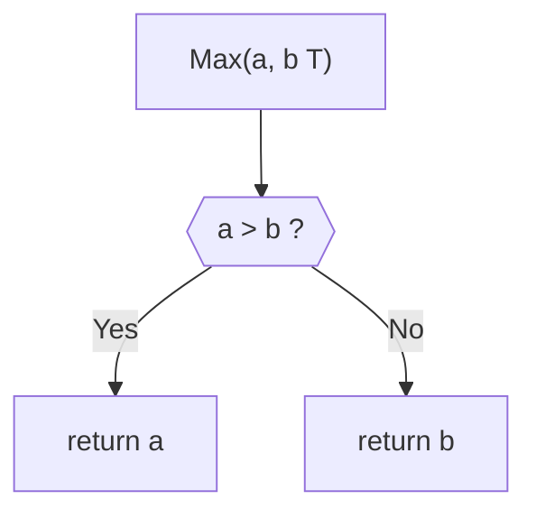
```mermaid
flowchart TD
    A["Max(a, b T)"] --> B{{"a > b ?"}}
    B -- Yes --> C["return a"]
    B -- No --> D["return b"]
```

### Interviewer Questions
1. Why can't we use `comparable` instead of `Ordered` here?
2. What happens if `T = float64` and one argument is `NaN`?
3. How does the `~` (tilde) operator change the constraint semantics?
4. Can this function work with a custom type like `type Celsius float64`? Why?
5. How would you extend `Max` to accept a variadic number of arguments?
6. What is the difference between `constraints.Ordered` from `x/exp` and a hand-rolled version?
7. Is there a way to make `Max` work for types that define a custom `Less` method instead of `>`?

### Follow-Up Questions
- **Q1:** How would you write `Min[T Ordered]`?
- **Q2:** Write `Clamp[T Ordered](val, lo, hi T) T` that clamps a value between lo and hi.
- **Q3:** How would you make Max work for a custom struct by accepting a comparator function?
- **Q4:** What if you need `Max` to return the index of the larger element, not the value?
- **Q5:** Can generics replace `interface{}` / `any` everywhere? Give a counter-example.

---

## Q2: Slice Contains  [Level 1 — Beginner]
> **Tags:** `#generics` `#slice` `#comparable` `#linear-search`

### Problem Statement
Write a generic function `Contains[T comparable](slice []T, target T) bool` that returns `true` if `target` exists in `slice`, `false` otherwise.

### Input / Output / Constraints
- **Input:** A slice of type `[]T` and a target value of type `T`
- **Output:** `true` if target is found, `false` otherwise
- **Constraints:** `T` must be `comparable` (supports `==`); slice may be nil or empty

### Thought Process
We need equality checking (`==`), so the `comparable` constraint is the right choice. Iterate through the slice; return `true` on first match. This is O(n) linear search — acceptable when the slice is unsorted. For sorted slices, binary search (Q9) is better.

### Brute Force
```go
// Without generics — type assertion at runtime
func ContainsAny(slice []any, target any) bool {
    for _, v := range slice {
        if v == target {
            return true
        }
    }
    return false
}
```
**Time:** O(n) | **Space:** O(1)

### Better Solution
```go
package main

func Contains[T comparable](slice []T, target T) bool {
    for _, v := range slice {
        if v == target {
            return true
        }
    }
    return false
}
```

### Best Solution
```go
package main

import "fmt"

func Contains[T comparable](slice []T, target T) bool {
    for _, v := range slice {
        if v == target {
            return true
        }
    }
    return false
}

func main() {
    fmt.Println(Contains([]int{1, 2, 3, 4}, 3))           // true
    fmt.Println(Contains([]string{"go", "rust", "c"}, "java")) // false
    fmt.Println(Contains([]float64{1.1, 2.2}, 3.3))        // false
    fmt.Println(Contains([]int{}, 5))                      // false (empty slice)
}
```
**Time:** O(n) | **Space:** O(1)

### Production Considerations
| Aspect | Details |
|--------|---------|
| Scalability | O(n) — fine for small slices; use a map or sorted slice + binary search for large sets |
| Edge Cases | Nil slice, empty slice, duplicate elements — all handled correctly |
| Error Handling | No error return needed; type constraint prevents misuse at compile time |
| Memory | No allocations; iterates by value copy |
| Concurrency | Stateless read-only function — safe for concurrent calls on different slices |

### Visual Explanation
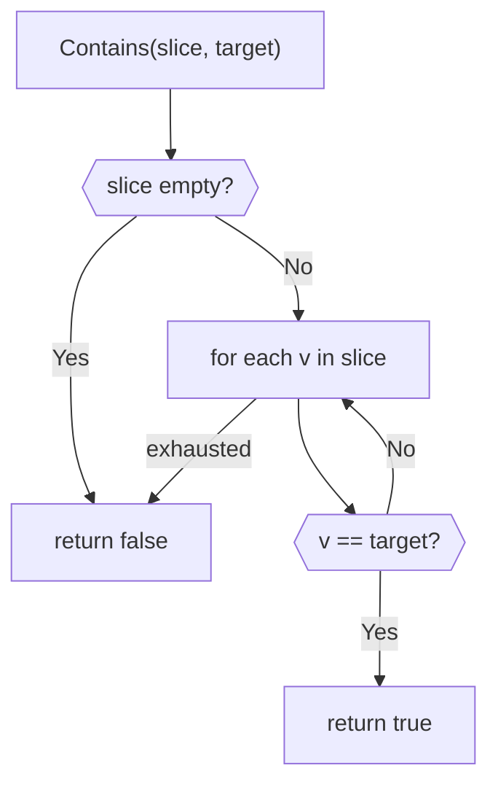
```mermaid
flowchart TD
    A["Contains(slice, target)"] --> B{{"slice empty?"}}
    B -- Yes --> F["return false"]
    B -- No --> C["for each v in slice"]
    C --> D{{"v == target?"}}
    D -- Yes --> E["return true"]
    D -- No --> C
    C -- exhausted --> F
```

### Interviewer Questions
1. Why is `comparable` the right constraint here instead of `Ordered`?
2. What types are NOT `comparable` in Go?
3. How would you write a `ContainsFunc[T any]` variant that takes a predicate?
4. What is the time complexity if the slice is sorted? How would you optimise?
5. How would `Contains` behave with pointer types? What does equality mean for pointers?
6. Could you implement `Contains` using `slices.Contains` from the standard library (Go 1.21+)?

### Follow-Up Questions
- **Q1:** Write `IndexOf[T comparable](slice []T, target T) int` returning the index or -1.
- **Q2:** Write `ContainsAll[T comparable](slice, targets []T) bool`.
- **Q3:** How would you turn `Contains` into an O(1) lookup using a generic set type?
- **Q4:** Write `Remove[T comparable](slice []T, target T) []T` removing the first occurrence.
- **Q5:** How would `Contains` need to change if `T` were a struct with unexported fields?

---

## Q3: Generic Pair Struct  [Level 1 — Beginner]
> **Tags:** `#generics` `#struct` `#type-parameters` `#tuple`

### Problem Statement
Define a generic struct `Pair[A, B any]` that holds two values of potentially different types. Implement a constructor `NewPair`, and methods `Swap() Pair[B, A]` and `String() string`.

### Input / Output / Constraints
- **Input:** Two values of types `A` and `B` (any types)
- **Output:** A `Pair` struct providing `.First`, `.Second`, `.Swap()`, and `.String()`
- **Constraints:** `A` and `B` can be any types including different types

### Thought Process
Go generics allow structs to have multiple type parameters. `Pair[A, B any]` is a heterogeneous two-tuple. The `Swap` method must return `Pair[B, A]` — note the reversed type parameters. `fmt.Sprintf` handles `%v` for any type, so no additional constraints are needed for `String()`.

### Brute Force
```go
// Without generics — separate structs or interface{}
type PairIntString struct {
    First  int
    Second string
}
// Need a new struct for every combination — not scalable
```
**Time:** O(1) | **Space:** O(1)

### Better Solution
```go
package main

import "fmt"

type Pair[A, B any] struct {
    First  A
    Second B
}

func (p Pair[A, B]) Swap() Pair[B, A] {
    return Pair[B, A]{First: p.Second, Second: p.First}
}
```

### Best Solution
```go
package main

import "fmt"

// Pair holds two values of potentially different types.
type Pair[A, B any] struct {
    First  A
    Second B
}

// NewPair constructs a Pair with type inference.
func NewPair[A, B any](a A, b B) Pair[A, B] {
    return Pair[A, B]{First: a, Second: b}
}

// Swap returns a new Pair with the values in reversed order.
func (p Pair[A, B]) Swap() Pair[B, A] {
    return Pair[B, A]{First: p.Second, Second: p.First}
}

// String satisfies fmt.Stringer.
func (p Pair[A, B]) String() string {
    return fmt.Sprintf("(%v, %v)", p.First, p.Second)
}

func main() {
    p := NewPair(42, "hello")
    fmt.Println(p)         // (42, hello)
    fmt.Println(p.Swap())  // (hello, 42)

    coords := NewPair(3.14, true)
    fmt.Println(coords)    // (3.14, true)
}
```
**Time:** O(1) | **Space:** O(1)

### Production Considerations
| Aspect | Details |
|--------|---------|
| Scalability | Fixed-size struct — O(1) time and space for all operations |
| Edge Cases | Nil pointers as A or B are valid — no nil checks needed unless dereferencing |
| Error Handling | Type safety at compile time; no runtime type assertions required |
| Memory | Two fields stored inline; no heap allocation for value types |
| Concurrency | Immutable after construction (no setters); safe to share across goroutines |

### Visual Explanation
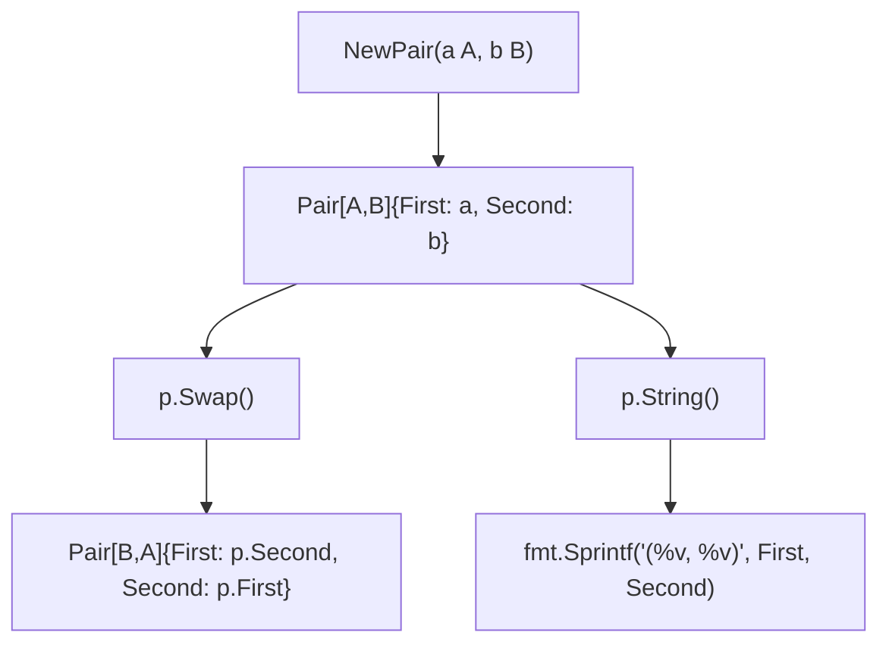
```mermaid
flowchart TD
    A["NewPair(a A, b B)"] --> B["Pair[A,B]{First: a, Second: b}"]
    B --> C["p.Swap()"]
    C --> D["Pair[B,A]{First: p.Second, Second: p.First}"]
    B --> E["p.String()"]
    E --> F["fmt.Sprintf('(%v, %v)', First, Second)"]
```

### Interviewer Questions
1. Why does `Swap()` return `Pair[B, A]` and not `Pair[A, B]`?
2. Can you add a method that compares two `Pair` values for equality? What constraint would you need?
3. What is the difference between `any` and `comparable` as constraints here?
4. How would you implement a `Triple[A, B, C any]`?
5. Go does not support generic methods with new type parameters. How does that affect adding a `Map` method to Pair?
6. How would you serialise `Pair` to JSON? What limitations exist?
7. Can `Pair` be used as a map key? Under what condition?

### Follow-Up Questions
- **Q1:** Write `Pairs[A, B any](as []A, bs []B) []Pair[A, B]` zipping two slices.
- **Q2:** Add an `Equal` method — what constraint must you add?
- **Q3:** Implement `Pair.Map[C any](f func(A) C) Pair[C, B]` — why must `Map` be a standalone function rather than a method?
- **Q4:** How would you implement a generic `Triple` and a `Tuple` of arbitrary arity in Go?
- **Q5:** Can `Pair[int, string]` be used as a map key in Go? Show an example.

---

## Q4: Generic Stack  [Level 2 — Easy]
> **Tags:** `#generics` `#stack` `#data-structure` `#LIFO`

### Problem Statement
Implement a generic `Stack[T any]` with methods:
- `Push(v T)` — add element to top
- `Pop() (T, bool)` — remove and return top element; bool is false if empty
- `Peek() (T, bool)` — return top element without removing; bool is false if empty
- `Size() int` — number of elements
- `IsEmpty() bool`

### Input / Output / Constraints
- **Input:** Any sequence of Push/Pop/Peek calls with elements of type `T`
- **Output:** LIFO ordering; Pop/Peek return zero value + false when empty
- **Constraints:** T is `any`; stack grows dynamically; thread-safety not required unless stated

### Thought Process
A slice is the natural backing for a Go stack. `Push` appends to the tail; `Pop` removes the last element. Returning `(T, bool)` instead of `(T, error)` is idiomatic Go for "value may be absent" — mirrors `map` lookups. The zero value of `T` is returned via `var zero T` when the stack is empty.

### Brute Force
```go
// Without generics — interface{} based
type Stack struct{ data []interface{} }

func (s *Stack) Push(v interface{}) { s.data = append(s.data, v) }
func (s *Stack) Pop() interface{} {
    if len(s.data) == 0 { return nil }
    v := s.data[len(s.data)-1]
    s.data = s.data[:len(s.data)-1]
    return v
}
```
**Time:** O(1) amortised | **Space:** O(n)

### Better Solution
```go
package main

type Stack[T any] struct {
    data []T
}

func (s *Stack[T]) Push(v T)          { s.data = append(s.data, v) }
func (s *Stack[T]) Size() int         { return len(s.data) }
func (s *Stack[T]) IsEmpty() bool     { return len(s.data) == 0 }

func (s *Stack[T]) Pop() (T, bool) {
    if s.IsEmpty() {
        var zero T
        return zero, false
    }
    v := s.data[len(s.data)-1]
    s.data = s.data[:len(s.data)-1]
    return v, true
}
```

### Best Solution
```go
package main

import "fmt"

// Stack[T] is a generic last-in-first-out data structure.
type Stack[T any] struct {
    data []T
}

func (s *Stack[T]) Push(v T) {
    s.data = append(s.data, v)
}

func (s *Stack[T]) Pop() (T, bool) {
    if s.IsEmpty() {
        var zero T
        return zero, false
    }
    top := s.data[len(s.data)-1]
    s.data = s.data[:len(s.data)-1]
    return top, true
}

func (s *Stack[T]) Peek() (T, bool) {
    if s.IsEmpty() {
        var zero T
        return zero, false
    }
    return s.data[len(s.data)-1], true
}

func (s *Stack[T]) Size() int     { return len(s.data) }
func (s *Stack[T]) IsEmpty() bool { return len(s.data) == 0 }

func main() {
    var s Stack[int]
    s.Push(10)
    s.Push(20)
    s.Push(30)

    if top, ok := s.Peek(); ok {
        fmt.Println("Top:", top) // Top: 30
    }

    for !s.IsEmpty() {
        v, _ := s.Pop()
        fmt.Println("Popped:", v) // 30, 20, 10
    }

    _, ok := s.Pop()
    fmt.Println("Empty pop ok:", ok) // false
}
```
**Time:** Push O(1) amortised, Pop O(1), Peek O(1) | **Space:** O(n)

### Production Considerations
| Aspect | Details |
|--------|---------|
| Scalability | Backed by a slice; Go doubles capacity on growth — amortised O(1) push |
| Edge Cases | Pop/Peek on empty stack returns zero value + false; never panics |
| Error Handling | Bool return instead of error for idiomatic "optional" semantics |
| Memory | Slice may retain references after Pop — set `s.data[len] = zero` to avoid memory leaks for pointer types |
| Concurrency | Not thread-safe; wrap with `sync.Mutex` or use a channel-based design for concurrent access |

### Visual Explanation
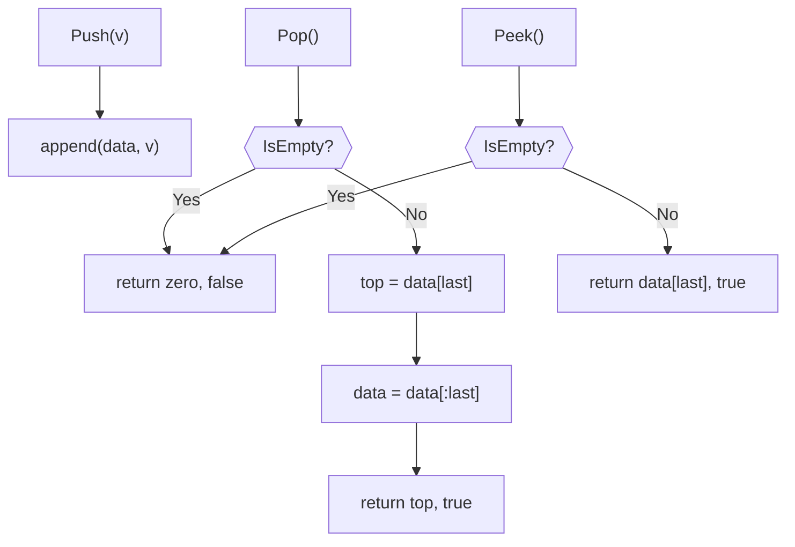
```mermaid
flowchart TD
    A["Push(v)"] --> B["append(data, v)"]
    C["Pop()"] --> D{{"IsEmpty?"}}
    D -- Yes --> E["return zero, false"]
    D -- No --> F["top = data[last]"]
    F --> G["data = data[:last]"]
    G --> H["return top, true"]
    I["Peek()"] --> D2{{"IsEmpty?"}}
    D2 -- Yes --> E
    D2 -- No --> J["return data[last], true"]
```

### Interviewer Questions
1. Why do `Pop` and `Peek` return `(T, bool)` instead of `(T, error)`?
2. How would you make the stack thread-safe?
3. What memory leak can occur when popping pointer types from a slice-backed stack? How do you fix it?
4. What is the amortised time complexity of `Push`? Why?
5. How would you implement a `Min-Stack` that also tracks the minimum in O(1)?
6. Can you implement the stack using a linked list instead? What are the trade-offs?
7. How would you serialise the stack to JSON?

### Follow-Up Questions
- **Q1:** Implement a thread-safe `Stack[T]` using `sync.Mutex`.
- **Q2:** Implement a `MinStack[T Ordered]` that supports `Min() T` in O(1).
- **Q3:** Implement `Stack.ToSlice() []T` returning elements from bottom to top.
- **Q4:** Use the stack to implement bracket matching for `"()[]{}"` strings.
- **Q5:** Implement a stack that has a maximum capacity and returns an error on overflow.

---

## Q5: Generic Queue  [Level 2 — Easy]
> **Tags:** `#generics` `#queue` `#data-structure` `#FIFO`

### Problem Statement
Implement a generic `Queue[T any]` with methods:
- `Enqueue(v T)` — add element to the back
- `Dequeue() (T, bool)` — remove and return front element
- `Front() (T, bool)` — peek at front without removing
- `Size() int`
- `IsEmpty() bool`

### Input / Output / Constraints
- **Input:** Any sequence of Enqueue/Dequeue calls
- **Output:** FIFO ordering; Dequeue/Front return zero + false if empty
- **Constraints:** T is `any`; avoid O(n) per dequeue

### Thought Process
A naive slice queue shifts elements on dequeue — O(n). Two common approaches: (1) use a head index to avoid shifts — O(1) dequeue at the cost of some wasted memory; (2) use `container/ring` or a linked-list-based circular buffer. For most practical purposes, the head-index approach is clearest. Go's `container/list` can also back a queue but involves heap allocation per node.

### Brute Force
```go
// Naive — O(n) dequeue due to slice re-slicing and copy
type Queue[T any] struct{ data []T }

func (q *Queue[T]) Enqueue(v T) { q.data = append(q.data, v) }
func (q *Queue[T]) Dequeue() (T, bool) {
    if len(q.data) == 0 { var z T; return z, false }
    v := q.data[0]
    q.data = q.data[1:] // O(n) — underlying array not freed
    return v, true
}
```
**Time:** Enqueue O(1), Dequeue O(n) | **Space:** O(n)

### Better Solution
```go
// Head-index approach — O(1) dequeue, periodic compaction
type Queue[T any] struct {
    data []T
    head int
}

func (q *Queue[T]) Enqueue(v T) { q.data = append(q.data, v) }
func (q *Queue[T]) Size() int   { return len(q.data) - q.head }

func (q *Queue[T]) Dequeue() (T, bool) {
    if q.Size() == 0 { var z T; return z, false }
    v := q.data[q.head]
    q.head++
    // Compact when head > half the slice length
    if q.head > len(q.data)/2 {
        copy(q.data, q.data[q.head:])
        q.data = q.data[:q.Size()]
        q.head = 0
    }
    return v, true
}
```

### Best Solution
```go
package main

import "fmt"

// Queue[T] is a generic first-in-first-out data structure.
type Queue[T any] struct {
    data []T
    head int
}

func (q *Queue[T]) Enqueue(v T) {
    q.data = append(q.data, v)
}

func (q *Queue[T]) Size() int     { return len(q.data) - q.head }
func (q *Queue[T]) IsEmpty() bool { return q.Size() == 0 }

func (q *Queue[T]) Dequeue() (T, bool) {
    if q.IsEmpty() {
        var zero T
        return zero, false
    }
    v := q.data[q.head]
    var zero T
    q.data[q.head] = zero // clear reference to help GC
    q.head++
    if q.head*2 > len(q.data) {
        q.data = q.data[q.head:]
        q.head = 0
    }
    return v, true
}

func (q *Queue[T]) Front() (T, bool) {
    if q.IsEmpty() {
        var zero T
        return zero, false
    }
    return q.data[q.head], true
}

func main() {
    var q Queue[string]
    q.Enqueue("first")
    q.Enqueue("second")
    q.Enqueue("third")

    if front, ok := q.Front(); ok {
        fmt.Println("Front:", front) // first
    }

    for !q.IsEmpty() {
        v, _ := q.Dequeue()
        fmt.Println("Dequeued:", v) // first, second, third
    }
}
```
**Time:** Enqueue O(1) amortised, Dequeue O(1) amortised | **Space:** O(n)

### Production Considerations
| Aspect | Details |
|--------|---------|
| Scalability | Head-index approach avoids O(n) shifts; compaction keeps memory bounded |
| Edge Cases | Dequeue/Front on empty queue; compaction threshold tunable |
| Error Handling | Bool return for empty-queue signal; no panics |
| Memory | Zeroing dequeued slot prevents pointer/interface memory leaks |
| Concurrency | Not thread-safe; use `sync.Mutex` or channel-based queue for concurrent producers/consumers |

### Visual Explanation
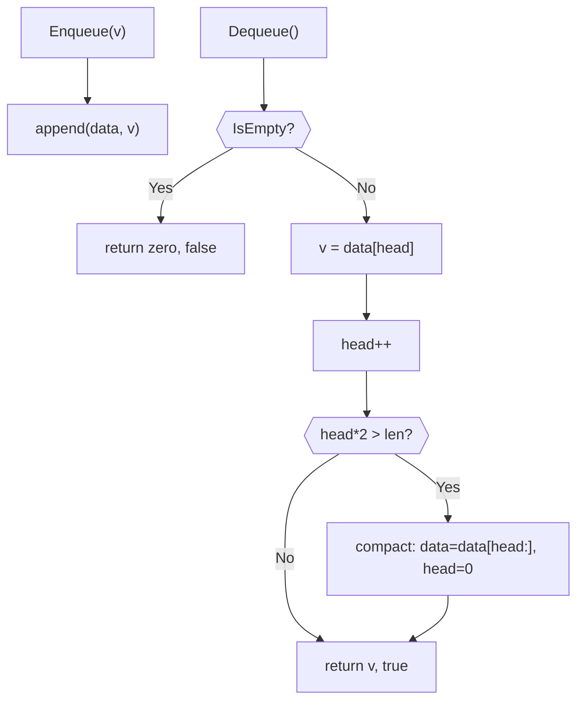
```mermaid
flowchart TD
    A["Enqueue(v)"] --> B["append(data, v)"]
    C["Dequeue()"] --> D{{"IsEmpty?"}}
    D -- Yes --> E["return zero, false"]
    D -- No --> F["v = data[head]"]
    F --> G["head++"]
    G --> H{{"head*2 > len?"}}
    H -- Yes --> I["compact: data=data[head:], head=0"]
    H -- No --> J["return v, true"]
    I --> J
```

### Interviewer Questions
1. Why does the naive `data[1:]` approach leak memory?
2. What is the compaction heuristic and why is it needed?
3. How does zeroing the dequeued slot help the garbage collector?
4. How would you implement a circular buffer queue with a fixed capacity?
5. Compare queue backed by a slice vs. `container/list` — when would you prefer each?
6. How would you implement a priority queue using generics?
7. How would you build a thread-safe, bounded queue suitable for a worker pool?

### Follow-Up Questions
- **Q1:** Implement `Queue.ToSlice() []T` returning elements in FIFO order.
- **Q2:** Implement a thread-safe queue using a `sync.Mutex`.
- **Q3:** Implement a `PriorityQueue[T any]` using a `LessFn func(a, b T) bool`.
- **Q4:** Implement a deque (double-ended queue) `Deque[T any]` supporting front and back operations.
- **Q5:** How would you use a `Queue[T]` to implement BFS on a generic graph?

---

## Q6: Generic Map Function  [Level 2 — Easy]
> **Tags:** `#generics` `#functional` `#higher-order` `#transform`

### Problem Statement
Write a generic `Map[T, U any](slice []T, f func(T) U) []U` function that transforms each element of a slice using a function `f`, returning a new slice of the transformed values.

### Input / Output / Constraints
- **Input:** A slice `[]T` and a function `f func(T) U`
- **Output:** A new slice `[]U` of the same length
- **Constraints:** T and U are `any`; input slice may be nil or empty; original slice must not be mutated

### Thought Process
This is the classic `map` operation from functional programming. Go generics allow both input and output types to be parameterised. Pre-allocate the result slice with `make([]U, len(slice))` to avoid repeated allocations. Note that Go does not support adding new type parameters to methods, so `Map` must be a standalone function rather than a method on a collection type.

### Brute Force
```go
// Without generics — requires type assertion at call site
func MapAny(slice []any, f func(any) any) []any {
    result := make([]any, len(slice))
    for i, v := range slice {
        result[i] = f(v)
    }
    return result
}
```
**Time:** O(n) | **Space:** O(n)

### Better Solution
```go
package main

func Map[T, U any](slice []T, f func(T) U) []U {
    result := make([]U, len(slice))
    for i, v := range slice {
        result[i] = f(v)
    }
    return result
}
```

### Best Solution
```go
package main

import (
    "fmt"
    "strconv"
    "strings"
)

// Map applies f to every element of slice and returns a new slice of results.
func Map[T, U any](slice []T, f func(T) U) []U {
    if slice == nil {
        return nil
    }
    result := make([]U, len(slice))
    for i, v := range slice {
        result[i] = f(v)
    }
    return result
}

func main() {
    // int -> string
    nums := []int{1, 2, 3, 4, 5}
    strs := Map(nums, strconv.Itoa)
    fmt.Println(strs) // [1 2 3 4 5]

    // string -> string (upper case)
    words := []string{"go", "is", "fun"}
    upper := Map(words, strings.ToUpper)
    fmt.Println(upper) // [GO IS FUN]

    // int -> int (square)
    squares := Map(nums, func(n int) int { return n * n })
    fmt.Println(squares) // [1 4 9 16 25]
}
```
**Time:** O(n) | **Space:** O(n)

### Production Considerations
| Aspect | Details |
|--------|---------|
| Scalability | Linear in input size; pre-allocation avoids incremental growth cost |
| Edge Cases | Nil input slice returns nil (not empty slice) — consistent with Go slice semantics |
| Error Handling | `f` may panic; consider a `MapE[T, U any](slice []T, f func(T) (U, error)) ([]U, error)` variant |
| Memory | New slice allocated — caller owns the result; original slice untouched |
| Concurrency | Stateless when `f` is pure; for parallel Map see `errgroup` + goroutine fan-out |

### Visual Explanation
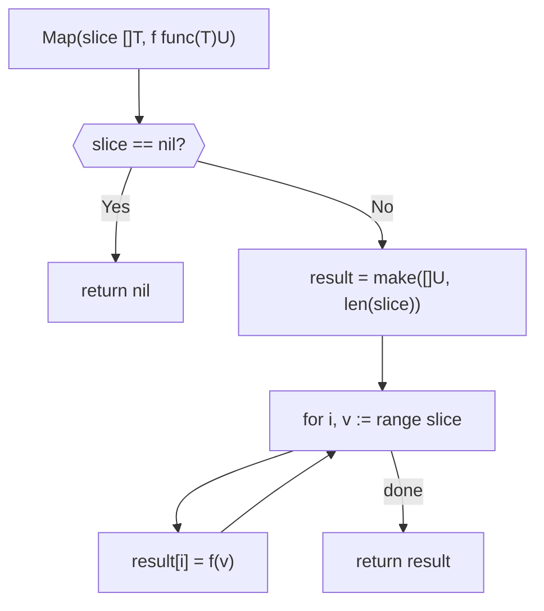
```mermaid
flowchart TD
    A["Map(slice []T, f func(T)U)"] --> B{{"slice == nil?"}}
    B -- Yes --> C["return nil"]
    B -- No --> D["result = make([]U, len(slice))"]
    D --> E["for i, v := range slice"]
    E --> F["result[i] = f(v)"]
    F --> E
    E -- done --> G["return result"]
```

### Interviewer Questions
1. Why can't `Map` be a method on a generic slice type in Go?
2. How would you implement a parallel version of `Map` using goroutines?
3. What is the difference between `Map` and `MapE` (error-returning variant)?
4. How does pre-allocation with `make` improve performance compared to `append`?
5. Can `Map` be composed with `Filter` (Q7)? Show an example pipeline.
6. How would you implement `FlatMap[T, U any]`?

### Follow-Up Questions
- **Q1:** Implement `MapE[T, U any](slice []T, f func(T) (U, error)) ([]U, error)`.
- **Q2:** Implement a parallel `ParallelMap[T, U any]` using goroutines and `sync.WaitGroup`.
- **Q3:** Implement `FlatMap[T, U any](slice []T, f func(T) []U) []U`.
- **Q4:** Compose `Map` and `Filter` to square only even numbers in a slice.
- **Q5:** How would you implement a lazy `Map` returning an iterator instead of a materialised slice?

---

## Q7: Generic Filter Function  [Level 2 — Easy]
> **Tags:** `#generics` `#functional` `#predicate` `#slice`

### Problem Statement
Write a generic `Filter[T any](slice []T, predicate func(T) bool) []T` function that returns a new slice containing only the elements for which `predicate` returns `true`.

### Input / Output / Constraints
- **Input:** A slice `[]T` and a predicate function
- **Output:** A new slice with only matching elements; order preserved
- **Constraints:** T is `any`; result may be empty; original slice is not modified

### Thought Process
Iterate over the input, apply the predicate, and append matches to a result slice. Since we don't know the final size, `append` is used. As an optimisation, we can pre-allocate with `make([]T, 0, len(slice))` to reserve capacity while keeping length zero. This avoids the most expensive early re-allocations.

### Brute Force
```go
// Without generics
func FilterInts(nums []int, pred func(int) bool) []int {
    var result []int
    for _, v := range nums {
        if pred(v) {
            result = append(result, v)
        }
    }
    return result
}
```
**Time:** O(n) | **Space:** O(n) worst case

### Better Solution
```go
package main

func Filter[T any](slice []T, predicate func(T) bool) []T {
    result := make([]T, 0, len(slice))
    for _, v := range slice {
        if predicate(v) {
            result = append(result, v)
        }
    }
    return result
}
```

### Best Solution
```go
package main

import "fmt"

// Filter returns a new slice containing only elements for which predicate is true.
func Filter[T any](slice []T, predicate func(T) bool) []T {
    if slice == nil {
        return nil
    }
    result := make([]T, 0, len(slice))
    for _, v := range slice {
        if predicate(v) {
            result = append(result, v)
        }
    }
    return result
}

func main() {
    nums := []int{1, 2, 3, 4, 5, 6, 7, 8, 9, 10}

    evens := Filter(nums, func(n int) bool { return n%2 == 0 })
    fmt.Println("Evens:", evens) // [2 4 6 8 10]

    odds := Filter(nums, func(n int) bool { return n%2 != 0 })
    fmt.Println("Odds:", odds) // [1 3 5 7 9]

    words := []string{"apple", "bat", "cherry", "date"}
    long := Filter(words, func(s string) bool { return len(s) > 4 })
    fmt.Println("Long words:", long) // [apple cherry]
}
```
**Time:** O(n) | **Space:** O(n) worst case (all elements match)

### Production Considerations
| Aspect | Details |
|--------|---------|
| Scalability | Linear scan; pre-allocated capacity reduces re-allocations |
| Edge Cases | Nil input returns nil; empty input returns empty slice; no matches returns empty slice |
| Error Handling | Predicate panics bubble up; consider `FilterE` for fallible predicates |
| Memory | Result capacity is `len(slice)` in worst case — can call `result = result[:len(result):len(result)]` to trim |
| Concurrency | Pure if predicate is pure; goroutine fan-out possible for CPU-bound predicates |

### Visual Explanation
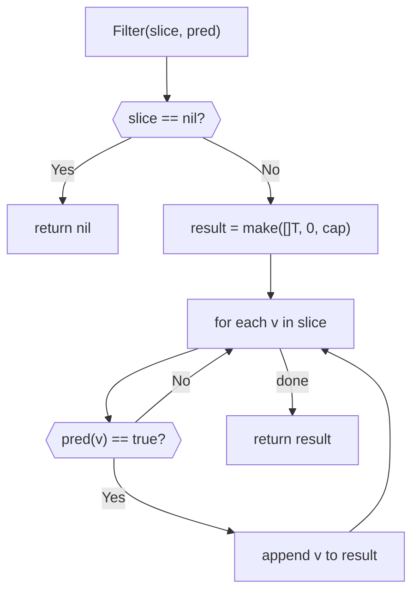
```mermaid
flowchart TD
    A["Filter(slice, pred)"] --> B{{"slice == nil?"}}
    B -- Yes --> C["return nil"]
    B -- No --> D["result = make([]T, 0, cap)"]
    D --> E["for each v in slice"]
    E --> F{{"pred(v) == true?"}}
    F -- Yes --> G["append v to result"]
    F -- No --> E
    G --> E
    E -- done --> H["return result"]
```

### Interviewer Questions
1. Why pre-allocate with `make([]T, 0, len(slice))` instead of `var result []T`?
2. How do you trim excess capacity from the result slice?
3. How would you implement `Partition[T any]` — splitting into matching and non-matching slices?
4. How does `Filter` compose with `Map` (Q6) and `Reduce` (Q8)?
5. What are the performance implications of filtering a very large slice?
6. How would you implement in-place filtering without allocating a new slice?

### Follow-Up Questions
- **Q1:** Implement `Partition[T any](slice []T, pred func(T) bool) ([]T, []T)`.
- **Q2:** Implement `FilterMap[T, U any]` — filter and transform in a single pass.
- **Q3:** Write a pipeline: filter even numbers, then square them, using `Filter` + `Map`.
- **Q4:** Implement in-place `FilterInPlace[T any]` that avoids allocating a new slice.
- **Q5:** How would you implement a lazy `Filter` returning an iterator for memory efficiency?

---

## Q8: Generic Reduce / Fold  [Level 3 — Medium]
> **Tags:** `#generics` `#functional` `#reduce` `#accumulator`

### Problem Statement
Write a generic `Reduce[T, A any](slice []T, initial A, f func(acc A, val T) A) A` that folds a slice into a single accumulated value using function `f`.

### Input / Output / Constraints
- **Input:** A slice `[]T`, an initial accumulator of type `A`, and a combining function
- **Output:** The final accumulated value of type `A`
- **Constraints:** T and A can be different types; empty slice returns `initial`

### Thought Process
`Reduce` (also called `fold-left`) processes elements left-to-right, threading an accumulator through each step. The key insight is that `T` (element type) and `A` (accumulator type) can differ — e.g., summing `[]string` lengths into an `int`. This two-type-parameter design is more powerful than a same-type fold.

### Brute Force
```go
// Without generics — sum of ints only
func SumInts(nums []int) int {
    total := 0
    for _, v := range nums {
        total += v
    }
    return total
}
```
**Time:** O(n) | **Space:** O(1)

### Better Solution
```go
package main

func Reduce[T, A any](slice []T, initial A, f func(A, T) A) A {
    acc := initial
    for _, v := range slice {
        acc = f(acc, v)
    }
    return acc
}
```

### Best Solution
```go
package main

import "fmt"

// Reduce folds slice into a single value using f, starting from initial.
func Reduce[T, A any](slice []T, initial A, f func(acc A, val T) A) A {
    acc := initial
    for _, v := range slice {
        acc = f(acc, v)
    }
    return acc
}

func main() {
    nums := []int{1, 2, 3, 4, 5}

    // Sum
    sum := Reduce(nums, 0, func(acc, v int) int { return acc + v })
    fmt.Println("Sum:", sum) // 15

    // Product
    product := Reduce(nums, 1, func(acc, v int) int { return acc * v })
    fmt.Println("Product:", product) // 120

    // Concatenate string lengths
    words := []string{"hello", "world", "go"}
    totalLen := Reduce(words, 0, func(acc int, s string) int { return acc + len(s) })
    fmt.Println("Total length:", totalLen) // 12

    // Build a map from a slice
    freq := Reduce([]string{"a", "b", "a", "c", "b", "a"},
        map[string]int{},
        func(acc map[string]int, s string) map[string]int {
            acc[s]++
            return acc
        })
    fmt.Println("Frequency:", freq) // map[a:3 b:2 c:1]
}
```
**Time:** O(n) | **Space:** O(1) for simple accumulators; O(n) if accumulator grows (e.g. map)

### Production Considerations
| Aspect | Details |
|--------|---------|
| Scalability | Single pass — O(n); no additional allocations for scalar accumulators |
| Edge Cases | Nil or empty slice returns `initial` unchanged |
| Error Handling | Consider `ReduceE` variant returning `(A, error)` for fallible combiners |
| Memory | Accumulator type A controls memory; passing maps/slices by value is idiomatic but caller must be careful with mutation |
| Concurrency | Sequential by design; parallel fold (tree-reduction) requires associativity guarantee on `f` |

### Visual Explanation
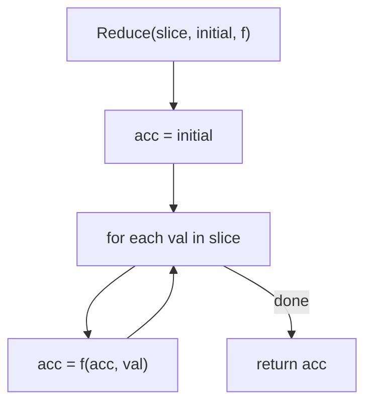
```mermaid
flowchart TD
    A["Reduce(slice, initial, f)"] --> B["acc = initial"]
    B --> C["for each val in slice"]
    C --> D["acc = f(acc, val)"]
    D --> C
    C -- done --> E["return acc"]
```

### Interviewer Questions
1. Why does `Reduce` have two type parameters `T` and `A` instead of one?
2. What mathematical property must `f` have for a parallel (tree) fold to produce the same result?
3. How would you implement `ReduceRight` (right fold)?
4. How does `Reduce` subsume both `Map` and `Filter`? Show an example.
5. When would you prefer `Reduce` over an explicit `for` loop?
6. What is the difference between `fold-left` and `fold-right` in terms of stack usage?
7. How would you implement a `ReduceE` that short-circuits on the first error?

### Follow-Up Questions
- **Q1:** Use `Reduce` to implement `Sum[T Ordered]` and `Max[T Ordered]`.
- **Q2:** Use `Reduce` to implement `GroupBy[T any, K comparable]`.
- **Q3:** Implement `ReduceRight[T, A any]` (right fold).
- **Q4:** Implement `Scan[T, A any]` — like Reduce but returns all intermediate accumulators.
- **Q5:** Implement a parallel `Reduce` using goroutines and a merge function, assuming `f` is associative.

---

## Q9: Generic Binary Search  [Level 3 — Medium]
> **Tags:** `#generics` `#binary-search` `#ordered` `#sorted-slice`

### Problem Statement
Write a generic `BinarySearch[T Ordered](sorted []T, target T) (index int, found bool)` that performs binary search on a sorted slice and returns the index of `target` or `-1` with `false` if not present.

### Input / Output / Constraints
- **Input:** A sorted slice `[]T` in ascending order and a target value
- **Output:** `(index, true)` if found; `(-1, false)` if not found
- **Constraints:** Slice must be sorted ascending; T must be `Ordered`

### Thought Process
Classic divide-and-conquer: maintain `lo` and `hi` indices; compare `mid` element to target. If `slice[mid] == target`, return mid. If `slice[mid] < target`, search right half; else search left half. The loop terminates when `lo > hi`. Two-type parameters are not needed here since both input and target are the same type `T`.

### Brute Force
```go
// Linear search — O(n)
func LinearSearch[T comparable](slice []T, target T) (int, bool) {
    for i, v := range slice {
        if v == target {
            return i, true
        }
    }
    return -1, false
}
```
**Time:** O(n) | **Space:** O(1)

### Better Solution
```go
package main

type Ordered interface {
    ~int | ~int8 | ~int16 | ~int32 | ~int64 |
        ~uint | ~uint8 | ~uint16 | ~uint32 | ~uint64 | ~uintptr |
        ~float32 | ~float64 | ~string
}

func BinarySearch[T Ordered](sorted []T, target T) (int, bool) {
    lo, hi := 0, len(sorted)-1
    for lo <= hi {
        mid := lo + (hi-lo)/2
        switch {
        case sorted[mid] == target:
            return mid, true
        case sorted[mid] < target:
            lo = mid + 1
        default:
            hi = mid - 1
        }
    }
    return -1, false
}
```

### Best Solution
```go
package main

import "fmt"

type Ordered interface {
    ~int | ~int8 | ~int16 | ~int32 | ~int64 |
        ~uint | ~uint8 | ~uint16 | ~uint32 | ~uint64 | ~uintptr |
        ~float32 | ~float64 | ~string
}

// BinarySearch searches sorted slice for target.
// Returns (index, true) if found, (-1, false) otherwise.
// The slice must be sorted in ascending order.
func BinarySearch[T Ordered](sorted []T, target T) (int, bool) {
    lo, hi := 0, len(sorted)-1
    for lo <= hi {
        mid := lo + (hi-lo)/2 // avoids integer overflow
        switch {
        case sorted[mid] == target:
            return mid, true
        case sorted[mid] < target:
            lo = mid + 1
        default:
            hi = mid - 1
        }
    }
    return -1, false
}

func main() {
    ints := []int{1, 3, 5, 7, 9, 11, 13}
    idx, ok := BinarySearch(ints, 7)
    fmt.Printf("Found 7 at index %d: %v\n", idx, ok) // 3: true

    idx, ok = BinarySearch(ints, 6)
    fmt.Printf("Found 6 at index %d: %v\n", idx, ok) // -1: false

    strs := []string{"apple", "banana", "cherry", "date"}
    idx, ok = BinarySearch(strs, "cherry")
    fmt.Printf("Found cherry at index %d: %v\n", idx, ok) // 2: true
}
```
**Time:** O(log n) | **Space:** O(1)

### Production Considerations
| Aspect | Details |
|--------|---------|
| Scalability | O(log n) — efficient for large sorted datasets |
| Edge Cases | Empty slice, single-element slice, target smaller/larger than all elements — all handled by `lo > hi` termination |
| Error Handling | Undefined behaviour if slice is not sorted; consider adding a debug assertion |
| Memory | No allocations — purely index arithmetic |
| Concurrency | Read-only — safe for concurrent use if the slice is not mutated concurrently |

### Visual Explanation
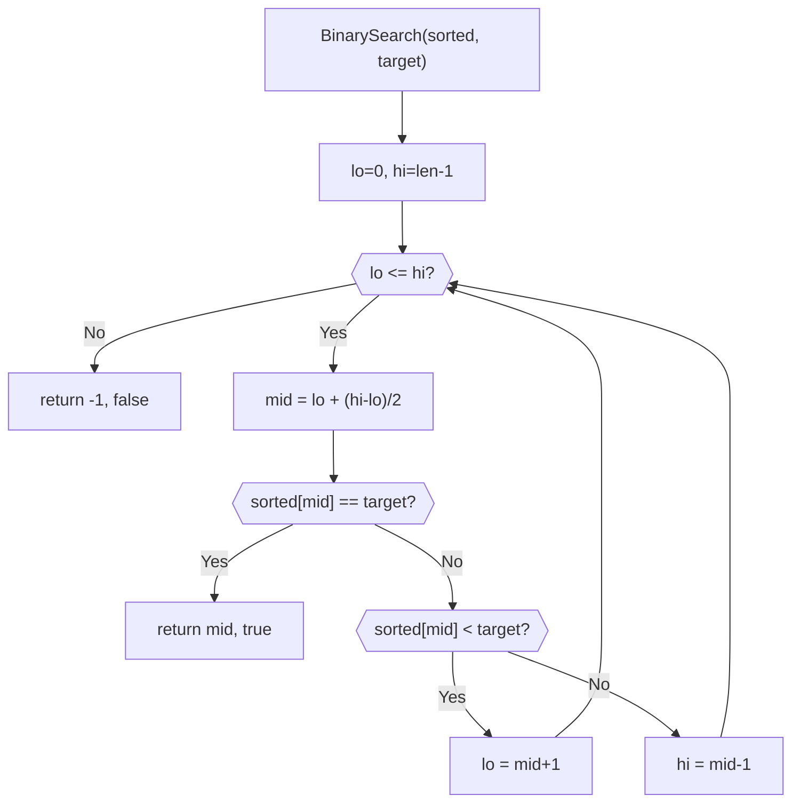
```mermaid
flowchart TD
    A["BinarySearch(sorted, target)"] --> B["lo=0, hi=len-1"]
    B --> C{{"lo <= hi?"}}
    C -- No --> D["return -1, false"]
    C -- Yes --> E["mid = lo + (hi-lo)/2"]
    E --> F{{"sorted[mid] == target?"}}
    F -- Yes --> G["return mid, true"]
    F -- No --> H{{"sorted[mid] < target?"}}
    H -- Yes --> I["lo = mid+1"]
    H -- No --> J["hi = mid-1"]
    I --> C
    J --> C
```

### Interviewer Questions
1. Why use `mid = lo + (hi-lo)/2` instead of `(lo+hi)/2`?
2. How would you modify `BinarySearch` to return the insertion point (lower bound) instead of just found/not-found?
3. What happens if the slice contains duplicate target values? Which index is returned?
4. How would you write `BinarySearchFunc[T any]` taking a custom comparator?
5. What is the difference between `sort.Search` in the standard library and this implementation?
6. How does binary search on strings compare lexicographically — is that always the desired behaviour?

### Follow-Up Questions
- **Q1:** Implement `LowerBound[T Ordered]` returning the first index where `target` could be inserted.
- **Q2:** Implement `UpperBound[T Ordered]` returning the last index + 1 for target.
- **Q3:** Implement `BinarySearchFunc[T any](sorted []T, cmp func(T) int) (int, bool)`.
- **Q4:** Use binary search to find the square root of a float64 to N decimal places.
- **Q5:** How would you apply binary search to a rotated sorted array?

---

## Q10: Generic Min/Max with ~ Constraint  [Level 3 — Medium]
> **Tags:** `#generics` `#constraints` `#tilde` `#underlying-type` `#min-max`

### Problem Statement
Define a `Number` constraint using `~int | ~float64` and implement `MinOf[T Number](vals ...T) T` and `MaxOf[T Number](vals ...T) T` that work on variadic arguments, including custom types with `int` or `float64` as underlying types.

### Input / Output / Constraints
- **Input:** One or more values of type `T` (variadic)
- **Output:** The minimum or maximum value
- **Constraints:** T must satisfy `~int | ~float64`; panics if called with zero arguments

### Thought Process
The `~` (tilde) operator in a constraint means "any type whose underlying type is X". So `~int` matches `int` and also `type Celsius int`, `type UserID int`, etc. A variadic function accepts zero or more args; we panic on zero args because there is no sensible zero value to return (unlike `Reduce` where an `initial` is provided).

### Brute Force
```go
// Without generics — separate functions
func MinInt(vals ...int) int {
    m := vals[0]
    for _, v := range vals[1:] {
        if v < m { m = v }
    }
    return m
}
```
**Time:** O(n) | **Space:** O(1)

### Better Solution
```go
package main

type Number interface{ ~int | ~float64 }

func MinOf[T Number](vals ...T) T {
    if len(vals) == 0 { panic("MinOf: no arguments") }
    m := vals[0]
    for _, v := range vals[1:] {
        if v < m { m = v }
    }
    return m
}
```

### Best Solution
```go
package main

import "fmt"

// Number permits int and float64 and any named types with those underlying types.
type Number interface {
    ~int | ~float64
}

// MinOf returns the smallest value among the provided arguments.
func MinOf[T Number](vals ...T) T {
    if len(vals) == 0 {
        panic("MinOf: called with no arguments")
    }
    min := vals[0]
    for _, v := range vals[1:] {
        if v < min {
            min = v
        }
    }
    return min
}

// MaxOf returns the largest value among the provided arguments.
func MaxOf[T Number](vals ...T) T {
    if len(vals) == 0 {
        panic("MaxOf: called with no arguments")
    }
    max := vals[0]
    for _, v := range vals[1:] {
        if v > max {
            max = v
        }
    }
    return max
}

// Custom type with int underlying type — works with Number constraint
type Score int

func main() {
    fmt.Println(MinOf(5, 3, 8, 1, 9))       // 1
    fmt.Println(MaxOf(5, 3, 8, 1, 9))       // 9
    fmt.Println(MinOf(3.14, 2.71, 1.41))    // 1.41
    fmt.Println(MaxOf(3.14, 2.71, 1.41))    // 3.14

    scores := []Score{90, 75, 88, 95, 60}
    fmt.Println(MinOf(scores...))           // 60
    fmt.Println(MaxOf(scores...))           // 95
}
```
**Time:** O(n) | **Space:** O(1)

### Production Considerations
| Aspect | Details |
|--------|---------|
| Scalability | Single pass — O(n) regardless of type |
| Edge Cases | Zero arguments: explicit panic with informative message; single argument returns itself |
| Error Handling | Panic is appropriate for programmer error (no args); production variant can return `(T, error)` |
| Memory | Variadic args create a slice — one allocation on the caller side |
| Concurrency | Stateless — safe for concurrent use |

### Visual Explanation
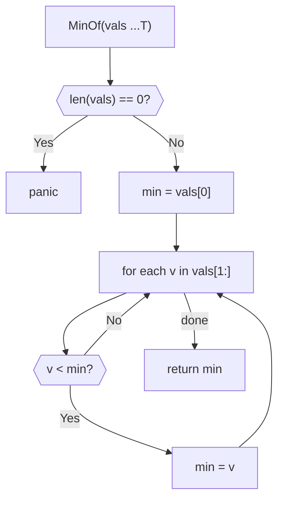
```mermaid
flowchart TD
    A["MinOf(vals ...T)"] --> B{{"len(vals) == 0?"}}
    B -- Yes --> C["panic"]
    B -- No --> D["min = vals[0]"]
    D --> E["for each v in vals[1:]"]
    E --> F{{"v < min?"}}
    F -- Yes --> G["min = v"]
    F -- No --> E
    G --> E
    E -- done --> H["return min"]
```

### Interviewer Questions
1. What is the difference between `~int` and `int` in a constraint?
2. Why doesn't `Number` include `~int32` or `~int64`? How would you extend it?
3. Why does `MinOf` panic instead of returning an error for zero arguments?
4. How would you make `MinOf` return `(T, bool)` to avoid panicking?
5. How does `MinOf(scores...)` work — what does the `...` do?
6. Can `Number` be used as a regular type (i.e., `var x Number`)? Why not?
7. How does Go 1.21's built-in `min` and `max` compare to this generic implementation?

### Follow-Up Questions
- **Q1:** Extend `Number` to include all integer and float types.
- **Q2:** Implement `Clamp[T Number](val, lo, hi T) T`.
- **Q3:** Implement `Sum[T Number](vals ...T) T`.
- **Q4:** Implement `Average[T Number](vals ...T) float64`.
- **Q5:** How would you write `ArgMin[T Number](vals ...T) (index int, min T)` returning both index and value?

---

## Q11: Custom Number Constraint Interface  [Level 3 — Medium]
> **Tags:** `#generics` `#constraints` `#interface` `#type-set` `#union`

### Problem Statement
Define a comprehensive `Number` constraint interface that covers all integer types (signed and unsigned), all float types, and `complex128`. Then write a generic `Sum[T Number](slice []T) T` function. Also demonstrate how to embed multiple constraint interfaces.

### Input / Output / Constraints
- **Input:** A slice of numeric values of type `T`
- **Output:** The sum of all elements as type `T`
- **Constraints:** T must satisfy the full `Number` constraint

### Thought Process
Go's type constraint interface uses union elements (`|`) to enumerate permitted types and the `~` prefix to include named types. Constraint interfaces can be embedded in other constraint interfaces — this allows composing `Integer`, `Float`, and `Complex` into a unified `Number`. Unlike regular interfaces, constraint-only interfaces cannot be used as variable types.

### Brute Force
```go
// Without constraints — reflect-based (slow, unsafe)
func SumReflect(slice interface{}) interface{} {
    // painful reflect code
    return nil
}
```
**Time:** O(n) | **Space:** O(1)

### Better Solution
```go
package main

type SignedInt interface {
    ~int | ~int8 | ~int16 | ~int32 | ~int64
}
type UnsignedInt interface {
    ~uint | ~uint8 | ~uint16 | ~uint32 | ~uint64 | ~uintptr
}
type Integer interface{ SignedInt | UnsignedInt }
type Float   interface{ ~float32 | ~float64 }
type Number  interface{ Integer | Float }

func Sum[T Number](slice []T) T {
    var total T
    for _, v := range slice {
        total += v
    }
    return total
}
```

### Best Solution
```go
package main

import "fmt"

// SignedInt covers all signed integer types and their named variants.
type SignedInt interface {
    ~int | ~int8 | ~int16 | ~int32 | ~int64
}

// UnsignedInt covers all unsigned integer types and their named variants.
type UnsignedInt interface {
    ~uint | ~uint8 | ~uint16 | ~uint32 | ~uint64 | ~uintptr
}

// Integer covers all integer types.
type Integer interface {
    SignedInt | UnsignedInt
}

// Float covers all floating-point types.
type Float interface {
    ~float32 | ~float64
}

// Complex covers complex number types.
type Complex interface {
    ~complex64 | ~complex128
}

// Number covers all numeric types.
type Number interface {
    Integer | Float | Complex
}

// Sum returns the sum of all elements in the slice.
func Sum[T Number](slice []T) T {
    var total T
    for _, v := range slice {
        total += v
    }
    return total
}

// type aliases to test ~ expansion
type Celsius float64
type UserID  uint32

func main() {
    fmt.Println(Sum([]int{1, 2, 3, 4, 5}))              // 15
    fmt.Println(Sum([]float64{1.1, 2.2, 3.3}))           // 6.6
    fmt.Println(Sum([]uint8{10, 20, 30}))                 // 60
    fmt.Println(Sum([]Celsius{36.6, 37.0, 36.8}))        // 110.4
    fmt.Println(Sum([]UserID{101, 202, 303}))             // 606

    c := []complex128{1 + 2i, 3 + 4i}
    fmt.Println(Sum(c)) // (4+6i)
}
```
**Time:** O(n) | **Space:** O(1)

### Production Considerations
| Aspect | Details |
|--------|---------|
| Scalability | O(n) single pass; zero value initialisation via `var total T` works for all numeric types |
| Edge Cases | Empty slice returns zero value of T; overflow possible for integer types — document maximum safe input size |
| Error Handling | No errors for pure sum; consider saturation arithmetic for overflow-sensitive domains |
| Memory | No heap allocation; total accumulated in a register-level variable |
| Concurrency | Stateless — multiple goroutines can call `Sum` concurrently on different slices |

### Visual Explanation
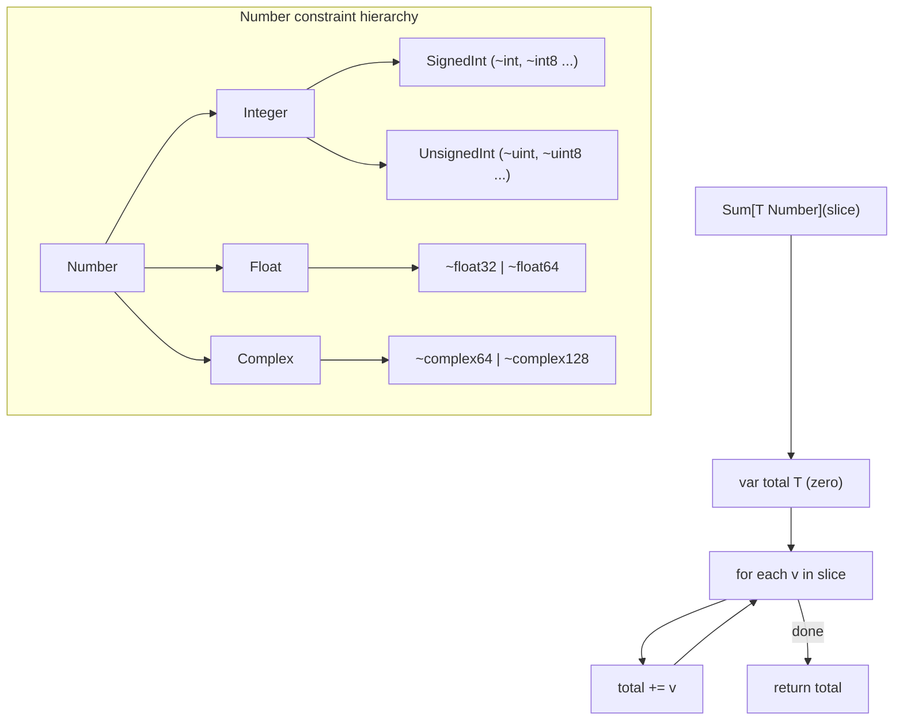
```mermaid
flowchart TD
    A["Sum[T Number](slice)"] --> B["var total T (zero)"]
    B --> C["for each v in slice"]
    C --> D["total += v"]
    D --> C
    C -- done --> E["return total"]

    subgraph "Number constraint hierarchy"
        N["Number"] --> I["Integer"]
        N --> F["Float"]
        N --> X["Complex"]
        I --> S["SignedInt (~int, ~int8 ...)"]
        I --> U["UnsignedInt (~uint, ~uint8 ...)"]
        F --> FL["~float32 | ~float64"]
        X --> CX["~complex64 | ~complex128"]
    end
```

### Interviewer Questions
1. Can you use `Number` as a variable type (e.g., `var x Number`)? Why not?
2. What is the purpose of embedding constraint interfaces into each other?
3. How does `var total T` initialise to the correct zero value for all numeric types?
4. What is the difference between a constraint interface and a regular interface in Go?
5. How would you add `string` to `Number`? Is that semantically valid?
6. What happens if you try to call `Sum` with `[]bool`?
7. How does the Go compiler enforce constraint interfaces vs runtime type checking?

### Follow-Up Questions
- **Q1:** Implement `Product[T Number](slice []T) T`.
- **Q2:** Add a `Numeric` constraint that also allows `string` for concatenation-based Sum.
- **Q3:** Implement `Mean[T Number](slice []T) float64`.
- **Q4:** Implement `RunningSum[T Number](slice []T) []T` returning prefix sums.
- **Q5:** How would you write a generic `Abs[T SignedInt | Float](v T) T`?

---

## Q12: Generic Zip  [Level 3 — Medium]
> **Tags:** `#generics` `#zip` `#pair` `#slice` `#combinators`

### Problem Statement
Write a generic `Zip[A, B any](as []A, bs []B) []Pair[A, B]` function that combines two slices element-by-element into a slice of `Pair` values. If the slices have different lengths, stop at the shorter one (Python-style zip semantics).

### Input / Output / Constraints
- **Input:** Two slices `[]A` and `[]B` of potentially different types and lengths
- **Output:** `[]Pair[A, B]` of length `min(len(as), len(bs))`
- **Constraints:** A and B are `any`; either slice may be nil or empty

### Thought Process
Compute the minimum length of the two slices. Allocate the result slice with that capacity. Iterate up to `minLen`, creating a `Pair` for each index. Note that `Pair` is reused from Q3. This function naturally pairs with `Unzip` (the inverse operation). Two type parameters are required since `A` and `B` may differ.

### Brute Force
```go
// Without generics — interface{} based, loses type safety
func ZipAny(as, bs []any) [][2]any {
    n := len(as)
    if len(bs) < n { n = len(bs) }
    result := make([][2]any, n)
    for i := 0; i < n; i++ {
        result[i] = [2]any{as[i], bs[i]}
    }
    return result
}
```
**Time:** O(n) | **Space:** O(n)

### Better Solution
```go
package main

func Zip[A, B any](as []A, bs []B) []Pair[A, B] {
    n := len(as)
    if len(bs) < n { n = len(bs) }
    result := make([]Pair[A, B], n)
    for i := 0; i < n; i++ {
        result[i] = Pair[A, B]{First: as[i], Second: bs[i]}
    }
    return result
}
```

### Best Solution
```go
package main

import "fmt"

// Pair holds two values of potentially different types (from Q3).
type Pair[A, B any] struct {
    First  A
    Second B
}

// Zip combines two slices element-by-element into a slice of Pairs.
// Result length equals min(len(as), len(bs)).
func Zip[A, B any](as []A, bs []B) []Pair[A, B] {
    n := len(as)
    if len(bs) < n {
        n = len(bs)
    }
    result := make([]Pair[A, B], n)
    for i := 0; i < n; i++ {
        result[i] = Pair[A, B]{First: as[i], Second: bs[i]}
    }
    return result
}

// Unzip is the inverse of Zip — splits a slice of Pairs into two slices.
func Unzip[A, B any](pairs []Pair[A, B]) ([]A, []B) {
    as := make([]A, len(pairs))
    bs := make([]B, len(pairs))
    for i, p := range pairs {
        as[i] = p.First
        bs[i] = p.Second
    }
    return as, bs
}

func main() {
    names := []string{"Alice", "Bob", "Charlie"}
    scores := []int{95, 87, 92}

    zipped := Zip(names, scores)
    for _, p := range zipped {
        fmt.Printf("%s: %d\n", p.First, p.Second)
    }
    // Alice: 95
    // Bob: 87
    // Charlie: 92

    // Different lengths — truncates to shorter
    keys := []string{"a", "b", "c", "d"}
    vals := []float64{1.1, 2.2}
    kv := Zip(keys, vals)
    fmt.Println("Zipped length:", len(kv)) // 2

    // Round-trip via Unzip
    n, s := Unzip(zipped)
    fmt.Println("Names:", n)   // [Alice Bob Charlie]
    fmt.Println("Scores:", s)  // [95 87 92]
}
```
**Time:** O(n) where n = min(len(as), len(bs)) | **Space:** O(n)

### Production Considerations
| Aspect | Details |
|--------|---------|
| Scalability | Linear in the shorter slice; pre-allocated result avoids re-allocation |
| Edge Cases | Nil slices, empty slices, mismatched lengths — all handled; no panic paths |
| Error Handling | Silently truncates to shorter slice (Python semantics); alternative: return error if lengths differ |
| Memory | Allocates one `Pair` per element in result — two field copies per pair |
| Concurrency | Stateless — safe for concurrent use; input slices must not be mutated during iteration |

### Visual Explanation
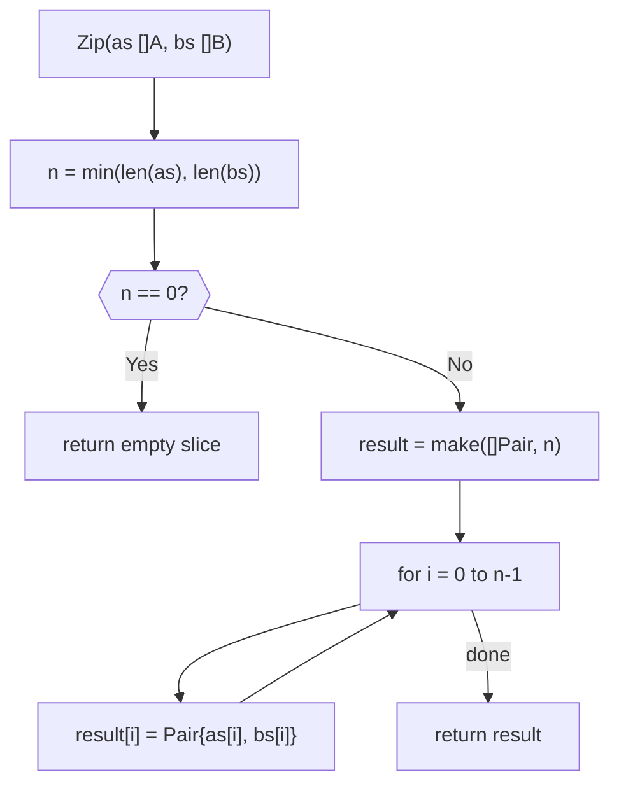
```mermaid
flowchart TD
    A["Zip(as []A, bs []B)"] --> B["n = min(len(as), len(bs))"]
    B --> C{{"n == 0?"}}
    C -- Yes --> D["return empty slice"]
    C -- No --> E["result = make([]Pair, n)"]
    E --> F["for i = 0 to n-1"]
    F --> G["result[i] = Pair{as[i], bs[i]}"]
    G --> F
    F -- done --> H["return result"]
```

### Interviewer Questions
1. What should `Zip` return if both slices are nil?
2. How would you implement `ZipStrict` that returns an error if lengths differ?
3. How would you implement `Zip3[A, B, C any]` for three slices?
4. Is it possible to implement a variadic `ZipN` for N slices in Go generics? What limitation do you hit?
5. How does `Unzip` relate to `Zip` mathematically? Is it always a perfect inverse?
6. How would you implement `ZipWith[A, B, C any](as []A, bs []B, f func(A, B) C) []C`?
7. How would memory layout differ if `Pair` were replaced by two separate parallel slices (struct-of-arrays vs array-of-structs)?

### Follow-Up Questions
- **Q1:** Implement `ZipWith[A, B, C any](as []A, bs []B, f func(A, B) C) []C`.
- **Q2:** Implement `ZipStrict[A, B any]` returning `([]Pair[A, B], error)` on length mismatch.
- **Q3:** Implement `Enumerate[T any](slice []T) []Pair[int, T]` pairing index with value.
- **Q4:** Use `Zip` + `Map` to compute dot product of two `[]float64` slices.
- **Q5:** Implement a lazy `ZipIterator[A, B any]` that yields pairs one at a time without allocating the full result slice.

---

> © 2024 Gaurav Patil — GoForge Platform. All rights reserved.
# Go Generics — Part 2: Advanced to Production Level (Q13–Q25)

---

## Q13: Generic Optional[T] Type  [Level 4 — Advanced]

> **Tags:** `#generics` `#optional` `#null-safety` `#functional`

### Problem Statement

Implement a generic `Optional[T]` type (similar to Rust's `Option<T>` or Java's `Optional<T>`) that wraps a value that may or may not be present. Provide methods: `Some`, `None`, `IsPresent`, `Get`, `GetOrElse`, `Map`, `FlatMap`, `Filter`, `IfPresent`.

### Input / Output / Constraints

- `Some(v T) Optional[T]` — wraps a value
- `None[T]() Optional[T]` — empty optional
- `Get() (T, bool)` — returns value and presence flag
- `GetOrElse(default T) T` — returns value or default
- `Map[U any](opt Optional[T], fn func(T) U) Optional[U]` — transform value if present
- Constraints: thread-safe reads; zero-value safe

### Thought Process

Go has no built-in nullable generics. We use a struct with a boolean presence flag. Map/FlatMap must be package-level functions (not methods) because Go methods cannot introduce new type parameters beyond the receiver.

### Brute Force

```go
// Using pointers — not type-safe, no methods
func maybeInt(v *int) int {
    if v == nil { return 0 }
    return *v
}
```

**Time:** O(1) | **Space:** O(1)

### Better Solution

```go
type Optional[T any] struct {
    value   T
    present bool
}

func Some[T any](v T) Optional[T] { return Optional[T]{value: v, present: true} }
func None[T any]() Optional[T]    { return Optional[T]{} }

func (o Optional[T]) IsPresent() bool        { return o.present }
func (o Optional[T]) Get() (T, bool)         { return o.value, o.present }
func (o Optional[T]) GetOrElse(d T) T {
    if o.present { return o.value }
    return d
}
```

### Best Solution

```go
package main

import "fmt"

type Optional[T any] struct {
	value   T
	present bool
}

func Some[T any](v T) Optional[T] { return Optional[T]{value: v, present: true} }
func None[T any]() Optional[T]    { return Optional[T]{} }

func (o Optional[T]) IsPresent() bool { return o.present }

func (o Optional[T]) Get() (T, bool) { return o.value, o.present }

func (o Optional[T]) GetOrElse(d T) T {
	if o.present {
		return o.value
	}
	return d
}

func (o Optional[T]) IfPresent(fn func(T)) {
	if o.present {
		fn(o.value)
	}
}

func (o Optional[T]) Filter(pred func(T) bool) Optional[T] {
	if o.present && pred(o.value) {
		return o
	}
	return None[T]()
}

// Map: package-level because methods can't introduce new type params
func Map[T, U any](o Optional[T], fn func(T) U) Optional[U] {
	if o.present {
		return Some(fn(o.value))
	}
	return None[U]()
}

func FlatMap[T, U any](o Optional[T], fn func(T) Optional[U]) Optional[U] {
	if o.present {
		return fn(o.value)
	}
	return None[U]()
}

func main() {
	age := Some(25)
	name := None[string]()

	fmt.Println(age.GetOrElse(0))   // 25
	fmt.Println(name.GetOrElse("anonymous")) // anonymous

	doubled := Map(age, func(a int) int { return a * 2 })
	fmt.Println(doubled.GetOrElse(0)) // 50

	filtered := age.Filter(func(a int) bool { return a >= 18 })
	fmt.Println(filtered.IsPresent()) // true

	label := Map(age, func(a int) string { return fmt.Sprintf("age:%d", a) })
	label.IfPresent(func(s string) { fmt.Println(s) }) // age:25
}
```

**Time:** O(1) per operation | **Space:** O(1)

### Production Considerations

| Aspect | Details |
|--------|---------|
| Scalability | Zero allocation for None; Single allocation for Some |
| Edge Cases | Zero-value T is valid inside Some — only `present` flag determines emptiness |
| Error Handling | Pair Optional with error returns for dual optionality |
| Memory | No heap escape unless T itself is a pointer/interface |
| Concurrency | Immutable by design; safe for concurrent reads without locks |

### Visual Explanation

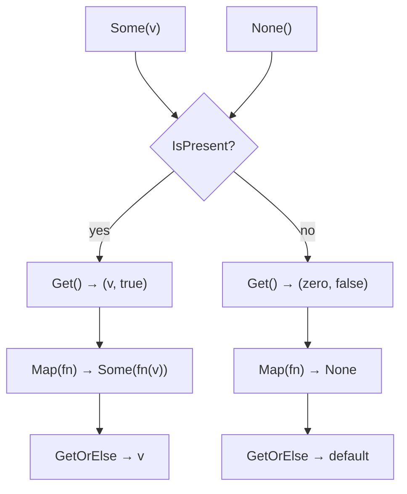
```mermaid
flowchart TD
    A["Some(v)"] --> B{"IsPresent?"}
    C["None()"]  --> B
    B -- yes --> D["Get() → (v, true)"]
    B -- no  --> E["Get() → (zero, false)"]
    D --> F["Map(fn) → Some(fn(v))"]
    E --> G["Map(fn) → None"]
    F --> H["GetOrElse → v"]
    G --> I["GetOrElse → default"]
```

### Interviewer Questions

1. Why can't `Map` be a method on `Optional[T]`?
2. How does `Optional[T]` differ from using a pointer `*T`?
3. What happens with `Some(0)` vs `None[int]()`?
4. How would you serialize `Optional[T]` to JSON?
5. Compare Go's approach to Rust's `Option<T>` — what's missing?
6. When would you prefer `(T, bool)` returns over `Optional[T]`?
7. How do you compose multiple `Optional` transformations without deep nesting?

### Follow-Up Questions

**Q1:** Implement `OrElse(other Optional[T]) Optional[T]` that returns `other` when empty.
**Q2:** Add JSON marshal/unmarshal support where `None` serializes as `null`.
**Q3:** Implement `Zip[T, U, V any](a Optional[T], b Optional[U], fn func(T,U) V) Optional[V]`.
**Q4:** Build a safe chain: parse string → validate → transform using only Optional methods.
**Q5:** How would you implement `Optional` over a channel for async values?

---

## Q14: Generic Result[T] Type with Ok/Err  [Level 4 — Advanced]

> **Tags:** `#generics` `#result` `#error-handling` `#functional`

### Problem Statement

Implement a generic `Result[T]` type modelling either a successful value (`Ok[T]`) or a failure (`Err`). Provide: `Ok`, `Err`, `IsOk`, `IsErr`, `Unwrap`, `UnwrapOr`, `MapResult`, `AndThen`, `OrElse`.

### Input / Output / Constraints

- `Ok[T](v T) Result[T]`
- `Err[T](e error) Result[T]`
- `Unwrap() T` — panics on Err (like Rust)
- `UnwrapOr(d T) T` — safe fallback
- `AndThen[U any](Result[T], func(T) Result[U]) Result[U]` — monadic chain
- Constraints: error must carry full context; composable

### Thought Process

Similar to Optional but carries an error. The discriminant is an `error` field — if nil, it's Ok. `AndThen` enables railway-oriented programming.

### Brute Force

```go
// Plain tuple return — Go idiom but not composable
func divide(a, b float64) (float64, error) {
    if b == 0 { return 0, errors.New("division by zero") }
    return a / b, nil
}
```

**Time:** O(1) | **Space:** O(1)

### Better Solution

```go
type Result[T any] struct {
    value T
    err   error
}
func Ok[T any](v T) Result[T]      { return Result[T]{value: v} }
func Fail[T any](e error) Result[T] { return Result[T]{err: e} }
func (r Result[T]) IsOk() bool      { return r.err == nil }
```

### Best Solution

```go
package main

import (
	"errors"
	"fmt"
	"strconv"
)

type Result[T any] struct {
	value T
	err   error
}

func Ok[T any](v T) Result[T]       { return Result[T]{value: v} }
func Fail[T any](e error) Result[T] { return Result[T]{err: e} }

func (r Result[T]) IsOk() bool  { return r.err == nil }
func (r Result[T]) IsErr() bool { return r.err != nil }

func (r Result[T]) Unwrap() T {
	if r.err != nil {
		panic(fmt.Sprintf("called Unwrap on Err: %v", r.err))
	}
	return r.value
}

func (r Result[T]) UnwrapOr(d T) T {
	if r.err != nil {
		return d
	}
	return r.value
}

func (r Result[T]) UnwrapErr() error { return r.err }

// MapResult: package-level for new type param U
func MapResult[T, U any](r Result[T], fn func(T) U) Result[U] {
	if r.err != nil {
		return Fail[U](r.err)
	}
	return Ok(fn(r.value))
}

// AndThen: monadic bind — chain operations that may fail
func AndThen[T, U any](r Result[T], fn func(T) Result[U]) Result[U] {
	if r.err != nil {
		return Fail[U](r.err)
	}
	return fn(r.value)
}

// OrElse: recover from error
func OrElse[T any](r Result[T], fn func(error) Result[T]) Result[T] {
	if r.err != nil {
		return fn(r.err)
	}
	return r
}

// Example usage
func parseNumber(s string) Result[int] {
	n, err := strconv.Atoi(s)
	if err != nil {
		return Fail[int](fmt.Errorf("parseNumber: %w", err))
	}
	return Ok(n)
}

func validatePositive(n int) Result[int] {
	if n <= 0 {
		return Fail[int](errors.New("must be positive"))
	}
	return Ok(n)
}

func double(n int) Result[string] {
	return Ok(fmt.Sprintf("result: %d", n*2))
}

func main() {
	// Railway-oriented pipeline
	result := AndThen(
		AndThen(parseNumber("21"), validatePositive),
		double,
	)
	fmt.Println(result.UnwrapOr("failed")) // result: 42

	// Error case
	bad := AndThen(
		AndThen(parseNumber("abc"), validatePositive),
		double,
	)
	fmt.Println(bad.IsErr())          // true
	fmt.Println(bad.UnwrapErr())      // parseNumber: ...
	fmt.Println(bad.UnwrapOr("N/A")) // N/A
}
```

**Time:** O(1) per operation | **Space:** O(1)

### Production Considerations

| Aspect | Details |
|--------|---------|
| Scalability | Zero-overhead abstraction; compiles to direct field checks |
| Edge Cases | Distinguish `Ok(zero-value)` from `Err` via `IsOk()` not value check |
| Error Handling | Wrap errors with `fmt.Errorf("%w")` for `errors.Is/As` compatibility |
| Memory | Error interface causes heap allocation only on error path |
| Concurrency | Immutable value type; safe to share across goroutines |

### Visual Explanation

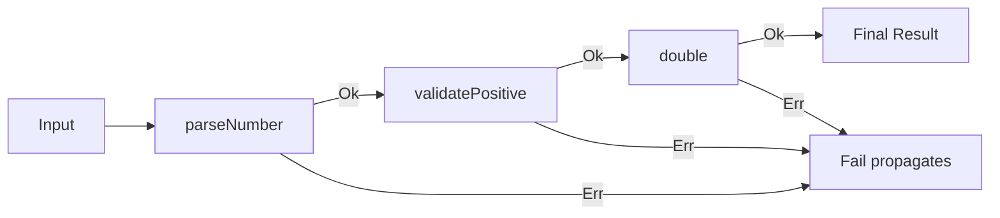
```mermaid
flowchart LR
    A["Input"] --> B["parseNumber"]
    B -- Ok --> C["validatePositive"]
    B -- Err --> Z["Fail propagates"]
    C -- Ok --> D["double"]
    C -- Err --> Z
    D -- Ok --> E["Final Result"]
    D -- Err --> Z
```

### Interviewer Questions

1. How does `Result[T]` compare to Go's `(T, error)` idiom — when would you choose each?
2. What is railway-oriented programming and how does `AndThen` enable it?
3. Why does `Unwrap` panic instead of returning an error?
4. How do you preserve error stack traces through `AndThen` chains?
5. How would you implement `Result[T]` that supports multiple errors (accumulation)?
6. Can you make `Result[T]` work with `errors.Is` and `errors.As`?
7. What are the trade-offs of this pattern vs. explicit error checks at each step?

### Follow-Up Questions

**Q1:** Implement `Collect[T any](results []Result[T]) Result[[]T]` that fails on first error.
**Q2:** Add `Tap(fn func(T))` and `TapErr(fn func(error))` for side effects without transforming.
**Q3:** Implement `Recover[T any](fn func() (T, error)) (r Result[T])` using `recover()`.
**Q4:** Build an HTTP handler that uses `Result[T]` for the full request-response pipeline.
**Q5:** How would you make `Result[T]` serializable over gRPC or JSON APIs?

---

## Q15: Generic LRU Cache with Comparable Key  [Level 4 — Advanced]

> **Tags:** `#generics` `#lru` `#cache` `#linked-list` `#hash-map`

### Problem Statement

Implement a generic LRU (Least Recently Used) cache with capacity limit. Operations: `Get(key K) (V, bool)`, `Put(key K, value V)`. On capacity overflow, evict the least recently used entry. K must be `comparable`.

### Input / Output / Constraints

- `NewLRU[K comparable, V any](capacity int) *LRU[K, V]`
- `Get` returns value + found bool; promotes entry to MRU position
- `Put` inserts/updates; evicts LRU if at capacity
- Capacity >= 1; thread-safe with mutex

### Thought Process

Doubly linked list + hashmap. List maintains recency order (head = MRU, tail = LRU). Map gives O(1) access to nodes. On `Get`: move node to head. On `Put`: if exists update+move; if new add at head+evict tail if full.

### Brute Force

```go
// Linear scan slice — O(n) Get/Put
type entry[K, V any] struct { key K; val V }
type LRU[K comparable, V any] struct { cap int; items []entry[K, V] }
// find by iterating, remove and prepend — O(n)
```

**Time:** O(n) Get/Put | **Space:** O(n)

### Better Solution

Using `container/list` from stdlib:

```go
import "container/list"
type LRU[K comparable, V any] struct {
    cap   int
    list  *list.List
    items map[K]*list.Element
    mu    sync.Mutex
}
```

### Best Solution

```go
package main

import (
	"container/list"
	"fmt"
	"sync"
)

type entry[K comparable, V any] struct {
	key K
	val V
}

type LRU[K comparable, V any] struct {
	cap   int
	list  *list.List
	items map[K]*list.Element
	mu    sync.Mutex
}

func NewLRU[K comparable, V any](capacity int) *LRU[K, V] {
	if capacity < 1 {
		panic("LRU capacity must be >= 1")
	}
	return &LRU[K, V]{
		cap:   capacity,
		list:  list.New(),
		items: make(map[K]*list.Element, capacity),
	}
}

func (c *LRU[K, V]) Get(key K) (V, bool) {
	c.mu.Lock()
	defer c.mu.Unlock()
	if el, ok := c.items[key]; ok {
		c.list.MoveToFront(el)
		return el.Value.(*entry[K, V]).val, true
	}
	var zero V
	return zero, false
}

func (c *LRU[K, V]) Put(key K, val V) {
	c.mu.Lock()
	defer c.mu.Unlock()
	if el, ok := c.items[key]; ok {
		el.Value.(*entry[K, V]).val = val
		c.list.MoveToFront(el)
		return
	}
	if c.list.Len() == c.cap {
		// evict LRU (back of list)
		back := c.list.Back()
		if back != nil {
			c.list.Remove(back)
			delete(c.items, back.Value.(*entry[K, V]).key)
		}
	}
	el := c.list.PushFront(&entry[K, V]{key: key, val: val})
	c.items[key] = el
}

func (c *LRU[K, V]) Len() int {
	c.mu.Lock()
	defer c.mu.Unlock()
	return c.list.Len()
}

func (c *LRU[K, V]) Delete(key K) bool {
	c.mu.Lock()
	defer c.mu.Unlock()
	if el, ok := c.items[key]; ok {
		c.list.Remove(el)
		delete(c.items, key)
		return true
	}
	return false
}

func main() {
	cache := NewLRU[string, int](3)
	cache.Put("a", 1)
	cache.Put("b", 2)
	cache.Put("c", 3)

	v, ok := cache.Get("a")
	fmt.Println(v, ok) // 1 true — "a" is now MRU

	cache.Put("d", 4) // evicts "b" (LRU after "a" was accessed)

	_, ok = cache.Get("b")
	fmt.Println(ok) // false — evicted

	fmt.Println(cache.Len()) // 3
}
```

**Time:** O(1) Get/Put/Delete | **Space:** O(capacity)

### Production Considerations

| Aspect | Details |
|--------|---------|
| Scalability | O(1) all ops; shard into N buckets for high-concurrency workloads |
| Edge Cases | capacity=0 panics; updating existing key must not count as new entry |
| Error Handling | Return `(V, bool)` not error — absence is not an error |
| Memory | Each node: 2 pointers + key + value; map overhead ~8 bytes/entry |
| Concurrency | Single mutex — for read-heavy use, consider sync.RWMutex with care |

### Visual Explanation

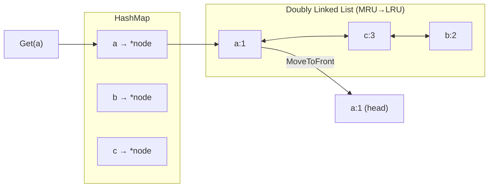
```mermaid
flowchart LR
    subgraph List["Doubly Linked List (MRU→LRU)"]
        A["a:1"] <--> B["c:3"] <--> C["b:2"]
    end
    subgraph Map["HashMap"]
        M1["a → *node"]
        M2["b → *node"]
        M3["c → *node"]
    end
    Get["Get(a)"] --> M1 --> A
    A --> |MoveToFront| A2["a:1 (head)"]
```

### Interviewer Questions

1. Why do we need both a doubly linked list and a hashmap?
2. What is the time complexity if we used only a linked list? Only a map?
3. How would you add TTL (time-to-live) expiry to each cache entry?
4. How would you shard this LRU cache to reduce lock contention?
5. What's the difference between LRU and LFU (Least Frequently Used)?
6. How do you handle cache stampede (thundering herd) on a miss?
7. When would you use `sync.RWMutex` here and what are the pitfalls?

### Follow-Up Questions

**Q1:** Add `Peek(key K) (V, bool)` — returns value without updating recency.
**Q2:** Implement eviction callback: `OnEvict func(key K, val V)`.
**Q3:** Add TTL per entry; evict expired entries lazily on access and eagerly via background goroutine.
**Q4:** Implement a sharded LRU with `N` buckets to reduce mutex contention.
**Q5:** How would you persist this LRU cache to disk across process restarts?

---

## Q16: Generic Concurrent Queue with sync.Mutex  [Level 4 — Advanced]

> **Tags:** `#generics` `#queue` `#concurrency` `#mutex` `#data-structures`

### Problem Statement

Implement a generic FIFO queue safe for concurrent use. Operations: `Enqueue(v T)`, `Dequeue() (T, bool)`, `Peek() (T, bool)`, `Len() int`, `IsEmpty() bool`. Use `sync.Mutex` for thread safety.

### Input / Output / Constraints

- Unbounded queue (or optional bounded variant)
- `Dequeue` returns `(zero, false)` on empty queue
- Multiple goroutines can enqueue/dequeue concurrently
- Must not deadlock

### Thought Process

Use a slice as the underlying storage with head/tail indices for O(1) amortized ops, or a linked list to avoid re-slicing. Protect all mutations with a mutex. Optionally use `sync.Cond` for blocking `DequeueWait`.

### Brute Force

```go
// Non-concurrent slice queue
type Queue[T any] []T
func (q *Queue[T]) Enqueue(v T) { *q = append(*q, v) }
func (q *Queue[T]) Dequeue() (T, bool) {
    if len(*q) == 0 { var z T; return z, false }
    v := (*q)[0]; *q = (*q)[1:]; return v, true
}
// O(n) Dequeue due to slice shift
```

**Time:** O(n) Dequeue | **Space:** O(n)

### Best Solution

```go
package main

import (
	"fmt"
	"sync"
)

type node[T any] struct {
	val  T
	next *node[T]
}

type Queue[T any] struct {
	head *node[T]
	tail *node[T]
	len  int
	mu   sync.Mutex
	cond *sync.Cond
}

func NewQueue[T any]() *Queue[T] {
	q := &Queue[T]{}
	q.cond = sync.NewCond(&q.mu)
	return q
}

func (q *Queue[T]) Enqueue(v T) {
	q.mu.Lock()
	n := &node[T]{val: v}
	if q.tail != nil {
		q.tail.next = n
	}
	q.tail = n
	if q.head == nil {
		q.head = n
	}
	q.len++
	q.cond.Signal() // wake one blocked DequeueWait
	q.mu.Unlock()
}

func (q *Queue[T]) Dequeue() (T, bool) {
	q.mu.Lock()
	defer q.mu.Unlock()
	if q.head == nil {
		var zero T
		return zero, false
	}
	v := q.head.val
	q.head = q.head.next
	if q.head == nil {
		q.tail = nil
	}
	q.len--
	return v, true
}

// DequeueWait blocks until an item is available
func (q *Queue[T]) DequeueWait() T {
	q.mu.Lock()
	defer q.mu.Unlock()
	for q.head == nil {
		q.cond.Wait()
	}
	v := q.head.val
	q.head = q.head.next
	if q.head == nil {
		q.tail = nil
	}
	q.len--
	return v
}

func (q *Queue[T]) Peek() (T, bool) {
	q.mu.Lock()
	defer q.mu.Unlock()
	if q.head == nil {
		var zero T
		return zero, false
	}
	return q.head.val, true
}

func (q *Queue[T]) Len() int {
	q.mu.Lock()
	defer q.mu.Unlock()
	return q.len
}

func (q *Queue[T]) IsEmpty() bool { return q.Len() == 0 }

func main() {
	q := NewQueue[int]()

	var wg sync.WaitGroup
	// producers
	for i := 0; i < 5; i++ {
		wg.Add(1)
		go func(v int) {
			defer wg.Done()
			q.Enqueue(v)
		}(i)
	}
	wg.Wait()

	fmt.Println("Len:", q.Len()) // 5
	for !q.IsEmpty() {
		v, _ := q.Dequeue()
		fmt.Print(v, " ")
	}
	fmt.Println()
}
```

**Time:** O(1) Enqueue/Dequeue | **Space:** O(n)

### Production Considerations

| Aspect | Details |
|--------|---------|
| Scalability | For high throughput consider lock-free queue (atomic CAS) or channel-based |
| Edge Cases | Dequeue on empty returns zero+false; tail must be nil when head is nil |
| Error Handling | DequeueWait needs a close/shutdown signal to unblock goroutines |
| Memory | Linked list nodes are GC'd after dequeue; no reallocation pressure |
| Concurrency | sync.Cond.Signal wakes exactly one blocked DequeueWait |

### Visual Explanation

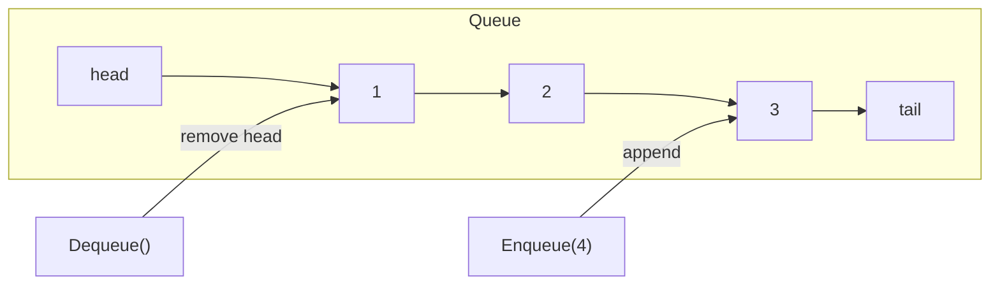
```mermaid
flowchart LR
    subgraph Queue
        H["head"] --> N1["1"] --> N2["2"] --> N3["3"] --> T["tail"]
    end
    E["Enqueue(4)"] --> |append| N3
    D["Dequeue()"] --> |remove head| N1
```

### Interviewer Questions

1. Why use a linked list instead of a slice for the queue?
2. What is `sync.Cond` and when would you use it over a channel?
3. What happens if `cond.Wait()` is called without holding the mutex?
4. How would you implement a bounded (capacity-limited) queue?
5. What is a lock-free queue and when is it worth the complexity?
6. How do you gracefully shut down goroutines blocked on `DequeueWait`?
7. Compare this mutex-based queue to Go channels — when would you choose each?

### Follow-Up Questions

**Q1:** Add `Close()` that causes all `DequeueWait` callers to return `(zero, false)`.
**Q2:** Implement a bounded queue where `Enqueue` blocks when at capacity.
**Q3:** Add `DrainAll() []T` that atomically removes and returns all elements.
**Q4:** Implement a priority queue variant where items are dequeued by priority.
**Q5:** Benchmark your mutex queue vs a channel-based queue at 10k ops/sec.

---

## Q17: Generic Tree Traversal  [Level 4 — Advanced]

> **Tags:** `#generics` `#tree` `#traversal` `#recursion` `#dfs`

### Problem Statement

Implement a generic binary tree with in-order, pre-order, and post-order traversals. The tree node holds any value type. Provide both recursive and iterative implementations for each traversal.

### Input / Output / Constraints

- `TreeNode[T any]` with `Val T`, `Left, Right *TreeNode[T]`
- `InOrder`, `PreOrder`, `PostOrder` each return `[]T`
- Also implement `LevelOrder` (BFS) returning `[][]T`
- Constraints: handle nil root gracefully

### Thought Process

Recursive traversals are clean but risk stack overflow on deep trees. Iterative versions use an explicit stack (DFS) or queue (BFS). Pre-order: root-left-right. In-order: left-root-right. Post-order: left-right-root.

### Brute Force

```go
// Recursive only — clean but limited by stack depth
func InOrder[T any](root *TreeNode[T]) []T {
    if root == nil { return nil }
    result := InOrder(root.Left)
    result = append(result, root.Val)
    return append(result, InOrder(root.Right)...)
}
```

**Time:** O(n) | **Space:** O(h) where h = height

### Best Solution

```go
package main

import "fmt"

type TreeNode[T any] struct {
	Val         T
	Left, Right *TreeNode[T]
}

func NewNode[T any](val T) *TreeNode[T] { return &TreeNode[T]{Val: val} }

// --- Recursive traversals ---

func InOrder[T any](root *TreeNode[T]) []T {
	if root == nil {
		return nil
	}
	res := InOrder(root.Left)
	res = append(res, root.Val)
	return append(res, InOrder(root.Right)...)
}

func PreOrder[T any](root *TreeNode[T]) []T {
	if root == nil {
		return nil
	}
	res := []T{root.Val}
	res = append(res, PreOrder(root.Left)...)
	return append(res, PreOrder(root.Right)...)
}

func PostOrder[T any](root *TreeNode[T]) []T {
	if root == nil {
		return nil
	}
	res := PostOrder(root.Left)
	res = append(res, PostOrder(root.Right)...)
	return append(res, root.Val)
}

// --- Iterative InOrder (Morris-style with explicit stack) ---

func InOrderIter[T any](root *TreeNode[T]) []T {
	var res []T
	var stack []*TreeNode[T]
	curr := root
	for curr != nil || len(stack) > 0 {
		for curr != nil {
			stack = append(stack, curr)
			curr = curr.Left
		}
		curr = stack[len(stack)-1]
		stack = stack[:len(stack)-1]
		res = append(res, curr.Val)
		curr = curr.Right
	}
	return res
}

// --- Iterative PreOrder ---

func PreOrderIter[T any](root *TreeNode[T]) []T {
	if root == nil {
		return nil
	}
	var res []T
	stack := []*TreeNode[T]{root}
	for len(stack) > 0 {
		node := stack[len(stack)-1]
		stack = stack[:len(stack)-1]
		res = append(res, node.Val)
		if node.Right != nil {
			stack = append(stack, node.Right)
		}
		if node.Left != nil {
			stack = append(stack, node.Left)
		}
	}
	return res
}

// --- Level Order (BFS) ---

func LevelOrder[T any](root *TreeNode[T]) [][]T {
	if root == nil {
		return nil
	}
	var res [][]T
	queue := []*TreeNode[T]{root}
	for len(queue) > 0 {
		level := make([]T, 0, len(queue))
		next := queue[:0]
		for _, node := range queue {
			level = append(level, node.Val)
			if node.Left != nil {
				next = append(next, node.Left)
			}
			if node.Right != nil {
				next = append(next, node.Right)
			}
		}
		res = append(res, level)
		queue = next
	}
	return res
}

func main() {
	//       4
	//      / \
	//     2   6
	//    / \ / \
	//   1  3 5  7
	root := NewNode(4)
	root.Left = NewNode(2)
	root.Right = NewNode(6)
	root.Left.Left = NewNode(1)
	root.Left.Right = NewNode(3)
	root.Right.Left = NewNode(5)
	root.Right.Right = NewNode(7)

	fmt.Println("InOrder:    ", InOrder(root))       // [1 2 3 4 5 6 7]
	fmt.Println("PreOrder:   ", PreOrder(root))      // [4 2 1 3 6 5 7]
	fmt.Println("PostOrder:  ", PostOrder(root))     // [1 3 2 5 7 6 4]
	fmt.Println("InOrderIter:", InOrderIter(root))   // [1 2 3 4 5 6 7]
	fmt.Println("LevelOrder: ", LevelOrder(root))    // [[4] [2 6] [1 3 5 7]]
}
```

**Time:** O(n) all traversals | **Space:** O(h) recursive, O(w) BFS where w = max width

### Production Considerations

| Aspect | Details |
|--------|---------|
| Scalability | Iterative preferred for production — avoids goroutine stack growth |
| Edge Cases | Nil root returns nil/empty; single-node trees; skewed trees (degenerate to O(n) space) |
| Error Handling | No error conditions — tree structure guarantees valid traversal |
| Memory | BFS queue worst case O(n/2) for complete tree bottom level |
| Concurrency | Traversal is read-only; concurrent traversals are safe without locks |

### Visual Explanation

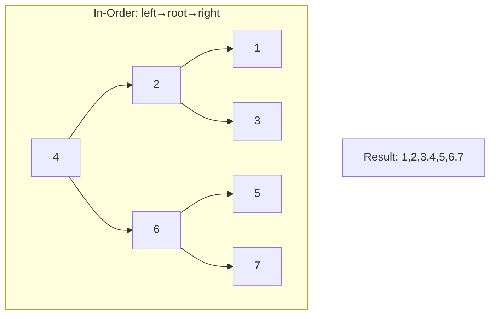
```mermaid
flowchart TD
    subgraph InOrder["In-Order: left→root→right"]
        A4["4"] --> A2["2"] --> A1["1"]
        A2 --> A3["3"]
        A4 --> A6["6"] --> A5["5"]
        A6 --> A7["7"]
    end
    Result["Result: 1,2,3,4,5,6,7"]
```

### Interviewer Questions

1. What is the space complexity of each traversal for a balanced vs. skewed tree?
2. How does iterative in-order traversal simulate the call stack?
3. When would you use BFS vs DFS traversal?
4. How would you reconstruct a tree from its in-order and pre-order traversals?
5. What is Morris traversal and what is its space complexity advantage?
6. How would you traverse a generic N-ary tree with this same pattern?
7. How do you find the lowest common ancestor using these traversals?

### Follow-Up Questions

**Q1:** Implement `FindAll[T any](root *TreeNode[T], pred func(T) bool) []T`.
**Q2:** Implement `Map[T, U any](root *TreeNode[T], fn func(T) U) *TreeNode[U]`.
**Q3:** Add iterative post-order traversal using two stacks.
**Q4:** Implement `ZigZagLevelOrder` (alternate left-to-right and right-to-left per level).
**Q5:** Serialize and deserialize a generic binary tree to/from a string.

---

## Q18: Generic Pipeline — Compose Functions  [Level 5 — Interview Level]

> **Tags:** `#generics` `#pipeline` `#functional` `#composition` `#higher-order`

### Problem Statement

Implement a generic pipeline that composes a sequence of functions `func(T) T` into a single function. Also implement `Pipe[T, U any]` that transforms the type through each stage, and a concurrent pipeline that processes items through stages in parallel.

### Input / Output / Constraints

- `Compose[T any](fns ...func(T) T) func(T) T` — right-to-left composition
- `Pipe[T any](fns ...func(T) T) func(T) T` — left-to-right pipeline
- Functions applied in sequence; output of one feeds input of next
- Constraints: empty function list returns identity; handle panics

### Thought Process

Fold/reduce over the function slice. For same-type pipelines, simple iteration. For type-changing pipelines, Go's type system requires each stage to be monomorphic — we can chain using `any` with type assertions or use a builder pattern with explicit type parameters per stage.

### Brute Force

```go
// Manual chaining
result := f3(f2(f1(input)))
// Not composable, not reusable
```

### Best Solution

```go
package main

import (
	"fmt"
	"strings"
	"unicode"
)

// Pipe: left-to-right composition (f1 then f2 then f3)
func Pipe[T any](fns ...func(T) T) func(T) T {
	return func(v T) T {
		for _, fn := range fns {
			v = fn(v)
		}
		return v
	}
}

// Compose: right-to-left (mathematical composition: f∘g = f(g(x)))
func Compose[T any](fns ...func(T) T) func(T) T {
	return func(v T) T {
		for i := len(fns) - 1; i >= 0; i-- {
			v = fns[i](v)
		}
		return v
	}
}

// PipeSlice: apply pipeline to each element of a slice
func PipeSlice[T any](input []T, fns ...func(T) T) []T {
	pipeline := Pipe(fns...)
	result := make([]T, len(input))
	for i, v := range input {
		result[i] = pipeline(v)
	}
	return result
}

// Stage: a named pipeline stage for debugging
type Stage[T any] struct {
	name string
	fn   func(T) T
}

func NewStage[T any](name string, fn func(T) T) Stage[T] {
	return Stage[T]{name: name, fn: fn}
}

type Pipeline[T any] struct {
	stages []Stage[T]
}

func NewPipeline[T any]() *Pipeline[T] { return &Pipeline[T]{} }

func (p *Pipeline[T]) Add(s Stage[T]) *Pipeline[T] {
	p.stages = append(p.stages, s)
	return p
}

func (p *Pipeline[T]) Run(input T) T {
	for _, s := range p.stages {
		input = s.fn(input)
	}
	return input
}

func main() {
	// String transformation pipeline
	trim := strings.TrimSpace
	lower := strings.ToLower
	titleCase := func(s string) string {
		words := strings.Fields(s)
		for i, w := range words {
			if len(w) > 0 {
				words[i] = string(unicode.ToUpper(rune(w[0]))) + w[1:]
			}
		}
		return strings.Join(words, " ")
	}
	exclaim := func(s string) string { return s + "!" }

	pipeline := Pipe(trim, lower, titleCase, exclaim)
	fmt.Println(pipeline("  hello world  ")) // Hello World!

	// Numeric pipeline
	double := func(n int) int { return n * 2 }
	addTen := func(n int) int { return n + 10 }
	square := func(n int) int { return n * n }

	numPipe := Pipe(double, addTen, square)
	fmt.Println(numPipe(5)) // (5*2+10)^2 = 400

	// Named stage pipeline
	p := NewPipeline[string]().
		Add(NewStage("trim", trim)).
		Add(NewStage("lower", lower)).
		Add(NewStage("title", titleCase))
	fmt.Println(p.Run("  GO IS GREAT  ")) // Go Is Great
}
```

**Time:** O(k*n) where k=stages, n=input size | **Space:** O(1) extra

### Production Considerations

| Aspect | Details |
|--------|---------|
| Scalability | Add worker pool stage for CPU-bound transformations |
| Edge Cases | Empty fns slice returns identity; single fn returns it directly |
| Error Handling | Use `Result[T]` as pipeline type to propagate errors through stages |
| Memory | Each stage creates intermediate values; consider in-place mutation for large structs |
| Concurrency | Per-item goroutines with fan-out/fan-in for throughput-oriented pipelines |

### Visual Explanation

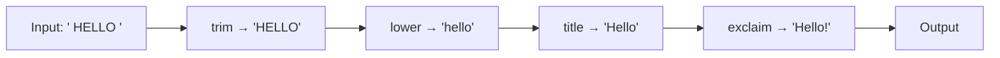
```mermaid
flowchart LR
    I["Input: '  HELLO  '"] --> F1["trim → 'HELLO'"]
    F1 --> F2["lower → 'hello'"]
    F2 --> F3["title → 'Hello'"]
    F3 --> F4["exclaim → 'Hello!'"]
    F4 --> O["Output"]
```

### Interviewer Questions

1. What is the difference between `Pipe` and `Compose`?
2. How would you add error handling to each stage without changing the function signature?
3. How would you implement a type-changing pipeline (e.g., string → int → float)?
4. What is middleware and how does it relate to function composition?
5. How would you make the pipeline concurrent (each stage runs in its own goroutine)?
6. Compare this to Go channels as a pipeline mechanism — what are the trade-offs?
7. How would you add observability (metrics, tracing) to each pipeline stage?

### Follow-Up Questions

**Q1:** Implement `ParallelPipe[T any](workers int, fns ...func(T) T) func([]T) []T`.
**Q2:** Add a `Retry(n int, fn func(T) (T, error)) func(T) (T, error)` stage decorator.
**Q3:** Build a middleware-style pipeline where each fn receives a `next` function to call.
**Q4:** Implement a streaming pipeline using channels that processes items as they arrive.
**Q5:** Add circuit-breaking to individual stages in the pipeline.

---

## Q19: Generic Event Bus (Pub-Sub with Type Safety)  [Level 5 — Interview Level]

> **Tags:** `#generics` `#eventbus` `#pubsub` `#concurrency` `#observer`

### Problem Statement

Implement a type-safe generic event bus. `Subscribe[T](bus, handler func(T))` registers a handler for event type T. `Publish[T](bus, event T)` delivers the event to all handlers registered for T. Events of different types must not interfere.

### Input / Output / Constraints

- Type-safe: publishing `UserCreated` only reaches `UserCreated` handlers
- Multiple handlers per type; all called on publish
- Async option: handlers called in goroutines
- Thread-safe subscribe/publish/unsubscribe

### Thought Process

Go's type system doesn't allow a map keyed by type parameter at runtime in a single generic map. We use `reflect.TypeOf` or a `fmt.Sprintf("%T")` key to discriminate event types at runtime, storing handlers as `any` and type-asserting on publish.

### Best Solution

```go
package main

import (
	"fmt"
	"reflect"
	"sync"
)

type handler struct {
	id uint64
	fn any // func(T) stored as any
}

type EventBus struct {
	mu       sync.RWMutex
	handlers map[reflect.Type][]handler
	nextID   uint64
}

func NewEventBus() *EventBus {
	return &EventBus{handlers: make(map[reflect.Type][]handler)}
}

func Subscribe[T any](bus *EventBus, fn func(T)) uint64 {
	t := reflect.TypeOf((*T)(nil)).Elem()
	bus.mu.Lock()
	defer bus.mu.Unlock()
	bus.nextID++
	id := bus.nextID
	bus.handlers[t] = append(bus.handlers[t], handler{id: id, fn: fn})
	return id
}

func Unsubscribe[T any](bus *EventBus, id uint64) {
	t := reflect.TypeOf((*T)(nil)).Elem()
	bus.mu.Lock()
	defer bus.mu.Unlock()
	hs := bus.handlers[t]
	for i, h := range hs {
		if h.id == id {
			bus.handlers[t] = append(hs[:i], hs[i+1:]...)
			return
		}
	}
}

func Publish[T any](bus *EventBus, event T) {
	t := reflect.TypeOf((*T)(nil)).Elem()
	bus.mu.RLock()
	hs := make([]handler, len(bus.handlers[t]))
	copy(hs, bus.handlers[t])
	bus.mu.RUnlock()
	for _, h := range hs {
		h.fn.(func(T))(event)
	}
}

func PublishAsync[T any](bus *EventBus, event T) {
	t := reflect.TypeOf((*T)(nil)).Elem()
	bus.mu.RLock()
	hs := make([]handler, len(bus.handlers[t]))
	copy(hs, bus.handlers[t])
	bus.mu.RUnlock()
	for _, h := range hs {
		fn := h.fn.(func(T))
		go fn(event)
	}
}

// --- Event types ---
type UserCreated struct{ Name string }
type OrderPlaced struct{ OrderID int; Amount float64 }

func main() {
	bus := NewEventBus()

	id1 := Subscribe(bus, func(e UserCreated) {
		fmt.Printf("Handler1: new user %s\n", e.Name)
	})
	Subscribe(bus, func(e UserCreated) {
		fmt.Printf("Handler2: send welcome email to %s\n", e.Name)
	})
	Subscribe(bus, func(e OrderPlaced) {
		fmt.Printf("Order #%d placed: $%.2f\n", e.OrderID, e.Amount)
	})

	Publish(bus, UserCreated{Name: "Alice"})
	Publish(bus, OrderPlaced{OrderID: 42, Amount: 99.99})

	Unsubscribe[UserCreated](bus, id1)
	fmt.Println("After unsubscribe:")
	Publish(bus, UserCreated{Name: "Bob"}) // only Handler2
}
```

**Time:** O(k) publish where k=handlers | **Space:** O(n) handlers total

### Production Considerations

| Aspect | Details |
|--------|---------|
| Scalability | Shard bus by event type; use worker pools for async delivery |
| Edge Cases | Publish with no subscribers is a no-op; handler panics should be recovered |
| Error Handling | Handlers should return errors; use dead-letter queue for failures |
| Memory | Copy handler slice before unlocking to avoid race with concurrent unsubscribe |
| Concurrency | RWMutex allows concurrent Publish reads; exclusive lock for Subscribe/Unsubscribe |

### Visual Explanation

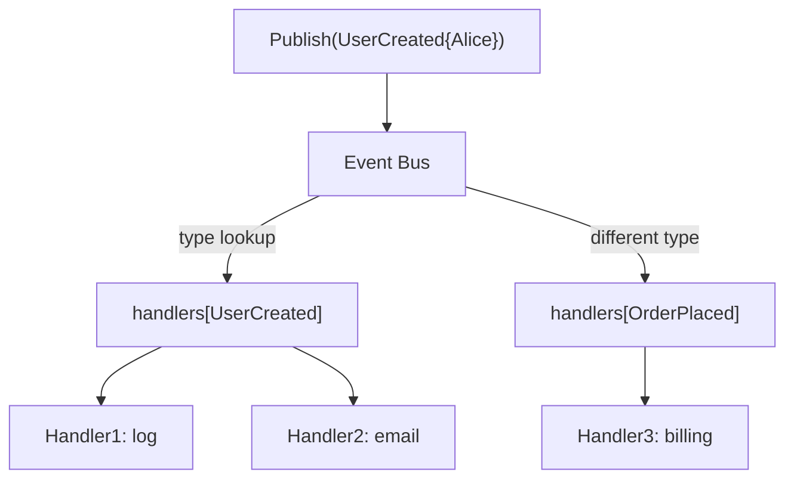
```mermaid
flowchart TD
    P["Publish(UserCreated{Alice})"] --> BUS["Event Bus"]
    BUS --> |"type lookup"| T["handlers[UserCreated]"]
    T --> H1["Handler1: log"]
    T --> H2["Handler2: email"]
    BUS --> |"different type"| T2["handlers[OrderPlaced]"]
    T2 --> H3["Handler3: billing"]
```

### Interviewer Questions

1. Why do we need `reflect.TypeOf` here — can pure generics solve this without reflection?
2. What is the difference between synchronous and asynchronous event delivery?
3. How do you prevent a slow handler from blocking other handlers?
4. How would you implement event ordering guarantees?
5. What is the dead-letter queue pattern and when do you need it?
6. How would you add middleware (e.g., logging, auth) to the event bus?
7. Compare this in-process event bus to an external message broker (Kafka, NATS).

### Follow-Up Questions

**Q1:** Add `SubscribeOnce[T]` that auto-unsubscribes after first event.
**Q2:** Implement event replay — store past N events per type and replay on subscribe.
**Q3:** Add handler priority ordering.
**Q4:** Implement a wildcard subscription that receives all event types as `any`.
**Q5:** Add metrics: events published/sec, handler latency histograms per type.

---

## Q20: Generic Retry Function with Backoff  [Level 5 — Interview Level]

> **Tags:** `#generics` `#retry` `#backoff` `#resilience` `#concurrency`

### Problem Statement

Implement a generic `Retry[T any]` function that retries a `func() (T, error)` operation up to N times with configurable backoff strategy (fixed, linear, exponential with jitter). Return the result on success or the last error on exhaustion.

### Input / Output / Constraints

- `Retry[T](ctx context.Context, fn func() (T, error), opts RetryOptions) (T, error)`
- Support: max attempts, initial delay, backoff multiplier, max delay, jitter
- Respect context cancellation
- Distinguish retryable vs. non-retryable errors

### Thought Process

Loop up to maxAttempts. On error: check if retryable, compute next delay with backoff formula, sleep respecting context. Exponential: `delay = min(initial * multiplier^attempt, maxDelay)`. Jitter: `delay *= (0.5 + random*0.5)` to spread load.

### Best Solution

```go
package main

import (
	"context"
	"errors"
	"fmt"
	"math"
	"math/rand"
	"time"
)

type BackoffStrategy int

const (
	Fixed       BackoffStrategy = iota
	Linear
	Exponential
)

type RetryOptions struct {
	MaxAttempts int
	InitialWait time.Duration
	MaxWait     time.Duration
	Multiplier  float64
	Strategy    BackoffStrategy
	Jitter      bool
	IsRetryable func(error) bool // nil = retry all errors
}

var DefaultRetryOptions = RetryOptions{
	MaxAttempts: 3,
	InitialWait: 100 * time.Millisecond,
	MaxWait:     10 * time.Second,
	Multiplier:  2.0,
	Strategy:    Exponential,
	Jitter:      true,
}

func computeDelay(attempt int, opts RetryOptions) time.Duration {
	var delay float64
	initial := float64(opts.InitialWait)

	switch opts.Strategy {
	case Fixed:
		delay = initial
	case Linear:
		delay = initial * float64(attempt+1)
	case Exponential:
		delay = initial * math.Pow(opts.Multiplier, float64(attempt))
	}

	if opts.MaxWait > 0 && time.Duration(delay) > opts.MaxWait {
		delay = float64(opts.MaxWait)
	}

	if opts.Jitter {
		delay = delay * (0.5 + rand.Float64()*0.5)
	}

	return time.Duration(delay)
}

func Retry[T any](ctx context.Context, fn func() (T, error), opts RetryOptions) (T, error) {
	var (
		result T
		err    error
	)

	for attempt := 0; attempt < opts.MaxAttempts; attempt++ {
		result, err = fn()
		if err == nil {
			return result, nil
		}

		// Check non-retryable
		if opts.IsRetryable != nil && !opts.IsRetryable(err) {
			return result, fmt.Errorf("non-retryable error on attempt %d: %w", attempt+1, err)
		}

		// Last attempt — don't sleep
		if attempt == opts.MaxAttempts-1 {
			break
		}

		delay := computeDelay(attempt, opts)
		select {
		case <-ctx.Done():
			return result, fmt.Errorf("retry cancelled after %d attempts: %w", attempt+1, ctx.Err())
		case <-time.After(delay):
		}
	}

	var zero T
	return zero, fmt.Errorf("all %d attempts failed, last error: %w", opts.MaxAttempts, err)
}

// Sentinel for non-retryable errors
type PermanentError struct{ Err error }

func (e *PermanentError) Error() string { return e.Err.Error() }
func (e *PermanentError) Unwrap() error { return e.Err }

func IsPermanent(err error) bool {
	var p *PermanentError
	return errors.As(err, &p)
}

func main() {
	ctx := context.Background()

	calls := 0
	result, err := Retry(ctx, func() (string, error) {
		calls++
		if calls < 3 {
			return "", fmt.Errorf("transient error (attempt %d)", calls)
		}
		return "success", nil
	}, RetryOptions{
		MaxAttempts: 5,
		InitialWait: 10 * time.Millisecond,
		MaxWait:     1 * time.Second,
		Multiplier:  2.0,
		Strategy:    Exponential,
		Jitter:      false,
	})

	fmt.Println(result, err, "attempts:", calls) // success <nil> attempts: 3

	// Permanent error — no retry
	_, err2 := Retry(ctx, func() (int, error) {
		return 0, &PermanentError{Err: errors.New("bad input")}
	}, RetryOptions{
		MaxAttempts: 5,
		InitialWait: 10 * time.Millisecond,
		Strategy:    Fixed,
		IsRetryable: func(e error) bool { return !IsPermanent(e) },
	})
	fmt.Println(err2) // non-retryable error on attempt 1: bad input
}
```

**Time:** O(maxAttempts) worst case | **Space:** O(1)

### Production Considerations

| Aspect | Details |
|--------|---------|
| Scalability | Add jitter to prevent thundering herd; use per-service retry budgets |
| Edge Cases | Context already cancelled on entry; maxAttempts=0; permanent vs. transient errors |
| Error Handling | Wrap errors with attempt count; preserve original error via `%w` |
| Memory | Stack-only; no heap allocation in hot path |
| Concurrency | Each goroutine has its own retry state; safe for concurrent use |

### Visual Explanation

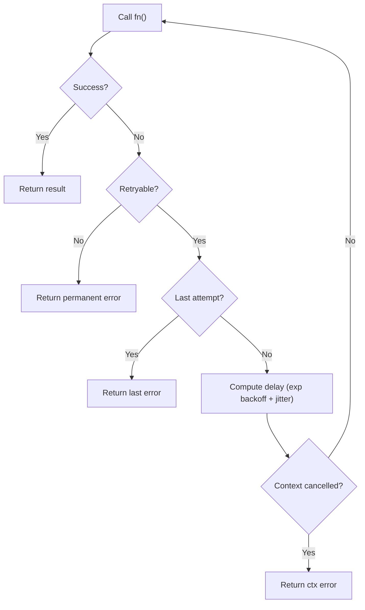
```mermaid
flowchart TD
    A["Call fn()"] --> B{Success?}
    B -- Yes --> R["Return result"]
    B -- No --> C{Retryable?}
    C -- No --> F["Return permanent error"]
    C -- Yes --> D{Last attempt?}
    D -- Yes --> E["Return last error"]
    D -- No --> G["Compute delay (exp backoff + jitter)"]
    G --> H{Context cancelled?}
    H -- Yes --> I["Return ctx error"]
    H -- No --> A
```

### Interviewer Questions

1. What is thundering herd and how does jitter prevent it?
2. How do you distinguish transient vs. permanent errors?
3. What is a retry budget and why is it important in microservices?
4. How would you implement retry with deadline propagation?
5. When should you NOT retry (e.g., 4xx HTTP errors)?
6. How does exponential backoff interact with SLA/timeout requirements?
7. How would you add metrics (retry count, success rate) to this?

### Follow-Up Questions

**Q1:** Add `OnRetry func(attempt int, err error)` callback for logging/metrics.
**Q2:** Implement `RetryWithResult[T]` that returns all attempts' errors, not just the last.
**Q3:** Build a `RetryableHTTPClient` that wraps `http.Client` with this retry logic.
**Q4:** Add circuit-breaker integration: stop retrying when circuit is open.
**Q5:** Implement `BulkRetry[T]` that retries a batch of operations with shared budget.

---

## Q21: Implement a Type-Safe Heterogeneous Map  [Level 5 — Interview Level]

> **Tags:** `#generics` `#typemap` `#heterogeneous` `#reflection` `#type-safety`

### Problem Statement

Implement a type-safe heterogeneous map (also called a typed map or type-keyed map) where each key is a type itself and values are strongly typed. `Set[T](m, val T)` stores a T; `Get[T](m) (T, bool)` retrieves it. Different types are independent slots.

### Input / Output / Constraints

- `Set[T any](m *TypeMap, val T)`
- `Get[T any](m *TypeMap) (T, bool)`
- `Delete[T any](m *TypeMap)`
- Thread-safe; no unsafe pointer casting in the public API
- Inspired by: `context.Value`, typed registries, DI containers

### Thought Process

We cannot use `T` as a map key in Go generics (type parameters aren't `comparable` in that sense for map keys). We use `reflect.Type` as the map key — `reflect.TypeOf((*T)(nil)).Elem()` gives a stable type identity. Values stored as `any`, type-asserted on Get.

### Best Solution

```go
package main

import (
	"fmt"
	"reflect"
	"sync"
)

type TypeMap struct {
	mu    sync.RWMutex
	store map[reflect.Type]any
}

func NewTypeMap() *TypeMap {
	return &TypeMap{store: make(map[reflect.Type]any)}
}

func typeKey[T any]() reflect.Type {
	return reflect.TypeOf((*T)(nil)).Elem()
}

func Set[T any](m *TypeMap, val T) {
	m.mu.Lock()
	defer m.mu.Unlock()
	m.store[typeKey[T]()] = val
}

func Get[T any](m *TypeMap) (T, bool) {
	m.mu.RLock()
	defer m.mu.RUnlock()
	v, ok := m.store[typeKey[T]()]
	if !ok {
		var zero T
		return zero, false
	}
	return v.(T), true
}

func Delete[T any](m *TypeMap) {
	m.mu.Lock()
	defer m.mu.Unlock()
	delete(m.store, typeKey[T]())
}

func Has[T any](m *TypeMap) bool {
	m.mu.RLock()
	defer m.mu.RUnlock()
	_, ok := m.store[typeKey[T]()]
	return ok
}

func (m *TypeMap) Len() int {
	m.mu.RLock()
	defer m.mu.RUnlock()
	return len(m.store)
}

// --- Usage with typed wrappers (DI container style) ---

type DBConfig struct{ DSN string }
type CacheConfig struct{ Addr string; MaxConn int }
type Logger struct{ Level string }

func main() {
	m := NewTypeMap()

	Set(m, DBConfig{DSN: "postgres://localhost/mydb"})
	Set(m, CacheConfig{Addr: "redis:6379", MaxConn: 10})
	Set(m, Logger{Level: "info"})

	db, ok := Get[DBConfig](m)
	fmt.Println(db, ok) // {postgres://localhost/mydb} true

	cache, _ := Get[CacheConfig](m)
	fmt.Println(cache) // {redis:6379 10}

	_, ok = Get[int](m)
	fmt.Println(ok) // false — int was never set

	Delete[Logger](m)
	fmt.Println(Has[Logger](m)) // false
	fmt.Println(m.Len())        // 2
}
```

**Time:** O(1) average per operation | **Space:** O(n) types stored

### Production Considerations

| Aspect | Details |
|--------|---------|
| Scalability | One slot per concrete type; interface types and pointer types are distinct keys |
| Edge Cases | `Get[*T]` and `Get[T]` are different keys; interface types need careful key design |
| Error Handling | Get returns zero+false, not panic; callers must check the bool |
| Memory | reflect.Type values are interned by runtime — no extra allocation for keys |
| Concurrency | RWMutex for concurrent Get; exclusive lock for Set/Delete |

### Visual Explanation

```mermaid
flowchart LR
    subgraph TypeMap
        K1["reflect.Type(DBConfig)"] --> V1["DBConfig{...}"]
        K2["reflect.Type(CacheConfig)"] --> V2["CacheConfig{...}"]
        K3["reflect.Type(Logger)"] --> V3["Logger{...}"]
    end
    G["Get[DBConfig]()"] --> |"typeKey[DBConfig]()"| K1
    S["Set(Logger{})"] --> |"typeKey[Logger]()"| K3
```

### Interviewer Questions

1. Why can't we use `T` directly as a map key in Go generics?
2. What is `reflect.TypeOf((*T)(nil)).Elem()` doing and why not `reflect.TypeOf(val)`?
3. How would you scope the type map (e.g., per-request context)?
4. What happens when two packages define a struct with the same name and fields?
5. How does this relate to Go's `context.WithValue` — what are the similarities?
6. How would you implement optional typed defaults in a TypeMap?
7. What are the trade-offs vs. a plain `map[string]any` with string keys?

### Follow-Up Questions

**Q1:** Implement `GetOrSet[T any](m *TypeMap, defaultFn func() T) T`.
**Q2:** Build a simple dependency injection container using `TypeMap` as its registry.
**Q3:** Add `MustGet[T any](m *TypeMap) T` that panics with a helpful message if missing.
**Q4:** Support `GetAs[T, U any](m *TypeMap) (U, bool)` where U is an interface T implements.
**Q5:** Implement a scoped TypeMap that falls through to a parent map if key not found.

---

## Q22: Generic Repository Pattern for Database Access  [Level 6 — Production]

> **Tags:** `#generics` `#repository` `#database` `#patterns` `#production`

### Problem Statement

Implement a generic repository pattern that abstracts database CRUD operations. `Repository[T, ID]` should provide `FindByID`, `FindAll`, `Save`, `Update`, `Delete`, `FindWhere`. Works with any entity type and any comparable ID type.

### Input / Output / Constraints

- `Repository[T any, ID comparable]` interface
- In-memory implementation for testing; SQL implementation for production
- Support transactions, pagination, filtering
- Thread-safe; context-aware

### Thought Process

Define the interface with generics. In-memory impl uses `map[ID]T`. SQL impl uses `database/sql` with reflection or a query builder. The generic constraint ensures ID is comparable for map operations.

### Best Solution

```go
package main

import (
	"context"
	"fmt"
	"sync"
	"time"
)

// Entity base — optional, for auditing
type Entity[ID comparable] struct {
	ID        ID
	CreatedAt time.Time
	UpdatedAt time.Time
}

// Repository interface
type Repository[T any, ID comparable] interface {
	FindByID(ctx context.Context, id ID) (T, error)
	FindAll(ctx context.Context) ([]T, error)
	FindWhere(ctx context.Context, pred func(T) bool) ([]T, error)
	Save(ctx context.Context, entity T) error
	Update(ctx context.Context, entity T) error
	Delete(ctx context.Context, id ID) error
	Count(ctx context.Context) (int, error)
}

// ErrNotFound sentinel
type NotFoundError[ID comparable] struct{ ID ID }
func (e NotFoundError[ID]) Error() string { return fmt.Sprintf("entity %v not found", e.ID) }

// In-memory implementation
type MemoryRepository[T any, ID comparable] struct {
	mu      sync.RWMutex
	store   map[ID]T
	getID   func(T) ID
	setTime func(*T, time.Time, time.Time)
}

func NewMemoryRepository[T any, ID comparable](getID func(T) ID) *MemoryRepository[T, ID] {
	return &MemoryRepository[T, ID]{
		store: make(map[ID]T),
		getID: getID,
	}
}

func (r *MemoryRepository[T, ID]) FindByID(_ context.Context, id ID) (T, error) {
	r.mu.RLock()
	defer r.mu.RUnlock()
	if v, ok := r.store[id]; ok {
		return v, nil
	}
	var zero T
	return zero, NotFoundError[ID]{ID: id}
}

func (r *MemoryRepository[T, ID]) FindAll(_ context.Context) ([]T, error) {
	r.mu.RLock()
	defer r.mu.RUnlock()
	result := make([]T, 0, len(r.store))
	for _, v := range r.store {
		result = append(result, v)
	}
	return result, nil
}

func (r *MemoryRepository[T, ID]) FindWhere(_ context.Context, pred func(T) bool) ([]T, error) {
	r.mu.RLock()
	defer r.mu.RUnlock()
	var result []T
	for _, v := range r.store {
		if pred(v) {
			result = append(result, v)
		}
	}
	return result, nil
}

func (r *MemoryRepository[T, ID]) Save(_ context.Context, entity T) error {
	id := r.getID(entity)
	r.mu.Lock()
	defer r.mu.Unlock()
	if _, exists := r.store[id]; exists {
		return fmt.Errorf("entity %v already exists", id)
	}
	r.store[id] = entity
	return nil
}

func (r *MemoryRepository[T, ID]) Update(_ context.Context, entity T) error {
	id := r.getID(entity)
	r.mu.Lock()
	defer r.mu.Unlock()
	if _, exists := r.store[id]; !exists {
		return NotFoundError[ID]{ID: id}
	}
	r.store[id] = entity
	return nil
}

func (r *MemoryRepository[T, ID]) Delete(_ context.Context, id ID) error {
	r.mu.Lock()
	defer r.mu.Unlock()
	if _, exists := r.store[id]; !exists {
		return NotFoundError[ID]{ID: id}
	}
	delete(r.store, id)
	return nil
}

func (r *MemoryRepository[T, ID]) Count(_ context.Context) (int, error) {
	r.mu.RLock()
	defer r.mu.RUnlock()
	return len(r.store), nil
}

// --- Domain entities ---

type User struct {
	ID    int
	Name  string
	Email string
	Age   int
}

type Order struct {
	ID     string
	UserID int
	Total  float64
}

func main() {
	ctx := context.Background()

	userRepo := NewMemoryRepository[User, int](func(u User) int { return u.ID })
	orderRepo := NewMemoryRepository[Order, string](func(o Order) string { return o.ID })

	// Save users
	userRepo.Save(ctx, User{ID: 1, Name: "Alice", Email: "alice@example.com", Age: 30})
	userRepo.Save(ctx, User{ID: 2, Name: "Bob", Email: "bob@example.com", Age: 25})
	userRepo.Save(ctx, User{ID: 3, Name: "Carol", Email: "carol@example.com", Age: 35})

	// Save orders
	orderRepo.Save(ctx, Order{ID: "ord-1", UserID: 1, Total: 99.99})
	orderRepo.Save(ctx, Order{ID: "ord-2", UserID: 1, Total: 149.50})

	// FindByID
	user, err := userRepo.FindByID(ctx, 1)
	fmt.Println(user.Name, err) // Alice <nil>

	// FindWhere
	adults, _ := userRepo.FindWhere(ctx, func(u User) bool { return u.Age >= 30 })
	for _, u := range adults {
		fmt.Println(u.Name, u.Age)
	}

	// Count
	n, _ := userRepo.Count(ctx)
	fmt.Println("users:", n) // 3

	// NotFound
	_, err = userRepo.FindByID(ctx, 99)
	fmt.Println(err) // entity 99 not found

	// Order repo
	order, _ := orderRepo.FindByID(ctx, "ord-1")
	fmt.Println(order.Total) // 99.99

	userOrders, _ := orderRepo.FindWhere(ctx, func(o Order) bool { return o.UserID == 1 })
	fmt.Println("user 1 orders:", len(userOrders)) // 2
}
```

**Time:** O(1) FindByID | O(n) FindAll/FindWhere | **Space:** O(n)

### Production Considerations

| Aspect | Details |
|--------|---------|
| Scalability | SQL impl uses connection pooling; add pagination with cursor/offset |
| Edge Cases | Concurrent Save of same ID; transaction rollback on multi-op failures |
| Error Handling | Typed `NotFoundError` enables `errors.As` checks in service layer |
| Memory | In-memory repo holds full dataset; SQL impl streams results with rows.Next() |
| Concurrency | RWMutex pattern; SQL uses `database/sql` pool which is goroutine-safe |

### Visual Explanation

```mermaid
flowchart TD
    SVC["Service Layer"] --> REPO["Repository[User, int]"]
    REPO --> MEM["MemoryRepository (tests)"]
    REPO --> SQL["SQLRepository (production)"]
    MEM --> MAP["map[int]User"]
    SQL --> DB["database/sql pool"]
```

### Interviewer Questions

1. How does the generic repository pattern improve testability?
2. Why is `ID comparable` the constraint rather than `any`?
3. How would you implement a SQL repository without reflection (using sqlx or pgx)?
4. How would you add transaction support spanning multiple repository operations?
5. What is the Unit of Work pattern and how does it complement the repository?
6. How do you handle optimistic locking (version field) in this pattern?
7. When would you NOT use the repository pattern?

### Follow-Up Questions

**Q1:** Add `FindPaginated(ctx, page, pageSize int) ([]T, int, error)` returning items + total count.
**Q2:** Implement a `CachingRepository` decorator that wraps any `Repository[T, ID]` with an LRU cache.
**Q3:** Add `BulkSave(ctx, []T) error` with transaction semantics.
**Q4:** Implement the SQL version using `pgx` and struct tags.
**Q5:** Add soft-delete support with `DeletedAt *time.Time` field.

---

## Q23: Generic Circuit Breaker  [Level 6 — Production]

> **Tags:** `#generics` `#circuit-breaker` `#resilience` `#state-machine` `#production`

### Problem Statement

Implement a generic circuit breaker that wraps any `func(context.Context) (T, error)` call. States: Closed (normal), Open (failing fast), Half-Open (probing). Transitions based on failure thresholds and timeouts.

### Input / Output / Constraints

- Three states: Closed → Open → Half-Open → Closed
- Configurable: failure threshold, success threshold, timeout
- `Execute[T](cb *CircuitBreaker, ctx context.Context, fn func() (T, error)) (T, error)`
- Returns `ErrCircuitOpen` immediately when open
- Thread-safe

### Thought Process

State machine with atomic state variable. Track consecutive failures in Closed state. On threshold breach: transition to Open, record open time. In Half-Open: allow one probe request; success resets to Closed, failure reopens. Use `sync.Mutex` for state transitions.

### Best Solution

```go
package main

import (
	"context"
	"errors"
	"fmt"
	"sync"
	"time"
)

type State int

const (
	StateClosed   State = iota // normal operation
	StateOpen                  // failing fast
	StateHalfOpen              // probing
)

func (s State) String() string {
	return [...]string{"Closed", "Open", "HalfOpen"}[s]
}

var ErrCircuitOpen = errors.New("circuit breaker is open")

type CBConfig struct {
	FailureThreshold int           // failures before opening
	SuccessThreshold int           // successes in half-open before closing
	Timeout          time.Duration // how long to stay open before half-open
	OnStateChange    func(from, to State)
}

type CircuitBreaker struct {
	cfg             CBConfig
	mu              sync.Mutex
	state           State
	failures        int
	successes       int
	lastOpenTime    time.Time
}

func NewCircuitBreaker(cfg CBConfig) *CircuitBreaker {
	if cfg.FailureThreshold == 0 { cfg.FailureThreshold = 5 }
	if cfg.SuccessThreshold == 0 { cfg.SuccessThreshold = 2 }
	if cfg.Timeout == 0 { cfg.Timeout = 30 * time.Second }
	return &CircuitBreaker{cfg: cfg}
}

func (cb *CircuitBreaker) State() State {
	cb.mu.Lock()
	defer cb.mu.Unlock()
	return cb.currentState()
}

// must be called with mu held
func (cb *CircuitBreaker) currentState() State {
	if cb.state == StateOpen && time.Since(cb.lastOpenTime) > cb.cfg.Timeout {
		cb.transition(StateHalfOpen)
	}
	return cb.state
}

func (cb *CircuitBreaker) transition(to State) {
	from := cb.state
	cb.state = to
	cb.failures = 0
	cb.successes = 0
	if from != to && cb.cfg.OnStateChange != nil {
		go cb.cfg.OnStateChange(from, to)
	}
}

func Execute[T any](cb *CircuitBreaker, ctx context.Context, fn func() (T, error)) (T, error) {
	cb.mu.Lock()
	state := cb.currentState()
	if state == StateOpen {
		cb.mu.Unlock()
		var zero T
		return zero, ErrCircuitOpen
	}
	cb.mu.Unlock()

	result, err := fn()

	cb.mu.Lock()
	defer cb.mu.Unlock()

	if err != nil {
		cb.onFailure()
	} else {
		cb.onSuccess()
	}
	return result, err
}

func (cb *CircuitBreaker) onFailure() {
	switch cb.state {
	case StateClosed:
		cb.failures++
		if cb.failures >= cb.cfg.FailureThreshold {
			cb.lastOpenTime = time.Now()
			cb.transition(StateOpen)
		}
	case StateHalfOpen:
		cb.lastOpenTime = time.Now()
		cb.transition(StateOpen)
	}
}

func (cb *CircuitBreaker) onSuccess() {
	switch cb.state {
	case StateClosed:
		cb.failures = 0
	case StateHalfOpen:
		cb.successes++
		if cb.successes >= cb.cfg.SuccessThreshold {
			cb.transition(StateClosed)
		}
	}
}

func main() {
	cb := NewCircuitBreaker(CBConfig{
		FailureThreshold: 3,
		SuccessThreshold: 2,
		Timeout:          100 * time.Millisecond,
		OnStateChange: func(from, to State) {
			fmt.Printf("State: %s → %s\n", from, to)
		},
	})

	ctx := context.Background()
	failFn := func() (string, error) { return "", errors.New("service unavailable") }
	okFn   := func() (string, error) { return "ok", nil }

	// Trigger failures → open
	for i := 0; i < 4; i++ {
		_, err := Execute(cb, ctx, failFn)
		fmt.Printf("attempt %d: %v (state: %s)\n", i+1, err, cb.State())
	}

	// Wait for half-open
	time.Sleep(150 * time.Millisecond)
	fmt.Println("After timeout, state:", cb.State())

	// Probe succeeds × 2 → closed
	Execute(cb, ctx, okFn)
	Execute(cb, ctx, okFn)
	fmt.Println("After recovery, state:", cb.State()) // Closed
}
```

**Time:** O(1) per execute | **Space:** O(1)

### Production Considerations

| Aspect | Details |
|--------|---------|
| Scalability | One CB per downstream dependency; share across goroutines via pointer |
| Edge Cases | Concurrent execution in HalfOpen — only allow one probe at a time |
| Error Handling | Distinguish application errors from infrastructure errors in IsRetryable |
| Memory | Zero heap allocation in hot path |
| Concurrency | Mutex around all state transitions; fn() called without lock to avoid holding it |

### Visual Explanation

```mermaid
stateDiagram-v2
    [*] --> Closed
    Closed --> Open : failures >= threshold
    Open --> HalfOpen : timeout elapsed
    HalfOpen --> Closed : successes >= threshold
    HalfOpen --> Open : any failure
    Closed --> Closed : success (reset failures)
```

### Interviewer Questions

1. Why is the circuit breaker called by analogy with an electrical circuit breaker?
2. What is the purpose of the Half-Open state?
3. How do you prevent multiple concurrent probes during the Half-Open state?
4. What's the difference between a circuit breaker and a retry mechanism?
5. How would you implement a sliding window failure rate (vs. consecutive failures)?
6. How do you distribute a circuit breaker across multiple instances (e.g., Redis-backed)?
7. What metrics would you expose for a production circuit breaker?

### Follow-Up Questions

**Q1:** Add a sliding window (last N requests) failure rate threshold instead of consecutive count.
**Q2:** Implement a bulkhead pattern alongside the circuit breaker to limit concurrent calls.
**Q3:** Add `Fallback[T](cb, fn, fallbackFn)` that returns a default value when circuit is open.
**Q4:** Integrate with Prometheus: expose state, failure rate, and latency metrics.
**Q5:** Implement a shared Redis-backed circuit breaker for horizontally scaled services.

---

## Q24: Generic Rate Limiter  [Level 6 — Production]

> **Tags:** `#generics` `#rate-limiter` `#token-bucket` `#concurrency` `#production`

### Problem Statement

Implement a generic rate limiter using the token bucket algorithm. `Allow[T](rl *RateLimiter, request T) (T, error)` processes a request if within rate, or returns `ErrRateLimitExceeded`. Support per-key rate limiting where key is derived from the request.

### Input / Output / Constraints

- Token bucket: capacity N tokens, refill R tokens/second
- `NewRateLimiter(rate float64, capacity int) *RateLimiter`
- `NewKeyedRateLimiter[K comparable](rate float64, capacity int, keyFn func(T) K)`
- Thread-safe; context-aware with `WaitAllow` for blocking variant

### Thought Process

Token bucket: tokens accumulate at `rate` per second up to `capacity`. Each request consumes one token. Compute tokens = min(capacity, last_tokens + rate*(now-last_time)). If tokens >= 1: allow and decrement. Token count is float64 to handle fractional accumulation.

### Best Solution

```go
package main

import (
	"context"
	"errors"
	"fmt"
	"sync"
	"time"
)

var ErrRateLimitExceeded = errors.New("rate limit exceeded")

type bucket struct {
	mu       sync.Mutex
	tokens   float64
	capacity float64
	rate     float64 // tokens per second
	lastTime time.Time
}

func newBucket(rate float64, capacity int) *bucket {
	return &bucket{
		tokens:   float64(capacity),
		capacity: float64(capacity),
		rate:     rate,
		lastTime: time.Now(),
	}
}

func (b *bucket) allow() bool {
	b.mu.Lock()
	defer b.mu.Unlock()
	now := time.Now()
	elapsed := now.Sub(b.lastTime).Seconds()
	b.lastTime = now
	b.tokens = min(b.capacity, b.tokens+elapsed*b.rate)
	if b.tokens >= 1 {
		b.tokens--
		return true
	}
	return false
}

func (b *bucket) reserve() time.Duration {
	b.mu.Lock()
	defer b.mu.Unlock()
	now := time.Now()
	elapsed := now.Sub(b.lastTime).Seconds()
	b.lastTime = now
	b.tokens = min(b.capacity, b.tokens+elapsed*b.rate)
	if b.tokens >= 1 {
		b.tokens--
		return 0
	}
	// Time until next token
	need := 1 - b.tokens
	wait := time.Duration(need / b.rate * float64(time.Second))
	b.tokens = 0
	return wait
}

func min(a, b float64) float64 {
	if a < b { return a }
	return b
}

// Simple rate limiter (single bucket)
type RateLimiter struct{ b *bucket }

func NewRateLimiter(rate float64, capacity int) *RateLimiter {
	return &RateLimiter{b: newBucket(rate, capacity)}
}

func Allow[T any](rl *RateLimiter, req T) (T, error) {
	if rl.b.allow() {
		return req, nil
	}
	var zero T
	return zero, ErrRateLimitExceeded
}

func WaitAllow[T any](ctx context.Context, rl *RateLimiter, req T) (T, error) {
	for {
		wait := rl.b.reserve()
		if wait == 0 {
			return req, nil
		}
		select {
		case <-ctx.Done():
			var zero T
			return zero, ctx.Err()
		case <-time.After(wait):
		}
	}
}

// Keyed rate limiter — per-key buckets
type KeyedRateLimiter[T any, K comparable] struct {
	rate     float64
	capacity int
	keyFn    func(T) K
	mu       sync.RWMutex
	buckets  map[K]*bucket
}

func NewKeyedRateLimiter[T any, K comparable](rate float64, capacity int, keyFn func(T) K) *KeyedRateLimiter[T, K] {
	return &KeyedRateLimiter[T, K]{
		rate:     rate,
		capacity: capacity,
		keyFn:    keyFn,
		buckets:  make(map[K]*bucket),
	}
}

func (krl *KeyedRateLimiter[T, K]) getBucket(key K) *bucket {
	krl.mu.RLock()
	b, ok := krl.buckets[key]
	krl.mu.RUnlock()
	if ok {
		return b
	}
	krl.mu.Lock()
	defer krl.mu.Unlock()
	if b, ok = krl.buckets[key]; ok {
		return b
	}
	b = newBucket(krl.rate, krl.capacity)
	krl.buckets[key] = b
	return b
}

func KeyedAllow[T any, K comparable](krl *KeyedRateLimiter[T, K], req T) (T, error) {
	key := krl.keyFn(req)
	if krl.getBucket(key).allow() {
		return req, nil
	}
	var zero T
	return zero, fmt.Errorf("%w for key %v", ErrRateLimitExceeded, key)
}

// --- Demo ---

type APIRequest struct {
	UserID string
	Path   string
}

func main() {
	// Global limiter: 5 req/sec, burst of 5
	rl := NewRateLimiter(5, 5)

	allowed, blocked := 0, 0
	for i := 0; i < 10; i++ {
		_, err := Allow(rl, fmt.Sprintf("req-%d", i))
		if err == nil {
			allowed++
		} else {
			blocked++
		}
	}
	fmt.Printf("Allowed: %d, Blocked: %d\n", allowed, blocked) // 5, 5

	// Keyed limiter: 2 req/sec per user
	krl := NewKeyedRateLimiter[APIRequest, string](
		2, 2,
		func(r APIRequest) string { return r.UserID },
	)

	reqs := []APIRequest{
		{UserID: "alice", Path: "/api/users"},
		{UserID: "alice", Path: "/api/orders"},
		{UserID: "alice", Path: "/api/products"}, // blocked
		{UserID: "bob", Path: "/api/users"},      // allowed (different user)
	}

	for _, req := range reqs {
		_, err := KeyedAllow(krl, req)
		fmt.Printf("%s %s: %v\n", req.UserID, req.Path, err)
	}
}
```

**Time:** O(1) per request | **Space:** O(K) keyed buckets

### Production Considerations

| Aspect | Details |
|--------|---------|
| Scalability | Per-key map grows with unique keys; add LRU eviction for inactive keys |
| Edge Cases | Clock skew with `time.Now()`; burst handling; zero-rate configuration |
| Error Handling | Return retry-after duration in error for client backoff hints |
| Memory | Each bucket ~56 bytes; 1M users ≈ 56MB |
| Concurrency | Double-checked locking for bucket creation; per-bucket mutex |

### Visual Explanation

```mermaid
flowchart LR
    R["Request"] --> KB{"Key Bucket Exists?"}
    KB -- No --> NB["Create new bucket (full)"]
    KB -- Yes --> AB["Get existing bucket"]
    NB --> C
    AB --> C{"tokens >= 1?"}
    C -- Yes --> D["tokens-- → Allow"]
    C -- No --> E["Compute wait → Reject or WaitAllow"]
```

### Interviewer Questions

1. Compare token bucket to leaky bucket and sliding window log algorithms.
2. What is the burst capacity and why is it important?
3. How would you implement a distributed rate limiter using Redis?
4. How do you handle clock skew in a distributed rate limiter?
5. How would you add `Retry-After` header support?
6. What is the difference between rate limiting and throttling?
7. How do you prevent bucket starvation in the keyed limiter?

### Follow-Up Questions

**Q1:** Add LRU eviction for idle buckets in the keyed limiter.
**Q2:** Implement sliding window counter algorithm as an alternative to token bucket.
**Q3:** Build a Redis-backed distributed rate limiter using Lua scripts for atomicity.
**Q4:** Add `RateInfo` return: remaining tokens, reset time, limit.
**Q5:** Implement adaptive rate limiting that adjusts based on downstream latency.

---

## Q25: Generic Saga Orchestrator for Distributed Transactions  [Level 6 — Production]

> **Tags:** `#generics` `#saga` `#distributed` `#transactions` `#microservices` `#production`

### Problem Statement

Implement a generic Saga orchestrator that coordinates a sequence of steps, each with a corresponding compensation (rollback) action. If any step fails, execute compensations in reverse order. Support async execution, context cancellation, and step retries.

### Input / Output / Constraints

- `Step[T any]` with `Execute func(ctx, T) (T, error)` and `Compensate func(ctx, T) error`
- `Saga[T any]` with `AddStep(Step[T]) *Saga[T]` and `Execute(ctx, T) (T, error)`
- On failure at step N: compensate steps N-1, N-2, ..., 0
- Compensations must not fail (best-effort with logging)
- Return detailed saga execution report

### Thought Process

Execute steps sequentially, tracking which succeeded. On failure, reverse-iterate successful steps calling their Compensate. Each step receives and returns the accumulated state T, allowing data to flow through the saga. A `SagaResult` records per-step outcomes for observability.

### Best Solution

```go
package main

import (
	"context"
	"fmt"
	"time"
)

type StepResult struct {
	Name        string
	Status      string // "success", "failed", "compensated", "compensation_failed"
	Duration    time.Duration
	Err         error
}

type Step[T any] struct {
	Name       string
	Execute    func(ctx context.Context, state T) (T, error)
	Compensate func(ctx context.Context, state T) error
	MaxRetries int
}

type SagaResult[T any] struct {
	FinalState T
	Steps      []StepResult
	Success    bool
	Error      error
}

type Saga[T any] struct {
	steps []Step[T]
}

func NewSaga[T any]() *Saga[T] { return &Saga[T]{} }

func (s *Saga[T]) AddStep(step Step[T]) *Saga[T] {
	s.steps = append(s.steps, step)
	return s
}

func (s *Saga[T]) Execute(ctx context.Context, initial T) SagaResult[T] {
	state := initial
	results := make([]StepResult, 0, len(s.steps))
	completedUpTo := -1

	for i, step := range s.steps {
		start := time.Now()
		var (
			newState T
			err      error
		)

		// Retry logic
		maxRetries := step.MaxRetries
		if maxRetries == 0 { maxRetries = 1 }

		for attempt := 0; attempt < maxRetries; attempt++ {
			select {
			case <-ctx.Done():
				err = ctx.Err()
				goto stepFailed
			default:
			}
			newState, err = step.Execute(ctx, state)
			if err == nil {
				break
			}
		}

		if err != nil {
		stepFailed:
			results = append(results, StepResult{
				Name:     step.Name,
				Status:   "failed",
				Duration: time.Since(start),
				Err:      err,
			})
			// Compensate in reverse
			s.compensate(ctx, state, results, completedUpTo)
			return SagaResult[T]{
				FinalState: initial, // rollback to initial
				Steps:      results,
				Success:    false,
				Error:      fmt.Errorf("saga failed at step %q: %w", step.Name, err),
			}
		}

		results = append(results, StepResult{
			Name:     step.Name,
			Status:   "success",
			Duration: time.Since(start),
		})
		state = newState
		completedUpTo = i
	}

	return SagaResult[T]{
		FinalState: state,
		Steps:      results,
		Success:    true,
	}
}

func (s *Saga[T]) compensate(ctx context.Context, state T, results []StepResult, upTo int) {
	for i := upTo; i >= 0; i-- {
		step := s.steps[i]
		if step.Compensate == nil {
			continue
		}
		start := time.Now()
		err := step.Compensate(ctx, state)
		status := "compensated"
		if err != nil {
			status = "compensation_failed"
			fmt.Printf("[WARN] compensation for %q failed: %v\n", step.Name, err)
		}
		results = append(results, StepResult{
			Name:     step.Name + "_compensate",
			Status:   status,
			Duration: time.Since(start),
			Err:      err,
		})
	}
}

// --- Example: Order placement saga ---

type OrderState struct {
	OrderID    string
	UserID     string
	Amount     float64
	Reserved   bool
	Charged    bool
	Confirmed  bool
}

func main() {
	saga := NewSaga[OrderState]().
		AddStep(Step[OrderState]{
			Name: "reserve_inventory",
			Execute: func(ctx context.Context, s OrderState) (OrderState, error) {
				fmt.Printf("  Reserving inventory for order %s\n", s.OrderID)
				s.Reserved = true
				return s, nil
			},
			Compensate: func(ctx context.Context, s OrderState) error {
				fmt.Printf("  Releasing inventory for order %s\n", s.OrderID)
				return nil
			},
		}).
		AddStep(Step[OrderState]{
			Name: "charge_payment",
			Execute: func(ctx context.Context, s OrderState) (OrderState, error) {
				fmt.Printf("  Charging $%.2f for order %s\n", s.Amount, s.OrderID)
				s.Charged = true
				return s, nil
			},
			Compensate: func(ctx context.Context, s OrderState) error {
				fmt.Printf("  Refunding $%.2f for order %s\n", s.Amount, s.OrderID)
				return nil
			},
		}).
		AddStep(Step[OrderState]{
			Name: "confirm_order",
			Execute: func(ctx context.Context, s OrderState) (OrderState, error) {
				fmt.Printf("  Confirming order %s\n", s.OrderID)
				// Simulate failure
				return s, fmt.Errorf("order service unavailable")
			},
			Compensate: func(ctx context.Context, s OrderState) error {
				fmt.Printf("  Cancelling order %s\n", s.OrderID)
				return nil
			},
		})

	ctx := context.Background()
	initial := OrderState{OrderID: "ord-100", UserID: "user-1", Amount: 199.99}

	result := saga.Execute(ctx, initial)

	fmt.Printf("\nSaga Success: %v\n", result.Success)
	fmt.Printf("Error: %v\n", result.Error)
	fmt.Println("\nStep Results:")
	for _, sr := range result.Steps {
		fmt.Printf("  %-35s %-25s %v\n", sr.Name, sr.Status, sr.Duration)
	}
}
```

**Time:** O(n) steps | **Space:** O(n) for results

### Production Considerations

| Aspect | Details |
|--------|---------|
| Scalability | Each saga instance is independent; run sagas concurrently for different transactions |
| Edge Cases | Compensation failure must be logged + alerted but not re-fail; idempotent compensations |
| Error Handling | Wrap step errors with saga context; persist saga state for recovery after crashes |
| Memory | State T copied at each step — use pointer for large state objects |
| Concurrency | Saga execution is sequential by design; orchestrator itself is goroutine-safe |

### Visual Explanation

```mermaid
sequenceDiagram
    participant Saga
    participant InventoryService
    participant PaymentService
    participant OrderService

    Saga->>InventoryService: reserve_inventory ✓
    Saga->>PaymentService: charge_payment ✓
    Saga->>OrderService: confirm_order ✗ FAIL

    Note over Saga: Begin compensation (reverse)
    Saga->>PaymentService: refund_payment
    Saga->>InventoryService: release_inventory
```

### Interviewer Questions

1. What is the difference between a saga and a two-phase commit (2PC)?
2. What are the two saga patterns — choreography vs. orchestration?
3. Why must compensation actions be idempotent?
4. How do you handle a compensation failure (compensating transaction fails)?
5. How would you persist saga state to survive process crashes?
6. What is a semantic lock and when do you need it in a saga?
7. How does the saga pattern interact with event sourcing?

### Follow-Up Questions

**Q1:** Persist saga state to a database so it can be resumed after a crash.
**Q2:** Add async step execution where steps run concurrently if they have no dependencies.
**Q3:** Implement the choreography variant using the event bus from Q19.
**Q4:** Add saga timeout: if total execution exceeds a deadline, trigger compensations.
**Q5:** Build a saga dashboard that tracks in-flight, completed, and failed sagas in real time.

---

## Company-Style Questions

### Google Style

**G1 — Monadic Error Chain**
Design a generic `Result[T]` pipeline that processes a CSV file: parse each row → validate fields → transform to domain object → batch insert to database. Each stage returns `Result[T]`. Handle partial failures: collect all errors (not just first), return both partial successes and all errors. What are the consistency guarantees?

**G2 — Generic Concurrent Map-Reduce**
Implement a generic `MapReduce[T, K comparable, V any](items []T, mapper func(T) (K, V), reducer func(K, []V) V, workers int) map[K]V`. The mapper runs across N goroutines; results are merged and reduced. Discuss: work stealing, load imbalance, goroutine lifecycle management, and memory pressure with 1B items.

**G3 — Type-Safe Query Builder**
Design a generic, fluent query builder `Query[T any]` for an in-memory dataset. Support: `.Where(pred func(T) bool)`, `.OrderBy(key func(T) any)`, `.Limit(n int)`, `.Select(proj func(T) any)`, `.GroupBy(key func(T) K) map[K][]T`. Discuss how to make this lazy (execute only on `.Collect()`).

---

### Uber Style

**U1 — Generic Trip Matching Pipeline**
Implement a generic matching pipeline `Matcher[Driver, Rider any]` that: (1) filters eligible drivers using a scored predicate, (2) ranks them using a generic `Ranker[T any]` that composes multiple scoring functions, (3) selects the top-K using a generic min-heap. The entire pipeline must process 10k drivers in < 50ms. Discuss the generic heap constraint requirements.

**U2 — Rate Limiter with Burst and Per-Key Fairness**
Extend Q24's rate limiter with: (1) fair queuing — blocked requests are served in FIFO order per key, (2) global burst sharing across keys (token sharing pool), (3) priority lanes where premium users get 3× tokens. How does the generic type parameter for requests help encode priority directly in the type system?

**U3 — Distributed Saga with Checkpoint Recovery**
Extend Q25's saga to: (1) persist step state to a key-value store after each step, (2) on restart, detect in-progress sagas and resume from last checkpoint, (3) support parallel saga steps with `ParallelStep[T]`. What are the ACID properties a saga can and cannot provide?

---

### Amazon Style

**A1 — Generic Inventory Repository with Optimistic Locking**
Extend Q22's repository with: (1) a `version int` field on entities, (2) `UpdateWithVersion(ctx, entity T, expectedVersion int) error` that fails with `ErrVersionConflict` if the stored version differs, (3) automatic version increment on each update. This implements optimistic concurrency control. How does the generic constraint on T need to change to enforce the version field?

**A2 — Generic Event Sourcing Store**
Design `EventStore[Aggregate, Event any]` where: (1) events are appended (immutable log), (2) aggregate state is rebuilt by replaying events via `Apply(state Aggregate, event Event) Aggregate`, (3) snapshots are taken every N events to bound replay time. Implement `Append`, `Load`, `Snapshot`, `LoadFromSnapshot`. Discuss how this relates to Q19's event bus.

---

### Stripe Style

**S1 — Idempotent Generic API Handler**
Implement `IdempotentHandler[Req, Resp any](store Repository[Resp, string], handler func(Req) (Resp, error)) func(idempotencyKey string, req Req) (Resp, error)`. If the key was seen before, return the cached response without re-executing. If the key is new, execute, store, and return. Handle: concurrent requests with same key (only one should execute), expiry of old keys. How does the generic constraint help ensure type safety across the cache boundary?

**S2 — Generic Webhook Delivery System**
Design `WebhookDelivery[T any]` that: (1) accepts events of type T, (2) serializes to JSON, (3) delivers to registered URLs with retry (Q20's pattern) and circuit breaking (Q23's pattern), (4) tracks delivery status per (event, url) pair. How do you compose the generic retry and circuit breaker to build the delivery pipeline?

---

### Razorpay Style

**R1 — Generic Payment State Machine**
Implement `StateMachine[State comparable, Event any]` where transitions are defined as `Transition{From State, Event Event, To State, Action func(context.Context) error}`. Apply to a payment flow: `Created → Authorized → Captured → Refunded` with events like `AuthorizeEvent`, `CaptureEvent`. How do generics help ensure only valid (State, Event) pairs trigger transitions?

**R2 — Generic Reconciliation Engine**
Design `Reconciler[T any, ID comparable]` that compares two datasets (source of truth vs. local state): (1) `Missing(source, local []T) []T` — in source but not local, (2) `Extra(source, local []T) []T` — in local but not source, (3) `Diverged(source, local []T, equal func(T, T) bool) []T` — in both but different. Apply to reconciling bank transactions. What index structure gives O(n+m) time for all three operations?
