> © 2024 Gaurav Patil — GoForge Platform. All rights reserved.

# Go Goroutines — Coding Practice (Part 1: Levels 1-3)

---

## Q1: Start a Single Goroutine That Prints a Message  [Level 1 — Beginner]

> **Tags:** `#goroutine` `#basics` `#concurrency` `#sync`

### Problem Statement

Launch a single goroutine that prints "Hello from goroutine!" to stdout. The main goroutine must wait for the launched goroutine to complete before exiting. Demonstrate the minimal working unit of Go concurrency.

### Input / Output / Constraints

- **Input:** None
- **Output:** `Hello from goroutine!` printed to stdout
- **Constraints:** The goroutine must fully execute before `main` returns; using `time.Sleep` to synchronise is not acceptable in production.

### Thought Process

Go's runtime scheduler multiplexes goroutines onto OS threads. When `main` returns, the entire program exits — even if other goroutines are still running. To prevent premature exit we need a synchronisation primitive. A `sync.WaitGroup` is the idiomatic lightweight choice when we only need to wait for completion without passing data back.

### Brute Force

```go
package main

import (
    "fmt"
    "time"
)

func main() {
    go fmt.Println("Hello from goroutine!")
    time.Sleep(100 * time.Millisecond) // fragile: timing-dependent
}
```

**Time:** O(1) | **Space:** O(1)

> Problem: `time.Sleep` is a race condition disguised as synchronisation. On a heavily loaded system the goroutine may not finish in time; on an idle system you waste 100 ms unnecessarily.

### Better Solution

```go
package main

import (
    "fmt"
    "sync"
)

func main() {
    var wg sync.WaitGroup
    wg.Add(1)
    go func() {
        defer wg.Done()
        fmt.Println("Hello from goroutine!")
    }()
    wg.Wait()
}
```

### Best Solution

```go
package main

import (
	"fmt"
	"sync"
)

func greet(wg *sync.WaitGroup) {
	defer wg.Done()
	fmt.Println("Hello from goroutine!")
}

func main() {
	var wg sync.WaitGroup
	wg.Add(1)
	go greet(&wg)
	wg.Wait()
}
```

**Time:** O(1) | **Space:** O(1)

### Production Considerations

| Aspect | Details |
|--------|---------|
| Scalability | Single goroutine — negligible overhead (~2–8 KB stack). Pattern scales to millions of goroutines. |
| Edge Cases | `wg.Add` must be called before `go` statement; calling it inside the goroutine introduces a race where `wg.Wait` may return before `Add` is seen. |
| Error Handling | No error surface here; for fallible goroutines return errors via a channel or `errgroup`. |
| Memory | Goroutine stack starts at 2–8 KB and grows dynamically; reclaimed after goroutine returns. |
| Concurrency | `defer wg.Done()` ensures `Done` is called even if the goroutine panics. |

### Visual Explanation

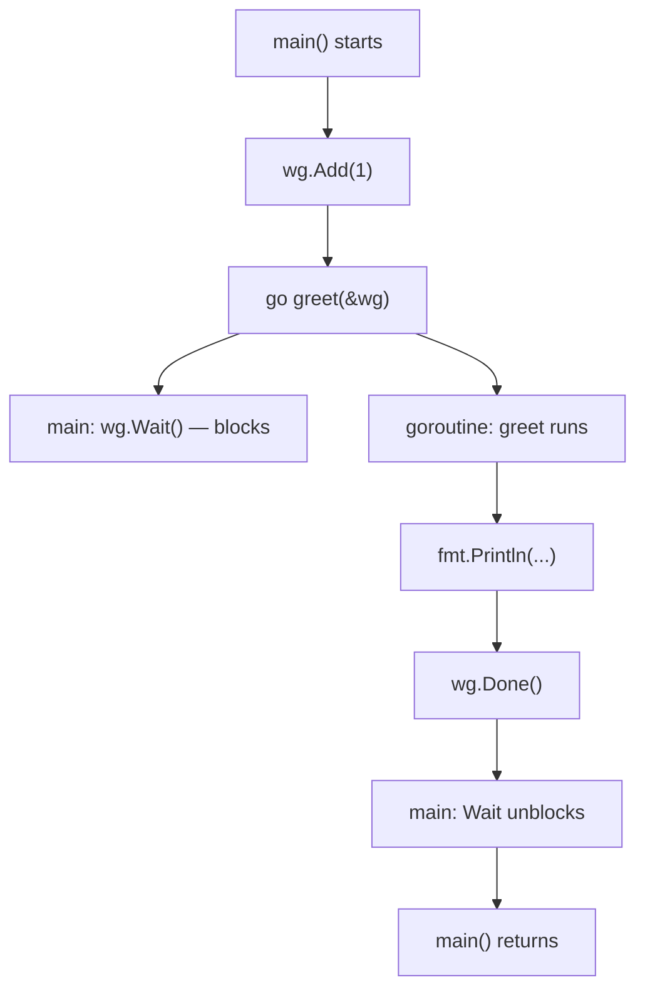
```mermaid
flowchart TD
    A["main() starts"] --> B["wg.Add(1)"]
    B --> C["go greet(&wg)"]
    C --> D["main: wg.Wait() — blocks"]
    C --> E["goroutine: greet runs"]
    E --> F["fmt.Println(...)"]
    F --> G["wg.Done()"]
    G --> H["main: Wait unblocks"]
    H --> I["main() returns"]
```

### Interviewer Questions

1. What happens if `wg.Add(1)` is moved inside the goroutine?
2. Why is `defer wg.Done()` preferred over a bare `wg.Done()` at the end?
3. How does the Go scheduler decide when to run the goroutine — immediately or lazily?
4. What is the default goroutine stack size in Go 1.21+ and how does it grow?
5. Can you replace the WaitGroup with a channel for the same effect? What are the trade-offs?
6. How would the race detector (`go run -race`) behave on the `time.Sleep` version?
7. What is `GOMAXPROCS` and how does it affect this program?

### Follow-Up Questions

1. **Q1-F1:** Modify the solution so the goroutine receives a name parameter and prints "Hello from {name}!".
2. **Q1-F2:** Launch the goroutine 1000 times sequentially (one after another, not concurrently) using a loop and WaitGroup.
3. **Q1-F3:** Return a result from the goroutine to `main` using an unbuffered channel instead of WaitGroup.
4. **Q1-F4:** What is the goroutine's lifecycle? Draw a state diagram (created → runnable → running → blocked → dead).
5. **Q1-F5:** Benchmark the overhead of goroutine creation vs a direct function call using `testing.B`.

---

## Q2: Launch 5 Goroutines and Wait With WaitGroup  [Level 1 — Beginner]

> **Tags:** `#goroutine` `#WaitGroup` `#concurrency` `#sync`

### Problem Statement

Launch exactly 5 goroutines, each printing its index (0–4). Use `sync.WaitGroup` to ensure `main` waits for all 5 to complete. The output order may vary (non-deterministic), but all 5 lines must print before the program exits.

### Input / Output / Constraints

- **Input:** Count `n = 5` (hardcoded)
- **Output:** 5 lines, each of the form `Worker N done` where N ∈ {0,1,2,3,4} in any order
- **Constraints:** No `time.Sleep`; use WaitGroup; demonstrate the classic variable-capture pitfall.

### Thought Process

A common beginner mistake is capturing the loop variable `i` by reference inside a closure. By the time the goroutine runs, `i` may already be `5`. The fix is to either pass `i` as a function argument to the goroutine or shadow it with a local copy.

### Brute Force

```go
package main

import (
    "fmt"
    "sync"
)

func main() {
    var wg sync.WaitGroup
    for i := 0; i < 5; i++ {
        wg.Add(1)
        go func() { // BUG: captures i by reference
            defer wg.Done()
            fmt.Printf("Worker %d done\n", i) // always prints 5
        }()
    }
    wg.Wait()
}
```

**Time:** O(n) | **Space:** O(1)

> **Bug:** All goroutines likely print `Worker 5 done` because they share the same `i`.

### Better Solution

```go
package main

import (
    "fmt"
    "sync"
)

func main() {
    var wg sync.WaitGroup
    for i := 0; i < 5; i++ {
        wg.Add(1)
        i := i // shadow: create a new variable per iteration
        go func() {
            defer wg.Done()
            fmt.Printf("Worker %d done\n", i)
        }()
    }
    wg.Wait()
}
```

### Best Solution

```go
package main

import (
	"fmt"
	"sync"
)

func worker(id int, wg *sync.WaitGroup) {
	defer wg.Done()
	fmt.Printf("Worker %d done\n", id)
}

func main() {
	const n = 5
	var wg sync.WaitGroup
	wg.Add(n)
	for i := 0; i < n; i++ {
		go worker(i, &wg)
	}
	wg.Wait()
	fmt.Println("All workers finished")
}
```

**Time:** O(n) | **Space:** O(n) goroutine stacks

### Production Considerations

| Aspect | Details |
|--------|---------|
| Scalability | Pattern extends to arbitrary N; for very large N consider a worker pool (Q9) to bound resource usage. |
| Edge Cases | `wg.Add(n)` before the loop is cleaner than `wg.Add(1)` inside; avoids the race where `wg.Wait` sees count=0 momentarily. |
| Error Handling | Workers here are infallible; for error propagation use `errgroup.Group` (Q8). |
| Memory | Each goroutine consumes ~2–8 KB stack; 5 goroutines is negligible. |
| Concurrency | Passing `id` as an argument (not a closure capture) eliminates data races on the loop variable. |

### Visual Explanation

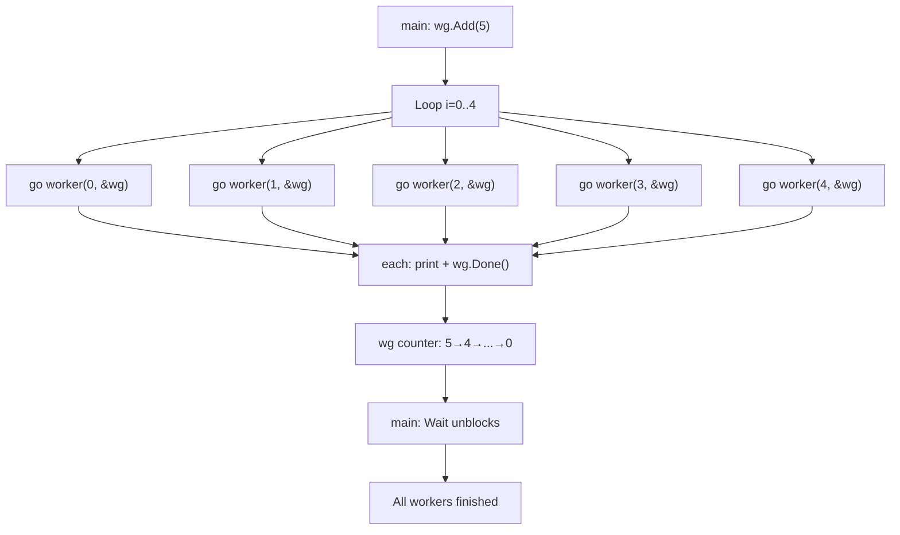
```mermaid
flowchart TD
    A["main: wg.Add(5)"] --> B["Loop i=0..4"]
    B --> C0["go worker(0, &wg)"]
    B --> C1["go worker(1, &wg)"]
    B --> C2["go worker(2, &wg)"]
    B --> C3["go worker(3, &wg)"]
    B --> C4["go worker(4, &wg)"]
    C0 & C1 & C2 & C3 & C4 --> D["each: print + wg.Done()"]
    D --> E["wg counter: 5→4→...→0"]
    E --> F["main: Wait unblocks"]
    F --> G["All workers finished"]
```

### Interviewer Questions

1. Why does `i := i` inside the loop body fix the closure capture bug?
2. In Go 1.22+, loop variable semantics changed — how does that affect this pattern?
3. What is the difference between `wg.Add(1)` inside the loop vs `wg.Add(n)` before the loop?
4. Can `wg.Done()` be called more times than `wg.Add`? What happens?
5. How would you make the output deterministic (always print 0,1,2,3,4 in order)?
6. What does `go vet` detect regarding WaitGroup misuse?
7. How does a negative WaitGroup counter manifest at runtime?

### Follow-Up Questions

1. **Q2-F1:** Generalise to accept `n` as a command-line argument.
2. **Q2-F2:** Make each worker sleep for a random duration (0–100ms) and observe ordering.
3. **Q2-F3:** Collect each worker's result in a slice (hint: pre-allocate the slice so indexing is race-free).
4. **Q2-F4:** Replace WaitGroup with a done channel (`chan struct{}`) and compare ergonomics.
5. **Q2-F5:** Add a context with cancellation so all workers stop early if one fails.

---

## Q3: Goroutine With a Function Argument (Not Closure)  [Level 1 — Beginner]

> **Tags:** `#goroutine` `#function-argument` `#no-closure` `#concurrency`

### Problem Statement

Launch a goroutine by passing a named function (not an anonymous closure) as the concurrency target. The function should accept a string argument and print a greeting. Demonstrate that passing values as arguments avoids variable capture issues entirely.

### Input / Output / Constraints

- **Input:** A slice of names: `["Alice", "Bob", "Charlie"]`
- **Output:** Three greeting lines in arbitrary order, e.g. `Hello, Alice!`
- **Constraints:** No anonymous closures; use a named top-level function; synchronise with WaitGroup.

### Thought Process

Closures capture variables by reference, which can cause bugs. An alternative that is always safe is to pass the goroutine's data as explicit function arguments. Each call gets its own copy of the arguments on the stack, so there is no shared mutable state. This is the preferred pattern when the function is reusable across the codebase.

### Brute Force

```go
package main

import (
    "fmt"
)

func greet(name string) {
    fmt.Printf("Hello, %s!\n", name)
}

func main() {
    names := []string{"Alice", "Bob", "Charlie"}
    for _, name := range names {
        go greet(name) // no synchronisation — some may not print
    }
}
```

**Time:** O(n) | **Space:** O(1)

> **Bug:** `main` exits before goroutines complete.

### Better Solution

```go
package main

import (
    "fmt"
    "sync"
)

func greet(name string, wg *sync.WaitGroup) {
    defer wg.Done()
    fmt.Printf("Hello, %s!\n", name)
}

func main() {
    names := []string{"Alice", "Bob", "Charlie"}
    var wg sync.WaitGroup
    wg.Add(len(names))
    for _, name := range names {
        go greet(name, &wg) // name is copied into the call frame
    }
    wg.Wait()
}
```

### Best Solution

```go
package main

import (
	"fmt"
	"sync"
)

// greet is a pure, reusable function — no closure, no shared state.
func greet(name string, wg *sync.WaitGroup) {
	defer wg.Done()
	fmt.Printf("Hello, %s!\n", name)
}

func launchGreetings(names []string) {
	var wg sync.WaitGroup
	wg.Add(len(names))
	for _, name := range names {
		go greet(name, &wg) // argument copy; range variable safe since Go 1.22
	}
	wg.Wait()
}

func main() {
	names := []string{"Alice", "Bob", "Charlie"}
	launchGreetings(names)
	fmt.Println("All greetings sent.")
}
```

**Time:** O(n) | **Space:** O(n) goroutine stacks

### Production Considerations

| Aspect | Details |
|--------|---------|
| Scalability | Named functions are testable in isolation; closures inline logic that cannot be unit-tested without running the goroutine. |
| Edge Cases | Empty `names` slice: `wg.Add(0)` is fine; `wg.Wait()` returns immediately. |
| Error Handling | Extend `greet` to return an error via a buffered `chan error` of size `len(names)`. |
| Memory | String arguments are passed as a (pointer, length) header — O(1) copy regardless of string content. |
| Concurrency | No shared mutable state; function is inherently goroutine-safe. |

### Visual Explanation

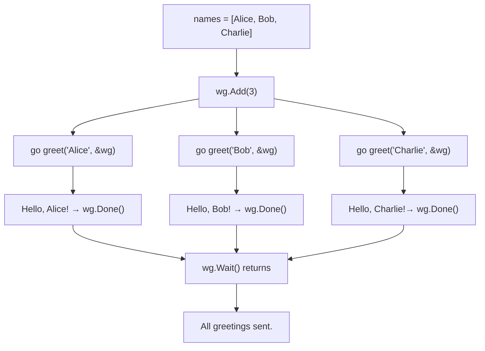
```mermaid
flowchart TD
    A["names = [Alice, Bob, Charlie]"] --> B["wg.Add(3)"]
    B --> C1["go greet('Alice', &wg)"]
    B --> C2["go greet('Bob', &wg)"]
    B --> C3["go greet('Charlie', &wg)"]
    C1 --> P1["Hello, Alice!  → wg.Done()"]
    C2 --> P2["Hello, Bob!    → wg.Done()"]
    C3 --> P3["Hello, Charlie!→ wg.Done()"]
    P1 & P2 & P3 --> W["wg.Wait() returns"]
    W --> E["All greetings sent."]
```

### Interviewer Questions

1. What is the difference between passing a value type vs a pointer type as a goroutine argument?
2. Why is `*sync.WaitGroup` passed as a pointer rather than by value?
3. How does passing `name` by value protect against the loop variable capture bug?
4. Can you achieve the same result without passing `*sync.WaitGroup` — what alternatives exist?
5. What does the Go memory model guarantee about the visibility of writes made before `go` statement?
6. When would you prefer a closure over a named function for a goroutine?
7. How does the compiler handle the escape analysis for `name` passed to a goroutine?

### Follow-Up Questions

1. **Q3-F1:** Extend `greet` to return a formatted string via a `chan string`; collect all results in `main`.
2. **Q3-F2:** Add error simulation: 1-in-3 chance `greet` returns an error; collect errors with `errgroup`.
3. **Q3-F3:** Make `launchGreetings` accept a `context.Context` and cancel all pending goroutines on timeout.
4. **Q3-F4:** Write a unit test for `greet` that captures stdout and verifies the output.
5. **Q3-F5:** Benchmark named-function goroutine launch vs closure goroutine launch for 10,000 iterations.

---

## Q4: Goroutine Closure Variable Capture Bug — Show the Bug and Fix  [Level 2 — Easy]

> **Tags:** `#closure` `#variable-capture` `#race-condition` `#goroutine` `#go-vet`

### Problem Statement

The following loop launches goroutines with closures that capture the loop variable `i`. Identify the bug, explain why it occurs, and provide two fixes. Also demonstrate the race detector catching the issue.

```go
for i := 0; i < 5; i++ {
    go func() {
        fmt.Println(i)
    }()
}
```

### Input / Output / Constraints

- **Input:** Loop 0–4
- **Buggy Output:** likely `5 5 5 5 5` (or similar repeats)
- **Expected Output:** `0 1 2 3 4` (in any order)
- **Constraints:** Demonstrate both the shadowing fix and the argument-passing fix.

### Thought Process

Closures in Go capture variables by reference — not by value. The goroutines share the same `i` variable in memory. The main goroutine increments `i` to `5` faster than the scheduler runs the goroutines; by the time each goroutine executes `fmt.Println(i)`, `i == 5`. This is a classic data race: concurrent read (goroutine) and write (loop) without synchronisation.

### Brute Force

```go
package main

import (
    "fmt"
    "sync"
)

// BUGGY VERSION
func buggy() {
    var wg sync.WaitGroup
    for i := 0; i < 5; i++ {
        wg.Add(1)
        go func() {
            defer wg.Done()
            fmt.Println(i) // captures &i — data race!
        }()
    }
    wg.Wait()
}
```

**Time:** O(n) | **Space:** O(1)

### Better Solution

```go
package main

import (
    "fmt"
    "sync"
)

// Fix 1: shadow the loop variable
func fixShadow() {
    var wg sync.WaitGroup
    for i := 0; i < 5; i++ {
        wg.Add(1)
        i := i // new variable per iteration
        go func() {
            defer wg.Done()
            fmt.Println(i)
        }()
    }
    wg.Wait()
}

// Fix 2: pass as argument
func fixArg() {
    var wg sync.WaitGroup
    for i := 0; i < 5; i++ {
        wg.Add(1)
        go func(n int) {
            defer wg.Done()
            fmt.Println(n)
        }(i) // i evaluated at call site, copied into n
    }
    wg.Wait()
}
```

### Best Solution

```go
package main

import (
	"fmt"
	"sync"
)

func runBuggy() {
	fmt.Println("=== BUGGY (likely prints 5 five times) ===")
	var wg sync.WaitGroup
	for i := 0; i < 5; i++ {
		wg.Add(1)
		go func() {
			defer wg.Done()
			fmt.Println(i) // data race: go run -race will flag this
		}()
	}
	wg.Wait()
}

func runFixed() {
	fmt.Println("=== FIXED (argument copy) ===")
	var wg sync.WaitGroup
	for i := 0; i < 5; i++ {
		wg.Add(1)
		go func(n int) { // n is a copy of i at this moment
			defer wg.Done()
			fmt.Println(n)
		}(i)
	}
	wg.Wait()
}

func main() {
	// Uncomment to see the bug (do NOT use -race with runBuggy in production):
	// runBuggy()
	runFixed()
}
```

**Time:** O(n) | **Space:** O(n)

### Production Considerations

| Aspect | Details |
|--------|---------|
| Scalability | The argument-copy fix has zero overhead — values are passed on the stack. |
| Edge Cases | In Go 1.22+, range loop variables are per-iteration by default, eliminating this bug for `for range` loops. |
| Error Handling | The race detector (`-race`) must be enabled in CI to catch this class of bug automatically. |
| Memory | Shadow variable `i := i` allocates a new int on the stack per iteration — negligible. |
| Concurrency | `go vet` and `staticcheck` flag some (not all) closure-capture races; always combine with `-race`. |

### Visual Explanation

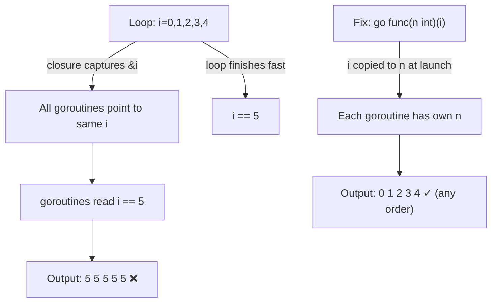
```mermaid
flowchart TD
    A["Loop: i=0,1,2,3,4"] -->|"closure captures &i"| B["All goroutines point to same i"]
    A -->|"loop finishes fast"| C["i == 5"]
    B --> D["goroutines read i == 5"]
    D --> E["Output: 5 5 5 5 5 ❌"]

    F["Fix: go func(n int)(i)"] -->|"i copied to n at launch"| G["Each goroutine has own n"]
    G --> H["Output: 0 1 2 3 4 ✓ (any order)"]
```

### Interviewer Questions

1. Why does the Go memory model classify this as a data race, not just a logical bug?
2. How does Go 1.22 change loop variable semantics, and does it fully eliminate this class of bug?
3. What does `go run -race` do at the binary level to detect races?
4. Is the shadow fix (`i := i`) equivalent to the argument fix? Are there any subtle differences?
5. Can `go vet` statically detect all closure capture bugs? Why or why not?
6. In a `for _, v := range slice` loop, where is the race if `v` is captured by a closure?
7. How would you audit a large codebase for this pattern automatically?

### Follow-Up Questions

1. **Q4-F1:** Write a test with `-race` that reliably triggers and reports the data race.
2. **Q4-F2:** Rewrite using Go 1.22's per-iteration loop variable semantics and confirm correctness.
3. **Q4-F3:** Does the same bug manifest with `for _, v := range slice`? Show an example.
4. **Q4-F4:** Use `sync/atomic` to build a safe shared counter incremented by captured goroutines.
5. **Q4-F5:** How does `staticcheck SA4010` or `loopvar` lint rule help catch this at code-review time?

---

## Q5: Parallel Sum of a Large Slice Using Goroutines  [Level 2 — Easy]

> **Tags:** `#parallel` `#goroutine` `#divide-and-conquer` `#channel` `#performance`

### Problem Statement

Given a slice of one million integers, compute their sum using multiple goroutines working on sub-slices in parallel. Compare the single-goroutine baseline with the parallel version and discuss when parallelism pays off.

### Input / Output / Constraints

- **Input:** `nums []int` of length 1,000,000 with values in [0, 1000]
- **Output:** Single integer — the total sum
- **Constraints:** Use `runtime.NumCPU()` goroutines; avoid mutex for the final reduction; result must be exact.

### Thought Process

Divide the slice into `numCPU` equal chunks. Each goroutine sums its chunk independently (no shared state) and sends the partial sum on a buffered channel. The main goroutine reads all partial sums and adds them. This is a textbook map-reduce pattern.

### Brute Force

```go
package main

import "fmt"

func sumSerial(nums []int) int {
    total := 0
    for _, v := range nums {
        total += v
    }
    return total
}

func main() {
    nums := make([]int, 1_000_000)
    for i := range nums { nums[i] = i % 1000 }
    fmt.Println(sumSerial(nums))
}
```

**Time:** O(n) | **Space:** O(1)

### Better Solution

```go
package main

import (
    "fmt"
    "runtime"
)

func parallelSum(nums []int) int {
    n := runtime.NumCPU()
    ch := make(chan int, n)
    chunkSize := (len(nums) + n - 1) / n

    for i := 0; i < n; i++ {
        start := i * chunkSize
        end := start + chunkSize
        if end > len(nums) { end = len(nums) }
        go func(slice []int) {
            s := 0
            for _, v := range slice { s += v }
            ch <- s
        }(nums[start:end])
    }

    total := 0
    for i := 0; i < n; i++ {
        total += <-ch
    }
    return total
}
```

### Best Solution

```go
package main

import (
	"fmt"
	"runtime"
	"sync"
)

func parallelSum(nums []int) int {
	numWorkers := runtime.NumCPU()
	chunkSize := (len(nums) + numWorkers - 1) / numWorkers

	var (
		wg      sync.WaitGroup
		mu      sync.Mutex
		total   int
	)

	for i := 0; i < numWorkers; i++ {
		start := i * chunkSize
		if start >= len(nums) {
			break
		}
		end := start + chunkSize
		if end > len(nums) {
			end = len(nums)
		}
		wg.Add(1)
		go func(slice []int) {
			defer wg.Done()
			local := 0
			for _, v := range slice {
				local += v
			}
			mu.Lock()
			total += local
			mu.Unlock()
		}(nums[start:end])
	}

	wg.Wait()
	return total
}

func main() {
	const size = 1_000_000
	nums := make([]int, size)
	for i := range nums {
		nums[i] = i % 1000
	}
	fmt.Println("Sum:", parallelSum(nums))
}
```

**Time:** O(n/p) parallel, O(n) wall-clock work | **Space:** O(p) for goroutines

### Production Considerations

| Aspect | Details |
|--------|---------|
| Scalability | Speedup is bounded by Amdahl's Law; for pure addition the serial fraction is tiny and parallelism helps for n > ~100K on multi-core machines. |
| Edge Cases | Empty slice: `len(nums)==0`; `chunkSize` computation gives 0, loop body is skipped, returns 0. Slice shorter than `numWorkers`: some goroutines get empty slices. |
| Error Handling | Integer overflow: use `int64` for large values; consider `math/big` for arbitrary precision. |
| Memory | Slices are passed as headers (pointer+len+cap); no data copying. |
| Concurrency | Local accumulation then one mutex lock per goroutine minimises contention. Channel-based reduction (Better Solution) avoids mutex entirely. |

### Visual Explanation

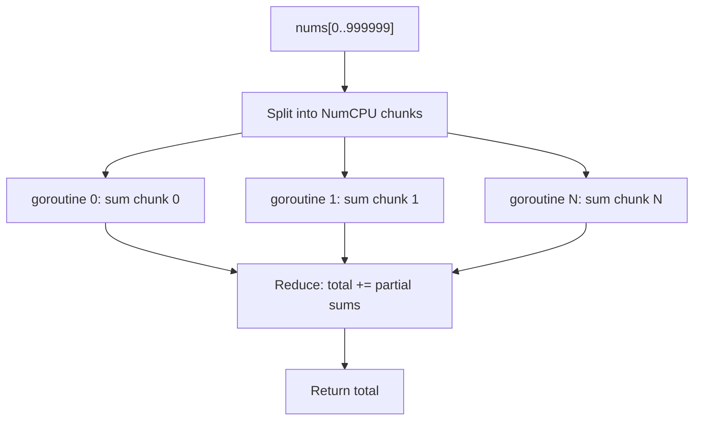
```mermaid
flowchart TD
    A["nums[0..999999]"] --> B["Split into NumCPU chunks"]
    B --> C0["goroutine 0: sum chunk 0"]
    B --> C1["goroutine 1: sum chunk 1"]
    B --> CN["goroutine N: sum chunk N"]
    C0 --> R["Reduce: total += partial sums"]
    C1 --> R
    CN --> R
    R --> O["Return total"]
```

### Interviewer Questions

1. At what slice size does the parallel version become faster than the serial version on a 4-core machine?
2. Why does the channel-based reduction avoid the mutex entirely?
3. How does false sharing in CPU caches affect performance when goroutines write to adjacent memory?
4. What is Amdahl's Law and how does it limit the speedup here?
5. How would you benchmark this with `testing.B` and compare with `pprof`?
6. Is `int` addition commutative and associative in Go? Does order of summation matter for correctness?
7. How would you extend this to support a custom reduce function (e.g., product, max)?

### Follow-Up Questions

1. **Q5-F1:** Benchmark serial vs parallel for sizes 1K, 10K, 100K, 1M and plot crossover point.
2. **Q5-F2:** Replace the mutex with `sync/atomic.AddInt64` and measure the difference.
3. **Q5-F3:** Implement a generic `ParallelReduce[T any](slice []T, identity T, f func(T,T)T) T`.
4. **Q5-F4:** Use `golang.org/x/sync/errgroup` to return an error if any chunk contains a negative value.
5. **Q5-F5:** How would SIMD/AVX instructions (via CGo or assembly) further accelerate this beyond goroutine parallelism?

---

## Q6: Multiple Goroutines Writing to a Channel  [Level 2 — Easy]

> **Tags:** `#channel` `#goroutine` `#fan-in` `#buffered-channel` `#sync`

### Problem Statement

Launch N producer goroutines each sending M messages to a shared channel. A single consumer goroutine reads all messages and prints them. Ensure no messages are lost and the program terminates cleanly without deadlock.

### Input / Output / Constraints

- **Input:** `N=3` producers, `M=4` messages each
- **Output:** 12 unique messages consumed and printed
- **Constraints:** Use a buffered channel sized appropriately; close the channel exactly once after all producers finish; no deadlock.

### Thought Process

Multiple goroutines can safely send to the same channel concurrently — Go channels are goroutine-safe by design. The challenge is knowing when all producers are done so the channel can be closed exactly once. A WaitGroup monitors all producers; a separate closer goroutine calls `close(ch)` after `wg.Wait()` returns. The consumer ranges over the channel and exits automatically when it's closed.

### Brute Force

```go
package main

import "fmt"

func main() {
    ch := make(chan string, 12)
    for i := 0; i < 3; i++ {
        for j := 0; j < 4; j++ {
            ch <- fmt.Sprintf("producer %d msg %d", i, j) // blocks if full
        }
    }
    close(ch)
    for msg := range ch {
        fmt.Println(msg)
    }
}
```

**Time:** O(N*M) | **Space:** O(N*M)

> Not concurrent — producers run sequentially in `main`.

### Better Solution

```go
package main

import (
    "fmt"
    "sync"
)

func main() {
    const (N, M = 3, 4)
    ch := make(chan string, N*M)
    var wg sync.WaitGroup

    for i := 0; i < N; i++ {
        wg.Add(1)
        go func(id int) {
            defer wg.Done()
            for j := 0; j < M; j++ {
                ch <- fmt.Sprintf("producer %d msg %d", id, j)
            }
        }(i)
    }

    go func() {
        wg.Wait()
        close(ch)
    }()

    for msg := range ch {
        fmt.Println(msg)
    }
}
```

### Best Solution

```go
package main

import (
	"fmt"
	"sync"
)

func producer(id, messages int, ch chan<- string, wg *sync.WaitGroup) {
	defer wg.Done()
	for j := 0; j < messages; j++ {
		ch <- fmt.Sprintf("producer-%d: message-%d", id, j)
	}
}

func consumer(ch <-chan string, done chan<- struct{}) {
	for msg := range ch {
		fmt.Println(msg)
	}
	close(done) // signal consumer finished
}

func main() {
	const (
		numProducers = 3
		numMessages  = 4
	)

	ch := make(chan string, numProducers*numMessages)
	done := make(chan struct{})

	var wg sync.WaitGroup
	wg.Add(numProducers)
	for i := 0; i < numProducers; i++ {
		go producer(i, numMessages, ch, &wg)
	}

	go func() {
		wg.Wait()
		close(ch) // safe: called exactly once after all producers done
	}()

	go consumer(ch, done)
	<-done

	fmt.Printf("Consumed %d messages total.\n", numProducers*numMessages)
}
```

**Time:** O(N*M) | **Space:** O(N*M) buffered

### Production Considerations

| Aspect | Details |
|--------|---------|
| Scalability | Unbuffered channel causes producers to block until consumer keeps up (back-pressure). Buffered channel decouples producer/consumer throughput. |
| Edge Cases | If buffer is too small, producers block; for dynamic N*M, compute buffer size at runtime or use 0-buffer with faster consumer. |
| Error Handling | `close` on a closed channel panics; the WaitGroup pattern ensures `close` is called exactly once. |
| Memory | Buffered channel holds N*M strings in heap; for large payloads, send pointers instead. |
| Concurrency | Directional channel types (`chan<-`, `<-chan`) enforce send/receive roles at compile time. |

### Visual Explanation

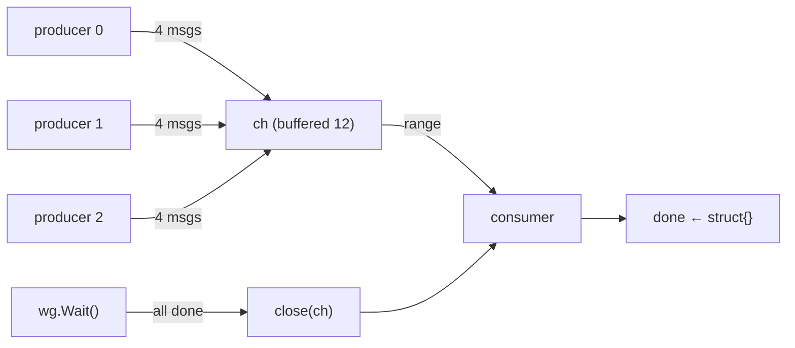
```mermaid
flowchart LR
    P0["producer 0"] -->|"4 msgs"| CH["ch (buffered 12)"]
    P1["producer 1"] -->|"4 msgs"| CH
    P2["producer 2"] -->|"4 msgs"| CH
    CH -->|"range"| CON["consumer"]
    WG["wg.Wait()"] -->|"all done"| CL["close(ch)"]
    CL --> CON
    CON --> DONE["done ← struct{}"]
```

### Interviewer Questions

1. What happens if you call `close(ch)` twice? How does the WaitGroup pattern prevent it?
2. Why is the channel buffer sized to `N*M`? What are the trade-offs of a smaller buffer?
3. What is the difference between an unbuffered and a buffered channel semantically?
4. How do directional channel types (`chan<-` vs `<-chan`) improve API safety?
5. How would you implement a fan-in that merges N channels into one?
6. What is the "happens-before" guarantee of a channel send/receive in the Go memory model?
7. How would you add back-pressure so producers slow down when the consumer is overwhelmed?

### Follow-Up Questions

1. **Q6-F1:** Implement a fan-in function `merge(channels ...<-chan string) <-chan string`.
2. **Q6-F2:** Add a rate limiter so producers send at most 10 messages/second total.
3. **Q6-F3:** Replace the buffered channel with an unbuffered one; what must change?
4. **Q6-F4:** Measure throughput (messages/sec) for buffer sizes 0, 1, N, N*M using benchmarks.
5. **Q6-F5:** Implement a priority queue of producers where producer 0 messages are consumed first.

---

## Q7: Timeout on a Slow Goroutine Using select + time.After  [Level 2 — Easy]

> **Tags:** `#select` `#timeout` `#time.After` `#channel` `#context`

### Problem Statement

Launch a goroutine that simulates a slow operation (2 seconds). Use `select` with `time.After` to impose a 1-second deadline. If the operation completes in time, print the result; if it times out, print "operation timed out" and continue without waiting for the goroutine to finish.

### Input / Output / Constraints

- **Input:** Slow operation duration = 2s, timeout = 1s
- **Output:** `"operation timed out"` printed after ~1 second
- **Constraints:** Do not use `time.Sleep` in `main` to wait; use `select`; discuss goroutine leak.

### Thought Process

`time.After(d)` returns a `<-chan Time` that receives once after duration `d`. A `select` statement blocks until one of its cases is ready. By selecting between the result channel and `time.After`, we get whichever arrives first. If we take the timeout path, the slow goroutine is still running — this is a goroutine leak unless we use a context or a buffered channel.

### Brute Force

```go
package main

import (
    "fmt"
    "time"
)

func slowOp() string {
    time.Sleep(2 * time.Second)
    return "result"
}

func main() {
    ch := make(chan string)
    go func() { ch <- slowOp() }()

    select {
    case res := <-ch:
        fmt.Println("Got:", res)
    case <-time.After(1 * time.Second):
        fmt.Println("operation timed out")
        // BUG: goroutine is still running, ch is never drained — goroutine leak
    }
}
```

**Time:** O(1) wall-clock bounded by timeout | **Space:** O(1)

### Better Solution

```go
package main

import (
    "fmt"
    "time"
)

func main() {
    ch := make(chan string, 1) // buffered: goroutine can send even after timeout
    go func() {
        time.Sleep(2 * time.Second)
        ch <- "result" // won't block; channel is buffered
    }()

    select {
    case res := <-ch:
        fmt.Println("Got:", res)
    case <-time.After(1 * time.Second):
        fmt.Println("operation timed out")
        // goroutine will eventually finish and send to buffered ch (GC'd after)
    }
}
```

### Best Solution

```go
package main

import (
	"context"
	"fmt"
	"time"
)

func slowOperation(ctx context.Context) (string, error) {
	select {
	case <-time.After(2 * time.Second): // simulate work
		return "result", nil
	case <-ctx.Done():
		return "", ctx.Err()
	}
}

func main() {
	ctx, cancel := context.WithTimeout(context.Background(), 1*time.Second)
	defer cancel() // always release resources

	type result struct {
		val string
		err error
	}
	ch := make(chan result, 1)

	go func() {
		val, err := slowOperation(ctx)
		ch <- result{val, err}
	}()

	select {
	case r := <-ch:
		if r.err != nil {
			fmt.Println("operation timed out:", r.err)
		} else {
			fmt.Println("Got:", r.val)
		}
	case <-ctx.Done():
		fmt.Println("operation timed out:", ctx.Err())
	}
}
```

**Time:** O(1) bounded | **Space:** O(1)

### Production Considerations

| Aspect | Details |
|--------|---------|
| Scalability | `context.WithTimeout` propagates cancellation through the entire call tree; `time.After` only covers a single select. |
| Edge Cases | Goroutine leak: always use buffered channel or context cancellation to ensure the goroutine can exit. |
| Error Handling | `ctx.Err()` returns `context.DeadlineExceeded` or `context.Canceled` — clients can distinguish them. |
| Memory | `time.After` creates a timer that is NOT garbage collected until it fires; prefer `time.NewTimer` + `timer.Stop()` in tight loops. |
| Concurrency | `defer cancel()` must always be called to prevent context goroutine leak in the runtime. |

### Visual Explanation

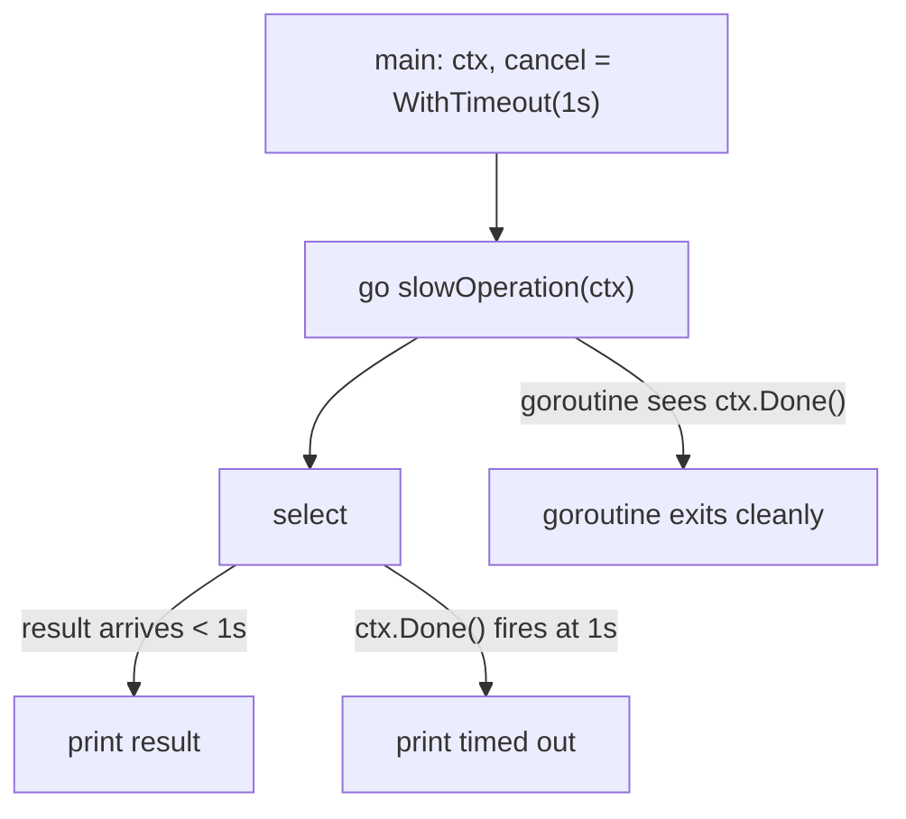
```mermaid
flowchart TD
    A["main: ctx, cancel = WithTimeout(1s)"] --> B["go slowOperation(ctx)"]
    B --> S["select"]
    S -->|"result arrives < 1s"| R["print result"]
    S -->|"ctx.Done() fires at 1s"| T["print timed out"]
    B -->|"goroutine sees ctx.Done()"| X["goroutine exits cleanly"]
```

### Interviewer Questions

1. What is a goroutine leak and why does the unbuffered-channel + timeout pattern cause one?
2. How does `time.After` differ from `time.NewTimer` in terms of memory management?
3. Why is `defer cancel()` required even when the context times out naturally?
4. How does `context.WithTimeout` differ from `context.WithDeadline`?
5. Can `select` have a default case? What does it mean in the context of timeouts?
6. How would you implement retry-with-timeout (3 attempts, 500ms each)?
7. How does the Go runtime clean up a timer created by `time.After` after it fires?

### Follow-Up Questions

1. **Q7-F1:** Implement `retry(ctx, f, maxAttempts int)` that retries `f` up to N times with per-attempt timeouts.
2. **Q7-F2:** Replace `time.After` with `time.NewTimer` and call `timer.Stop()` on the success path.
3. **Q7-F3:** Propagate the context into a downstream HTTP call and observe cancellation behaviour.
4. **Q7-F4:** Build a `race(ctx, funcs ...func(context.Context) (string, error)) string` that returns the first successful result.
5. **Q7-F5:** What does the pprof goroutine profile show when goroutine leaks accumulate? Demonstrate with a test.

---

## Q8: errgroup for Parallel HTTP Fetch With Error Collection  [Level 2 — Easy]

> **Tags:** `#errgroup` `#parallel` `#HTTP` `#error-handling` `#context`

### Problem Statement

Fetch three URLs concurrently using `golang.org/x/sync/errgroup`. If any fetch fails, cancel all remaining fetches and return the first error. Collect all successful response bodies. Demonstrate proper context propagation and error handling.

### Input / Output / Constraints

- **Input:** `urls []string` of length 3
- **Output:** Slice of response body strings for successful fetches, or the first error
- **Constraints:** Use `errgroup.WithContext`; cancel on first error; handle HTTP errors (non-2xx) as errors.

### Thought Process

`errgroup.Group` is `sync.WaitGroup` + error propagation + context cancellation bundled together. `errgroup.WithContext` returns a context that is cancelled when the first goroutine returns a non-nil error. All goroutines should check this context to exit early. Results must be stored in a pre-allocated slice (indexed by goroutine) to avoid races — never append to a shared slice from multiple goroutines.

### Brute Force

```go
package main

import (
    "fmt"
    "io"
    "net/http"
)

func fetchAll(urls []string) ([]string, error) {
    results := make([]string, len(urls))
    for i, url := range urls {
        resp, err := http.Get(url)
        if err != nil { return nil, err }
        defer resp.Body.Close()
        body, _ := io.ReadAll(resp.Body)
        results[i] = string(body)
    }
    return results, nil
}
```

**Time:** O(n * latency) serial | **Space:** O(total_body_size)

### Better Solution

```go
package main

import (
    "context"
    "fmt"
    "io"
    "net/http"
    "golang.org/x/sync/errgroup"
)

func fetchAll(ctx context.Context, urls []string) ([]string, error) {
    results := make([]string, len(urls))
    g, ctx := errgroup.WithContext(ctx)

    for i, url := range urls {
        i, url := i, url
        g.Go(func() error {
            req, _ := http.NewRequestWithContext(ctx, http.MethodGet, url, nil)
            resp, err := http.DefaultClient.Do(req)
            if err != nil { return err }
            defer resp.Body.Close()
            body, err := io.ReadAll(resp.Body)
            if err != nil { return err }
            results[i] = string(body) // safe: each goroutine writes to distinct index
            return nil
        })
    }
    return results, g.Wait()
}
```

### Best Solution

```go
package main

import (
	"context"
	"fmt"
	"io"
	"net/http"
	"time"

	"golang.org/x/sync/errgroup"
)

type FetchResult struct {
	URL  string
	Body string
}

func fetchURL(ctx context.Context, client *http.Client, url string) (string, error) {
	req, err := http.NewRequestWithContext(ctx, http.MethodGet, url, nil)
	if err != nil {
		return "", fmt.Errorf("build request %s: %w", url, err)
	}
	resp, err := client.Do(req)
	if err != nil {
		return "", fmt.Errorf("fetch %s: %w", url, err)
	}
	defer resp.Body.Close()
	if resp.StatusCode < 200 || resp.StatusCode >= 300 {
		return "", fmt.Errorf("fetch %s: non-2xx status %d", url, resp.StatusCode)
	}
	body, err := io.ReadAll(resp.Body)
	if err != nil {
		return "", fmt.Errorf("read body %s: %w", url, err)
	}
	return string(body), nil
}

func FetchAll(ctx context.Context, urls []string) ([]FetchResult, error) {
	client := &http.Client{Timeout: 10 * time.Second}
	results := make([]FetchResult, len(urls))

	g, ctx := errgroup.WithContext(ctx)
	for i, url := range urls {
		i, url := i, url
		g.Go(func() error {
			body, err := fetchURL(ctx, client, url)
			if err != nil {
				return err
			}
			results[i] = FetchResult{URL: url, Body: body}
			return nil
		})
	}
	if err := g.Wait(); err != nil {
		return nil, err
	}
	return results, nil
}

func main() {
	urls := []string{
		"https://httpbin.org/get",
		"https://httpbin.org/uuid",
		"https://httpbin.org/ip",
	}
	results, err := FetchAll(context.Background(), urls)
	if err != nil {
		fmt.Println("Error:", err)
		return
	}
	for _, r := range results {
		fmt.Printf("URL: %s | Body length: %d\n", r.URL, len(r.Body))
	}
}
```

**Time:** O(max(latency_i)) parallel | **Space:** O(sum of body sizes)

### Production Considerations

| Aspect | Details |
|--------|---------|
| Scalability | `errgroup` with `SetLimit(n)` bounds concurrency; without a limit, 10,000 URLs launch 10,000 goroutines simultaneously — use `g.SetLimit(20)` for rate control. |
| Edge Cases | Context cancelled before any fetch starts; `http.NewRequestWithContext` returns immediately with ctx.Err(). |
| Error Handling | `%w` wrapping preserves error chain; callers can `errors.Is(err, context.Canceled)` to distinguish cancellation from network errors. |
| Memory | Large response bodies: stream to disk rather than `io.ReadAll` into memory. |
| Concurrency | Writing `results[i]` from goroutine `i` is safe because each goroutine accesses a unique index. |

### Visual Explanation

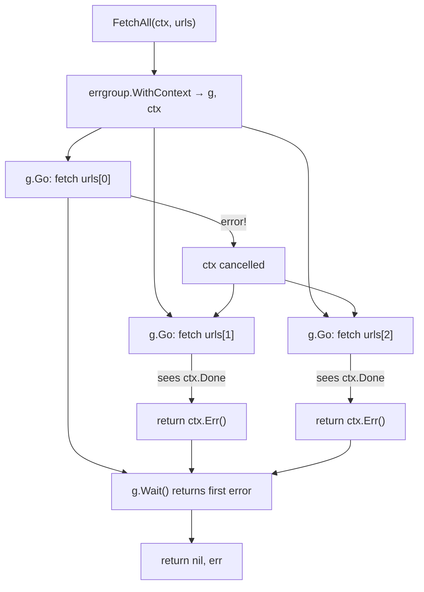
```mermaid
flowchart TD
    A["FetchAll(ctx, urls)"] --> B["errgroup.WithContext → g, ctx"]
    B --> G0["g.Go: fetch urls[0]"]
    B --> G1["g.Go: fetch urls[1]"]
    B --> G2["g.Go: fetch urls[2]"]
    G0 -->|"error!"| E["ctx cancelled"]
    E --> G1 & G2
    G1 -->|"sees ctx.Done"| X1["return ctx.Err()"]
    G2 -->|"sees ctx.Done"| X2["return ctx.Err()"]
    G0 & X1 & X2 --> W["g.Wait() returns first error"]
    W --> R["return nil, err"]
```

### Interviewer Questions

1. How does `errgroup.WithContext` differ from a plain `errgroup.Group`?
2. Why is `results[i] = ...` (indexed write) safe without a mutex, while `results = append(results, ...)` is not?
3. What does `g.SetLimit(n)` do and when would you use it?
4. How does `%w` error wrapping interact with `errors.Is` and `errors.As`?
5. What happens to in-flight goroutines when the context is cancelled — do they stop immediately?
6. How would you collect all errors (not just the first) from parallel goroutines?
7. What is the difference between `http.Client.Timeout` and a context deadline?

### Follow-Up Questions

1. **Q8-F1:** Collect all errors (not just the first) using a `[]error` protected by a mutex.
2. **Q8-F2:** Add `g.SetLimit(2)` and observe how concurrency is bounded for 10 URLs.
3. **Q8-F3:** Implement retry logic inside `fetchURL` using exponential backoff.
4. **Q8-F4:** Stream large responses to temporary files instead of buffering in memory.
5. **Q8-F5:** Write an integration test using `httptest.Server` to simulate slow/failing endpoints.

---

## Q9: Worker Pool With Fixed N Goroutines Processing Jobs  [Level 3 — Medium]

> **Tags:** `#worker-pool` `#goroutine` `#channel` `#pattern` `#bounded-concurrency`

### Problem Statement

Implement a worker pool with exactly `N` goroutines. A producer sends jobs (integers to square) on a jobs channel; workers read jobs, compute results, and send them on a results channel. Collect all results in the main goroutine.

### Input / Output / Constraints

- **Input:** Jobs: integers 1–100; Workers: N=5
- **Output:** 100 squared values (order may vary)
- **Constraints:** Exactly N goroutines running at any time; proper channel close semantics; no goroutine leak.

### Thought Process

A worker pool separates concurrency control from work distribution. By creating exactly N goroutines that all read from the same jobs channel, Go's channel semantics guarantee that each job is delivered to exactly one worker. When the jobs channel is closed, all workers exit their range loop cleanly. A WaitGroup tracks worker completion so the results channel can be closed after all workers finish.

### Brute Force

```go
package main

import "fmt"

func main() {
    jobs := make(chan int, 100)
    results := make(chan int, 100)

    // single worker — not a pool
    go func() {
        for j := range jobs {
            results <- j * j
        }
        close(results)
    }()

    for i := 1; i <= 100; i++ { jobs <- i }
    close(jobs)

    for r := range results {
        fmt.Println(r)
    }
}
```

**Time:** O(n) serial in worker | **Space:** O(n)

### Better Solution

```go
package main

import (
    "fmt"
    "sync"
)

func worker(id int, jobs <-chan int, results chan<- int, wg *sync.WaitGroup) {
    defer wg.Done()
    for j := range jobs {
        results <- j * j
    }
}

func main() {
    const numWorkers, numJobs = 5, 100
    jobs := make(chan int, numJobs)
    results := make(chan int, numJobs)
    var wg sync.WaitGroup

    for w := 1; w <= numWorkers; w++ {
        wg.Add(1)
        go worker(w, jobs, results, &wg)
    }

    for i := 1; i <= numJobs; i++ { jobs <- i }
    close(jobs)

    go func() { wg.Wait(); close(results) }()

    sum := 0
    for r := range results { sum += r }
    fmt.Println("Sum of squares:", sum)
}
```

### Best Solution

```go
package main

import (
	"fmt"
	"sync"
	"time"
)

type Job struct {
	ID    int
	Value int
}

type Result struct {
	Job     Job
	Output  int
	Elapsed time.Duration
}

func worker(id int, jobs <-chan Job, results chan<- Result, wg *sync.WaitGroup) {
	defer wg.Done()
	for job := range jobs {
		start := time.Now()
		output := job.Value * job.Value // simulate computation
		results <- Result{
			Job:     job,
			Output:  output,
			Elapsed: time.Since(start),
		}
	}
}

func Pool(numWorkers, numJobs int) []Result {
	jobs := make(chan Job, numJobs)
	results := make(chan Result, numJobs)
	var wg sync.WaitGroup

	// Launch fixed pool
	for w := 0; w < numWorkers; w++ {
		wg.Add(1)
		go worker(w, jobs, results, &wg)
	}

	// Send all jobs then close
	for i := 1; i <= numJobs; i++ {
		jobs <- Job{ID: i, Value: i}
	}
	close(jobs)

	// Close results when all workers done
	go func() {
		wg.Wait()
		close(results)
	}()

	// Collect all results
	all := make([]Result, 0, numJobs)
	for r := range results {
		all = append(all, r)
	}
	return all
}

func main() {
	results := Pool(5, 100)
	fmt.Printf("Collected %d results\n", len(results))
	// Verify: sum of squares 1..100 = 338350
	sum := 0
	for _, r := range results {
		sum += r.Output
	}
	fmt.Printf("Sum of squares 1..100 = %d (expected 338350)\n", sum)
}
```

**Time:** O(n/p) parallel processing | **Space:** O(n) for buffered channels

### Production Considerations

| Aspect | Details |
|--------|---------|
| Scalability | Pool size tuning: CPU-bound tasks → `runtime.NumCPU()`; I/O-bound tasks → 2-10x CPU count. |
| Edge Cases | Zero jobs: jobs channel closed immediately; workers exit range loop without processing; results closed; range over results returns nothing. |
| Error Handling | Extend `Result` with an `Err error` field; workers wrap errors and send them; caller checks `Result.Err`. |
| Memory | Buffering both channels to `numJobs` prevents any blocking; for streaming scenarios use unbuffered channels. |
| Concurrency | `close(jobs)` signals all workers to stop; `close(results)` after `wg.Wait()` ensures all results are flushed before the consumer exits. |

### Visual Explanation

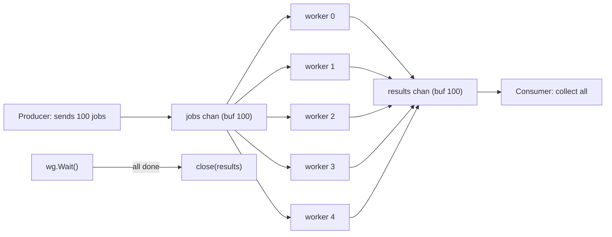
```mermaid
flowchart LR
    P["Producer: sends 100 jobs"] --> JC["jobs chan (buf 100)"]
    JC --> W0["worker 0"]
    JC --> W1["worker 1"]
    JC --> W2["worker 2"]
    JC --> W3["worker 3"]
    JC --> W4["worker 4"]
    W0 & W1 & W2 & W3 & W4 --> RC["results chan (buf 100)"]
    RC --> CON["Consumer: collect all"]
    WG["wg.Wait()"] -->|"all done"| CL["close(results)"]
```

### Interviewer Questions

1. Why must `close(jobs)` happen before workers exit their range loops?
2. What happens if `results` channel is unbuffered and the consumer is slow?
3. How does worker pool size affect throughput for CPU-bound vs I/O-bound tasks?
4. How would you implement graceful shutdown — drain in-flight jobs, then stop?
5. How would you add a priority queue so high-priority jobs are processed first?
6. What is the difference between this worker pool and `ants` or `pond` library pools?
7. How would you instrument this pool with metrics (queue depth, worker utilisation, latency)?

### Follow-Up Questions

1. **Q9-F1:** Make the pool size dynamic — scale up when queue depth exceeds threshold, scale down when idle.
2. **Q9-F2:** Add a context so the pool shuts down when ctx is cancelled, draining in-flight jobs.
3. **Q9-F3:** Implement job prioritisation using a `heap.Interface` as the job queue.
4. **Q9-F4:** Add Prometheus metrics: `jobs_queued`, `jobs_processed_total`, `job_duration_seconds`.
5. **Q9-F5:** Benchmark pool sizes 1, 2, 4, 8, 16 for a CPU-bound task and find the optimal size.

---

## Q10: Fan-Out — Distribute Work Across N Goroutines  [Level 3 — Medium]

> **Tags:** `#fan-out` `#goroutine` `#pipeline` `#channel` `#distribution`

### Problem Statement

Implement a fan-out pattern: a single input channel is replicated to N output channels. Each downstream goroutine receives every message from the source. This is useful for broadcasting events to multiple consumers (e.g., logging + metrics + alerting simultaneously).

### Input / Output / Constraints

- **Input:** Source producing integers 1–10; N=3 consumers
- **Output:** Each consumer prints all 10 values (30 lines total)
- **Constraints:** True fan-out (broadcast) not fan-out (distribute); each consumer receives all messages.

### Thought Process

Fan-out broadcast is different from a worker pool. In a worker pool, each job goes to exactly one worker. In fan-out broadcast, every consumer receives every message. The implementation creates N output channels; a single dispatcher goroutine reads from the source and writes to all N outputs. Each consumer goroutine reads from its dedicated output channel.

### Brute Force

```go
package main

import "fmt"

func main() {
    src := []int{1, 2, 3, 4, 5, 6, 7, 8, 9, 10}
    for i := 0; i < 3; i++ { // serial "fan-out" — not concurrent
        for _, v := range src {
            fmt.Printf("consumer %d: %d\n", i, v)
        }
    }
}
```

**Time:** O(N*M) serial | **Space:** O(1)

### Better Solution

```go
package main

import (
    "fmt"
    "sync"
)

func fanOut(src <-chan int, n int) []<-chan int {
    outputs := make([]chan int, n)
    for i := range outputs {
        outputs[i] = make(chan int, 10)
    }
    go func() {
        defer func() {
            for _, ch := range outputs { close(ch) }
        }()
        for v := range src {
            for _, ch := range outputs {
                ch <- v // broadcast
            }
        }
    }()
    result := make([]<-chan int, n)
    for i, ch := range outputs { result[i] = ch }
    return result
}

func main() {
    src := make(chan int, 10)
    for i := 1; i <= 10; i++ { src <- i }
    close(src)

    consumers := fanOut(src, 3)
    var wg sync.WaitGroup
    for id, ch := range consumers {
        wg.Add(1)
        go func(id int, ch <-chan int) {
            defer wg.Done()
            for v := range ch { fmt.Printf("consumer %d: %d\n", id, v) }
        }(id, ch)
    }
    wg.Wait()
}
```

### Best Solution

```go
package main

import (
	"fmt"
	"sync"
)

// FanOut broadcasts every value from src to each of the n output channels.
// It returns read-only channels, one per consumer.
func FanOut(src <-chan int, n int) []<-chan int {
	outputs := make([]chan int, n)
	for i := range outputs {
		outputs[i] = make(chan int, 16) // buffered to reduce dispatcher blocking
	}

	go func() {
		defer func() {
			for _, ch := range outputs {
				close(ch)
			}
		}()
		for v := range src {
			for _, ch := range outputs {
				ch <- v // send to every consumer
			}
		}
	}()

	readOnly := make([]<-chan int, n)
	for i, ch := range outputs {
		readOnly[i] = ch
	}
	return readOnly
}

func consumer(id int, ch <-chan int, wg *sync.WaitGroup) {
	defer wg.Done()
	count := 0
	for v := range ch {
		fmt.Printf("consumer-%d received: %d\n", id, v)
		count++
	}
	fmt.Printf("consumer-%d total: %d\n", id, count)
}

func main() {
	src := make(chan int, 10)
	go func() {
		for i := 1; i <= 10; i++ {
			src <- i
		}
		close(src)
	}()

	const numConsumers = 3
	outputs := FanOut(src, numConsumers)

	var wg sync.WaitGroup
	wg.Add(numConsumers)
	for id, ch := range outputs {
		go consumer(id, ch, &wg)
	}
	wg.Wait()
}
```

**Time:** O(N*M) — M messages broadcast to N consumers | **Space:** O(N * buffer_size)

### Production Considerations

| Aspect | Details |
|--------|---------|
| Scalability | Dispatcher is single-threaded; if any slow consumer causes its output channel to fill, the dispatcher blocks, stalling all consumers (head-of-line blocking). |
| Edge Cases | Slow consumer: add a `select` with `default` to drop messages for lagging consumers; or use separate goroutines per output write. |
| Error Handling | Consumer errors: collect via errgroup; a failing consumer should not block the dispatcher. |
| Memory | Buffer size per output channel should match expected burst; too small causes blocking, too large wastes memory. |
| Concurrency | Dispatcher goroutine owns the loop; no mutex needed since each consumer has its own channel. |

### Visual Explanation

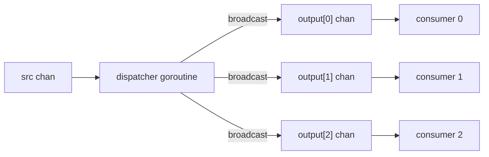
```mermaid
flowchart LR
    SRC["src chan"] --> DISP["dispatcher goroutine"]
    DISP -->|"broadcast"| O0["output[0] chan"]
    DISP -->|"broadcast"| O1["output[1] chan"]
    DISP -->|"broadcast"| O2["output[2] chan"]
    O0 --> C0["consumer 0"]
    O1 --> C1["consumer 1"]
    O2 --> C2["consumer 2"]
```

### Interviewer Questions

1. What is the difference between fan-out (broadcast) and a worker pool (distribute)?
2. How does a slow consumer cause head-of-line blocking in this implementation?
3. How would you make the fan-out non-blocking — dropping messages for slow consumers?
4. What is the overhead of N output channels vs a single pub-sub in-process broker?
5. How does this pattern relate to the Observer/Event Bus design pattern?
6. How would you extend this to support dynamic subscription (consumers can join/leave)?
7. How would you implement fan-out with back-pressure (slow consumer slows the source)?

### Follow-Up Questions

1. **Q10-F1:** Make FanOut non-blocking by using `select { case ch <- v: default: dropped++ }`.
2. **Q10-F2:** Add a `Subscribe`/`Unsubscribe` API backed by a mutex-protected slice of channels.
3. **Q10-F3:** Implement a typed generic version `FanOut[T any](src <-chan T, n int) []<-chan T`.
4. **Q10-F4:** Benchmark fan-out with N=1,2,4,8 consumers and 1M messages; measure dispatcher throughput.
5. **Q10-F5:** Compare with `github.com/nats-io/nats.go` in-process pub-sub for the same workload.

---

## Q11: Detect and Fix a Goroutine Leak  [Level 3 — Medium]

> **Tags:** `#goroutine-leak` `#context` `#channel` `#pprof` `#debugging`

### Problem Statement

The following code has a goroutine leak. Identify the leak, explain why it occurs, and fix it using a context cancellation. Additionally, demonstrate how to detect leaks using `runtime.NumGoroutine()` and the `goleak` library in tests.

```go
func StartWorker() {
    go func() {
        for {
            // do work forever
            time.Sleep(100 * time.Millisecond)
        }
    }()
}
```

### Input / Output / Constraints

- **Input:** `StartWorker()` called in a loop 1000 times
- **Output:** 1000 goroutines leak, memory grows unbounded
- **Constraints:** Fix using `context.Context`; show test with `goleak`; show pprof detection.

### Thought Process

A goroutine leak occurs when a goroutine is started but never terminates — it remains in the goroutine list forever, consuming stack memory (~2–8 KB each). Common causes: (1) blocked channel receive with no sender, (2) infinite loop without exit condition, (3) waiting on a lock that is never released. The fix always involves providing a termination signal — either a done channel, a context, or a quit flag.

### Brute Force

```go
package main

import (
    "fmt"
    "runtime"
    "time"
)

// LEAKY
func StartWorkerLeaky() {
    go func() {
        for {
            time.Sleep(100 * time.Millisecond) // runs forever
        }
    }()
}

func main() {
    for i := 0; i < 10; i++ {
        StartWorkerLeaky()
    }
    time.Sleep(1 * time.Second)
    fmt.Println("Goroutines:", runtime.NumGoroutine()) // 10+ leaked goroutines
}
```

**Time:** O(n) leak accumulation | **Space:** O(n * goroutine_stack) growing

### Better Solution

```go
package main

import (
    "context"
    "fmt"
    "runtime"
    "time"
)

func StartWorker(ctx context.Context) {
    go func() {
        ticker := time.NewTicker(100 * time.Millisecond)
        defer ticker.Stop()
        for {
            select {
            case <-ticker.C:
                // do work
            case <-ctx.Done():
                return // exit goroutine cleanly
            }
        }
    }()
}

func main() {
    ctx, cancel := context.WithCancel(context.Background())
    for i := 0; i < 10; i++ {
        StartWorker(ctx)
    }
    time.Sleep(500 * time.Millisecond)
    cancel() // signal all workers to stop
    time.Sleep(200 * time.Millisecond)
    fmt.Println("Goroutines after cancel:", runtime.NumGoroutine()) // back to baseline
}
```

### Best Solution

```go
package main

import (
	"context"
	"fmt"
	"runtime"
	"sync"
	"time"
)

type Worker struct {
	cancel context.CancelFunc
	wg     sync.WaitGroup
}

func NewWorker(ctx context.Context) *Worker {
	wCtx, cancel := context.WithCancel(ctx)
	w := &Worker{cancel: cancel}
	w.wg.Add(1)
	go func() {
		defer w.wg.Done()
		ticker := time.NewTicker(100 * time.Millisecond)
		defer ticker.Stop()
		for {
			select {
			case <-ticker.C:
				// perform periodic work
			case <-wCtx.Done():
				return
			}
		}
	}()
	return w
}

func (w *Worker) Stop() {
	w.cancel()
	w.wg.Wait() // block until goroutine exits
}

func main() {
	baseline := runtime.NumGoroutine()
	fmt.Println("Baseline goroutines:", baseline)

	workers := make([]*Worker, 10)
	for i := range workers {
		workers[i] = NewWorker(context.Background())
	}

	fmt.Println("After launch:", runtime.NumGoroutine())

	for _, w := range workers {
		w.Stop()
	}

	fmt.Println("After stop:", runtime.NumGoroutine()) // should equal baseline
}
```

**Time:** O(1) per worker | **Space:** O(n * stack) during lifetime, O(1) after Stop()

### Production Considerations

| Aspect | Details |
|--------|---------|
| Scalability | Leaked goroutines accumulate stack memory; 10K leaked goroutines ≈ 80 MB minimum. GC does not collect running goroutines. |
| Edge Cases | Worker that blocks in a syscall: context cancellation does not interrupt syscalls; use `os.File` or `net.Conn` with deadlines instead. |
| Error Handling | `w.wg.Wait()` in `Stop()` ensures the goroutine has fully exited before the caller proceeds; avoids use-after-free for shared resources. |
| Memory | `time.NewTicker` must be stopped via `defer ticker.Stop()` to avoid its own goroutine leak in the runtime. |
| Concurrency | `goleak.VerifyNone(t)` in tests catches leaked goroutines automatically. |

### Visual Explanation

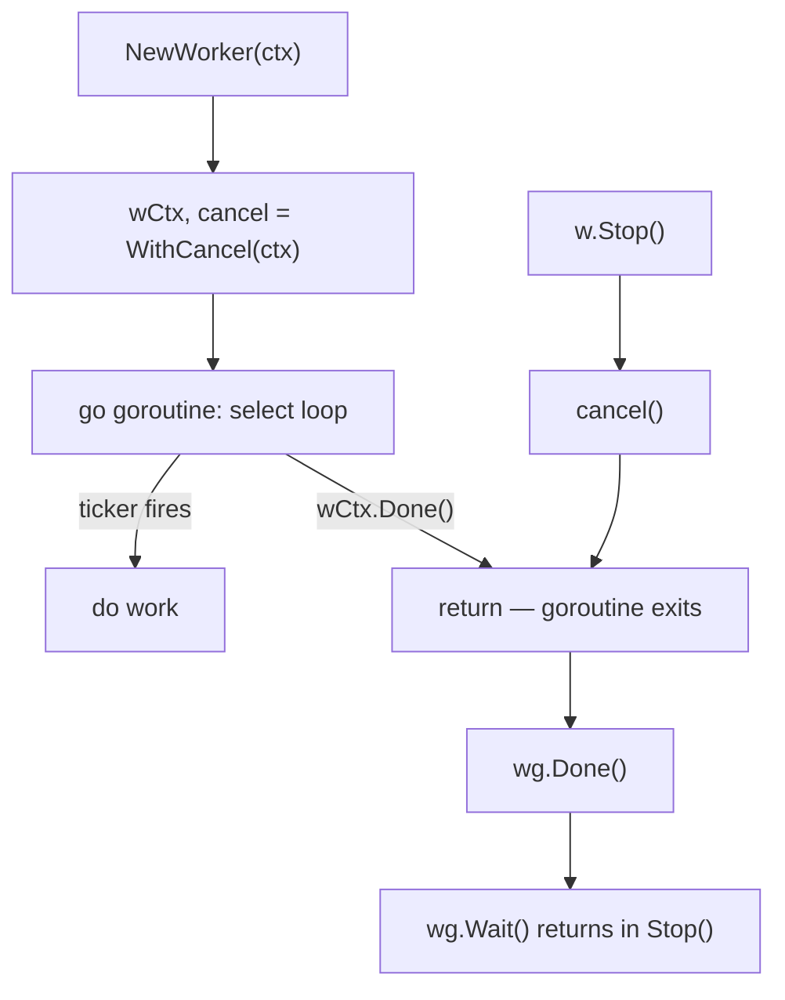
```mermaid
flowchart TD
    A["NewWorker(ctx)"] --> B["wCtx, cancel = WithCancel(ctx)"]
    B --> C["go goroutine: select loop"]
    C -->|"ticker fires"| D["do work"]
    C -->|"wCtx.Done()"| E["return — goroutine exits"]
    F["w.Stop()"] --> G["cancel()"]
    G --> E
    E --> H["wg.Done()"]
    H --> I["wg.Wait() returns in Stop()"]
```

### Interviewer Questions

1. How does `goleak.VerifyNone(t)` detect goroutine leaks in tests?
2. Why does GC not collect goroutines that are blocked (not using CPU)?
3. How does `pprof/goroutine` profile help identify leak sources in production?
4. What is the difference between a goroutine stuck on a channel receive vs one in an infinite loop — are both leaks?
5. How do you handle a goroutine that is blocked inside a syscall and cannot be interrupted by context?
6. What is `runtime.Stack(buf, all)` and when would you use it over pprof?
7. How does `errgroup` automatically cancel child goroutines when one fails?

### Follow-Up Questions

1. **Q11-F1:** Write a test using `goleak` that catches the leaky version and passes for the fixed version.
2. **Q11-F2:** Use `net/http/pprof` endpoint to inspect goroutine stack traces in a running server.
3. **Q11-F3:** Implement a `goroutine.Pool` that tracks all launched goroutines and can `WaitAll()`.
4. **Q11-F4:** Simulate a goroutine blocked on a DB query; show how context deadlines stop the leak.
5. **Q11-F5:** Write a middleware that detects leaked goroutines per HTTP request using delta-NumGoroutine.

---

## Q12: Dynamic Goroutine Count Based on CPU Cores  [Level 3 — Medium]

> **Tags:** `#GOMAXPROCS` `#runtime.NumCPU` `#adaptive` `#goroutine` `#performance`

### Problem Statement

Write a computation that automatically scales to use all available CPU cores. Use `runtime.NumCPU()` for CPU-bound parallelism and demonstrate the effect of `runtime.GOMAXPROCS`. Compute the sum of squares of integers 1–10,000,000 in parallel, adapting to the machine's core count.

### Input / Output / Constraints

- **Input:** N = 10,000,000
- **Output:** Sum of squares
- **Constraints:** Number of goroutines must equal `runtime.NumCPU()`; benchmark serial vs parallel.

### Thought Process

`runtime.NumCPU()` returns the number of logical CPUs. `GOMAXPROCS` (default = NumCPU since Go 1.5) controls how many OS threads run goroutines in parallel. For CPU-bound tasks, more goroutines than CPUs yields diminishing returns (context-switching overhead). The optimal goroutine count for CPU-bound work is typically `NumCPU`.

### Brute Force

```go
package main

import "fmt"

func main() {
    n := 10_000_000
    sum := 0
    for i := 1; i <= n; i++ {
        sum += i * i
    }
    fmt.Println(sum)
}
```

**Time:** O(n) serial | **Space:** O(1)

### Better Solution

```go
package main

import (
    "fmt"
    "runtime"
    "sync"
)

func main() {
    n := 10_000_000
    numCPU := runtime.NumCPU()
    chunkSize := n / numCPU
    results := make([]int64, numCPU)
    var wg sync.WaitGroup

    for w := 0; w < numCPU; w++ {
        wg.Add(1)
        w := w
        go func() {
            defer wg.Done()
            start := w*chunkSize + 1
            end := start + chunkSize
            if w == numCPU-1 { end = n + 1 }
            var local int64
            for i := start; i < end; i++ {
                local += int64(i) * int64(i)
            }
            results[w] = local // no mutex: each goroutine writes its own index
        }()
    }
    wg.Wait()
    var total int64
    for _, r := range results { total += r }
    fmt.Println("Sum:", total)
}
```

### Best Solution

```go
package main

import (
	"fmt"
	"runtime"
	"sync"
)

// SumOfSquaresParallel computes sum(i^2) for i in [1,n] using numWorkers goroutines.
func SumOfSquaresParallel(n, numWorkers int) int64 {
	partials := make([]int64, numWorkers)
	chunkSize := (n + numWorkers - 1) / numWorkers

	var wg sync.WaitGroup
	wg.Add(numWorkers)

	for w := 0; w < numWorkers; w++ {
		w := w
		go func() {
			defer wg.Done()
			start := w*chunkSize + 1
			end := start + chunkSize
			if end > n+1 {
				end = n + 1
			}
			var local int64
			for i := int64(start); i < int64(end); i++ {
				local += i * i
			}
			partials[w] = local
		}()
	}

	wg.Wait()

	var total int64
	for _, p := range partials {
		total += p
	}
	return total
}

func main() {
	numCPU := runtime.NumCPU()
	fmt.Printf("GOMAXPROCS: %d | NumCPU: %d\n", runtime.GOMAXPROCS(0), numCPU)

	const n = 10_000_000

	serial := func() int64 {
		var s int64
		for i := int64(1); i <= n; i++ {
			s += i * i
		}
		return s
	}()

	parallel := SumOfSquaresParallel(n, numCPU)

	fmt.Println("Serial result:", serial)
	fmt.Println("Parallel result:", parallel)
	fmt.Println("Match:", serial == parallel)
}
```

**Time:** O(n/p) | **Space:** O(p) — p partials slice, no false sharing between elements

### Production Considerations

| Aspect | Details |
|--------|---------|
| Scalability | Beyond `NumCPU` goroutines, throughput plateaus for CPU-bound work; each additional goroutine adds scheduler overhead. |
| Edge Cases | `n < numWorkers`: some workers get empty ranges; the `if end > n+1` guard handles this. Single-core machine: parallel version has slight overhead vs serial. |
| Error Handling | Integer overflow: 10M integers squared → sum ≈ 3.3 × 10¹⁴, which fits in `int64` (max ~9.2 × 10¹⁸). |
| Memory | `partials` slice avoids false sharing if elements are on different cache lines (64 bytes each on x86); `int64` elements at 8-byte stride may share cache lines for small arrays. |
| Concurrency | `GOMAXPROCS(0)` reads the current value without changing it; setting it below NumCPU can throttle parallelism intentionally. |

### Visual Explanation

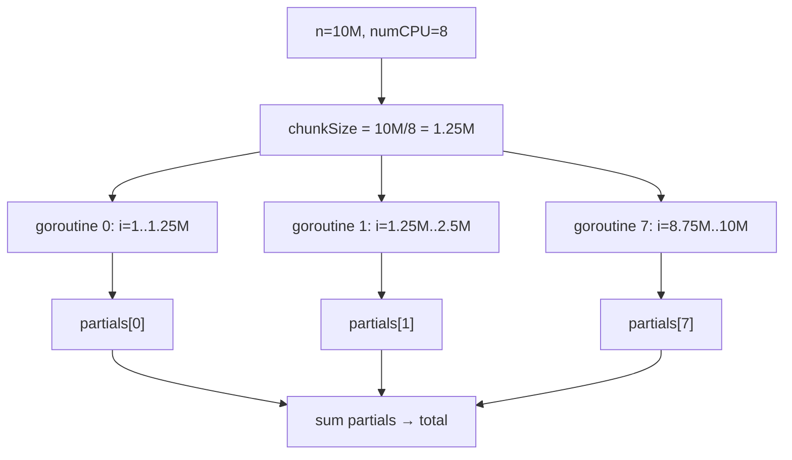
```mermaid
flowchart TD
    A["n=10M, numCPU=8"] --> B["chunkSize = 10M/8 = 1.25M"]
    B --> W0["goroutine 0: i=1..1.25M"]
    B --> W1["goroutine 1: i=1.25M..2.5M"]
    B --> WN["goroutine 7: i=8.75M..10M"]
    W0 --> P0["partials[0]"]
    W1 --> P1["partials[1]"]
    WN --> PN["partials[7]"]
    P0 & P1 & PN --> S["sum partials → total"]
```

### Interviewer Questions

1. What is `GOMAXPROCS` and what was its default value before Go 1.5?
2. Why does CPU-bound parallelism plateau at `NumCPU` goroutines while I/O-bound can benefit from more?
3. What is false sharing and how can it degrade performance in the `partials` slice approach?
4. How would you use `pprof` CPU profile to verify parallel execution is actually utilising multiple cores?
5. When would you set `GOMAXPROCS` lower than `NumCPU` deliberately?
6. How does Go's work-stealing scheduler decide which P runs which goroutine?
7. What is the difference between `runtime.NumCPU()` and `runtime.NumGoroutine()`?

### Follow-Up Questions

1. **Q12-F1:** Write a benchmark comparing serial, `NumCPU/2`, `NumCPU`, and `2*NumCPU` goroutines.
2. **Q12-F2:** Demonstrate false sharing by placing partial results in adjacent `int32` fields of a struct.
3. **Q12-F3:** Use `runtime.LockOSThread()` for a goroutine doing heavy C interop; explain the implications.
4. **Q12-F4:** Set `GOMAXPROCS=1` and rerun; what happens to the parallel version's performance?
5. **Q12-F5:** Profile with `pprof` and identify if the bottleneck is computation or scheduler overhead.

---

## Q13: Parallel Matrix Multiplication With Goroutines  [Level 3 — Medium]

> **Tags:** `#matrix` `#parallel` `#goroutine` `#divide-and-conquer` `#performance`

### Problem Statement

Multiply two N×N matrices (N=200) in parallel. Each row of the result matrix is computed by a separate goroutine. Compare the parallel version against the serial triple-loop and discuss cache efficiency.

### Input / Output / Constraints

- **Input:** Two 200×200 float64 matrices filled with random values
- **Output:** 200×200 result matrix
- **Constraints:** One goroutine per row; verify correctness against serial result; no mutex for result writes (each row belongs to one goroutine).

### Thought Process

Matrix multiplication C[i][j] = Σ A[i][k] * B[k][j]. Rows of C are independent — computing row i requires only row i of A and all of B. Assigning one goroutine per row of C parallelises the outermost loop. No synchronisation is needed inside the goroutine because each writes to distinct rows of C.

### Brute Force

```go
func matMulSerial(A, B [][]float64, N int) [][]float64 {
    C := make([][]float64, N)
    for i := range C { C[i] = make([]float64, N) }
    for i := 0; i < N; i++ {
        for j := 0; j < N; j++ {
            for k := 0; k < N; k++ {
                C[i][j] += A[i][k] * B[k][j]
            }
        }
    }
    return C
}
```

**Time:** O(N³) | **Space:** O(N²)

### Better Solution

```go
func matMulParallel(A, B [][]float64, N int) [][]float64 {
    C := make([][]float64, N)
    for i := range C { C[i] = make([]float64, N) }

    var wg sync.WaitGroup
    for i := 0; i < N; i++ {
        wg.Add(1)
        go func(row int) {
            defer wg.Done()
            for j := 0; j < N; j++ {
                for k := 0; k < N; k++ {
                    C[row][j] += A[row][k] * B[k][j]
                }
            }
        }(i)
    }
    wg.Wait()
    return C
}
```

### Best Solution

```go
package main

import (
	"fmt"
	"math/rand"
	"runtime"
	"sync"
)

func newMatrix(n int) [][]float64 {
	m := make([][]float64, n)
	for i := range m {
		m[i] = make([]float64, n)
		for j := range m[i] {
			m[i][j] = rand.Float64()
		}
	}
	return m
}

// matMulParallel assigns each row of C to a goroutine from a worker pool.
func matMulParallel(A, B [][]float64) [][]float64 {
	n := len(A)
	C := make([][]float64, n)
	for i := range C {
		C[i] = make([]float64, n)
	}

	numWorkers := runtime.NumCPU()
	rows := make(chan int, n)
	var wg sync.WaitGroup
	wg.Add(numWorkers)

	// Worker pool: each worker processes rows from the channel
	for w := 0; w < numWorkers; w++ {
		go func() {
			defer wg.Done()
			for row := range rows {
				for j := 0; j < n; j++ {
					sum := 0.0
					for k := 0; k < n; k++ {
						sum += A[row][k] * B[k][j]
					}
					C[row][j] = sum
				}
			}
		}()
	}

	for i := 0; i < n; i++ {
		rows <- i
	}
	close(rows)
	wg.Wait()
	return C
}

func equal(A, B [][]float64, eps float64) bool {
	for i := range A {
		for j := range A[i] {
			if d := A[i][j] - B[i][j]; d > eps || d < -eps {
				return false
			}
		}
	}
	return true
}

func main() {
	const n = 200
	A, B := newMatrix(n), newMatrix(n)

	// Serial reference
	serial := make([][]float64, n)
	for i := range serial {
		serial[i] = make([]float64, n)
		for j := 0; j < n; j++ {
			for k := 0; k < n; k++ {
				serial[i][j] += A[i][k] * B[k][j]
			}
		}
	}

	parallel := matMulParallel(A, B)
	fmt.Println("Results match:", equal(serial, parallel, 1e-9))
}
```

**Time:** O(N³ / min(N, p)) | **Space:** O(N²)

### Production Considerations

| Aspect | Details |
|--------|---------|
| Scalability | N goroutines for N rows works for N=200; for N=10,000 use a worker pool with `NumCPU` workers to avoid goroutine creation overhead. |
| Edge Cases | Non-square matrices: guard `len(A[0]) == len(B)` for conformability; return error if not. |
| Error Handling | Dimension mismatch: return `(nil, error)`; callers must not silently discard the error. |
| Memory | Row-major layout in Go slices of slices; B[k][j] access pattern causes cache misses — consider transposing B for cache-friendly column access. |
| Concurrency | Row-level writes are race-free; column or element-level granularity would require mutexes. |

### Visual Explanation

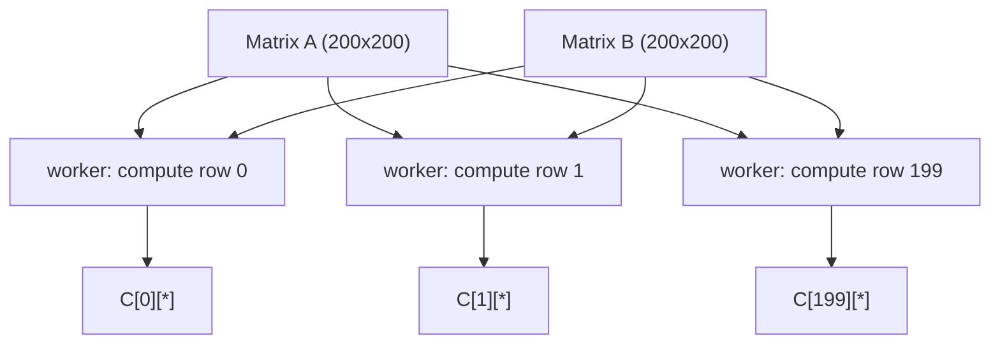
```mermaid
flowchart TD
    A["Matrix A (200x200)"] --> W0["worker: compute row 0"]
    A --> W1["worker: compute row 1"]
    A --> WN["worker: compute row 199"]
    B["Matrix B (200x200)"] --> W0 & W1 & WN
    W0 --> C0["C[0][*]"]
    W1 --> C1["C[1][*]"]
    WN --> CN["C[199][*]"]
```

### Interviewer Questions

1. Why is row-level granularity race-free without a mutex?
2. Why does the access pattern `B[k][j]` (column-wise) cause cache misses, and how does transposing B help?
3. For N=10,000, why is a worker pool better than N goroutines?
4. How does the `gonum` library implement optimised matrix multiplication (BLAS/LAPACK)?
5. What is Strassen's algorithm and what is its time complexity vs the naive O(N³)?
6. How would you distribute matrix multiplication across multiple machines (distributed computing)?
7. How would you benchmark this to separate goroutine overhead from actual computation time?

### Follow-Up Questions

1. **Q13-F1:** Transpose B before multiplication and measure cache-miss improvement.
2. **Q13-F2:** Implement block/tiled matrix multiplication to improve cache utilisation.
3. **Q13-F3:** Use `gonum/blas` for the inner product and compare performance.
4. **Q13-F4:** Extend to non-square matrices (M×K) × (K×N) → (M×N).
5. **Q13-F5:** Benchmark serial vs parallel vs BLAS for N = 100, 500, 1000, 2000.

---

## Q14: Goroutine That Panics — How to Recover Safely  [Level 3 — Medium]

> **Tags:** `#panic` `#recover` `#goroutine` `#error-handling` `#resilience`

### Problem Statement

A goroutine panics due to an unhandled nil pointer dereference. If not recovered, the entire program crashes. Implement a `safeGo` wrapper that recovers panics in goroutines, converts them to errors, and reports them without crashing the program.

### Input / Output / Constraints

- **Input:** A function that may panic
- **Output:** Error returned to the caller if the goroutine panics; program continues
- **Constraints:** `recover()` only works in the same goroutine; demonstrate why deferred recover must be inside the goroutine.

### Thought Process

`recover()` only works when called directly inside a `defer`ed function and only in the goroutine that panicked. You cannot catch a panic from another goroutine. Therefore, the `recover` must be deferred inside the goroutine body itself. A `safeGo` wrapper that accepts a `func() error` and returns `chan error` launches the goroutine with a deferred recover, converting the panic value to an error.

### Brute Force

```go
package main

import "fmt"

func main() {
    go func() {
        panic("something went wrong") // crashes the entire program
    }()
    // main can't catch this
    fmt.Println("this never prints")
}
```

**Time:** O(1) | **Space:** O(1)

> **Bug:** Unrecovered goroutine panic kills the whole process.

### Better Solution

```go
package main

import (
    "fmt"
    "runtime/debug"
)

func safeGo(f func()) {
    go func() {
        defer func() {
            if r := recover(); r != nil {
                fmt.Printf("goroutine panic recovered: %v\n%s\n", r, debug.Stack())
            }
        }()
        f()
    }()
}

func main() {
    safeGo(func() {
        panic("intentional panic")
    })
    // main continues
    fmt.Println("program continues after goroutine panic")
    // give goroutine time to run (demo only)
    select {}
}
```

### Best Solution

```go
package main

import (
	"errors"
	"fmt"
	"runtime/debug"
	"sync"
)

// SafeGo launches f in a goroutine. If f panics, the panic is recovered
// and sent as an error on the returned channel. The channel is buffered
// so the goroutine never blocks on send.
func SafeGo(f func() error) <-chan error {
	errCh := make(chan error, 1)
	go func() {
		defer func() {
			if r := recover(); r != nil {
				stack := debug.Stack()
				errCh <- fmt.Errorf("goroutine panic: %v\nstack:\n%s", r, stack)
			}
			close(errCh)
		}()
		errCh <- f() // send nil or function error; close deferred
	}()
	return errCh
}

func main() {
	var wg sync.WaitGroup

	tasks := []func() error{
		func() error { return nil },
		func() error { panic("database connection nil") },
		func() error { return errors.New("validation failed") },
		func() error {
			var s *string
			_ = *s // nil dereference panic
			return nil
		},
	}

	results := make([]<-chan error, len(tasks))
	for i, task := range tasks {
		results[i] = SafeGo(task)
		wg.Add(1)
	}

	for i, ch := range results {
		go func(id int, c <-chan error) {
			defer wg.Done()
			if err := <-c; err != nil {
				fmt.Printf("task %d failed: %v\n", id, err)
			} else {
				fmt.Printf("task %d succeeded\n", id)
			}
		}(i, ch)
	}

	wg.Wait()
}
```

**Time:** O(1) per goroutine | **Space:** O(1) per goroutine + stack trace string

### Production Considerations

| Aspect | Details |
|--------|---------|
| Scalability | `safeGo` adds one deferred function call overhead — negligible; always use in long-running services where a goroutine crash would be fatal. |
| Edge Cases | `recover()` returns `nil` if no panic occurred; always check `r != nil`. `close(errCh)` must be deferred after the `recover` to ensure it is always called. |
| Error Handling | `debug.Stack()` captures full goroutine stack at panic point; log it with structured logging (e.g., `slog`) to preserve context. |
| Memory | Stack trace string can be several KB; do not accumulate them without rotation. |
| Concurrency | The buffered channel (size 1) ensures the goroutine's send never blocks, preventing a secondary deadlock if the caller does not read the channel immediately. |

### Visual Explanation

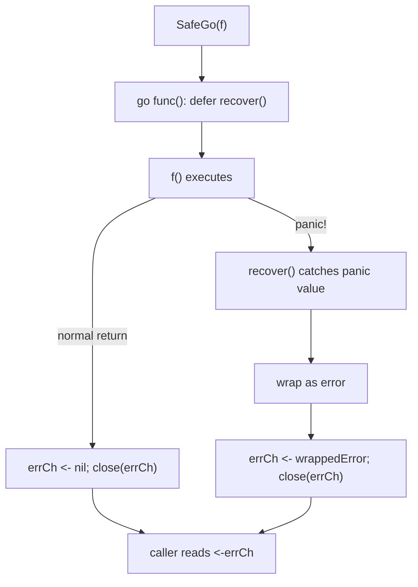
```mermaid
flowchart TD
    A["SafeGo(f)"] --> B["go func(): defer recover()"]
    B --> C["f() executes"]
    C -->|"normal return"| D["errCh <- nil; close(errCh)"]
    C -->|"panic!"| E["recover() catches panic value"]
    E --> F["wrap as error"]
    F --> G["errCh <- wrappedError; close(errCh)"]
    D & G --> H["caller reads <-errCh"]
```

### Interviewer Questions

1. Why can a `recover()` in `main` not catch a panic in a spawned goroutine?
2. What is the difference between `panic` and `os.Exit`? Does `defer` run for either?
3. When is it appropriate to use `recover` vs just letting the service restart (crash-only design)?
4. How does `debug.Stack()` help diagnose the root cause of a recovered panic?
5. What happens if `recover()` is called outside a deferred function?
6. How does the Go runtime print stack traces for unrecovered panics, and can you hook into that?
7. In a production HTTP server, how does `http.Server` itself use `recover` to prevent handler panics from crashing the server?

### Follow-Up Questions

1. **Q14-F1:** Write a `SafeGoWithTimeout(ctx, f, timeout)` that also cancels after a deadline.
2. **Q14-F2:** Integrate `SafeGo` with a structured logger (`slog`) to record panic details with trace IDs.
3. **Q14-F3:** Implement a supervisor that restarts a goroutine after it panics, up to N times.
4. **Q14-F4:** Show that `runtime.Goexit()` differs from `panic` — deferred functions still run.
5. **Q14-F5:** Write a test that verifies `SafeGo` catches a nil-dereference panic and returns a non-nil error.

---

## Q15: Concurrent File Downloader With Progress Tracking  [Level 3 — Medium]

> **Tags:** `#goroutine` `#HTTP` `#progress` `#channel` `#io`

### Problem Statement

Download N files concurrently. Track download progress (bytes downloaded per file) and aggregate total progress. Report progress to the user in real-time. Handle partial failures without aborting all downloads.

### Input / Output / Constraints

- **Input:** `urls []string` (N files), `outputDir string`
- **Output:** Files saved to disk; progress printed per file; summary on completion
- **Constraints:** Concurrency limited to `min(N, 5)`; progress via channel; partial failures logged but do not stop remaining downloads.

### Thought Process

Each file download runs in a goroutine. Progress is tracked by wrapping the HTTP response body in a custom `io.Reader` that counts bytes read and sends updates on a progress channel. A separate progress goroutine aggregates and displays the updates. A semaphore channel limits concurrency.

### Brute Force

```go
package main

import (
    "io"
    "net/http"
    "os"
)

func downloadAll(urls []string, dir string) {
    for _, url := range urls {
        resp, _ := http.Get(url)
        defer resp.Body.Close()
        f, _ := os.Create(dir + "/file")
        io.Copy(f, resp.Body)
        f.Close()
    }
}
```

**Time:** O(n * download_time) serial | **Space:** O(file_size)

### Better Solution

```go
package main

import (
    "fmt"
    "io"
    "net/http"
    "os"
    "sync"
    "path/filepath"
)

type ProgressReader struct {
    r       io.Reader
    total   int64
    onRead  func(n int)
}

func (pr *ProgressReader) Read(p []byte) (n int, err error) {
    n, err = pr.r.Read(p)
    pr.total += int64(n)
    pr.onRead(n)
    return
}

func downloadFile(url, outPath string, progress chan<- int64) error {
    resp, err := http.Get(url)
    if err != nil { return err }
    defer resp.Body.Close()

    f, err := os.Create(outPath)
    if err != nil { return err }
    defer f.Close()

    pr := &ProgressReader{r: resp.Body, onRead: func(n int) { progress <- int64(n) }}
    _, err = io.Copy(f, pr)
    return err
}

func DownloadAll(urls []string, dir string) {
    const maxConcurrent = 5
    sem := make(chan struct{}, maxConcurrent)
    progress := make(chan int64, 100)
    var wg sync.WaitGroup

    for i, url := range urls {
        wg.Add(1)
        sem <- struct{}{}
        go func(i int, url string) {
            defer wg.Done()
            defer func() { <-sem }()
            path := filepath.Join(dir, fmt.Sprintf("file-%d", i))
            if err := downloadFile(url, path, progress); err != nil {
                fmt.Printf("ERROR downloading %s: %v\n", url, err)
            }
        }(i, url)
    }

    go func() { wg.Wait(); close(progress) }()

    var total int64
    for bytes := range progress {
        total += bytes
        fmt.Printf("\rTotal downloaded: %d bytes", total)
    }
    fmt.Println("\nDone.")
}
```

### Best Solution

```go
package main

import (
	"context"
	"errors"
	"fmt"
	"io"
	"net/http"
	"os"
	"path/filepath"
	"sync"
	"time"
)

type ProgressEvent struct {
	FileIndex int
	BytesRead int64
	Done      bool
	Err       error
}

type progressReader struct {
	r         io.Reader
	fileIndex int
	ch        chan<- ProgressEvent
}

func (pr *progressReader) Read(p []byte) (n int, err error) {
	n, err = pr.r.Read(p)
	if n > 0 {
		pr.ch <- ProgressEvent{FileIndex: pr.fileIndex, BytesRead: int64(n)}
	}
	if errors.Is(err, io.EOF) {
		pr.ch <- ProgressEvent{FileIndex: pr.fileIndex, Done: true}
		err = io.EOF
	}
	return
}

func downloadOne(ctx context.Context, client *http.Client, idx int, url, outPath string, ch chan<- ProgressEvent) error {
	req, err := http.NewRequestWithContext(ctx, http.MethodGet, url, nil)
	if err != nil {
		return err
	}
	resp, err := client.Do(req)
	if err != nil {
		return err
	}
	defer resp.Body.Close()

	f, err := os.Create(outPath)
	if err != nil {
		return err
	}
	defer f.Close()

	pr := &progressReader{r: resp.Body, fileIndex: idx, ch: ch}
	if _, err := io.Copy(f, pr); err != nil {
		return err
	}
	return nil
}

func DownloadAll(ctx context.Context, urls []string, outDir string, maxConcurrent int) []error {
	client := &http.Client{Timeout: 30 * time.Second}
	sem := make(chan struct{}, maxConcurrent)
	progressCh := make(chan ProgressEvent, 256)
	errs := make([]error, len(urls))

	var wg sync.WaitGroup
	for i, url := range urls {
		wg.Add(1)
		sem <- struct{}{}
		go func(idx int, u string) {
			defer wg.Done()
			defer func() { <-sem }()
			path := filepath.Join(outDir, fmt.Sprintf("file-%d.bin", idx))
			if err := downloadOne(ctx, client, idx, u, path, progressCh); err != nil {
				errs[idx] = fmt.Errorf("file %d (%s): %w", idx, u, err)
				progressCh <- ProgressEvent{FileIndex: idx, Err: err}
			}
		}(i, url)
	}

	go func() {
		wg.Wait()
		close(progressCh)
	}()

	fileTotals := make(map[int]int64)
	var grandTotal int64
	for ev := range progressCh {
		if ev.Err != nil {
			fmt.Printf("\n[file-%d] ERROR: %v\n", ev.FileIndex, ev.Err)
			continue
		}
		if ev.BytesRead > 0 {
			fileTotals[ev.FileIndex] += ev.BytesRead
			grandTotal += ev.BytesRead
		}
		if ev.Done {
			fmt.Printf("[file-%d] complete: %d bytes\n", ev.FileIndex, fileTotals[ev.FileIndex])
		}
	}
	fmt.Printf("Grand total: %d bytes across %d files\n", grandTotal, len(urls))
	return errs
}

func main() {
	urls := []string{
		"https://httpbin.org/bytes/1024",
		"https://httpbin.org/bytes/2048",
		"https://httpbin.org/bytes/512",
	}
	outDir := os.TempDir()
	errs := DownloadAll(context.Background(), urls, outDir, 5)
	for i, err := range errs {
		if err != nil {
			fmt.Printf("File %d failed: %v\n", i, err)
		}
	}
}
```

**Time:** O(max_download_time) with concurrency | **Space:** O(buffer + numConcurrent * io_buffer)

### Production Considerations

| Aspect | Details |
|--------|---------|
| Scalability | Semaphore channel limits OS-level connection pool usage; tune `maxConcurrent` to respect server rate limits. |
| Edge Cases | Context cancellation mid-download: `io.Copy` returns with ctx error; partial file is left on disk — clean up in defer. |
| Error Handling | Per-file errors stored in `errs[idx]` (index-safe); caller inspects after all downloads; partial results are still usable. |
| Memory | `progressCh` buffer prevents goroutines from blocking on progress sends; size to exceed burst rate. |
| Concurrency | `progressReader.Read` is called by `io.Copy` in the goroutine; the channel send is the only cross-goroutine operation — no mutex needed. |

### Visual Explanation

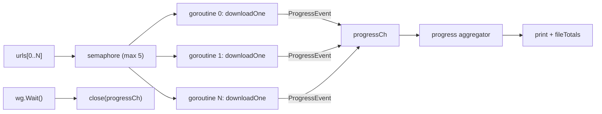
```mermaid
flowchart LR
    URLS["urls[0..N]"] --> SEM["semaphore (max 5)"]
    SEM --> G0["goroutine 0: downloadOne"]
    SEM --> G1["goroutine 1: downloadOne"]
    SEM --> GN["goroutine N: downloadOne"]
    G0 & G1 & GN -->|"ProgressEvent"| PCH["progressCh"]
    PCH --> DISP["progress aggregator"]
    DISP --> OUT["print + fileTotals"]
    WG["wg.Wait()"] --> CL["close(progressCh)"]
```

### Interviewer Questions

1. How does the semaphore channel pattern limit concurrency to `maxConcurrent`?
2. Why is `progressCh` buffered, and what happens if it fills up?
3. How do you handle partial file cleanup if a download fails midway?
4. How would you implement resumable downloads using HTTP Range requests?
5. What is the trade-off between per-byte progress reporting and per-chunk (e.g., 4 KB) reporting?
6. How does `io.TeeReader` compare to a custom `progressReader` for tracking bytes?
7. How would you throttle download bandwidth using a token bucket?

### Follow-Up Questions

1. **Q15-F1:** Add HTTP Range request support for resumable downloads.
2. **Q15-F2:** Implement a progress bar using `github.com/schollz/progressbar`.
3. **Q15-F3:** Add checksum verification (SHA-256) after each download completes.
4. **Q15-F4:** Use `io.TeeReader` instead of a custom reader to duplicate the stream to both file and hasher.
5. **Q15-F5:** Implement exponential backoff retry for failed downloads.

---

## Q16: Goroutine-Safe Counter Without Mutex (Atomic)  [Level 3 — Medium]

> **Tags:** `#atomic` `#sync/atomic` `#lock-free` `#goroutine` `#performance`

### Problem Statement

Implement a goroutine-safe counter that is incremented by 1000 goroutines concurrently. Compare three implementations: (1) unsafe (no sync), (2) mutex-based, (3) `sync/atomic`. Benchmark all three and explain why the atomic version is fastest.

### Input / Output / Constraints

- **Input:** 1000 goroutines each incrementing the counter 1000 times
- **Output:** Final count must equal 1,000,000 for the correct versions
- **Constraints:** Demonstrate the race condition in the unsafe version; benchmark all three.

### Thought Process

A naive `counter++` is not atomic — it compiles to three instructions (load, add, store). Two goroutines can interleave these instructions and lose increments. `sync.Mutex` serialises access but involves OS-level context switching. `sync/atomic.AddInt64` is a single CPU instruction (`LOCK XADD` on x86) — no OS involvement, just hardware synchronisation.

### Brute Force

```go
package main

import (
    "fmt"
    "sync"
)

var counter int // UNSAFE

func main() {
    var wg sync.WaitGroup
    for i := 0; i < 1000; i++ {
        wg.Add(1)
        go func() {
            defer wg.Done()
            for j := 0; j < 1000; j++ {
                counter++ // DATA RACE: go run -race will flag this
            }
        }()
    }
    wg.Wait()
    fmt.Println("Unsafe counter:", counter) // < 1,000,000
}
```

**Time:** O(n) | **Space:** O(1) — but incorrect result

### Better Solution

```go
package main

import (
    "fmt"
    "sync"
    "sync/atomic"
)

func mutexCounter(goroutines, increments int) int64 {
    var mu sync.Mutex
    var count int64
    var wg sync.WaitGroup
    wg.Add(goroutines)
    for i := 0; i < goroutines; i++ {
        go func() {
            defer wg.Done()
            for j := 0; j < increments; j++ {
                mu.Lock()
                count++
                mu.Unlock()
            }
        }()
    }
    wg.Wait()
    return count
}

func atomicCounter(goroutines, increments int) int64 {
    var count int64
    var wg sync.WaitGroup
    wg.Add(goroutines)
    for i := 0; i < goroutines; i++ {
        go func() {
            defer wg.Done()
            for j := 0; j < increments; j++ {
                atomic.AddInt64(&count, 1)
            }
        }()
    }
    wg.Wait()
    return count
}
```

### Best Solution

```go
package main

import (
	"fmt"
	"sync"
	"sync/atomic"
)

// SafeCounter demonstrates three concurrency approaches.

// 1. Mutex-based counter
type MutexCounter struct {
	mu    sync.Mutex
	value int64
}

func (c *MutexCounter) Inc() { c.mu.Lock(); c.value++; c.mu.Unlock() }
func (c *MutexCounter) Get() int64 { c.mu.Lock(); defer c.mu.Unlock(); return c.value }

// 2. Atomic counter (lock-free)
type AtomicCounter struct {
	value atomic.Int64
}

func (c *AtomicCounter) Inc() { c.value.Add(1) }
func (c *AtomicCounter) Get() int64 { return c.value.Load() }

// 3. Per-goroutine counter with final reduce (zero-contention)
func shardedSum(goroutines, increments int) int64 {
	partials := make([]int64, goroutines) // each goroutine owns its index
	var wg sync.WaitGroup
	wg.Add(goroutines)
	for i := 0; i < goroutines; i++ {
		go func(idx int) {
			defer wg.Done()
			for j := 0; j < increments; j++ {
				partials[idx]++
			}
		}(i)
	}
	wg.Wait()
	var total int64
	for _, p := range partials {
		total += p
	}
	return total
}

func runCounters(goroutines, increments int) {
	expected := int64(goroutines) * int64(increments)

	// Mutex
	mc := &MutexCounter{}
	var wg1 sync.WaitGroup
	wg1.Add(goroutines)
	for i := 0; i < goroutines; i++ {
		go func() { defer wg1.Done(); for j := 0; j < increments; j++ { mc.Inc() } }()
	}
	wg1.Wait()
	fmt.Printf("Mutex:   %d (correct: %v)\n", mc.Get(), mc.Get() == expected)

	// Atomic
	ac := &AtomicCounter{}
	var wg2 sync.WaitGroup
	wg2.Add(goroutines)
	for i := 0; i < goroutines; i++ {
		go func() { defer wg2.Done(); for j := 0; j < increments; j++ { ac.Inc() } }()
	}
	wg2.Wait()
	fmt.Printf("Atomic:  %d (correct: %v)\n", ac.Get(), ac.Get() == expected)

	// Sharded
	result := shardedSum(goroutines, increments)
	fmt.Printf("Sharded: %d (correct: %v)\n", result, result == expected)
}

func main() {
	runCounters(1000, 1000)
}
```

**Time:** O(n) | **Space:** O(1) atomic/mutex, O(n) sharded

### Production Considerations

| Aspect | Details |
|--------|---------|
| Scalability | At very high contention, even atomic operations suffer bus traffic; sharded counters (one per CPU, summed at read) eliminate inter-CPU cache line bouncing. |
| Edge Cases | `atomic.Int64` (Go 1.19+) is the type-safe wrapper over `atomic.AddInt64`; prefer it for new code. |
| Error Handling | Overflow: `int64` max is ~9.2×10¹⁸; for counters that approach this, use saturation or reset semantics. |
| Memory | Atomic variable should be 64-bit aligned; Go's allocator guarantees this for heap variables; be careful with struct embedding. |
| Concurrency | Mutex is preferable when the critical section involves multiple related variables that must be updated atomically together. |

### Visual Explanation

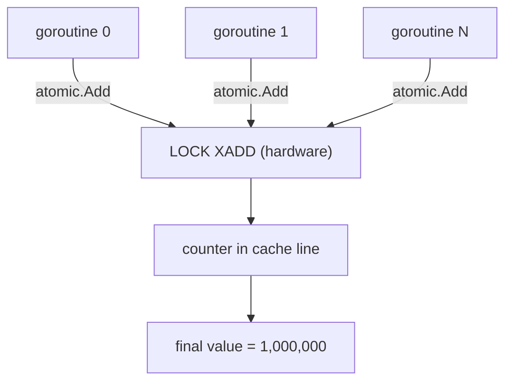
```mermaid
flowchart TD
    G0["goroutine 0"] & G1["goroutine 1"] & GN["goroutine N"] -->|"atomic.Add"| LOCK["LOCK XADD (hardware)"]
    LOCK --> CNT["counter in cache line"]
    CNT --> FINAL["final value = 1,000,000"]
```

### Interviewer Questions

1. Why is `counter++` not atomic in Go even on a 64-bit machine?
2. What is the difference between `sync/atomic.AddInt64` and `atomic.Int64.Add` (Go 1.19+)?
3. On x86, what CPU instruction does `atomic.AddInt64` compile to?
4. What is false sharing and how does it affect atomic counters on multi-core CPUs?
5. When is a mutex preferable over an atomic operation?
6. What is a sharded counter (e.g., `expvar.Int`) and when would you use one?
7. How does `sync.Map` use atomic operations internally to reduce lock contention?

### Follow-Up Questions

1. **Q16-F1:** Write a benchmark (`testing.B`) comparing mutex, atomic, and sharded counter for 1K, 10K, 100K goroutines.
2. **Q16-F2:** Implement a sharded counter with `runtime.NumCPU()` shards and a `Value()` method that sums them.
3. **Q16-F3:** Use `go run -race` to demonstrate the data race in the unsafe version.
4. **Q16-F4:** Build a rate limiter using `atomic.Int64` to count requests per second.
5. **Q16-F5:** Explore `sync/atomic.Pointer[T]` for lock-free linked-list node updates.

---

## Q17: Pipeline — Goroutine Per Stage  [Level 3 — Medium]

> **Tags:** `#pipeline` `#goroutine` `#channel` `#composable` `#streaming`

### Problem Statement

Build a three-stage pipeline:
1. **Generate:** emits integers 1–20
2. **Square:** receives integers, emits their squares
3. **Filter:** receives squares, emits only values > 100

Each stage runs in its own goroutine. Connect stages with channels. The final stage drains and prints results.

### Input / Output / Constraints

- **Input:** Integers 1–20
- **Output:** Squares > 100: 121, 144, 169, 196, 225, 256, 289, 324, 361, 400
- **Constraints:** Each stage is a separate goroutine; channels closed when stage is done; context for early termination.

### Thought Process

The pipeline pattern chains goroutines via channels: stage N reads from its input channel, transforms data, and writes to its output channel. When a stage is done producing, it closes its output channel, signalling the downstream stage to finish. This creates a natural back-pressure propagation. Each stage is independently testable and composable.

### Brute Force

```go
package main

import "fmt"

func main() {
    for i := 1; i <= 20; i++ {
        sq := i * i
        if sq > 100 {
            fmt.Println(sq)
        }
    }
}
```

**Time:** O(n) serial | **Space:** O(1)

### Better Solution

```go
package main

import "fmt"

func generate(nums ...int) <-chan int {
    out := make(chan int)
    go func() {
        defer close(out)
        for _, n := range nums { out <- n }
    }()
    return out
}

func square(in <-chan int) <-chan int {
    out := make(chan int)
    go func() {
        defer close(out)
        for n := range in { out <- n * n }
    }()
    return out
}

func filter(in <-chan int, pred func(int) bool) <-chan int {
    out := make(chan int)
    go func() {
        defer close(out)
        for n := range in {
            if pred(n) { out <- n }
        }
    }()
    return out
}

func main() {
    nums := make([]int, 20)
    for i := range nums { nums[i] = i + 1 }

    for v := range filter(square(generate(nums...)), func(n int) bool { return n > 100 }) {
        fmt.Println(v)
    }
}
```

### Best Solution

```go
package main

import (
	"context"
	"fmt"
)

// Stage 1: Generate integers [start, end]
func generate(ctx context.Context, start, end int) <-chan int {
	out := make(chan int, 8)
	go func() {
		defer close(out)
		for i := start; i <= end; i++ {
			select {
			case out <- i:
			case <-ctx.Done():
				return
			}
		}
	}()
	return out
}

// Stage 2: Square each value
func square(ctx context.Context, in <-chan int) <-chan int {
	out := make(chan int, 8)
	go func() {
		defer close(out)
		for v := range in {
			select {
			case out <- v * v:
			case <-ctx.Done():
				return
			}
		}
	}()
	return out
}

// Stage 3: Filter values matching predicate
func filterPipeline(ctx context.Context, in <-chan int, pred func(int) bool) <-chan int {
	out := make(chan int, 8)
	go func() {
		defer close(out)
		for v := range in {
			if pred(v) {
				select {
				case out <- v:
				case <-ctx.Done():
					return
				}
			}
		}
	}()
	return out
}

func main() {
	ctx, cancel := context.WithCancel(context.Background())
	defer cancel()

	// Wire pipeline: generate → square → filter
	nums := generate(ctx, 1, 20)
	squares := square(ctx, nums)
	filtered := filterPipeline(ctx, squares, func(n int) bool { return n > 100 })

	fmt.Println("Squares > 100:")
	for v := range filtered {
		fmt.Println(v)
	}
}
```

**Time:** O(n) streaming | **Space:** O(buffer_size) per stage — O(1) logically

### Production Considerations

| Aspect | Details |
|--------|---------|
| Scalability | Each stage can be scaled independently — run multiple `square` goroutines (fan-out) merging into a fan-in before `filter`. |
| Edge Cases | Context cancellation mid-pipeline: upstream stages detect `ctx.Done()` and close their output channels; downstream stages unblock from range and exit. |
| Error Handling | Extend each stage to return `(<-chan int, <-chan error)`; errors propagate downstream alongside data, or use a dedicated error channel merged at the sink. |
| Memory | Buffered channels (size 8) decouple stage throughput; without buffers, fast producers stall on slow consumers. |
| Concurrency | `defer close(out)` in each stage ensures downstream stages eventually exit their `range`; without it, downstream goroutines block forever (goroutine leak). |

### Visual Explanation

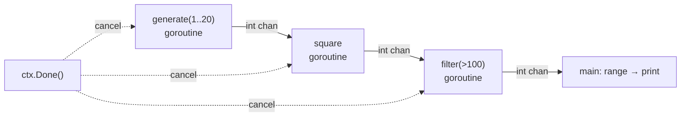
```mermaid
flowchart LR
    GEN["generate(1..20)\ngoroutine"] -->|"int chan"| SQ["square\ngoroutine"]
    SQ -->|"int chan"| FIL["filter(>100)\ngoroutine"]
    FIL -->|"int chan"| MAIN["main: range → print"]
    CTX["ctx.Done()"] -.->|"cancel"| GEN & SQ & FIL
```

### Interviewer Questions

1. What happens if a pipeline stage forgets to `close` its output channel?
2. How do you propagate errors through a pipeline without blocking data flow?
3. How would you parallelise the `square` stage to use multiple goroutines (fan-out + fan-in)?
4. What is back-pressure in a pipeline and how do channel buffers implement it?
5. How does the `context.WithCancel` cancellation propagate through all pipeline stages?
6. How would you implement a bounded pipeline where at most K items are in-flight at once?
7. How does this pipeline pattern compare to `io.Reader` chain (e.g., `gzip.NewReader(bufio.NewReader(f))`)?

### Follow-Up Questions

1. **Q17-F1:** Add a parallel `square` stage using fan-out (N goroutines) + fan-in (merge into one channel).
2. **Q17-F2:** Add error handling: `square` returns an error for values > 15; propagate via `chan error`.
3. **Q17-F3:** Implement a generic `Map[T, U](ctx, in <-chan T, f func(T) U) <-chan U` stage.
4. **Q17-F4:** Implement a generic `Filter[T](ctx, in <-chan T, pred func(T) bool) <-chan T` stage.
5. **Q17-F5:** Benchmark pipeline throughput vs serial for N=1M integers with varying buffer sizes.

---

> © 2024 Gaurav Patil — GoForge Platform. All rights reserved.
# Goroutines — Part 2
> Level 4 (Advanced) through Level 6 (Production) + Company-Style Questions

---

## Q18: Graceful Shutdown of Background Goroutines with Context  [Level 4 — Advanced]
> **Tags:** `#context` `#graceful-shutdown` `#goroutines` `#cancellation` `#done-channel`

### Problem Statement
Launch multiple background goroutines (e.g., a poller, a logger, a heartbeat sender). On SIGINT/SIGTERM (or any shutdown signal), gracefully stop all goroutines within a deadline, allowing in-progress work to finish before exiting.

### Input / Output / Constraints
- N background goroutines running indefinitely
- Signal arrives (SIGINT/SIGTERM)
- All goroutines must stop within a configurable deadline (e.g., 5s)
- In-progress units of work must complete; no new work is started
- Exit cleanly once all goroutines confirm stopped

### Thought Process
1. Use `context.WithCancel` (or `WithTimeout`) as the root lifecycle context
2. Each goroutine selects on `ctx.Done()` at loop boundaries
3. Use a `sync.WaitGroup` to track live goroutines
4. Signal handler calls `cancel()`, then `wg.Wait()` with a deadline timer
5. If deadline exceeded, log and force-exit

### Brute Force
```go
// Naive: just kill the process — no cleanup
package main

import (
    "fmt"
    "os"
    "os/signal"
    "time"
)

func worker(id int) {
    for {
        fmt.Printf("worker %d working\n", id)
        time.Sleep(500 * time.Millisecond)
    }
}

func main() {
    for i := 0; i < 3; i++ {
        go worker(i)
    }
    c := make(chan os.Signal, 1)
    signal.Notify(c, os.Interrupt)
    <-c
    fmt.Println("shutting down (abruptly)")
    os.Exit(0) // goroutines mid-work get killed
}
```
**Time:** O(N) goroutines | **Space:** O(N)

### Better Solution
```go
package main

import (
    "context"
    "fmt"
    "os"
    "os/signal"
    "sync"
    "syscall"
    "time"
)

func worker(ctx context.Context, wg *sync.WaitGroup, id int) {
    defer wg.Done()
    for {
        select {
        case <-ctx.Done():
            fmt.Printf("worker %d: context cancelled, stopping\n", id)
            return
        default:
            fmt.Printf("worker %d: doing work\n", id)
            time.Sleep(300 * time.Millisecond)
        }
    }
}

func main() {
    ctx, cancel := context.WithCancel(context.Background())
    var wg sync.WaitGroup

    for i := 0; i < 3; i++ {
        wg.Add(1)
        go worker(ctx, &wg, i)
    }

    sig := make(chan os.Signal, 1)
    signal.Notify(sig, syscall.SIGINT, syscall.SIGTERM)
    <-sig
    fmt.Println("signal received, cancelling context")
    cancel()
    wg.Wait()
    fmt.Println("all workers stopped")
}
```

### Best Solution
```go
package main

import (
    "context"
    "fmt"
    "os"
    "os/signal"
    "sync"
    "syscall"
    "time"
)

type Supervisor struct {
    wg     sync.WaitGroup
    cancel context.CancelFunc
    ctx    context.Context
}

func NewSupervisor() *Supervisor {
    ctx, cancel := context.WithCancel(context.Background())
    return &Supervisor{ctx: ctx, cancel: cancel}
}

func (s *Supervisor) Go(name string, fn func(ctx context.Context)) {
    s.wg.Add(1)
    go func() {
        defer s.wg.Done()
        defer func() {
            if r := recover(); r != nil {
                fmt.Printf("[%s] panic recovered: %v\n", name, r)
            }
        }()
        fn(s.ctx)
        fmt.Printf("[%s] exited cleanly\n", name)
    }()
}

func (s *Supervisor) Shutdown(deadline time.Duration) {
    s.cancel()
    done := make(chan struct{})
    go func() {
        s.wg.Wait()
        close(done)
    }()
    select {
    case <-done:
        fmt.Println("graceful shutdown complete")
    case <-time.After(deadline):
        fmt.Println("shutdown deadline exceeded, forcing exit")
    }
}

func poller(ctx context.Context) {
    ticker := time.NewTicker(400 * time.Millisecond)
    defer ticker.Stop()
    for {
        select {
        case <-ctx.Done():
            return
        case t := <-ticker.C:
            fmt.Println("polling at", t.Format("15:04:05.000"))
        }
    }
}

func heartbeat(ctx context.Context) {
    ticker := time.NewTicker(600 * time.Millisecond)
    defer ticker.Stop()
    for {
        select {
        case <-ctx.Done():
            return
        case <-ticker.C:
            fmt.Println("heartbeat sent")
        }
    }
}

func longTask(ctx context.Context) {
    // simulate work that should not be interrupted mid-step
    for i := 0; ; i++ {
        select {
        case <-ctx.Done():
            return
        default:
        }
        fmt.Printf("long task step %d start\n", i)
        // work that must complete atomically
        time.Sleep(200 * time.Millisecond)
        fmt.Printf("long task step %d done\n", i)
    }
}

func main() {
    sup := NewSupervisor()
    sup.Go("poller", poller)
    sup.Go("heartbeat", heartbeat)
    sup.Go("longTask", longTask)

    sig := make(chan os.Signal, 1)
    signal.Notify(sig, syscall.SIGINT, syscall.SIGTERM)
    <-sig
    fmt.Println("\nshutdown signal received")
    sup.Shutdown(5 * time.Second)
}
```
**Time:** O(N) shutdown | **Space:** O(N)

### Production Considerations
| Aspect | Details |
|--------|---------|
| Scalability | Supervisor pattern scales to hundreds of goroutines |
| Edge Cases | Panicking goroutines must not crash the supervisor — recover() per goroutine |
| Error Handling | Goroutines should return errors via channels for supervisor to log |
| Memory | WaitGroup counter must match exactly — defer wg.Done() before any early return |
| Concurrency | cancel() is safe to call multiple times; context package handles this |

### Visual Explanation
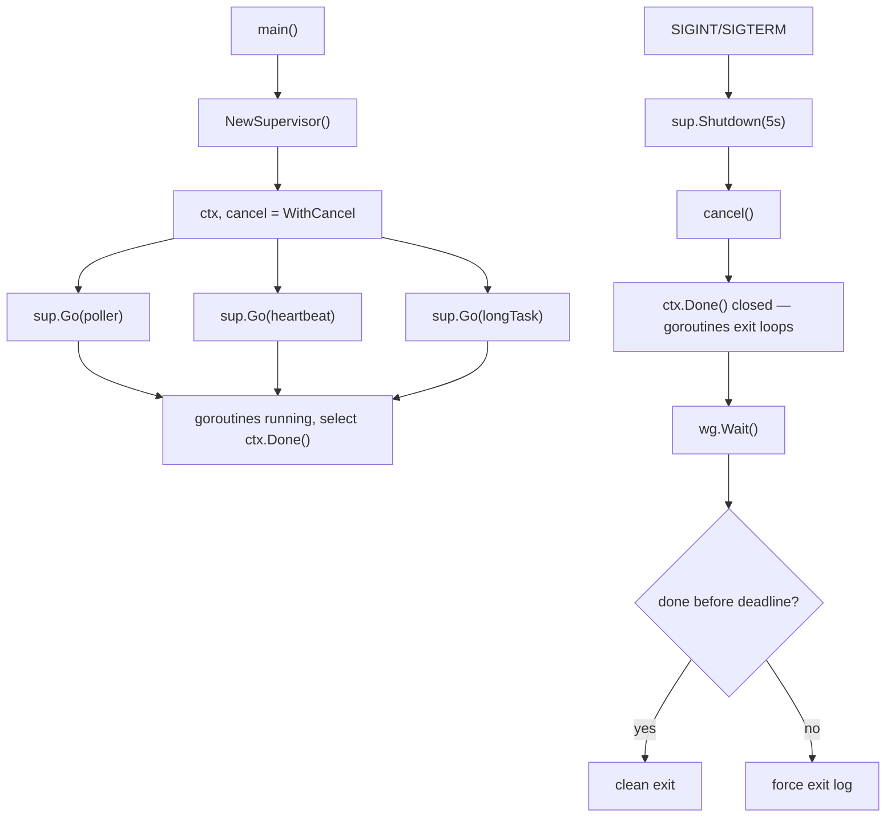
```mermaid
flowchart TD
    A["main()"] --> B["NewSupervisor()"]
    B --> C["ctx, cancel = WithCancel"]
    C --> D["sup.Go(poller)"]
    C --> E["sup.Go(heartbeat)"]
    C --> F["sup.Go(longTask)"]
    D & E & F --> G["goroutines running, select ctx.Done()"]
    H["SIGINT/SIGTERM"] --> I["sup.Shutdown(5s)"]
    I --> J["cancel()"]
    J --> K["ctx.Done() closed — goroutines exit loops"]
    K --> L["wg.Wait()"]
    L --> M{"done before deadline?"}
    M -- yes --> N["clean exit"]
    M -- no --> O["force exit log"]
```

### Interviewer Questions
1. Why use `context.WithCancel` instead of a plain `done chan struct{}`?
2. What happens if a goroutine never checks `ctx.Done()`?
3. How do you ensure in-progress database transactions are committed before shutdown?
4. What is the difference between `context.WithCancel` and `context.WithTimeout` for shutdown?
5. How would you propagate errors from background goroutines back to the supervisor?
6. Why must `wg.Add(1)` be called before `go func()`?
7. How does `signal.Notify` behave if no goroutine reads the channel?

### Follow-Up Questions
1. Add retry logic: if a goroutine exits unexpectedly, restart it up to N times
2. Add health endpoint: HTTP `/healthz` reports how many goroutines are running
3. Implement a two-phase shutdown: first stop accepting work, then drain existing work
4. How would you handle goroutines that block on external I/O (e.g., DB queries)?
5. Design a supervisor that respects per-goroutine shutdown timeouts (some need 1s, others 10s)

---

## Q19: Semaphore to Limit Concurrent API Calls  [Level 4 — Advanced]
> **Tags:** `#semaphore` `#rate-limiting` `#concurrency-control` `#buffered-channel` `#goroutines`

### Problem Statement
You have 1000 URLs to fetch. Spawning 1000 goroutines simultaneously would exhaust file descriptors and overwhelm the remote server. Implement a semaphore that limits concurrent outgoing HTTP requests to at most N at a time.

### Input / Output / Constraints
- urls []string (len up to 10,000)
- maxConcurrent int (e.g., 20)
- Return []Result where Result holds URL, response body or error
- Order of results need not match input order
- Must not exceed maxConcurrent simultaneous in-flight requests

### Thought Process
1. A buffered channel of size N acts as a counting semaphore
2. Acquire: `sem <- struct{}{}`
3. Release: `<-sem` (deferred)
4. Each goroutine acquires before HTTP call, releases in defer
5. Collect results via a results channel; close after all goroutines done

### Brute Force
```go
// No limiting — all goroutines at once
package main

import (
    "fmt"
    "net/http"
    "sync"
)

func fetchAll(urls []string) {
    var wg sync.WaitGroup
    for _, u := range urls {
        wg.Add(1)
        go func(url string) {
            defer wg.Done()
            resp, err := http.Get(url)
            if err != nil {
                fmt.Println("error:", err)
                return
            }
            defer resp.Body.Close()
            fmt.Println(url, resp.StatusCode)
        }(u)
    }
    wg.Wait()
}
```
**Time:** O(N/parallelism * latency) | **Space:** O(N) goroutines

### Better Solution
```go
package main

import (
    "fmt"
    "net/http"
    "sync"
)

type Result struct {
    URL    string
    Status int
    Err    error
}

func fetchAllLimited(urls []string, maxConcurrent int) []Result {
    sem := make(chan struct{}, maxConcurrent)
    results := make(chan Result, len(urls))
    var wg sync.WaitGroup

    for _, u := range urls {
        wg.Add(1)
        go func(url string) {
            defer wg.Done()
            sem <- struct{}{}        // acquire
            defer func() { <-sem }() // release

            resp, err := http.Get(url)
            if err != nil {
                results <- Result{URL: url, Err: err}
                return
            }
            defer resp.Body.Close()
            results <- Result{URL: url, Status: resp.StatusCode}
        }(u)
    }

    go func() {
        wg.Wait()
        close(results)
    }()

    var out []Result
    for r := range results {
        out = append(out, r)
    }
    return out
}

func main() {
    urls := []string{
        "https://httpbin.org/get",
        "https://httpbin.org/status/200",
    }
    results := fetchAllLimited(urls, 5)
    for _, r := range results {
        fmt.Printf("%s -> %d %v\n", r.URL, r.Status, r.Err)
    }
}
```

### Best Solution
```go
package main

import (
    "context"
    "fmt"
    "io"
    "net/http"
    "sync"
    "time"
)

type Semaphore struct {
    ch chan struct{}
}

func NewSemaphore(n int) *Semaphore {
    return &Semaphore{ch: make(chan struct{}, n)}
}

// Acquire blocks until a slot is available or ctx is done.
func (s *Semaphore) Acquire(ctx context.Context) error {
    select {
    case s.ch <- struct{}{}:
        return nil
    case <-ctx.Done():
        return ctx.Err()
    }
}

func (s *Semaphore) Release() {
    <-s.ch
}

type Result struct {
    URL    string
    Body   []byte
    Status int
    Err    error
    Took   time.Duration
}

func FetchAll(ctx context.Context, urls []string, maxConcurrent int) []Result {
    sem := NewSemaphore(maxConcurrent)
    results := make(chan Result, len(urls))
    var wg sync.WaitGroup

    client := &http.Client{Timeout: 10 * time.Second}

    for _, u := range urls {
        wg.Add(1)
        go func(url string) {
            defer wg.Done()

            if err := sem.Acquire(ctx); err != nil {
                results <- Result{URL: url, Err: err}
                return
            }
            defer sem.Release()

            start := time.Now()
            req, err := http.NewRequestWithContext(ctx, http.MethodGet, url, nil)
            if err != nil {
                results <- Result{URL: url, Err: err, Took: time.Since(start)}
                return
            }

            resp, err := client.Do(req)
            if err != nil {
                results <- Result{URL: url, Err: err, Took: time.Since(start)}
                return
            }
            defer resp.Body.Close()

            body, err := io.ReadAll(resp.Body)
            results <- Result{
                URL:    url,
                Body:   body,
                Status: resp.StatusCode,
                Err:    err,
                Took:   time.Since(start),
            }
        }(u)
    }

    go func() {
        wg.Wait()
        close(results)
    }()

    out := make([]Result, 0, len(urls))
    for r := range results {
        out = append(out, r)
    }
    return out
}

func main() {
    ctx, cancel := context.WithTimeout(context.Background(), 30*time.Second)
    defer cancel()

    urls := []string{
        "https://httpbin.org/get",
        "https://httpbin.org/delay/1",
        "https://httpbin.org/status/404",
    }

    results := FetchAll(ctx, urls, 2)
    for _, r := range results {
        if r.Err != nil {
            fmt.Printf("FAIL %s: %v (took %s)\n", r.URL, r.Err, r.Took)
        } else {
            fmt.Printf("OK   %s: %d (%d bytes, took %s)\n", r.URL, r.Status, len(r.Body), r.Took)
        }
    }
}
```
**Time:** O(N/maxConcurrent * avgLatency) | **Space:** O(maxConcurrent) in-flight + O(N) results

### Production Considerations
| Aspect | Details |
|--------|---------|
| Scalability | Tune maxConcurrent per target host; different hosts can have different semaphores |
| Edge Cases | Context cancellation mid-flight must release semaphore (defer guarantees this) |
| Error Handling | Per-request errors collected; caller decides retry logic |
| Memory | Body buffering: for large responses stream instead of ReadAll |
| Concurrency | `golang.org/x/sync/semaphore` offers weighted semaphore for variable-cost operations |

### Visual Explanation
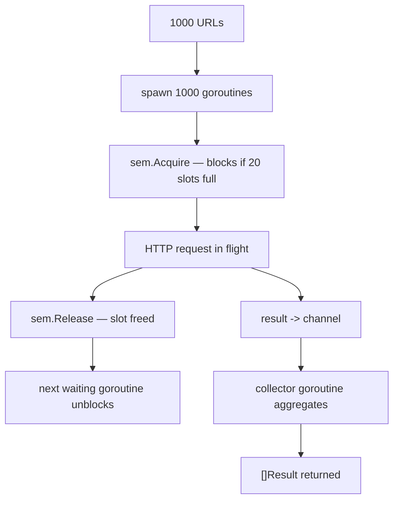
```mermaid
flowchart TD
    A["1000 URLs"] --> B["spawn 1000 goroutines"]
    B --> C["sem.Acquire — blocks if 20 slots full"]
    C --> D["HTTP request in flight"]
    D --> E["sem.Release — slot freed"]
    E --> F["next waiting goroutine unblocks"]
    D --> G["result -> channel"]
    G --> H["collector goroutine aggregates"]
    H --> I["[]Result returned"]
```

### Interviewer Questions
1. Why use a buffered channel as a semaphore instead of `sync.Mutex`?
2. What happens if a goroutine panics while holding the semaphore?
3. How does `golang.org/x/sync/semaphore` differ from this channel-based approach?
4. Can `Acquire` deadlock? Under what conditions?
5. How would you implement a timeout per individual request vs. total batch timeout?
6. What is a weighted semaphore and when would you use it?
7. How does context cancellation propagate through `http.NewRequestWithContext`?

### Follow-Up Questions
1. Add per-host semaphores: limit 5 concurrent to hostA and 10 to hostB simultaneously
2. Add exponential backoff retry inside each goroutine on 5xx responses
3. Implement a token bucket rate limiter on top of the semaphore (requests/second limit)
4. Measure p50/p95/p99 latency across all fetches
5. Stream results to caller as they arrive rather than buffering all in a slice

---

## Q20: Request-Scoped Goroutine with Context Cancellation  [Level 4 — Advanced]
> **Tags:** `#context` `#request-scoped` `#cancellation` `#http` `#goroutines`

### Problem Statement
In an HTTP handler, spawn a goroutine to do background work scoped to the request (e.g., enrich a response with data from a secondary service). If the client disconnects before the goroutine finishes, cancel its work immediately.

### Input / Output / Constraints
- HTTP handler receives `r *http.Request` with a request-scoped context
- Background goroutine does potentially slow work (DB query, external call)
- If client drops connection, `r.Context()` is cancelled — goroutine must stop
- Handler must not leak goroutines after the request ends
- Response must be written if work completes in time, or 503 returned on timeout/cancel

### Thought Process
1. Use `r.Context()` directly — it is cancelled when the client disconnects
2. Pass context to all downstream calls (DB, HTTP)
3. Use a result channel with select on ctx.Done() for timeout logic
4. Ensure goroutine always terminates (buffered channel prevents leak)

### Brute Force
```go
// Ignores context — goroutine leaks on disconnect
package main

import (
    "fmt"
    "net/http"
    "time"
)

func handler(w http.ResponseWriter, r *http.Request) {
    result := make(chan string)
    go func() {
        time.Sleep(2 * time.Second) // simulate work
        result <- "enriched data"
    }()
    data := <-result // blocks even if client disconnected
    fmt.Fprintln(w, data)
}
```
**Time:** O(work) | **Space:** O(1) — but goroutine leaks

### Better Solution
```go
package main

import (
    "context"
    "fmt"
    "net/http"
    "time"
)

func enrichData(ctx context.Context) (string, error) {
    select {
    case <-time.After(2 * time.Second):
        return "enriched data", nil
    case <-ctx.Done():
        return "", ctx.Err()
    }
}

func handler(w http.ResponseWriter, r *http.Request) {
    ctx := r.Context()
    result := make(chan string, 1)
    errCh := make(chan error, 1)

    go func() {
        data, err := enrichData(ctx)
        if err != nil {
            errCh <- err
            return
        }
        result <- data
    }()

    select {
    case data := <-result:
        fmt.Fprintln(w, data)
    case err := <-errCh:
        http.Error(w, "upstream cancelled: "+err.Error(), http.StatusServiceUnavailable)
    case <-ctx.Done():
        http.Error(w, "request cancelled", http.StatusServiceUnavailable)
    }
}

func main() {
    http.HandleFunc("/enrich", handler)
    http.ListenAndServe(":8080", nil)
}
```

### Best Solution
```go
package main

import (
    "context"
    "encoding/json"
    "fmt"
    "log"
    "net/http"
    "time"
)

type EnrichedResponse struct {
    UserID string `json:"user_id"`
    Extra  string `json:"extra"`
}

// dbQuery simulates a context-aware database call
func dbQuery(ctx context.Context, userID string) (string, error) {
    // Real code: db.QueryRowContext(ctx, "SELECT ...")
    select {
    case <-time.After(150 * time.Millisecond):
        return "extra info for " + userID, nil
    case <-ctx.Done():
        return "", fmt.Errorf("db query cancelled: %w", ctx.Err())
    }
}

// externalCall simulates a slow external enrichment service
func externalCall(ctx context.Context, userID string) (string, error) {
    select {
    case <-time.After(300 * time.Millisecond):
        return "external data for " + userID, nil
    case <-ctx.Done():
        return "", fmt.Errorf("external call cancelled: %w", ctx.Err())
    }
}

type enrichResult struct {
    data EnrichedResponse
    err  error
}

func enrichHandler(w http.ResponseWriter, r *http.Request) {
    // Derive a deadline-bound child context from the request context.
    // r.Context() is already cancelled on client disconnect.
    ctx, cancel := context.WithTimeout(r.Context(), 500*time.Millisecond)
    defer cancel()

    userID := r.URL.Query().Get("user_id")
    if userID == "" {
        http.Error(w, "missing user_id", http.StatusBadRequest)
        return
    }

    // Buffered channel — goroutine never blocks even if we've already returned
    ch := make(chan enrichResult, 1)

    go func() {
        dbData, err := dbQuery(ctx, userID)
        if err != nil {
            ch <- enrichResult{err: err}
            return
        }
        extData, err := externalCall(ctx, userID)
        if err != nil {
            ch <- enrichResult{err: err}
            return
        }
        ch <- enrichResult{data: EnrichedResponse{
            UserID: userID,
            Extra:  dbData + " | " + extData,
        }}
    }()

    select {
    case res := <-ch:
        if res.err != nil {
            log.Printf("enrich error for %s: %v", userID, res.err)
            http.Error(w, "service unavailable", http.StatusServiceUnavailable)
            return
        }
        w.Header().Set("Content-Type", "application/json")
        json.NewEncoder(w).Encode(res.data)

    case <-ctx.Done():
        log.Printf("request cancelled/timed out for user %s: %v", userID, ctx.Err())
        http.Error(w, "request timeout", http.StatusGatewayTimeout)
    }
}

func main() {
    mux := http.NewServeMux()
    mux.HandleFunc("/enrich", enrichHandler)
    log.Println("listening on :8080")
    log.Fatal(http.ListenAndServe(":8080", mux))
}
```
**Time:** O(max(dbLatency, extLatency)) | **Space:** O(1) per request (buffered channel prevents leak)

### Production Considerations
| Aspect | Details |
|--------|---------|
| Scalability | Goroutine per request is fine; ensure all downstream calls accept context |
| Edge Cases | Buffered channel (size 1) is critical — goroutine can always send even if handler returned |
| Error Handling | Distinguish timeout (504) from client cancel (499 in nginx convention) |
| Memory | Avoid capturing large request bodies in goroutine closures |
| Concurrency | Use errgroup for fan-out of multiple parallel sub-calls within one request |

### Visual Explanation
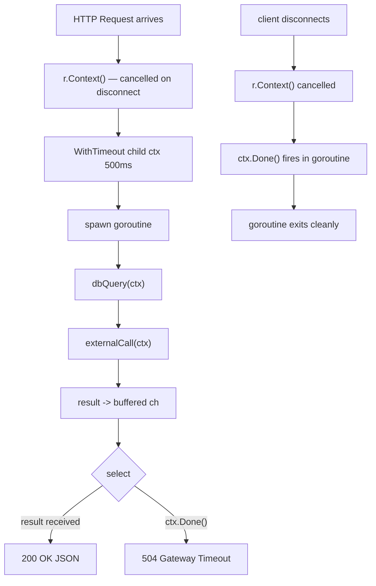
```mermaid
flowchart TD
    A["HTTP Request arrives"] --> B["r.Context() — cancelled on disconnect"]
    B --> C["WithTimeout child ctx 500ms"]
    C --> D["spawn goroutine"]
    D --> E["dbQuery(ctx)"]
    E --> F["externalCall(ctx)"]
    F --> G["result -> buffered ch"]
    G --> H{"select"}
    H -- "result received" --> I["200 OK JSON"]
    H -- "ctx.Done()" --> J["504 Gateway Timeout"]
    K["client disconnects"] --> L["r.Context() cancelled"]
    L --> M["ctx.Done() fires in goroutine"]
    M --> N["goroutine exits cleanly"]
```

### Interviewer Questions
1. Why must the result channel be buffered (size >= 1)?
2. What is the difference between `r.Context()` cancellation (client disconnect) and `context.WithTimeout` expiry?
3. If the goroutine panics, what happens to the HTTP response?
4. How does Go's net/http server detect a client disconnect?
5. Should you use `context.WithDeadline` or `context.WithTimeout` for per-request limits?
6. How would you log the cancellation reason (timeout vs disconnect) differently?
7. Why is `defer cancel()` important even when context times out?

### Follow-Up Questions
1. Fan out two independent calls (db + external) in parallel using errgroup, cancel both if either fails
2. Add request tracing: propagate trace ID through context to all downstream calls
3. Implement a request hedging pattern: if primary call takes > 100ms, fire a duplicate to a backup
4. Add middleware that injects a per-request timeout from a config map keyed by route
5. How would you unit test that goroutines do not leak when client disconnects?

---

## Q21: Goroutine Pool with Work Stealing  [Level 4 — Advanced]
> **Tags:** `#goroutine-pool` `#work-stealing` `#deque` `#scheduling` `#concurrency`

### Problem Statement
Implement a goroutine pool where each worker has its own local queue. When a worker's local queue is empty, it "steals" tasks from another worker's queue tail. This mirrors Go's own scheduler and reduces lock contention vs. a single global queue.

### Input / Output / Constraints
- N worker goroutines
- Tasks submitted via Submit(fn func())
- Workers process from local queue; steal from others when idle
- No task is run more than once
- All submitted tasks must eventually execute

### Thought Process
1. Each worker has a double-ended queue (deque)
2. Owner pushes/pops from the front (local work)
3. Thieves pop from the back (steal)
4. Use mutex per deque (or lock-free CAS for production)
5. Workers spin briefly, then park on a semaphore to avoid CPU waste

### Brute Force
```go
// Single global channel — high contention
package main

import "sync"

type Pool struct {
    tasks chan func()
    wg    sync.WaitGroup
}

func NewPool(workers int) *Pool {
    p := &Pool{tasks: make(chan func(), 1000)}
    for i := 0; i < workers; i++ {
        go func() {
            for f := range p.tasks {
                f()
            }
        }()
    }
    return p
}

func (p *Pool) Submit(f func()) { p.tasks <- f }
func (p *Pool) Stop()           { close(p.tasks) }
```
**Time:** O(1) submit | **Space:** O(queue depth)

### Better Solution
```go
package main

import (
    "fmt"
    "sync"
    "sync/atomic"
)

type Deque struct {
    mu    sync.Mutex
    tasks []func()
}

func (d *Deque) PushFront(f func()) {
    d.mu.Lock()
    d.tasks = append([]func(){f}, d.tasks...)
    d.mu.Unlock()
}

func (d *Deque) PopFront() (func(), bool) {
    d.mu.Lock()
    defer d.mu.Unlock()
    if len(d.tasks) == 0 {
        return nil, false
    }
    f := d.tasks[0]
    d.tasks = d.tasks[1:]
    return f, true
}

func (d *Deque) StealBack() (func(), bool) {
    d.mu.Lock()
    defer d.mu.Unlock()
    if len(d.tasks) == 0 {
        return nil, false
    }
    n := len(d.tasks)
    f := d.tasks[n-1]
    d.tasks = d.tasks[:n-1]
    return f, true
}

func (d *Deque) Len() int {
    d.mu.Lock()
    defer d.mu.Unlock()
    return len(d.tasks)
}

type StealPool struct {
    workers []*Deque
    n       int
    closed  atomic.Bool
    wg      sync.WaitGroup
}

func NewStealPool(n int) *StealPool {
    p := &StealPool{n: n}
    p.workers = make([]*Deque, n)
    for i := range p.workers {
        p.workers[i] = &Deque{}
    }
    for i := 0; i < n; i++ {
        p.wg.Add(1)
        go p.run(i)
    }
    return p
}

var roundRobin atomic.Int64

func (p *StealPool) Submit(f func()) {
    idx := int(roundRobin.Add(1)) % p.n
    p.workers[idx].PushFront(f)
}

func (p *StealPool) run(id int) {
    defer p.wg.Done()
    local := p.workers[id]
    for !p.closed.Load() {
        if f, ok := local.PopFront(); ok {
            f()
            continue
        }
        // try to steal from another worker
        stolen := false
        for j := 1; j < p.n; j++ {
            victim := (id + j) % p.n
            if f, ok := p.workers[victim].StealBack(); ok {
                f()
                stolen = true
                break
            }
        }
        if !stolen {
            // yield to avoid spinning
            // In production use: runtime.Gosched() or a condition variable
        }
    }
}

func (p *StealPool) Stop() {
    p.closed.Store(true)
    p.wg.Wait()
}

func main() {
    pool := NewStealPool(4)
    var mu sync.Mutex
    results := []int{}

    for i := 0; i < 20; i++ {
        i := i
        pool.Submit(func() {
            mu.Lock()
            results = append(results, i)
            mu.Unlock()
        })
    }

    pool.Stop()
    fmt.Println("processed", len(results), "tasks")
}
```

### Best Solution
```go
package main

import (
    "fmt"
    "runtime"
    "sync"
    "sync/atomic"
    "time"
)

// WorkStealPool is a goroutine pool with per-worker deques and work stealing.
type WorkStealPool struct {
    numWorkers int
    deques     []*lockedDeque
    closed     atomic.Bool
    wg         sync.WaitGroup
    // Park/unpark mechanism: semaphore per worker
    semaphores []chan struct{}
}

type lockedDeque struct {
    mu    sync.Mutex
    items []func()
}

func (d *lockedDeque) pushFront(f func()) {
    d.mu.Lock()
    d.items = append([]func(){f}, d.items...)
    d.mu.Unlock()
}

func (d *lockedDeque) popFront() (func(), bool) {
    d.mu.Lock()
    defer d.mu.Unlock()
    if len(d.items) == 0 {
        return nil, false
    }
    f := d.items[0]
    d.items = d.items[1:]
    return f, true
}

func (d *lockedDeque) stealBack() (func(), bool) {
    d.mu.Lock()
    defer d.mu.Unlock()
    if len(d.items) < 2 { // only steal if victim has > 1 to keep fairness
        return nil, false
    }
    n := len(d.items)
    f := d.items[n-1]
    d.items = d.items[:n-1]
    return f, true
}

func NewWorkStealPool(n int) *WorkStealPool {
    if n <= 0 {
        n = runtime.NumCPU()
    }
    p := &WorkStealPool{
        numWorkers: n,
        deques:     make([]*lockedDeque, n),
        semaphores: make([]chan struct{}, n),
    }
    for i := range p.deques {
        p.deques[i] = &lockedDeque{}
        p.semaphores[i] = make(chan struct{}, 1)
    }
    for i := 0; i < n; i++ {
        p.wg.Add(1)
        go p.workerLoop(i)
    }
    return p
}

var submitCounter atomic.Int64

func (p *WorkStealPool) Submit(f func()) {
    idx := int(submitCounter.Add(1)-1) % p.numWorkers
    p.deques[idx].pushFront(f)
    // wake the assigned worker
    select {
    case p.semaphores[idx] <- struct{}{}:
    default:
    }
}

func (p *WorkStealPool) workerLoop(id int) {
    defer p.wg.Done()
    local := p.deques[id]
    sem := p.semaphores[id]
    spinCount := 0
    const maxSpin = 100

    for {
        if f, ok := local.popFront(); ok {
            spinCount = 0
            f()
            continue
        }

        // Try stealing
        stolen := false
        for j := 1; j < p.numWorkers; j++ {
            victim := (id + j) % p.numWorkers
            if f, ok := p.deques[victim].stealBack(); ok {
                spinCount = 0
                f()
                stolen = true
                break
            }
        }
        if stolen {
            continue
        }

        // Nothing to do
        spinCount++
        if p.closed.Load() {
            return
        }
        if spinCount < maxSpin {
            runtime.Gosched()
            continue
        }
        // Park until woken or timeout
        select {
        case <-sem:
            spinCount = 0
        case <-time.After(1 * time.Millisecond):
            spinCount = 0
        }
    }
}

func (p *WorkStealPool) Stop() {
    p.closed.Store(true)
    // Wake all parked workers
    for _, s := range p.semaphores {
        select {
        case s <- struct{}{}:
        default:
        }
    }
    p.wg.Wait()
}

func main() {
    pool := NewWorkStealPool(4)

    var (
        mu      sync.Mutex
        done    int
        total   = 40
        waitAll = make(chan struct{})
    )

    for i := 0; i < total; i++ {
        i := i
        pool.Submit(func() {
            // simulate varied work
            time.Sleep(time.Duration(i%5) * time.Millisecond)
            mu.Lock()
            done++
            if done == total {
                close(waitAll)
            }
            mu.Unlock()
        })
    }

    <-waitAll
    pool.Stop()
    fmt.Printf("work stealing pool: completed %d/%d tasks\n", done, total)
}
```
**Time:** O(1) amortized submit, O(N) shutdown | **Space:** O(N workers + Q tasks)

### Production Considerations
| Aspect | Details |
|--------|---------|
| Scalability | Reduces contention vs global queue; scales near-linearly with cores |
| Edge Cases | Steal threshold (>1 item) prevents thrashing when queues are nearly empty |
| Error Handling | Panics in tasks must be recovered; pool must not crash |
| Memory | Lock-free Chase-Lev deque avoids mutex overhead in hot path |
| Concurrency | Go's runtime already uses work-stealing; this pattern mirrors runtime internals |

### Visual Explanation
```mermaid
flowchart TD
    A["Submit(task)"] --> B["round-robin to Worker i deque front"]
    B --> C["Worker i: popFront local deque"]
    C -- "has work" --> D["execute task"]
    C -- "empty" --> E["scan other workers' deques"]
    E -- "victim has work" --> F["stealBack from victim tail"]
    F --> D
    E -- "all empty" --> G["park on semaphore"]
    H["new Submit"] --> I["wake worker via semaphore"]
    I --> C
```

### Interviewer Questions
1. Why steal from the tail instead of the front?
2. What is the Chase-Lev deque and how is it lock-free?
3. How does work stealing compare to a work-sharing (single global queue) approach?
4. What is false sharing and how does it affect per-worker deques on multi-core CPUs?
5. How does Go's runtime scheduler use work stealing among P (processor) run queues?
6. When would a single global channel outperform work stealing?
7. How do you prevent starvation when all workers are stealing from the same victim?

### Follow-Up Questions
1. Implement task priorities within each local deque
2. Add metrics: steal count, task latency histogram, queue depth per worker
3. Replace mutex deque with a lock-free ring buffer using atomic operations
4. Implement NUMA-aware stealing: prefer stealing from same-socket workers first
5. Add a global "injection" queue for overflow when all local deques are full

---

## Q22: Health Check Pinger Running Every N Seconds  [Level 4 — Advanced]
> **Tags:** `#health-check` `#ticker` `#goroutines` `#context` `#monitoring`

### Problem Statement
Implement a background health-check service that pings a list of endpoints every N seconds. Track each endpoint's status (healthy/unhealthy), consecutive failure count, and last checked time. Expose the status map for querying. Shut down cleanly on context cancellation.

### Input / Output / Constraints
- endpoints []string (HTTP URLs)
- interval time.Duration
- timeout per ping (e.g., 2s)
- Provide GetStatus(url) -> Status
- Goroutine must stop when ctx is cancelled
- Thread-safe status map

### Thought Process
1. Single goroutine with `time.NewTicker(interval)`
2. Per-tick: launch goroutines for each endpoint (with per-ping timeout)
3. Collect results; update status map under a mutex
4. On ctx.Done(), stop ticker and return
5. Expose status map via read lock

### Brute Force
```go
// Single goroutine, sequential pings — slow for many endpoints
package main

import (
    "fmt"
    "net/http"
    "time"
)

func pingLoop(urls []string, interval time.Duration) {
    for {
        for _, u := range urls {
            resp, err := http.Get(u)
            if err != nil || resp.StatusCode >= 500 {
                fmt.Println(u, "UNHEALTHY")
            } else {
                fmt.Println(u, "HEALTHY")
            }
            if resp != nil { resp.Body.Close() }
        }
        time.Sleep(interval)
    }
}
```
**Time:** O(N * latency) per cycle | **Space:** O(1)

### Better Solution
```go
package main

import (
    "context"
    "fmt"
    "net/http"
    "sync"
    "time"
)

type Status struct {
    Healthy      bool
    LastChecked  time.Time
    Failures     int
    LastError    string
}

type HealthChecker struct {
    mu       sync.RWMutex
    statuses map[string]Status
    client   *http.Client
}

func NewHealthChecker(timeout time.Duration) *HealthChecker {
    return &HealthChecker{
        statuses: make(map[string]Status),
        client:   &http.Client{Timeout: timeout},
    }
}

func (h *HealthChecker) ping(ctx context.Context, url string) {
    req, err := http.NewRequestWithContext(ctx, http.MethodGet, url, nil)
    var s Status
    s.LastChecked = time.Now()
    if err != nil {
        s.Healthy = false
        s.LastError = err.Error()
    } else {
        resp, err := h.client.Do(req)
        if err != nil {
            s.Healthy = false
            s.LastError = err.Error()
        } else {
            resp.Body.Close()
            s.Healthy = resp.StatusCode < 500
        }
    }

    h.mu.Lock()
    old := h.statuses[url]
    if !s.Healthy {
        s.Failures = old.Failures + 1
        s.LastError = s.LastError
    }
    h.statuses[url] = s
    h.mu.Unlock()
}

func (h *HealthChecker) Run(ctx context.Context, urls []string, interval time.Duration) {
    ticker := time.NewTicker(interval)
    defer ticker.Stop()
    for {
        select {
        case <-ctx.Done():
            return
        case <-ticker.C:
            var wg sync.WaitGroup
            pingCtx, cancel := context.WithTimeout(ctx, interval/2)
            for _, u := range urls {
                wg.Add(1)
                go func(url string) {
                    defer wg.Done()
                    h.ping(pingCtx, url)
                }(u)
            }
            wg.Wait()
            cancel()
        }
    }
}

func (h *HealthChecker) GetStatus(url string) (Status, bool) {
    h.mu.RLock()
    defer h.mu.RUnlock()
    s, ok := h.statuses[url]
    return s, ok
}

func main() {
    ctx, cancel := context.WithCancel(context.Background())
    checker := NewHealthChecker(2 * time.Second)
    urls := []string{"https://httpbin.org/status/200", "https://httpbin.org/status/500"}
    go checker.Run(ctx, urls, 5*time.Second)
    time.Sleep(6 * time.Second)
    for _, u := range urls {
        s, _ := checker.GetStatus(u)
        fmt.Printf("%s: healthy=%v failures=%d\n", u, s.Healthy, s.Failures)
    }
    cancel()
}
```

### Best Solution
```go
package main

import (
    "context"
    "fmt"
    "net/http"
    "sync"
    "time"
)

type EndpointStatus struct {
    Healthy          bool
    ConsecutiveFails int
    LastChecked      time.Time
    LastError        string
    Latency          time.Duration
}

type HealthChecker struct {
    mu       sync.RWMutex
    statuses map[string]*EndpointStatus
    client   *http.Client
    interval time.Duration
    timeout  time.Duration
    onChange func(url string, status EndpointStatus) // optional callback
}

func NewHealthChecker(interval, timeout time.Duration, onChange func(string, EndpointStatus)) *HealthChecker {
    return &HealthChecker{
        statuses: make(map[string]*EndpointStatus),
        client:   &http.Client{Timeout: timeout},
        interval: interval,
        timeout:  timeout,
        onChange: onChange,
    }
}

func (h *HealthChecker) ping(ctx context.Context, url string) {
    start := time.Now()
    req, err := http.NewRequestWithContext(ctx, http.MethodGet, url, nil)
    
    var newStatus EndpointStatus
    newStatus.LastChecked = start

    if err != nil {
        newStatus.Healthy = false
        newStatus.LastError = err.Error()
    } else {
        resp, err := h.client.Do(req)
        newStatus.Latency = time.Since(start)
        if err != nil {
            newStatus.Healthy = false
            newStatus.LastError = err.Error()
        } else {
            resp.Body.Close()
            newStatus.Healthy = resp.StatusCode >= 200 && resp.StatusCode < 500
            if !newStatus.Healthy {
                newStatus.LastError = fmt.Sprintf("status %d", resp.StatusCode)
            }
        }
    }

    h.mu.Lock()
    prev, exists := h.statuses[url]
    if !exists {
        prev = &EndpointStatus{}
        h.statuses[url] = prev
    }
    if !newStatus.Healthy {
        newStatus.ConsecutiveFails = prev.ConsecutiveFails + 1
    }
    // detect state change
    stateChanged := !exists || prev.Healthy != newStatus.Healthy
    *prev = newStatus
    h.mu.Unlock()

    if stateChanged && h.onChange != nil {
        h.onChange(url, newStatus)
    }
}

func (h *HealthChecker) runCycle(ctx context.Context, urls []string) {
    pingCtx, cancel := context.WithTimeout(ctx, h.timeout)
    defer cancel()

    var wg sync.WaitGroup
    for _, u := range urls {
        wg.Add(1)
        go func(url string) {
            defer wg.Done()
            h.ping(pingCtx, url)
        }(u)
    }
    wg.Wait()
}

func (h *HealthChecker) Run(ctx context.Context, urls []string) {
    // Run immediately on start
    h.runCycle(ctx, urls)

    ticker := time.NewTicker(h.interval)
    defer ticker.Stop()

    for {
        select {
        case <-ctx.Done():
            return
        case <-ticker.C:
            h.runCycle(ctx, urls)
        }
    }
}

func (h *HealthChecker) GetStatus(url string) (EndpointStatus, bool) {
    h.mu.RLock()
    defer h.mu.RUnlock()
    s, ok := h.statuses[url]
    if !ok {
        return EndpointStatus{}, false
    }
    return *s, true
}

func (h *HealthChecker) AllStatuses() map[string]EndpointStatus {
    h.mu.RLock()
    defer h.mu.RUnlock()
    out := make(map[string]EndpointStatus, len(h.statuses))
    for k, v := range h.statuses {
        out[k] = *v
    }
    return out
}

func main() {
    ctx, cancel := context.WithCancel(context.Background())
    defer cancel()

    onChange := func(url string, s EndpointStatus) {
        state := "HEALTHY"
        if !s.Healthy {
            state = "UNHEALTHY"
        }
        fmt.Printf("[STATE CHANGE] %s -> %s (fails=%d)\n", url, state, s.ConsecutiveFails)
    }

    checker := NewHealthChecker(5*time.Second, 2*time.Second, onChange)

    urls := []string{
        "https://httpbin.org/status/200",
        "https://httpbin.org/status/503",
    }

    go checker.Run(ctx, urls)

    time.Sleep(7 * time.Second)

    for url, s := range checker.AllStatuses() {
        fmt.Printf("%s | healthy=%v | fails=%d | latency=%s | last=%s\n",
            url, s.Healthy, s.ConsecutiveFails,
            s.Latency.Round(time.Millisecond),
            s.LastChecked.Format("15:04:05"))
    }
}
```
**Time:** O(N endpoints) per interval | **Space:** O(N) status map

### Production Considerations
| Aspect | Details |
|--------|---------|
| Scalability | One goroutine per endpoint per cycle; hundreds of endpoints are fine |
| Edge Cases | First run before ticker fires; ping timeout < interval to avoid overlap |
| Error Handling | State-change callback for alerting (PagerDuty, Slack); don't alert on every check |
| Memory | Copy status out under lock to avoid holding lock during callback |
| Concurrency | RWMutex allows concurrent reads; write only during update |

### Visual Explanation
```mermaid
flowchart TD
    A["Run(ctx, urls)"] --> B["runCycle immediately"]
    B --> C["ticker := NewTicker(interval)"]
    C --> D{"select"}
    D -- "ticker.C" --> E["runCycle(ctx, urls)"]
    D -- "ctx.Done()" --> F["return"]
    E --> G["spawn goroutine per URL"]
    G --> H["ping with timeout ctx"]
    H -- "200-499" --> I["Healthy=true"]
    H -- "5xx/error" --> J["Healthy=false, fails++"]
    I & J --> K["lock + update statuses map"]
    K --> L["state changed? fire onChange callback"]
```

### Interviewer Questions
1. Why run an initial cycle before the first ticker fires?
2. How do you prevent a slow ping from the previous cycle overlapping with the next?
3. What is the difference between consecutive failure count and total failure count?
4. How would you implement exponential backoff for unhealthy endpoints?
5. Why copy the status struct before returning it from `GetStatus`?
6. How would you expose the status map as a Prometheus metrics endpoint?
7. What happens if the health checker's own HTTP client is overwhelmed?

### Follow-Up Questions
1. Add circuit breaker per endpoint: stop pinging after 5 consecutive failures, retry after 30s
2. Implement jitter: randomize ping times within interval to avoid thundering herd
3. Add weighted health: mark overall service unhealthy only if >50% endpoints fail
4. Persist status to Redis for multi-instance health aggregation
5. Add `WARN` state: healthy but latency > 500ms

---
