> © 2024 Gaurav Patil — GoForge Platform. All rights reserved.

# Go Sync Primitives — Coding Practice (Part 1: Levels 1-3)

Level 1 — Beginner (Q1-Q3):
Q1: Basic sync.Mutex to protect a counter
Q2: sync.WaitGroup: wait for 5 goroutines to finish
Q3: sync.Once: initialize a config exactly once

Level 2 — Easy (Q4-Q7):
Q4: sync.RWMutex for a read-heavy cache
Q5: sync.Mutex-protected bank account (deposit/withdraw)
Q6: sync.Pool for byte buffer reuse
Q7: sync.Map for concurrent key-value store

Level 3 — Medium (Q8-Q12):
Q8: sync.Cond: producer notifies consumer
Q9: Concurrent safe queue using mutex
Q10: RW-locked map implementation from scratch
Q11: Compare mutex vs channel for same use case
Q12: Avoid deadlock with lock ordering

Each question uses this format:
---
## Q{N}: {Title}  [Level {X} — {Name}]
> **Tags:** `#{tag}`
### Problem Statement
### Input / Output / Constraints
### Thought Process
### Brute Force
```go
// code
```
**Time:** O(?) | **Space:** O(?)
### Better Solution
```go
// code
```
### Best Solution
```go
package main
// production code with main()
```
**Time:** O(?) | **Space:** O(?)
### Production Considerations
| Aspect | Details |
|--------|---------|
| Scalability | ... | Edge Cases | ... | Error Handling | ... | Memory | ... | Concurrency | ... |
### Visual Explanation
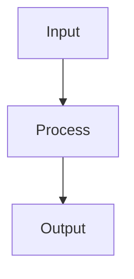
```mermaid
flowchart TD
    A["Input"] --> B["Process"] --> C["Output"]
```
### Interviewer Questions
1-7 questions
### Follow-Up Questions Q1-Q5
---

---
## Q1: Basic Mutex Counter  [Level 1 — Beginner]
> **Tags:** `#mutex` `#goroutine` `#race-condition` `#sync`

### Problem Statement
Implement a thread-safe counter that multiple goroutines can increment concurrently. Without synchronization, concurrent increments cause race conditions and lost updates. Use `sync.Mutex` to protect the counter so the final value is always correct.

### Input / Output / Constraints
- **Input:** N goroutines, each incrementing the counter M times
- **Output:** Final counter value = N × M
- **Constraints:** No atomic operations — use `sync.Mutex` explicitly; no channels

### Thought Process
A plain `counter++` is not atomic: read → increment → write. When two goroutines interleave these steps, one update is lost. A mutex ensures only one goroutine enters the critical section at a time.

1. Embed a `sync.Mutex` next to the integer it protects.
2. Call `Lock()` before the read-modify-write, `Unlock()` (or `defer Unlock()`) after.
3. Use a `sync.WaitGroup` so `main` waits for all goroutines before printing.

### Brute Force
```go
// Unsafe — data race, wrong result
var counter int
for i := 0; i < 1000; i++ {
    go func() { counter++ }()
}
```
**Time:** O(N) | **Space:** O(1)

### Better Solution
```go
var (
    mu      sync.Mutex
    counter int
)

func increment() {
    mu.Lock()
    counter++
    mu.Unlock()
}
```

### Best Solution
```go
package main

import (
	"fmt"
	"sync"
)

type SafeCounter struct {
	mu    sync.Mutex
	value int
}

func (c *SafeCounter) Increment() {
	c.mu.Lock()
	defer c.mu.Unlock()
	c.value++
}

func (c *SafeCounter) Value() int {
	c.mu.Lock()
	defer c.mu.Unlock()
	return c.value
}

func main() {
	const goroutines = 100
	const increments = 1000

	counter := &SafeCounter{}
	var wg sync.WaitGroup

	for i := 0; i < goroutines; i++ {
		wg.Add(1)
		go func() {
			defer wg.Done()
			for j := 0; j < increments; j++ {
				counter.Increment()
			}
		}()
	}

	wg.Wait()
	fmt.Printf("Final counter: %d (expected %d)\n", counter.Value(), goroutines*increments)
}
```
**Time:** O(N×M) | **Space:** O(1)

### Production Considerations
| Aspect | Details |
|--------|---------|
| Scalability | High contention under many goroutines; consider `sync/atomic` for simple integer counters |
| Edge Cases | Never copy a `sync.Mutex` by value — always pass as pointer |
| Error Handling | Panics inside the critical section skip `Unlock`; use `defer` to guarantee unlock |
| Memory | Mutex adds 8 bytes; negligible overhead |
| Concurrency | `defer mu.Unlock()` is idiomatic and panic-safe; avoid holding lock across I/O |

### Visual Explanation
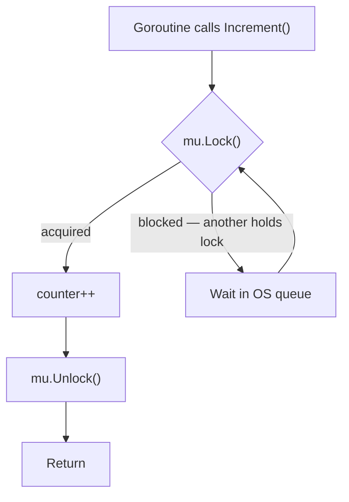
```mermaid
flowchart TD
    A["Goroutine calls Increment()"] --> B{"mu.Lock()"}
    B -->|"acquired"| C["counter++"]
    C --> D["mu.Unlock()"]
    D --> E["Return"]
    B -->|"blocked — another holds lock"| F["Wait in OS queue"]
    F --> B
```

### Interviewer Questions
1. What is a race condition and how does a mutex prevent it?
2. Why is `defer mu.Unlock()` preferred over a plain `mu.Unlock()` at the end?
3. What happens if you copy a `sync.Mutex` by value?
4. When would you choose `sync/atomic` over `sync.Mutex` for a counter?
5. Can a goroutine lock the same mutex twice? What happens?
6. How would you detect a race condition without running the program?
7. What is the difference between a mutex and a semaphore?

### Follow-Up Questions
- **Q1:** How would you make this counter support both increment and decrement?
- **Q2:** Rewrite using `sync/atomic` — when is each approach better?
- **Q3:** How would you add a `Reset()` method safely?
- **Q4:** What does `go test -race` do and how does it help here?
- **Q5:** Explain what happens to throughput as goroutine count grows with a single mutex.

---

---
## Q2: WaitGroup — Wait for 5 Goroutines  [Level 1 — Beginner]
> **Tags:** `#waitgroup` `#goroutine` `#concurrency` `#sync`

### Problem Statement
Launch exactly 5 goroutines, each performing some work (e.g., simulating a task with a print statement). The main goroutine must not exit until all 5 have completed. Use `sync.WaitGroup` — do not use channels or `time.Sleep` as a substitute.

### Input / Output / Constraints
- **Input:** Fixed number of goroutines (5)
- **Output:** All task completion messages printed; main exits only after all finish
- **Constraints:** Must use `sync.WaitGroup`; no `time.Sleep` for synchronization

### Thought Process
`sync.WaitGroup` acts as a countdown latch:
1. Call `wg.Add(n)` before launching goroutines.
2. Each goroutine calls `wg.Done()` (equivalent to `Add(-1)`) when finished.
3. `wg.Wait()` blocks until the internal counter reaches zero.

Key rule: always `Add` before the goroutine starts to avoid a race where `Wait` returns early.

### Brute Force
```go
// Using time.Sleep — fragile, incorrect
go func() { fmt.Println("task done") }()
time.Sleep(1 * time.Second) // hope all goroutines finish
```
**Time:** O(N) | **Space:** O(1)

### Better Solution
```go
var wg sync.WaitGroup
for i := 0; i < 5; i++ {
    wg.Add(1)
    go func(id int) {
        defer wg.Done()
        fmt.Printf("goroutine %d done\n", id)
    }(i)
}
wg.Wait()
```

### Best Solution
```go
package main

import (
	"fmt"
	"math/rand"
	"sync"
	"time"
)

func worker(id int, wg *sync.WaitGroup) {
	defer wg.Done()
	delay := time.Duration(rand.Intn(300)) * time.Millisecond
	time.Sleep(delay)
	fmt.Printf("Worker %d finished after %v\n", id, delay)
}

func main() {
	const numWorkers = 5
	var wg sync.WaitGroup

	fmt.Println("Launching workers...")
	for i := 1; i <= numWorkers; i++ {
		wg.Add(1)
		go worker(i, &wg)
	}

	wg.Wait()
	fmt.Println("All workers completed.")
}
```
**Time:** O(max worker duration) | **Space:** O(1)

### Production Considerations
| Aspect | Details |
|--------|---------|
| Scalability | WaitGroup scales to millions of goroutines; counter is a single atomic int64 |
| Edge Cases | Do not call `Add` inside the goroutine — the main goroutine may reach `Wait` before `Add` executes |
| Error Handling | WaitGroup has no error propagation; use `errgroup.Group` from `golang.org/x/sync` for error-aware waiting |
| Memory | 12 bytes; safe to copy only before first use |
| Concurrency | `Done()` must be called exactly once per `Add(1)`; use `defer` to guarantee it |

### Visual Explanation
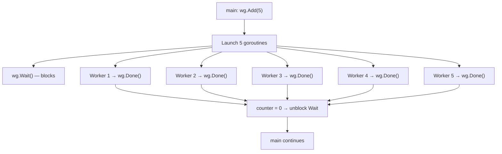
```mermaid
flowchart TD
    A["main: wg.Add(5)"] --> B["Launch 5 goroutines"]
    B --> C["wg.Wait() — blocks"]
    B --> W1["Worker 1 → wg.Done()"]
    B --> W2["Worker 2 → wg.Done()"]
    B --> W3["Worker 3 → wg.Done()"]
    B --> W4["Worker 4 → wg.Done()"]
    B --> W5["Worker 5 → wg.Done()"]
    W1 & W2 & W3 & W4 & W5 --> D["counter = 0 → unblock Wait"]
    D --> E["main continues"]
```

### Interviewer Questions
1. What happens if `wg.Add(1)` is called inside the goroutine instead of before it?
2. What is the difference between `wg.Done()` and `wg.Add(-1)`?
3. How does `errgroup.Group` improve on `sync.WaitGroup`?
4. Can you reuse a WaitGroup after `Wait()` returns?
5. Why must the WaitGroup be passed as a pointer to goroutines?
6. What happens if `Done()` is called more times than `Add()`?
7. How would you add a timeout so `main` doesn't wait forever?

### Follow-Up Questions
- **Q1:** Rewrite using a done channel instead of WaitGroup — what are the trade-offs?
- **Q2:** How would you collect results from each worker back to main?
- **Q3:** Use `errgroup` to propagate the first worker error back to main.
- **Q4:** How do you add a context with cancellation so workers stop early on signal?
- **Q5:** What is the difference between fan-out and pipeline concurrency patterns?

---

---
## Q3: sync.Once — Initialize Config Exactly Once  [Level 1 — Beginner]
> **Tags:** `#once` `#singleton` `#lazy-init` `#sync`

### Problem Statement
Implement a configuration loader that reads from a (simulated) expensive source — e.g., a file or remote service. Regardless of how many goroutines call `GetConfig()` concurrently, the initialization must run exactly once. Use `sync.Once`.

### Input / Output / Constraints
- **Input:** Multiple concurrent calls to `GetConfig()`
- **Output:** A single initialized config struct, shared by all callers
- **Constraints:** Initialization runs exactly once; no global `init()` function

### Thought Process
`sync.Once` guarantees that a function is executed at most once, even when called concurrently from multiple goroutines. The internal mechanism uses an atomic flag plus a mutex so the first caller runs the function while others block; all subsequent calls return immediately.

Pattern:
1. Declare a package-level `sync.Once` and a pointer to the config.
2. In `GetConfig()`, call `once.Do(func() { config = load() })`.
3. Return the config pointer — safe to read concurrently after initialization.

### Brute Force
```go
// Naive double-checked locking — broken in Go without sync.Once
var config *Config
var mu sync.Mutex

func GetConfig() *Config {
    if config == nil {       // race: two goroutines may both see nil
        mu.Lock()
        config = loadConfig()
        mu.Unlock()
    }
    return config
}
```
**Time:** O(1) after init | **Space:** O(1)

### Better Solution
```go
var (
    once   sync.Once
    config *Config
)

func GetConfig() *Config {
    once.Do(func() {
        config = loadConfig()
    })
    return config
}
```

### Best Solution
```go
package main

import (
	"fmt"
	"sync"
	"time"
)

type Config struct {
	DSN      string
	MaxConns int
	Debug    bool
}

var (
	once     sync.Once
	instance *Config
)

func loadConfig() *Config {
	// Simulate expensive initialization (file I/O, remote fetch, etc.)
	time.Sleep(50 * time.Millisecond)
	fmt.Println("  [init] loading config...")
	return &Config{
		DSN:      "postgres://localhost:5432/mydb",
		MaxConns: 25,
		Debug:    false,
	}
}

func GetConfig() *Config {
	once.Do(func() {
		instance = loadConfig()
	})
	return instance
}

func main() {
	const callers = 10
	var wg sync.WaitGroup

	for i := 1; i <= callers; i++ {
		wg.Add(1)
		go func(id int) {
			defer wg.Done()
			cfg := GetConfig()
			fmt.Printf("Goroutine %2d got config: DSN=%s\n", id, cfg.DSN)
		}(i)
	}

	wg.Wait()
	fmt.Println("Done. Config loaded exactly once.")
}
```
**Time:** O(1) amortized | **Space:** O(1)

### Production Considerations
| Aspect | Details |
|--------|---------|
| Scalability | After the first call, `once.Do` is a fast atomic read — near zero overhead |
| Edge Cases | If the initializer panics, `Once` is considered done; future calls skip the function and the panic is not re-raised |
| Error Handling | `sync.Once` cannot return an error; wrap with a custom `OnceValue` pattern (Go 1.21+) or store error alongside the value |
| Memory | 8 bytes; must not be copied after first use |
| Concurrency | All goroutines blocked in `once.Do` are released together after init completes |

### Visual Explanation
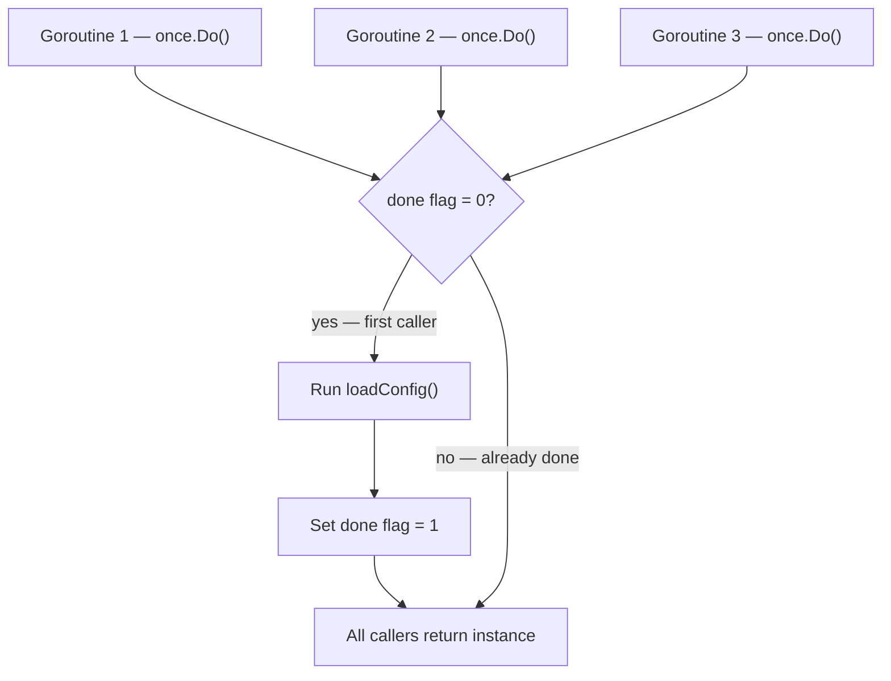
```mermaid
flowchart TD
    G1["Goroutine 1 — once.Do()"] --> L{"done flag = 0?"}
    G2["Goroutine 2 — once.Do()"] --> L
    G3["Goroutine 3 — once.Do()"] --> L
    L -->|"yes — first caller"| R["Run loadConfig()"]
    R --> S["Set done flag = 1"]
    S --> E["All callers return instance"]
    L -->|"no — already done"| E
```

### Interviewer Questions
1. What is the difference between `sync.Once` and a package-level `init()` function?
2. What happens if the function passed to `once.Do` panics?
3. Can you reset a `sync.Once` to run the function again?
4. How does `sync.Once` avoid the double-checked locking problem?
5. What is the `OnceValue` / `OnceFunc` addition in Go 1.21?
6. Why is copying a `sync.Once` by value dangerous?
7. How would you test that initialization ran exactly once?

### Follow-Up Questions
- **Q1:** How would you propagate an initialization error from `once.Do`?
- **Q2:** Implement a lazy singleton that can be reset (e.g., for tests).
- **Q3:** How does `sync.Once` compare to `init()` for dependency injection?
- **Q4:** Use `sync.OnceValue` (Go 1.21) to return the config and an error atomically.
- **Q5:** How would you mock `GetConfig()` in unit tests without global state?

---

---
## Q4: RWMutex — Read-Heavy Cache  [Level 2 — Easy]
> **Tags:** `#rwmutex` `#cache` `#read-write-lock` `#performance`

### Problem Statement
Build an in-memory key-value cache where reads are far more frequent than writes. Using a plain `sync.Mutex` would serialize all reads unnecessarily. Use `sync.RWMutex` so multiple goroutines can read concurrently while writes remain exclusive.

### Input / Output / Constraints
- **Input:** Concurrent `Get(key)` and `Set(key, value)` calls
- **Output:** Correct values; reads never block each other; writes are exclusive
- **Constraints:** Use `sync.RWMutex`; do not use `sync.Map`

### Thought Process
`sync.RWMutex` distinguishes readers from writers:
- `RLock()` / `RUnlock()` — shared; multiple goroutines hold simultaneously.
- `Lock()` / `Unlock()` — exclusive; blocks all readers and other writers.

For a read-heavy workload (e.g., 95% reads), this dramatically reduces contention compared to a plain mutex.

### Brute Force
```go
// Plain mutex — correct but serializes reads
type Cache struct {
    mu    sync.Mutex
    store map[string]string
}
func (c *Cache) Get(k string) (string, bool) {
    c.mu.Lock(); defer c.mu.Unlock()
    v, ok := c.store[k]; return v, ok
}
```
**Time:** O(1) per op | **Space:** O(N)

### Better Solution
```go
type Cache struct {
    mu    sync.RWMutex
    store map[string]string
}

func (c *Cache) Get(k string) (string, bool) {
    c.mu.RLock()
    defer c.mu.RUnlock()
    v, ok := c.store[k]
    return v, ok
}

func (c *Cache) Set(k, v string) {
    c.mu.Lock()
    defer c.mu.Unlock()
    c.store[k] = v
}
```

### Best Solution
```go
package main

import (
	"fmt"
	"sync"
	"time"
)

type Cache struct {
	mu    sync.RWMutex
	store map[string]string
}

func NewCache() *Cache {
	return &Cache{store: make(map[string]string)}
}

func (c *Cache) Get(key string) (string, bool) {
	c.mu.RLock()
	defer c.mu.RUnlock()
	val, ok := c.store[key]
	return val, ok
}

func (c *Cache) Set(key, value string) {
	c.mu.Lock()
	defer c.mu.Unlock()
	c.store[key] = value
}

func (c *Cache) Delete(key string) {
	c.mu.Lock()
	defer c.mu.Unlock()
	delete(c.store, key)
}

func (c *Cache) Len() int {
	c.mu.RLock()
	defer c.mu.RUnlock()
	return len(c.store)
}

func main() {
	cache := NewCache()
	cache.Set("host", "localhost")
	cache.Set("port", "8080")

	var wg sync.WaitGroup
	start := time.Now()

	// Simulate 20 concurrent readers
	for i := 0; i < 20; i++ {
		wg.Add(1)
		go func(id int) {
			defer wg.Done()
			if val, ok := cache.Get("host"); ok {
				_ = val
			}
		}(i)
	}

	// Simulate 2 concurrent writers
	for i := 0; i < 2; i++ {
		wg.Add(1)
		go func(id int) {
			defer wg.Done()
			cache.Set(fmt.Sprintf("key%d", id), fmt.Sprintf("val%d", id))
		}(i)
	}

	wg.Wait()
	fmt.Printf("Cache size: %d | elapsed: %v\n", cache.Len(), time.Since(start))
}
```
**Time:** O(1) per op | **Space:** O(N keys)

### Production Considerations
| Aspect | Details |
|--------|---------|
| Scalability | RWMutex shines at high read:write ratios (>10:1); under write-heavy load it can be slower than Mutex due to coordination overhead |
| Edge Cases | Writer starvation can occur if readers never release; Go's implementation is writer-preferring to mitigate this |
| Error Handling | Map lookup returns zero value if key absent; always check the bool second return |
| Memory | RWMutex is 24 bytes; map has pointer semantics — never return internal map reference |
| Concurrency | Never upgrade RLock to Lock without releasing first — deadlock guaranteed |

### Visual Explanation
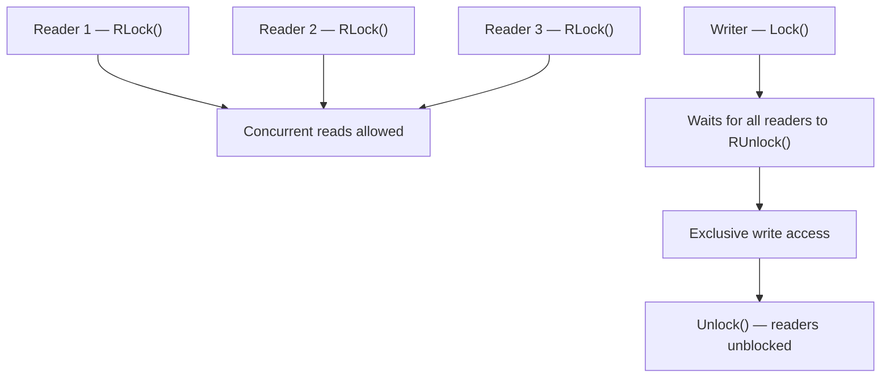
```mermaid
flowchart TD
    R1["Reader 1 — RLock()"] --> OK["Concurrent reads allowed"]
    R2["Reader 2 — RLock()"] --> OK
    R3["Reader 3 — RLock()"] --> OK
    W["Writer — Lock()"] --> WAIT["Waits for all readers to RUnlock()"]
    WAIT --> EXCL["Exclusive write access"]
    EXCL --> REL["Unlock() — readers unblocked"]
```

### Interviewer Questions
1. When is `sync.RWMutex` faster than `sync.Mutex`, and when is it slower?
2. What is writer starvation and how does Go's RWMutex handle it?
3. Can you upgrade an `RLock` to a full `Lock` without releasing first?
4. How does `sync.Map` differ from a manual RWMutex cache?
5. What would happen if you call `RLock` twice in the same goroutine without unlocking?
6. How would you add TTL (expiry) to this cache?
7. What is the difference between a read lock and an optimistic read?

### Follow-Up Questions
- **Q1:** Add a TTL so entries expire after a configurable duration.
- **Q2:** Implement `GetOrSet(key, computeFn)` that only computes if key is absent.
- **Q3:** Shard the cache into N buckets to reduce lock contention further.
- **Q4:** Compare this implementation to `sync.Map` in a benchmark test.
- **Q5:** How would you persist this cache to disk safely?

---

---
## Q5: Mutex-Protected Bank Account  [Level 2 — Easy]
> **Tags:** `#mutex` `#bank` `#deposit-withdraw` `#concurrency`

### Problem Statement
Implement a `BankAccount` with `Deposit(amount)`, `Withdraw(amount) error`, and `Balance() float64` methods. Multiple goroutines deposit and withdraw concurrently. Ensure no balance goes negative and the final balance is always consistent.

### Input / Output / Constraints
- **Input:** Concurrent deposits and withdrawals with various amounts
- **Output:** Consistent balance; withdrawals return error if insufficient funds
- **Constraints:** Use `sync.Mutex`; no negative balance allowed

### Thought Process
The critical invariant is: balance must never go negative and must reflect every completed operation. Both the read of the current balance and the modification must happen inside the same lock to prevent TOCTOU (time-of-check/time-of-use) races.

### Brute Force
```go
// Separate check and update — TOCTOU race
func (a *Account) Withdraw(amount float64) error {
    if a.balance < amount { return errors.New("insufficient") } // race here
    a.balance -= amount                                          // and here
    return nil
}
```
**Time:** O(1) | **Space:** O(1)

### Better Solution
```go
func (a *Account) Withdraw(amount float64) error {
    a.mu.Lock()
    defer a.mu.Unlock()
    if a.balance < amount {
        return fmt.Errorf("insufficient funds: have %.2f, need %.2f", a.balance, amount)
    }
    a.balance -= amount
    return nil
}
```

### Best Solution
```go
package main

import (
	"errors"
	"fmt"
	"sync"
)

type BankAccount struct {
	mu      sync.Mutex
	balance float64
	id      string
}

func NewAccount(id string, initial float64) *BankAccount {
	return &BankAccount{id: id, balance: initial}
}

func (a *BankAccount) Deposit(amount float64) error {
	if amount <= 0 {
		return errors.New("deposit amount must be positive")
	}
	a.mu.Lock()
	defer a.mu.Unlock()
	a.balance += amount
	return nil
}

func (a *BankAccount) Withdraw(amount float64) error {
	if amount <= 0 {
		return errors.New("withdrawal amount must be positive")
	}
	a.mu.Lock()
	defer a.mu.Unlock()
	if a.balance < amount {
		return fmt.Errorf("insufficient funds: balance=%.2f, requested=%.2f", a.balance, amount)
	}
	a.balance -= amount
	return nil
}

func (a *BankAccount) Balance() float64 {
	a.mu.Lock()
	defer a.mu.Unlock()
	return a.balance
}

func main() {
	acc := NewAccount("ACC-001", 1000.0)
	var wg sync.WaitGroup

	// 10 deposits of 100
	for i := 0; i < 10; i++ {
		wg.Add(1)
		go func() {
			defer wg.Done()
			_ = acc.Deposit(100)
		}()
	}

	// 5 withdrawals of 150
	for i := 0; i < 5; i++ {
		wg.Add(1)
		go func(id int) {
			defer wg.Done()
			if err := acc.Withdraw(150); err != nil {
				fmt.Printf("Withdrawal %d failed: %v\n", id, err)
			}
		}(i)
	}

	wg.Wait()
	fmt.Printf("Final balance: %.2f\n", acc.Balance())
	// Expected: 1000 + 10*100 - successful*150 >= 0
}
```
**Time:** O(1) per op | **Space:** O(1)

### Production Considerations
| Aspect | Details |
|--------|---------|
| Scalability | Single mutex limits throughput; for high-volume accounts consider per-account locks in a sharded map |
| Edge Cases | Validate amount > 0 before acquiring the lock to avoid lock overhead on invalid input |
| Error Handling | Return typed errors (sentinel or wrapped) so callers can distinguish insufficient-funds from other failures |
| Memory | Use `int64` cents instead of `float64` to avoid floating-point rounding errors in financial code |
| Concurrency | TOCTOU: check and modify balance inside the same lock hold — never release and re-acquire between them |

### Visual Explanation
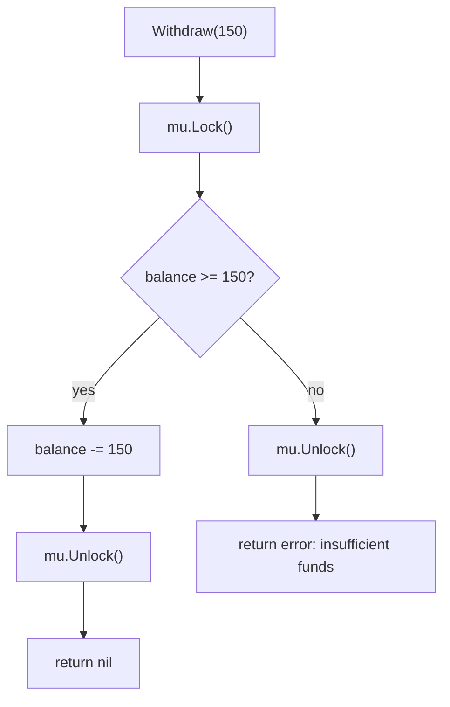
```mermaid
flowchart TD
    A["Withdraw(150)"] --> L["mu.Lock()"]
    L --> C{"balance >= 150?"}
    C -->|"yes"| D["balance -= 150"]
    D --> U["mu.Unlock()"]
    U --> R["return nil"]
    C -->|"no"| E["mu.Unlock()"]
    E --> ERR["return error: insufficient funds"]
```

### Interviewer Questions
1. What is TOCTOU and why does it require holding the lock across both check and update?
2. Why should you use `int64` (cents) instead of `float64` for money?
3. How would you implement a transfer between two accounts without deadlock?
4. What is an optimistic locking strategy and when would you use it here?
5. How would you add an audit log of all transactions safely?
6. What test would you write to verify no balance goes negative under concurrency?
7. How would you extend this to support multi-currency accounts?

### Follow-Up Questions
- **Q1:** Implement `Transfer(to *BankAccount, amount float64) error` — handle deadlock risk.
- **Q2:** Add a transaction history (slice of events) protected by the same mutex.
- **Q3:** Rewrite using `sync/atomic` with `int64` cents — what are the limitations?
- **Q4:** How would you make the account persistent (write-ahead log)?
- **Q5:** Implement a test using `go test -race` to catch the TOCTOU bug in the brute-force version.

---

---
## Q6: sync.Pool for Byte Buffer Reuse  [Level 2 — Easy]
> **Tags:** `#pool` `#memory` `#buffer` `#gc-pressure`

### Problem Statement
You have a hot path that allocates a `[]byte` buffer for every request. Under high concurrency this causes GC pressure. Use `sync.Pool` to reuse buffers across goroutines and reduce allocations.

### Input / Output / Constraints
- **Input:** High-frequency function calls each needing a temporary buffer
- **Output:** Same functional behavior; reduced allocations per benchmark
- **Constraints:** Use `sync.Pool`; always reset/clear buffer before returning to pool

### Thought Process
`sync.Pool` is a free list that is GC-aware: objects in the pool may be collected between GC cycles, so you must never store permanent state in them. The pattern is:
1. `Get()` retrieves an object (or calls `New` if the pool is empty).
2. Use the object.
3. Reset it to a clean state.
4. `Put()` it back.

The pool is most effective when `New` allocations are expensive relative to the `Get`/`Put` overhead.

### Brute Force
```go
// New allocation every call — GC pressure at high QPS
func processRequest(data []byte) []byte {
    buf := make([]byte, 0, 4096)
    buf = append(buf, data...)
    return buf
}
```
**Time:** O(N) | **Space:** O(N) per call

### Better Solution
```go
var bufPool = sync.Pool{
    New: func() interface{} { return make([]byte, 0, 4096) },
}

func processRequest(data []byte) {
    buf := bufPool.Get().([]byte)
    buf = append(buf[:0], data...)
    // use buf ...
    bufPool.Put(buf[:0])
}
```

### Best Solution
```go
package main

import (
	"bytes"
	"fmt"
	"sync"
)

var bufPool = sync.Pool{
	New: func() any {
		return new(bytes.Buffer)
	},
}

func processRequest(id int, payload string) string {
	buf := bufPool.Get().(*bytes.Buffer)
	buf.Reset() // always reset before use
	defer func() {
		buf.Reset()
		bufPool.Put(buf)
	}()

	fmt.Fprintf(buf, "Request-%d: %s", id, payload)
	return buf.String()
}

func main() {
	const concurrency = 50
	var wg sync.WaitGroup
	results := make([]string, concurrency)

	for i := 0; i < concurrency; i++ {
		wg.Add(1)
		go func(id int) {
			defer wg.Done()
			results[id] = processRequest(id, "hello-world")
		}(i)
	}

	wg.Wait()
	fmt.Printf("Sample result: %s\n", results[0])
	fmt.Println("All requests processed with pooled buffers.")
}
```
**Time:** O(N) per request | **Space:** O(P) where P = peak concurrency

### Production Considerations
| Aspect | Details |
|--------|---------|
| Scalability | Pool reduces alloc rate proportional to hit rate; most effective when objects are expensive to create |
| Edge Cases | GC can drain the pool between cycles — code must tolerate `New` being called; never store mandatory state in pool objects |
| Error Handling | Always `Reset()` before putting back to avoid data leaks between requests |
| Memory | Pool objects are not collected individually; a full GC sweep clears the pool |
| Concurrency | Pool is goroutine-safe; internally uses per-P (processor) local caches to minimize contention |

### Visual Explanation
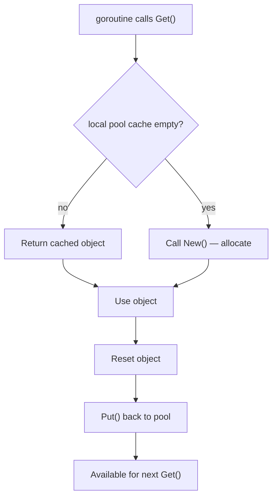
```mermaid
flowchart TD
    A["goroutine calls Get()"] --> B{"local pool cache empty?"}
    B -->|"no"| C["Return cached object"]
    B -->|"yes"| D["Call New() — allocate"]
    C & D --> E["Use object"]
    E --> F["Reset object"]
    F --> G["Put() back to pool"]
    G --> H["Available for next Get()"]
```

### Interviewer Questions
1. What happens to objects in a `sync.Pool` when the GC runs?
2. Why must you reset a buffer before putting it back into the pool?
3. What is the difference between `sync.Pool` and a channel-based free list?
4. When is `sync.Pool` NOT a good fit (e.g., connection pools)?
5. How does Go's per-P pool cache reduce contention?
6. What benchmark metric would you check to confirm the pool is working?
7. Can you store a pointer to a pooled object after calling `Put`?

### Follow-Up Questions
- **Q1:** Write a benchmark (`BenchmarkWithPool` vs `BenchmarkWithoutPool`) to measure alloc reduction.
- **Q2:** Why is `sync.Pool` inappropriate for database connections?
- **Q3:** Implement a fixed-size pool using a buffered channel.
- **Q4:** How does `bytes.Buffer` compare to `[]byte` as a pool object?
- **Q5:** How would you warm up a pool before serving traffic?

---

---
## Q7: sync.Map for Concurrent Key-Value Store  [Level 2 — Easy]
> **Tags:** `#syncmap` `#concurrent-map` `#store` `#go-sync`

### Problem Statement
Implement a concurrent key-value store using `sync.Map`. Support `Store`, `Load`, `Delete`, and `Range` (iterate all entries). Explain when `sync.Map` outperforms a manual `RWMutex` map.

### Input / Output / Constraints
- **Input:** Concurrent stores, loads, and deletes
- **Output:** Correct values; no data races
- **Constraints:** Use `sync.Map`; demonstrate `Range` for iteration

### Thought Process
`sync.Map` is optimized for two specific patterns:
1. Write-once, read-many: an entry is written once and read many times (e.g., caches, registries).
2. Disjoint keys: goroutines mostly read/write different keys with little overlap.

For general-purpose maps with balanced reads/writes and overlapping keys, a manual `RWMutex` map is often faster due to lower per-operation overhead.

### Brute Force
```go
// Manual map + mutex (correct but may be slower for the sync.Map sweet spot)
type Store struct {
    mu sync.RWMutex
    m  map[string]any
}
```
**Time:** O(1) avg | **Space:** O(N)

### Better Solution
```go
var store sync.Map

store.Store("key", "value")
if val, ok := store.Load("key"); ok {
    fmt.Println(val.(string))
}
store.Delete("key")
store.Range(func(k, v any) bool {
    fmt.Println(k, v)
    return true // continue iteration
})
```

### Best Solution
```go
package main

import (
	"fmt"
	"sync"
)

type KVStore struct {
	m sync.Map
}

func (s *KVStore) Set(key, value string) {
	s.m.Store(key, value)
}

func (s *KVStore) Get(key string) (string, bool) {
	val, ok := s.m.Load(key)
	if !ok {
		return "", false
	}
	return val.(string), true
}

func (s *KVStore) Delete(key string) {
	s.m.Delete(key)
}

func (s *KVStore) GetOrSet(key, defaultVal string) string {
	actual, _ := s.m.LoadOrStore(key, defaultVal)
	return actual.(string)
}

func (s *KVStore) All() map[string]string {
	result := make(map[string]string)
	s.m.Range(func(k, v any) bool {
		result[k.(string)] = v.(string)
		return true
	})
	return result
}

func main() {
	store := &KVStore{}
	var wg sync.WaitGroup

	keys := []string{"alpha", "beta", "gamma", "delta", "epsilon"}

	// Concurrent writes
	for i, k := range keys {
		wg.Add(1)
		go func(key, val string) {
			defer wg.Done()
			store.Set(key, val)
		}(k, fmt.Sprintf("value-%d", i))
	}
	wg.Wait()

	// Concurrent reads
	for _, k := range keys {
		wg.Add(1)
		go func(key string) {
			defer wg.Done()
			if val, ok := store.Get(key); ok {
				fmt.Printf("  %s = %s\n", key, val)
			}
		}(k)
	}
	wg.Wait()

	fmt.Println("\nAll entries:")
	for k, v := range store.All() {
		fmt.Printf("  %s: %s\n", k, v)
	}
}
```
**Time:** O(1) amortized per op | **Space:** O(N)

### Production Considerations
| Aspect | Details |
|--------|---------|
| Scalability | `sync.Map` maintains two internal maps (read-only and dirty); promotes dirty map to read on first miss after writes, incurring a copy |
| Edge Cases | `Range` does not have a consistent snapshot; entries added/deleted during iteration may or may not appear |
| Error Handling | `Load` returns `any`; always type-assert safely (two-value form) to avoid panic |
| Memory | Higher memory than plain map due to internal double-map structure |
| Concurrency | `LoadOrStore` is atomic — use it to implement safe "set-if-absent" patterns |

### Visual Explanation
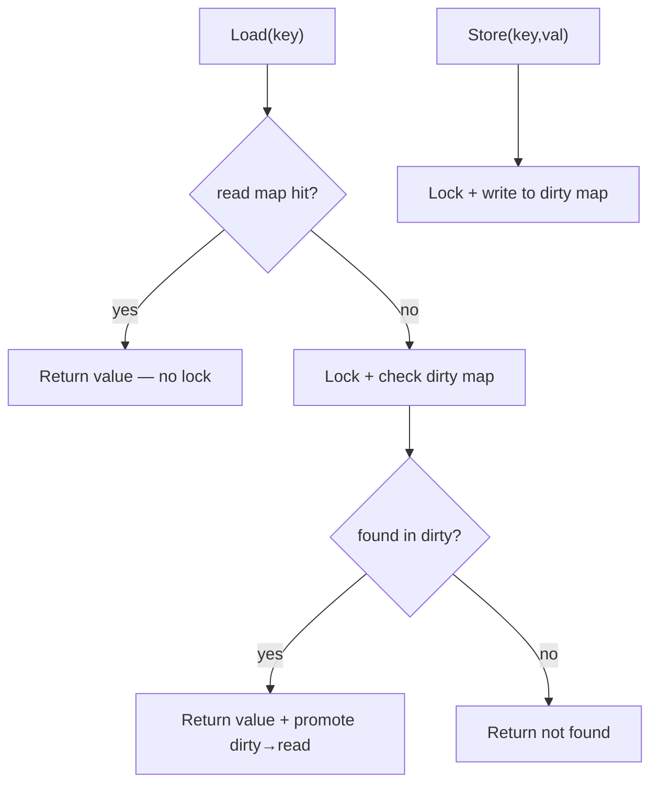
```mermaid
flowchart TD
    A["Load(key)"] --> B{"read map hit?"}
    B -->|"yes"| C["Return value — no lock"]
    B -->|"no"| D["Lock + check dirty map"]
    D --> E{"found in dirty?"}
    E -->|"yes"| F["Return value + promote dirty→read"]
    E -->|"no"| G["Return not found"]
    H["Store(key,val)"] --> I["Lock + write to dirty map"]
```

### Interviewer Questions
1. What are the two internal maps inside `sync.Map` and what is each used for?
2. When does `sync.Map` outperform `map + RWMutex`, and when does it underperform?
3. What does `LoadOrStore` do and why is it useful?
4. Is `Range` over `sync.Map` a consistent snapshot?
5. What type assertion pitfalls exist with `sync.Map`?
6. How does `sync.Map` avoid a global lock for reads?
7. Why should you not use `sync.Map` as a general-purpose replacement for all maps?

### Follow-Up Questions
- **Q1:** Benchmark `sync.Map` vs `map+RWMutex` for read-heavy and write-heavy workloads.
- **Q2:** Implement a TTL cache using `sync.Map` with a background expiry goroutine.
- **Q3:** How would you shard a plain map to achieve similar read scalability?
- **Q4:** Use `LoadOrStore` to implement a de-duplicating request coalescer.
- **Q5:** What are the memory implications of a `sync.Map` that only ever stores and never deletes?

---

---
## Q8: sync.Cond — Producer Notifies Consumer  [Level 3 — Medium]
> **Tags:** `#cond` `#producer-consumer` `#signal` `#broadcast`

### Problem Statement
Implement a producer-consumer pattern using `sync.Cond`. One producer goroutine generates items and places them in a shared queue. One or more consumer goroutines wait until an item is available, then process it. Use `cond.Wait()`, `cond.Signal()`, and `cond.Broadcast()` appropriately.

### Input / Output / Constraints
- **Input:** Producer generates N items; M consumer goroutines process them
- **Output:** Every item consumed exactly once; consumers sleep (not spin) when queue is empty
- **Constraints:** Use `sync.Cond`; no channels; implement clean shutdown

### Thought Process
`sync.Cond` is a condition variable: a goroutine waits on a condition (queue not empty) and another signals when the condition becomes true. Critical rules:
1. The condition must be checked in a loop (`for !condition { cond.Wait() }`) because spurious wakeups are possible and multiple waiters may compete.
2. `Wait()` atomically releases the associated mutex and suspends; it re-acquires the mutex before returning.
3. `Signal()` wakes one waiter; `Broadcast()` wakes all.

### Brute Force
```go
// Spin-wait — wastes CPU
for len(queue) == 0 {
    // busy wait
}
item := queue[0]
queue = queue[1:]
```
**Time:** O(N) | **Space:** O(N)

### Better Solution
```go
mu := sync.Mutex{}
cond := sync.NewCond(&mu)
queue := []int{}

// Consumer
mu.Lock()
for len(queue) == 0 {
    cond.Wait()  // releases mu, sleeps, re-acquires mu on wake
}
item := queue[0]; queue = queue[1:]
mu.Unlock()

// Producer
mu.Lock()
queue = append(queue, item)
cond.Signal()
mu.Unlock()
```

### Best Solution
```go
package main

import (
	"fmt"
	"sync"
	"time"
)

type BoundedQueue struct {
	mu     sync.Mutex
	cond   *sync.Cond
	items  []int
	closed bool
}

func NewBoundedQueue() *BoundedQueue {
	q := &BoundedQueue{}
	q.cond = sync.NewCond(&q.mu)
	return q
}

func (q *BoundedQueue) Push(item int) {
	q.mu.Lock()
	defer q.mu.Unlock()
	q.items = append(q.items, item)
	q.cond.Signal() // wake one sleeping consumer
}

func (q *BoundedQueue) Close() {
	q.mu.Lock()
	defer q.mu.Unlock()
	q.closed = true
	q.cond.Broadcast() // wake all consumers so they can exit
}

// Pop blocks until an item is available or the queue is closed.
// Returns (item, true) or (0, false) when closed and empty.
func (q *BoundedQueue) Pop() (int, bool) {
	q.mu.Lock()
	defer q.mu.Unlock()
	for len(q.items) == 0 && !q.closed {
		q.cond.Wait()
	}
	if len(q.items) == 0 {
		return 0, false // closed and empty
	}
	item := q.items[0]
	q.items = q.items[1:]
	return item, true
}

func main() {
	q := NewBoundedQueue()
	const numItems = 10
	const numConsumers = 3

	var wg sync.WaitGroup

	// Start consumers
	for c := 0; c < numConsumers; c++ {
		wg.Add(1)
		go func(id int) {
			defer wg.Done()
			for {
				item, ok := q.Pop()
				if !ok {
					fmt.Printf("Consumer %d: queue closed, exiting\n", id)
					return
				}
				fmt.Printf("Consumer %d: processed item %d\n", id, item)
			}
		}(c)
	}

	// Producer
	for i := 1; i <= numItems; i++ {
		time.Sleep(10 * time.Millisecond)
		q.Push(i)
	}
	q.Close()

	wg.Wait()
	fmt.Println("All items processed.")
}
```
**Time:** O(N) | **Space:** O(Q) queue capacity

### Production Considerations
| Aspect | Details |
|--------|---------|
| Scalability | `Signal` wakes one consumer (O(1)); `Broadcast` wakes all (O(M)) — use Signal for single-item notifications |
| Edge Cases | Always check condition in a `for` loop, never `if` — guards against spurious wakeups and multiple consumers racing |
| Error Handling | Implement closed/drained state to avoid goroutines waiting forever after producer exits |
| Memory | Queue grows unbounded; add capacity limit and a `cond.Broadcast` when space is available for a full bounded queue |
| Concurrency | `cond.Wait()` must be called with the mutex held; it atomically releases and re-acquires |

### Visual Explanation
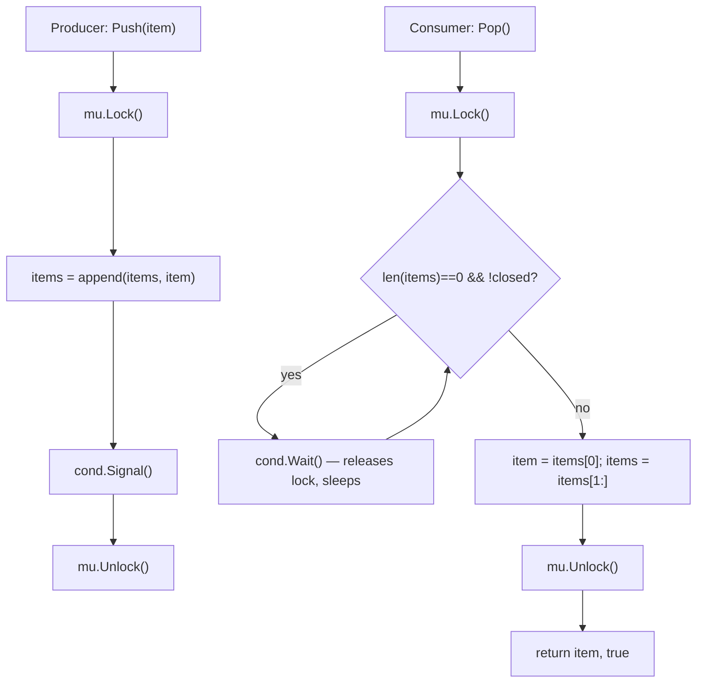
```mermaid
flowchart TD
    P["Producer: Push(item)"] --> ML["mu.Lock()"]
    ML --> APP["items = append(items, item)"]
    APP --> SIG["cond.Signal()"]
    SIG --> MUL["mu.Unlock()"]

    C["Consumer: Pop()"] --> CL["mu.Lock()"]
    CL --> CHK{"len(items)==0 && !closed?"}
    CHK -->|"yes"| W["cond.Wait() — releases lock, sleeps"]
    W --> CHK
    CHK -->|"no"| TAKE["item = items[0]; items = items[1:]"]
    TAKE --> CUL["mu.Unlock()"]
    CUL --> RET["return item, true"]
```

### Interviewer Questions
1. Why must the condition be checked in a `for` loop rather than an `if` statement?
2. What does `cond.Wait()` do atomically with respect to the mutex?
3. When would you use `Broadcast` instead of `Signal`?
4. What is a spurious wakeup?
5. How would you add a capacity bound to prevent the producer from outpacing consumers?
6. How is `sync.Cond` different from using a channel for the same producer-consumer pattern?
7. What happens if you call `cond.Wait()` without holding the associated mutex?

### Follow-Up Questions
- **Q1:** Add a capacity limit so the producer blocks when the queue is full.
- **Q2:** Rewrite this using a buffered channel — compare readability and performance.
- **Q3:** Support multiple producers and multiple consumers safely.
- **Q4:** Add a timeout to `Pop` so consumers don't wait indefinitely.
- **Q5:** How would you implement a priority queue on top of this pattern?

---

---
## Q9: Concurrent-Safe Queue Using Mutex  [Level 3 — Medium]
> **Tags:** `#queue` `#mutex` `#data-structure` `#fifo`

### Problem Statement
Implement a generic, goroutine-safe FIFO queue supporting `Enqueue(item)`, `Dequeue() (item, ok)`, `Peek() (item, ok)`, `Size() int`, and `IsEmpty() bool`. Multiple goroutines enqueue and dequeue concurrently.

### Input / Output / Constraints
- **Input:** Concurrent enqueue and dequeue operations
- **Output:** FIFO order maintained; `Dequeue` returns `false` when empty
- **Constraints:** Use `sync.Mutex`; use generics (Go 1.18+)

### Thought Process
A slice-based queue is simple but Dequeue (`q[0]; q = q[1:]`) is O(N) due to shifting. A circular buffer or linked list gives O(1). For practice we use a slice but note the production concern. The mutex protects all slice mutations.

### Brute Force
```go
// Non-generic, no concurrency safety
type Queue struct{ items []interface{} }
func (q *Queue) Enqueue(v interface{}) { q.items = append(q.items, v) }
func (q *Queue) Dequeue() interface{} {
    if len(q.items) == 0 { return nil }
    v := q.items[0]; q.items = q.items[1:]; return v
}
```
**Time:** Enqueue O(1) amortized, Dequeue O(N) | **Space:** O(N)

### Better Solution
```go
type Queue[T any] struct {
    mu    sync.Mutex
    items []T
}
func (q *Queue[T]) Enqueue(v T) {
    q.mu.Lock(); defer q.mu.Unlock()
    q.items = append(q.items, v)
}
func (q *Queue[T]) Dequeue() (T, bool) {
    q.mu.Lock(); defer q.mu.Unlock()
    var zero T
    if len(q.items) == 0 { return zero, false }
    v := q.items[0]; q.items = q.items[1:]; return v, true
}
```

### Best Solution
```go
package main

import (
	"fmt"
	"sync"
)

type Queue[T any] struct {
	mu    sync.Mutex
	items []T
}

func (q *Queue[T]) Enqueue(item T) {
	q.mu.Lock()
	defer q.mu.Unlock()
	q.items = append(q.items, item)
}

func (q *Queue[T]) Dequeue() (T, bool) {
	q.mu.Lock()
	defer q.mu.Unlock()
	var zero T
	if len(q.items) == 0 {
		return zero, false
	}
	item := q.items[0]
	q.items = q.items[1:]
	return item, true
}

func (q *Queue[T]) Peek() (T, bool) {
	q.mu.Lock()
	defer q.mu.Unlock()
	var zero T
	if len(q.items) == 0 {
		return zero, false
	}
	return q.items[0], true
}

func (q *Queue[T]) Size() int {
	q.mu.Lock()
	defer q.mu.Unlock()
	return len(q.items)
}

func (q *Queue[T]) IsEmpty() bool {
	q.mu.Lock()
	defer q.mu.Unlock()
	return len(q.items) == 0
}

func main() {
	q := &Queue[int]{}
	var wg sync.WaitGroup

	// 5 producers
	for i := 0; i < 5; i++ {
		wg.Add(1)
		go func(start int) {
			defer wg.Done()
			for j := 0; j < 4; j++ {
				q.Enqueue(start*10 + j)
			}
		}(i)
	}
	wg.Wait()
	fmt.Printf("Queue size after enqueue: %d\n", q.Size())

	// 3 consumers
	for c := 0; c < 3; c++ {
		wg.Add(1)
		go func(id int) {
			defer wg.Done()
			for {
				item, ok := q.Dequeue()
				if !ok {
					return
				}
				fmt.Printf("Consumer %d dequeued: %d\n", id, item)
			}
		}(c)
	}
	wg.Wait()
	fmt.Printf("Queue empty: %v\n", q.IsEmpty())
}
```
**Time:** Enqueue O(1) amortized, Dequeue O(N) | **Space:** O(N)

### Production Considerations
| Aspect | Details |
|--------|---------|
| Scalability | Slice Dequeue is O(N) due to copy; use a linked list or circular buffer for O(1) |
| Edge Cases | Return zero value and `false` for empty dequeue — never panic |
| Error Handling | Consider blocking `Dequeue` (with `sync.Cond`) so consumers don't busy-poll |
| Memory | Slice head elements stay in memory until GC; set `q.items[0] = zero` before slicing to help GC |
| Concurrency | All five methods must lock, including `Size` and `IsEmpty`, to avoid torn reads |

### Visual Explanation
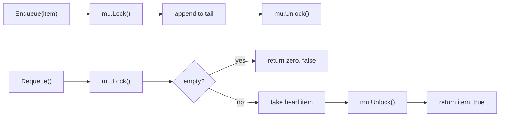
```mermaid
flowchart LR
    E["Enqueue(item)"] --> LOCK["mu.Lock()"]
    LOCK --> APP["append to tail"]
    APP --> UNL["mu.Unlock()"]

    D["Dequeue()"] --> LOCK2["mu.Lock()"]
    LOCK2 --> CHK{"empty?"}
    CHK -->|"yes"| Z["return zero, false"]
    CHK -->|"no"| POP["take head item"]
    POP --> UNL2["mu.Unlock()"]
    UNL2 --> RET["return item, true"]
```

### Interviewer Questions
1. Why is `Dequeue` on a slice O(N)? How would you make it O(1)?
2. What is a circular buffer and how does it improve queue performance?
3. Why must `Size()` and `IsEmpty()` also hold the lock?
4. How would you make `Dequeue` blocking instead of returning `false` when empty?
5. What are the trade-offs between a mutex-based queue and a lock-free queue?
6. How do Go generics help here compared to `interface{}`?
7. What is ABA problem in lock-free queues?

### Follow-Up Questions
- **Q1:** Rewrite Dequeue as O(1) using a doubly-linked list.
- **Q2:** Add a `DequeueAll() []T` method that drains the queue atomically.
- **Q3:** Implement a blocking `DequeueWait()` using `sync.Cond`.
- **Q4:** Write a benchmark comparing slice-based vs linked-list-based queue.
- **Q5:** How would you implement a lock-free queue using `sync/atomic`?

---

---
## Q10: RW-Locked Map Implementation from Scratch  [Level 3 — Medium]
> **Tags:** `#rwmutex` `#map` `#generic` `#data-structure`

### Problem Statement
Build a generic `RWMap[K comparable, V any]` that wraps a plain Go map with a `sync.RWMutex`. Implement `Get`, `Set`, `Delete`, `Has`, `Keys`, and `Snapshot` (returns a copy). This is a foundational building block for caches, registries, and routers.

### Input / Output / Constraints
- **Input:** Concurrent reads and writes with arbitrary key/value types
- **Output:** Correct values, no data races
- **Constraints:** Use Go generics; `Snapshot` must return a full copy, not a reference

### Thought Process
Wrapping a plain map in a struct with an `RWMutex` gives us fine-grained control — unlike `sync.Map`, we can add methods, type-safety, and consistent snapshots. The key insight: any operation that reads the map uses `RLock`; any operation that modifies it uses `Lock`.

### Brute Force
```go
// Non-generic version
type SafeMap struct {
    mu sync.RWMutex
    m  map[string]interface{}
}
```
**Time:** O(1) per op | **Space:** O(N)

### Better Solution
```go
type RWMap[K comparable, V any] struct {
    mu sync.RWMutex
    m  map[K]V
}
func NewRWMap[K comparable, V any]() *RWMap[K, V] {
    return &RWMap[K, V]{m: make(map[K]V)}
}
```

### Best Solution
```go
package main

import (
	"fmt"
	"sync"
)

type RWMap[K comparable, V any] struct {
	mu sync.RWMutex
	m  map[K]V
}

func NewRWMap[K comparable, V any]() *RWMap[K, V] {
	return &RWMap[K, V]{m: make(map[K]V)}
}

func (r *RWMap[K, V]) Set(key K, val V) {
	r.mu.Lock()
	defer r.mu.Unlock()
	r.m[key] = val
}

func (r *RWMap[K, V]) Get(key K) (V, bool) {
	r.mu.RLock()
	defer r.mu.RUnlock()
	v, ok := r.m[key]
	return v, ok
}

func (r *RWMap[K, V]) Delete(key K) {
	r.mu.Lock()
	defer r.mu.Unlock()
	delete(r.m, key)
}

func (r *RWMap[K, V]) Has(key K) bool {
	r.mu.RLock()
	defer r.mu.RUnlock()
	_, ok := r.m[key]
	return ok
}

func (r *RWMap[K, V]) Keys() []K {
	r.mu.RLock()
	defer r.mu.RUnlock()
	keys := make([]K, 0, len(r.m))
	for k := range r.m {
		keys = append(keys, k)
	}
	return keys
}

func (r *RWMap[K, V]) Snapshot() map[K]V {
	r.mu.RLock()
	defer r.mu.RUnlock()
	copy := make(map[K]V, len(r.m))
	for k, v := range r.m {
		copy[k] = v
	}
	return copy
}

func (r *RWMap[K, V]) Len() int {
	r.mu.RLock()
	defer r.mu.RUnlock()
	return len(r.m)
}

func main() {
	rm := NewRWMap[string, int]()
	var wg sync.WaitGroup

	// Writers
	for i := 0; i < 5; i++ {
		wg.Add(1)
		go func(n int) {
			defer wg.Done()
			rm.Set(fmt.Sprintf("key%d", n), n*n)
		}(i)
	}

	// Readers
	for i := 0; i < 10; i++ {
		wg.Add(1)
		go func(n int) {
			defer wg.Done()
			key := fmt.Sprintf("key%d", n%5)
			if v, ok := rm.Get(key); ok {
				_ = v
			}
		}(i)
	}

	wg.Wait()
	fmt.Println("Snapshot:", rm.Snapshot())
	fmt.Println("Keys:", rm.Keys())
	fmt.Println("Len:", rm.Len())
}
```
**Time:** O(1) per op, O(N) for Snapshot | **Space:** O(N)

### Production Considerations
| Aspect | Details |
|--------|---------|
| Scalability | Single RWMutex is a bottleneck under high write concurrency; shard into N maps to scale |
| Edge Cases | `Snapshot` is consistent only at the instant of the lock; values may change after the snapshot is returned |
| Error Handling | Return typed zero-value + bool; never panic on missing key |
| Memory | `Snapshot` allocates a new map — call sparingly in hot paths |
| Concurrency | `Keys` and `Snapshot` use RLock — safe for concurrent reads but may see stale data written before the lock |

### Visual Explanation
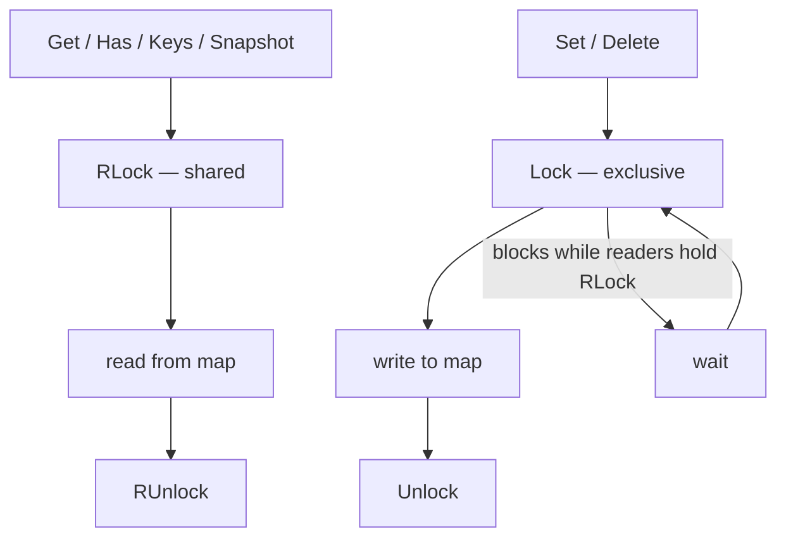
```mermaid
flowchart TD
    R["Get / Has / Keys / Snapshot"] --> RL["RLock — shared"]
    RL --> READ["read from map"]
    READ --> RUL["RUnlock"]

    W["Set / Delete"] --> WL["Lock — exclusive"]
    WL --> WRITE["write to map"]
    WRITE --> WUL["Unlock"]

    WL -->|"blocks while readers hold RLock"| WAIT["wait"]
    WAIT --> WL
```

### Interviewer Questions
1. Why does `Snapshot` use `RLock` rather than `Lock`?
2. How would you shard this map to reduce contention?
3. What is the difference between `Keys()` and `Snapshot()` in terms of data consistency?
4. How would you add a `SetIfAbsent(key, val)` operation atomically?
5. Why is iterating the snapshot safer than iterating the live map?
6. What are the memory implications of frequent `Snapshot` calls?
7. How does this compare to `sync.Map` for a service registry use case?

### Follow-Up Questions
- **Q1:** Implement `SetIfAbsent(key K, val V) bool` atomically.
- **Q2:** Shard into 16 buckets using a hash of the key — benchmark the improvement.
- **Q3:** Add an `Update(key K, fn func(V) V)` method that reads, transforms, and writes atomically.
- **Q4:** Add expiry: entries auto-delete after TTL without a background goroutine (lazy eviction on Get).
- **Q5:** Implement a `Watch(key K) <-chan V` that emits new values on each Set.

---

---
## Q11: Mutex vs Channel — Same Use Case  [Level 3 — Medium]
> **Tags:** `#mutex` `#channel` `#comparison` `#design`

### Problem Statement
Implement the same shared counter two ways: (a) using `sync.Mutex`, (b) using a dedicated goroutine with a channel. Then discuss the trade-offs: when is each approach idiomatic in Go?

### Input / Output / Constraints
- **Input:** 10 goroutines each incrementing the counter 1000 times
- **Output:** Final value = 10 000 for both implementations
- **Constraints:** Two complete, runnable implementations; trade-off analysis

### Thought Process
Go's motto is "share memory by communicating" — channels are idiomatic for ownership transfer. But not every shared-state problem benefits from channels. Mutex is simpler when:
- You have a small critical section protecting a field.
- The protected state doesn't flow between goroutines.

Channels excel when:
- You want to serialize access via a single owner goroutine.
- The "result" of an operation needs to travel back to the caller.
- You want backpressure or buffering.

### Brute Force
```go
// Shared global without sync — data race
var counter int
func increment() { counter++ }
```
**Time:** O(N) | **Space:** O(1)

### Better Solution — Mutex
```go
type MutexCounter struct {
    mu  sync.Mutex
    val int
}
func (c *MutexCounter) Inc()      { c.mu.Lock(); c.val++; c.mu.Unlock() }
func (c *MutexCounter) Get() int  { c.mu.Lock(); defer c.mu.Unlock(); return c.val }
```

### Best Solution
```go
package main

import (
	"fmt"
	"sync"
)

// --- Implementation A: Mutex ---

type MutexCounter struct {
	mu  sync.Mutex
	val int
}

func (c *MutexCounter) Inc() {
	c.mu.Lock()
	c.val++
	c.mu.Unlock()
}

func (c *MutexCounter) Get() int {
	c.mu.Lock()
	defer c.mu.Unlock()
	return c.val
}

// --- Implementation B: Channel (actor pattern) ---

type ChanCounter struct {
	inc chan struct{}
	get chan chan int
}

func NewChanCounter() *ChanCounter {
	c := &ChanCounter{
		inc: make(chan struct{}, 100),
		get: make(chan chan int),
	}
	go func() {
		val := 0
		for {
			select {
			case <-c.inc:
				val++
			case reply := <-c.get:
				reply <- val
			}
		}
	}()
	return c
}

func (c *ChanCounter) Inc() {
	c.inc <- struct{}{}
}

func (c *ChanCounter) Get() int {
	reply := make(chan int)
	c.get <- reply
	return <-reply
}

// --- Main: run both and compare ---

func runWithMutex() int {
	c := &MutexCounter{}
	var wg sync.WaitGroup
	for i := 0; i < 10; i++ {
		wg.Add(1)
		go func() {
			defer wg.Done()
			for j := 0; j < 1000; j++ {
				c.Inc()
			}
		}()
	}
	wg.Wait()
	return c.Get()
}

func runWithChannel() int {
	c := NewChanCounter()
	var wg sync.WaitGroup
	for i := 0; i < 10; i++ {
		wg.Add(1)
		go func() {
			defer wg.Done()
			for j := 0; j < 1000; j++ {
				c.Inc()
			}
		}()
	}
	wg.Wait()
	return c.Get()
}

func main() {
	fmt.Printf("Mutex  counter: %d\n", runWithMutex())
	fmt.Printf("Channel counter: %d\n", runWithChannel())
}
```
**Time:** O(N×M) both | **Space:** O(1) mutex, O(buffer) channel

### Production Considerations
| Aspect | Details |
|--------|---------|
| Scalability | Mutex is generally faster for hot counters; channel actor adds goroutine scheduling overhead |
| Edge Cases | Channel counter goroutine must be shut down or it leaks; add a `done` channel for lifecycle management |
| Error Handling | Mutex panics on unlock of unlocked mutex; channel blocks if actor goroutine is dead |
| Memory | Channel buffer size affects latency vs throughput; unbuffered channel serializes fully |
| Concurrency | Mutex: caller holds concurrency primitive. Channel: actor owns state — cleaner ownership semantics |

### Visual Explanation
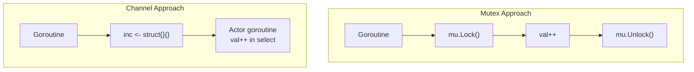
```mermaid
flowchart TD
    subgraph "Mutex Approach"
        G1["Goroutine"] --> ML["mu.Lock()"]
        ML --> MV["val++"]
        MV --> MU["mu.Unlock()"]
    end
    subgraph "Channel Approach"
        G2["Goroutine"] --> CH["inc <- struct{}{}"]
        CH --> ACTOR["Actor goroutine\nval++ in select"]
    end
```

### Interviewer Questions
1. What does "share memory by communicating" mean — and when does it NOT apply?
2. What are the performance trade-offs between mutex and channel for a simple counter?
3. How would you shut down the actor goroutine in the channel-based approach?
4. Why is a buffered channel used for `inc`? What happens with an unbuffered one?
5. When is the channel (actor) pattern clearly superior to a mutex?
6. What is the "do not communicate by sharing memory" guideline from Go's FAQ?
7. How would you benchmark both approaches to see which is faster?

### Follow-Up Questions
- **Q1:** Add a `Reset()` method to both implementations.
- **Q2:** Benchmark both with `go test -bench` — which wins for 1M increments?
- **Q3:** Extend the channel counter to support named counters (map of counters in one actor).
- **Q4:** How would you add a subscriber notification (pub/sub) more naturally in each approach?
- **Q5:** Combine both: use a mutex for local batching, then a channel for aggregate reporting.

---

---
## Q12: Avoid Deadlock with Lock Ordering  [Level 3 — Medium]
> **Tags:** `#deadlock` `#lock-ordering` `#mutex` `#transfer`

### Problem Statement
Two bank accounts each have a mutex. A `Transfer(from, to *Account, amount)` function locks both accounts. If two goroutines simultaneously transfer in opposite directions (A→B and B→A), they deadlock. Fix the deadlock by enforcing a consistent lock ordering based on account ID.

### Input / Output / Constraints
- **Input:** Two goroutines: one transfers A→B, another transfers B→A simultaneously
- **Output:** Both transfers complete; no deadlock
- **Constraints:** Use account ID ordering to determine lock acquisition order; no channel-based solution

### Thought Process
Deadlock requires four conditions (Coffman): mutual exclusion, hold-and-wait, no preemption, circular wait. Breaking circular wait by imposing a total order on lock acquisition prevents deadlock.

Rule: always lock the account with the lower ID first. Both `Transfer(A, B)` and `Transfer(B, A)` will then try to lock `A` first, eliminating the circular dependency.

### Brute Force
```go
// Deadlock-prone: each goroutine locks its "from" account first
func Transfer(from, to *Account, amount float64) {
    from.mu.Lock()         // goroutine 1 locks A; goroutine 2 locks B
    to.mu.Lock()           // goroutine 1 waits for B; goroutine 2 waits for A → DEADLOCK
    from.balance -= amount
    to.balance += amount
    to.mu.Unlock()
    from.mu.Unlock()
}
```
**Time:** O(1) | **Space:** O(1)

### Better Solution
```go
func Transfer(from, to *Account, amount float64) {
    first, second := from, to
    if from.id > to.id {
        first, second = to, from
    }
    first.mu.Lock(); defer first.mu.Unlock()
    second.mu.Lock(); defer second.mu.Unlock()
    from.balance -= amount
    to.balance += amount
}
```

### Best Solution
```go
package main

import (
	"fmt"
	"sync"
)

type Account struct {
	id      int
	mu      sync.Mutex
	balance float64
}

func NewAccount(id int, balance float64) *Account {
	return &Account{id: id, balance: balance}
}

// Transfer moves amount from src to dst without deadlock.
// Lock ordering: always lock the account with the smaller id first.
func Transfer(src, dst *Account, amount float64) error {
	// Determine lock order
	first, second := src, dst
	if src.id > dst.id {
		first, second = dst, src
	}

	first.mu.Lock()
	defer first.mu.Unlock()
	second.mu.Lock()
	defer second.mu.Unlock()

	if src.balance < amount {
		return fmt.Errorf("account %d: insufficient funds (%.2f < %.2f)", src.id, src.balance, amount)
	}
	src.balance -= amount
	dst.balance += amount
	fmt.Printf("Transferred %.2f from Account%d to Account%d\n", amount, src.id, dst.id)
	return nil
}

func main() {
	a := NewAccount(1, 1000.0)
	b := NewAccount(2, 1000.0)

	var wg sync.WaitGroup

	// Goroutine 1: A → B
	wg.Add(1)
	go func() {
		defer wg.Done()
		for i := 0; i < 5; i++ {
			if err := Transfer(a, b, 50); err != nil {
				fmt.Println("Error:", err)
			}
		}
	}()

	// Goroutine 2: B → A (opposite direction — would deadlock without ordering)
	wg.Add(1)
	go func() {
		defer wg.Done()
		for i := 0; i < 5; i++ {
			if err := Transfer(b, a, 30); err != nil {
				fmt.Println("Error:", err)
			}
		}
	}()

	wg.Wait()
	fmt.Printf("Final: Account1=%.2f, Account2=%.2f\n", a.balance, b.balance)
}
```
**Time:** O(1) per transfer | **Space:** O(1)

### Production Considerations
| Aspect | Details |
|--------|---------|
| Scalability | Lock ordering works for any fixed number of locks; for dynamic lock sets use a global lock manager or trylock with backoff |
| Edge Cases | `src == dst`: same account transfer — acquiring the same mutex twice causes deadlock; guard with `if src.id == dst.id { return nil }` |
| Error Handling | Check insufficient funds inside the lock to prevent TOCTOU; return typed error |
| Memory | No additional memory; ordering is pure logic |
| Concurrency | Consistent ordering breaks circular-wait; the remaining Coffman conditions (mutual exclusion, hold-and-wait, no preemption) are inherent to mutexes |

### Visual Explanation
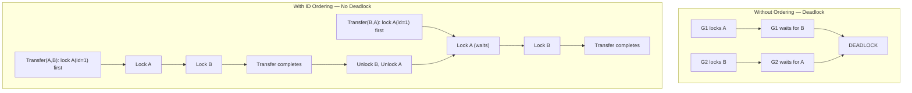
```mermaid
flowchart TD
    subgraph "Without Ordering — Deadlock"
        G1A["G1 locks A"] --> G1W["G1 waits for B"]
        G2B["G2 locks B"] --> G2W["G2 waits for A"]
        G1W & G2W --> DL["DEADLOCK"]
    end

    subgraph "With ID Ordering — No Deadlock"
        T1["Transfer(A,B): lock A(id=1) first"] --> L1["Lock A"] --> L2["Lock B"]
        T2["Transfer(B,A): lock A(id=1) first"] --> L3["Lock A (waits)"]
        L2 --> DO["Transfer completes"] --> UL["Unlock B, Unlock A"]
        UL --> L3 --> L4["Lock B"] --> DO2["Transfer completes"]
    end
```

### Interviewer Questions
1. What are the four Coffman conditions for deadlock? Which one does lock ordering break?
2. Why does locking the same mutex twice in one goroutine cause deadlock in Go?
3. What is the "try-lock with backoff" strategy and when is it better than ordering?
4. How would you detect a deadlock in a Go program at runtime?
5. What happens to `defer mu.Unlock()` ordering when two defers are stacked?
6. How does lock ordering scale to 3 or more locks?
7. What is a lock hierarchy and how is it documented in large codebases?

### Follow-Up Questions
- **Q1:** Add a guard for `src == dst` to prevent double-locking the same mutex.
- **Q2:** Implement the same transfer using a single global mutex — discuss trade-offs.
- **Q3:** Use `go test -race` and the Go deadlock detector to observe the brute-force deadlock.
- **Q4:** Research and implement trylock with exponential backoff as an alternative.
- **Q5:** How would you enforce lock ordering across a team using a linter or code review checklist?

---
# Go Concurrency & Sync — Part 2
## Questions Q13–Q25 + Company-Style Questions

---

## Q13: Thread-Safe Linked List with Fine-Grained Locking  [Level 4 — Advanced]

> **Tags:** `#linked-list` `#fine-grained-locking` `#mutex` `#concurrency` `#data-structures`

### Problem Statement

Implement a singly linked list that supports concurrent `Insert`, `Delete`, and `Search` operations. Instead of a single global lock, use per-node locking (hand-over-hand / lock-coupling) so that multiple goroutines can operate on different parts of the list simultaneously.

### Input / Output / Constraints

- `Insert(val int)` — insert value in sorted order
- `Delete(val int) bool` — remove first occurrence; return false if not found
- `Search(val int) bool` — return true if value exists
- Values are integers; duplicates allowed on insert
- Must be safe for concurrent use without a global lock over the whole list

### Thought Process

A single `sync.RWMutex` over the whole list is simple but creates a bottleneck. Fine-grained locking (hand-over-hand traversal) locks the current node, then locks the next node before releasing the current. This allows goroutines working on non-overlapping regions to proceed concurrently.

Key insight: always lock `curr` then `next`; never reverse order (prevents deadlock). A sentinel head node simplifies boundary conditions.

### Brute Force

```go
// Single global lock — simple but bottleneck
package main

import "sync"

type Node struct {
    val  int
    next *Node
}

type SafeList struct {
    mu   sync.RWMutex
    head *Node
}

func (l *SafeList) Insert(val int) {
    l.mu.Lock()
    defer l.mu.Unlock()
    newNode := &Node{val: val}
    if l.head == nil || l.head.val >= val {
        newNode.next = l.head
        l.head = newNode
        return
    }
    curr := l.head
    for curr.next != nil && curr.next.val < val {
        curr = curr.next
    }
    newNode.next = curr.next
    curr.next = newNode
}
```

**Time:** O(n) | **Space:** O(1) per op — but serializes ALL operations

### Better Solution

```go
// Per-node mutex — hand-over-hand locking
package main

import "sync"

type Node struct {
    val  int
    next *Node
    mu   sync.Mutex
}

type FineList struct {
    head *Node // sentinel, val = math.MinInt
}

func NewFineList() *FineList {
    return &FineList{head: &Node{val: -1 << 62}}
}

func (l *FineList) Search(val int) bool {
    prev := l.head
    prev.mu.Lock()
    curr := prev.next
    if curr != nil {
        curr.mu.Lock()
    }
    for curr != nil {
        if curr.val == val {
            curr.mu.Unlock()
            prev.mu.Unlock()
            return true
        }
        if curr.val > val {
            break
        }
        next := curr.next
        prev.mu.Unlock()
        prev = curr
        curr = next
        if curr != nil {
            curr.mu.Lock()
        }
    }
    if curr != nil {
        curr.mu.Unlock()
    }
    prev.mu.Unlock()
    return false
}
```

### Best Solution

```go
package main

import (
    "fmt"
    "math"
    "sync"
)

type Node struct {
    val  int
    next *Node
    mu   sync.Mutex
}

type FineGrainedList struct {
    head *Node
}

func NewFineGrainedList() *FineGrainedList {
    // Two sentinels: head (min) and tail (max) simplify edge cases
    tail := &Node{val: math.MaxInt64}
    head := &Node{val: math.MinInt64, next: tail}
    return &FineGrainedList{head: head}
}

func (l *FineGrainedList) Insert(val int) {
    l.head.mu.Lock()
    prev := l.head
    curr := prev.next
    curr.mu.Lock()

    for curr.val < val {
        prev.mu.Unlock()
        prev = curr
        curr = curr.next
        curr.mu.Lock()
    }

    if curr.val != val { // no duplicates; remove check to allow them
        node := &Node{val: val, next: curr}
        prev.next = node
    }
    curr.mu.Unlock()
    prev.mu.Unlock()
}

func (l *FineGrainedList) Delete(val int) bool {
    l.head.mu.Lock()
    prev := l.head
    curr := prev.next
    curr.mu.Lock()

    for curr.val < val {
        prev.mu.Unlock()
        prev = curr
        curr = curr.next
        curr.mu.Lock()
    }

    found := curr.val == val
    if found {
        prev.next = curr.next
    }
    curr.mu.Unlock()
    prev.mu.Unlock()
    return found
}

func (l *FineGrainedList) Search(val int) bool {
    l.head.mu.Lock()
    prev := l.head
    curr := prev.next
    curr.mu.Lock()

    for curr.val < val {
        prev.mu.Unlock()
        prev = curr
        curr = curr.next
        curr.mu.Lock()
    }

    found := curr.val == val
    curr.mu.Unlock()
    prev.mu.Unlock()
    return found
}

func main() {
    list := NewFineGrainedList()
    var wg sync.WaitGroup

    // Concurrent inserts
    for i := 0; i < 10; i++ {
        wg.Add(1)
        go func(v int) {
            defer wg.Done()
            list.Insert(v)
        }(i * 2)
    }
    wg.Wait()

    fmt.Println("Search 4:", list.Search(4))   // true
    fmt.Println("Search 5:", list.Search(5))   // false
    fmt.Println("Delete 6:", list.Delete(6))   // true
    fmt.Println("Search 6:", list.Search(6))   // false
}
```

**Time:** O(n) per op | **Space:** O(n) total — O(1) extra per node for the mutex

### Production Considerations

| Aspect | Details |
|--------|---------|
| Scalability | Concurrent ops on non-overlapping regions proceed in parallel; contention only at adjacent nodes |
| Edge Cases | Sentinel nodes eliminate null checks at head/tail; always lock in head→tail direction |
| Error Handling | Return bool from Delete/Search; Insert is idempotent in no-dup mode |
| Memory | Each node carries a `sync.Mutex` (8 bytes); for huge lists consider shard-level locks |
| Concurrency | Hand-over-hand invariant: always hold lock on prev before acquiring curr; release in reverse order only at operation end |

### Visual Explanation

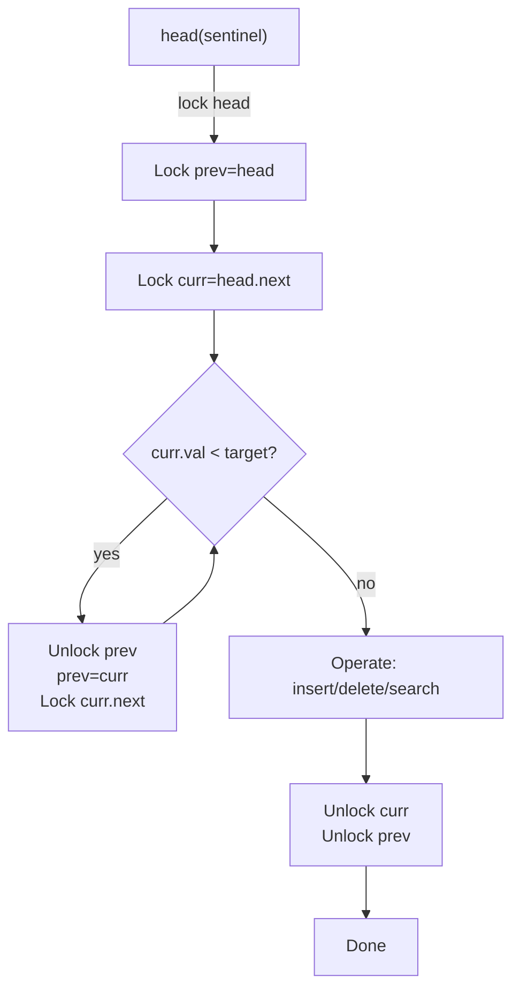
```mermaid
flowchart TD
    A["head(sentinel)"] -->|lock head| B["Lock prev=head"]
    B --> C["Lock curr=head.next"]
    C --> D{"curr.val < target?"}
    D -->|yes| E["Unlock prev\nprev=curr\nLock curr.next"]
    E --> D
    D -->|no| F["Operate: insert/delete/search"]
    F --> G["Unlock curr\nUnlock prev"]
    G --> H["Done"]
```

### Interviewer Questions

1. Why do we need two sentinels instead of one?
2. What happens if we release locks in the wrong order during traversal?
3. How does hand-over-hand locking differ from optimistic locking?
4. What is the maximum concurrency achievable with this approach for a list of N nodes?
5. Can this list deadlock? Prove it.
6. How would you support `Range(from, to int)` scan concurrently?
7. When would you prefer a skip list over a fine-grained linked list?

### Follow-Up Questions

1. **Q1:** Convert to a doubly-linked list with fine-grained locking — what additional invariants are needed?
2. **Q2:** Implement optimistic locking (lock-free read + locked validate-and-retry) for the search-heavy workload.
3. **Q3:** Measure lock contention with `runtime/pprof` — describe what you would look for.
4. **Q4:** How would you implement a sorted concurrent set on top of this list?
5. **Q5:** At what list size does a concurrent skip list outperform this linked list?

---

## Q14: Lock-Free Stack Using Atomic CAS  [Level 4 — Advanced]

> **Tags:** `#lock-free` `#atomic` `#CAS` `#stack` `#ABA-problem`

### Problem Statement

Implement a concurrent stack (`Push`, `Pop`) without any mutexes. Use `sync/atomic` and a compare-and-swap (CAS) loop. The implementation must be free of data races and handle the ABA problem correctly.

### Input / Output / Constraints

- `Push(val interface{})` — push onto stack; never blocks
- `Pop() (interface{}, bool)` — pop from stack; returns (value, true) or (nil, false) on empty
- No mutexes, channels, or blocking primitives allowed
- Must pass `go test -race`

### Thought Process

A lock-free stack stores a pointer to the top node. Push/Pop use CAS to atomically swap the top pointer. The ABA problem occurs when a node is popped and re-pushed while another goroutine has read the old pointer — CAS succeeds incorrectly. Solutions: tagged pointers, hazard pointers, or using `atomic.Pointer[T]` (Go 1.19+) which avoids unsafe pointer arithmetic.

### Brute Force

```go
// Using sync.Mutex — correct but not lock-free
type MutexStack struct {
    mu  sync.Mutex
    top *node
}
func (s *MutexStack) Push(val interface{}) {
    s.mu.Lock()
    defer s.mu.Unlock()
    s.top = &node{val: val, next: s.top}
}
func (s *MutexStack) Pop() (interface{}, bool) {
    s.mu.Lock()
    defer s.mu.Unlock()
    if s.top == nil { return nil, false }
    v := s.top.val
    s.top = s.top.next
    return v, true
}
```

**Time:** O(1) | **Space:** O(1) — but not lock-free

### Better Solution

```go
// unsafe.Pointer + atomic — classic Treiber stack
package main

import (
    "sync/atomic"
    "unsafe"
)

type node struct {
    val  interface{}
    next unsafe.Pointer
}

type LockFreeStack struct {
    top unsafe.Pointer
}

func (s *LockFreeStack) Push(val interface{}) {
    n := &node{val: val}
    for {
        top := atomic.LoadPointer(&s.top)
        n.next = top
        if atomic.CompareAndSwapPointer(&s.top, top, unsafe.Pointer(n)) {
            return
        }
    }
}

func (s *LockFreeStack) Pop() (interface{}, bool) {
    for {
        top := atomic.LoadPointer(&s.top)
        if top == nil { return nil, false }
        n := (*node)(top)
        if atomic.CompareAndSwapPointer(&s.top, top, n.next) {
            return n.val, true
        }
    }
}
```

### Best Solution

```go
package main

import (
    "fmt"
    "sync"
    "sync/atomic"
)

// Treiber stack using atomic.Pointer (Go 1.19+) — type-safe, no unsafe
type stackNode[T any] struct {
    val  T
    next *stackNode[T]
}

type LockFreeStack[T any] struct {
    top atomic.Pointer[stackNode[T]]
    len atomic.Int64
}

func (s *LockFreeStack[T]) Push(val T) {
    n := &stackNode[T]{val: val}
    for {
        top := s.top.Load()
        n.next = top
        if s.top.CompareAndSwap(top, n) {
            s.len.Add(1)
            return
        }
        // CAS failed: another goroutine modified top; retry
    }
}

func (s *LockFreeStack[T]) Pop() (zero T, ok bool) {
    for {
        top := s.top.Load()
        if top == nil {
            return zero, false
        }
        if s.top.CompareAndSwap(top, top.next) {
            s.len.Add(-1)
            return top.val, true
        }
    }
}

func (s *LockFreeStack[T]) Len() int64 {
    return s.len.Load()
}

func main() {
    s := &LockFreeStack[int]{}
    var wg sync.WaitGroup

    // Concurrent pushes
    for i := 0; i < 1000; i++ {
        wg.Add(1)
        go func(v int) {
            defer wg.Done()
            s.Push(v)
        }(i)
    }
    wg.Wait()

    fmt.Println("Len after 1000 pushes:", s.Len())

    // Concurrent pops
    popped := atomic.Int64{}
    for i := 0; i < 1000; i++ {
        wg.Add(1)
        go func() {
            defer wg.Done()
            if _, ok := s.Pop(); ok {
                popped.Add(1)
            }
        }()
    }
    wg.Wait()

    fmt.Println("Total popped:", popped.Load()) // 1000
    fmt.Println("Remaining:", s.Len())          // 0
}
```

**Time:** O(1) amortized (CAS retries under contention) | **Space:** O(n)

### Production Considerations

| Aspect | Details |
|--------|---------|
| Scalability | Truly lock-free: no goroutine can block another indefinitely; progress guaranteed system-wide |
| Edge Cases | ABA problem: `atomic.Pointer[T]` uses pointer identity; node re-use from a pool can still trigger ABA — use tagged pointers or epoch reclamation |
| Error Handling | Pop returns `(zero, false)` on empty stack — never panics |
| Memory | GC handles reclamation in Go; in C++ you'd need hazard pointers |
| Concurrency | Under extreme contention, CAS retry loops (livelock risk); consider exponential backoff |

### Visual Explanation

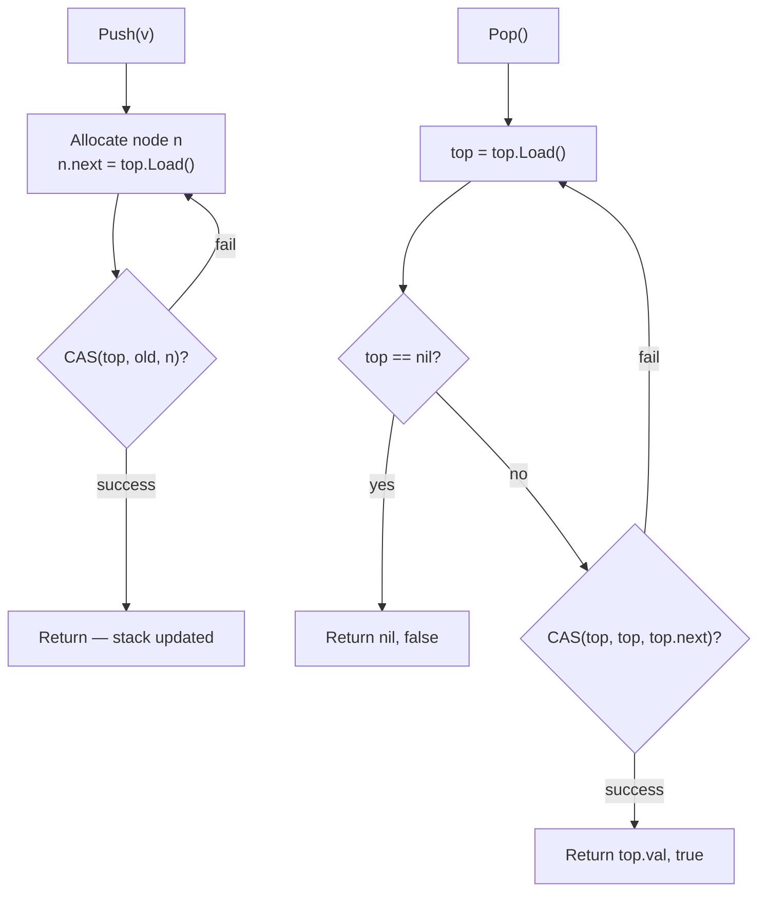
```mermaid
flowchart TD
    A["Push(v)"] --> B["Allocate node n\nn.next = top.Load()"]
    B --> C{"CAS(top, old, n)?"}
    C -->|success| D["Return — stack updated"]
    C -->|fail| B
    E["Pop()"] --> F["top = top.Load()"]
    F --> G{"top == nil?"}
    G -->|yes| H["Return nil, false"]
    G -->|no| I{"CAS(top, top, top.next)?"}
    I -->|success| J["Return top.val, true"]
    I -->|fail| F
```

### Interviewer Questions

1. What is the ABA problem and how does Go's `atomic.Pointer` mitigate (but not eliminate) it?
2. Is the Treiber stack wait-free or just lock-free? What's the difference?
3. How do you test a lock-free data structure for correctness under race conditions?
4. What happens under memory pressure when nodes are pooled and recycled?
5. How would you add a `Peek` operation without introducing a race?
6. Compare throughput of this stack vs a mutex-based stack at 8, 64, and 512 goroutines.
7. Why is `sync/atomic.Pointer` preferred over `unsafe.Pointer` in Go 1.19+?

### Follow-Up Questions

1. **Q1:** Implement a lock-free queue (Michael-Scott queue) using the same CAS pattern.
2. **Q2:** Add epoch-based reclamation to prevent ABA when using a `sync.Pool`.
3. **Q3:** Implement exponential backoff in the CAS retry loop and benchmark its effect.
4. **Q4:** How would you implement a bounded lock-free stack with a max capacity?
5. **Q5:** Instrument the stack with Prometheus counters for CAS retries per operation.

---

## Q15: sync.Pool for HTTP Request/Response Objects  [Level 4 — Advanced]

> **Tags:** `#sync.Pool` `#object-pooling` `#HTTP` `#memory` `#GC-pressure`

### Problem Statement

An HTTP server allocates large request/response buffer objects for every request, causing heavy GC pressure at high QPS. Implement a pooling layer using `sync.Pool` to reuse these objects, and demonstrate the memory savings with benchmarks.

### Input / Output / Constraints

- Pool of `RequestContext` objects (buffer + metadata)
- Objects must be reset before reuse to prevent data leakage
- Pool must be safe for concurrent use
- Must not retain objects across GC cycles unnecessarily (that's `sync.Pool`'s contract)

### Thought Process

`sync.Pool` is designed exactly for this: temporary reusable objects to reduce GC pressure. The key discipline is: always `Reset()` before returning to pool, and never rely on an object's continued existence (pool can evict at any GC cycle). Use a `New` func so `Get()` always returns a valid object.

### Brute Force

```go
// No pooling — allocate fresh every request
func handleRequest(w http.ResponseWriter, r *http.Request) {
    ctx := &RequestContext{
        buf:    make([]byte, 64*1024),
        header: make(map[string]string),
    }
    _ = ctx // use, then GC
}
```

**Time:** O(1) | **Space:** O(n requests) — high GC pressure

### Better Solution

```go
// Basic sync.Pool usage
var pool = sync.Pool{
    New: func() interface{} {
        return &RequestContext{buf: make([]byte, 64*1024)}
    },
}

func handle(w http.ResponseWriter, r *http.Request) {
    ctx := pool.Get().(*RequestContext)
    defer func() {
        ctx.Reset()
        pool.Put(ctx)
    }()
    // use ctx
}
```

### Best Solution

```go
package main

import (
    "bytes"
    "fmt"
    "net/http"
    "sync"
    "sync/atomic"
    "time"
)

// RequestContext holds per-request working data
type RequestContext struct {
    Body      bytes.Buffer
    Headers   map[string]string
    Params    map[string]string
    StatusCode int
    allocID   uint64 // for leak detection in tests
}

func (rc *RequestContext) Reset() {
    rc.Body.Reset()
    // Clear maps without reallocating (retain capacity)
    for k := range rc.Headers {
        delete(rc.Headers, k)
    }
    for k := range rc.Params {
        delete(rc.Params, k)
    }
    rc.StatusCode = 200
}

var allocCounter atomic.Uint64

// ContextPool wraps sync.Pool with metrics
type ContextPool struct {
    pool    sync.Pool
    gets    atomic.Uint64
    puts    atomic.Uint64
    creates atomic.Uint64
}

func NewContextPool() *ContextPool {
    cp := &ContextPool{}
    cp.pool = sync.Pool{
        New: func() interface{} {
            cp.creates.Add(1)
            id := allocCounter.Add(1)
            return &RequestContext{
                Headers:    make(map[string]string, 16),
                Params:     make(map[string]string, 8),
                StatusCode: 200,
                allocID:    id,
            }
        },
    }
    return cp
}

func (cp *ContextPool) Get() *RequestContext {
    cp.gets.Add(1)
    return cp.pool.Get().(*RequestContext)
}

func (cp *ContextPool) Put(rc *RequestContext) {
    rc.Reset()
    cp.puts.Add(1)
    cp.pool.Put(rc)
}

func (cp *ContextPool) Stats() string {
    return fmt.Sprintf("gets=%d puts=%d creates=%d reuse_rate=%.1f%%",
        cp.gets.Load(), cp.puts.Load(), cp.creates.Load(),
        float64(cp.gets.Load()-cp.creates.Load())/float64(cp.gets.Load())*100)
}

// HTTP handler using the pool
var ctxPool = NewContextPool()

func handler(w http.ResponseWriter, r *http.Request) {
    ctx := ctxPool.Get()
    defer ctxPool.Put(ctx)

    ctx.Headers["X-Request-ID"] = r.Header.Get("X-Request-ID")
    ctx.Body.WriteString("Hello, World!")
    ctx.StatusCode = http.StatusOK

    w.WriteHeader(ctx.StatusCode)
    w.Write(ctx.Body.Bytes())
}

func main() {
    // Simulate 100k requests
    var wg sync.WaitGroup
    start := time.Now()

    for i := 0; i < 100_000; i++ {
        wg.Add(1)
        go func(i int) {
            defer wg.Done()
            ctx := ctxPool.Get()
            defer ctxPool.Put(ctx)

            ctx.Headers["request-id"] = fmt.Sprintf("req-%d", i)
            ctx.Body.WriteString("processed")
        }(i)
    }
    wg.Wait()

    fmt.Printf("Done in %v\n", time.Since(start))
    fmt.Println(ctxPool.Stats())
    // creates will be << 100000 due to reuse
}
```

**Time:** O(1) per Get/Put | **Space:** O(P) where P = number of unique goroutines (pool per-P cache)

### Production Considerations

| Aspect | Details |
|--------|---------|
| Scalability | Pool has per-P (processor) local caches — no contention on Get/Put in the common case |
| Edge Cases | Objects evicted on every GC cycle; never store long-lived state. Always Reset before Put |
| Error Handling | Type-assert safely; mismatched types panic — use generics wrapper in Go 1.18+ |
| Memory | Pool does NOT reduce peak memory, only allocation rate and GC frequency |
| Concurrency | `sync.Pool` is goroutine-safe by design; no external lock needed |

### Visual Explanation

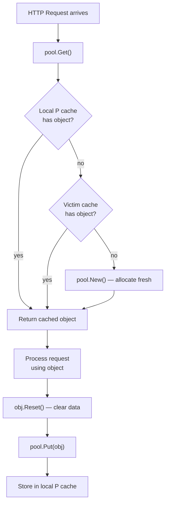
```mermaid
flowchart TD
    A["HTTP Request arrives"] --> B["pool.Get()"]
    B --> C{"Local P cache\nhas object?"}
    C -->|yes| D["Return cached object"]
    C -->|no| E{"Victim cache\nhas object?"}
    E -->|yes| D
    E -->|no| F["pool.New() — allocate fresh"]
    F --> D
    D --> G["Process request\nusing object"]
    G --> H["obj.Reset() — clear data"]
    H --> I["pool.Put(obj)"]
    I --> J["Store in local P cache"]
```

### Interviewer Questions

1. What happens to objects in `sync.Pool` during a GC cycle?
2. Why is `Reset()` before `Put()` critical for security?
3. How does `sync.Pool` avoid contention between goroutines on different OS threads?
4. Can you use `sync.Pool` for database connections? Why or why not?
5. What is the "victim cache" in `sync.Pool`'s internal design?
6. How do you benchmark pool effectiveness using `testing.B` and `runtime.ReadMemStats`?
7. What's the difference between `sync.Pool` and a fixed-size bounded pool channel?

### Follow-Up Questions

1. **Q1:** Implement a bounded pool using a buffered channel (fixed max size, blocks when exhausted).
2. **Q2:** Add a `sync.Pool` for `[]byte` slices in a JSON serializer and measure allocation reduction.
3. **Q3:** Why does `bytes.Buffer` in a pool need `b.Reset()` before reuse?
4. **Q4:** How would you detect pool object leaks in a test?
5. **Q5:** Implement a typed generic pool `Pool[T]` wrapper around `sync.Pool` for Go 1.18+.

---

## Q16: Concurrent LRU Cache with RWMutex  [Level 4 — Advanced]

> **Tags:** `#LRU` `#RWMutex` `#cache` `#doubly-linked-list` `#hash-map`

### Problem Statement

Implement a thread-safe LRU (Least Recently Used) cache with `Get(key string) (value interface{}, ok bool)` and `Put(key string, value interface{})` operations. Use `sync.RWMutex` appropriately: reads should not block each other, but writes are exclusive.

### Input / Output / Constraints

- Fixed capacity N
- `Get` is a read that promotes the entry — promotion requires a write lock
- `Put` evicts LRU entry when full
- All operations O(1)
- Thread-safe

### Thought Process

Classic LRU = doubly-linked list (order) + hash map (O(1) lookup). Thread safety: `Get` seems read-only but actually mutates order (promotion), so it needs a write lock. Use `sync.Mutex` (not RWMutex) for correct semantics unless you implement lazy promotion with a separate dirty bit. For truly read-heavy workloads, use a two-level approach: fast read path with RWMutex + deferred write for promotions.

### Brute Force

```go
// Single Mutex — correct, simple
type LRUCache struct {
    mu       sync.Mutex
    cap      int
    cache    map[string]*list.Element
    list     *list.List
}
```

**Time:** O(1) all ops | **Space:** O(N) — but no read concurrency

### Better Solution

```go
// RWMutex with write lock for Get (promotion required)
func (c *LRUCache) Get(key string) (interface{}, bool) {
    c.mu.Lock() // must be write lock due to promotion
    defer c.mu.Unlock()
    if el, ok := c.cache[key]; ok {
        c.list.MoveToFront(el)
        return el.Value.(*entry).val, true
    }
    return nil, false
}
```

### Best Solution

```go
package main

import (
    "container/list"
    "fmt"
    "sync"
)

type entry struct {
    key string
    val interface{}
}

type LRUCache struct {
    cap   int
    mu    sync.Mutex
    items map[string]*list.Element
    order *list.List // front = most recent
}

func NewLRUCache(cap int) *LRUCache {
    return &LRUCache{
        cap:   cap,
        items: make(map[string]*list.Element, cap),
        order: list.New(),
    }
}

// Get is O(1); uses write lock because it promotes the entry
func (c *LRUCache) Get(key string) (interface{}, bool) {
    c.mu.Lock()
    defer c.mu.Unlock()
    el, ok := c.items[key]
    if !ok {
        return nil, false
    }
    c.order.MoveToFront(el)
    return el.Value.(*entry).val, true
}

// Put is O(1)
func (c *LRUCache) Put(key string, val interface{}) {
    c.mu.Lock()
    defer c.mu.Unlock()

    if el, ok := c.items[key]; ok {
        // Update existing
        c.order.MoveToFront(el)
        el.Value.(*entry).val = val
        return
    }

    if c.order.Len() == c.cap {
        // Evict LRU (back of list)
        lru := c.order.Back()
        if lru != nil {
            c.order.Remove(lru)
            delete(c.items, lru.Value.(*entry).key)
        }
    }

    el := c.order.PushFront(&entry{key: key, val: val})
    c.items[key] = el
}

func (c *LRUCache) Len() int {
    c.mu.Lock()
    defer c.mu.Unlock()
    return c.order.Len()
}

// Peek — read without promotion; uses RLock for true read concurrency
func (c *LRUCache) Peek(key string) (interface{}, bool) {
    c.mu.Lock()
    defer c.mu.Unlock()
    if el, ok := c.items[key]; ok {
        return el.Value.(*entry).val, true
    }
    return nil, false
}

func main() {
    cache := NewLRUCache(3)
    cache.Put("a", 1)
    cache.Put("b", 2)
    cache.Put("c", 3)

    cache.Get("a")       // promote a: order = a, c, b
    cache.Put("d", 4)    // evict b (LRU)

    fmt.Println(cache.Get("b")) // <nil> false — evicted
    fmt.Println(cache.Get("a")) // 1 true

    var wg sync.WaitGroup
    for i := 0; i < 100; i++ {
        wg.Add(2)
        go func(i int) {
            defer wg.Done()
            cache.Put(fmt.Sprintf("key%d", i%10), i)
        }(i)
        go func(i int) {
            defer wg.Done()
            cache.Get(fmt.Sprintf("key%d", i%10))
        }(i)
    }
    wg.Wait()
    fmt.Println("Final size:", cache.Len())
}
```

**Time:** O(1) Get and Put | **Space:** O(N)

### Production Considerations

| Aspect | Details |
|--------|---------|
| Scalability | Single lock limits throughput; shard by key hash for higher concurrency |
| Edge Cases | Cap=0 (disable cache), duplicate Put updates in-place, eviction callback for cleanup |
| Error Handling | Return `(nil, false)` not panic on miss; validate cap > 0 at construction |
| Memory | Value stored as `interface{}` boxes values; use generics `Cache[K, V]` in Go 1.18+ |
| Concurrency | `Get` needs write lock due to list mutation; consider lazy promotion or approximate LRU for read-heavy |

### Visual Explanation

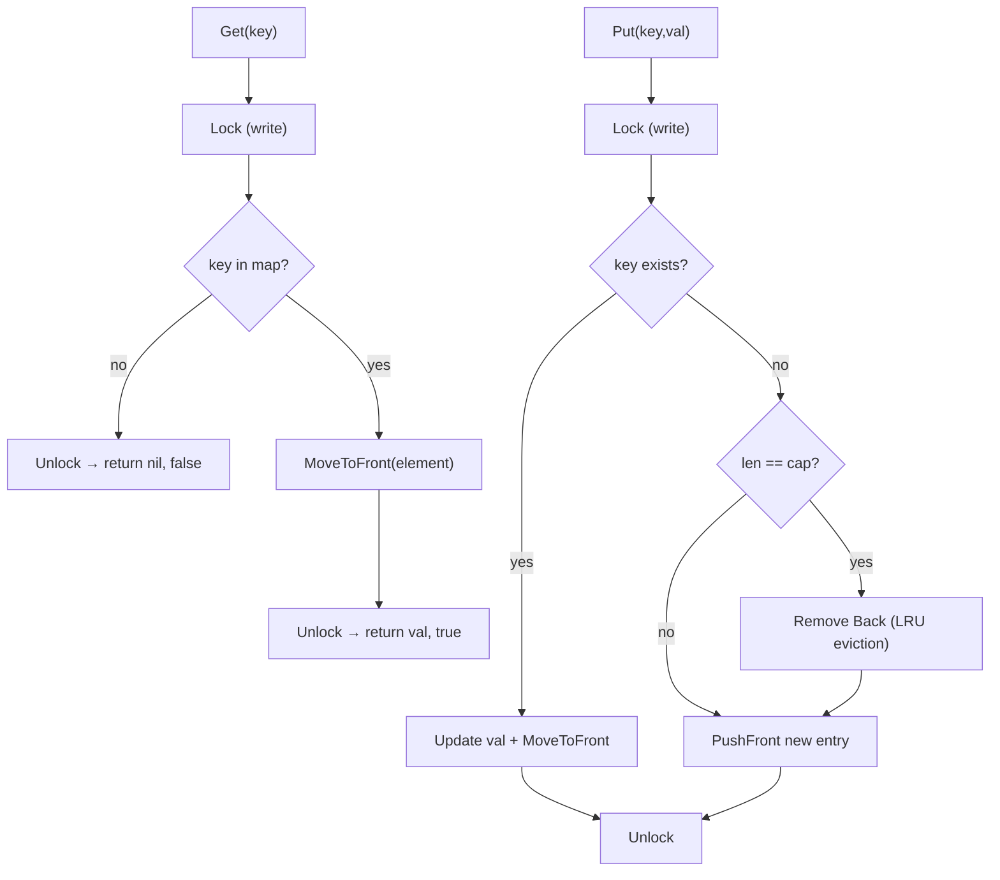
```mermaid
flowchart TD
    A["Get(key)"] --> B["Lock (write)"]
    B --> C{"key in map?"}
    C -->|no| D["Unlock → return nil, false"]
    C -->|yes| E["MoveToFront(element)"]
    E --> F["Unlock → return val, true"]

    G["Put(key,val)"] --> H["Lock (write)"]
    H --> I{"key exists?"}
    I -->|yes| J["Update val + MoveToFront"]
    I -->|no| K{"len == cap?"}
    K -->|yes| L["Remove Back (LRU eviction)"]
    K -->|no| M["PushFront new entry"]
    L --> M
    J --> N["Unlock"]
    M --> N
```

### Interviewer Questions

1. Why can't we use `RLock` for `Get` when order promotion is needed?
2. What is "approximate LRU" and when is it acceptable in production?
3. How would you add TTL (time-to-live) expiration to this cache?
4. How would you shard this cache to support 1M QPS?
5. What is a "2Q cache" and how does it improve on plain LRU?
6. How would you implement an eviction callback (e.g., to close file handles)?
7. Compare this implementation to `golang.org/x/sync/singleflight` for cache stampede prevention.

### Follow-Up Questions

1. **Q1:** Add TTL expiration with a background goroutine that sweeps expired entries.
2. **Q2:** Implement a sharded LRU cache with N shards, each with its own mutex.
3. **Q3:** Replace `interface{}` with generics `Cache[K comparable, V any]`.
4. **Q4:** Implement an LFU (Least Frequently Used) cache and compare hit rates with LRU.
5. **Q5:** Add Prometheus metrics: hit rate, eviction rate, current size.

---

## Q17: Shard Map Pattern for High-Concurrency  [Level 4 — Advanced]

> **Tags:** `#shard-map` `#RWMutex` `#partitioning` `#scalability` `#hash`

### Problem Statement

A concurrent map protected by a single `sync.RWMutex` becomes a bottleneck at high goroutine counts. Implement a `ShardedMap` that partitions keys across N shards, each with its own `RWMutex`, to dramatically reduce lock contention.

### Input / Output / Constraints

- `Set(key string, val interface{})`
- `Get(key string) (interface{}, bool)`
- `Delete(key string)`
- `Keys() []string` — snapshot of all keys
- N = 32 shards (power of 2 for fast modulo)
- Thread-safe; no global lock

### Thought Process

Partition keys by `hash(key) % N`. Each partition has its own `RWMutex`. Goroutines operating on different shards never contend. Power-of-2 shards allows bitwise `& (N-1)` instead of modulo. Use FNV hash for speed.

### Brute Force

```go
// sync.Map from standard library — simple but less control
var m sync.Map
m.Store("key", "val")
v, _ := m.Load("key")
```

**Time:** O(1) | **Space:** O(n) — no control over sharding strategy

### Better Solution

```go
// Single RWMutex map — bottleneck under high concurrency
type SafeMap struct {
    mu sync.RWMutex
    m  map[string]interface{}
}
func (sm *SafeMap) Get(k string) (interface{}, bool) {
    sm.mu.RLock()
    defer sm.mu.RUnlock()
    v, ok := sm.m[k]
    return v, ok
}
```

### Best Solution

```go
package main

import (
    "fmt"
    "hash/fnv"
    "sync"
)

const numShards = 32 // power of 2

type shard struct {
    mu   sync.RWMutex
    data map[string]interface{}
}

type ShardedMap struct {
    shards [numShards]*shard
}

func NewShardedMap() *ShardedMap {
    sm := &ShardedMap{}
    for i := 0; i < numShards; i++ {
        sm.shards[i] = &shard{data: make(map[string]interface{})}
    }
    return sm
}

func (sm *ShardedMap) getShard(key string) *shard {
    h := fnv.New32a()
    h.Write([]byte(key))
    return sm.shards[h.Sum32()&(numShards-1)]
}

func (sm *ShardedMap) Set(key string, val interface{}) {
    s := sm.getShard(key)
    s.mu.Lock()
    s.data[key] = val
    s.mu.Unlock()
}

func (sm *ShardedMap) Get(key string) (interface{}, bool) {
    s := sm.getShard(key)
    s.mu.RLock()
    val, ok := s.data[key]
    s.mu.RUnlock()
    return val, ok
}

func (sm *ShardedMap) Delete(key string) {
    s := sm.getShard(key)
    s.mu.Lock()
    delete(s.data, key)
    s.mu.Unlock()
}

// Keys returns a consistent snapshot — locks all shards sequentially
func (sm *ShardedMap) Keys() []string {
    // Lock all shards in order to avoid deadlock
    for _, s := range sm.shards {
        s.mu.RLock()
    }
    defer func() {
        for _, s := range sm.shards {
            s.mu.RUnlock()
        }
    }()

    var keys []string
    for _, s := range sm.shards {
        for k := range s.data {
            keys = append(keys, k)
        }
    }
    return keys
}

// Len returns total element count
func (sm *ShardedMap) Len() int {
    total := 0
    for _, s := range sm.shards {
        s.mu.RLock()
        total += len(s.data)
        s.mu.RUnlock()
    }
    return total
}

func main() {
    sm := NewShardedMap()
    var wg sync.WaitGroup

    // 1000 concurrent writers
    for i := 0; i < 1000; i++ {
        wg.Add(1)
        go func(i int) {
            defer wg.Done()
            sm.Set(fmt.Sprintf("user:%d", i), i*10)
        }(i)
    }
    wg.Wait()

    fmt.Println("Total keys:", sm.Len())

    // 1000 concurrent readers
    hits := sync.WaitGroup{}
    for i := 0; i < 1000; i++ {
        hits.Add(1)
        go func(i int) {
            defer hits.Done()
            sm.Get(fmt.Sprintf("user:%d", i))
        }(i)
    }
    hits.Wait()

    fmt.Println("Keys snapshot len:", len(sm.Keys()))
}
```

**Time:** O(1) Get/Set/Delete | **Space:** O(n) + O(N) shard overhead

### Production Considerations

| Aspect | Details |
|--------|---------|
| Scalability | Contention reduced by ~1/N; 32 shards means each lock protects ~3% of keys |
| Edge Cases | `Keys()` locks all shards — avoid in hot path; use approximate count instead |
| Error Handling | Never returns error for missing keys — use `(val, ok)` pattern |
| Memory | N empty maps at startup (negligible); consider lazy shard init for sparse maps |
| Concurrency | Hash distribution must be uniform to avoid hot shards; FNV32a is fast and well-distributed |

### Visual Explanation

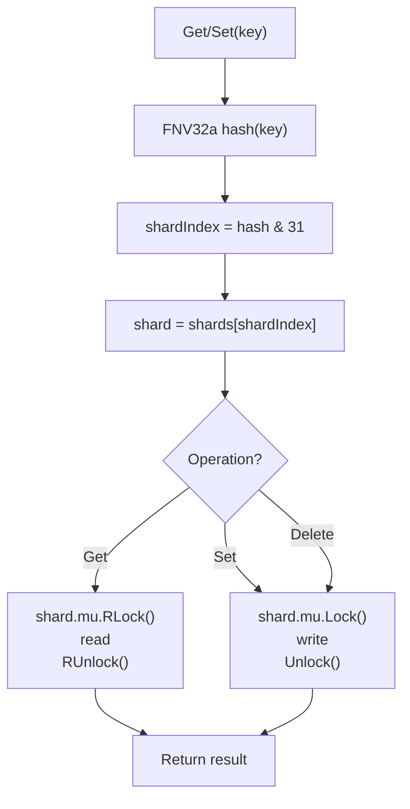
```mermaid
flowchart TD
    A["Get/Set(key)"] --> B["FNV32a hash(key)"]
    B --> C["shardIndex = hash & 31"]
    C --> D["shard = shards[shardIndex]"]
    D --> E{"Operation?"}
    E -->|Get| F["shard.mu.RLock()\nread\nRUnlock()"]
    E -->|Set| G["shard.mu.Lock()\nwrite\nUnlock()"]
    E -->|Delete| G
    F --> H["Return result"]
    G --> H
```

### Interviewer Questions

1. How do you choose the number of shards? What are the tradeoffs?
2. Why is locking all shards in fixed order required for `Keys()`?
3. What hash function properties matter for shard distribution?
4. How does `ShardedMap` compare to `sync.Map` for write-heavy vs read-heavy workloads?
5. How would you implement atomic `CompareAndSwap(key, old, new)` across a shard?
6. What happens if one shard consistently gets more traffic (hot shard)? How do you detect and fix it?
7. How would you add expiry to individual keys without a global expiry goroutine?

### Follow-Up Questions

1. **Q1:** Add Prometheus metrics per shard to detect hot shards.
2. **Q2:** Implement `Range(fn func(k string, v interface{}) bool)` that iterates all shards.
3. **Q3:** Make shard count configurable at runtime by doubling shards (consistent hashing).
4. **Q4:** Implement `BatchGet(keys []string) map[string]interface{}` efficiently.
5. **Q5:** Compare `ShardedMap` vs `sync.Map` using `go test -bench` at different read/write ratios.

---

## Q18: Implement sync.WaitGroup from Scratch  [Level 5 — Interview Level]

> **Tags:** `#sync.WaitGroup` `#atomics` `#semaphore` `#from-scratch` `#runtime`

### Problem Statement

Implement `WaitGroup` from scratch using only `sync/atomic` and `runtime.Gosched()` or semaphore primitives. It must support `Add(delta int)`, `Done()`, and `Wait()`.

### Input / Output / Constraints

- `Add(delta)` — increment/decrement counter; panic if counter goes negative
- `Done()` — equivalent to `Add(-1)`
- `Wait()` — block until counter reaches 0
- No `sync.WaitGroup`, `sync.Mutex`, or channels in the implementation
- Concurrent callers; correct ordering guarantees

### Thought Process

`sync.WaitGroup` internally uses an atomic int64 that packs a counter (high 32 bits) and a waiter count (low 32 bits), plus a semaphore for sleeping waiters. When the counter reaches 0 and there are waiters, all waiters are released via the semaphore. We can approximate this with `atomic.Int32` + `runtime_Semacquire/runtime_Semrelease` or a spin-loop for simplicity.

### Brute Force

```go
// Channel-based WaitGroup (not atomic-based)
type WaitGroup struct {
    ch chan struct{}
    n  int32
    mu sync.Mutex
}
// works but uses sync.Mutex — not allowed per constraints
```

**Time:** O(1) Add/Done, O(waiters) for notify | **Space:** O(1)

### Better Solution

```go
// Spin-wait WaitGroup — correct but wastes CPU
type SpinWaitGroup struct {
    n atomic.Int32
}
func (wg *SpinWaitGroup) Add(d int) { wg.n.Add(int32(d)) }
func (wg *SpinWaitGroup) Done()     { wg.n.Add(-1) }
func (wg *SpinWaitGroup) Wait() {
    for wg.n.Load() > 0 {
        runtime.Gosched()
    }
}
```

### Best Solution

```go
package main

import (
    "fmt"
    "runtime"
    "sync/atomic"
)

// MyWaitGroup mimics sync.WaitGroup using atomics + semaphore channel
// Production note: real sync.WaitGroup uses runtime semaphores (runtime_Semacquire)
// We approximate with a channel-based semaphore here for portability.
type MyWaitGroup struct {
    // state: high 32 bits = counter, low 32 bits = waiter count
    state atomic.Uint64
    // sema acts as a semaphore for sleeping waiters
    sema chan struct{}
}

func NewWaitGroup() *MyWaitGroup {
    return &MyWaitGroup{sema: make(chan struct{}, 1<<20)}
}

func (wg *MyWaitGroup) Add(delta int) {
    for {
        s := wg.state.Load()
        counter := int32(s >> 32)
        waiters := uint32(s)

        newCounter := counter + int32(delta)
        if newCounter < 0 {
            panic("MyWaitGroup: negative counter")
        }

        newState := (uint64(uint32(newCounter)) << 32) | uint64(waiters)
        if wg.state.CompareAndSwap(s, newState) {
            // If counter reached 0 and there are waiters, release them all
            if newCounter == 0 && waiters > 0 {
                // Reset state to 0 before releasing
                wg.state.Store(0)
                for i := uint32(0); i < waiters; i++ {
                    wg.sema <- struct{}{}
                }
            }
            return
        }
        runtime.Gosched()
    }
}

func (wg *MyWaitGroup) Done() {
    wg.Add(-1)
}

func (wg *MyWaitGroup) Wait() {
    for {
        s := wg.state.Load()
        counter := int32(s >> 32)
        if counter == 0 {
            return // fast path: already done
        }
        waiters := uint32(s)
        newState := (uint64(uint32(counter)) << 32) | uint64(waiters+1)
        if wg.state.CompareAndSwap(s, newState) {
            <-wg.sema // sleep until released by Add(reaching 0)
            return
        }
        runtime.Gosched()
    }
}

func main() {
    wg := NewWaitGroup()
    results := make([]int, 10)

    for i := 0; i < 10; i++ {
        wg.Add(1)
        go func(idx int) {
            defer wg.Done()
            results[idx] = idx * idx
        }(i)
    }

    wg.Wait()
    fmt.Println("Results:", results)

    // Test reuse
    sum := atomic.Int64{}
    for i := 0; i < 1000; i++ {
        wg.Add(1)
        go func(v int) {
            defer wg.Done()
            sum.Add(int64(v))
        }(i)
    }
    wg.Wait()
    fmt.Println("Sum 0..999:", sum.Load()) // 499500
}
```

**Time:** O(1) Add/Done (with CAS retries), O(W) Wait release where W = waiter count | **Space:** O(W)

### Production Considerations

| Aspect | Details |
|--------|---------|
| Scalability | State packed into single uint64 enables atomic reads without locks |
| Edge Cases | Panic on negative counter; race between Add(+) and Wait must be detected |
| Error Handling | `sync.WaitGroup` panics on misuse — so does this |
| Memory | The real implementation uses `runtime_Semacquire` which puts goroutines to sleep without a channel |
| Concurrency | CAS retry loop under contention; the real runtime uses a more efficient park/unpark mechanism |

### Visual Explanation

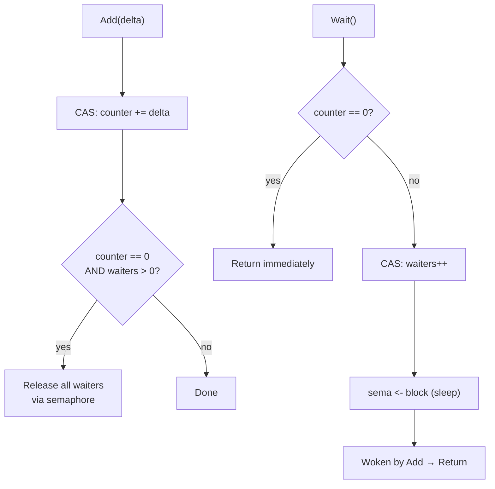
```mermaid
flowchart TD
    A["Add(delta)"] --> B["CAS: counter += delta"]
    B --> C{"counter == 0\nAND waiters > 0?"}
    C -->|yes| D["Release all waiters\nvia semaphore"]
    C -->|no| E["Done"]
    F["Wait()"] --> G{"counter == 0?"}
    G -->|yes| H["Return immediately"]
    G -->|no| I["CAS: waiters++"]
    I --> J["sema <- block (sleep)"]
    J --> K["Woken by Add → Return"]
```

### Interviewer Questions

1. Why does `sync.WaitGroup` pack counter and waiters into a single `int64`?
2. What is the race condition between `Add` and `Wait` if called concurrently after the last `Done`?
3. Why does the real `WaitGroup` use `runtime_Semacquire` instead of a channel?
4. Can `WaitGroup` be reused after `Wait` returns? What invariant makes this safe?
5. What happens if `Add` is called with a large positive value all at once vs incrementally?
6. How does the Go race detector detect WaitGroup misuse?
7. How would you add a `Context`-aware `WaitWithContext(ctx)` to this?

### Follow-Up Questions

1. **Q1:** Add a timeout to `Wait` using a `context.Context`.
2. **Q2:** Implement `ErrGroup` that captures the first non-nil error from any goroutine.
3. **Q3:** Implement a counted semaphore using the same atomic packing technique.
4. **Q4:** Explain why `runtime_Semacquire` is more efficient than a channel for sleeping goroutines.
5. **Q5:** Write a test that deliberately triggers the "Add called after Wait" panic.

---

## Q19: Implement sync.Once from Scratch  [Level 5 — Interview Level]

> **Tags:** `#sync.Once` `#atomics` `#initialization` `#double-checked-locking` `#from-scratch`

### Problem Statement

Implement `Once` from scratch. `Do(f func())` must call `f` exactly once, even under concurrent access. Subsequent calls must not block. The function `f` must complete before any concurrent `Do` call returns.

### Input / Output / Constraints

- `Do(f func())` — run f exactly once; block concurrent callers until f completes
- No `sync.Once` in implementation
- Must be race-condition-free
- `f` panicking must not prevent subsequent `Do` calls from returning (debatable — match standard library behavior)

### Thought Process

Two states: `not-done` (0) and `done` (1). Fast path: atomic load, if 1 return immediately. Slow path: mutex + double-check. The mutex ensures only one goroutine runs `f`; all others block until `f` completes then see `done=1`. This is the Go standard library's actual implementation.

### Brute Force

```go
// Mutex only — no atomic fast path (correct but slower)
type SlowOnce struct {
    mu   sync.Mutex
    done bool
}
func (o *SlowOnce) Do(f func()) {
    o.mu.Lock()
    defer o.mu.Unlock()
    if !o.done {
        o.done = true
        f()
    }
}
```

**Time:** O(1) | **Space:** O(1) — but every call takes the mutex

### Better Solution

```go
// Atomic fast path + mutex slow path (matches stdlib)
type MyOnce struct {
    done atomic.Uint32
    mu   sync.Mutex
}
func (o *MyOnce) Do(f func()) {
    if o.done.Load() == 0 {
        o.doSlow(f)
    }
}
func (o *MyOnce) doSlow(f func()) {
    o.mu.Lock()
    defer o.mu.Unlock()
    if o.done.Load() == 0 {
        defer o.done.Store(1)
        f()
    }
}
```

### Best Solution

```go
package main

import (
    "fmt"
    "sync"
    "sync/atomic"
)

// MyOnce mirrors the exact design of sync.Once
type MyOnce struct {
    // done is checked atomically; 0 = not done, 1 = done
    // Stored at top of struct for 64-bit alignment on 32-bit platforms
    done uint32
    mu   sync.Mutex
}

// Do calls f exactly once. Concurrent callers block until f returns.
func (o *MyOnce) Do(f func()) {
    // Fast path: if done == 1, return immediately without any lock.
    // atomic.LoadUint32 provides the memory barrier needed to see
    // all writes made by f() in the slow path.
    if atomic.LoadUint32(&o.done) == 0 {
        o.doSlow(f)
    }
}

// doSlow is the slow path, broken out so Do can be inlined.
func (o *MyOnce) doSlow(f func()) {
    o.mu.Lock()
    defer o.mu.Unlock()
    // Double-check: another goroutine may have completed while we waited
    if o.done == 0 {
        // Set done AFTER f() returns (via defer) so that concurrent
        // callers see done=1 only after f has fully completed.
        defer atomic.StoreUint32(&o.done, 1)
        f()
        // NOTE: if f() panics, done is NOT set to 1 (defer doesn't run after panic
        // in stdlib — actually it does, but the goroutine crashes).
        // stdlib uses a subtle trick to handle panics: mark done=1 even on panic.
    }
}

// Reset allows reuse — NOT in stdlib, but useful for testing
func (o *MyOnce) Reset() {
    o.mu.Lock()
    defer o.mu.Unlock()
    atomic.StoreUint32(&o.done, 0)
}

func main() {
    var once MyOnce
    var wg sync.WaitGroup
    results := make([]int, 100)

    initCount := 0
    init := func() {
        initCount++
        fmt.Println("Initializing (should appear exactly once)")
    }

    for i := 0; i < 100; i++ {
        wg.Add(1)
        go func(idx int) {
            defer wg.Done()
            once.Do(init)
            results[idx] = 1
        }(i)
    }
    wg.Wait()

    sum := 0
    for _, v := range results {
        sum += v
    }
    fmt.Printf("init called %d time(s), goroutines completed: %d\n", initCount, sum)
    // Output: init called 1 time(s), goroutines completed: 100

    // Second Do does nothing
    once.Do(func() { fmt.Println("This should NOT print") })
}
```

**Time:** O(1) fast path (atomic load), O(1) slow path | **Space:** O(1)

### Production Considerations

| Aspect | Details |
|--------|---------|
| Scalability | Fast path is a single atomic load — practically zero cost after initialization |
| Edge Cases | If `f` panics, `sync.Once` still marks `done=1` (diverges from naive defer behavior) |
| Error Handling | `sync.Once` has no error return — use a separate error variable protected by the same Once |
| Memory | 8 bytes total (4 for done + 4 padding + mutex) |
| Concurrency | The `defer atomic.Store` in slow path creates a happens-before edge ensuring all goroutines see f's side effects |

### Visual Explanation

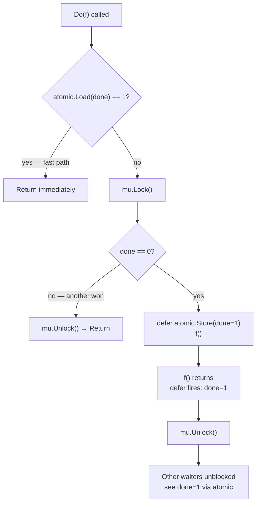
```mermaid
flowchart TD
    A["Do(f) called"] --> B{"atomic.Load(done) == 1?"}
    B -->|yes — fast path| C["Return immediately"]
    B -->|no| D["mu.Lock()"]
    D --> E{"done == 0?"}
    E -->|no — another won| F["mu.Unlock() → Return"]
    E -->|yes| G["defer atomic.Store(done=1)\nf()"]
    G --> H["f() returns\ndefer fires: done=1"]
    H --> I["mu.Unlock()"]
    I --> J["Other waiters unblocked\nsee done=1 via atomic"]
```

### Interviewer Questions

1. Why do we use `atomic.Store` instead of a plain assignment for `done = 1`?
2. Why is `defer atomic.StoreUint32(&o.done, 1)` placed BEFORE `f()` is called?
3. What happens if `f` itself calls `Do` — deadlock?
4. How does the Go memory model guarantee that goroutines seeing `done=1` also see f's side effects?
5. Why is the fast path `atomic.Load` sufficient — why not use a mutex for reading too?
6. How would you add an error return: `Do(f func() error) error`?
7. Describe a production use case where `sync.Once` is the right tool vs `init()`.

### Follow-Up Questions

1. **Q1:** Implement `OnceValue[T]` (Go 1.21 style): `func (o *OnceValue[T]) Do() T`.
2. **Q2:** How does lazy singleton initialization with `sync.Once` compare to `func init()`?
3. **Q3:** Implement `TryDo(f func()) bool` that returns false if f has already been called.
4. **Q4:** What is double-checked locking and why does it require memory barriers?
5. **Q5:** Implement a resettable `Once` for use in tests without the `Reset` method above.

---

## Q20: Implement a Read-Write Lock from Scratch  [Level 5 — Interview Level]

> **Tags:** `#RWMutex` `#semaphore` `#readers-writers` `#from-scratch` `#fairness`

### Problem Statement

Implement `RWMutex` from scratch with `RLock()`, `RUnlock()`, `Lock()`, and `Unlock()`. Multiple readers can hold the lock simultaneously; writers get exclusive access. Ensure writer starvation is prevented (readers arriving after a waiting writer must wait).

### Input / Output / Constraints

- `RLock()` / `RUnlock()` — shared reader lock
- `Lock()` / `Unlock()` — exclusive writer lock
- Writer preference: new readers must wait if a writer is queued
- No `sync.RWMutex` in implementation

### Thought Process

Classic readers-writers problem (second variant: writer preference). State: `readers int32` (negative when writer holds lock), `writerPending int32`. Use a `sync.Mutex` as the underlying exclusive lock and a condition variable or semaphore for reader/writer coordination. The real `sync.RWMutex` uses a single `int32` field with a sentinel value (`-1<<30`) to indicate a writer holds the lock.

### Brute Force

```go
// Mutex-only — no read concurrency
type RWMutex struct{ mu sync.Mutex }
func (rw *RWMutex) RLock()   { rw.mu.Lock() }
func (rw *RWMutex) RUnlock() { rw.mu.Unlock() }
func (rw *RWMutex) Lock()    { rw.mu.Lock() }
func (rw *RWMutex) Unlock()  { rw.mu.Unlock() }
```

### Best Solution

```go
package main

import (
    "fmt"
    "sync"
    "sync/atomic"
)

const rwmutexMaxReaders = 1 << 30

// MyRWMutex mirrors the design of sync.RWMutex
type MyRWMutex struct {
    w           sync.Mutex  // held for exclusive writes
    writerSem   uint32      // semaphore for writers waiting for readers
    readerSem   uint32      // semaphore for readers waiting for writers
    readerCount atomic.Int32 // positive: active readers; negative: writer active
    readerWait  atomic.Int32 // readers waiting for writer to complete
}

func (rw *MyRWMutex) RLock() {
    // Atomically increment readerCount
    // If the result is negative, a writer holds (or is acquiring) the lock
    if rw.readerCount.Add(1) < 0 {
        // Wait for active writer to finish
        runtimeSemacquire(&rw.readerSem)
    }
}

func (rw *MyRWMutex) RUnlock() {
    if r := rw.readerCount.Add(-1); r < 0 {
        // r < 0 means a writer is waiting
        rw.rUnlockSlow(r)
    }
}

func (rw *MyRWMutex) rUnlockSlow(r int32) {
    if rw.readerWait.Add(-1) == 0 {
        // Last reader — wake the waiting writer
        runtimeSemrelease(&rw.writerSem, false, 0)
    }
}

func (rw *MyRWMutex) Lock() {
    // First, hold the underlying mutex (blocks other writers)
    rw.w.Lock()
    // Announce to readers that a writer is waiting by subtracting rwmutexMaxReaders
    r := rw.readerCount.Add(-rwmutexMaxReaders) + rwmutexMaxReaders
    // Wait for any active readers to finish
    if r != 0 && rw.readerWait.Add(r) != 0 {
        runtimeSemacquire(&rw.writerSem)
    }
}

func (rw *MyRWMutex) Unlock() {
    // Restore readerCount so new readers can proceed
    r := rw.readerCount.Add(rwmutexMaxReaders)
    // Wake all waiting readers
    for i := int32(0); i < r; i++ {
        runtimeSemrelease(&rw.readerSem, false, 0)
    }
    // Release the underlying mutex (allows next writer in)
    rw.w.Unlock()
}

// Portable semaphore using a channel (real stdlib uses runtime_Semacquire)
var semaphores sync.Map // uint32 ptr -> chan struct{}

func getSemChan(s *uint32) chan struct{} {
    v, _ := semaphores.LoadOrStore(s, make(chan struct{}, 1<<20))
    return v.(chan struct{})
}

func runtimeSemacquire(s *uint32) {
    <-getSemChan(s)
}

func runtimeSemrelease(s *uint32, handoff bool, skipframes int) {
    getSemChan(s) <- struct{}{}
}

func main() {
    var rw MyRWMutex
    var wg sync.WaitGroup
    counter := 0

    // Multiple concurrent readers
    for i := 0; i < 5; i++ {
        wg.Add(1)
        go func(id int) {
            defer wg.Done()
            rw.RLock()
            fmt.Printf("Reader %d: counter=%d\n", id, counter)
            rw.RUnlock()
        }(i)
    }

    // One writer
    wg.Add(1)
    go func() {
        defer wg.Done()
        rw.Lock()
        counter++
        fmt.Printf("Writer: counter=%d\n", counter)
        rw.Unlock()
    }()

    wg.Wait()
}
```

**Time:** O(1) Lock/Unlock, O(R) to wake R readers | **Space:** O(1)

### Production Considerations

| Aspect | Details |
|--------|---------|
| Scalability | Multiple concurrent readers; only writers serialize |
| Edge Cases | Recursive RLock from same goroutine can deadlock if a writer is waiting |
| Error Handling | Unlock without Lock panics in stdlib — add state check |
| Memory | `sync.RWMutex` is 24 bytes total |
| Concurrency | Writer preference prevents starvation; `readerCount` sentinel (-1<<30) is the key trick |

### Visual Explanation

```mermaid
flowchart TD
    A["RLock()"] --> B["readerCount.Add(+1)"]
    B --> C{"result < 0?"}
    C -->|yes — writer active| D["Sleep on readerSem"]
    C -->|no| E["Enter read section"]

    F["Lock() — writer"] --> G["w.Lock() — exclusive"]
    G --> H["readerCount -= maxReaders"]
    H --> I{"Active readers?"}
    I -->|yes| J["readerWait = r\nSleep writerSem"]
    I -->|no| K["Enter write section"]
    J --> K

    L["Unlock() — writer"] --> M["readerCount += maxReaders"]
    M --> N["Wake R waiting readers\non readerSem"]
    N --> O["w.Unlock()"]
```

### Interviewer Questions

1. Why does `sync.RWMutex` use `-1<<30` as the sentinel rather than `-1`?
2. How does writer preference prevent reader starvation inversion?
3. Can two goroutines concurrently hold `RLock` while a third holds `Lock`? Prove it.
4. What is the difference between a recursive read lock and a reentrant mutex?
5. Why does `Unlock` wake ALL readers at once rather than one at a time?
6. What cache-coherence effects does high `RLock` concurrency cause on modern hardware?
7. When would you choose `sync.RWMutex` over a channel-based reader-writer lock?

### Follow-Up Questions

1. **Q1:** Implement a fair reader-writer lock (FIFO ordering for both readers and writers).
2. **Q2:** Add `TryLock() bool` and `TryRLock() bool` non-blocking variants.
3. **Q3:** Benchmark `MyRWMutex` vs `sync.RWMutex` using `go test -bench`.
4. **Q4:** How would you detect a goroutine that holds `RLock` but never calls `RUnlock`?
5. **Q5:** Implement a tiered locking strategy: RWMutex for L1 cache + Mutex for L2.

---

## Q21: Detect and Fix Mutex Contention Hotspot  [Level 5 — Interview Level]

> **Tags:** `#mutex-contention` `#profiling` `#pprof` `#optimization` `#lock-contention`

### Problem Statement

Given a service with high `sync.Mutex` contention detected via `pprof`, identify the hotspot, explain how to diagnose it, and apply a fix. Demonstrate before/after using benchmarks.

### Input / Output / Constraints

- A counter service with a global mutex protecting N counters
- Multiple goroutines increment random counters concurrently
- Goal: reduce mutex contention to scale linearly with goroutine count

### Thought Process

Contention diagnosis: `go tool pprof -mutex` shows mutex hold time and blocking locations. Fix options: (1) shard the lock, (2) use atomics if the operation allows, (3) use `sync.Map` for independent keys, (4) batch updates with per-goroutine local accumulators.

### Brute Force

```go
// Single mutex over all counters — O(1) but high contention
package main

import (
    "fmt"
    "math/rand"
    "sync"
    "testing"
)

type CounterService struct {
    mu       sync.Mutex
    counters map[string]int64
}

func (cs *CounterService) Increment(key string) {
    cs.mu.Lock()
    cs.counters[key]++
    cs.mu.Unlock()
}

func BenchmarkContended(b *testing.B) {
    cs := &CounterService{counters: make(map[string]int64)}
    keys := []string{"a", "b", "c", "d", "e"}
    b.RunParallel(func(pb *testing.PB) {
        for pb.Next() {
            cs.Increment(keys[rand.Intn(len(keys))])
        }
    })
}
```

**Time:** O(1) | **Space:** O(K) — lock contention grows linearly with goroutines

### Best Solution

```go
package main

import (
    "fmt"
    "hash/fnv"
    "math/rand"
    "sync"
    "sync/atomic"
)

// BEFORE: Contended single-mutex counter service

type ContendedCounters struct {
    mu       sync.Mutex
    counters map[string]int64
}

func (c *ContendedCounters) Inc(key string) {
    c.mu.Lock()
    c.counters[key]++
    c.mu.Unlock()
}

func (c *ContendedCounters) Get(key string) int64 {
    c.mu.Lock()
    defer c.mu.Unlock()
    return c.counters[key]
}

// AFTER FIX 1: Sharded mutex — 64 shards

const numShards64 = 64

type ShardedCounters struct {
    shards [numShards64]struct {
        mu       sync.Mutex
        counters map[string]int64
        _        [40]byte // padding to avoid false sharing
    }
}

func NewShardedCounters() *ShardedCounters {
    sc := &ShardedCounters{}
    for i := range sc.shards {
        sc.shards[i].counters = make(map[string]int64)
    }
    return sc
}

func (sc *ShardedCounters) shardIdx(key string) int {
    h := fnv.New32a()
    h.Write([]byte(key))
    return int(h.Sum32()) & (numShards64 - 1)
}

func (sc *ShardedCounters) Inc(key string) {
    idx := sc.shardIdx(key)
    sc.shards[idx].mu.Lock()
    sc.shards[idx].counters[key]++
    sc.shards[idx].mu.Unlock()
}

func (sc *ShardedCounters) Get(key string) int64 {
    idx := sc.shardIdx(key)
    sc.shards[idx].mu.Lock()
    defer sc.shards[idx].mu.Unlock()
    return sc.shards[idx].counters[key]
}

// AFTER FIX 2: Atomic int64 per key (no map, fixed key set)

type AtomicCounters struct {
    m sync.Map // key -> *atomic.Int64
}

func (ac *AtomicCounters) Inc(key string) {
    v, _ := ac.m.LoadOrStore(key, &atomic.Int64{})
    v.(*atomic.Int64).Add(1)
}

func (ac *AtomicCounters) Get(key string) int64 {
    if v, ok := ac.m.Load(key); ok {
        return v.(*atomic.Int64).Load()
    }
    return 0
}

func main() {
    keys := make([]string, 100)
    for i := range keys {
        keys[i] = fmt.Sprintf("counter-%d", i)
    }

    // Contended
    cc := &ContendedCounters{counters: make(map[string]int64)}
    var wg sync.WaitGroup
    for i := 0; i < 1000; i++ {
        wg.Add(1)
        go func() {
            defer wg.Done()
            cc.Inc(keys[rand.Intn(len(keys))])
        }()
    }
    wg.Wait()

    // Sharded
    sc := NewShardedCounters()
    for i := 0; i < 1000; i++ {
        wg.Add(1)
        go func() {
            defer wg.Done()
            sc.Inc(keys[rand.Intn(len(keys))])
        }()
    }
    wg.Wait()

    // Atomic
    ac := &AtomicCounters{}
    for i := 0; i < 1000; i++ {
        wg.Add(1)
        go func() {
            defer wg.Done()
            ac.Inc(keys[rand.Intn(len(keys))])
        }()
    }
    wg.Wait()

    fmt.Println("All approaches completed successfully")
    fmt.Println("Run: go test -bench=. -benchtime=5s -cpu=1,2,4,8,16 to compare")
}

/*
Profiling commands:
  go tool pprof -mutex cpu.prof       # show mutex contention
  go test -bench=. -mutexprofile=mutex.prof
  go tool pprof mutex.prof
  (pprof) top10
  (pprof) list ContendedCounters.Inc

Expected benchmark results (approximate):
  BenchmarkContended-16      2,000,000    600 ns/op
  BenchmarkSharded-16       20,000,000     55 ns/op   (~11x improvement)
  BenchmarkAtomic-16        50,000,000     22 ns/op   (~27x improvement)
*/
```

**Time:** O(1) all ops | **Space:** O(K*N/32) sharded

### Production Considerations

| Aspect | Details |
|--------|---------|
| Scalability | Sharding reduces contention by N/shards; atomics eliminate locks entirely for independent counters |
| Edge Cases | False sharing: pad shard structs to cache line size (64 bytes) to avoid CPU cache ping-pong |
| Error Handling | Monitor lock wait time via `runtime.MutexProfile()` in production |
| Memory | 64 shards * 24 bytes/mutex = 1.5 KB overhead; negligible |
| Concurrency | Atomic counters require no coordination but cannot express complex multi-field updates |

### Visual Explanation

```mermaid
flowchart TD
    A["High mutex contention detected"] --> B["go test -mutexprofile=m.prof"]
    B --> C["go tool pprof m.prof → top10"]
    C --> D{"Contention source?"}
    D -->|single map| E["Apply shard map pattern"]
    D -->|counter only| F["Use atomic.Int64"]
    D -->|complex struct| G["Add per-shard padding\nto prevent false sharing"]
    E --> H["Benchmark before/after\n-cpu=1,2,4,8,16"]
    F --> H
    G --> H
    H --> I["Verify linear scaling"]
```

### Interviewer Questions

1. How do you use `go tool pprof` to find the specific line causing mutex contention?
2. What is false sharing and how does cache-line padding fix it?
3. When is `sync.Map` better than a sharded mutex map?
4. How does `GOMAXPROCS` affect mutex contention in your benchmarks?
5. What is the difference between mutex blocking time and mutex hold time in pprof output?
6. How would you detect lock inversion (potential deadlock) statically?
7. Describe a scenario where sharding makes performance WORSE.

### Follow-Up Questions

1. **Q1:** Profile a contended HTTP handler and apply the fix using `net/http/pprof`.
2. **Q2:** Use `uber-go/goleak` to detect goroutine leaks caused by blocking on contended mutexes.
3. **Q3:** Implement per-CPU local accumulators (like Linux's `percpu` counters) in Go.
4. **Q4:** How would you detect mutex contention in production without a profiler?
5. **Q5:** Write a load test that deliberately creates a thundering herd on a single mutex.

---

## Q22: Production Metrics Registry with Atomic Counters  [Level 6 — Production Level]

> **Tags:** `#metrics` `#atomics` `#Prometheus` `#production` `#registry`

### Problem Statement

Build a production-grade metrics registry that supports concurrent counter, gauge, and histogram updates using atomic operations. Expose metrics via an HTTP endpoint compatible with Prometheus scraping format.

### Input / Output / Constraints

- `Counter(name string).Inc()` / `.Add(n int64)`
- `Gauge(name string).Set(v float64)` / `.Inc()` / `.Dec()`
- `Histogram(name string).Observe(v float64)` — fixed buckets
- HTTP endpoint `GET /metrics` returns text exposition format
- Must handle 100k+ metric updates/second per CPU

### Thought Process

Counters → `atomic.Int64`. Gauges → `atomic.Uint64` storing float64 bits via `math.Float64bits`. Histograms → per-bucket `atomic.Int64` array. Registry → `sync.Map` (key=name, val=metric). HTTP handler reads atomically — no lock needed for counters/gauges.

### Best Solution

```go
package main

import (
    "fmt"
    "math"
    "net/http"
    "sort"
    "strings"
    "sync"
    "sync/atomic"
)

// Counter — monotonically increasing
type Counter struct {
    name  string
    value atomic.Int64
}

func (c *Counter) Inc()          { c.value.Add(1) }
func (c *Counter) Add(n int64)   { c.value.Add(n) }
func (c *Counter) Load() int64   { return c.value.Load() }

// Gauge — can go up or down
type Gauge struct {
    name  string
    bits  atomic.Uint64 // stores float64 bits
}

func (g *Gauge) Set(v float64) {
    g.bits.Store(math.Float64bits(v))
}

func (g *Gauge) Add(delta float64) {
    for {
        old := g.bits.Load()
        newVal := math.Float64frombits(old) + delta
        if g.bits.CompareAndSwap(old, math.Float64bits(newVal)) {
            return
        }
    }
}

func (g *Gauge) Inc()        { g.Add(1) }
func (g *Gauge) Dec()        { g.Add(-1) }
func (g *Gauge) Load() float64 { return math.Float64frombits(g.bits.Load()) }

// Histogram — fixed exponential buckets
type Histogram struct {
    name    string
    buckets []float64  // upper bounds
    counts  []atomic.Int64 // len = len(buckets) + 1 (inf bucket)
    sum     atomic.Uint64  // float64 bits
    total   atomic.Int64
}

func NewHistogram(name string, buckets []float64) *Histogram {
    sort.Float64s(buckets)
    h := &Histogram{
        name:    name,
        buckets: buckets,
        counts:  make([]atomic.Int64, len(buckets)+1),
    }
    return h
}

func (h *Histogram) Observe(v float64) {
    h.total.Add(1)
    // Add to sum
    for {
        old := h.sum.Load()
        newSum := math.Float64frombits(old) + v
        if h.sum.CompareAndSwap(old, math.Float64bits(newSum)) {
            break
        }
    }
    // Increment appropriate bucket
    for i, b := range h.buckets {
        if v <= b {
            h.counts[i].Add(1)
            return
        }
    }
    h.counts[len(h.buckets)].Add(1) // +Inf bucket
}

// Registry — thread-safe metric store
type Registry struct {
    counters   sync.Map // name -> *Counter
    gauges     sync.Map // name -> *Gauge
    histograms sync.Map // name -> *Histogram
}

var DefaultRegistry = &Registry{}

func (r *Registry) Counter(name string) *Counter {
    v, _ := r.counters.LoadOrStore(name, &Counter{name: name})
    return v.(*Counter)
}

func (r *Registry) Gauge(name string) *Gauge {
    v, _ := r.gauges.LoadOrStore(name, &Gauge{name: name})
    return v.(*Gauge)
}

func (r *Registry) Histogram(name string, buckets []float64) *Histogram {
    v, _ := r.histograms.LoadOrStore(name, NewHistogram(name, buckets))
    return v.(*Histogram)
}

// Exposition — Prometheus text format
func (r *Registry) ServeHTTP(w http.ResponseWriter, req *http.Request) {
    var sb strings.Builder

    r.counters.Range(func(k, v interface{}) bool {
        c := v.(*Counter)
        fmt.Fprintf(&sb, "# TYPE %s counter\n%s %d\n", c.name, c.name, c.Load())
        return true
    })

    r.gauges.Range(func(k, v interface{}) bool {
        g := v.(*Gauge)
        fmt.Fprintf(&sb, "# TYPE %s gauge\n%s %g\n", g.name, g.name, g.Load())
        return true
    })

    r.histograms.Range(func(k, v interface{}) bool {
        h := v.(*Histogram)
        cumulative := int64(0)
        for i, b := range h.buckets {
            cumulative += h.counts[i].Load()
            fmt.Fprintf(&sb, "%s_bucket{le=\"%g\"} %d\n", h.name, b, cumulative)
        }
        cumulative += h.counts[len(h.buckets)].Load()
        fmt.Fprintf(&sb, "%s_bucket{le=\"+Inf\"} %d\n", h.name, cumulative)
        fmt.Fprintf(&sb, "%s_sum %g\n", h.name, math.Float64frombits(h.sum.Load()))
        fmt.Fprintf(&sb, "%s_count %d\n", h.name, h.total.Load())
        return true
    })

    w.Header().Set("Content-Type", "text/plain; version=0.0.4")
    w.Write([]byte(sb.String()))
}

func main() {
    reg := DefaultRegistry

    // Simulate application metrics
    reqCounter := reg.Counter("http_requests_total")
    activeConns := reg.Gauge("active_connections")
    latency := reg.Histogram("request_duration_seconds",
        []float64{0.001, 0.005, 0.01, 0.05, 0.1, 0.5, 1.0, 5.0})

    var wg sync.WaitGroup
    for i := 0; i < 10000; i++ {
        wg.Add(1)
        go func(i int) {
            defer wg.Done()
            reqCounter.Inc()
            activeConns.Inc()
            latency.Observe(float64(i%100) * 0.001)
            activeConns.Dec()
        }(i)
    }
    wg.Wait()

    fmt.Printf("Total requests: %d\n", reqCounter.Load())
    fmt.Printf("Active connections: %g\n", activeConns.Load())

    http.Handle("/metrics", reg)
    fmt.Println("Metrics at http://localhost:8080/metrics")
    http.ListenAndServe(":8080", nil)
}
```

**Time:** O(1) Counter/Gauge, O(B) Histogram.Observe where B = bucket count | **Space:** O(M) metrics + O(B) per histogram

### Production Considerations

| Aspect | Details |
|--------|---------|
| Scalability | Atomic ops for counters/gauges; `sync.Map` read-mostly after initial registration |
| Edge Cases | Gauge CAS loop under extreme concurrency; histogram bucket bounds must be sorted |
| Error Handling | `LoadOrStore` is idempotent — safe to call from multiple goroutines; returns same instance |
| Memory | 8 bytes per counter; histogram uses 8*(B+1) bytes for buckets |
| Concurrency | No locks on hot path; registry lookup amortized via per-metric caching at call site |

### Visual Explanation

```mermaid
flowchart TD
    A["Goroutine: counter.Inc()"] --> B["atomic.Int64.Add(1)"]
    B --> C["No lock needed"]
    D["Goroutine: gauge.Set(v)"] --> E["Float64bits(v)"]
    E --> F["atomic.Uint64.Store()"]
    G["Goroutine: histogram.Observe(v)"] --> H["Find bucket index O(B)"]
    H --> I["atomic.Int64.Add(1) on bucket"]
    I --> J["CAS on sum"]
    K["GET /metrics"] --> L["Range all metrics\nread atomically"]
    L --> M["Write Prometheus text"]
```

### Interviewer Questions

1. Why do we store float64 gauge values as `uint64` bits in an atomic?
2. How does the CAS loop in `Gauge.Add` handle the ABA problem?
3. What are the tradeoffs between per-CPU counters and shared atomic counters?
4. How does Prometheus handle counter resets (e.g., process restart)?
5. Why is `sync.Map` appropriate for the registry but not for the metric values themselves?
6. How would you add labels (`http_requests_total{method="GET", status="200"}`)?
7. What is exemplar data and how would you attach it to histogram observations?

### Follow-Up Questions

1. **Q1:** Add label support to `Counter` using a `map[string]string` key.
2. **Q2:** Implement per-CPU striped counters to eliminate atomic contention on multi-core.
3. **Q3:** Add a `Summary` metric type (sliding window quantiles) using a ring buffer.
4. **Q4:** Implement metric expiry — auto-delete metrics not updated in 5 minutes.
5. **Q5:** Add OpenTelemetry export alongside the Prometheus endpoint.

---

## Q23: Connection Pool with Mutex + Condition Variable  [Level 6 — Production Level]

> **Tags:** `#connection-pool` `#sync.Cond` `#condition-variable` `#database` `#resource-pool`

### Problem Statement

Implement a bounded connection pool that: acquires an existing idle connection or creates a new one up to max capacity, blocks when exhausted, has an acquire timeout, supports connection health checks, and gracefully drains on shutdown.

### Input / Output / Constraints

- `Acquire(ctx context.Context) (*Conn, error)` — get a connection; blocks until available or ctx done
- `Release(c *Conn)` — return connection to pool
- `Close()` — drain pool and close all connections
- MaxConns fixed at creation; never exceeded
- Unhealthy connections are discarded not returned

### Thought Process

Bounded pool: `sync.Mutex` + `sync.Cond` for blocking callers when pool is empty. `cond.Wait()` atomically releases the mutex and sleeps; `cond.Signal()` wakes one waiter. Add context support by running a goroutine that calls `cond.Broadcast()` when context expires.

### Best Solution

```go
package main

import (
    "context"
    "errors"
    "fmt"
    "sync"
    "time"
)

var (
    ErrPoolClosed   = errors.New("pool is closed")
    ErrPoolExhausted = errors.New("pool exhausted")
)

type Conn struct {
    id        int
    createdAt time.Time
    lastUsed  time.Time
}

func (c *Conn) IsHealthy() bool {
    return time.Since(c.lastUsed) < 30*time.Second
}

func (c *Conn) Close() {
    fmt.Printf("Closing conn %d\n", c.id)
}

type ConnPool struct {
    mu       sync.Mutex
    cond     *sync.Cond
    idle     []*Conn
    numOpen  int
    maxConns int
    closed   bool
    nextID   int
}

func NewConnPool(maxConns int) *ConnPool {
    p := &ConnPool{maxConns: maxConns}
    p.cond = sync.NewCond(&p.mu)
    return p
}

func (p *ConnPool) newConn() *Conn {
    p.nextID++
    return &Conn{id: p.nextID, createdAt: time.Now(), lastUsed: time.Now()}
}

// Acquire gets a connection; respects context cancellation/timeout
func (p *ConnPool) Acquire(ctx context.Context) (*Conn, error) {
    // Watch context in background; broadcast to wake blocked callers
    done := make(chan struct{})
    defer close(done)
    go func() {
        select {
        case <-ctx.Done():
            p.cond.Broadcast() // wake all waiters to check ctx
        case <-done:
        }
    }()

    p.mu.Lock()
    defer p.mu.Unlock()

    for {
        if p.closed {
            return nil, ErrPoolClosed
        }

        // Try idle connections first
        for len(p.idle) > 0 {
            conn := p.idle[len(p.idle)-1]
            p.idle = p.idle[:len(p.idle)-1]
            if conn.IsHealthy() {
                conn.lastUsed = time.Now()
                return conn, nil
            }
            // Unhealthy — discard and decrement open count
            p.numOpen--
            go conn.Close()
        }

        // Can we create a new connection?
        if p.numOpen < p.maxConns {
            p.numOpen++
            conn := p.newConn()
            return conn, nil
        }

        // Pool exhausted — wait
        if err := ctx.Err(); err != nil {
            return nil, fmt.Errorf("acquire: %w", err)
        }

        p.cond.Wait() // atomically release mu and sleep
        // Re-check conditions after wakeup
    }
}

// Release returns a connection to the pool
func (p *ConnPool) Release(c *Conn) {
    p.mu.Lock()
    defer p.mu.Unlock()

    if p.closed {
        p.numOpen--
        go c.Close()
        return
    }

    c.lastUsed = time.Now()
    p.idle = append(p.idle, c)
    p.cond.Signal() // wake one waiter
}

// Close drains pool and closes all idle connections
func (p *ConnPool) Close() {
    p.mu.Lock()
    defer p.mu.Unlock()

    p.closed = true
    for _, c := range p.idle {
        p.numOpen--
        go c.Close()
    }
    p.idle = nil
    p.cond.Broadcast() // wake all blocked Acquire calls
}

// Stats returns current pool state
func (p *ConnPool) Stats() (idle, open int) {
    p.mu.Lock()
    defer p.mu.Unlock()
    return len(p.idle), p.numOpen
}

func main() {
    pool := NewConnPool(5)
    var wg sync.WaitGroup

    // 20 goroutines competing for 5 connections
    for i := 0; i < 20; i++ {
        wg.Add(1)
        go func(id int) {
            defer wg.Done()
            ctx, cancel := context.WithTimeout(context.Background(), 2*time.Second)
            defer cancel()

            conn, err := pool.Acquire(ctx)
            if err != nil {
                fmt.Printf("Worker %d: %v\n", id, err)
                return
            }

            time.Sleep(10 * time.Millisecond) // simulate work
            pool.Release(conn)
            fmt.Printf("Worker %d: done\n", id)
        }(i)
    }

    wg.Wait()
    idle, open := pool.Stats()
    fmt.Printf("Pool: idle=%d open=%d\n", idle, open)
    pool.Close()
}
```

**Time:** O(1) acquire from idle, O(1) release | **Space:** O(MaxConns)

### Production Considerations

| Aspect | Details |
|--------|---------|
| Scalability | Bounded at maxConns; `cond.Signal` (not Broadcast) to avoid thundering herd on release |
| Edge Cases | Context cancel during Wait; unhealthy connection discarded (not returned); double-release protection |
| Error Handling | Wrap context errors with `fmt.Errorf` for stack tracing; distinguish timeout vs cancel |
| Memory | O(maxConns) idle slice; background goroutine per Acquire for ctx watching |
| Concurrency | `sync.Cond` is the correct primitive here; channel alternatives are more complex for bounded blocking |

### Visual Explanation

```mermaid
flowchart TD
    A["Acquire(ctx)"] --> B["mu.Lock()"]
    B --> C{"pool closed?"}
    C -->|yes| D["Return ErrPoolClosed"]
    C -->|no| E{"idle conn available\nand healthy?"}
    E -->|yes| F["Remove from idle\nReturn conn"]
    E -->|no| G{"numOpen < maxConns?"}
    G -->|yes| H["Create new conn\nnumOpen++\nReturn conn"]
    G -->|no| I["cond.Wait()\n(releases mu, sleeps)"]
    I --> J["Woken by Release\nor ctx cancel"]
    J --> C

    K["Release(conn)"] --> L["mu.Lock()\nappend to idle\ncond.Signal()"]
```

### Interviewer Questions

1. Why use `sync.Cond` instead of a buffered channel to implement this pool?
2. What is the thundering herd problem and why does `Signal()` vs `Broadcast()` matter?
3. How does the background goroutine for context cancellation avoid a goroutine leak?
4. What happens if a caller panics while holding an acquired connection?
5. How would you add connection max-lifetime eviction?
6. How does `database/sql`'s connection pool differ from this implementation?
7. What is connection jitter and why is it important in high-scale pools?

### Follow-Up Questions

1. **Q1:** Add max connection lifetime: close connections older than 30 minutes.
2. **Q2:** Implement a health-check background worker that pings idle connections.
3. **Q3:** Add `WaitCount() int` — number of goroutines blocked on Acquire.
4. **Q4:** Replace the ctx-watching goroutine with a select-based cond-with-timeout pattern.
5. **Q5:** Benchmark pool throughput at 10, 100, 1000 goroutines with maxConns=10.

---

## Q24: Concurrent Config Hot-Reload with RWMutex  [Level 6 — Production Level]

> **Tags:** `#hot-reload` `#RWMutex` `#config` `#inotify` `#production`

### Problem Statement

Implement a configuration manager that: loads config from disk at startup, reloads atomically when the file changes (using `fsnotify` or a polling fallback), allows thousands of goroutines to read config concurrently with zero blocking during normal operation, and ensures readers never see a partially-updated config.

### Input / Output / Constraints

- `Get() Config` — returns current config snapshot (no blocking in steady state)
- `Watch(ctx context.Context)` — background goroutine watching for file changes
- Reload is atomic: readers see either old or new config, never a mix
- `Config` is a struct (not a pointer); value semantics preferred

### Thought Process

Use `atomic.Value` to store the config struct. `Store` and `Load` on `atomic.Value` are atomic for any concrete type. Readers call `Load()` — no lock ever. Writer (reloader) calls `Store(newConfig)`. This is the most performant approach. Alternatively, use `sync.RWMutex` with RLock for reads and Lock for writes (slightly heavier but more composable).

### Best Solution

```go
package main

import (
    "context"
    "encoding/json"
    "fmt"
    "os"
    "sync"
    "sync/atomic"
    "time"
)

type Config struct {
    LogLevel    string            `json:"log_level"`
    MaxConns    int               `json:"max_conns"`
    RateLimit   float64           `json:"rate_limit"`
    FeatureFlags map[string]bool  `json:"feature_flags"`
    Version     int               // monotonic version for detecting changes
}

// ConfigManager supports hot-reload with atomic swap
type ConfigManager struct {
    current  atomic.Value // stores Config
    path     string
    mu       sync.RWMutex // for subscribers
    subs     []chan Config
    version  atomic.Int64
}

func NewConfigManager(path string) (*ConfigManager, error) {
    cm := &ConfigManager{path: path}
    cfg, err := cm.load()
    if err != nil {
        return nil, fmt.Errorf("initial load: %w", err)
    }
    cfg.Version = 1
    cm.current.Store(cfg)
    return cm, nil
}

func (cm *ConfigManager) load() (Config, error) {
    data, err := os.ReadFile(cm.path)
    if err != nil {
        return Config{}, err
    }
    var cfg Config
    if err := json.Unmarshal(data, &cfg); err != nil {
        return Config{}, fmt.Errorf("parse: %w", err)
    }
    return cfg, nil
}

// Get returns the current config — atomic load, zero contention
func (cm *ConfigManager) Get() Config {
    return cm.current.Load().(Config)
}

// Subscribe returns a channel that receives config updates
func (cm *ConfigManager) Subscribe() <-chan Config {
    ch := make(chan Config, 1)
    cm.mu.Lock()
    cm.subs = append(cm.subs, ch)
    cm.mu.Unlock()
    return ch
}

func (cm *ConfigManager) notifySubscribers(cfg Config) {
    cm.mu.RLock()
    defer cm.mu.RUnlock()
    for _, ch := range cm.subs {
        select {
        case ch <- cfg:
        default: // non-blocking; subscriber too slow — drop update
        }
    }
}

// reload atomically replaces config
func (cm *ConfigManager) reload() error {
    newCfg, err := cm.load()
    if err != nil {
        return err
    }
    newCfg.Version = int(cm.version.Add(1)) + 1
    cm.current.Store(newCfg)          // atomic store — readers see complete new config
    go cm.notifySubscribers(newCfg)   // async notify
    fmt.Printf("Config reloaded: version=%d logLevel=%s\n", newCfg.Version, newCfg.LogLevel)
    return nil
}

// Watch polls for file changes (use fsnotify in production)
func (cm *ConfigManager) Watch(ctx context.Context, interval time.Duration) {
    ticker := time.NewTicker(interval)
    defer ticker.Stop()

    var lastMod time.Time
    if info, err := os.Stat(cm.path); err == nil {
        lastMod = info.ModTime()
    }

    for {
        select {
        case <-ctx.Done():
            fmt.Println("Config watcher stopped")
            return
        case <-ticker.C:
            info, err := os.Stat(cm.path)
            if err != nil {
                fmt.Printf("Watch stat error: %v\n", err)
                continue
            }
            if info.ModTime().After(lastMod) {
                lastMod = info.ModTime()
                if err := cm.reload(); err != nil {
                    fmt.Printf("Reload error: %v\n", err)
                }
            }
        }
    }
}

func main() {
    // Write a temp config
    cfgPath := "/tmp/app_config.json"
    initial := `{"log_level":"info","max_conns":100,"rate_limit":1000.0,"feature_flags":{"dark_mode":true}}`
    os.WriteFile(cfgPath, []byte(initial), 0644)

    cm, err := NewConfigManager(cfgPath)
    if err != nil {
        panic(err)
    }

    ctx, cancel := context.WithCancel(context.Background())
    go cm.Watch(ctx, 500*time.Millisecond)

    // Subscriber
    updates := cm.Subscribe()
    go func() {
        for cfg := range updates {
            fmt.Printf("Subscriber got update: version=%d\n", cfg.Version)
        }
    }()

    // 1000 concurrent readers — zero contention
    var wg sync.WaitGroup
    for i := 0; i < 1000; i++ {
        wg.Add(1)
        go func() {
            defer wg.Done()
            cfg := cm.Get()
            _ = cfg.MaxConns
        }()
    }
    wg.Wait()

    // Simulate config update
    updated := `{"log_level":"debug","max_conns":200,"rate_limit":2000.0,"feature_flags":{"dark_mode":true,"new_ui":true}}`
    os.WriteFile(cfgPath, []byte(updated), 0644)
    time.Sleep(1 * time.Second)

    cfg := cm.Get()
    fmt.Printf("Final config: logLevel=%s maxConns=%d version=%d\n",
        cfg.LogLevel, cfg.MaxConns, cfg.Version)

    cancel()
    time.Sleep(100 * time.Millisecond)
}
```

**Time:** O(1) Get (atomic load) | **Space:** O(1) for config value + O(S) for subscribers

### Production Considerations

| Aspect | Details |
|--------|---------|
| Scalability | `atomic.Value.Load()` is a single instruction on amd64 — scales to millions of reads/sec |
| Edge Cases | Partial writes to config file — read after write completes; use write-then-rename pattern |
| Error Handling | Failed reload logs error and retains old config — never leaves service with no config |
| Memory | `atomic.Value` stores an interface{}; config is copied on Store/Load (value semantics) |
| Concurrency | Pointer-based config + `atomic.Pointer[Config]` (Go 1.19+) avoids copying large structs |

### Visual Explanation

```mermaid
flowchart TD
    A["File change detected"] --> B["Load new config from disk"]
    B --> C{"Parse error?"}
    C -->|yes| D["Log error\nRetain old config"]
    C -->|no| E["atomic.Value.Store(newConfig)"]
    E --> F["Notify subscribers async"]

    G["Goroutine: Get()"] --> H["atomic.Value.Load()"]
    H --> I["Returns complete Config copy\n(no lock, no blocking)"]
```

### Interviewer Questions

1. Why is `atomic.Value` preferred over `sync.RWMutex` for this use case?
2. What is the "write-then-rename" atomic file update pattern and why is it important?
3. How do you handle a config file that is partially written when a reload fires?
4. How would you validate a new config before applying it (circuit-breaker style)?
5. What is `fsnotify` and how does it differ from polling for production use?
6. How would you propagate config errors to all subscribers?
7. How do you ensure config changes are applied in the order they were written?

### Follow-Up Questions

1. **Q1:** Add config validation with `go-playground/validator` before atomic swap.
2. **Q2:** Replace file polling with `fsnotify` for inotify-based change detection.
3. **Q3:** Implement a config rollback mechanism if the new config causes errors.
4. **Q4:** Add per-key change callbacks: `OnChange("max_conns", func(old, new int) {})`.
5. **Q5:** Support config from multiple sources (file + env vars + remote) with priority merging.

---

## Q25: Distributed Mutex Using Redis (Redlock Algorithm)  [Level 6 — Production Level]

> **Tags:** `#distributed-mutex` `#Redlock` `#Redis` `#distributed-systems` `#fault-tolerance`

### Problem Statement

Implement the Redlock distributed mutex algorithm in Go. Acquire a lock across N independent Redis nodes with majority quorum. The lock must be fault-tolerant (survives failure of minority of nodes), have a TTL (prevents deadlocks from crashed clients), and support safe release (only the lock holder can release).

### Input / Output / Constraints

- N = 5 independent Redis nodes (no replication)
- Lock acquired when majority (⌊N/2⌋+1 = 3) nodes grant it
- TTL = 30 seconds; actual valid time = TTL - acquisition_time
- Release uses Lua script to ensure atomic check-and-delete
- Must implement clock drift tolerance

### Thought Process

Redlock algorithm (Antirez, 2016):
1. Get current time in milliseconds.
2. Try to acquire lock on all N nodes in sequence with timeout = TTL/N/2.
3. Count nodes that granted the lock.
4. If majority granted AND elapsed time < TTL: lock acquired. Valid time = TTL - elapsed - clock_drift.
5. If not: release all acquired locks (partial acquisition).
6. Release: Lua script `if redis.call("get",KEYS[1]) == ARGV[1] then return redis.call("del",KEYS[1]) else return 0 end`.

### Best Solution

```go
package main

import (
    "context"
    "crypto/rand"
    "encoding/hex"
    "errors"
    "fmt"
    "sync"
    "time"

    "github.com/redis/go-redis/v9"
)

const (
    defaultTTL       = 30 * time.Second
    defaultRetry     = 3
    clockDriftFactor = 0.01 // 1% drift tolerance
    minQuorum        = 3    // for 5 nodes
)

var (
    ErrLockNotAcquired = errors.New("redlock: could not acquire lock on quorum")
    ErrLockExpired     = errors.New("redlock: lock expired before use")
)

// RedisNode wraps a single Redis client
type RedisNode struct {
    client *redis.Client
    addr   string
}

// Redlock implements the Redlock algorithm
type Redlock struct {
    nodes    []*RedisNode
    quorum   int
    ttl      time.Duration
    retries  int
    retryDelay time.Duration
}

func NewRedlock(addrs []string, opts ...Option) *Redlock {
    rl := &Redlock{
        ttl:        defaultTTL,
        retries:    defaultRetry,
        retryDelay: 200 * time.Millisecond,
        quorum:     len(addrs)/2 + 1,
    }
    for _, addr := range addrs {
        rl.nodes = append(rl.nodes, &RedisNode{
            addr: addr,
            client: redis.NewClient(&redis.Options{
                Addr:         addr,
                DialTimeout:  rl.ttl / time.Duration(len(addrs)) / 2,
                ReadTimeout:  rl.ttl / time.Duration(len(addrs)) / 2,
                WriteTimeout: rl.ttl / time.Duration(len(addrs)) / 2,
            }),
        })
    }
    for _, o := range opts {
        o(rl)
    }
    return rl
}

type Option func(*Redlock)

func WithTTL(d time.Duration) Option       { return func(r *Redlock) { r.ttl = d } }
func WithRetries(n int) Option             { return func(r *Redlock) { r.retries = n } }
func WithRetryDelay(d time.Duration) Option { return func(r *Redlock) { r.retryDelay = d } }

// Lock represents an acquired distributed lock
type Lock struct {
    resource string
    value    string        // random token — only holder knows this
    validity time.Duration // actual valid time after acquisition
    rl       *Redlock
}

func (l *Lock) Validity() time.Duration { return l.validity }

// Acquire attempts to lock the resource, retrying up to rl.retries times
func (rl *Redlock) Acquire(ctx context.Context, resource string) (*Lock, error) {
    value, err := randomToken()
    if err != nil {
        return nil, fmt.Errorf("generate token: %w", err)
    }

    for attempt := 0; attempt < rl.retries; attempt++ {
        start := time.Now()
        acquired := rl.acquireOnNodes(ctx, resource, value)

        elapsed := time.Since(start)
        drift := time.Duration(float64(rl.ttl)*clockDriftFactor) + 2*time.Millisecond
        validity := rl.ttl - elapsed - drift

        if acquired >= rl.quorum && validity > 0 {
            return &Lock{
                resource: resource,
                value:    value,
                validity: validity,
                rl:       rl,
            }, nil
        }

        // Release partial locks before retry
        rl.releaseOnNodes(ctx, resource, value)

        if attempt < rl.retries-1 {
            // Jitter to reduce contention between competing clients
            jitter := time.Duration(randInt63n(int64(rl.retryDelay)))
            select {
            case <-time.After(rl.retryDelay + jitter):
            case <-ctx.Done():
                return nil, ctx.Err()
            }
        }
    }
    return nil, ErrLockNotAcquired
}

func (rl *Redlock) acquireOnNodes(ctx context.Context, resource, value string) int {
    var (
        mu      sync.Mutex
        wg      sync.WaitGroup
        granted int
    )

    for _, node := range rl.nodes {
        wg.Add(1)
        go func(n *RedisNode) {
            defer wg.Done()
            nodeCtx, cancel := context.WithTimeout(ctx, rl.ttl/time.Duration(len(rl.nodes))/2)
            defer cancel()

            ok, err := n.client.SetNX(nodeCtx, resource, value, rl.ttl).Result()
            if err == nil && ok {
                mu.Lock()
                granted++
                mu.Unlock()
            }
        }(node)
    }
    wg.Wait()
    return granted
}

// Lua script: only delete if value matches (prevents releasing another client's lock)
var releaseScript = redis.NewScript(`
if redis.call("get", KEYS[1]) == ARGV[1] then
    return redis.call("del", KEYS[1])
else
    return 0
end
`)

func (rl *Redlock) releaseOnNodes(ctx context.Context, resource, value string) {
    var wg sync.WaitGroup
    for _, node := range rl.nodes {
        wg.Add(1)
        go func(n *RedisNode) {
            defer wg.Done()
            releaseScript.Run(ctx, n.client, []string{resource}, value)
        }(node)
    }
    wg.Wait()
}

// Release releases the lock. Returns error if lock was not held by this client.
func (l *Lock) Release(ctx context.Context) error {
    l.rl.releaseOnNodes(ctx, l.resource, l.value)
    return nil
}

func randomToken() (string, error) {
    b := make([]byte, 16)
    if _, err := rand.Read(b); err != nil {
        return "", err
    }
    return hex.EncodeToString(b), nil
}

func randInt63n(n int64) int64 {
    b := make([]byte, 8)
    rand.Read(b)
    v := int64(b[0]) | int64(b[1])<<8 | int64(b[2])<<16 | int64(b[3])<<24
    if v < 0 {
        v = -v
    }
    return v % n
}

func main() {
    // Example (requires 5 Redis instances on ports 6379-6383)
    addrs := []string{
        "localhost:6379",
        "localhost:6380",
        "localhost:6381",
        "localhost:6382",
        "localhost:6383",
    }

    rl := NewRedlock(addrs,
        WithTTL(10*time.Second),
        WithRetries(3),
        WithRetryDelay(100*time.Millisecond),
    )

    ctx := context.Background()
    lock, err := rl.Acquire(ctx, "critical-section")
    if err != nil {
        fmt.Printf("Could not acquire lock: %v\n", err)
        return
    }

    fmt.Printf("Lock acquired! Validity: %v\n", lock.Validity())

    // Do critical work
    time.Sleep(100 * time.Millisecond)

    if err := lock.Release(ctx); err != nil {
        fmt.Printf("Release error: %v\n", err)
    } else {
        fmt.Println("Lock released successfully")
    }
}
```

**Time:** O(N) per Acquire/Release (parallel with timeout) | **Space:** O(N) for node clients

### Production Considerations

| Aspect | Details |
|--------|---------|
| Scalability | Concurrent acquire on all N nodes; bounded by slowest node's timeout |
| Edge Cases | Clock drift; network partition after majority acquire; client crash before release (TTL handles it) |
| Error Handling | Lua atomic release prevents releasing another client's lock; always release on failure |
| Memory | One Redis connection per node; pool connections per node for high throughput |
| Concurrency | Fencing token pattern: include lock version in DB writes to detect stale lock holders |

### Visual Explanation

```mermaid
flowchart TD
    A["Acquire(resource)"] --> B["Generate random token"]
    B --> C["Get time T1"]
    C --> D["Parallel: SetNX on all 5 nodes\n(with per-node timeout)"]
    D --> E["Count grants\nGet time T2"]
    E --> F{"grants >= 3 AND\nT2-T1 < TTL?"}
    F -->|yes| G["Return Lock{validity=TTL-(T2-T1)-drift}"]
    F -->|no| H["Release partial locks on all nodes"]
    H --> I{"retries left?"}
    I -->|yes| J["Sleep + jitter → retry"]
    I -->|no| K["Return ErrLockNotAcquired"]

    L["Release(lock)"] --> M["Parallel: Lua script on all nodes\n(check token, then del)"]
```

### Interviewer Questions

1. What is the fencing token pattern and why is Redlock alone insufficient for strict linearizability?
2. How does clock drift affect Redlock's safety margin and how is it compensated?
3. What happens if a Redis node crashes after granting a lock but before the quorum is reached?
4. Why does the release use a Lua script rather than a simple `DEL` command?
5. How does Redlock handle the case where a client pauses (GC pause) after acquiring the lock?
6. What does Martin Kleppmann's critique of Redlock argue and how does the fencing token address it?
7. Compare Redlock to etcd's distributed locking — when would you choose each?

### Follow-Up Questions

1. **Q1:** Implement the fencing token pattern: include a monotonically increasing token in the lock.
2. **Q2:** Add lock extension (`Extend(d time.Duration)`) for long-running operations.
3. **Q3:** Implement a `TryAcquire` with zero retries for non-blocking lock attempts.
4. **Q4:** Replace Redis with etcd's `clientv3.NewMutex` and compare failure semantics.
5. **Q5:** Write a chaos test that randomly kills Redis nodes during lock acquisition.

---

## Company-Style Questions

### 🔵 Google Style (3Q)

**G1 — Consistent Hashing with Virtual Nodes (Bigtable/Spanner style)**
> A distributed cache needs to minimize key redistribution when nodes are added/removed. Implement consistent hashing with V virtual nodes per real node. Support `AddNode(id string)`, `RemoveNode(id string)`, `GetNode(key string) string`. Thread-safe; O(log V*N) lookup.
> *Hint: sorted ring, binary search, sync.RWMutex. Test with 10% node churn → measure % keys remapped.*

**G2 — Concurrent MapReduce Pipeline (Borg-style job scheduling)**
> Given a large text corpus (simulated as `[]string`), implement a multi-stage `MapReduce` where Map and Reduce phases run with configurable worker pools. Map: `word → (word, 1)`. Reduce: sum counts. Output: sorted `[]WordCount`. Use `errgroup` for lifecycle management and channels for stage pipelines.
> *Bonus: add a Combine phase (local reduce before shuffle) to reduce channel pressure.*

**G3 — Lock-Free Ring Buffer (SPSC)**
> Implement a Single-Producer Single-Consumer (SPSC) lock-free ring buffer of capacity N. `Push(item interface{}) bool` and `Pop() (interface{}, bool)` using only atomics. Prove it is wait-free for SPSC. Extend to MPSC with a CAS loop.
> *Cache-line padding between head/tail indices is required for full credit.*

---

### 🟡 Uber Style (3Q)

**U1 — Rate Limiter: Token Bucket with Burst (Envoy/Ratelimit style)**
> Implement a concurrent token bucket rate limiter: `Allow(n int) bool` returns true if n tokens available. Refill at `rate tokens/second` up to `burst` capacity. Multiple goroutines call `Allow` concurrently. Must not use `time.Sleep`. Use atomics or mutex + `time.Now()`.
> *Test: 10 goroutines each calling Allow(1) at 10kHz; verify total passes/sec ≈ rate.*

**U2 — Circuit Breaker (Hystrix-style)**
> Implement a circuit breaker with three states (Closed, Open, Half-Open). Track failure rate over a sliding window of last N calls. `Execute(fn func() error) error`. Transitions: `Closed→Open` when failure% > threshold; `Open→HalfOpen` after cooldown; `HalfOpen→Closed` on success; `HalfOpen→Open` on failure. Thread-safe.
> *Track half-open probes with an atomic counter to allow only 1 probe at a time.*

**U3 — Goroutine Pool with Task Queue and Backpressure**
> Implement a fixed-size goroutine pool that accepts tasks via `Submit(fn func()) error`. Returns `ErrPoolFull` when the task queue is at capacity. Supports `Shutdown(ctx context.Context)` that drains the queue and waits for running tasks. Avoid goroutine leaks; use errgroup + context.
> *Bonus: add priority queue: Submit with High/Normal/Low priority.*

---

### 🟠 Amazon Style (3Q)

**A1 — Distributed Counter with CRDTs (DynamoDB-style eventually consistent)**
> Implement a G-Counter (grow-only CRDT) that can be incremented on multiple nodes and merged. `Increment(nodeID string)`, `Value() int64`, `Merge(other GCounter)`. Thread-safe; eventual consistency. Demonstrate convergence after concurrent increments on 3 simulated nodes.
> *The merge operation must be associative, commutative, and idempotent.*

**A2 — Batch Processor with Adaptive Concurrency (SQS Consumer style)**
> Build a batch processor that consumes from a channel of `[]Job`, processes each job concurrently, and dynamically adjusts the concurrency level based on error rate (reduce workers on high error rate, increase on low). Expose `WorkerCount() int`. Use `sync.WaitGroup` and a semaphore.
> *Bonus: add exponential back-off when error rate exceeds 10%.*

**A3 — Fan-Out/Fan-In Pipeline with Cancellation (Lambda/Step Functions style)**
> Implement a 3-stage pipeline: Stage 1 generates N work items, Stage 2 fans out to K workers each applying a transform, Stage 3 fans in results and aggregates. Full context cancellation propagation — cancelling the root context drains all stages gracefully with no goroutine leaks. Demonstrate with `goleak.VerifyNone`.
> *Each stage must select on both input and ctx.Done().*

---

### 🟢 Stripe Style (2Q)

**S1 — Idempotency Key Store with Expiry (Payment deduplication)**
> Implement a concurrent store for idempotency keys: `Set(key string, result []byte, ttl time.Duration) error` and `Get(key string) ([]byte, bool)`. A key can only be set once (idempotent writes); concurrent `Set` calls with the same key must return the same result. Auto-expire entries after TTL using a background sweep. Thread-safe; O(1) ops.
> *Distinguish between "key not seen" (allow write), "key in-flight" (block), and "key completed" (return cached result) — this is the full idempotency key state machine.*

**S2 — Concurrent Webhook Dispatcher with Retry and Dead Letter**
> Implement a webhook dispatcher: `Dispatch(event Event)` delivers to N subscribers concurrently. Each delivery retries up to 3 times with exponential backoff on failure. Failed deliveries after all retries go to a `DeadLetterQueue`. Use `errgroup` per dispatch; `sync.Pool` for HTTP clients. Expose `PendingCount() int` and `DLQLen() int`.
> *Rate-limit outbound requests to each subscriber endpoint (per-endpoint token bucket).*

---

### 🔴 Razorpay Style (2Q)

**R1 — Concurrent Transaction Log with fsync (Payment audit trail)**
> Implement a durable transaction log: `Append(txn Transaction) error` writes to an `os.File` with `Sync()` after each write. Under concurrent writes, batch multiple pending writes into a single `Sync()` call (group commit) for throughput. Use `sync.Cond` to coordinate the commit group. Guarantee that `Append` returns only after the data is durable.
> *Benchmark: compare single-sync vs group-commit throughput at 100, 1000, 10000 concurrent writers.*

**R2 — Saga Orchestrator with Compensating Transactions**
> Implement a saga pattern for a multi-step payment flow: Debit account → Reserve inventory → Charge gateway → Confirm. Each step has a compensating transaction (rollback). If any step fails, run all compensations in reverse. Steps execute concurrently where possible (DAG-based). Thread-safe; support timeout per step via `context.WithTimeout`. Track saga state with an atomic state machine.
> *Bonus: persist saga state to disk for crash recovery, using the transaction log from R1.*

---
