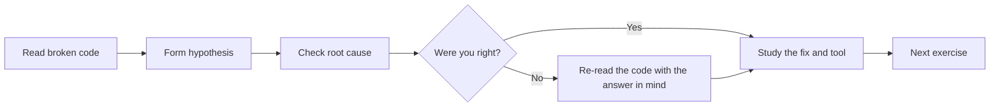
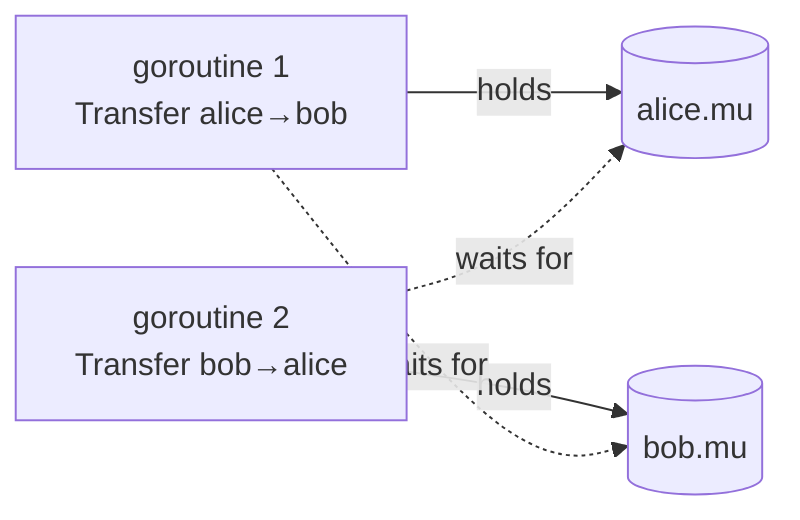
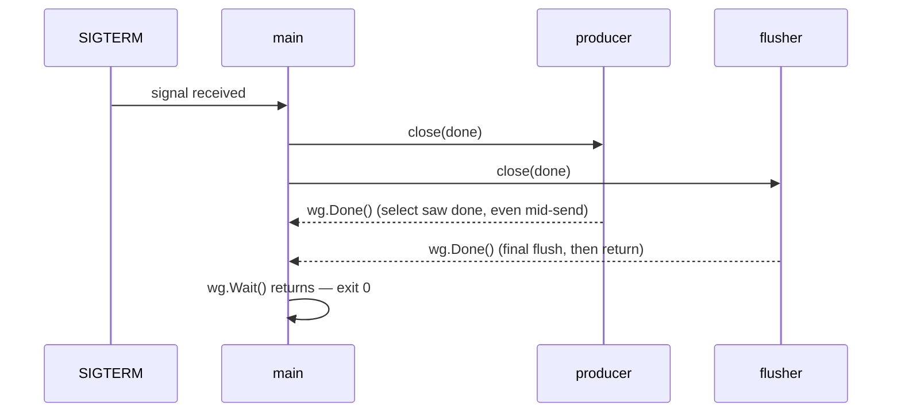

# Debug This: Real Concurrency Bugs in Go

## How to Use This File

Each exercise below shows **broken, production-style code**. The bugs are real: every one of them has shipped to production at some company and caused an incident. Your workflow:

1. **Read the broken code carefully.** Do not skim. Concurrency bugs hide in ordinary-looking lines.
2. **Write down your hypothesis** before scrolling to the explanation. In interviews at Uber, Razorpay, and similar companies, you debug live on a screen share — practicing the "commit to a hypothesis first" discipline is what makes you fast.
3. **Check the root cause.** It references the Go memory model and runtime semantics precisely, because "it's a race" is not an acceptable interview answer — *why* it is a race is.
4. **Study the fix and the detection tool.** Knowing which tool catches which bug class is a senior-engineer signal.

A note on reproduction: races and leaks are probabilistic. Run broken examples with `go run -race` and under load (loops, `GOMAXPROCS` variation) to surface them reliably.



---

## 15 Debugging Exercises

---

### Exercise 1: The Search That Never Returns Its Workers [Difficulty: Easy]

#### The broken code

```go
package main

import (
	"fmt"
	"time"
)

type Result struct {
	Source string
	Data   string
}

// fetchFastest queries three replicas and returns the first answer.
func fetchFastest(query string) Result {
	ch := make(chan Result) // unbuffered

	replicas := []string{"replica-a", "replica-b", "replica-c"}
	for _, r := range replicas {
		go func(replica string) {
			// Simulate network latency.
			time.Sleep(time.Duration(len(replica)) * 10 * time.Millisecond)
			ch <- Result{Source: replica, Data: "rows for " + query}
		}(r)
	}

	return <-ch // take the fastest, ignore the rest
}

func main() {
	for i := 0; i < 1000; i++ {
		res := fetchFastest(fmt.Sprintf("q-%d", i))
		_ = res
	}
	fmt.Println("done")
}
```

#### Symptom

Memory usage of the service climbs steadily over hours. A goroutine dump shows thousands of goroutines parked at `chan send`. Eventually the process is OOM-killed.

#### Your task

Find the bug before reading on.

#### Root cause

The channel is **unbuffered**, so every send blocks until a receiver is ready. `fetchFastest` performs exactly **one** receive and returns. The two losing goroutines per call are blocked forever on `ch <- Result{...}` — nothing will ever receive from `ch` again, but the channel is still referenced by those goroutines, so neither the goroutines nor the channel can be garbage collected. Go does **not** garbage-collect blocked goroutines; a goroutine is only reclaimed when it returns.

After 1000 calls you have ~2000 leaked goroutines, each pinning its stack (minimum 2 KiB, often more) plus the captured `Result`.

#### The fix

Give the channel enough capacity for every potential sender, so losers complete their send and exit:

```go
func fetchFastest(query string) Result {
	replicas := []string{"replica-a", "replica-b", "replica-c"}
	ch := make(chan Result, len(replicas)) // buffered: sends never block

	for _, r := range replicas {
		go func(replica string) {
			time.Sleep(time.Duration(len(replica)) * 10 * time.Millisecond)
			ch <- Result{Source: replica, Data: "rows for " + query}
		}(r)
	}

	return <-ch
}
```

An alternative is a `select` with a `context.Done()` case in each sender, but the buffered channel is the idiomatic fix for first-response-wins fan-in.

#### How to catch it

- `go test` with `goleak.VerifyNone(t)` (uber-go/goleak) fails the test listing the leaked stack.
- In production: `curl localhost:6060/debug/pprof/goroutine?debug=1` — look for many goroutines at `chan send` with the same stack.
- `runtime.NumGoroutine()` plotted as a metric trends upward instead of staying flat.

---

### Exercise 2: The Worker That Outlived Its Request [Difficulty: Easy]

#### The broken code

```go
package main

import (
	"fmt"
	"net/http"
	"time"
)

type PriceUpdate struct {
	Symbol string
	Price  float64
}

// streamPrices pushes updates for a symbol until... well, that's the bug.
func streamPrices(symbol string, out chan<- PriceUpdate) {
	ticker := time.NewTicker(100 * time.Millisecond)
	defer ticker.Stop()
	for {
		select {
		case <-ticker.C:
			out <- PriceUpdate{Symbol: symbol, Price: 100.0}
		}
	}
}

func handler(w http.ResponseWriter, r *http.Request) {
	updates := make(chan PriceUpdate, 16)
	go streamPrices(r.URL.Query().Get("symbol"), updates)

	// Send 5 updates to the client, then finish the request.
	for i := 0; i < 5; i++ {
		u := <-updates
		fmt.Fprintf(w, "%s=%.2f\n", u.Symbol, u.Price)
	}
}

func main() {
	http.HandleFunc("/prices", handler)
	http.ListenAndServe(":8080", nil)
}
```

#### Symptom

Goroutine count grows by one per request and never drops. Each leaked goroutine also keeps a `time.Ticker` alive, so timer pressure and CPU wakeups grow too.

#### Your task

Find the bug before reading on.

#### Root cause

`streamPrices` has a `for { select { ... } }` with **no exit path**. The handler reads 5 updates and returns. After that, the producer fills the 16-slot buffer, then blocks forever on `out <-` (no receiver remains). Even if the buffer were unbounded, the goroutine would spin forever.

The structural mistake: a goroutine was started whose lifetime is *meant* to be tied to the request, but nothing communicates "the request is over". The request's `context.Context` (`r.Context()`) is cancelled by `net/http` when the handler returns — the producer simply never listens for it.

#### The fix

```go
func streamPrices(ctx context.Context, symbol string, out chan<- PriceUpdate) {
	ticker := time.NewTicker(100 * time.Millisecond)
	defer ticker.Stop()
	for {
		select {
		case <-ctx.Done():
			return // request finished or client disconnected
		case <-ticker.C:
			select {
			case out <- PriceUpdate{Symbol: symbol, Price: 100.0}:
			case <-ctx.Done():
				return // never block on send while shutting down
			}
		}
	}
}

func handler(w http.ResponseWriter, r *http.Request) {
	updates := make(chan PriceUpdate, 16)
	go streamPrices(r.Context(), r.URL.Query().Get("symbol"), updates)

	for i := 0; i < 5; i++ {
		u := <-updates
		fmt.Fprintf(w, "%s=%.2f\n", u.Symbol, u.Price)
	}
}
```

Note the **nested select on the send**: checking `ctx.Done()` only at the top of the loop is not enough if the send itself can block.

#### How to catch it

- `pprof` goroutine profile: stacks parked in `chan send` inside `streamPrices`, count equal to total requests served.
- goleak in handler tests (`httptest` + `goleak.VerifyNone`).
- Rule of thumb in review: every `for-select` goroutine must have a `case <-ctx.Done(): return` or an owned quit channel.

---

### Exercise 3: Every Worker Processed the Same Shard [Difficulty: Easy]

#### The broken code

```go
package main

import (
	"fmt"
	"sync"
)

type Shard struct {
	ID   int
	Name string
}

func reindexAll(shards []Shard) {
	var wg sync.WaitGroup
	for i := 0; i < len(shards); i++ {
		s := shards[i]
		_ = s
		wg.Add(1)
		go func() {
			defer wg.Done()
			// BUG (on Go <= 1.21): which shard does this see?
			fmt.Printf("reindexing shard %d (%s)\n", shards[i].ID, shards[i].Name)
		}()
	}
	wg.Wait()
}

func main() {
	reindexAll([]Shard{{1, "users"}, {2, "orders"}, {3, "payments"}})
}
```

#### Symptom

On Go 1.21 the program panics with `index out of range [3]`, or — in the variant that captures `i` into element access done before the panic-prone point — every worker logs the *last* shard. In production this manifested as one shard reindexed three times and two shards never reindexed at all.

#### Your task

Find the bug before reading on.

#### Root cause

The closure captures the **variable** `i`, not its value at `go` time. Goroutines typically start running after the loop has finished, when `i == len(shards)`, so `shards[i]` is out of range (or, when capturing the loop element variable in a `for ... range` loop, all goroutines see the final element).

What changed in **Go 1.22**: each iteration of a `for` loop now gets a **fresh copy of the loop variable** (`i`, and range variables). So `for i := range shards { go func() { use(shards[i]) }() }` is correct on 1.22+. However:

- The example above still has a logic smell even on 1.22 — but it is *correct* on 1.22 because `i` is per-iteration.
- Code built with `go` directive `< 1.22` in `go.mod` keeps the old per-loop semantics **even when compiled with a newer toolchain**. Per-iteration semantics activate only when the module (or file) declares language version 1.22+.

#### The fix

Portable across all Go versions — pass the value as a parameter:

```go
func reindexAll(shards []Shard) {
	var wg sync.WaitGroup
	for i := 0; i < len(shards); i++ {
		wg.Add(1)
		go func(s Shard) {
			defer wg.Done()
			fmt.Printf("reindexing shard %d (%s)\n", s.ID, s.Name)
		}(shards[i])
	}
	wg.Wait()
}
```

On Go 1.22+ this is also fine and idiomatic:

```go
for _, s := range shards {
	wg.Add(1)
	go func() {
		defer wg.Done()
		fmt.Printf("reindexing shard %d (%s)\n", s.ID, s.Name)
	}()
}
```

#### How to catch it

- `go vet` (loopclosure check) flagged the classic form on pre-1.22 toolchains.
- `go run -race` reports a race on `i` (the loop increments it while goroutines read it).
- Check `go.mod`: if it says `go 1.21` or lower, the old semantics apply regardless of installed toolchain.

---

### Exercise 4: The Counter That Locked a Copy [Difficulty: Medium]

#### The broken code

```go
package main

import (
	"fmt"
	"sync"
)

type RateCounter struct {
	mu    sync.Mutex
	count map[string]int
}

func NewRateCounter() RateCounter {
	return RateCounter{count: make(map[string]int)}
}

// BUG: value receiver.
func (rc RateCounter) Incr(key string) {
	rc.mu.Lock()
	defer rc.mu.Unlock()
	rc.count[key]++
}

func (rc RateCounter) Get(key string) int {
	rc.mu.Lock()
	defer rc.mu.Unlock()
	return rc.count[key]
}

func main() {
	rc := NewRateCounter()
	var wg sync.WaitGroup
	for i := 0; i < 100; i++ {
		wg.Add(1)
		go func() {
			defer wg.Done()
			rc.Incr("api:/v1/orders")
		}()
	}
	wg.Wait()
	fmt.Println(rc.Get("api:/v1/orders"))
}
```

#### Symptom

The race detector screams on `rc.count[key]++` even though "we're holding the lock". Counts come back wrong under load (e.g., 87 instead of 100), and occasionally the runtime throws `fatal error: concurrent map writes`.

#### Your task

Find the bug before reading on.

#### Root cause

`Incr` has a **value receiver**, so every call operates on a *copy* of the `RateCounter` — including a **copy of the mutex**. Each goroutine locks its own private copy of `sync.Mutex`, which provides zero mutual exclusion between goroutines. Meanwhile the `map` field is a reference type, so all the copies share the same underlying map — concurrently mutated without any real lock.

Two Go facts intersect here:

1. Method value receivers copy the entire struct at call time.
2. `sync.Mutex` must never be copied after first use (`sync` package docs); `go vet`'s `copylocks` analyzer exists exactly for this.

A nastier variant of the same bug deadlocks: if the *original* mutex is locked, then the struct is copied, the copy is "born locked" and unlocking the original never unlocks the copy.

#### The fix

Pointer receivers, and return a pointer from the constructor so the struct is never copied:

```go
type RateCounter struct {
	mu    sync.Mutex
	count map[string]int
}

func NewRateCounter() *RateCounter {
	return &RateCounter{count: make(map[string]int)}
}

func (rc *RateCounter) Incr(key string) {
	rc.mu.Lock()
	defer rc.mu.Unlock()
	rc.count[key]++
}

func (rc *RateCounter) Get(key string) int {
	rc.mu.Lock()
	defer rc.mu.Unlock()
	return rc.count[key]
}
```

#### How to catch it

- `go vet ./...` — the `copylocks` check reports "Incr passes lock by value".
- `go run -race` reports the data race on the map.
- Review rule: any struct embedding a `sync.Mutex`/`sync.RWMutex`/`sync.WaitGroup` must use pointer receivers everywhere and never be assigned/passed by value.

---

### Exercise 5: Two Configs, One Truth [Difficulty: Medium]

#### The broken code

```go
package main

import (
	"fmt"
	"sync"
)

type Config struct {
	DBHost     string
	MaxRetries int
}

var config *Config

// loadConfig is "cheap to call, expensive to run", so someone added a
// nil check to avoid loading twice.
func getConfig() *Config {
	if config == nil { // check
		config = &Config{ // act
			DBHost:     "db.internal:5432",
			MaxRetries: 3,
		}
	}
	return config
}

func main() {
	var wg sync.WaitGroup
	for i := 0; i < 50; i++ {
		wg.Add(1)
		go func() {
			defer wg.Done()
			c := getConfig()
			fmt.Sprintf("%s/%d", c.DBHost, c.MaxRetries)
		}()
	}
	wg.Wait()
}
```

#### Symptom

Usually nothing — which is why it survives review. Under load and on multi-core machines the race detector reports a write/read race on `config`. In the worst case a goroutine observes a **non-nil pointer to a partially-visible struct** (fields still zero), causing connections to host `":0"` style garbage.

#### Your task

Find the bug before reading on.

#### Root cause

Classic **racy lazy initialization** (check-then-act with no synchronization). Two goroutines can both see `config == nil` and both initialize. Worse, per the Go memory model, without a synchronizing operation there is **no happens-before edge** between one goroutine's write to `config` (and to the struct's fields) and another goroutine's read. The compiler and CPU may reorder the pointer publication before the field writes — a reader can see `config != nil` while `DBHost` is still `""`. "Benign race" does not exist in Go; the memory model gives racy programs no semantics at all.

#### The fix

`sync.Once` provides the required happens-before guarantee: everything in the `Do` function happens before any `Do` call returns.

```go
var (
	config     *Config
	configOnce sync.Once
)

func getConfig() *Config {
	configOnce.Do(func() {
		config = &Config{
			DBHost:     "db.internal:5432",
			MaxRetries: 3,
		}
	})
	return config
}
```

On Go 1.21+, `sync.OnceValue` is even tidier:

```go
var getConfig = sync.OnceValue(func() *Config {
	return &Config{DBHost: "db.internal:5432", MaxRetries: 3}
})
```

#### How to catch it

- `go test -race` / `go run -race`: reports the unsynchronized read/write of `config`.
- Code review heuristic: any `if x == nil { x = ... }` on a package-level variable reachable from multiple goroutines is wrong without `sync.Once` or a mutex.

---

### Exercise 6: The WaitGroup That Had Nothing to Wait For [Difficulty: Medium]

#### The broken code

```go
package main

import (
	"fmt"
	"sync"
	"time"
)

func processBatch(items []string) {
	var wg sync.WaitGroup
	for _, item := range items {
		go func(it string) {
			wg.Add(1) // BUG: Add inside the goroutine
			defer wg.Done()
			time.Sleep(5 * time.Millisecond) // simulate work
			fmt.Println("processed", it)
		}(item)
	}
	wg.Wait()
	fmt.Println("batch complete")
}

func main() {
	processBatch([]string{"a", "b", "c", "d"})
}
```

#### Symptom

Intermittent. Sometimes "batch complete" prints **before** all items are processed; the program then exits and kills in-flight goroutines, so items are silently dropped. Occasionally the race detector reports a race on the WaitGroup, and `WaitGroup` may panic with `sync: WaitGroup misuse: Add called concurrently with Wait`.

#### Your task

Find the bug before reading on.

#### Root cause

`wg.Add(1)` runs **inside** the spawned goroutine, so there is a window where the main goroutine reaches `wg.Wait()` while the counter is still 0 (none of the children have been scheduled yet). `Wait` returns immediately when the counter is 0 — that is its contract. The invariant for `WaitGroup` is: **`Add` must happen before `Wait` could observe the counter**, which in practice means `Add` is called in the *parent* goroutine, before the `go` statement. Calling `Add` concurrently with `Wait` (when the counter may have hit zero) is documented misuse.

#### The fix

```go
func processBatch(items []string) {
	var wg sync.WaitGroup
	for _, item := range items {
		wg.Add(1) // parent goroutine, before go
		go func(it string) {
			defer wg.Done()
			time.Sleep(5 * time.Millisecond)
			fmt.Println("processed", it)
		}(item)
	}
	wg.Wait()
	fmt.Println("batch complete")
}
```

Or `wg.Add(len(items))` once before the loop. On Go 1.25+, `wg.Go(func() { ... })` wraps Add/Done correctly for you.

#### How to catch it

- `go test -race` flags the Add/Wait race in many interleavings.
- A stress loop (`go test -count=1000`) makes "batch complete printed early" reproducible.
- Static review rule: `wg.Add` must be lexically before the `go` keyword it accounts for.

---

### Exercise 7: The Session Cache That Took Down Checkout [Difficulty: Easy]

#### The broken code

```go
package main

import (
	"fmt"
	"sync"
	"time"
)

type SessionStore struct {
	sessions map[string]time.Time
}

func (s *SessionStore) Touch(id string) {
	s.sessions[id] = time.Now()
}

func (s *SessionStore) IsActive(id string) bool {
	t, ok := s.sessions[id]
	return ok && time.Since(t) < 30*time.Minute
}

func main() {
	store := &SessionStore{sessions: make(map[string]time.Time)}

	var wg sync.WaitGroup
	for i := 0; i < 100; i++ {
		wg.Add(1)
		go func(n int) { // writers: login traffic
			defer wg.Done()
			store.Touch(fmt.Sprintf("sess-%d", n))
		}(i)
		wg.Add(1)
		go func(n int) { // readers: auth middleware
			defer wg.Done()
			store.IsActive(fmt.Sprintf("sess-%d", n))
		}(i)
	}
	wg.Wait()
}
```

#### Symptom

Under load the process crashes with `fatal error: concurrent map read and map write` or `fatal error: concurrent map writes`. This is **not a panic** — it cannot be recovered with `recover()`; the runtime kills the whole process. In the original incident, one crashing pod caused a retry storm that crashed the rest.

#### Your task

Find the bug before reading on.

#### Root cause

Go's built-in `map` is **not safe for concurrent use** when at least one goroutine writes. The runtime has a lightweight race check (a flag on the map header, checked on access) that deliberately crashes the process on detection, because a corrupted map can otherwise cause arbitrary memory unsafety. The check is best-effort: the race detector will catch interleavings the runtime check misses, but the absence of a crash never proves safety.

#### The fix

For read-heavy workloads, `sync.RWMutex`:

```go
type SessionStore struct {
	mu       sync.RWMutex
	sessions map[string]time.Time
}

func (s *SessionStore) Touch(id string) {
	s.mu.Lock()
	defer s.mu.Unlock()
	s.sessions[id] = time.Now()
}

func (s *SessionStore) IsActive(id string) bool {
	s.mu.RLock()
	defer s.mu.RUnlock()
	t, ok := s.sessions[id]
	return ok && time.Since(t) < 30*time.Minute
}
```

`sync.Map` is the right tool only for two niches the docs call out: (1) keys written once and read many times, or (2) disjoint key sets per goroutine. For a general mutate-heavy cache, a mutex-guarded map is usually faster and clearer.

#### How to catch it

- `go run -race`: reports the exact read/write pair with both stacks.
- Even without `-race`, the runtime's `fatal error: concurrent map writes` in crash logs identifies this bug class instantly.
- `go vet` cannot catch this; only dynamic analysis can.

---

### Exercise 8: Death by a Million Timers [Difficulty: Medium]

#### The broken code

```go
package main

import (
	"fmt"
	"time"
)

type Event struct{ ID int }

// consume drains events, logging a warning if the stream goes quiet.
func consume(events <-chan Event) {
	for {
		select {
		case ev, ok := <-events:
			if !ok {
				return
			}
			fmt.Println("got event", ev.ID)
		case <-time.After(30 * time.Second): // BUG
			fmt.Println("warn: no events for 30s")
		}
	}
}

func main() {
	events := make(chan Event)
	go func() {
		for i := 0; ; i++ {
			events <- Event{ID: i}
			time.Sleep(time.Millisecond)
		}
	}()
	consume(events)
}
```

#### Symptom

A high-throughput consumer (1000 events/sec) shows constantly growing heap in pprof, dominated by `time.NewTimer` / `runtime.timer` allocations. GC time climbs. The timeout branch itself almost never fires.

#### Your task

Find the bug before reading on.

#### Root cause

`time.After(d)` creates a **new timer on every loop iteration**. When an event arrives first, the `select` abandons the timer channel — but the timer itself lives on in the runtime's timer heap until it fires (30 s later here). At 1000 events/sec, that is up to 30,000 live timers at steady state, each with its channel and runtime bookkeeping, all garbage that cannot be collected until expiry.

Historical note: before Go 1.23, an abandoned `time.After` timer was *guaranteed* unreclaimable until it fired. Go 1.23 changed timer/channel semantics so unreferenced, unstopped timers can be GC'd — which shrinks this leak on modern toolchains, but allocating one timer per message is still wasteful, and code must often run on older runtimes.

#### The fix

Hoist one timer out of the loop and reset it:

```go
func consume(events <-chan Event) {
	idle := time.NewTimer(30 * time.Second)
	defer idle.Stop()
	for {
		select {
		case ev, ok := <-events:
			if !ok {
				return
			}
			fmt.Println("got event", ev.ID)
			if !idle.Stop() {
				<-idle.C // drain if it already fired (pre-1.23 requirement)
			}
			idle.Reset(30 * time.Second)
		case <-idle.C:
			fmt.Println("warn: no events for 30s")
			idle.Reset(30 * time.Second)
		}
	}
}
```

(On Go 1.23+, the drain after `Stop` is no longer necessary — `Reset` alone is safe — but the pattern above is correct on all versions.)

#### How to catch it

- `go tool pprof http://localhost:6060/debug/pprof/heap` — `time.After` / `time.NewTimer` near the top of `inuse_objects`.
- Grep rule: `time.After` inside a `for` loop is a review flag unless the loop body is slow/rare.

---

### Exercise 9: Transfer Gridlock [Difficulty: Hard]

#### The broken code

```go
package main

import (
	"fmt"
	"sync"
)

type Account struct {
	mu      sync.Mutex
	ID      string
	Balance int64
}

// Transfer moves amount from a to b atomically.
func Transfer(a, b *Account, amount int64) error {
	a.mu.Lock()
	defer a.mu.Unlock()
	b.mu.Lock() // BUG: lock order depends on argument order
	defer b.mu.Unlock()

	if a.Balance < amount {
		return fmt.Errorf("insufficient funds in %s", a.ID)
	}
	a.Balance -= amount
	b.Balance += amount
	return nil
}

func main() {
	alice := &Account{ID: "alice", Balance: 1000}
	bob := &Account{ID: "bob", Balance: 1000}

	var wg sync.WaitGroup
	for i := 0; i < 1000; i++ {
		wg.Add(2)
		go func() { defer wg.Done(); Transfer(alice, bob, 1) }()
		go func() { defer wg.Done(); Transfer(bob, alice, 1) }()
	}
	wg.Wait()
	fmt.Println(alice.Balance, bob.Balance)
}
```

#### Symptom

The service freezes under concurrent opposing transfers. If *every* goroutine ends up blocked, the runtime prints `fatal error: all goroutines are asleep - deadlock!`. In a real server other goroutines keep running, so instead you see two goroutines parked forever in `sync.Mutex.Lock`, transfers between that account pair time out, and the pile-up consumes the worker pool.

#### Your task

Find the bug before reading on.

#### Root cause

**Inconsistent lock ordering.** Goroutine 1 runs `Transfer(alice, bob, …)`: locks `alice`, wants `bob`. Goroutine 2 runs `Transfer(bob, alice, …)`: locks `bob`, wants `alice`. Each holds the lock the other needs — a circular wait, the textbook fourth Coffman condition. Go's runtime deadlock detector only fires when *all* goroutines are blocked, so partial deadlocks in real servers go undetected by the runtime.



#### The fix

Impose a **global lock order** — always acquire in a canonical order (by ID here), regardless of transfer direction:

```go
func Transfer(a, b *Account, amount int64) error {
	first, second := a, b
	if a.ID > b.ID { // canonical order: smaller ID first
		first, second = b, a
	}
	first.mu.Lock()
	defer first.mu.Unlock()
	second.mu.Lock()
	defer second.mu.Unlock()

	if a.Balance < amount {
		return fmt.Errorf("insufficient funds in %s", a.ID)
	}
	a.Balance -= amount
	b.Balance += amount
	return nil
}
```

If IDs can be equal/missing, order by pointer (`uintptr`) or use a single coarser lock. `mutex.TryLock`-with-backoff also works but is harder to reason about.

#### How to catch it

- Full-program hangs: the runtime prints all goroutine stacks on `fatal error: all goroutines are asleep`.
- Partial hangs: `kill -QUIT <pid>` or `/debug/pprof/goroutine?debug=2` — look for pairs of goroutines blocked in `sync.Mutex.Lock` holding each other's lock.
- `go test -timeout 30s` turns a hung test into a stack dump.
- `-blockprofile` / mutex profile shows abnormal contention on the affected mutexes before total deadlock.

---

### Exercise 10: The Audit Log With Missing Entries [Difficulty: Medium]

#### The broken code

```go
package main

import (
	"fmt"
	"sync"
)

type AuditEntry struct {
	UserID string
	Action string
}

func collectAudit(userIDs []string) []AuditEntry {
	var entries []AuditEntry
	var wg sync.WaitGroup
	for _, id := range userIDs {
		wg.Add(1)
		go func(uid string) {
			defer wg.Done()
			e := AuditEntry{UserID: uid, Action: "export"}
			entries = append(entries, e) // BUG
		}(id)
	}
	wg.Wait()
	return entries
}

func main() {
	ids := make([]string, 500)
	for i := range ids {
		ids[i] = fmt.Sprintf("u-%d", i)
	}
	got := collectAudit(ids)
	fmt.Println("expected 500, got", len(got))
}
```

#### Symptom

`len(got)` is nondeterministically less than 500 (entries silently lost — terrible for an *audit* log). Rarely, a torn/duplicated element appears, and the race detector reports races on `entries`.

#### Your task

Find the bug before reading on.

#### Root cause

`append` on a shared slice is **not atomic**. It (1) reads the slice header `{ptr, len, cap}`, (2) possibly allocates a new array and copies, (3) writes the element, (4) writes back a new header. Two goroutines reading the same header both write element at index `len`, and the second header write-back clobbers the first — one entry vanishes. When a grow happens concurrently, goroutines can write into different backing arrays, losing whole batches. The slice *header* itself is a multi-word value, so concurrent header writes can even be observed torn.

#### The fix

Option A — mutex (simple, fine for most cases):

```go
func collectAudit(userIDs []string) []AuditEntry {
	var (
		mu      sync.Mutex
		entries []AuditEntry
		wg      sync.WaitGroup
	)
	for _, id := range userIDs {
		wg.Add(1)
		go func(uid string) {
			defer wg.Done()
			e := AuditEntry{UserID: uid, Action: "export"}
			mu.Lock()
			entries = append(entries, e)
			mu.Unlock()
		}(id)
	}
	wg.Wait()
	return entries
}
```

Option B — lock-free by construction: pre-size and write to distinct indices (no two goroutines touch the same element):

```go
func collectAudit(userIDs []string) []AuditEntry {
	entries := make([]AuditEntry, len(userIDs))
	var wg sync.WaitGroup
	for i, id := range userIDs {
		wg.Add(1)
		go func(i int, uid string) {
			defer wg.Done()
			entries[i] = AuditEntry{UserID: uid, Action: "export"}
		}(i, id)
	}
	wg.Wait()
	return entries
}
```

#### How to catch it

- `go test -race` flags both the element and header races immediately.
- An invariant assertion in tests (`len(got) == len(ids)`) run with `-count=100`.

---

### Exercise 11: Closed Twice, Paid Once [Difficulty: Medium]

#### The broken code

```go
package main

import (
	"errors"
	"fmt"
	"sync"
)

type Job struct{ ID int }

func runPipeline(jobs []Job) error {
	results := make(chan string)
	errs := make(chan error, 1)
	var wg sync.WaitGroup

	for _, j := range jobs {
		wg.Add(1)
		go func(job Job) {
			defer wg.Done()
			if job.ID%7 == 0 {
				errs <- errors.New("job failed")
				close(results) // BUG #1: worker closes shared channel
				return
			}
			results <- fmt.Sprintf("job-%d ok", job.ID) // BUG #2: send on closed
		}(j)
	}

	go func() {
		wg.Wait()
		close(results) // BUG #1 again: second close
	}()

	for r := range results {
		fmt.Println(r)
	}
	select {
	case err := <-errs:
		return err
	default:
		return nil
	}
}

func main() {
	jobs := make([]Job, 20)
	for i := range jobs {
		jobs[i] = Job{ID: i + 1}
	}
	fmt.Println(runPipeline(jobs))
}
```

#### Symptom

Random panics under load: `panic: send on closed channel` from workers, and `panic: close of closed channel` from the closer goroutine. Each panic kills the whole process.

#### Your task

Find the bug(s) before reading on.

#### Root cause

The channel ownership rule is violated. In Go, a channel should have **exactly one owner** — the goroutine (or coordinated group) that sends and is solely responsible for closing. Here:

1. A failing **worker** (a *sender among many*) closes `results`, while other workers are still sending. Send on a closed channel panics by language spec — close is a broadcast of "no more values will ever be sent", which a single worker cannot truthfully assert.
2. The `wg.Wait()` goroutine also closes `results` — second close, second panic. `close` on an already-closed channel always panics.

Receivers must never close, and individual senders in a fan-in must never close. Only the coordinator that knows all senders are done may close.

#### The fix

Workers only send; the single coordinator closes after `wg.Wait()`. Error reporting goes through its own buffered channel (or better, `errgroup`):

```go
func runPipeline(jobs []Job) error {
	results := make(chan string)
	errs := make(chan error, len(jobs))
	var wg sync.WaitGroup

	for _, j := range jobs {
		wg.Add(1)
		go func(job Job) {
			defer wg.Done()
			if job.ID%7 == 0 {
				errs <- errors.New("job failed")
				return
			}
			results <- fmt.Sprintf("job-%d ok", job.ID)
		}(j)
	}

	go func() {
		wg.Wait()
		close(results) // sole closer, after all senders are done
		close(errs)
	}()

	for r := range results {
		fmt.Println(r)
	}
	return <-errs // nil if errs was closed empty
}
```

For cancel-on-first-error semantics, reach for `golang.org/x/sync/errgroup` with `errgroup.WithContext` instead of hand-rolling.

#### How to catch it

- The panic message itself (`send on closed channel` / `close of closed channel`) plus the goroutine stack pinpoints it.
- Stress tests: `go test -race -count=500`.
- Design review: ask "who owns this channel?" — if the answer is plural for `close`, the design is wrong.

---

### Exercise 12: The Connection Pool That Bled Out [Difficulty: Easy]

#### The broken code

```go
package main

import (
	"encoding/json"
	"fmt"
	"net/http"
	"time"
)

type Health struct {
	Status string `json:"status"`
}

var client = &http.Client{Timeout: 5 * time.Second}

func checkUpstream(url string) (string, error) {
	resp, err := client.Get(url)
	if err != nil {
		return "", err
	}
	if resp.StatusCode != http.StatusOK {
		// BUG: early return without closing the body
		return "", fmt.Errorf("upstream %s returned %d", url, resp.StatusCode)
	}

	var h Health
	if err := json.NewDecoder(resp.Body).Decode(&h); err != nil {
		return "", err
	}
	// BUG: success path never closes the body either
	return h.Status, nil
}

func main() {
	for i := 0; i < 200; i++ {
		status, err := checkUpstream("http://localhost:9000/healthz")
		fmt.Println(status, err)
	}
}
```

#### Symptom

After running a while: `dial tcp: connect: cannot assign requested address`, or file-descriptor exhaustion (`too many open files`). `netstat` shows hundreds of connections; pprof shows goroutines stuck in `net/http.(*persistConn).readLoop`. Latency rises because **no connections are reused** — every request pays a fresh TCP+TLS handshake.

#### Your task

Find the bug before reading on.

#### Root cause

`http.Response.Body` must be **closed by the caller on every path** — including non-200 responses, where the body is still a live stream. While the body is open, the underlying TCP connection cannot be returned to the `http.Transport` idle pool; each leaked body pins a connection, a file descriptor, and the transport's `readLoop`/`writeLoop` goroutines. Additionally, the transport reuses a connection only if the body was **read to EOF** and closed; closing an unread body may discard the connection, but never closing it is strictly worse.

(Subtle related fact: even `Decode` succeeding may leave trailing bytes/EOF unread, preventing reuse — hence the `io.Copy(io.Discard, ...)` drain below.)

#### The fix

```go
func checkUpstream(url string) (string, error) {
	resp, err := client.Get(url)
	if err != nil {
		return "", err
	}
	defer func() {
		io.Copy(io.Discard, resp.Body) // drain so the conn can be reused
		resp.Body.Close()
	}()

	if resp.StatusCode != http.StatusOK {
		return "", fmt.Errorf("upstream %s returned %d", url, resp.StatusCode)
	}

	var h Health
	if err := json.NewDecoder(resp.Body).Decode(&h); err != nil {
		return "", err
	}
	return h.Status, nil
}
```

The `defer` immediately after the error check guarantees closure on every return path. (Add `"io"` to imports.)

#### How to catch it

- `go vet` with the `bodyclose` linter (via `golangci-lint`) flags every path that skips `Body.Close()`.
- pprof goroutine profile: pairs of `persistConn.readLoop`/`writeLoop` goroutines growing with request count.
- OS-level: `ls /proc/<pid>/fd | wc -l` trending up; `ss -tanp | grep <pid>` full of ESTABLISHED/CLOSE_WAIT sockets.

---

### Exercise 13: Readers Everywhere, Writer Starving [Difficulty: Hard]

#### The broken code

```go
package main

import (
	"fmt"
	"sync"
	"time"
)

type FeatureFlags struct {
	mu    sync.RWMutex
	flags map[string]bool
}

// Enabled is called on every request — hot path.
func (f *FeatureFlags) Enabled(name string) bool {
	f.mu.RLock()
	defer f.mu.RUnlock()
	// BUG: slow work while holding the read lock
	time.Sleep(2 * time.Millisecond) // stands in for: remote lookup, logging, eval of dependent flags
	return f.flags[name]
}

// Refresh is called every 10s by a background poller.
func (f *FeatureFlags) Refresh(newFlags map[string]bool) {
	start := time.Now()
	f.mu.Lock()
	f.flags = newFlags
	f.mu.Unlock()
	fmt.Println("refresh waited", time.Since(start))
}

func main() {
	ff := &FeatureFlags{flags: map[string]bool{"new-checkout": true}}

	for i := 0; i < 64; i++ { // request traffic: overlapping readers, forever
		go func() {
			for {
				ff.Enabled("new-checkout")
			}
		}()
	}

	for i := 0; i < 5; i++ {
		time.Sleep(time.Second)
		ff.Refresh(map[string]bool{"new-checkout": i%2 == 0})
	}
}
```

#### Symptom

`refresh waited` is long, and once the writer is waiting, **all new readers also stall** — request latency spikes platform-wide every refresh. The team's mental model ("RWMutex means readers are never blocked") turns out wrong in both directions: long-held read locks delay the writer, and a pending writer blocks new readers.

#### Your task

Find the bug before reading on.

#### Root cause

Two interacting issues:

1. **Slow work under RLock.** With 64 readers each holding the read lock for ~2 ms and overlapping, there is rarely a moment when the reader count drops to zero, so `Lock()` waits a long time for in-flight readers to drain.
2. **Go's RWMutex is writer-arrival-blocking**: once `Lock()` is called, *subsequent* `RLock()` calls block until the writer gets in and finishes (this is the anti-writer-starvation design). So while the writer drains existing readers, every new request queues behind it. The latency cliff is: writer waits on old readers, new readers wait on writer.

The deeper design smell: holding any lock across slow or unbounded work.

#### The fix

Shrink the critical section to a pointer read, and make updates a pointer swap. `atomic.Pointer` makes the hot path lock-free:

```go
type FeatureFlags struct {
	flags atomic.Pointer[map[string]bool]
}

func NewFeatureFlags(initial map[string]bool) *FeatureFlags {
	f := &FeatureFlags{}
	f.flags.Store(&initial)
	return f
}

func (f *FeatureFlags) Enabled(name string) bool {
	m := *f.flags.Load() // snapshot: safe, the map is never mutated after publish
	enabled := m[name]
	time.Sleep(2 * time.Millisecond) // slow work now happens OUTSIDE any lock
	return enabled
}

func (f *FeatureFlags) Refresh(newFlags map[string]bool) {
	f.flags.Store(&newFlags) // writers build a fresh map and swap the pointer
}
```

This is the copy-on-write pattern: the map is immutable after publication, so readers need no lock at all. The rule if you keep RWMutex: take a local copy of what you need under `RLock`, release, then do the slow work.

#### How to catch it

- Mutex profiling: `runtime.SetMutexProfileFraction(1)` then `go tool pprof http://localhost:6060/debug/pprof/mutex` — contention concentrated on the RWMutex.
- Block profile (`-blockprofile` or `/debug/pprof/block` after `runtime.SetBlockProfileRate(1)`): readers blocked in `RLock` during refresh windows.
- Latency histograms that spike on a fixed cadence matching the refresh interval are the classic field signature.

---

### Exercise 14: The Rate Limiter That Let 110% Through [Difficulty: Hard]

#### The broken code

```go
package main

import (
	"fmt"
	"sync"
	"sync/atomic"
)

const maxConcurrent = 100

type Limiter struct {
	inFlight atomic.Int64
}

// Acquire returns true if the caller may proceed.
func (l *Limiter) Acquire() bool {
	if l.inFlight.Load() < maxConcurrent { // check
		l.inFlight.Add(1) // act — BUG: not atomic with the check
		return true
	}
	return false
}

func (l *Limiter) Release() {
	l.inFlight.Add(-1)
}

func main() {
	var l Limiter
	var admitted atomic.Int64
	var peak atomic.Int64

	var wg sync.WaitGroup
	for i := 0; i < 10000; i++ {
		wg.Add(1)
		go func() {
			defer wg.Done()
			if l.Acquire() {
				admitted.Add(1)
				if cur := l.inFlight.Load(); cur > peak.Load() {
					peak.Store(cur) // (diagnostic only; itself approximate)
				}
				l.Release()
			}
		}()
	}
	wg.Wait()
	fmt.Println("peak in-flight observed:", peak.Load())
}
```

#### Symptom

The downstream service protected by this limiter receives bursts of 105–130 concurrent requests despite `maxConcurrent = 100`, and intermittently falls over. Every individual operation in the limiter is "atomic", the race detector is **silent**, and yet the invariant is violated.

#### Your task

Find the bug before reading on.

#### Root cause

**Check-then-act (TOCTOU) on an atomic.** `Load()` and `Add(1)` are each atomic, but the *sequence* is not: between the load (sees 99) and the add, fifty other goroutines can also load 99 and all proceed. Atomicity of individual operations does not compose into atomicity of a compound operation. This is the most dangerous bug class on this list precisely because `-race` cannot see it — there is no data race, only a broken **invariant**. Atomics remove races, not logic errors.

#### The fix

Option A — make the compound operation atomic with a CAS loop (optimistic concurrency):

```go
func (l *Limiter) Acquire() bool {
	for {
		cur := l.inFlight.Load()
		if cur >= maxConcurrent {
			return false
		}
		if l.inFlight.CompareAndSwap(cur, cur+1) {
			return true // we atomically went from cur to cur+1 below the limit
		}
		// CAS failed: someone moved the counter; re-check and retry.
	}
}
```

Option B — the idiomatic Go answer for bounded concurrency, a semaphore channel (no retry loop, supports blocking and context-aware variants):

```go
type Limiter struct{ sem chan struct{} }

func NewLimiter(n int) *Limiter { return &Limiter{sem: make(chan struct{}, n)} }

func (l *Limiter) Acquire() bool {
	select {
	case l.sem <- struct{}{}:
		return true
	default:
		return false
	}
}

func (l *Limiter) Release() { <-l.sem }
```

(Or `golang.org/x/sync/semaphore.Weighted` for weighted acquisition.)

#### How to catch it

- **Not** the race detector — it has nothing to report. This must be caught by invariant-checking tests: hammer with N goroutines, assert the observed peak never exceeds the limit (`go test -count=50`).
- Code review pattern-match: any `atomic.Load` whose result feeds a decision followed by an `atomic.Add`/`Store` is suspect; the question to ask is "what if the value changed between these two lines?"

---

### Exercise 15: The Service That Refused to Die [Difficulty: Medium]

#### The broken code

```go
package main

import (
	"fmt"
	"os"
	"os/signal"
	"syscall"
	"time"
)

type Metric struct {
	Name  string
	Value float64
}

// flusher batches metrics and ships them every interval.
func flusher(in <-chan Metric, done <-chan struct{}) {
	batch := make([]Metric, 0, 100)
	ticker := time.NewTicker(time.Second)
	defer ticker.Stop()
	for {
		select {
		case m := <-in: // BUG: no shutdown awareness in this path's partner...
			batch = append(batch, m)
		case <-ticker.C:
			fmt.Println("flushing", len(batch), "metrics")
			batch = batch[:0]
		case <-done:
			fmt.Println("final flush:", len(batch))
			return
		}
	}
}

func producer(out chan<- Metric, done <-chan struct{}) {
	for i := 0; ; i++ {
		// BUG: unconditional send; ignores shutdown entirely
		out <- Metric{Name: "req_latency_ms", Value: float64(i % 50)}
		time.Sleep(10 * time.Millisecond)
	}
	// (unreachable; producer can never exit)
}

func main() {
	metrics := make(chan Metric) // unbuffered
	done := make(chan struct{})

	go producer(metrics, done)
	go flusher(metrics, done)

	sig := make(chan os.Signal, 1)
	signal.Notify(sig, syscall.SIGTERM, syscall.SIGINT)
	<-sig

	close(done)
	// Wait "long enough" for the final flush, then exit.
	time.Sleep(5 * time.Second)
	fmt.Println("shutdown complete")
}
```

#### Symptom

On SIGTERM, sometimes shutdown is clean; other times the process hangs until Kubernetes sends SIGKILL after the grace period, and the final metric batch is lost. A goroutine dump during the hang shows `producer` blocked in `chan send` and — in a fuller version of this program where main waits on a WaitGroup — main blocked forever in `Wait`.

#### Your task

Find the bug before reading on.

#### Root cause

Two coupled mistakes around `select` and shutdown:

1. **The producer's send is unconditional.** `out <- m` on an unbuffered channel blocks until the flusher receives. When `done` closes, the flusher takes its `<-done` case and returns. Which `select` case runs is **pseudo-random among ready cases**, so even before the flusher exits, a closed `done` doesn't guarantee the flusher drains the channel first. Once the flusher is gone, the producer blocks on send forever — a goroutine that ignores shutdown can deadlock the goroutines that honor it.
2. **`time.Sleep` is not synchronization.** Main hopes 5 seconds is enough; correct shutdown needs an explicit completion signal (WaitGroup or a `flushed` channel).

#### The fix

Every blocking send/receive on the shutdown path must be wrapped in a `select` that also watches `done`; main must wait on a real signal:

```go
func producer(out chan<- Metric, done <-chan struct{}, wg *sync.WaitGroup) {
	defer wg.Done()
	for i := 0; ; i++ {
		select {
		case out <- Metric{Name: "req_latency_ms", Value: float64(i % 50)}:
		case <-done:
			return // shutdown observed even while blocked on send
		}
		select {
		case <-time.After(10 * time.Millisecond):
		case <-done:
			return
		}
	}
}

func main() {
	metrics := make(chan Metric)
	done := make(chan struct{})
	var wg sync.WaitGroup

	wg.Add(2)
	go producer(metrics, done, &wg)
	go func() {
		defer wg.Done()
		flusher(metrics, done)
	}()

	sig := make(chan os.Signal, 1)
	signal.Notify(sig, syscall.SIGTERM, syscall.SIGINT)
	<-sig

	close(done)
	wg.Wait() // deterministic: both goroutines have exited
	fmt.Println("shutdown complete")
}
```

(Add `"sync"` to imports.) In modern codebases, replace the `done` channel with `context.Context` and `signal.NotifyContext(context.Background(), syscall.SIGTERM, syscall.SIGINT)` — same shape, standard plumbing.



#### How to catch it

- Chaos-test shutdown: a test that starts the pipeline, fires the stop signal, and asserts exit within a deadline (`go test -timeout`).
- During a real hang: `kill -QUIT <pid>` dumps all goroutine stacks; a goroutine in `chan send` after shutdown began is the smoking gun.
- goleak in integration tests catches the producer surviving the test.
- Review rule: in any goroutine that must shut down, **every** channel operation (not just the top of the loop) needs a `done`/`ctx.Done()` escape hatch.

---

## Quick Reference: Detection Toolbox

| Bug class | Detection tool | Command | What to look for |
|---|---|---|---|
| Data race (map, slice, counter, lazy init) | Race detector | `go test -race ./...` / `go run -race main.go` | `WARNING: DATA RACE` with read/write stacks; fix every report — none are benign |
| Goroutine leak (blocked send, missing ctx, forgotten quit) | pprof goroutine profile | `curl localhost:6060/debug/pprof/goroutine?debug=2` | Many goroutines with identical stacks parked in `chan send`/`chan receive`/`select`; count grows with traffic |
| Goroutine leak (in tests) | uber-go/goleak | `defer goleak.VerifyNone(t)` in test | Test failure listing leaked goroutine stacks at test end |
| Goroutine count trend | runtime metric | export `runtime.NumGoroutine()` to your metrics system | Sawtooth is fine; a monotonic climb is a leak |
| Total deadlock (all goroutines blocked) | Go runtime | run the program; built-in | `fatal error: all goroutines are asleep - deadlock!` plus full stack dump |
| Partial deadlock / hang (lock ordering) | Stack dump | `kill -QUIT <pid>` or `go test -timeout 30s` | Pairs of goroutines in `sync.Mutex.Lock` holding what the other wants |
| Lock contention / writer starvation | Mutex profile | `runtime.SetMutexProfileFraction(1)`; `go tool pprof .../debug/pprof/mutex` | One mutex dominating contention; correlate with latency spikes |
| Blocking hotspots (channels, locks) | Block profile | `runtime.SetBlockProfileRate(1)`; `go tool pprof .../debug/pprof/block` (or `go test -blockprofile=block.out`) | Long cumulative delays at specific `chan send`/`RLock` sites |
| Timer/heap leak (`time.After` in loop) | Heap profile | `go tool pprof -inuse_objects .../debug/pprof/heap` | `time.NewTimer`/`time.After` high in allocations |
| Unclosed HTTP response bodies | Linter + OS | `golangci-lint run --enable bodyclose`; `ls /proc/<pid>/fd \| wc -l` | Lint findings; fd count and CLOSE_WAIT sockets climbing |
| Copied locks (mutex in value receiver) | go vet | `go vet ./...` | `copylocks: ... passes lock by value` |
| Loop variable capture (pre-1.22) | go vet + race detector | `go vet ./...`; check `go` line in `go.mod` | `loopclosure` finding; module language version below 1.22 |
| Double close / send on closed channel | Panic stack + stress tests | `go test -race -count=500 ./...` | `panic: close of closed channel` / `panic: send on closed channel`; audit channel ownership |
| Atomic check-then-act (TOCTOU) | Invariant tests (race detector is blind here) | stress test asserting the invariant, e.g. peak concurrency <= limit | Invariant violations under load with zero race reports |
| Live scheduler view | Execution tracer | `go test -trace trace.out` then `go tool trace trace.out` | Goroutine states over time; blocked-forever goroutines; unexpected serialization |

### Final advice for live debugging rounds

1. Say your detection plan out loud: "I'd run this with `-race` first, then pull a goroutine profile." Interviewers score the *method*, not just the find.
2. Categorize fast: hang → deadlock family (Exercises 9, 15); crash → map race or channel misuse (7, 11); slow growth → leak family (1, 2, 8, 12); wrong numbers → race or TOCTOU (5, 6, 10, 14).
3. The race detector is necessary but not sufficient — Exercise 14 is the canonical example of a serious bug it cannot see.
4. Almost every fix above reduces to one of three principles: **own your channels** (one closer, known senders), **bound your critical sections** (no slow work under locks), and **tie every goroutine's lifetime to something** (a context, a WaitGroup, or channel closure).
