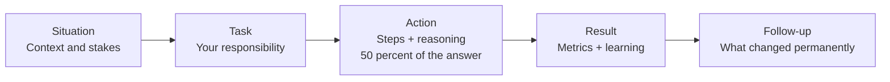

# Behavioral Interviews for Go Developers

## Why Behavioral Rounds Decide Offers

At the 15+ LPA level, the technical bar is assumed. By the time you reach the behavioral round, the company has usually already validated that you can reverse a linked list, design a rate limiter, and explain how the Go scheduler multiplexes goroutines onto OS threads. Every other candidate in the final loop can do those things too. What the company has not yet validated is whether you can be trusted with ambiguity, whether you escalate problems early or hide them, whether you make teammates better or worse, and whether you will still be productive when production is on fire at 2am and the runbook is wrong. Hiring committees routinely reject technically strong candidates over a single bad behavioral signal — "blamed his teammates for the outage," "could not name a single mistake she made," "argued every piece of feedback." Conversely, a strong behavioral round is frequently the deciding factor between two candidates with similar technical scores, and it is often what moves an offer from the base band to the top of the band.

The second reason behavioral rounds matter so much for backend engineers specifically is that backend work is failure-driven. Goroutine leaks, nil map writes, deadlocked channels, slow GC pauses, schema migrations gone wrong — production systems fail in ways that no interview whiteboard captures, and how you behaved during those failures is the best predictor of how you will behave during the company's next incident. Interviewers are not asking "tell me about a time you disagreed with your tech lead" because they enjoy stories. They are pattern-matching your past behavior against the situations their team faces every week. Your job in this round is to give them concrete, verifiable, first-person evidence — with real metrics, real trade-offs, and honest accounting of what you got wrong — that you have already lived through their hardest weeks and came out of them more useful, not less.

---

## The STAR Framework Done Right

STAR stands for **Situation, Task, Action, Result**. It is not a script; it is a discipline that forces your answer to contain evidence instead of adjectives.

| Component | What it must contain | Time budget | Common failure |
|---|---|---|---|
| **Situation** | Concrete context: system, scale, stakes. One or two sentences. | ~15% | Rambling background, no stakes |
| **Task** | *Your* specific responsibility, not the team's | ~10% | "We had to..." with no personal ownership |
| **Action** | What *you* did, step by step, with the reasoning behind each step | ~50% | Vague verbs: "I helped", "I was involved in" |
| **Result** | Quantified outcome + what you learned + what changed permanently | ~25% | No numbers, no learning, story just stops |

### GOOD vs BAD: Same Question, Side by Side

**Question: "Tell me about a time you debugged a difficult production issue."**

| | BAD answer | GOOD answer |
|---|---|---|
| **Situation** | "We had a memory issue once. The service kept crashing." | "Our Go payments service (around 4k req/s peak) started getting OOM-killed every 6–8 hours in production. Restarts masked it, so it had been festering for two weeks." |
| **Task** | "We had to fix it." | "I was on-call and took ownership of root-causing it rather than adding another restart cron." |
| **Action** | "We looked at the logs and eventually found a goroutine problem and fixed it." | "I enabled `net/http/pprof` behind an internal port, captured heap and goroutine profiles an hour apart, and diffed them. Goroutine count grew linearly — from ~800 to ~40,000. The profile pointed at a worker that did `result := <-ch` from a goroutine performing an HTTP call with no timeout; when the caller hit its own deadline and returned, the sender blocked forever on an unbuffered channel. I reproduced it in a test with a hung `httptest` server, then fixed it by giving the channel a buffer of 1 and adding `context.WithTimeout` plus a `select` on `ctx.Done()`." |
| **Result** | "It worked after that." | "Goroutine count flattened at ~900, OOM kills went to zero, and p99 latency dropped 18% because GC pressure fell. I added a Prometheus alert on goroutine count slope and wrote a 'leaky goroutine' checklist that caught two similar bugs in code review within a month." |
| **Signal sent** | Passive, team-hidden, no method, no learning | Methodical, owns the problem, fluent with tooling, leaves the system permanently better |

The difference is not storytelling talent. It is specificity: tools (`pprof`), numbers (800 → 40,000 goroutines), mechanism (blocked sender on unbuffered channel), and a systemic follow-up (alert + checklist).

---

## 30 Behavioral Questions with Full STAR Answers

### Group 1: Conflict & Disagreement (6)

#### 1. Tell me about a time you disagreed with your tech lead on a technical decision.

**What the interviewer evaluates:** Can you push back with data instead of ego, and can you commit fully once a decision is made?

**STAR answer:**
- **Situation:** Our tech lead wanted to split our Go monolith — a logistics order service handling ~2k req/s — into six microservices in one quarter, primarily because "everyone is doing microservices."
- **Task:** I owned the order-matching module and believed the split would hurt us: we had a three-person backend team and no service mesh, tracing, or deployment automation to support six services.
- **Action:** Instead of arguing in the meeting, I asked for a week to bring data. I measured our actual pain: 80% of deploy friction came from one module (notifications) with a different release cadence, not from the monolith itself. I wrote a one-page proposal: extract only notifications as a separate Go service behind a queue, keep the rest a modular monolith with enforced package boundaries (`internal/` packages, dependency rules checked in CI via `go vet` and a custom lint). I presented both options with cost: six services meant ~6 weeks of infra work before any feature value; one extraction meant ~1 week.
- **Result:** The lead agreed to the incremental path. We extracted notifications, deploy frequency for the main service doubled, and we shipped the quarter's features on time. A year later we extracted two more services — when we actually had tracing and CI maturity. The lead later told me the one-pager format became his standard for design disagreements. My learning: disagree with a document and a number, never with an opinion.

#### 2. Describe a time a code review turned into a conflict. How did you handle it?

**What the interviewer evaluates:** Ego control, ability to separate code from person, whether you escalate constructively.

**STAR answer:**
- **Situation:** A senior teammate submitted a PR that ignored errors in roughly a dozen places — `val, _ := strconv.Atoi(input)` style — in a billing reconciliation job written in Go.
- **Task:** As the reviewer, I had to block it without making it personal; he had ten years more experience than me and had already pushed back hard on my first comment.
- **Action:** I moved the conversation off the PR thread, which was getting tense, and asked for 15 minutes on a call. I led with a concrete failure case, not a style argument: "if the upstream CSV has a malformed amount, `Atoi` returns 0 and we silently reconcile the invoice to zero — that is a financial bug, not a lint issue." I offered to pair on the error-handling pattern rather than just demanding changes, and we agreed on wrapping errors with `fmt.Errorf("parse amount %q: %w", raw, err)` and failing the batch row instead of the whole job.
- **Result:** He updated the PR, and a month later that exact path caught a corrupted upstream file before it hit the ledger — the wrapped error told us the row and value immediately. We also added `errcheck` to CI so the rule was enforced by a machine, not by me. Learning: convert style disagreements into failure scenarios, and convert repeated human arguments into automation.

#### 3. Tell me about a time you disagreed with a product decision.

**What the interviewer evaluates:** Whether you understand business context, and whether you voice concerns through the right channel at the right time.

**STAR answer:**
- **Situation:** Product wanted to launch real-time inventory sync to a partner with a hard two-week deadline, requiring our Go service to call the partner's API synchronously inside the checkout path.
- **Task:** I was the engineer implementing it and believed the synchronous design would tank checkout reliability — the partner's API had a documented p99 of 3 seconds.
- **Action:** I did not say "no." I quantified the risk: with their p99 at 3s and our checkout SLO at 800ms p99, we would breach SLO on roughly 1% of checkouts, which at our volume meant ~4,000 degraded checkouts a day. I proposed an alternative that preserved the business goal: write the inventory event to a channel-backed in-process queue flushed to Kafka, sync to the partner asynchronously with a 30-second freshness guarantee, and surface "inventory as of X seconds ago" in the partner contract. I brought this to the PM as "here is how we hit the date *and* keep checkout safe."
- **Result:** The PM took the async contract to the partner, who accepted 30-second freshness. We launched on time, checkout p99 never moved, and the async pipeline later absorbed a 4-hour partner outage with zero customer impact. Learning: product disagreements go best when you protect the business goal and only replace the mechanism.

#### 4. Tell me about a time you received feedback you disagreed with.

**What the interviewer evaluates:** Coachability. Can you sit with uncomfortable feedback instead of litigating it?

**STAR answer:**
- **Situation:** In a performance review, my manager said I "went too deep alone" — citing a week I spent single-handedly chasing GC pause spikes in our Go API instead of looping in the team.
- **Task:** My instinct was to defend it: I had found the cause (a cache layer allocating ~2GB of short-lived objects per minute, forcing frequent GC cycles) and fixed it with `sync.Pool` and pre-allocated buffers, cutting p99 from 900ms to 140ms. The outcome was objectively good.
- **Action:** I asked for specifics instead of arguing, and the examples landed: nobody else could have continued the investigation if I had gone on leave, and a teammate had solved a similar GC issue months earlier — I would have finished in two days instead of five if I had asked. I committed to two concrete changes: a daily one-paragraph investigation log in the team channel during any deep dive, and a 30-minute "ask the room" checkpoint before any solo investigation passes day two.
- **Result:** Three months later, during a TLS connection-churn investigation, the day-two checkpoint surfaced that our SRE had already root-caused the same pattern in another service. Investigation time: half a day. I now genuinely agree with the feedback I had disagreed with. Learning: judge feedback by the failure mode it protects against, not by whether the cited example ended well.

#### 5. Describe a conflict between you and another team (cross-team conflict).

**What the interviewer evaluates:** Organizational maturity — can you resolve incentive misalignment without escalation wars?

**STAR answer:**
- **Situation:** Our Go order service depended on the platform team's internal auth library. They shipped a minor version that changed token validation behavior, breaking our staging environment two days before a release; they classified it as "working as intended."
- **Task:** I needed the break fixed or worked around without burning the relationship — we depended on that team for three other libraries.
- **Action:** First, I made our problem legible to them: I wrote a minimal reproducible Go test demonstrating that tokens valid under v1.4 failed under v1.5, and showed the semver expectation a minor bump implies. Second, I separated the immediate need from the policy debate — I asked for a revert or a compatibility flag for the release, and proposed a separate meeting on versioning policy. Third, I gave them a low-cost out: I drafted the compatibility flag PR myself against their repo.
- **Result:** They merged my PR within a day; we released on time. The follow-up meeting produced a real contract: breaking auth changes require a major version and a two-week deprecation window, enforced by a contract-test suite our CI runs against their release candidates. We went from adversaries to having the first consumer-driven contract tests in the company. Learning: bring a reproducible test and a ready-made fix; it converts a turf fight into a code review.

#### 6. Tell me about a time you had to commit to a decision you disagreed with.

**What the interviewer evaluates:** "Disagree and commit" — do you sabotage decisions you lost, or execute them honestly?

**STAR answer:**
- **Situation:** My team chose gRPC with protobuf for all internal service communication. I had argued for sticking with JSON over HTTP for our two smallest services, since the team had limited gRPC operational experience and our payloads were tiny.
- **Task:** I lost the argument. As the engineer building one of those services, I had to implement gRPC well despite my reservations.
- **Action:** I committed visibly: I volunteered to write the team's shared gRPC tooling — interceptors for logging, Prometheus metrics, deadline propagation via `context`, and a `buf` lint/breaking-change CI setup — precisely because I had been the skeptic and knew where the operational sharp edges were. I documented the failure modes I had worried about (deadline mismatches, missing `grpc.WithBlock` confusion, load balancing with long-lived HTTP/2 connections) as a runbook instead of as objections.
- **Result:** The migration went smoothly; my interceptor package was adopted by five services. Honestly, gRPC turned out better than I predicted — the generated types eliminated a class of JSON field-name bugs we used to hit quarterly. I told the team that explicitly, which I think mattered more for trust than the code did. Learning: the best way to commit after disagreeing is to take ownership of the risks you predicted.

### Group 2: Failure & Mistakes (6)

#### 7. Tell me about a production incident you caused.

**What the interviewer evaluates:** Honest ownership, incident discipline, whether your postmortems change systems or just apologize.

**STAR answer:**
- **Situation:** I shipped a change to our Go inventory service that added per-warehouse counters. Under a rarely-hit code path, the counters map was read from a struct whose initializer I had refactored — and I removed the `make`. In Go, reading a nil map is fine, but the first concurrent write panicked: `assignment to entry in nil map`. It only triggered when a specific warehouse type came online, which happened three days after deploy, at peak traffic.
- **Task:** The service was crash-looping; I was the author and the on-call. I owned both mitigation and the postmortem.
- **Action:** Mitigation first: I rolled back within 8 minutes using our previous image rather than trying to hot-fix forward. Then root cause: the panic stack pointed at the write; `git bisect` over three days of commits was unnecessary because the stack trace named my file. The deeper question was why tests missed it — the refactored constructor was only exercised through a mock in tests, never the real initializer. I fixed the bug (`counters: make(map[string]int64)` plus a `sync.Mutex` that the original code had also been missing), then added a constructor-based test that exercised the real type, and proposed a team rule: structs with maps get a `NewX()` constructor and the zero value is either valid or unconstructible.
- **Result:** 14 minutes of degraded service, no data loss. The postmortem produced two lasting changes: the constructor convention, and a CI stage running our integration suite with `-race` (which would also have caught the missing mutex). I presented the incident at our engineering all-hands myself. Learning: blameless postmortems only work if the person who caused the incident volunteers the details — so I did.

#### 8. Tell me about a time you missed a deadline.

**What the interviewer evaluates:** Estimation honesty, early escalation, whether you communicate slips before they become surprises.

**STAR answer:**
- **Situation:** I committed to migrating our reporting service from Python to Go in six weeks. I had estimated based on lines of code; the real complexity was in undocumented behavior — the Python service had years of implicit quirks (timezone handling, float rounding in currency aggregation) that downstream consumers depended on.
- **Task:** By week three I had ported 70% of the endpoints but my shadow-traffic diffing showed 4% of responses mismatched, and each mismatch took hours to diagnose. The six-week date was not going to happen.
- **Action:** I escalated in week three, not week six. I brought my manager three things: data (mismatch rate trend showing convergence by ~week nine), a re-scoped option (ship the five highest-traffic endpoints at week six behind a per-endpoint feature flag, finish the long tail by week nine), and the root cause of my bad estimate (I had estimated a rewrite; the job was actually behavior archaeology). I also built a comparison harness that replayed production requests against both services and diffed responses automatically, which turned diagnosis from hours to minutes.
- **Result:** Stakeholders chose the re-scoped option. The top five endpoints (88% of traffic) cut p99 latency from 1.2s to 180ms at week six; full migration landed week nine with zero consumer-reported regressions. My estimation learning is concrete: for migrations, I now estimate based on consumer-visible behaviors to verify, not code volume, and I always budget for a diffing harness on day one. I have not blown a migration estimate since.

#### 9. What is the biggest technical mistake you've made, and what did you learn?

**What the interviewer evaluates:** Self-awareness depth. Senior candidates name real mistakes with real costs, not humble-brags.

**STAR answer:**
- **Situation:** Early in my Go career I designed a notification dispatcher where every incoming event spawned a goroutine: `go sendNotification(event)`. It passed review and ran fine for months at ~50 events/s.
- **Task:** During a marketing campaign, events spiked to ~20,000/s. The downstream email API throttled us, goroutines piled up waiting on its responses, memory ballooned past 12GB, and the OOM killer took down the pod — which also hosted an unrelated health endpoint, so the whole service was marked dead.
- **Action:** During the incident I mitigated by scaling pods and getting the campaign paused. The real fix was architectural: I replaced unbounded spawning with a bounded worker pool — a buffered channel of jobs, a fixed number of worker goroutines, and explicit backpressure: when the buffer filled, we returned 429 to the producer rather than absorbing infinite work. I also separated the health endpoint into its own listener so saturation could not make the service unschedulable.
- **Result:** The next campaign at 3x the volume ran with flat memory (~400MB) and graceful degradation — some notifications delayed, none lost, no crash. The lesson rewired how I write Go: a bare `go` statement in request-handling code is a design smell; concurrency must be bounded and backpressure must be explicit. I now ask "what happens at 100x load" of every goroutine I start, and I have caught this pattern in code review at every job since.

#### 10. Tell me about a time you shipped something you weren't proud of.

**What the interviewer evaluates:** Pragmatism vs perfectionism, and whether you manage tech debt deliberately or just accumulate it.

**STAR answer:**
- **Situation:** Two days before a contractual partner launch, we discovered the partner sent timestamps in three inconsistent formats. The clean fix was getting them to standardize; their next release cycle was six weeks out.
- **Task:** I had to make our Go ingestion service tolerate the inconsistency without delaying a launch with financial penalties attached.
- **Action:** I wrote a fallback parser that tried the three formats in sequence — genuinely ugly code, a loop over layout strings with `time.Parse`. But I shipped it deliberately rather than sloppily: I isolated it in one function `parsePartnerTime` with a comment linking the partner ticket, added a Prometheus counter per matched format so we could see when the partner standardized, wrote table-driven tests for all three formats plus failure cases, and filed the debt ticket with a removal condition ("delete when format B and C counters read zero for 30 days") rather than a vague "clean up later."
- **Result:** Launch happened on time. Eight weeks later the metrics showed only format A arriving; we deleted the fallback the same week — the removal condition made the cleanup a five-minute decision instead of a debate. Learning: shipping imperfect code is fine; shipping it without instrumentation, isolation, and an explicit exit condition is how temporary hacks become permanent architecture.

#### 11. Describe a time your debugging assumption was completely wrong.

**What the interviewer evaluates:** Intellectual honesty and scientific method under pressure.

**STAR answer:**
- **Situation:** Our Go API's p99 latency doubled overnight. A GC-related deploy had gone out the same evening, so I — and everyone in the incident channel — assumed the deploy caused it.
- **Task:** I was driving the investigation and had already prepared the rollback.
- **Action:** Before rolling back, I spent ten minutes checking whether the data actually supported the assumption. It did not: `go tool trace` and our GC metrics (`/debug/pprof` plus runtime metrics) showed GC pause times unchanged at ~2ms, and the latency increase was isolated to one endpoint. I said out loud in the channel, "the deploy is probably innocent, holding the rollback," which was uncomfortable because three people had already agreed on the cause. Tracing the slow endpoint showed every slow request waiting on the database; the real cause was a Postgres index that a separate data-team migration had dropped that night. `EXPLAIN ANALYZE` confirmed a sequential scan on a 40M-row table.
- **Result:** Index restored, p99 recovered in minutes — a rollback would have wasted an hour and fixed nothing while the database burned. The incident review added a check to our process: before any mitigation, state the evidence linking cause to symptom in one sentence; if you cannot, you are guessing. Learning: correlation with a deploy is a hypothesis, not a diagnosis, and the most valuable sentence in an incident channel is "the data doesn't support that."

#### 12. Tell me about a time you failed to influence a decision and the consequences materialized.

**What the interviewer evaluates:** Grace in being right — do you say "I told you so" or do you help fix it and improve how decisions get made?

**STAR answer:**
- **Situation:** I argued that our new Go analytics ingestion service needed an idempotency key on its write API before launch; consumers would inevitably retry on timeouts and double-count events. The decision was to launch without it to save a week — retries were "an edge case."
- **Task:** Three weeks post-launch, a network blip caused client retries and we double-counted ~2% of a day's events, corrupting a customer-facing dashboard. I had lost the argument; now I had to help fix the consequence.
- **Action:** I deliberately did not relitigate in the incident channel. I focused on remediation: wrote the backfill job that deduplicated events using payload hashing within time windows, then implemented the idempotency key properly — client-supplied key, Redis `SETNX` with TTL for the dedup window, clear 200-vs-409 semantics. Only at the postmortem did I address the decision, and I framed it as a process gap, not a person's error: the original debate had no shared way to weigh "one week saved" against "probability times cost of double-counting."
- **Result:** The fix shipped in four days; the customer received a corrected dashboard and a credible explanation. The process change stuck: launch reviews now require explicitly listing rejected safeguards with their assumed risk, signed off by the service owner — so skipping a safeguard is a recorded decision, not a default. Learning: being right is only useful if you spend it on better future decisions instead of on credit.

### Group 3: Leadership & Ownership (6)

#### 13. Tell me about a time you took ownership of something nobody owned.

**What the interviewer evaluates:** Whether you act like an owner without being assigned, and whether you fix systems rather than symptoms.

**STAR answer:**
- **Situation:** Our company had an internal Go service — a webhook fan-out dispatcher — whose original author had left a year earlier. It paged whoever was on-call roughly twice a week, everyone restarted it, and nobody owned it. It was the single biggest source of pager fatigue on the team.
- **Task:** Nobody asked me to fix it. I proposed to my manager that I spend 20% time for a month adopting it, with the explicit goal of making it boring.
- **Action:** Week one was archaeology: I read the code, added structured logging (`slog`) and basic Prometheus metrics, and reproduced the flakiness locally — the dispatcher held one shared `http.Client` with no timeout, so one slow webhook consumer could stall the entire fan-out, and a panic in any delivery goroutine took down the process because there was no recovery boundary. Week two I fixed the core defects: per-request `context.WithTimeout`, a bounded worker pool per destination, panic recovery with error reporting at the goroutine boundary, and retries with exponential backoff and jitter. Weeks three and four: a runbook, dashboards, alerts on delivery lag instead of process death, and a proper `README` with architecture diagram.
- **Result:** Pages went from ~8/month to zero in the following quarter. The 2am restarts disappeared entirely. My manager used the adoption as a template, and we ran a quarterly "orphan service" rotation afterward. Learning: unowned services are an ownership vacuum someone will eventually fill during an outage — it is far cheaper to fill it on a calm Tuesday.

#### 14. Tell me about a time you mentored a junior engineer.

**What the interviewer evaluates:** Whether you scale yourself through others, and whether your mentoring builds independence or dependence.

**STAR answer:**
- **Situation:** A junior engineer joined our team from a Java background. His Go code worked, but his error handling fought the language: he wrapped logic in panic/recover to simulate exceptions, ignored returned errors he considered "impossible," and logged-and-continued in ways that hid failures.
- **Task:** I was assigned as his onboarding buddy; my goal was that within a quarter his PRs would need no error-handling comments.
- **Action:** I avoided lecturing and used three concrete mechanisms. First, pairing on a real bug caused by his own swallowed error — a config parse failure that was logged and ignored, so the service ran with zero-value settings for a day; nothing teaches "errors are values" like debugging your own silent zero value. Second, I gave him a decision framework instead of rules: at each error site ask "can this function meaningfully handle it, add context to it, or must it stop the operation?" — handle, wrap with `fmt.Errorf("...: %w", err)`, or return, never silently drop. Third, I shifted from writing review comments to asking questions: "what does the caller see if this fails?" so the reasoning became his.
- **Result:** By month three his error-handling comments dropped to zero, and he caught a swallowed-error bug in *my* PR — which I publicly celebrated. He later wrote the team's error-handling guide himself. Learning: mentoring sticks when the mentee debugs the consequences of the anti-pattern personally, and when you hand over the judgment, not just the rules.

#### 15. Describe a time you led a technical initiative without formal authority.

**What the interviewer evaluates:** Influence through credibility — can you move an organization with evidence and service rather than title?

**STAR answer:**
- **Situation:** Our five Go services had wildly inconsistent observability: three log formats, no trace propagation, and incidents routinely took 30+ minutes just to locate the failing service. No one was assigned to fix it; I was a mid-level engineer with no authority over other teams' codebases.
- **Task:** I wanted standardized structured logging and OpenTelemetry tracing across all five services, owned by teams I could not direct.
- **Action:** I made adoption cheaper than non-adoption. I built a small internal Go module — an HTTP middleware and gRPC interceptor pair that injected trace context, emitted `slog` JSON logs with trace IDs, and exported RED metrics — so integration was three lines in `main.go`. I integrated it into my own team's service first and waited for an incident: when one came, I posted the trace that pinpointed the failing hop in 90 seconds, next to the previous incident's 40-minute log-grep. Then I went team by team, offering to write the integration PR myself. I never scheduled a single mandate meeting.
- **Result:** All five services adopted it within two months — four of the five integration PRs were authored by me, each under 50 lines thanks to the module. Mean time to identify a failing service in incidents dropped from ~30 minutes to under 5. The platform team later took formal ownership of the module, which I count as the success condition. Learning: without authority, your tools are reducing friction to near zero and letting a real incident make the argument for you.

#### 16. Tell me about a time you had to make a decision with incomplete information.

**What the interviewer evaluates:** Judgment under uncertainty — do you freeze, guess, or structure the uncertainty?

**STAR answer:**
- **Situation:** At 2am during an incident, our Go order pipeline was deadlocked — goroutines stuck, queue depth climbing, orders not processing. I had a goroutine dump showing hundreds of goroutines blocked on channel operations across producer and consumer sides, but I could not yet prove the exact cycle.
- **Task:** As incident commander I had two options: restart now (recover service in ~2 minutes, destroy the diagnostic state, risk recurrence tonight) or keep debugging live (better diagnosis, growing order backlog with real revenue impact).
- **Action:** I structured it instead of agonizing: I asked "what is the cost of each option and what information can I preserve cheaply?" Backlog cost was quantifiable (~₹2 lakh of orders per 10 minutes of delay); diagnostic state was preservable — I captured `goroutine`, `heap`, and `block` profiles plus a full `SIGQUIT` stack dump to files, which took 3 minutes, then restarted. Service recovered. Next morning, with the preserved dumps, I found the cycle: a consumer that on error wrote to an unbuffered `retryCh` that the same consumer pool was responsible for draining — under a burst of errors, all consumers blocked sending to `retryCh` and none remained to receive. Classic self-deadlock.
- **Result:** Fixed by making retries go to a separate dedicated drainer goroutine with a bounded buffer and shed-to-DLQ overflow behavior. Total order delay was 9 minutes; the bug never recurred, and "capture profiles before any restart" went into the incident runbook as a standing step. Learning: under incomplete information, the move is rarely "decide vs investigate" — it is "make the decision reversible and the information durable, then decide fast."

#### 17. Describe a time you improved your team's processes, not just its code.

**What the interviewer evaluates:** Systems thinking about the team itself; leverage beyond your own keyboard.

**STAR answer:**
- **Situation:** Our team's PRs took an average of two days to merge. Investigation (I actually pulled the data from the GitHub API with a small Go script) showed the bottleneck was not review depth — it was rounds: an average of 3.4 review round-trips, mostly over mechanical issues like formatting, error wrapping style, and missing test cases.
- **Task:** I wanted merge time under one day without lowering the review bar. Nobody owned "process," so I proposed the experiment at retro and took it.
- **Action:** Three changes. First, automate the mechanical layer: CI gained `gofumpt`, `golangci-lint` with our agreed ruleset, and `errcheck`, so humans never typed "missing error check" again. Second, a PR template with a self-review checklist (tests for failure paths, rollback note, flag for any schema change) — authors caught their own issues before reviewers did. Third, a working agreement: PRs over ~400 changed lines get split or get a synchronous 15-minute walkthrough instead of asynchronous archaeology.
- **Result:** Over the next two months, average rounds dropped from 3.4 to 1.6 and merge time from ~48 hours to ~14, measured by the same script. Review comments shifted visibly from mechanics to design — which is the part humans are actually for. Learning: review latency is rarely a people problem; it is almost always unautomated mechanics plus oversized diffs, and both are fixable in a sprint.

#### 18. Tell me about a time you had to deliver hard news to stakeholders.

**What the interviewer evaluates:** Courage plus clarity — do you deliver bad news early, with options, or late, with excuses?

**STAR answer:**
- **Situation:** Mid-quarter, I discovered that the data model underlying a promised feature — multi-currency settlement in our Go billing service — was fundamentally wrong: amounts were stored as `float64`, and the accumulated rounding drift made any new money-handling feature unsafe to build on top. Fixing it meant migrating to integer minor units (paise/cents) across 14 tables and every service touching them.
- **Task:** I had to tell the head of product that the feature they had announced to customers would slip a full month, due to a problem invisible to them ("the feature worked fine in the demo").
- **Action:** I prepared before the meeting: a one-page brief with a concrete drift example (a real invoice off by ₹0.47, and the projection of that across 100k invoices), three options with costs — ship on the broken foundation and reconcile manually forever, slip one month and fix the foundation, or slip two weeks for a partial fix covering only new records — and my recommendation (the one-month fix) with reasoning. I delivered the headline in the first sentence, not after ten minutes of context.
- **Result:** They chose the full fix. The migration shipped in 4 weeks (I built a dual-write/backfill/verify pipeline in Go to do it with zero downtime); the feature launched a month late and has had zero reconciliation issues in the year since — the previous system had needed monthly manual corrections. The product head later told me the one-pager-with-options format made the slip easy to defend upward. Learning: bad news ages terribly; deliver it at the moment of discovery, with options attached, and the headline first.

### Group 4: Delivery & Pressure (6)

#### 19. Tell me about a time you worked under extreme time pressure.

**What the interviewer evaluates:** What you cut and what you refuse to cut when time runs out.

**STAR answer:**
- **Situation:** A regulatory change gave us 10 business days to start logging specific audit fields on every financial transaction, or the company faced penalties. The natural home for this was our Go transaction service — 30+ endpoints.
- **Task:** I led the implementation. Ten days was not enough to do it "right" (a dedicated audit service with its own store, which we estimated at 4–5 weeks).
- **Action:** I separated must-not-cut from can-cut. Must not cut: completeness (every transaction logged), durability (an audit record must not be lost even if the service crashes), and correctness of the regulated fields. Can cut: query ergonomics, the dedicated service, pretty dashboards. The design that fit: a Go HTTP middleware capturing the regulated fields at the single chokepoint all endpoints shared, writing synchronously to a dedicated append-only Postgres table in the same transaction as the business write — so durability was inherited from the transaction itself rather than engineered separately. No new infrastructure, one migration, one middleware. I also wrote the test that mattered most: kill the process mid-request and verify no business write exists without its audit row.
- **Result:** Shipped in 7 days, passed the compliance review, and added ~4ms p99 — acceptable against the alternative. Two quarters later we extracted the planned audit service at leisure, reading from the same table with zero migration drama because the data had been complete from day one. Learning: under deadline, find the chokepoint and inherit guarantees from infrastructure you already trust instead of building new guarantees.

#### 20. Describe a time priorities changed suddenly and you had to adapt.

**What the interviewer evaluates:** Flexibility without sloppiness — can you park work cleanly and switch context fast?

**STAR answer:**
- **Situation:** I was two weeks into a three-week refactor of our Go payment-routing logic when a major client threatened to churn unless we delivered webhook event delivery for their integration within two weeks — directly contradicting my committed work.
- **Task:** My manager asked me to switch immediately. The risk was leaving the half-done refactor in a state that would rot or, worse, half-ship.
- **Action:** I spent half a day parking the refactor properly rather than just abandoning it: pushed the branch with a `PARKED.md` documenting exactly what was done, what remained, and the two subtle invariants I had discovered (routing rules were order-dependent in a way the old tests did not capture — I wrote those tests before parking so the knowledge could not be lost). Then I switched fully: scoped the webhook feature with the client's actual integration in mind (they needed 4 event types, not the 15 in our generic spec), reused the dispatcher worker-pool pattern from a previous service, and shipped with HMAC signing, retries with backoff, and a delivery-log table for their support team.
- **Result:** Webhooks shipped in 9 days; the client renewed. I resumed the refactor three weeks later and the `PARKED.md` plus the invariant tests meant re-onboarding took an hour instead of days — the refactor landed safely. Learning: the skill in priority changes is not the pivot, it is the parking — half a day of disciplined shutdown saves a week of re-discovery.

#### 21. Tell me about debugging something critical when you were the only one available.

**What the interviewer evaluates:** Composure, method, and knowing when to wake people up anyway.

**STAR answer:**
- **Situation:** 2am, solo on-call. Alerts fired: our Go checkout service's error rate at 30% and climbing. Stack traces showed timeouts; the senior engineer who knew the system best was unreachable on a flight.
- **Task:** Stop the bleeding, then diagnose, alone.
- **Action:** I followed the runbook order even though adrenaline said "go read code": mitigate first. Recent deploys — none for 30 hours, so no rollback candidate. I checked the dependency dashboards and saw our Redis connection count flatlined at exactly 100 — the pool ceiling. `pprof` goroutine dump showed hundreds of goroutines blocked in the Redis client waiting for connections, each holding the request open until the HTTP timeout. Why now, with no deploy? Traffic pattern: a partner had started a batch job hammering one cache-heavy endpoint. Short-term mitigation: I raised the pool size and added a rate limit on that partner's API key — error rate dropped to baseline within minutes. Then I judged escalation honestly: service stable, so I did not wake anyone, but I posted a full timeline in the incident channel at 3am so the team woke up to a complete picture, not a mystery.
- **Result:** ~25 minutes of elevated errors, fully resolved by 2:40am. Daylight follow-ups, which I drove: connection-pool saturation metrics and alerts (we had been blind to the ceiling), per-client rate limits as a default, and a load test reproducing the saturation. Learning: at 2am, the runbook sequence — mitigate, then diagnose, then document — exists precisely because solo judgment is at its worst; trusting the sequence is the composure.

#### 22. Describe a time you had to balance speed against quality.

**What the interviewer evaluates:** Whether your quality bar is principled and risk-based rather than uniform dogma.

**STAR answer:**
- **Situation:** We were building two things simultaneously: an internal admin tool for our support team, and changes to the payout calculation in our Go billing engine. Same sprint, same team, leadership pressure to ship both fast.
- **Task:** As the senior engineer on both, I had to set the quality bar for each — and the honest answer was that one uniform bar would be wrong for both.
- **Action:** I made the risk asymmetry explicit to the team. The admin tool: blast radius was internal, errors were visible and reversible — we shipped it with happy-path tests, basic auth, and a one-day review cycle, and I explicitly told the team not to gold-plate it. The payout engine: errors meant wrong money movement, silent and compounding — there I enforced the full bar: table-driven tests covering rounding edge cases, property-based tests comparing new vs old calculation across a replay of 90 days of production inputs, dual-run in shadow mode for a week with automated diffing, and a feature-flagged cutover with instant rollback.
- **Result:** Both shipped in the sprint. The shadow run caught one real discrepancy — a banker's-rounding difference affecting 0.3% of payouts — before any customer saw it. The admin tool had two minor bugs that support reported and we fixed in hours, exactly the cheap-failure mode we had accepted. Learning: "speed vs quality" is a false binary; the real skill is pricing the cost of being wrong per component and spending your rigor where wrongness is expensive and invisible.

#### 23. Tell me about the most ambiguous project you've been handed.

**What the interviewer evaluates:** Can you convert fog into a plan — defining the problem before solving it?

**STAR answer:**
- **Situation:** My director handed me one sentence: "Our API is too slow for the new mobile app — fix performance." No SLO, no specific endpoints, no definition of "slow." The API was a Go monolith with ~60 endpoints.
- **Task:** Turn that sentence into a scoped, measurable project.
- **Action:** Week one I refused to optimize anything and instead manufactured clarity. I interviewed the mobile lead and learned the real complaint: the app's home screen made 6 sequential API calls totaling ~2.5s on 4G. I instrumented those specific endpoints with tracing, then wrote a one-page problem statement with a measurable target — "home screen data available in under 600ms p95 on a simulated 4G profile" — and got the director to sign off on that as the definition of done. The data then made the plan obvious: the dominant cost was 6 round trips, not server time. I built a single aggregated `/home` endpoint in Go that fanned out to the underlying services concurrently with an `errgroup`, per-branch timeouts, and partial-response degradation (stale-cache fallback per section rather than failing the whole screen).
- **Result:** Home screen data time went from ~2.5s to ~420ms p95; app-store reviews mentioning slowness dropped measurably the next release. The aggregation pattern became our standard for mobile-facing reads. Learning: ambiguous mandates are usually a precise complaint hiding behind a vague sentence — the first deliverable is the measurable problem statement, and getting it signed off converts ambiguity into authority.

#### 24. Describe a time you said no to a stakeholder request.

**What the interviewer evaluates:** Backbone with diplomacy — can you protect the system without becoming "the engineer who blocks everything"?

**STAR answer:**
- **Situation:** A sales director asked us to add a "small" feature for a prospect: synchronous bulk export — up to 500k records — returned directly in one HTTP response from our Go API, because the prospect's legacy system "only does synchronous."
- **Task:** I was the API owner. A 500k-record synchronous response meant multi-minute request lifetimes, load balancer timeouts, gigabytes of memory per request, and an availability risk to every other tenant on the API. The honest answer was no — but "no" to a deal-attached request needs to be more than no.
- **Action:** I quantified the harm rather than asserting it: a quick load test showed three concurrent exports of that size consumed 6GB and pushed unrelated p99s from 80ms to over 2s — I put that graph in front of the director. Then I offered two real alternatives: an async job API (request returns a job ID; poll or webhook on completion; download from a pre-signed URL — streamed from the database with a `bufio.Writer` so server memory stays flat), or synchronous-but-paginated with a 10k page cap. I also offered to join the prospect call to explain it, so sales was not left defending a constraint they did not create.
- **Result:** On the call, it emerged the prospect's "synchronous-only" was actually one developer's assumption; they accepted the async API in minutes. It closed, and the async export became a generally available feature two other customers adopted that quarter. Learning: a good "no" has three parts — measured evidence of the harm, at least one alternative that achieves the requester's actual goal, and willingness to defend the constraint personally rather than hiding behind email.

### Group 5: Growth & Learning (6)

#### 25. Why Go? Tell me about how you learned it and what was hardest.

**What the interviewer evaluates:** Depth of language understanding and honesty about the learning curve — not marketing slogans.

**STAR answer:**
- **Situation:** I came to Go from Python, when my team chose it for a high-throughput ingestion service that Python's GIL and our scaling bill made painful.
- **Task:** I had to become productive in weeks and trustworthy-in-production in a quarter — and I decided early that "productive" meant writing Go, not Python-shaped Go.
- **Action:** I learned through production-shaped exercises, not tutorials: I rewrote one of our real Python workers in Go and load-tested both. The hardest unlearning, honestly, was threefold. First, error handling — I initially found `if err != nil` noisy until a debugging session showed me the payoff: every failure path is visible at the call site, nothing propagates invisibly. Second, concurrency discipline — channels looked like queues but are really synchronization points; my first deadlock (an unbuffered channel send with no receiver, hidden behind an early return) taught me to reason about every send's guaranteed receiver. Third, the absence of inheritance — I kept reaching for class hierarchies until small interfaces, defined at the consumer side, clicked as the more honest design. I read Effective Go and the standard library source — `net/http` is still the best Go textbook I know.
- **Result:** The rewritten worker handled 12x the throughput on a quarter of the instances, and I became the team's Go reviewer within six months. Learning: the language's hardest parts — explicit errors, strict concurrency, no inheritance — are the same features that make Go services boring to operate, and "boring in production" is the entire point.

#### 26. Tell me about a time you had to learn a technology quickly under pressure.

**What the interviewer evaluates:** Learning method — do you have a repeatable system for ramping up, or do you just flail at documentation?

**STAR answer:**
- **Situation:** Our message volume outgrew Redis-based queues and the team chose Kafka; the engineer who had proposed it resigned two weeks later. We had a committed migration date six weeks out, and I had never operated Kafka.
- **Task:** I had to become the team's Kafka-competent engineer fast — competent enough to design the Go consumers and to be on-call for it.
- **Action:** I learn fastest by building toward failure, so I structured it: week one, fundamentals with a deliberate filter — I studied only the concepts our use case touched (partitions, consumer groups, offset commit semantics, rebalancing) and skipped everything else. Week two, I built a toy but honest Go consumer with `franz-go` and then spent most of my time breaking it: killing consumers mid-batch to see duplicate delivery, forcing rebalances, lagging a partition deliberately. That week taught me the lesson that mattered most — exactly-once is a transaction protocol, not a checkbox, so I designed our handlers idempotent instead (event IDs deduplicated against a Postgres unique index). Weeks three to six: production design with at-least-once delivery, manual offset commits after successful processing, and a lag-based alerting setup. I also wrote down everything as a runbook while learning, because my ignorance was a feature — I documented exactly what a newcomer needs.
- **Result:** Migration shipped on the committed date; the consumers have run with at-least-once semantics and zero data loss since, surviving multiple broker restarts. The "learning runbook" onboarded the next two engineers in days. Learning: under time pressure, scope the learning to your actual use case, learn by inducing failures rather than reading about them, and write the runbook while you are still ignorant enough to know what is confusing.

#### 27. Tell me about a significant piece of feedback that changed how you work.

**What the interviewer evaluates:** Evidence of actual change — anyone can receive feedback; few can show a before-and-after.

**STAR answer:**
- **Situation:** A staff engineer reviewing my design doc for a Go-based rate-limiting service told me: "Your docs present your conclusion and defend it. They never show me the options you rejected, so I can't tell if you considered them or didn't know they existed."
- **Task:** It stung because it was accurate — I treated design docs as persuasion, not as decision records. I committed to changing the way I designed, not just the way I wrote.
- **Action:** I rebuilt my design process around alternatives. For that rate limiter, I went back and honestly worked through the options I had hand-waved past: token bucket in-process (rejected: no cross-instance coordination), Redis-based sliding window (rejected at our scale: a hot key at 50k req/s), and the design I had proposed — a local token bucket with async Redis-backed quota rebalancing. Writing the rejections honestly forced me to actually benchmark the Redis path — and it was 30% better than I had assumed, though still insufficient, which means my original doc had contained an unexamined claim. My template since then has a mandatory "Alternatives considered" section where each rejection cites a measurement or a concrete constraint, never just intuition.
- **Result:** The immediate effect: my next three design reviews converged in one round instead of the usual three, because reviewers' objections were pre-answered. The durable effect: twice since, the act of honestly writing the rejection has changed my own conclusion before anyone reviewed it. Learning: the rejected-alternatives section is not documentation for others — it is a debugging tool for your own reasoning.

#### 28. Tell me about a time a junior engineer or new hire taught you something.

**What the interviewer evaluates:** Intellectual humility and whether seniority has calcified your habits.

**STAR answer:**
- **Situation:** A new graduate on my team was reviewing my PR — a concurrent batch processor in Go — and asked, very politely, why I was using a `sync.Mutex` around a `map[string]*Result` instead of structuring it so each goroutine owned its own shard and results were merged at the end. He had just read about the pattern and assumed I had a reason.
- **Task:** I did not have a reason. I had a habit — mutex-around-map was my reflex from years of writing it that way, and I was reviewing his question as a teaching moment for him when it was actually one for me.
- **Action:** Instead of justifying the habit, I benchmarked both under our real workload shape (32 goroutines, ~2M inserts). The sharded approach with a final merge was about 4x faster and — more importantly — eliminated the lock-contention profile spike we had been shrugging at in `pprof` for months. I merged his suggested structure, credited him by name in the PR description and at the team demo, and then went looking for the same pattern elsewhere: we found and fixed two more contended-map hot paths.
- **Result:** Measurable p99 improvement on the batch pipeline (~22%), but the cultural result mattered more: juniors on the team visibly became more willing to question senior code, which is exactly the review culture you want. Learning: experience produces defaults, and defaults silently expire as conditions change — the question "why this and not that?" from someone without your habits is a free audit of your expired defaults, but only if you answer it with a benchmark instead of your seniority.

#### 29. Where do you want to grow in the next two years, and what are you doing about it?

**What the interviewer evaluates:** Self-assessment accuracy and whether your growth plan is concrete actions or vague aspiration.

**STAR answer:**
- **Situation:** Honest self-assessment: I am strong at service-level engineering — designing, building, and operating individual Go services well. My gap is system-of-systems judgment: cross-service data consistency strategies, organization-wide capacity planning, multi-quarter technical strategy. I noticed the gap concretely when I struggled to contribute meaningfully to a company-wide event-sourcing debate that our principal engineers navigated easily.
- **Task:** Close that gap deliberately rather than waiting for seniority to confer it.
- **Action:** Three concrete tracks, currently in progress. First, scope-stretching at work: I volunteered to co-own our cross-service saga implementation for order fulfillment — compensation logic, idempotency contracts between four services, and the failure-mode matrix — precisely because it forces the multi-service reasoning I lack, with a principal engineer reviewing my design. Second, structured input: I am working through Designing Data-Intensive Applications a second time, but this pass mapped against our actual systems — for each chapter I write one page on where our architecture agrees or diverges and why. Third, teaching as forcing function: I run a biweekly internal session on distributed-systems failure modes, because explaining partition tolerance trade-offs to others exposes exactly what I only half-understand.
- **Result so far:** The saga design passed review with one major revision (I had underestimated partial-failure cases in compensation ordering — exactly the kind of gap I am trying to close, found cheaply). I can now tell this gap is closing because the metric I care about is concrete: in cross-service design debates, I have moved from observer to contributor. Learning about my own growth: a development area is only real if you can name the moment you noticed it and the work you are doing this month about it.

#### 30. Tell me about a time you changed your strongly held technical opinion.

**What the interviewer evaluates:** Whether your beliefs respond to evidence — the difference between conviction and stubbornness.

**STAR answer:**
- **Situation:** For years I strongly believed ORMs were a mistake in Go — I advocated raw `database/sql` with hand-written queries everywhere, and I had won that argument on two teams. My reasoning: SQL visibility, no N+1 surprises, no reflection-based magic fighting Go's type system.
- **Task:** On a new team, I inherited a service using `sqlc` — and my reflex was to plan its removal. I decided to first spend a month working within it honestly, because arguing from reflex against a tool I had not used seriously was exactly the behavior I disliked in others.
- **Action:** A month of real work dismantled my position, because my position had quietly conflated two different things: runtime reflection-based ORMs (where my criticisms held) and compile-time SQL code generation (where they did not). `sqlc` gave me everything I had been defending — actual SQL in `.sql` files, full visibility, no runtime magic — while eliminating the genuine costs of my approach that I had been discounting: hand-rolled `rows.Scan` boilerplate, the entire class of column-order bugs, and untyped query parameters. I caught myself moving the goalposts in a design discussion ("well, it's fine for simple queries...") and stopped, publicly: I told the team my prior position was outdated and wrote a short doc distinguishing reflection ORMs from SQL codegen, with my updated recommendation.
- **Result:** We expanded `sqlc` coverage; a category of scan-mismatch bugs we used to hit went to zero, and our queries remained as inspectable as my raw-SQL approach ever was. The more important result was personal calibration: I now ask, for every strong opinion I hold, "what evidence formed this, and how old is it?" My anti-ORM stance had been formed on a Python codebase in a different decade. Learning: strong opinions are fine; undated opinions are not — technical beliefs need a formed-on date and an expiry check.

---

## Questions YOU Should Ask the Interviewer

Asking nothing — or asking only about leave policy — wastes the highest-signal five minutes of the interview. Strong questions demonstrate that you evaluate teams the way a senior engineer evaluates systems.

| # | Question | Why it impresses |
|---|---|---|
| 1 | "What does your incident process look like — and can you tell me about a recent postmortem and what changed because of it?" | Signals operational maturity. The answer also tells *you* whether postmortems are blameless and real, or theater. |
| 2 | "What is the biggest source of toil for engineers on this team right now?" | Shows you think about engineering efficiency, and the honesty of the answer reveals team self-awareness. |
| 3 | "How are technical decisions made when two senior engineers disagree?" | Signals you care about decision quality, not just decisions. Exposes whether the team has a real mechanism or just hierarchy. |
| 4 | "What does the path from this codebase's current state to where you want it look like — what's the most significant tech debt and is there a plan for it?" | Shows you expect to inherit reality, not greenfield, and that you evaluate debt management rather than fearing debt. |
| 5 | "How long does it take a new engineer to ship their first meaningful change to production, and what usually slows that down?" | A precise, measurable onboarding question. Teams with good answers have good engineering systems. |
| 6 | "What happened to the last engineer who pushed back on a roadmap commitment — how did that go?" | Quietly tests psychological safety with a concrete behavioral question rather than asking "is the culture good?" |
| 7 | "What does on-call actually look like here — pages per week, and what fraction are actionable?" | Shows operational realism. The actionable-fraction follow-up signals you understand alert quality, not just alert volume. |
| 8 | "Where is the boundary between this team and its neighbors fuzziest, and how do cross-team dependencies get resolved?" | Senior engineers know organizational seams cause more pain than code. Asking this marks you as one. |
| 9 | "Six months from now, what would make you say hiring me was a clearly great decision?" | Forces the manager to articulate concrete success criteria — and gives you the rubric you will actually be measured against. |
| 10 | "What's something the team has explicitly decided *not* to do or build, and why?" | Strategy is what you decline. Teams with crisp answers have real strategy; teams without are reactive. The question shows you understand that. |

---

## Red Flags That Kill Offers

These are real phrases that move hiring committees from "lean hire" to "no hire." Each has a better alternative that conveys the same underlying truth without the damning signal.

| # | What candidates say | Why it kills | Better phrasing |
|---|---|---|---|
| 1 | "The outage wasn't really my fault — QA should have caught it." | Blame-shifting. Interviewers assume you will behave the same way in their postmortems. | "I shipped the bug; the missing test was mine to write. We also fixed the process gap that let it through review." |
| 2 | "I can't really think of a mistake I've made." | Reads as either zero self-awareness or zero honesty — both disqualifying at senior level. | Have two prepared, real mistakes with costs and the systemic change that followed. (See questions 7–12 above.) |
| 3 | "My previous team was full of bad engineers / my manager was incompetent." | Trash-talking predicts you will trash-talk this team next. Even when true, it signals you over criticism. | "The team and I had different bars in some areas; here's what I did to raise the parts I could influence, and here's what I learned about what I need from a team." |
| 4 | "I just did what the ticket said." | Zero ownership. At 15+ LPA you are paid to question tickets, not transcribe them. | "The ticket asked for X; I checked the underlying need with the PM first because X as written would have caused Y." |
| 5 | "We did X... we decided... we fixed it" (entire answer in 'we'). | The interviewer cannot find *you* in the story, so they credit you with nothing. They have seen candidates narrate teams they merely sat near. | Use "I" for your actions and "we" for genuinely shared outcomes: "The team chose the approach; I designed and implemented the consumer side." |
| 6 | "Honestly, I'd just rewrite that whole legacy system in Go." | Rewrite-reflex signals inexperience — engineers who have lived through rewrites speak of them with fear and migration plans. | "I'd start with a strangler approach: instrument it, find the seams, extract the highest-pain module first behind a stable contract, and prove the pattern before committing further." |
| 7 | "I don't really have any questions." | Reads as no genuine interest and no evaluative judgment — you are signaling you'd accept any team without inspection. | Always carry five prepared questions (see the table above), ordered so the best two survive even if earlier ones get answered during the interview. |
| 8 | "How soon can I get promoted?" / leading with title, band, and leveling before any substance. | Signals you optimize for the ladder over the work. Compensation questions are fine — with the recruiter, at the right stage. | "What does growth look like on this team — can you tell me about someone who leveled up here and what that path looked like?" |

A final calibration note: every red flag above is a *true feeling* expressed badly. You may genuinely have had a weak manager, an unfair outage, a promotion concern. The discipline is not pretending otherwise — interviewers detect rehearsed perfection too. The discipline is expressing the truth in the form of what you did about it. That conversion — from grievance to agency — is, in the end, the single trait every behavioral round is built to detect.
