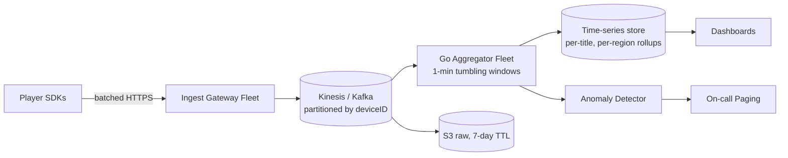
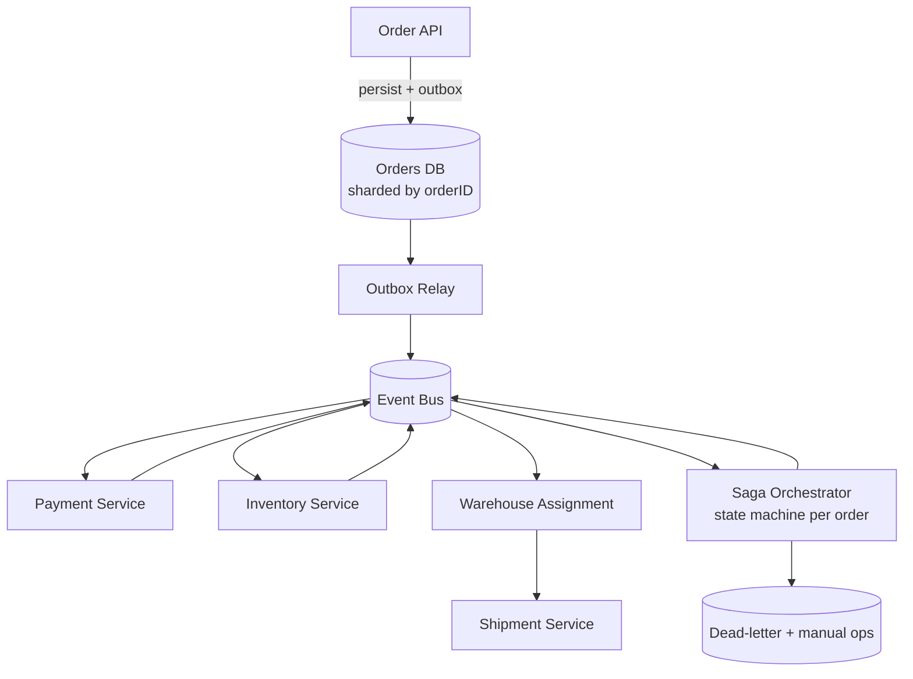
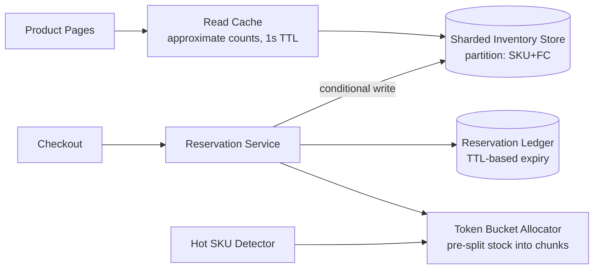
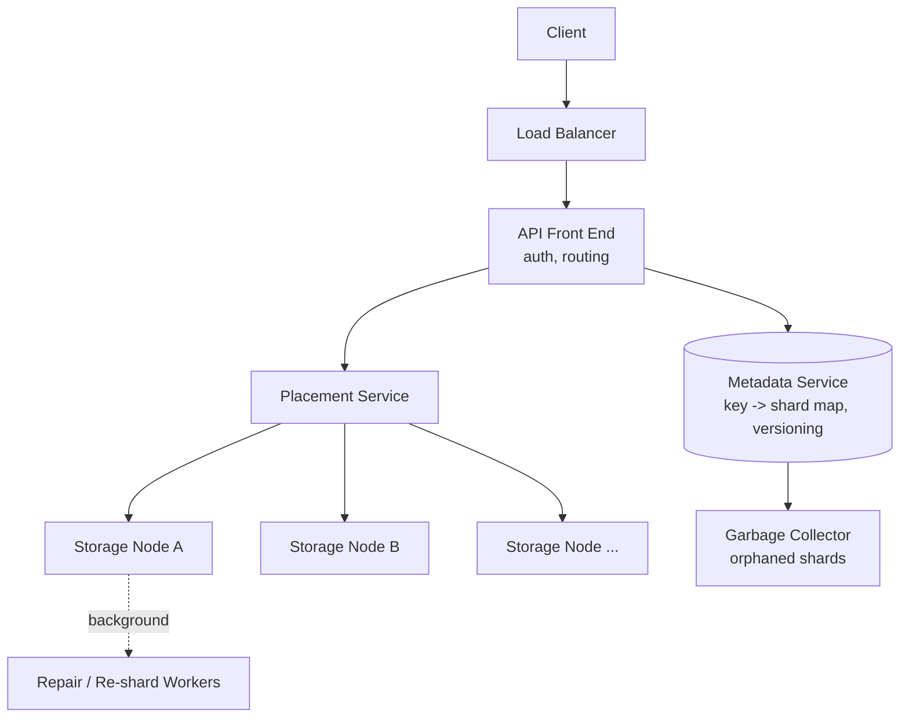
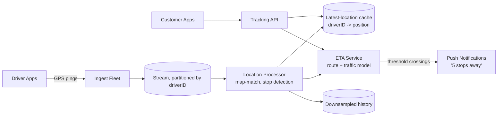

# Amazon-Style Go Interviews

A complete preparation guide for Go and backend engineers interviewing at Amazon (and AWS). Amazon does not hire "Go engineers" specifically — it hires backend engineers who can code in any mainstream language — but Go is fully accepted in every coding round, and many AWS and Prime Video teams run Go in production. This guide covers the process, the Leadership Principles, 20 coding questions with full Go solutions, 5 system design questions, and 15 Go-specific deep-dive questions.

---

## Amazon's Process for Backend/Go Roles

### Rounds Breakdown

| Stage | Format | Duration | What Is Evaluated |
|---|---|---|---|
| Online Assessment (OA) | 2 coding problems + work simulation + behavioral survey | ~2-3 hours | Correctness, edge cases, ability to finish under time pressure |
| Phone Screen | 1 coding problem + 1-2 LP questions | 45-60 min | Clean code, communication, one strong LP story |
| Onsite Loop | 4-5 rounds | ~4-5 hours | Coding (x2), system design (x1, SDE2+), LP/behavioral woven into every round |
| Bar Raiser | One of the onsite rounds | 60 min | Long-term hire quality, LP depth, raise-the-bar signal |
| Debrief | Internal | — | Hire/no-hire vote; Bar Raiser has veto power |

Key facts about the loop:

- **Every round includes Leadership Principle questions.** Expect 2-3 LP questions per round, taking 20-25 minutes of each hour. This is unique to Amazon: roughly 50% of your total interview time is behavioral.
- **Coding rounds** target LeetCode medium difficulty, occasionally hard. You must produce working code, not pseudocode. Go is welcome; interviewers care about correctness, naming, edge cases, and complexity analysis.
- **System design** appears at SDE2 and above. SDE3/Principal loops add a second design round and expect deep trade-off reasoning and scale math.
- **The OA matters more than people think.** Many candidates are cut at OA for failing edge cases. Test your code against empty inputs, single elements, duplicates, and overflow before submitting.

### The Bar Raiser Explained

The Bar Raiser is a trained interviewer from a *different* team with no stake in filling the role. Their mandate:

1. Ensure the candidate is better than 50% of current Amazonians at the same level ("raising the bar").
2. Veto power: a strong Bar Raiser "no" almost always kills the offer, regardless of other votes.
3. They dig deepest on Leadership Principles — expect aggressive follow-ups: "What exactly did *you* do?", "What was the metric before and after?", "What would you do differently?"

You usually will not know which interviewer is the Bar Raiser. Treat every round as if it were the Bar Raiser round.

### Leadership Principles Weight

| Level | Coding Weight | Design Weight | LP Weight |
|---|---|---|---|
| SDE1 | High | Low | Medium |
| SDE2 | High | Medium | High |
| SDE3 / Senior | Medium | High | Very High |
| Principal | Low | Very High | Decisive |

Prepare **2 STAR stories per Leadership Principle** (Situation, Task, Action, Result). Stories must have numbers: latency reduced from X to Y, cost saved, incidents prevented, deadline met. Each story should be reusable across 2-3 LPs.

---

## Leadership Principles Mapped to Go Engineering Stories

All 16 LPs, each with what it means, a Go-engineering story sketch you can adapt, and the trap candidates fall into.

### 1. Customer Obsession
- **Meaning:** Start with the customer and work backwards. Internal platform users count as customers.
- **Go story sketch:** "Service teams consuming our Go API complained about p99 latency spikes. I profiled with pprof, found GC pressure from per-request allocations, introduced `sync.Pool` for buffers, and cut p99 from 800ms to 90ms. I then published a latency SLO dashboard so customers could verify it themselves."
- **Trap:** Telling a story about pleasing your manager or shipping a feature without ever mentioning who the customer was or how you measured their pain.

### 2. Ownership
- **Meaning:** Act on behalf of the entire company; never say "that's not my job."
- **Go story sketch:** "A goroutine leak in a service owned by another team was exhausting shared cluster memory. Though it wasn't my code, I traced it with `runtime.NumGoroutine()` and goroutine dumps, found unclosed channel receivers, submitted the fix, and added a leak-detection check to the shared CI pipeline."
- **Trap:** Confusing ownership with heroics. Amazon wants sustainable ownership (fixing the system), not all-nighters.

### 3. Invent and Simplify
- **Meaning:** Find simpler solutions; invention does not mean complexity.
- **Go story sketch:** "Our team had three bespoke retry implementations across services. I replaced them with a 120-line generic Go retry package using exponential backoff with jitter and context cancellation, deleting ~900 lines of duplicated code."
- **Trap:** Describing an over-engineered system as "invention." Simplification stories often score higher than invention stories.

### 4. Are Right, A Lot
- **Meaning:** Strong judgment; seek diverse perspectives; disconfirm your own beliefs.
- **Go story sketch:** "I argued for gRPC over REST for an internal high-throughput service. I built a benchmark harness in Go comparing both under realistic payloads before deciding, and shared the data so the team could challenge it. The benchmark showed 3x throughput, and we adopted gRPC."
- **Trap:** Telling a story where you were right by luck or authority. The interviewer wants to hear how you *validated* judgment with data.

### 5. Learn and Be Curious
- **Meaning:** Never stop learning; explore beyond your domain.
- **Go story sketch:** "I read the Go runtime scheduler source to understand why our CPU-bound workers stalled network handlers. Learning about GOMAXPROCS and cooperative preemption led me to isolate CPU-heavy work in a bounded worker pool, fixing tail latency."
- **Trap:** Listing courses you took. Amazon wants curiosity that produced an outcome.

### 6. Hire and Develop the Best
- **Meaning:** Raise the performance bar with every hire; mentor others.
- **Go story sketch:** "I onboarded two engineers new to Go. I built a code-review checklist covering error wrapping, context propagation, and table-driven tests, and ran weekly pairing sessions. Their review iteration count dropped from 5 rounds to 2 within a quarter."
- **Trap:** Vague mentoring claims. Quantify the mentee's growth, not your generosity.

### 7. Insist on the Highest Standards
- **Meaning:** Relentlessly high bar; defects do not get sent downstream.
- **Go story sketch:** "I blocked a release when race detector runs were skipped in CI to save time. I made `go test -race` mandatory, fixed the three data races it found in the first week, and got buy-in by showing one race could corrupt billing records."
- **Trap:** Sounding like a perfectionist who slows the team. Pair the high standard with the customer impact it protected.

### 8. Think Big
- **Meaning:** Create bold direction; think beyond the immediate task.
- **Go story sketch:** "Asked to add metrics to one service, I instead proposed a shared Go observability middleware (metrics, traces, structured logs in one `http.Handler` wrapper) and drove adoption across 14 services, standardizing on-call debugging."
- **Trap:** Big ideas with no execution. Always land the story with delivered results.

### 9. Bias for Action
- **Meaning:** Speed matters; many decisions are reversible.
- **Go story sketch:** "During an incident, instead of waiting for a full root cause, I shipped a feature-flagged circuit breaker around the failing dependency within an hour, restoring availability, then did the deep fix afterwards."
- **Trap:** Confusing bias for action with recklessness. State explicitly that the decision was reversible and how you bounded the risk.

### 10. Frugality
- **Meaning:** Accomplish more with less; constraints breed invention.
- **Go story sketch:** "Our batch pipeline ran on 40 oversized instances. I rewrote the hot path to stream with `bufio.Scanner` instead of loading files into memory, dropping peak RSS 8x and cutting the fleet to 6 instances — roughly $90K/year saved."
- **Trap:** Telling a cost story with no number. Frugality stories without dollar or resource figures are weak.

### 11. Earn Trust
- **Meaning:** Listen, speak candidly, treat others respectfully; be self-critical.
- **Go story sketch:** "My change caused a production outage via an unchecked nil map write. I posted the correction-of-error doc myself, presented it to the org, and added a lint rule preventing the class of bug. Owning it publicly built more trust than hiding it would have."
- **Trap:** Refusing to show a real failure. Earn Trust questions ("tell me about a time you were wrong") demand genuine self-criticism.

### 12. Dive Deep
- **Meaning:** Operate at all levels; stay connected to details; audit metrics.
- **Go story sketch:** "A 'random' latency spike turned out to be the Go GC: I correlated `GODEBUG=gctrace=1` output with p99 spikes, found a 2GB transient allocation in JSON decoding, switched to a streaming decoder, and GC pauses dropped below 1ms."
- **Trap:** Stopping at the surface ("we restarted the service and it worked"). Dive Deep stories must reach root cause.

### 13. Have Backbone; Disagree and Commit
- **Meaning:** Challenge decisions respectfully; once decided, commit fully.
- **Go story sketch:** "I disagreed with adopting a shared ORM for our Go services, arguing it hid N+1 queries. I presented benchmarks; the team still chose the ORM for velocity. I committed: I wrote the query-logging middleware that caught regressions, making the chosen path safer."
- **Trap:** Telling only the "I was right and they listened" version. The strongest stories show you committing to a decision you disagreed with.

### 14. Deliver Results
- **Meaning:** Deliver quality outcomes on time despite setbacks.
- **Go story sketch:** "A payments migration was slipping because a vendor SDK lacked Go support. I wrote a thin gRPC sidecar around their Java SDK in a week so the Go services could integrate on schedule, and we launched on the committed date."
- **Trap:** Describing effort instead of results. The story must end with the thing shipping and a metric.

### 15. Strive to be Earth's Best Employer
- **Meaning:** Create a safer, more productive, more diverse work environment.
- **Go story sketch:** "On-call was burning the team out with noisy alerts. I led an alert audit, deleted 60% of pages, converted the rest to SLO-burn-rate alerts, and pages dropped from ~30 to ~4 per week, measurably improving on-call satisfaction surveys."
- **Trap:** Treating this LP as HR fluff. Engineers answer it best through operational-health and team-sustainability stories.

### 16. Success and Scale Bring Broad Responsibility
- **Meaning:** Be humble about impact; leave things better than you found them.
- **Go story sketch:** "Our service's retries were unintentionally DDoSing a partner's API during their outages. I implemented client-side circuit breaking and exponential backoff with jitter, and shared the pattern as an internal library so other teams stopped doing the same harm."
- **Trap:** No story at all. This is the newest LP and most candidates blank on it; prepare blast-radius, sustainability, or downstream-impact stories.

---

## 20 Amazon-Style Coding Questions in Go

Amazon coding rounds reward: clarifying questions first, a stated approach, clean idiomatic code, edge cases, and a complexity statement at the end. Each solution below is complete and compiles.

### 1. Two Sum

**Problem:** Given an array of integers and a target, return indices of two numbers that add up to the target. Exactly one solution exists.

```go
func twoSum(nums []int, target int) []int {
	seen := make(map[int]int, len(nums)) // value -> index
	for i, n := range nums {
		if j, ok := seen[target-n]; ok {
			return []int{j, i}
		}
		seen[n] = i
	}
	return nil
}
```

**Complexity:** O(n) time, O(n) space.

### 2. Two Sum II — Sorted Input (variant)

**Problem:** Same as Two Sum, but the input is sorted ascending. Return 1-indexed positions using O(1) extra space.

```go
func twoSumSorted(numbers []int, target int) []int {
	lo, hi := 0, len(numbers)-1
	for lo < hi {
		sum := numbers[lo] + numbers[hi]
		switch {
		case sum == target:
			return []int{lo + 1, hi + 1}
		case sum < target:
			lo++
		default:
			hi--
		}
	}
	return nil
}
```

**Complexity:** O(n) time, O(1) space. Amazon loves asking why the two-pointer invariant is safe: every move discards pairs that cannot possibly sum to the target.

### 3. Three Sum (variant)

**Problem:** Return all unique triplets that sum to zero.

```go
import "sort"

func threeSum(nums []int) [][]int {
	sort.Ints(nums)
	var res [][]int
	for i := 0; i < len(nums)-2; i++ {
		if i > 0 && nums[i] == nums[i-1] {
			continue // skip duplicate anchors
		}
		lo, hi := i+1, len(nums)-1
		for lo < hi {
			sum := nums[i] + nums[lo] + nums[hi]
			switch {
			case sum == 0:
				res = append(res, []int{nums[i], nums[lo], nums[hi]})
				for lo < hi && nums[lo] == nums[lo+1] {
					lo++
				}
				for lo < hi && nums[hi] == nums[hi-1] {
					hi--
				}
				lo++
				hi--
			case sum < 0:
				lo++
			default:
				hi--
			}
		}
	}
	return res
}
```

**Complexity:** O(n²) time, O(1) extra space (excluding output).

### 4. LRU Cache

**Problem:** Design a cache with `Get` and `Put` in O(1), evicting the least recently used entry at capacity. An Amazon classic — expect it in OA or phone screens.

```go
import "container/list"

type entry struct {
	key, value int
}

type LRUCache struct {
	cap   int
	ll    *list.List               // front = most recently used
	items map[int]*list.Element
}

func NewLRUCache(capacity int) *LRUCache {
	return &LRUCache{
		cap:   capacity,
		ll:    list.New(),
		items: make(map[int]*list.Element, capacity),
	}
}

func (c *LRUCache) Get(key int) int {
	el, ok := c.items[key]
	if !ok {
		return -1
	}
	c.ll.MoveToFront(el)
	return el.Value.(*entry).value
}

func (c *LRUCache) Put(key, value int) {
	if el, ok := c.items[key]; ok {
		el.Value.(*entry).value = value
		c.ll.MoveToFront(el)
		return
	}
	if c.ll.Len() == c.cap {
		oldest := c.ll.Back()
		c.ll.Remove(oldest)
		delete(c.items, oldest.Value.(*entry).key)
	}
	c.items[key] = c.ll.PushFront(&entry{key, value})
}
```

**Complexity:** O(1) per operation, O(capacity) space. Follow-up they ask: make it thread-safe (wrap with `sync.Mutex`) and add TTL.

### 5. Merge Intervals

**Problem:** Given intervals, merge all overlapping ones.

```go
import "sort"

func mergeIntervals(intervals [][]int) [][]int {
	if len(intervals) == 0 {
		return nil
	}
	sort.Slice(intervals, func(i, j int) bool {
		return intervals[i][0] < intervals[j][0]
	})
	res := [][]int{intervals[0]}
	for _, cur := range intervals[1:] {
		last := res[len(res)-1]
		if cur[0] <= last[1] {
			if cur[1] > last[1] {
				last[1] = cur[1]
			}
		} else {
			res = append(res, cur)
		}
	}
	return res
}
```

**Complexity:** O(n log n) time for the sort, O(n) space for output.

### 6. Top K Frequent Elements

**Problem:** Return the k most frequent elements in an array.

```go
import "container/heap"

type freqHeap struct {
	vals  []int
	count map[int]int
}

func (h freqHeap) Len() int            { return len(h.vals) }
func (h freqHeap) Less(i, j int) bool  { return h.count[h.vals[i]] < h.count[h.vals[j]] }
func (h freqHeap) Swap(i, j int)       { h.vals[i], h.vals[j] = h.vals[j], h.vals[i] }
func (h *freqHeap) Push(x interface{}) { h.vals = append(h.vals, x.(int)) }
func (h *freqHeap) Pop() interface{} {
	old := h.vals
	n := len(old)
	x := old[n-1]
	h.vals = old[:n-1]
	return x
}

func topKFrequent(nums []int, k int) []int {
	count := make(map[int]int)
	for _, n := range nums {
		count[n]++
	}
	h := &freqHeap{count: count}
	heap.Init(h)
	for v := range count {
		heap.Push(h, v)
		if h.Len() > k {
			heap.Pop(h) // evict least frequent; heap stays size k
		}
	}
	return h.vals
}
```

**Complexity:** O(n log k) time, O(n) space. Mention the O(n) bucket-sort alternative — interviewers award points for knowing both.

### 7. Word Ladder

**Problem:** Given `beginWord`, `endWord`, and a word list, return the length of the shortest transformation sequence changing one letter at a time, where each intermediate word is in the list. Return 0 if impossible.

```go
func ladderLength(beginWord, endWord string, wordList []string) int {
	dict := make(map[string]bool, len(wordList))
	for _, w := range wordList {
		dict[w] = true
	}
	if !dict[endWord] {
		return 0
	}
	queue := []string{beginWord}
	steps := 1
	for len(queue) > 0 {
		next := queue[:0:0] // fresh slice, avoids aliasing
		for _, word := range queue {
			if word == endWord {
				return steps
			}
			b := []byte(word)
			for i := 0; i < len(b); i++ {
				orig := b[i]
				for c := byte('a'); c <= 'z'; c++ {
					if c == orig {
						continue
					}
					b[i] = c
					cand := string(b)
					if dict[cand] {
						delete(dict, cand) // mark visited
						next = append(next, cand)
					}
				}
				b[i] = orig
			}
		}
		queue = next
		steps++
	}
	return 0
}
```

**Complexity:** O(N · L · 26) where N is dictionary size and L word length; O(N) space. BFS guarantees shortest path. Follow-up: bidirectional BFS halves the search frontier.

### 8. Copy List with Random Pointer

**Problem:** Deep-copy a linked list where each node has a `Next` and a `Random` pointer.

```go
type RandomNode struct {
	Val    int
	Next   *RandomNode
	Random *RandomNode
}

func copyRandomList(head *RandomNode) *RandomNode {
	if head == nil {
		return nil
	}
	// Pass 1: interleave copies — A -> A' -> B -> B'
	for n := head; n != nil; n = n.Next.Next {
		n.Next = &RandomNode{Val: n.Val, Next: n.Next}
	}
	// Pass 2: wire Random pointers on the copies.
	for n := head; n != nil; n = n.Next.Next {
		if n.Random != nil {
			n.Next.Random = n.Random.Next
		}
	}
	// Pass 3: detach the copied list and restore the original.
	dummy := &RandomNode{}
	tail := dummy
	for n := head; n != nil; n = n.Next {
		tail.Next = n.Next
		tail = tail.Next
		n.Next = n.Next.Next
	}
	return dummy.Next
}
```

**Complexity:** O(n) time, O(1) extra space (the map-based version is O(n) space — mention both).

### 9. Course Schedule (Cycle Detection)

**Problem:** Given `numCourses` and prerequisite pairs `[a, b]` (take b before a), determine whether all courses can be finished.

```go
func canFinish(numCourses int, prerequisites [][]int) bool {
	adj := make([][]int, numCourses)
	indegree := make([]int, numCourses)
	for _, p := range prerequisites {
		course, pre := p[0], p[1]
		adj[pre] = append(adj[pre], course)
		indegree[course]++
	}
	queue := []int{}
	for c := 0; c < numCourses; c++ {
		if indegree[c] == 0 {
			queue = append(queue, c)
		}
	}
	taken := 0
	for len(queue) > 0 {
		c := queue[0]
		queue = queue[1:]
		taken++
		for _, next := range adj[c] {
			indegree[next]--
			if indegree[next] == 0 {
				queue = append(queue, next)
			}
		}
	}
	return taken == numCourses
}
```

**Complexity:** O(V + E) time and space (Kahn's algorithm / topological sort). Follow-up: return the actual ordering (Course Schedule II) — the `taken` counter becomes an output slice.

### 10. Rotting Oranges

**Problem:** Grid of 0 (empty), 1 (fresh), 2 (rotten). Each minute, rotten oranges rot 4-directional fresh neighbors. Return minutes until no fresh orange remains, or -1.

```go
func orangesRotting(grid [][]int) int {
	rows, cols := len(grid), len(grid[0])
	type cell struct{ r, c int }
	queue := []cell{}
	fresh := 0
	for r := 0; r < rows; r++ {
		for c := 0; c < cols; c++ {
			switch grid[r][c] {
			case 2:
				queue = append(queue, cell{r, c})
			case 1:
				fresh++
			}
		}
	}
	if fresh == 0 {
		return 0
	}
	dirs := [4][2]int{{-1, 0}, {1, 0}, {0, -1}, {0, 1}}
	minutes := 0
	for len(queue) > 0 && fresh > 0 {
		next := queue[:0:0]
		for _, cur := range queue {
			for _, d := range dirs {
				r, c := cur.r+d[0], cur.c+d[1]
				if r >= 0 && r < rows && c >= 0 && c < cols && grid[r][c] == 1 {
					grid[r][c] = 2
					fresh--
					next = append(next, cell{r, c})
				}
			}
		}
		queue = next
		minutes++
	}
	if fresh > 0 {
		return -1
	}
	return minutes
}
```

**Complexity:** O(rows × cols) time and space. Multi-source BFS — Amazon uses this exact pattern for "warehouse spread" reskins.

### 11. Trapping Rain Water

**Problem:** Given elevation heights, compute how much water is trapped after raining.

```go
func trap(height []int) int {
	lo, hi := 0, len(height)-1
	leftMax, rightMax := 0, 0
	water := 0
	for lo < hi {
		if height[lo] < height[hi] {
			if height[lo] >= leftMax {
				leftMax = height[lo]
			} else {
				water += leftMax - height[lo]
			}
			lo++
		} else {
			if height[hi] >= rightMax {
				rightMax = height[hi]
			} else {
				water += rightMax - height[hi]
			}
			hi--
		}
	}
	return water
}
```

**Complexity:** O(n) time, O(1) space. Be ready to explain the invariant: water at the lower side is bounded by that side's max, because the other side is already known to be taller.

### 12. Design Hit Counter

**Problem:** Count hits in the past 300 seconds. `Hit(timestamp)` records, `GetHits(timestamp)` returns the count in the trailing window.

```go
type HitCounter struct {
	times [300]int // timestamp stored in bucket
	hits  [300]int // hit count for that timestamp
}

func (h *HitCounter) Hit(timestamp int) {
	i := timestamp % 300
	if h.times[i] != timestamp {
		h.times[i] = timestamp
		h.hits[i] = 0
	}
	h.hits[i]++
}

func (h *HitCounter) GetHits(timestamp int) int {
	total := 0
	for i := 0; i < 300; i++ {
		if timestamp-h.times[i] < 300 {
			total += h.hits[i]
		}
	}
	return total
}
```

**Complexity:** O(1) for `Hit`, O(300) = O(1) for `GetHits`, O(1) space. Follow-up Amazon asks: scale to millions of QPS — answer with sharded counters per goroutine/atomic adds, and eventual aggregation.

### 13. K Closest Points to Origin

```go
import "sort"

func kClosest(points [][]int, k int) [][]int {
	sort.Slice(points, func(i, j int) bool {
		di := points[i][0]*points[i][0] + points[i][1]*points[i][1]
		dj := points[j][0]*points[j][0] + points[j][1]*points[j][1]
		return di < dj
	})
	return points[:k]
}
```

**Complexity:** O(n log n). Mention the max-heap O(n log k) and quickselect O(n) average alternatives — the trade-off discussion is the real question.

### 14. Number of Islands

```go
func numIslands(grid [][]byte) int {
	rows, cols := len(grid), len(grid[0])
	var sink func(r, c int)
	sink = func(r, c int) {
		if r < 0 || r >= rows || c < 0 || c >= cols || grid[r][c] != '1' {
			return
		}
		grid[r][c] = '0'
		sink(r+1, c)
		sink(r-1, c)
		sink(r, c+1)
		sink(r, c-1)
	}
	count := 0
	for r := 0; r < rows; r++ {
		for c := 0; c < cols; c++ {
			if grid[r][c] == '1' {
				count++
				sink(r, c)
			}
		}
	}
	return count
}
```

**Complexity:** O(rows × cols) time; O(rows × cols) worst-case stack depth (mention iterative BFS to avoid deep recursion on huge grids).

### 15. Longest Substring Without Repeating Characters

```go
func lengthOfLongestSubstring(s string) int {
	lastSeen := make(map[byte]int)
	best, start := 0, 0
	for i := 0; i < len(s); i++ {
		if j, ok := lastSeen[s[i]]; ok && j >= start {
			start = j + 1
		}
		lastSeen[s[i]] = i
		if i-start+1 > best {
			best = i - start + 1
		}
	}
	return best
}
```

**Complexity:** O(n) time, O(min(n, alphabet)) space. If the interviewer says "Unicode input," switch to `for i, r := range s` and `map[rune]int`.

### 16. Meeting Rooms II (Minimum Conference Rooms)

```go
import "sort"

func minMeetingRooms(intervals [][]int) int {
	starts := make([]int, len(intervals))
	ends := make([]int, len(intervals))
	for i, iv := range intervals {
		starts[i], ends[i] = iv[0], iv[1]
	}
	sort.Ints(starts)
	sort.Ints(ends)
	rooms, maxRooms, e := 0, 0, 0
	for s := 0; s < len(starts); s++ {
		for e < len(ends) && ends[e] <= starts[s] {
			rooms--
			e++
		}
		rooms++
		if rooms > maxRooms {
			maxRooms = rooms
		}
	}
	return maxRooms
}
```

**Complexity:** O(n log n) time, O(n) space. This is the "Amazon Fresh delivery slots" reskin.

### 17. Reorder Log Files (Amazon original)

**Problem:** Logs are `"id words..."`. Letter-logs (content is words) come before digit-logs; letter-logs sort by content then identifier; digit-logs keep original order.

```go
import (
	"sort"
	"strings"
)

func reorderLogFiles(logs []string) []string {
	isDigitLog := func(log string) bool {
		_, rest, _ := strings.Cut(log, " ")
		return rest[0] >= '0' && rest[0] <= '9'
	}
	sort.SliceStable(logs, func(i, j int) bool {
		di, dj := isDigitLog(logs[i]), isDigitLog(logs[j])
		if di || dj {
			return !di && dj // letter-logs before digit-logs; digit order stable
		}
		idI, restI, _ := strings.Cut(logs[i], " ")
		idJ, restJ, _ := strings.Cut(logs[j], " ")
		if restI != restJ {
			return restI < restJ
		}
		return idI < idJ
	})
	return logs
}
```

**Complexity:** O(n log n · L) where L is max log length. Key Go point: `sort.SliceStable` preserves digit-log order — using `sort.Slice` is the classic bug.

### 18. Subtree Maximum Path Sum (Binary Tree Maximum Path Sum)

```go
type TreeNode struct {
	Val   int
	Left  *TreeNode
	Right *TreeNode
}

func maxPathSum(root *TreeNode) int {
	best := root.Val
	var gain func(n *TreeNode) int
	gain = func(n *TreeNode) int {
		if n == nil {
			return 0
		}
		left := max(0, gain(n.Left))   // negative branches contribute nothing
		right := max(0, gain(n.Right))
		if n.Val+left+right > best {
			best = n.Val + left + right // path may bend through n
		}
		return n.Val + max(left, right) // only one side may extend upward
	}
	gain(root)
	return best
}
```

**Complexity:** O(n) time, O(h) stack space. (Go 1.21+ provides built-in `max`.)

### 19. Search in Rotated Sorted Array

```go
func searchRotated(nums []int, target int) int {
	lo, hi := 0, len(nums)-1
	for lo <= hi {
		mid := lo + (hi-lo)/2
		if nums[mid] == target {
			return mid
		}
		if nums[lo] <= nums[mid] { // left half sorted
			if nums[lo] <= target && target < nums[mid] {
				hi = mid - 1
			} else {
				lo = mid + 1
			}
		} else { // right half sorted
			if nums[mid] < target && target <= nums[hi] {
				lo = mid + 1
			} else {
				hi = mid - 1
			}
		}
	}
	return -1
}
```

**Complexity:** O(log n) time, O(1) space. Note the overflow-safe midpoint `lo + (hi-lo)/2` — interviewers notice it.

### 20. Concurrent Web Crawler (Go-flavored Amazon favorite)

**Problem:** Given a start URL and a `Fetch(url) ([]string, error)` function, crawl all reachable URLs on the same host concurrently without visiting any URL twice.

```go
import (
	"net/url"
	"sync"
)

type Fetcher interface {
	Fetch(u string) ([]string, error)
}

func Crawl(start string, fetcher Fetcher) []string {
	host := hostOf(start)
	var (
		mu      sync.Mutex
		wg      sync.WaitGroup
		visited = map[string]bool{start: true}
	)
	sem := make(chan struct{}, 16) // bound concurrency

	var crawl func(u string)
	crawl = func(u string) {
		defer wg.Done()
		sem <- struct{}{}
		links, err := fetcher.Fetch(u)
		<-sem
		if err != nil {
			return
		}
		for _, link := range links {
			if hostOf(link) != host {
				continue
			}
			mu.Lock()
			if !visited[link] {
				visited[link] = true
				wg.Add(1)
				go crawl(link)
			}
			mu.Unlock()
		}
	}

	wg.Add(1)
	go crawl(start)
	wg.Wait()

	mu.Lock()
	defer mu.Unlock()
	result := make([]string, 0, len(visited))
	for u := range visited {
		result = append(result, u)
	}
	return result
}

func hostOf(raw string) string {
	u, err := url.Parse(raw)
	if err != nil {
		return ""
	}
	return u.Hostname()
}
```

**Complexity:** O(V + E) over the URL graph; concurrency bounded at 16 in-flight fetches. Discussion points the interviewer wants: marking visited *before* spawning (prevents duplicate work), the semaphore channel pattern, and what changes with `context.Context` cancellation.

---

## 5 System Design Questions Amazon Asks

Amazon design rounds follow a working-backwards style: clarify requirements, state scale assumptions out loud, draw the architecture, then dive deep on one or two components. Always do the scale math explicitly.

### 1. Design the Prime Video Metrics Pipeline

**Requirements:** Ingest playback telemetry (start, buffer, bitrate switch, error) from ~200M devices; near-real-time dashboards (under 1 min lag); exact-ish counts for billing-adjacent metrics; 13-month retention for trend analysis.

**Scale math:** 200M devices × ~1 event/10s at peak ≈ 20M events/s peak; assume 50M sustained viewers → ~5M events/s sustained. At ~500 bytes/event that is ~2.5 GB/s sustained ingest, ~216 TB/day raw, so raw retention is impossible — aggregate early, keep raw for 7 days only.



**Go implementation notes:**
- Ingest gateway: `net/http` with batched, gzip-compressed payloads; decode with a streaming `json.Decoder`; one `sync.Pool` for event buffers to control GC at millions of QPS per fleet.
- Aggregators: one goroutine per partition consuming sequentially (preserves ordering), tumbling-window maps flushed by a `time.Ticker`; flush on shutdown via `context` + `signal.NotifyContext`.
- Backpressure: bounded channels between consume and aggregate stages; if the channel fills, pause the partition consumer rather than dropping (the broker is the buffer).
- Exactly-once is too expensive at this volume; use at-least-once with idempotent, last-writer-wins window upserts keyed by `(window, title, region)`.

### 2. Design an Order Fulfillment System

**Requirements:** Take a placed order through payment confirmation, inventory reservation, warehouse assignment, and shipment creation. No lost orders, no double-shipment, partial failure recovery, ~5K orders/s peak (Prime Day ~10x normal).

**Scale math:** 5K orders/s × ~10 state transitions = 50K events/s; each order document ~5 KB → ~25 MB/s order writes, trivially shardable by `orderID`.



**Go implementation notes:**
- Model the order as an explicit state machine: a `type OrderState string` with a transition table `map[OrderState][]OrderState`; reject illegal transitions — this catches duplicate/out-of-order events.
- Transactional outbox: write the order row and the event row in one DB transaction; a Go relay goroutine polls the outbox and publishes — never publish from inside the request handler.
- Saga compensation: if warehouse assignment fails after payment capture, the orchestrator emits `RefundRequested`. Compensations must be idempotent — key every handler on `(orderID, eventID)` deduplication.
- Use `errgroup.WithContext` for fan-out checks (fraud, address validation) so one failure cancels the rest.

### 3. Design an Inventory Service

**Requirements:** Track stock per (SKU, fulfillment center); support reserve/release/commit; never oversell; read-heavy (product pages) with bursty write contention on hot SKUs (lightning deals); 500M SKUs, reads ~1M QPS, writes ~50K QPS.

**Scale math:** 500M SKUs × 50 FCs avg ≈ 25B rows logically, but ~95% of SKUs are in <5 FCs → ~3B rows; at 100 bytes/row ≈ 300 GB, fits a sharded store easily. The hard part is not size — it is hot-key contention: a lightning deal can put 20K reserve/s on one SKU.



**Go implementation notes:**
- Correctness primitive: conditional update (`UPDATE ... SET available = available - 1 WHERE available >= 1` or DynamoDB condition expressions) — never read-modify-write.
- Hot SKUs: pre-split stock into N chunks owned by N shards; each shard hands out reservations from its chunk using a local `sync.Mutex`-guarded counter, rebalancing chunks in the background. This converts one hot row into N warm rows.
- Reservations carry a TTL; a background goroutine (ticker + batch scan) releases expired holds. Make release idempotent: deleting an already-released reservation is a no-op.
- Product-page reads tolerate staleness: serve "in stock / low stock / out of stock" buckets from cache; only checkout touches authoritative counts.

### 4. Design an S3-like Blob Store (Basics)

**Requirements:** PUT/GET/DELETE objects up to 5 TB; 11 nines durability; read-after-write consistency; bucket+key namespace; multipart upload.

**Scale math:** Durability via erasure coding: 12+4 Reed-Solomon shards across failure domains tolerates 4 simultaneous shard losses at 1.33x storage overhead vs 3x for replication. A 100 PB cluster needs ~133 PB raw with EC instead of 300 PB replicated.



**Go implementation notes:**
- Streaming is everything: PUT handlers use `io.Reader` end-to-end — never buffer a 5 TB object. `io.TeeReader` computes the checksum while streaming shards out; `io.LimitReader` enforces part sizes.
- Multipart upload: each part is an independent object shard set; "complete multipart" is a metadata-only commit that links parts in order — this is why it is atomic and resumable.
- Read-after-write consistency comes from the metadata service: a GET first hits metadata (strongly consistent store), which returns the shard map for the committed version.
- Repair workers: erasure-decode from surviving shards and rewrite; rate-limit with a token bucket (`golang.org/x/time/rate`) so repair never starves foreground traffic.

### 5. Design a Delivery Tracking System

**Requirements:** Real-time package location for customers ("5 stops away"); driver apps send GPS every 4-10 s; ~2M concurrent drivers peak; customers poll or get pushed updates; ETA computation; 30-day history.

**Scale math:** 2M drivers × 1 ping/5 s = 400K location writes/s. Each ping ~100 bytes → 40 MB/s ingest, ~3.5 TB/day; keep full-resolution traces 48 h, downsample to per-stop events for 30-day history. Customer reads: 50M active tracking sessions polling every 30 s ≈ 1.6M reads/s — must be cache-served.



**Go implementation notes:**
- Latest-location is a pure overwrite workload: an in-memory sharded map (`[256]struct{ mu sync.RWMutex; m map[string]Position }`, shard by FNV hash of driverID) in the cache tier handles millions of writes/s per node; persistence is best-effort because the next ping arrives in 5 s.
- Stop detection runs per-driver and is order-sensitive — partition the stream by driverID so one goroutine owns each driver's sequence; no locks needed inside the processor.
- Push "N stops away": the ETA service tracks a monotone stops-remaining counter per package and emits an event only on threshold crossings (10, 5, 1), deduplicated by `(packageID, threshold)`.
- Customer API: respond from cache with a `staleness` field; use long-polling or SSE for the live map rather than WebSockets if you want simpler load-balancer behavior — be ready to defend either choice.

---

## 15 Go-Specific Questions Amazon Asks

These appear in phone screens as warm-ups and in onsite "dive deep" follow-ups when you choose Go as your language.

### 1. What is the difference between a slice and an array in Go, internally?

An array is a value type with a fixed length encoded in its type (`[4]int` and `[5]int` are different types); assigning or passing it copies all elements. A slice is a 3-word header — pointer to a backing array, length, and capacity. Copying a slice copies the header only, so two slices can alias the same backing array. `append` writes in place while `len < cap`; when capacity is exceeded it allocates a new backing array, copies, and returns a slice pointing to the new array — which is why you must use the return value of `append`, and why an `append` in a callee may or may not be visible to the caller.

### 2. Explain `len` vs `cap` and the classic aliasing bug.

```go
a := []int{1, 2, 3, 4}
b := a[:2]        // len 2, cap 4 — shares a's backing array
b = append(b, 99) // writes into a[2]! a is now [1 2 99 4]
```

Fix with a full slice expression `a[:2:2]`, which caps `b` so `append` reallocates. Amazon interviewers use this to test whether you actually understand slice headers.

### 3. How does the Go scheduler work (G, M, P)?

The runtime multiplexes **G**oroutines onto OS threads (**M**) via **P**rocessors (logical execution contexts, count = `GOMAXPROCS`). Each P has a local run queue; an M must hold a P to execute Go code. Work stealing: an idle P steals half of another P's queue. Blocking syscalls detach M from P so another M can run that P's goroutines; blocking channel/mutex operations just park the G (cheap, no thread involvement). Since Go 1.14, goroutines are asynchronously preemptible at ~10ms, so tight CPU loops no longer starve the scheduler.

### 4. When do goroutines leak, and how do you find leaks?

A goroutine leaks when it blocks forever: receiving on a channel no one will send to, sending on an unbuffered channel no one reads (a classic bug in timeout patterns), or waiting on a `sync.WaitGroup` that never completes. Detection: track `runtime.NumGoroutine()` over time, take a goroutine profile (`pprof.Lookup("goroutine")` or `/debug/pprof/goroutine?debug=2`), and in tests use `goleak`. Prevention: every goroutine you start should have a clear answer to "how does this exit?" — usually a `context.Context` or channel close.

### 5. Buffered vs unbuffered channels — when do you use each?

Unbuffered channels synchronize: the send completes only when a receiver takes the value, so they create a happens-before handoff and natural backpressure. Buffered channels decouple producer and consumer up to the buffer size; use them as bounded queues (worker pools) or semaphores (`make(chan struct{}, n)`). The trap answer interviewers probe: buffering does not fix a slow consumer — it only delays the stall; size buffers from throughput math, not guesses.

### 6. Show the fan-out/fan-in pattern.

```go
func process(ctx context.Context, jobs <-chan Job, workers int) <-chan Result {
	out := make(chan Result)
	var wg sync.WaitGroup
	wg.Add(workers)
	for i := 0; i < workers; i++ {
		go func() {
			defer wg.Done()
			for j := range jobs {
				select {
				case out <- handle(j):
				case <-ctx.Done():
					return
				}
			}
		}()
	}
	go func() {
		wg.Wait()
		close(out) // close exactly once, by the only owner
	}()
	return out
}
```

The points being tested: only the sender side closes a channel, the `WaitGroup`+closer-goroutine idiom, and select-with-context so workers exit on cancellation instead of blocking on `out`.

### 7. How does `context` cancellation actually work?

`context.WithCancel` returns a child context whose `Done()` channel is closed when `cancel()` is called or the parent is canceled — cancellation propagates down the tree, never up. Nothing is forcibly stopped: cancellation is cooperative; code must check `ctx.Done()` in selects or call `ctx.Err()` at loop boundaries. Standard library integration (e.g., `http.Request.Context()`, `database/sql`) does this checking for you. Rules Amazon expects: pass `ctx` as the first parameter, never store it in a struct field (except request-scoped types), always call the returned `cancel` (typically `defer cancel()`) to release the parent's reference and timer.

### 8. Explain error wrapping with `%w`, `errors.Is`, and `errors.As`.

```go
var ErrNotFound = errors.New("not found")

func getOrder(id string) (*Order, error) {
	o, err := db.fetch(id)
	if err != nil {
		return nil, fmt.Errorf("getOrder %s: %w", id, err) // wrap, keep chain
	}
	return o, nil
}

// Caller:
if errors.Is(err, ErrNotFound) { /* 404 */ }
var verr *ValidationError
if errors.As(err, &verr) { /* use verr.Field */ }
```

`%w` stores the wrapped error so `errors.Is` (sentinel comparison through the chain) and `errors.As` (type extraction through the chain) work. Use `%v` instead of `%w` at trust boundaries where you deliberately do not want callers depending on internal error types — knowing *when not to wrap* is the senior-level part of the answer.

### 9. How is interface satisfaction checked, and what is a nil-interface bug?

Satisfaction is structural and compile-time: any type with the right method set implements the interface implicitly. An interface value is two words: (type descriptor, data pointer). The infamous bug:

```go
func find() error {
	var p *MyErr // nil pointer
	// ...
	return p // interface is (*MyErr, nil) — NOT nil!
}
// find() != nil is true even though p was nil.
```

An interface is `nil` only if *both* words are nil. Fix: return a literal `nil` on the success path. Also know the compile-time conformance assertion: `var _ http.Handler = (*MyHandler)(nil)`.

### 10. Value receiver vs pointer receiver — how does it affect interfaces?

The method set of `T` contains methods with value receivers; the method set of `*T` contains both value- and pointer-receiver methods. So if `Write` has a pointer receiver, `T` does not satisfy `io.Writer` — only `*T` does, and storing a `T` value in the interface fails to compile. Practical rule: if any method needs a pointer receiver (mutation, large struct, or contains a mutex), make all receivers pointers for consistency.

### 11. How does Go's garbage collector behave under load?

Go uses a concurrent, tri-color mark-and-sweep collector with very short stop-the-world pauses (typically well under 1ms — just for phase transitions). It is paced by `GOGC` (default 100: collect when the heap doubles over the live set) and, since Go 1.19, bounded by `GOMEMLIMIT`. Under allocation-heavy load: GC runs more often, mark assists make *allocating goroutines* pay GC cost directly (this shows up as mysterious latency in the allocating request paths), and ~25% of CPU goes to background marking. Mitigations: reduce allocation rate (the real fix — `sync.Pool`, preallocated slices, streaming instead of buffering), raise `GOGC` to trade memory for CPU, set `GOMEMLIMIT` in containers to avoid OOM kills. Diagnose with `GODEBUG=gctrace=1` and the `runtime/metrics` package.

### 12. `sync.Mutex` vs `sync.RWMutex` vs `atomic` — how do you choose?

| Primitive | Best For | Caveats |
|---|---|---|
| `sync.Mutex` | General critical sections | Simple, fast; default choice |
| `sync.RWMutex` | Read-mostly data with *long* read sections | Slower than Mutex under write contention or short reads; writer starvation handling adds cost |
| `sync/atomic` | Single-word counters, flags, pointer swaps (`atomic.Int64`, `atomic.Pointer[T]`) | No multi-field invariants; easy to misuse |
| Channels | Transferring ownership of data between goroutines | Wrong tool for protecting shared state in place |

The benchmark-backed nuance interviewers like: for very short read sections, `RWMutex` can be *slower* than plain `Mutex` because of reader-count bookkeeping — measure before choosing.

### 13. What does the race detector do, and what are its limits?

`go test -race` / `go build -race` instruments memory accesses and the synchronization graph (happens-before) using a vector-clock algorithm; it reports unsynchronized concurrent accesses where at least one is a write. Limits: it only catches races that *actually occur* in the executed interleavings (no false positives, but false negatives are possible), and it costs ~5-10x CPU and ~5-10x memory — so run it in CI and canaries, not in full production. A "benign race" does not exist in Go: any data race is undefined behavior per the memory model.

### 14. How do `defer`, `panic`, and `recover` interact, and what is the cost of `defer`?

`defer` pushes a call whose *arguments are evaluated immediately* but whose execution happens at function return, LIFO order. `panic` unwinds the stack running deferred calls; `recover` only stops unwinding when called directly inside a deferred function in the panicking goroutine — a panic in one goroutine cannot be recovered by another, and an unrecovered panic crashes the whole process (key point for server code: wrap goroutine entry points used for request handling). Since Go 1.14, open-coded defers make typical `defer` nearly free (~1ns), so "avoid defer for performance" is outdated advice except in extremely hot loops with loop-body defers.

### 15. How do you make a map safe for concurrent use, and when is `sync.Map` appropriate?

Plain maps are not goroutine-safe; concurrent read/write triggers a runtime throw (fatal, not recoverable). Standard fix: guard with `sync.RWMutex`, or shard the map (N maps each with its own mutex, pick shard by key hash) to reduce contention. `sync.Map` is appropriate only for two niches called out in its documentation: (1) write-once, read-many caches, and (2) disjoint key sets per goroutine. For general workloads a mutex-guarded map is faster and type-safe. Bonus point: mention that map iteration order is deliberately randomized, so any test depending on order is broken by design.

---

## Final Preparation Checklist

| Area | Target |
|---|---|
| LP stories | 2 per principle, STAR format, every story has a metric |
| Coding | All 20 problems above solvable in 25 minutes each, in Go, with tests in your head |
| System design | Practice saying scale math out loud; one Mermaid-style diagram per design from memory |
| Go internals | Slices, scheduler, GC, context, interfaces — be able to whiteboard each |
| Mock interviews | At least 2 full loops with LP + coding mixed in the same hour |

Remember the Amazon-specific failure modes: running out of time on coding because you skipped clarifying questions, LP answers with "we" instead of "I," and design answers without numbers. Fix those three and you are ahead of most of the candidate pool.
