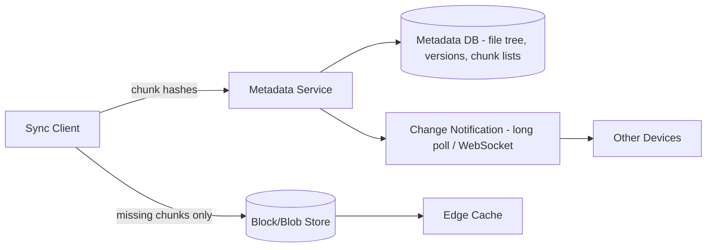
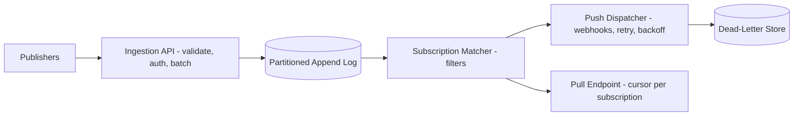
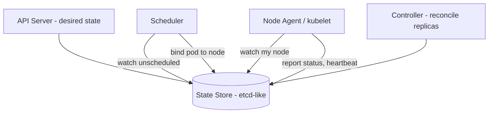
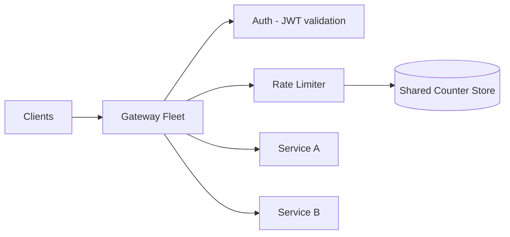
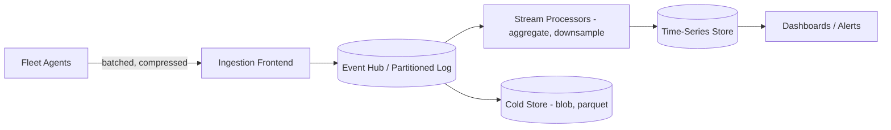
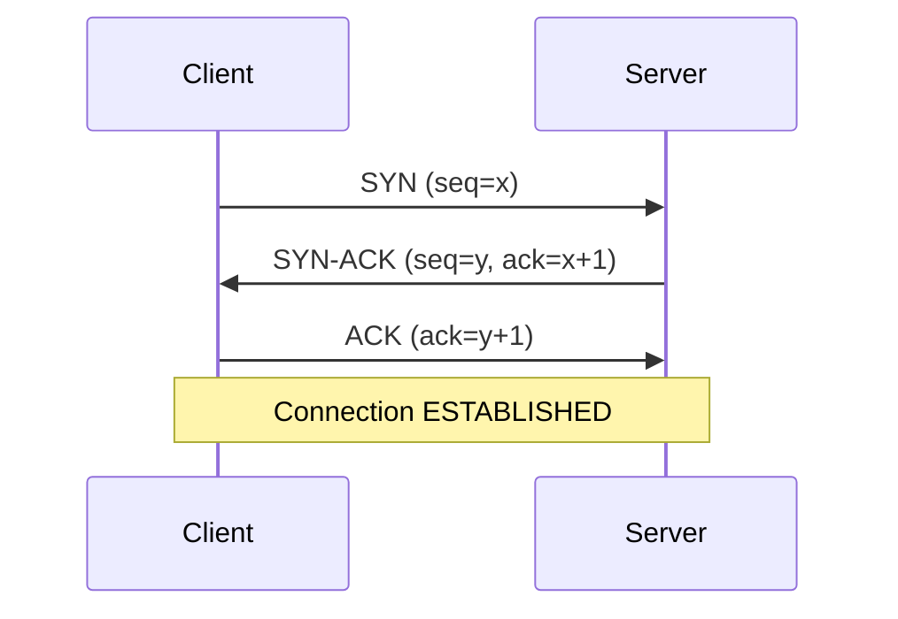

# Microsoft-Style Go Interviews

Microsoft is one of the largest employers of Go engineers outside of Google itself. Azure's container and cloud-native stack (AKS, Dapr, Draft, KEDA contributions), the CosmosDB Go SDK, and the high-profile TypeScript compiler port to Go (typescript-go) mean that Go fluency is a real, evaluated skill in many Microsoft loops — not just "any language is fine." This guide covers the process, the question styles Microsoft favors, and complete worked solutions in Go.

---

## Microsoft's Process for Go/Backend Roles (Azure Teams Use Lots of Go)

### The Typical Loop

| Stage | Format | Duration | What Is Evaluated |
|---|---|---|---|
| Recruiter screen | Phone call | 30 min | Background, team match, logistics |
| Technical phone screen | Codility/Teams + shared editor | 45–60 min | One medium coding problem, clean working code |
| Virtual onsite: Coding 1 | Live coding | 60 min | Data structures, edge cases, testing instinct |
| Virtual onsite: Coding 2 | Live coding | 60 min | Harder problem or design-flavored coding (min stack, LRU) |
| Virtual onsite: System design | Whiteboard/diagramming | 60 min | Distributed systems, Azure-flavored scenarios |
| Virtual onsite: Behavioral / Hiring Manager | Conversation | 45–60 min | Growth mindset, collaboration, ownership |
| AA (As-Appropriate) round | Conversation + technical probe | 45–60 min | Final calibration by a senior interviewer |

### The AA ("As-Appropriate") Interviewer

Microsoft's AA round is distinctive. The AA interviewer:

- Is a senior engineer or manager **outside** the immediate hiring team, often a Principal or Partner-level engineer.
- Receives feedback from all earlier rounds before your session and probes the weakest signal. If you stumbled on concurrency in Coding 2, expect the AA to revisit goroutines and channels.
- Has effective veto power. A strong AA round can rescue a borderline loop; a weak one usually ends it.
- Often asks a hybrid question: part coding, part design, part "tell me about a hard tradeoff you made."

Practical advice: do not relax in the final round. Treat the AA as the hardest interview of the day, and be ready to defend decisions you made in earlier rounds ("Why did you use a map there instead of a sorted slice?").

### What Azure / AKS / Dapr Teams Look For

| Signal | How It Is Tested | How To Show It |
|---|---|---|
| Idiomatic Go | Live coding in Go | Error handling with wrapped errors, table-driven thinking, no panics in library code |
| Concurrency literacy | Follow-up questions ("now make it concurrent") | Worker pools, `context.Context` propagation, `sync` primitives chosen deliberately |
| Distributed systems intuition | System design round | Partitioning, idempotency, backpressure, at-least-once vs exactly-once framing |
| Kubernetes/cloud-native familiarity | Design and AA rounds | Controllers/reconcile loops, sidecars, leader election, CRD mental model |
| Growth mindset (Satya-era culture) | Behavioral | "What did you learn" framing, learn-it-all over know-it-all |
| Customer obsession | Behavioral + design | Tie design choices to user impact, SLOs, cost |

Azure teams in particular will probe **operational maturity**: how do you roll out safely, what do you alert on, what happens when a dependency is down. Bring real production stories.

---

## Where Microsoft Uses Go

Knowing the Go footprint at Microsoft lets you frame answers in terms the interviewer recognizes.

| Project / Product | What It Is | Why It Matters In Interviews |
|---|---|---|
| AKS (Azure Kubernetes Service) | Managed Kubernetes; control plane and many operators written in Go | Kubernetes itself is Go; AKS interviewers expect comfort with reconcile loops, client-go patterns, controllers |
| Dapr (Distributed Application Runtime) | CNCF sidecar runtime for microservices, written in Go | Pub/sub, state stores, service invocation, actors — perfect vocabulary for design rounds |
| Draft | Tool that generates Dockerfiles/K8s manifests for apps, written in Go | Shows Go used for developer tooling and CLI design (cobra-style) |
| CosmosDB Go SDK (`azcosmos`) | Official Go client for Cosmos DB | Retry policies, partition keys, consistency levels — common SDK-design follow-ups |
| Azure SDK for Go (`azure-sdk-for-go`) | Full Azure client library suite | Pipeline/policy middleware design, paging, long-running operations |
| typescript-go | Port of the TypeScript compiler to Go (announced 2025, ~10x speedups) | Demonstrates Microsoft betting on Go for performance-critical, highly concurrent workloads; great talking point on why Go (goroutines for parallel type-checking, value types, fast startup) |
| KEDA, Radius, containerd contributions | Cloud-native OSS with heavy Microsoft involvement | Event-driven autoscaling and runtime internals come up in AKS loops |

**Why this matters for framing:** when asked "design a pub/sub service," referencing Dapr's building-block model or Event Grid semantics signals you understand the team's actual problem space. When asked "why Go?", the typescript-go port is a current, concrete example: Go was chosen for native code performance, easy concurrency for parallelizing compilation, and structural similarity to the existing codebase — a far better answer than generic "Go is fast."

---

## 20 Microsoft-Style Coding Questions in Go

Microsoft loops historically favor linked lists, string parsing, BST validation, matrices, and "design a data structure" problems. All solutions below compile and are idiomatic.

### 1. Reverse a Linked List (iterative and recursive)

**Problem:** Reverse a singly linked list. The single most-reported Microsoft warm-up.

```go
type ListNode struct {
	Val  int
	Next *ListNode
}

func reverseList(head *ListNode) *ListNode {
	var prev *ListNode
	for head != nil {
		next := head.Next
		head.Next = prev
		prev = head
		head = next
	}
	return prev
}

func reverseListRecursive(head *ListNode) *ListNode {
	if head == nil || head.Next == nil {
		return head
	}
	newHead := reverseListRecursive(head.Next)
	head.Next.Next = head
	head.Next = nil
	return newHead
}
```

**Complexity:** O(n) time; O(1) space iterative, O(n) stack recursive. Mention that production code should prefer the iterative form to avoid stack growth on long lists.

### 2. Detect Cycle in a Linked List and Find Its Start

```go
func detectCycle(head *ListNode) *ListNode {
	slow, fast := head, head
	for fast != nil && fast.Next != nil {
		slow = slow.Next
		fast = fast.Next.Next
		if slow == fast {
			// Floyd: reset one pointer to head; meeting point is cycle start.
			for slow = head; slow != fast; {
				slow = slow.Next
				fast = fast.Next
			}
			return slow
		}
	}
	return nil
}
```

**Complexity:** O(n) time, O(1) space. Be ready to prove why the reset trick works (distance algebra: head-to-start equals meeting-point-to-start modulo cycle length).

### 3. Merge Two Sorted Linked Lists

```go
func mergeTwoLists(a, b *ListNode) *ListNode {
	dummy := &ListNode{}
	tail := dummy
	for a != nil && b != nil {
		if a.Val <= b.Val {
			tail.Next, a = a, a.Next
		} else {
			tail.Next, b = b, b.Next
		}
		tail = tail.Next
	}
	if a != nil {
		tail.Next = a
	} else {
		tail.Next = b
	}
	return dummy.Next
}
```

**Complexity:** O(n+m) time, O(1) space. Follow-up is always question 4.

### 4. Merge K Sorted Lists (heap)

```go
import "container/heap"

type nodeHeap []*ListNode

func (h nodeHeap) Len() int            { return len(h) }
func (h nodeHeap) Less(i, j int) bool  { return h[i].Val < h[j].Val }
func (h nodeHeap) Swap(i, j int)       { h[i], h[j] = h[j], h[i] }
func (h *nodeHeap) Push(x interface{}) { *h = append(*h, x.(*ListNode)) }
func (h *nodeHeap) Pop() interface{} {
	old := *h
	n := len(old)
	x := old[n-1]
	*h = old[:n-1]
	return x
}

func mergeKLists(lists []*ListNode) *ListNode {
	h := &nodeHeap{}
	for _, l := range lists {
		if l != nil {
			*h = append(*h, l)
		}
	}
	heap.Init(h)
	dummy := &ListNode{}
	tail := dummy
	for h.Len() > 0 {
		n := heap.Pop(h).(*ListNode)
		tail.Next, tail = n, n
		if n.Next != nil {
			heap.Push(h, n.Next)
		}
	}
	return dummy.Next
}
```

**Complexity:** O(N log k) time where N is total nodes and k the list count; O(k) heap space.

### 5. Copy List with Random Pointer

**Problem:** Each node has `Next` and `Random`. Deep-copy the list. A Microsoft classic.

```go
type RandomNode struct {
	Val    int
	Next   *RandomNode
	Random *RandomNode
}

// O(1) extra space: interleave copies, wire randoms, then split.
func copyRandomList(head *RandomNode) *RandomNode {
	if head == nil {
		return nil
	}
	for n := head; n != nil; n = n.Next.Next {
		n.Next = &RandomNode{Val: n.Val, Next: n.Next}
	}
	for n := head; n != nil; n = n.Next.Next {
		if n.Random != nil {
			n.Next.Random = n.Random.Next
		}
	}
	copyHead := head.Next
	for n := head; n != nil; n = n.Next {
		copy := n.Next
		n.Next = copy.Next
		if copy.Next != nil {
			copy.Next = copy.Next.Next
		}
	}
	return copyHead
}
```

**Complexity:** O(n) time, O(1) auxiliary space (vs the easier O(n) map approach — mention both).

### 6. Validate a Binary Search Tree

**Problem:** Microsoft's favorite tree question. The trap is using only parent-child comparisons.

```go
type TreeNode struct {
	Val   int
	Left  *TreeNode
	Right *TreeNode
}

func isValidBST(root *TreeNode) bool {
	var validate func(n *TreeNode, lo, hi *int) bool
	validate = func(n *TreeNode, lo, hi *int) bool {
		if n == nil {
			return true
		}
		if (lo != nil && n.Val <= *lo) || (hi != nil && n.Val >= *hi) {
			return false
		}
		return validate(n.Left, lo, &n.Val) && validate(n.Right, &n.Val, hi)
	}
	return validate(root, nil, nil)
}
```

**Complexity:** O(n) time, O(h) recursion stack. Using `*int` bounds avoids the `math.MinInt` sentinel bug when node values can equal the sentinel.

### 7. Lowest Common Ancestor in a BST

```go
func lowestCommonAncestor(root, p, q *TreeNode) *TreeNode {
	for root != nil {
		switch {
		case p.Val < root.Val && q.Val < root.Val:
			root = root.Left
		case p.Val > root.Val && q.Val > root.Val:
			root = root.Right
		default:
			return root
		}
	}
	return nil
}
```

**Complexity:** O(h) time, O(1) space. Follow-up: LCA in a plain binary tree (recursive, O(n)).

### 8. Serialize and Deserialize a Binary Tree

**Problem:** Classic Microsoft design-flavored coding question.

```go
import (
	"strconv"
	"strings"
)

func serialize(root *TreeNode) string {
	var sb strings.Builder
	var dfs func(n *TreeNode)
	dfs = func(n *TreeNode) {
		if n == nil {
			sb.WriteString("#,")
			return
		}
		sb.WriteString(strconv.Itoa(n.Val))
		sb.WriteByte(',')
		dfs(n.Left)
		dfs(n.Right)
	}
	dfs(root)
	return sb.String()
}

func deserialize(data string) *TreeNode {
	tokens := strings.Split(strings.TrimSuffix(data, ","), ",")
	i := 0
	var build func() *TreeNode
	build = func() *TreeNode {
		if i >= len(tokens) || tokens[i] == "#" {
			i++
			return nil
		}
		v, _ := strconv.Atoi(tokens[i])
		i++
		n := &TreeNode{Val: v}
		n.Left = build()
		n.Right = build()
		return n
	}
	return build()
}
```

**Complexity:** O(n) both ways. Discuss alternatives: BFS level-order encoding, and why preorder-with-nulls needs no separate structure markers.

### 9. Binary Tree Zigzag Level Order Traversal

```go
func zigzagLevelOrder(root *TreeNode) [][]int {
	var result [][]int
	if root == nil {
		return result
	}
	queue := []*TreeNode{root}
	leftToRight := true
	for len(queue) > 0 {
		level := make([]int, len(queue))
		var next []*TreeNode
		for i, n := range queue {
			idx := i
			if !leftToRight {
				idx = len(queue) - 1 - i
			}
			level[idx] = n.Val
			if n.Left != nil {
				next = append(next, n.Left)
			}
			if n.Right != nil {
				next = append(next, n.Right)
			}
		}
		result = append(result, level)
		queue = next
		leftToRight = !leftToRight
	}
	return result
}
```

**Complexity:** O(n) time, O(w) space for the widest level.

### 10. Reverse Words in a String (parsing)

**Problem:** `"  the sky   is blue "` → `"blue is sky the"`. Microsoft loves string-parsing care.

```go
func reverseWords(s string) string {
	fields := strings.Fields(s) // splits on any whitespace, drops empties
	for i, j := 0, len(fields)-1; i < j; i, j = i+1, j-1 {
		fields[i], fields[j] = fields[j], fields[i]
	}
	return strings.Join(fields, " ")
}
```

**Complexity:** O(n) time and space. Be ready for the in-place byte-slice variant (reverse whole buffer, then each word, then compact spaces) if the interviewer bans `strings`.

### 11. String to Integer (atoi)

**Problem:** Implement `atoi` with whitespace, sign, overflow clamping. Pure edge-case discipline.

```go
import "math"

func myAtoi(s string) int {
	i, n := 0, len(s)
	for i < n && s[i] == ' ' {
		i++
	}
	sign := 1
	if i < n && (s[i] == '+' || s[i] == '-') {
		if s[i] == '-' {
			sign = -1
		}
		i++
	}
	result := 0
	for i < n && s[i] >= '0' && s[i] <= '9' {
		digit := int(s[i] - '0')
		if result > (math.MaxInt32-digit)/10 {
			if sign == 1 {
				return math.MaxInt32
			}
			return math.MinInt32
		}
		result = result*10 + digit
		i++
	}
	return sign * result
}
```

**Complexity:** O(n) time, O(1) space. The overflow check **before** multiplying is the point of the question.

### 12. Longest Substring Without Repeating Characters

```go
func lengthOfLongestSubstring(s string) int {
	lastSeen := make(map[byte]int)
	best, start := 0, 0
	for i := 0; i < len(s); i++ {
		if pos, ok := lastSeen[s[i]]; ok && pos >= start {
			start = pos + 1
		}
		lastSeen[s[i]] = i
		if i-start+1 > best {
			best = i - start + 1
		}
	}
	return best
}
```

**Complexity:** O(n) time, O(min(n, alphabet)) space. Mention rune handling if input may be non-ASCII.

### 13. Valid Parentheses + Min Add to Make Valid

```go
func isValid(s string) bool {
	pairs := map[byte]byte{')': '(', ']': '[', '}': '{'}
	var stack []byte
	for i := 0; i < len(s); i++ {
		c := s[i]
		if open, isClose := pairs[c]; isClose {
			if len(stack) == 0 || stack[len(stack)-1] != open {
				return false
			}
			stack = stack[:len(stack)-1]
		} else {
			stack = append(stack, c)
		}
	}
	return len(stack) == 0
}
```

**Complexity:** O(n) time, O(n) space. The follow-up ("minimum insertions to balance") is a counter-only O(1)-space variant.

### 14. Set Matrix Zeroes (in place)

```go
func setZeroes(matrix [][]int) {
	if len(matrix) == 0 {
		return
	}
	rows, cols := len(matrix), len(matrix[0])
	firstRowZero, firstColZero := false, false
	for j := 0; j < cols; j++ {
		if matrix[0][j] == 0 {
			firstRowZero = true
		}
	}
	for i := 0; i < rows; i++ {
		if matrix[i][0] == 0 {
			firstColZero = true
		}
	}
	for i := 1; i < rows; i++ {
		for j := 1; j < cols; j++ {
			if matrix[i][j] == 0 {
				matrix[i][0], matrix[0][j] = 0, 0
			}
		}
	}
	for i := 1; i < rows; i++ {
		for j := 1; j < cols; j++ {
			if matrix[i][0] == 0 || matrix[0][j] == 0 {
				matrix[i][j] = 0
			}
		}
	}
	if firstRowZero {
		for j := 0; j < cols; j++ {
			matrix[0][j] = 0
		}
	}
	if firstColZero {
		for i := 0; i < rows; i++ {
			matrix[i][0] = 0
		}
	}
}
```

**Complexity:** O(rows × cols) time, O(1) extra space by using row 0 and column 0 as marker arrays.

### 15. Rotate Image 90 Degrees (in place)

```go
func rotate(matrix [][]int) {
	n := len(matrix)
	// Transpose.
	for i := 0; i < n; i++ {
		for j := i + 1; j < n; j++ {
			matrix[i][j], matrix[j][i] = matrix[j][i], matrix[i][j]
		}
	}
	// Reverse each row.
	for i := 0; i < n; i++ {
		for l, r := 0, n-1; l < r; l, r = l+1, r-1 {
			matrix[i][l], matrix[i][r] = matrix[i][r], matrix[i][l]
		}
	}
}
```

**Complexity:** O(n²) time, O(1) space. Transpose + reverse is far less error-prone live than four-way cycle swaps.

### 16. Spiral Matrix Traversal

```go
func spiralOrder(matrix [][]int) []int {
	if len(matrix) == 0 {
		return nil
	}
	top, bottom := 0, len(matrix)-1
	left, right := 0, len(matrix[0])-1
	result := make([]int, 0, (bottom+1)*(right+1))
	for top <= bottom && left <= right {
		for j := left; j <= right; j++ {
			result = append(result, matrix[top][j])
		}
		top++
		for i := top; i <= bottom; i++ {
			result = append(result, matrix[i][right])
		}
		right--
		if top <= bottom {
			for j := right; j >= left; j-- {
				result = append(result, matrix[bottom][j])
			}
			bottom--
		}
		if left <= right {
			for i := bottom; i >= top; i-- {
				result = append(result, matrix[i][left])
			}
			left++
		}
	}
	return result
}
```

**Complexity:** O(rows × cols) time. The two inner guards prevent double-counting on single-row/column remainders — the bug interviewers watch for.

### 17. Number of Islands (and the Max Area variant)

```go
func numIslands(grid [][]byte) int {
	rows := len(grid)
	if rows == 0 {
		return 0
	}
	cols := len(grid[0])
	var sink func(r, c int)
	sink = func(r, c int) {
		if r < 0 || r >= rows || c < 0 || c >= cols || grid[r][c] != '1' {
			return
		}
		grid[r][c] = '0'
		sink(r+1, c)
		sink(r-1, c)
		sink(r, c+1)
		sink(r, c-1)
	}
	count := 0
	for r := 0; r < rows; r++ {
		for c := 0; c < cols; c++ {
			if grid[r][c] == '1' {
				count++
				sink(r, c)
			}
		}
	}
	return count
}
```

**Complexity:** O(rows × cols) time, O(rows × cols) worst-case stack. Follow-ups Microsoft uses: max island area (return size from `sink`), BFS to bound memory, and Union-Find for the streaming "Islands II" variant.

### 18. Min Stack (design)

**Problem:** Stack supporting `Push`, `Pop`, `Top`, `GetMin` — all O(1).

```go
type MinStack struct {
	stack []int
	mins  []int // mins[i] = min of stack[0..i]
}

func NewMinStack() *MinStack { return &MinStack{} }

func (s *MinStack) Push(v int) {
	s.stack = append(s.stack, v)
	if len(s.mins) == 0 || v < s.mins[len(s.mins)-1] {
		s.mins = append(s.mins, v)
	} else {
		s.mins = append(s.mins, s.mins[len(s.mins)-1])
	}
}

func (s *MinStack) Pop() {
	s.stack = s.stack[:len(s.stack)-1]
	s.mins = s.mins[:len(s.mins)-1]
}

func (s *MinStack) Top() int    { return s.stack[len(s.stack)-1] }
func (s *MinStack) GetMin() int { return s.mins[len(s.mins)-1] }
```

**Complexity:** All operations O(1); O(n) space. Mention the space optimization (push to `mins` only when `v <= current min`).

### 19. Clone Graph

```go
type GraphNode struct {
	Val       int
	Neighbors []*GraphNode
}

func cloneGraph(node *GraphNode) *GraphNode {
	if node == nil {
		return nil
	}
	clones := make(map[*GraphNode]*GraphNode)
	var dfs func(n *GraphNode) *GraphNode
	dfs = func(n *GraphNode) *GraphNode {
		if c, ok := clones[n]; ok {
			return c
		}
		c := &GraphNode{Val: n.Val}
		clones[n] = c // record before recursing to break cycles
		for _, nb := range n.Neighbors {
			c.Neighbors = append(c.Neighbors, dfs(nb))
		}
		return c
	}
	return dfs(node)
}
```

**Complexity:** O(V+E) time and space. The key insight is registering the clone in the map **before** visiting neighbors.

### 20. LRU Cache (design)

```go
import "container/list"

type LRUCache struct {
	capacity int
	items    map[int]*list.Element
	order    *list.List // front = most recently used
}

type entry struct {
	key, value int
}

func NewLRUCache(capacity int) *LRUCache {
	return &LRUCache{
		capacity: capacity,
		items:    make(map[int]*list.Element, capacity),
		order:    list.New(),
	}
}

func (c *LRUCache) Get(key int) (int, bool) {
	el, ok := c.items[key]
	if !ok {
		return 0, false
	}
	c.order.MoveToFront(el)
	return el.Value.(*entry).value, true
}

func (c *LRUCache) Put(key, value int) {
	if el, ok := c.items[key]; ok {
		el.Value.(*entry).value = value
		c.order.MoveToFront(el)
		return
	}
	if c.order.Len() == c.capacity {
		back := c.order.Back()
		delete(c.items, back.Value.(*entry).key)
		c.order.Remove(back)
	}
	c.items[key] = c.order.PushFront(&entry{key, value})
}
```

**Complexity:** O(1) for both operations. Follow-ups: make it thread-safe (`sync.Mutex` around both maps and list; explain why `sync.RWMutex` does not help since `Get` mutates recency), and TTL expiry.

---

## 5 System Design Questions Microsoft Asks

Microsoft design rounds are frequently Azure-flavored. Anchor your answers in services the interviewer ships.

### 1. Distributed File Sync (OneDrive-like)

**Requirements to clarify:** file sizes, conflict policy, offline edits, bandwidth limits, number of devices per user.



**Key design points:**
- **Content-defined chunking** (rolling hash, ~4 MB blocks like OneDrive's Block Blob model): only changed chunks upload; identical chunks dedupe across users via content hash.
- **Metadata vs data separation:** metadata service owns the namespace tree and version vectors; blob store holds immutable chunks addressed by hash.
- **Conflict handling:** last-writer-wins is unacceptable for documents; create a conflict copy (`report (DeviceA's conflicted copy)`) and surface it — exactly what OneDrive does.
- **Change notification:** server pushes "something changed" signals; clients then pull deltas via a journal cursor (a monotonically increasing change ID per account partition).

**Go implementation notes:** a sync client is an ideal Go program — one goroutine watching the filesystem (fsnotify), a bounded worker pool uploading chunks, a `context` tree for cancellation, and `errgroup.Group` for fan-out chunk uploads with first-error abort. Use `io.SectionReader` to upload chunk ranges without copying.

### 2. Pub-Sub Service (Event Grid-like)

**Requirements:** topics, push and pull delivery, at-least-once, retry with backoff, dead-lettering, filtering.



**Key design points:**
- **Partition by topic** for ordering and horizontal scale; each partition is an append-only log with per-subscription cursors (the Kafka/Event Hubs model).
- **At-least-once delivery** with idempotency keys; document that subscribers must dedupe. Exactly-once is really at-least-once plus idempotent consumers.
- **Retry policy:** exponential backoff with jitter, cap attempts (Event Grid: 24h), then dead-letter to blob storage.
- **Filtering at the matcher** (subject prefix/suffix, event type) to avoid wasted dispatch.

**Go implementation notes:** the dispatcher is a textbook Go worker pool — a channel of delivery jobs, N workers doing `http.Client` posts with per-request `context.WithTimeout`, and a `time.Timer`-driven retry wheel. Reference Dapr's pub/sub building block: it abstracts brokers behind one API, which is a good extensibility answer.

### 3. Container Scheduler Basics (mini-Kubernetes)

**Requirements:** schedule containers onto a node pool by CPU/memory requests, handle node failure, support constraints (anti-affinity).



**Key design points:**
- **Declarative desired state + reconcile loops**, not imperative commands. Controllers continuously diff desired vs observed and act — the core Kubernetes idea AKS interviewers want to hear.
- **Two-phase scheduling:** filter (nodes with enough free CPU/mem, matching constraints) then score (least-loaded, spread). Bind atomically with optimistic concurrency (compare-and-swap on resource version) so two schedulers cannot double-book.
- **Failure handling:** node misses heartbeats → mark NotReady after a grace period → controller reschedules pods elsewhere. Distinguish node death from network partition; lean on lease-based heartbeats.

**Go implementation notes:** reconcile loop skeleton — `for { select { case <-ticker.C: reconcile(ctx) case <-ctx.Done(): return } }` with watch events feeding a rate-limited work queue (the client-go `workqueue` pattern). Leader election via a lease object so only one controller instance acts.

### 4. API Gateway with Rate Limiting

**Requirements:** routing, authN/Z, per-client rate limits, multi-instance gateway fleet.



**Key design points:**
- **Token bucket per client key** (API key, tenant, IP). Local buckets are fast but inconsistent across the fleet; centralized counters (Redis with Lua for atomicity) are consistent but add latency. The strong answer is hybrid: local buckets refilled from a shared quota, accepting small overshoot.
- **Return `429` with `Retry-After`;** distinguish per-route limits from global tenant limits.
- **Gateway concerns layered as middleware:** auth → rate limit → routing → retries/circuit breaking, in that order so unauthenticated traffic never consumes quota.

**Go implementation notes:** `golang.org/x/time/rate.Limiter` implements token bucket; keep a `sync.Map` (or sharded map with mutexes) of per-key limiters with idle eviction. Middleware is just `func(http.Handler) http.Handler` composition. Mention `httputil.ReverseProxy` as the routing core and per-backend `http.Transport` connection pools.

```go
import (
	"net/http"
	"sync"

	"golang.org/x/time/rate"
)

type RateLimiter struct {
	mu       sync.Mutex
	limiters map[string]*rate.Limiter
	rps      rate.Limit
	burst    int
}

func (rl *RateLimiter) limiterFor(key string) *rate.Limiter {
	rl.mu.Lock()
	defer rl.mu.Unlock()
	l, ok := rl.limiters[key]
	if !ok {
		l = rate.NewLimiter(rl.rps, rl.burst)
		rl.limiters[key] = l
	}
	return l
}

func (rl *RateLimiter) Middleware(next http.Handler) http.Handler {
	return http.HandlerFunc(func(w http.ResponseWriter, r *http.Request) {
		if !rl.limiterFor(r.Header.Get("X-API-Key")).Allow() {
			http.Error(w, "rate limit exceeded", http.StatusTooManyRequests)
			return
		}
		next.ServeHTTP(w, r)
	})
}
```

### 5. Telemetry Ingestion Pipeline

**Requirements:** millions of events/sec from agents, near-real-time dashboards, durable raw storage, late/duplicate data tolerance. (This is essentially Azure Monitor / Application Insights.)



**Key design points:**
- **Agent-side batching and backpressure:** buffer locally, compress, ship every N seconds or N KB; drop low-priority metrics first under sustained pressure. Never let telemetry take down the host app.
- **Durable log as the spine:** frontends do auth/validation and append fast; everything downstream consumes at its own pace. This decouples ingest spikes from query load.
- **Idempotency and lateness:** events carry (source ID, sequence number); processors dedupe within a window and use event time, not arrival time, for aggregation.
- **Two paths:** hot path pre-aggregates to a time-series store; cold path lands raw events in columnar files for ad hoc queries.

**Go implementation notes:** the ingestion frontend is where Go shines — thousands of concurrent connections, `sync.Pool` for buffer reuse to control GC pressure, batched writes via a channel that a flusher goroutine drains on size-or-timeout (`select` over a data channel and `time.Ticker`). Cite that high-throughput collectors (OpenTelemetry Collector) are written in Go.

---

## 15 Go-Specific + CS-Fundamentals Questions

### Go Language and Runtime

**1. What does the Go memory model guarantee, and what is a data race?**

The memory model defines when a read is guaranteed to observe a write: only when a *happens-before* relationship exists, established by synchronization (channel send/receive, mutex lock/unlock, `sync.Once`, `sync/atomic` operations, goroutine creation). Without it, concurrent read/write of the same variable is a data race — undefined behavior, not just stale values. Key edges: a channel send happens-before the corresponding receive completes; `Mutex.Unlock` happens-before a later `Lock`. Always mention `go test -race` as the practical tool.

**2. Mutex vs channel — how do you choose?**

| Use a mutex when | Use a channel when |
|---|---|
| Protecting shared state (a map, a counter, a struct) | Transferring ownership of data between goroutines |
| The critical section is short and local | Signaling events (`close(done)`, `context` cancellation) |
| You need RW semantics (`sync.RWMutex`) | Building pipelines / fan-out / fan-in |
| Performance-critical hot path (mutexes are cheaper than channel ops) | Coordinating lifecycles and backpressure (bounded buffers) |

Rule of thumb from the Go team: "Share memory by communicating" for orchestration; plain mutexes for guarding state. Choosing channels to protect a counter is over-engineering — say so.

**3. How does the Go scheduler work (GMP)?**

G = goroutine, M = OS thread, P = processor (scheduling context, `GOMAXPROCS` of them). Each P has a local run queue; Ms execute Gs from their P. Work stealing balances queues. Blocking syscalls detach M from P so other goroutines keep running; the netpoller turns blocking network I/O into goroutine parking instead of thread blocking. Since Go 1.14, preemption is asynchronous (signal-based), so tight loops can no longer starve the scheduler.

**4. Explain GOGC and GOMEMLIMIT. When would you tune them?**

- `GOGC` (default 100) sets the target heap growth between collections: GC triggers when live heap doubles. Raise it (e.g., 200–400) to trade memory for less CPU spent in GC; lower it to cap heap growth.
- `GOMEMLIMIT` (Go 1.19+) sets a soft total memory limit; the runtime collects more aggressively as it approaches the limit. The standard production pattern in containers: set `GOMEMLIMIT` slightly below the container memory limit (e.g., 90%) to avoid OOM kills, and optionally `GOGC=off` with `GOMEMLIMIT` for memory-bound services.
- Tune when: pods get OOM-killed despite modest live heaps (set GOMEMLIMIT), or GC CPU exceeds ~5–10% in profiles (raise GOGC).

**5. How do you profile a Go service with pprof?**

Import `net/http/pprof` to expose `/debug/pprof/` on an internal port. Then:
- CPU: `go tool pprof http://host/debug/pprof/profile?seconds=30`, inspect with `top`, `list funcName`, or `-http=:8081` for the flame graph.
- Heap: `/debug/pprof/heap` — distinguish `inuse_space` (live memory, for leaks) from `alloc_space` (total allocations, for GC pressure).
- Goroutine leaks: `/debug/pprof/goroutine?debug=2` — thousands of goroutines parked on the same channel receive is the classic leak signature.
- Contention: enable `runtime.SetMutexProfileFraction` and `runtime.SetBlockProfileRate`, then `/debug/pprof/mutex` and `/debug/pprof/block`.
Also mention `go test -bench . -cpuprofile cpu.out` for benchmarks and continuous profiling in production.

**6. How do generics constraints work?**

A constraint is an interface used as a type parameter bound; it can contain method sets and/or type sets (unions of types, with `~T` meaning "any type whose underlying type is T"):

```go
type Number interface {
	~int | ~int64 | ~float64
}

func Sum[T Number](xs []T) T {
	var total T
	for _, x := range xs {
		total += x
	}
	return total
}
```

`comparable` permits `==`/`!=` (map keys). Constraints are compile-time only — there is no runtime cost like boxing in Java. Caveats worth volunteering: you cannot call methods not promised by the constraint, type sets cannot be used as ordinary interface values for assertions (before Go 1.24 type-set interfaces could not be used at runtime), and over-genericizing simple code is unidiomatic.

**7. Slices: what happens when you `append` to a slice passed into a function?**

A slice header (pointer, len, cap) is copied by value. Appends within capacity mutate the shared backing array — visible to the caller's elements but the caller's `len` is unchanged. Appends beyond capacity allocate a new array — the caller sees nothing. This is the source of the classic aliasing bug; the fix is returning the slice (`xs = append(xs, ...)`) or pre-copying with `slices.Clone`. Also mention `s[a:b:c]` full slice expressions to cap capacity and prevent accidental overwrites.

**8. What is `context.Context` for, and what are the rules of use?**

Carries deadlines, cancellation signals, and request-scoped values across API boundaries. Rules: first parameter named `ctx`; never store contexts in structs (pass explicitly); values are for request-scoped metadata (trace IDs), not optional parameters; always call the `cancel` returned by `WithCancel`/`WithTimeout` (defer it) to release resources. Cancellation is cooperative — code must check `ctx.Done()` or pass ctx to blocking calls. In a service, the ctx tree should root at the incoming request so a hung client cannot pin goroutines forever.

**9. How would you find and fix a goroutine leak?**

Detect: `runtime.NumGoroutine()` trending up, or the goroutine pprof endpoint showing many goroutines blocked at the same line. Common causes: sending on a channel nobody receives from (e.g., result channel of an abandoned timeout pattern), forgetting to close a channel that a `range` consumes, missing `ctx` cancellation in worker loops, blocked `http.Response.Body` never closed. Fixes: buffered channel of size 1 for fire-and-forget results, `select` with `ctx.Done()` on every blocking channel op, `defer resp.Body.Close()`, and `goleak` (Uber) in tests.

**10. `defer`, `panic`, `recover` — semantics and idioms?**

`defer` schedules a call to run when the function returns (LIFO order); arguments are evaluated at defer time, not run time. `panic` unwinds the stack running defers; `recover` inside a deferred function stops the unwind. Idioms: `defer mu.Unlock()` immediately after `Lock`; `defer f.Close()` after open. Library code should return errors, not panic; `recover` belongs at goroutine boundaries (e.g., HTTP handler wrappers) to convert programmer errors into 500s without killing the process. Note: a panic in a goroutine without recover crashes the whole program.

### OS and Networking Fundamentals (Microsoft Loves These)

**11. Walk through the TCP three-way handshake. Why three ways, not two?**



Three messages are the minimum for **both** sides to confirm their initial sequence number was received: two-way would let the server believe a connection exists from a delayed duplicate SYN (half-open connections, resource exhaustion). Follow-ups to be ready for: SYN flood and SYN cookies, TIME_WAIT on the closing side (2×MSL to absorb stray segments), and the four-segment close (FIN/ACK × 2).

**12. Processes vs threads vs goroutines.**

| Property | Process | OS Thread | Goroutine |
|---|---|---|---|
| Memory | Own address space | Shared within process | Shared within process |
| Initial stack | N/A (full space) | ~1–8 MB fixed | ~2–8 KB, grows/shrinks |
| Creation cost | High (fork, page tables) | Moderate (kernel call) | Very low (runtime, user space) |
| Scheduling | Kernel | Kernel, preemptive | Go runtime (GMP), M:N onto threads |
| Context switch | Most expensive (TLB flush) | Expensive (kernel transition) | Cheap (user-space register swap) |
| Practical count | Hundreds | Thousands | Millions |
| Failure isolation | Strong | None (crash kills process) | None (panic kills process unless recovered) |

The interview gold is explaining *why* goroutines are cheap: tiny growable stacks, user-space scheduling without kernel transitions, and the netpoller converting blocking I/O into parking.

**13. What happens when you type a URL into a browser? (network-focused answer)**

DNS resolution (browser cache → OS cache → recursive resolver → root/TLD/authoritative), TCP handshake to the resolved IP on 443, TLS handshake (ClientHello with SNI, certificate verification against trust roots, key exchange — one round trip in TLS 1.3), HTTP request (likely HTTP/2 multiplexed, or HTTP/3 over QUIC skipping the TCP handshake entirely), server processing, response, rendering. For a Go-flavored loop, connect it to `net/http`: `http.Transport` does the DNS/dial/TLS and pools keep-alive connections per host — and not closing response bodies prevents connection reuse.

**14. What is a deadlock? Give the four conditions and a Go example.**

Coffman conditions: mutual exclusion, hold-and-wait, no preemption, circular wait — break any one to prevent deadlock. Classic Go example: two goroutines locking mutexes A and B in opposite orders. Prevention: a global lock ordering, or `TryLock` (Go 1.18+) with backoff. Channel deadlocks are even more common in Go: unbuffered send with no receiver — the runtime detects the "all goroutines asleep" case and panics, but partial deadlocks (some goroutines stuck) need the goroutine profile to find. Also distinguish deadlock from livelock and starvation.

**15. How does virtual memory work, and how does it interact with the Go runtime?**

The OS maps virtual pages to physical frames via page tables; the MMU translates per access, with TLB caching translations and page faults loading pages lazily. Consequences for Go: `runtime` reserves large virtual regions for the heap up front (cheap — no physical memory until touched), so a Go process's virtual size (VSZ) looks huge while RSS is what matters; freed memory is returned to the OS via `madvise`, so RSS shrinks lazily. This is exactly why container memory limits should be compared with `GOMEMLIMIT` and RSS, not virtual size — a tidy way to tie OS fundamentals back to Go operations and impress an Azure interviewer.

---

## Final Preparation Checklist

- Re-implement reverse list, validate BST, serialize tree, min stack, and LRU from memory until each takes under ten minutes with tests.
- Prepare two production stories: one debugging story (ideally involving a profile or race) and one design tradeoff story — the AA round will want both.
- Skim the Dapr building-blocks docs and the Kubernetes controller pattern; vocabulary alignment with the team's daily work is disproportionately valuable.
- Practice saying complexity out loud as you finish each problem; Microsoft interviewers consistently grade on unprompted complexity analysis and edge-case enumeration.
