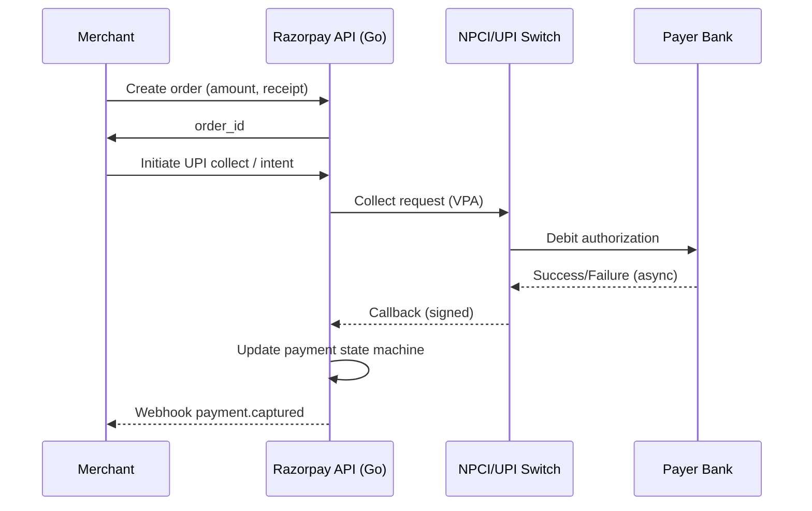
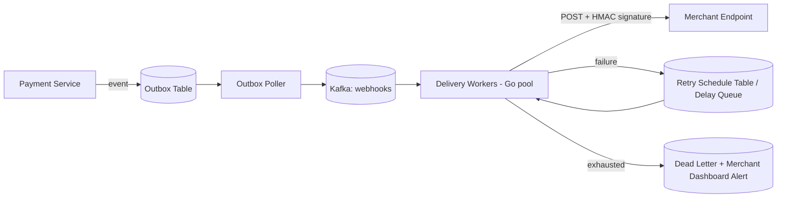

# Razorpay-Style Go Interviews

A complete preparation guide for Go developers targeting Razorpay and similar Indian fintech companies. This guide covers the interview process, the famous machine coding round with five full practice problems, payment-domain system design, and the Go questions interviewers actually ask.

---

## Why Razorpay Matters for Go Developers in India

### Why You Should Care

Razorpay is one of the largest Go shops in India. The core payments platform — the systems that authorize, capture, settle, and reconcile billions of rupees in transactions — is written predominantly in Go (with significant PHP/Laravel legacy in the dashboard and older API layers that teams have been steadily migrating). If you want to write Go professionally in India at serious scale, Razorpay is one of a handful of companies (along with Zerodha, CRED, Gojek's Indian engineering, Groww, Flipkart's newer services, and Dream11) where Go is a first-class production language, not an experiment.

### What Razorpay Does

Razorpay is a full-stack financial services company:

- **Payment Gateway** — card, UPI, netbanking, wallet acceptance for online merchants
- **RazorpayX** — business banking, payouts, vendor payments
- **Razorpay Capital** — lending and credit lines for merchants
- **POS (formerly Ezetap)** — offline/in-store payments

Each of these is a distributed system with hard correctness requirements: you cannot lose a payment, double-charge a customer, or drop a webhook silently.

### Engineering Levels and Compensation Context

Levels and CTC vary by year and negotiation, but the rough structure candidates report:

| Level | Typical Experience | Indicative CTC (INR, total) | What They Expect |
|---|---|---|---|
| SDE-1 | 0–2 years | 18–30 LPA | Strong DSA, clean machine coding, language fundamentals |
| SDE-2 | 2–5 years | 30–55 LPA | Machine coding mastery, LLD, ownership of a service end-to-end |
| Senior SDE / SDE-3 | 5–8 years | 50–85 LPA | HLD for payment-scale systems, cross-team design, mentoring |
| Staff / Principal | 8+ years | 80 LPA+ | Org-level architecture, platform strategy |

> Treat these numbers as directional. Fixed vs ESOP split matters a lot; Razorpay historically weights ESOPs heavily at senior levels.

### Team Structure

Teams are organized around product domains: Payments Core, UPI, Settlements, Risk, Payouts (X), Onboarding, Platform/Infra. A typical pod is 4–8 engineers + EM + PM. Go services dominate Payments Core, UPI, Payouts, and Platform. Knowing this helps you tailor your "why Razorpay" answer and your system design examples.

---

## Razorpay's Interview Process

The standard SDE-2 loop (SDE-1 is similar minus one design round; senior adds an architecture deep-dive):


### Round 1: Online Screening / Problem Solving

One or two medium LeetCode-style problems, usually arrays, strings, hashmaps, intervals, or graphs. You are expected to write **compiling, runnable Go**, not pseudocode. Edge cases and test thinking are evaluated explicitly.

### Round 2: Machine Coding (the most important round)

This is the round Razorpay is famous for, and the one most candidates fail. You get **90–120 minutes** to build a small but complete working system on your own laptop in your own editor. Typical expectations:

- **Working code that runs.** A demo (even via `main.go` driver code or tests) beats elegant unfinished code.
- **Clean package structure.** Separate domain models, services/managers, and storage.
- **Interfaces at boundaries.** Storage behind an interface, pluggable strategies (e.g., eviction policy, fee calculation).
- **Concurrency safety where it matters.** If the problem says "multiple clients," they want to see `sync.Mutex` / `sync.RWMutex` used correctly.
- **No over-engineering.** No database, no HTTP server unless asked. In-memory structures are fine and expected.
- **Extensibility discussion.** Interviewers extend requirements in the last 20 minutes ("now add per-floor pricing") — your design should absorb that.

Evaluation rubric (approximately): correctness 40%, design/readability 30%, edge cases 15%, extensibility discussion 15%.

### Round 3: Problem Solving (in-person/video)

A harder DSA problem solved live, plus follow-ups about complexity and Go-specific implementation choices (why a slice vs a list, map iteration order, etc.).

### Round 4: System Design

Almost always payments-flavored for payments teams: design a payment gateway component, a webhook system, a reconciliation pipeline. Section 5 of this guide covers the five most common ones.

### Round 5: Hiring Manager

Behavioral (conflict, ownership, failure stories), plus a lightweight architecture discussion about your past projects. They probe for depth: "you said you used Kafka — what was your partition key and why?"

---

## The Machine Coding Round: 5 Full Practice Problems

Practice each of these under a 90-minute timer. Solutions below are complete, idiomatic, and structured the way evaluators want to see them.

---

### Problem 1: Parking Lot System

**Requirements**

1. A parking lot has multiple floors; each floor has slots of types: `BIKE`, `CAR`, `TRUCK`.
2. `Park(vehicleType, regNo)` assigns the nearest free slot of the matching type (lowest floor, lowest slot number) and returns a ticket.
3. `Unpark(ticketID)` frees the slot and returns the fee: per-hour rate by vehicle type (bike 10, car 20, truck 50), minimum 1 hour.
4. `Display(vehicleType)` shows free slot counts per floor.
5. Must be safe for concurrent calls.

**Solution**

```go
package parking

import (
	"errors"
	"fmt"
	"sync"
	"time"
)

type VehicleType string

const (
	Bike  VehicleType = "BIKE"
	Car   VehicleType = "CAR"
	Truck VehicleType = "TRUCK"
)

var hourlyRate = map[VehicleType]int64{Bike: 10, Car: 20, Truck: 50}

type Slot struct {
	Floor    int
	Number   int
	Type     VehicleType
	Occupied bool
}

type Ticket struct {
	ID       string
	Slot     *Slot
	RegNo    string
	EntryAt  time.Time
}

// FeeCalculator is an interface so pricing strategy is swappable
// (interviewers love extending this to per-floor or slab pricing).
type FeeCalculator interface {
	Fee(t *Ticket, exitAt time.Time) int64
}

type HourlyFee struct{}

func (HourlyFee) Fee(t *Ticket, exitAt time.Time) int64 {
	hours := int64(exitAt.Sub(t.EntryAt).Hours())
	if hours < 1 {
		hours = 1
	}
	return hours * hourlyRate[t.Slot.Type]
}

type Lot struct {
	mu      sync.Mutex
	slots   []*Slot // sorted by floor, then number
	tickets map[string]*Ticket
	seq     int
	calc    FeeCalculator
	now     func() time.Time // injectable clock for tests
}

func NewLot(floors, slotsPerType int, calc FeeCalculator) *Lot {
	l := &Lot{tickets: map[string]*Ticket{}, calc: calc, now: time.Now}
	for f := 1; f <= floors; f++ {
		n := 1
		for _, vt := range []VehicleType{Bike, Car, Truck} {
			for i := 0; i < slotsPerType; i++ {
				l.slots = append(l.slots, &Slot{Floor: f, Number: n, Type: vt})
				n++
			}
		}
	}
	return l
}

var ErrLotFull = errors.New("parking lot full for vehicle type")
var ErrBadTicket = errors.New("invalid ticket")

func (l *Lot) Park(vt VehicleType, regNo string) (*Ticket, error) {
	l.mu.Lock()
	defer l.mu.Unlock()
	for _, s := range l.slots {
		if s.Type == vt && !s.Occupied {
			s.Occupied = true
			l.seq++
			t := &Ticket{
				ID:      fmt.Sprintf("T-%d-%d-%d", s.Floor, s.Number, l.seq),
				Slot:    s,
				RegNo:   regNo,
				EntryAt: l.now(),
			}
			l.tickets[t.ID] = t
			return t, nil
		}
	}
	return nil, ErrLotFull
}

func (l *Lot) Unpark(ticketID string) (int64, error) {
	l.mu.Lock()
	defer l.mu.Unlock()
	t, ok := l.tickets[ticketID]
	if !ok {
		return 0, ErrBadTicket
	}
	delete(l.tickets, ticketID)
	t.Slot.Occupied = false
	return l.calc.Fee(t, l.now()), nil
}

func (l *Lot) FreeCount(vt VehicleType) map[int]int {
	l.mu.Lock()
	defer l.mu.Unlock()
	out := map[int]int{}
	for _, s := range l.slots {
		if s.Type == vt && !s.Occupied {
			out[s.Floor]++
		}
	}
	return out
}
```

**Test sketch**

```go
func TestParkUnpark(t *testing.T) {
	lot := NewLot(2, 1, HourlyFee{})
	tk, err := lot.Park(Car, "KA-01-AB-1234")
	if err != nil {
		t.Fatal(err)
	}
	fee, err := lot.Unpark(tk.ID)
	if err != nil || fee != 20 { // minimum 1 hour
		t.Fatalf("fee=%d err=%v", fee, err)
	}
	if _, err := lot.Unpark(tk.ID); err != ErrBadTicket {
		t.Fatal("expected ErrBadTicket on double unpark")
	}
}
```

**What evaluators look for:** the `FeeCalculator` interface, injectable clock, mutex placement, the double-unpark edge case.

---

### Problem 2: Splitwise Expense Sharing

**Requirements**

1. `AddUser(id, name)`.
2. `AddExpense(paidBy, amount, participants, splitType)` — splits: `EQUAL`, `EXACT` (amounts per participant must sum to total), `PERCENT` (must sum to 100).
3. `ShowBalances()` — who owes whom, simplified per pair.
4. All money handled in **paise (int64)** — no floats. Equal split distributes the remainder paise to the first participants.

**Solution**

```go
package splitwise

import (
	"errors"
	"fmt"
	"sort"
	"sync"
)

type SplitType string

const (
	Equal   SplitType = "EQUAL"
	Exact   SplitType = "EXACT"
	Percent SplitType = "PERCENT"
)

type Split struct {
	UserID string
	Amount int64 // paise, used for EXACT
	Pct    int64 // basis: whole percents, used for PERCENT
}

// Strategy interface: each split type computes per-user shares in paise.
type splitter interface {
	shares(total int64, splits []Split) (map[string]int64, error)
}

type equalSplit struct{}

func (equalSplit) shares(total int64, splits []Split) (map[string]int64, error) {
	n := int64(len(splits))
	base, rem := total/n, total%n
	out := make(map[string]int64, n)
	for i, s := range splits {
		share := base
		if int64(i) < rem { // distribute remainder paise deterministically
			share++
		}
		out[s.UserID] = share
	}
	return out, nil
}

type exactSplit struct{}

func (exactSplit) shares(total int64, splits []Split) (map[string]int64, error) {
	var sum int64
	out := map[string]int64{}
	for _, s := range splits {
		sum += s.Amount
		out[s.UserID] = s.Amount
	}
	if sum != total {
		return nil, fmt.Errorf("exact amounts sum %d != total %d", sum, total)
	}
	return out, nil
}

type percentSplit struct{}

func (percentSplit) shares(total int64, splits []Split) (map[string]int64, error) {
	var pctSum, allocated int64
	for _, s := range splits {
		pctSum += s.Pct
	}
	if pctSum != 100 {
		return nil, errors.New("percentages must sum to 100")
	}
	out := map[string]int64{}
	for i, s := range splits {
		var share int64
		if i == len(splits)-1 {
			share = total - allocated // last absorbs rounding
		} else {
			share = total * s.Pct / 100
		}
		allocated += share
		out[s.UserID] = share
	}
	return out, nil
}

var strategies = map[SplitType]splitter{
	Equal: equalSplit{}, Exact: exactSplit{}, Percent: percentSplit{},
}

type Service struct {
	mu       sync.Mutex
	users    map[string]string
	balances map[string]map[string]int64 // balances[a][b] = paise a owes b
}

func New() *Service {
	return &Service{users: map[string]string{}, balances: map[string]map[string]int64{}}
}

func (s *Service) AddUser(id, name string) {
	s.mu.Lock()
	defer s.mu.Unlock()
	s.users[id] = name
}

func (s *Service) AddExpense(paidBy string, total int64, st SplitType, splits []Split) error {
	strat, ok := strategies[st]
	if !ok {
		return fmt.Errorf("unknown split type %q", st)
	}
	shares, err := strat.shares(total, splits)
	if err != nil {
		return err
	}
	s.mu.Lock()
	defer s.mu.Unlock()
	for uid, amt := range shares {
		if uid == paidBy {
			continue
		}
		s.owe(uid, paidBy, amt)
	}
	return nil
}

// owe nets the pairwise balance so each pair has at most one direction.
func (s *Service) owe(from, to string, amt int64) {
	if s.balances[to] != nil && s.balances[to][from] > 0 {
		back := s.balances[to][from]
		if back >= amt {
			s.balances[to][from] = back - amt
			return
		}
		amt -= back
		s.balances[to][from] = 0
	}
	if s.balances[from] == nil {
		s.balances[from] = map[string]int64{}
	}
	s.balances[from][to] += amt
}

func (s *Service) Balances() []string {
	s.mu.Lock()
	defer s.mu.Unlock()
	var out []string
	for from, m := range s.balances {
		for to, amt := range m {
			if amt > 0 {
				out = append(out, fmt.Sprintf("%s owes %s: %d paise", from, to, amt))
			}
		}
	}
	sort.Strings(out)
	return out
}
```

**What evaluators look for:** strategy pattern for split types, integer money handling, deterministic remainder distribution, pairwise netting logic.

---

### Problem 3: Rate Limiter Library

**Requirements**

1. A reusable library: `Allow(key string) bool`.
2. Support pluggable algorithms: fixed window and token bucket.
3. Per-key limits, safe under heavy concurrency.
4. Bonus: discuss how you would make it distributed.

**Solution**

```go
package ratelimit

import (
	"sync"
	"time"
)

// Limiter is the public interface; algorithms are pluggable.
type Limiter interface {
	Allow(key string) bool
}

// ---------- Token Bucket ----------

type bucket struct {
	tokens   float64
	lastFill time.Time
}

type TokenBucket struct {
	mu       sync.Mutex
	buckets  map[string]*bucket
	rate     float64 // tokens added per second
	capacity float64
	now      func() time.Time
}

func NewTokenBucket(ratePerSec float64, capacity int) *TokenBucket {
	return &TokenBucket{
		buckets:  map[string]*bucket{},
		rate:     ratePerSec,
		capacity: float64(capacity),
		now:      time.Now,
	}
}

func (tb *TokenBucket) Allow(key string) bool {
	tb.mu.Lock()
	defer tb.mu.Unlock()
	b, ok := tb.buckets[key]
	now := tb.now()
	if !ok {
		b = &bucket{tokens: tb.capacity, lastFill: now}
		tb.buckets[key] = b
	}
	// Lazy refill: compute tokens earned since last call.
	elapsed := now.Sub(b.lastFill).Seconds()
	b.tokens += elapsed * tb.rate
	if b.tokens > tb.capacity {
		b.tokens = tb.capacity
	}
	b.lastFill = now
	if b.tokens >= 1 {
		b.tokens--
		return true
	}
	return false
}

// ---------- Fixed Window ----------

type window struct {
	start time.Time
	count int
}

type FixedWindow struct {
	mu      sync.Mutex
	windows map[string]*window
	limit   int
	size    time.Duration
	now     func() time.Time
}

func NewFixedWindow(limit int, size time.Duration) *FixedWindow {
	return &FixedWindow{windows: map[string]*window{}, limit: limit, size: size, now: time.Now}
}

func (fw *FixedWindow) Allow(key string) bool {
	fw.mu.Lock()
	defer fw.mu.Unlock()
	now := fw.now()
	w, ok := fw.windows[key]
	if !ok || now.Sub(w.start) >= fw.size {
		fw.windows[key] = &window{start: now, count: 1}
		return true
	}
	if w.count < fw.limit {
		w.count++
		return true
	}
	return false
}
```

**Test sketch**

```go
func TestTokenBucket(t *testing.T) {
	tb := NewTokenBucket(1, 2) // 1 token/sec, burst 2
	fake := time.Now()
	tb.now = func() time.Time { return fake }
	if !tb.Allow("k") || !tb.Allow("k") {
		t.Fatal("burst of 2 should pass")
	}
	if tb.Allow("k") {
		t.Fatal("third call should be limited")
	}
	fake = fake.Add(time.Second)
	if !tb.Allow("k") {
		t.Fatal("should refill after 1s")
	}
}
```

**Distributed discussion (be ready):** move state to Redis with a Lua script (atomic read-modify-write of token count + timestamp), accept approximate limits, or use a sliding-window-counter in Redis sorted sets. Mention clock skew and hot-key sharding.

---

### Problem 4: In-Memory Cache with TTL and Eviction

**Requirements**

1. `Get/Set/Delete` with per-key TTL.
2. Max capacity with **LRU eviction**, eviction policy pluggable.
3. Lazy expiry on read plus an optional background sweeper.
4. Thread-safe.

**Solution**

```go
package cache

import (
	"container/list"
	"sync"
	"time"
)

type entry struct {
	key      string
	value    any
	expireAt time.Time // zero means no TTL
}

// EvictionPolicy is pluggable; LRU provided, LFU could be added.
type EvictionPolicy interface {
	Touch(el *list.Element)
	Add(e *entry) *list.Element
	Victim() *list.Element
	Remove(el *list.Element)
}

type lru struct{ ll *list.List }

func NewLRU() EvictionPolicy               { return &lru{ll: list.New()} }
func (l *lru) Touch(el *list.Element)      { l.ll.MoveToFront(el) }
func (l *lru) Add(e *entry) *list.Element  { return l.ll.PushFront(e) }
func (l *lru) Victim() *list.Element       { return l.ll.Back() }
func (l *lru) Remove(el *list.Element)     { l.ll.Remove(el) }

type Cache struct {
	mu       sync.Mutex
	items    map[string]*list.Element
	policy   EvictionPolicy
	capacity int
	now      func() time.Time
}

func New(capacity int, policy EvictionPolicy) *Cache {
	return &Cache{
		items:    map[string]*list.Element{},
		policy:   policy,
		capacity: capacity,
		now:      time.Now,
	}
}

func (c *Cache) Set(key string, value any, ttl time.Duration) {
	c.mu.Lock()
	defer c.mu.Unlock()
	var exp time.Time
	if ttl > 0 {
		exp = c.now().Add(ttl)
	}
	if el, ok := c.items[key]; ok {
		en := el.Value.(*entry)
		en.value, en.expireAt = value, exp
		c.policy.Touch(el)
		return
	}
	if len(c.items) >= c.capacity {
		if victim := c.policy.Victim(); victim != nil {
			c.removeLocked(victim)
		}
	}
	c.items[key] = c.policy.Add(&entry{key: key, value: value, expireAt: exp})
}

func (c *Cache) Get(key string) (any, bool) {
	c.mu.Lock()
	defer c.mu.Unlock()
	el, ok := c.items[key]
	if !ok {
		return nil, false
	}
	en := el.Value.(*entry)
	if !en.expireAt.IsZero() && c.now().After(en.expireAt) {
		c.removeLocked(el) // lazy expiry
		return nil, false
	}
	c.policy.Touch(el)
	return en.value, true
}

func (c *Cache) Delete(key string) {
	c.mu.Lock()
	defer c.mu.Unlock()
	if el, ok := c.items[key]; ok {
		c.removeLocked(el)
	}
}

func (c *Cache) removeLocked(el *list.Element) {
	en := el.Value.(*entry)
	c.policy.Remove(el)
	delete(c.items, en.key)
}

// StartSweeper expires keys in the background; returns a stop func.
func (c *Cache) StartSweeper(interval time.Duration) (stop func()) {
	done := make(chan struct{})
	go func() {
		t := time.NewTicker(interval)
		defer t.Stop()
		for {
			select {
			case <-done:
				return
			case <-t.C:
				c.sweep()
			}
		}
	}()
	return func() { close(done) }
}

func (c *Cache) sweep() {
	c.mu.Lock()
	defer c.mu.Unlock()
	now := c.now()
	for _, el := range c.items {
		en := el.Value.(*entry)
		if !en.expireAt.IsZero() && now.After(en.expireAt) {
			c.removeLocked(el)
		}
	}
}
```

**What evaluators look for:** O(1) `Get`/`Set` via map + doubly linked list, the pluggable `EvictionPolicy`, lazy expiry vs sweeper trade-off, clean goroutine shutdown via `close(done)`.

---

### Problem 5: Order Matching Engine Basics

**Requirements**

1. Limit orders only: `BUY`/`SELL` with price (paise) and quantity for one symbol.
2. Price-time priority: best price first, FIFO within a price level.
3. A new order matches immediately against the opposite book; the remainder rests.
4. Emit trade records `(buyOrderID, sellOrderID, price, qty)` — trades execute at the **resting** order's price.

**Solution**

```go
package matching

import (
	"sort"
	"sync"
)

type Side string

const (
	Buy  Side = "BUY"
	Sell Side = "SELL"
)

type Order struct {
	ID    string
	Side  Side
	Price int64 // paise
	Qty   int64
	seq   int64 // arrival order for time priority
}

type Trade struct {
	BuyID, SellID string
	Price, Qty    int64
}

// priceLevel holds FIFO orders at one price.
type priceLevel struct {
	price  int64
	orders []*Order
}

type Book struct {
	mu     sync.Mutex
	buys   []*priceLevel // sorted desc by price (best bid first)
	sells  []*priceLevel // sorted asc by price (best ask first)
	seq    int64
	trades []Trade
}

func New() *Book { return &Book{} }

func (b *Book) Submit(o *Order) []Trade {
	b.mu.Lock()
	defer b.mu.Unlock()
	b.seq++
	o.seq = b.seq

	var executed []Trade
	if o.Side == Buy {
		executed = b.match(o, &b.sells, func(restPrice int64) bool { return restPrice <= o.Price })
	} else {
		executed = b.match(o, &b.buys, func(restPrice int64) bool { return restPrice >= o.Price })
	}
	if o.Qty > 0 {
		b.rest(o)
	}
	b.trades = append(b.trades, executed...)
	return executed
}

func (b *Book) match(o *Order, book *[]*priceLevel, crosses func(int64) bool) []Trade {
	var out []Trade
	for o.Qty > 0 && len(*book) > 0 && crosses((*book)[0].price) {
		level := (*book)[0]
		for o.Qty > 0 && len(level.orders) > 0 {
			rest := level.orders[0]
			qty := min64(o.Qty, rest.Qty)
			tr := Trade{Price: rest.Price, Qty: qty}
			if o.Side == Buy {
				tr.BuyID, tr.SellID = o.ID, rest.ID
			} else {
				tr.BuyID, tr.SellID = rest.ID, o.ID
			}
			out = append(out, tr)
			o.Qty -= qty
			rest.Qty -= qty
			if rest.Qty == 0 {
				level.orders = level.orders[1:]
			}
		}
		if len(level.orders) == 0 {
			*book = (*book)[1:]
		}
	}
	return out
}

func (b *Book) rest(o *Order) {
	book, desc := &b.sells, false
	if o.Side == Buy {
		book, desc = &b.buys, true
	}
	i := sort.Search(len(*book), func(i int) bool {
		if desc {
			return (*book)[i].price <= o.Price
		}
		return (*book)[i].price >= o.Price
	})
	if i < len(*book) && (*book)[i].price == o.Price {
		(*book)[i].orders = append((*book)[i].orders, o)
		return
	}
	lvl := &priceLevel{price: o.Price, orders: []*Order{o}}
	*book = append(*book, nil)
	copy((*book)[i+1:], (*book)[i:])
	(*book)[i] = lvl
}

func min64(a, b int64) int64 {
	if a < b {
		return a
	}
	return b
}
```

**Test sketch**

```go
func TestPriceTimePriority(t *testing.T) {
	b := New()
	b.Submit(&Order{ID: "s1", Side: Sell, Price: 100, Qty: 5})
	b.Submit(&Order{ID: "s2", Side: Sell, Price: 100, Qty: 5}) // same price, later
	trades := b.Submit(&Order{ID: "b1", Side: Buy, Price: 100, Qty: 7})
	if len(trades) != 2 || trades[0].SellID != "s1" || trades[1].SellID != "s2" {
		t.Fatalf("expected FIFO at same price, got %+v", trades)
	}
	if trades[0].Qty != 5 || trades[1].Qty != 2 {
		t.Fatalf("partial fill wrong: %+v", trades)
	}
}
```

**What evaluators look for:** price-time priority correctness, partial fills, trades at resting price, and an honest discussion that production engines use heaps/intrusive lists and a single-writer goroutine instead of a mutex.

---

## 5 Payment-Domain System Design Questions

### 1. Design a UPI Payment Flow



**Key design points**

- **State machine, not booleans.** `created → authorized → captured → settled` (plus `failed`, `refunded`). Persist every transition with timestamps in a transitions table.
- **Asynchrony is the default.** UPI callbacks can arrive late, twice, or never. You need a **status-poll reconciler** that queries NPCI/bank for stuck `created` payments after a timeout.
- **Go notes:** one goroutine pool consuming a Kafka topic of callback events; transitions applied via `UPDATE ... WHERE status = 'created'` (compare-and-swap in SQL) so duplicate callbacks are no-ops.

### 2. Design an Idempotent Payment API

**Problem:** merchant retries `POST /payments` after a network timeout — you must not charge twice.

- Client sends an `Idempotency-Key` header (UUID).
- Server does `INSERT INTO idempotency_keys (key, request_hash, status) VALUES (...) ON CONFLICT DO NOTHING`.
  - Insert succeeded → you own the request; process it, then store the serialized response against the key.
  - Conflict → fetch the stored row: if `completed`, replay the stored response; if `in_progress`, return `409` (or block briefly).
- Compare `request_hash` — same key with a different body is a `422`.
- Keys expire after 24–48 hours via TTL cleanup.

**Go note:** wrap this as HTTP middleware; the row insert must be in the **same DB transaction** as the payment creation, or use the unique-constraint-first pattern above so crash recovery is safe.

### 3. Design a Webhook Delivery System with Retries



- **Transactional outbox**: write the event in the same DB transaction as the payment state change; a poller publishes to Kafka. This guarantees no lost webhooks.
- **Retries**: exponential backoff with jitter (1m, 5m, 30m, 2h, 6h, 24h), capped attempts, then dead-letter with a manual replay UI.
- **Per-merchant ordering**: partition Kafka by merchant ID; within a partition a single worker preserves order. Slow merchants must not block others — per-merchant concurrency limits and timeouts (`http.Client{Timeout: 10 * time.Second}`).
- **Security**: HMAC-SHA256 signature header over the payload; merchants verify with a shared secret.
- **At-least-once**: merchants will receive duplicates; document that they must dedupe on event ID.

### 4. Design a Reconciliation System

**Problem:** your DB says a payment is captured; the bank's settlement file is the truth. Find mismatches daily across millions of rows.

- **Inputs:** internal payments table; bank/NPCI settlement files (SFTP, CSV/fixed-width, arriving on T+1 with their own quirks per bank).
- **Pipeline:** ingest file → normalize to canonical records → match against internal records on (UTR/RRN, amount, date) → classify: matched, missing-in-bank, missing-internally, amount-mismatch.
- **Matching at scale:** sort-merge join on RRN, or load the smaller side into a map keyed by RRN; process files in streaming fashion (`bufio.Scanner`, bounded worker pool per file chunk).
- **Output:** exceptions queue with workflow states (`open → investigating → resolved`), and automated actions (auto-refund, auto-capture-retry) for known patterns.
- **Go notes:** this is a batch system — emphasize idempotent re-runs (recon run ID, upserts), checkpointing per file, and `errgroup` for parallel file processing.

### 5. Design a Ledger Service (Double-Entry)

Every money movement is two entries: a debit and a credit that sum to zero.

| Concept | Rule |
|---|---|
| Account | merchant balance, escrow, fees, GST, bank settlement |
| Entry | (account, amount in paise, direction, transaction ID) |
| Transaction | group of entries; `SUM(debits) == SUM(credits)` enforced |
| Immutability | entries are append-only; corrections are reversing entries, never updates |
| Balance | derived: running balance column maintained under row lock, or periodic snapshots + delta sum |

**Go/DB notes**

- Insert all entries of a transaction in one DB transaction with a `CHECK`/application-level invariant that they net to zero.
- Hot accounts (the fees account) become lock contention points — shard hot accounts into sub-accounts and sum, or queue postings through a single writer per account.
- Expose `GetBalance(accountID, asOf)` via snapshot + entries-since-snapshot for time-travel queries (auditors require this).

---

## 15 Go Questions Razorpay Actually Asks

**1. How do you implement a goroutine worker pool, and why not just spawn a goroutine per task?**

Unbounded goroutines exhaust memory and overwhelm downstreams (DB connections, payment partner rate limits). A pool bounds concurrency:

```go
func process(jobs <-chan Job, workers int) {
	var wg sync.WaitGroup
	for i := 0; i < workers; i++ {
		wg.Add(1)
		go func() {
			defer wg.Done()
			for j := range jobs {
				j.Do()
			}
		}()
	}
	wg.Wait()
}
```

Close `jobs` to terminate. For error propagation and cancellation, use `golang.org/x/sync/errgroup` with `SetLimit`.

**2. How does context timeout propagation work across service calls?**

A `context.WithTimeout` deadline flows down the call tree: pass `ctx` into HTTP requests (`http.NewRequestWithContext`), SQL calls (`QueryContext`), and gRPC (automatic via metadata). Child timeouts can only be shorter — `context.WithTimeout(parent, d)` respects whichever deadline fires first. In a payment chain (API → risk check → bank call), set the edge timeout once and let it propagate so a 2s SLA is enforced end to end. Always `defer cancel()` to release the timer.

**3. What happens if you ignore `ctx.Done()` in a long-running function?**

The caller times out and moves on, but your goroutine keeps working — leaking goroutines, holding DB connections, and possibly completing a payment the caller already treated as failed. Check `ctx.Err()` at loop boundaries and before expensive side effects; for side effects that must not be torn (the actual debit), deliberately use `context.WithoutCancel` (Go 1.21+) and document why.

**4. How do you handle database transactions correctly with `database/sql`?**

```go
func transfer(ctx context.Context, db *sql.DB, fn func(*sql.Tx) error) (err error) {
	tx, err := db.BeginTx(ctx, &sql.TxOptions{Isolation: sql.LevelReadCommitted})
	if err != nil {
		return err
	}
	defer func() {
		if p := recover(); p != nil {
			_ = tx.Rollback()
			panic(p)
		}
		if err != nil {
			_ = tx.Rollback()
			return
		}
		err = tx.Commit()
	}()
	return fn(tx)
}
```

Key points: always rollback on error and on panic; never hold a transaction across external HTTP calls; check the `Commit()` error — it can fail.

**5. How would you implement idempotency keys?**

Unique constraint on the key column; `INSERT` first to claim ownership; store the response body and status against the key on completion; replay on conflict. Hash the request body so key reuse with a different payload is rejected. Critical detail: the claim insert and the business write must be atomic (same transaction) or crash-recoverable (a janitor that resolves `in_progress` rows older than X by checking downstream state).

**6. How do you implement a distributed lock with Redis, and what are the pitfalls?**

`SET lock:key <random-token> NX PX 30000`. Release with a Lua script that deletes only if the token matches (prevents releasing someone else's lock after your own expiry). Pitfalls: lock expiry during a long operation (use a watchdog that extends, or design the protected operation to be idempotent anyway); Redis failover can hand the lock to two holders — for correctness-critical sections, prefer DB-level locks (`SELECT ... FOR UPDATE`) or fencing tokens. Say explicitly: in payments, a Redis lock is an optimization, never the correctness mechanism.

**7. How do you recover from panics in HTTP middleware?**

```go
func Recover(next http.Handler) http.Handler {
	return http.HandlerFunc(func(w http.ResponseWriter, r *http.Request) {
		defer func() {
			if rec := recover(); rec != nil {
				log.Printf("panic: %v\n%s", rec, debug.Stack())
				http.Error(w, "internal error", http.StatusInternalServerError)
			}
		}()
		next.ServeHTTP(w, r)
	})
}
```

Caveats: a recover in middleware does not cover panics in goroutines the handler spawned — each goroutine needs its own `defer/recover`. Also `net/http` already recovers per-connection, but without your logging/metrics, so you add middleware anyway.

**8. How do you implement graceful shutdown of an HTTP server?**

```go
srv := &http.Server{Addr: ":8080", Handler: mux}
go func() {
	if err := srv.ListenAndServe(); err != nil && err != http.ErrServerClosed {
		log.Fatal(err)
	}
}()
stop := make(chan os.Signal, 1)
signal.Notify(stop, syscall.SIGTERM, syscall.SIGINT)
<-stop
ctx, cancel := context.WithTimeout(context.Background(), 30*time.Second)
defer cancel()
_ = srv.Shutdown(ctx) // stops accepting, drains in-flight requests
```

Also drain background workers (close their job channels, wait on WaitGroups), and in Kubernetes set `terminationGracePeriodSeconds` above your drain timeout and fail readiness first so the load balancer stops sending traffic before shutdown.

**9. Difference between buffered and unbuffered channels — when does each matter?**

Unbuffered channels synchronize: send blocks until receive (a rendezvous). Buffered channels decouple producer and consumer up to capacity. Use unbuffered for handoff semantics and signaling (`done := make(chan struct{})`), buffered for smoothing bursts (a job queue of capacity N gives natural backpressure). A common bug: a goroutine sending a result on an unbuffered channel after the receiver gave up leaks forever — buffer size 1 or `select` with `ctx.Done()` fixes it.

**10. How does `sync.RWMutex` differ from `sync.Mutex`, and when is RWMutex actually worse?**

RWMutex allows concurrent readers. It is worse when the critical section is tiny and write frequency is non-trivial — the bookkeeping costs more than it saves, and writers can be starved-then-prioritized causing latency spikes. For read-mostly config/lookup maps, consider `atomic.Pointer[map[...]]` swap (copy-on-write) or `sync.Map` for disjoint key sets.

**11. What is a data race and how do you find one in CI?**

Two goroutines access the same memory concurrently, at least one writes, with no happens-before edge. Result is undefined — torn reads, lost updates. Run `go test -race ./...` in CI (mandatory at any serious Go shop), and `go build -race` for canary deployments if performance budget allows (2–10x slowdown, ~5-10x memory).

**12. How do `defer`, evaluation order, and loop variables interact?**

Deferred calls run LIFO at function return; arguments are evaluated at `defer` time, not call time. Pre-1.22 loop variable capture in goroutines was the classic bug (all goroutines see the last value); Go 1.22 made loop variables per-iteration. Still relevant: deferring inside a loop (e.g., `defer rows.Close()` in a loop) delays all closes to function end — extract a function or close explicitly.

**13. How do you propagate and wrap errors idiomatically?**

Wrap with context: `fmt.Errorf("capture payment %s: %w", id, err)`. Check with `errors.Is` (sentinel) and `errors.As` (typed). Define sentinel errors for control flow callers care about (`var ErrInsufficientBalance = errors.New(...)`) and typed errors when callers need fields (decline codes from banks). Never match on error strings. Log once at the boundary, not at every level.

**14. How do you stop a goroutine that is blocked on a channel receive?**

You cannot kill a goroutine externally; it must cooperate. Standard pattern:

```go
select {
case job := <-jobs:
	handle(job)
case <-ctx.Done():
	return ctx.Err()
}
```

Every potentially-blocking operation in a long-lived goroutine should be in a `select` with a cancellation case. Goroutine leaks show up in production as slow memory growth — find them with `pprof`'s goroutine profile.

**15. How would you debug high latency in a Go payment service in production?**

Order of attack: (1) metrics — is it CPU, GC pause, downstream latency, or lock contention? (2) `pprof` CPU and goroutine profiles, plus mutex/block profiles for contention; (3) distributed tracing to find the slow hop; (4) check `GOMAXPROCS` vs container CPU limits (use `automaxprocs` — a Razorpay-relevant classic, since CFS throttling silently destroys p99); (5) GC pressure — look at allocation rate, consider `GOGC`/`GOMEMLIMIT` tuning and reducing allocations in hot paths.

---

## Fintech-Specific Edge Cases Go Developers Must Know

### Money Is int64 Paise — Never float64

```go
// WRONG: floats cannot represent 0.1 exactly; rounding errors compound.
var amount float64 = 0.1 + 0.2 // 0.30000000000000004

// RIGHT: store and compute in the smallest unit.
type Money struct {
	Paise    int64
	Currency string // "INR"
}
```

Rules:

- All arithmetic in integer paise; convert to rupees only for display.
- Division (fee percentages, splits) must define rounding explicitly (banker's rounding or floor) and **conserve the total**: the sum of split parts must equal the original (give the remainder to a designated party — see the Splitwise solution above).
- Cross-currency needs per-currency exponents (JPY has 0 decimals, BHD has 3) — never hardcode 100.
- For percentages like GST (18%), compute as `amount * 18 / 100` in int64 and document rounding; beware overflow only past ~92 quadrillion paise, which int64 comfortably covers.

### Idempotency Everywhere

Any operation triggered by a retryable input (API call, queue message, webhook, cron) must be safe to run twice. Mechanisms: unique constraints, compare-and-swap state transitions (`UPDATE payments SET status='captured' WHERE id=$1 AND status='authorized'` and check rows affected), idempotency key tables.

### Exactly-Once vs At-Least-Once

| Property | Reality |
|---|---|
| Exactly-once delivery | Does not exist across networks |
| At-least-once delivery | What Kafka/SQS/webhooks give you |
| Exactly-once **effect** | Achievable: at-least-once delivery + idempotent processing |

Design every consumer assuming duplicates and reordering. Dedupe on a stable event ID; make state transitions monotonic so a stale duplicate cannot regress state.

### Audit Trails

- Append-only event tables for every state transition: who/what/when/old state/new state/reason.
- Never `UPDATE` financial records destructively; corrections are new reversing entries (ledger discipline).
- Clock discipline: store UTC, capture both event time and record time.
- Regulators (RBI) and auditors will ask "what did the system believe at time T" — design for time-travel queries.

### PCI-DSS Basics Every Backend Engineer Should Know

- Never log card numbers (PAN), CVV, or full track data — CVV must never be stored at all, even encrypted.
- PAN at rest must be encrypted/tokenized; display only first 6 + last 4.
- Scope reduction is the strategy: card data touches only a small certified vault service; everything else handles tokens. Your Go service should receive `token_id`, never raw PANs.
- Practical Go implications: scrub request/response logging middleware (denylist fields), redact errors that echo input, and be careful with `fmt.Sprintf("%+v", req)` in logs.

### Other Edge Cases Worth Mentioning in Interviews

- **Refunds racing captures** — model as a state machine with allowed transitions only.
- **Partial refunds and partial captures** — amounts must be tracked cumulatively with invariants (`refunded <= captured <= authorized`).
- **Bank timeouts are not failures** — a timed-out bank call may have succeeded; mark the payment `pending` and reconcile, never auto-fail.
- **Settlement T+N arithmetic** — bank holidays, cut-off times, IST vs UTC midnight bugs.
- **Negative testing** — interviewers respect candidates who mention testing duplicate webhooks, replayed callbacks, and out-of-order events explicitly.

---

## Final Preparation Checklist

| Area | Target |
|---|---|
| Machine coding | All 5 problems above, each under 90 minutes, from scratch |
| Concurrency | Worker pools, context cancellation, graceful shutdown — written from memory |
| System design | UPI flow, idempotent API, webhook system — whiteboard each in 35 minutes |
| Fintech instincts | int64 paise, idempotency, at-least-once, audit trails — woven into every answer |
| Go tooling | `-race`, `pprof`, `errgroup`, `database/sql` transaction patterns |

The single biggest differentiator in Razorpay loops is the machine coding round: working, tested, extensible code under time pressure. Practice with a timer, in a plain editor, and force yourself to demo via tests at the end.
