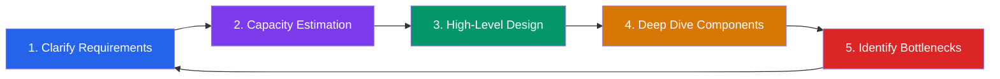
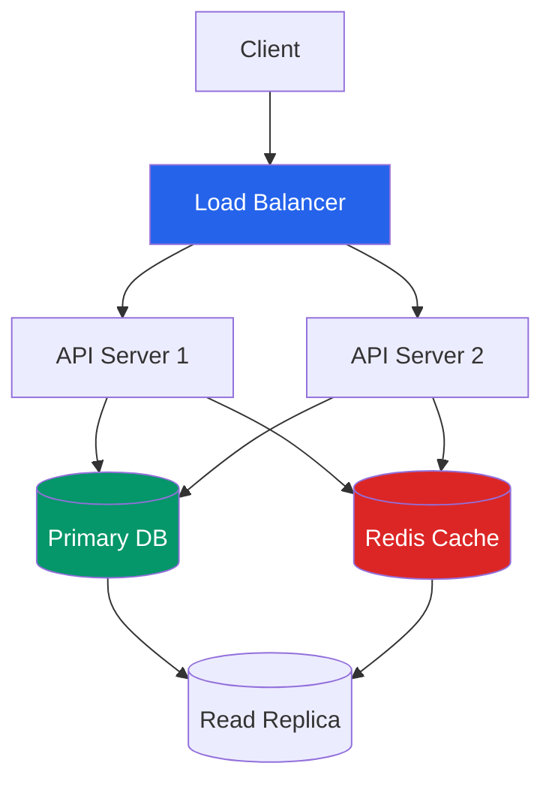
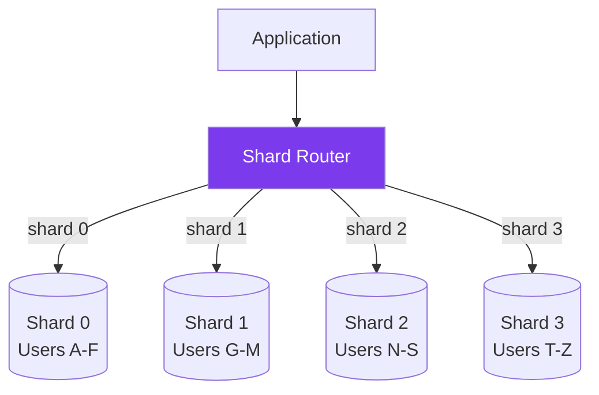
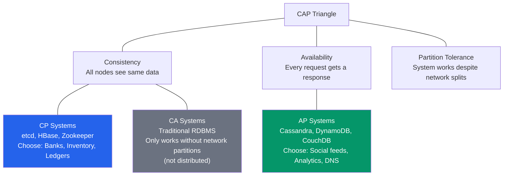
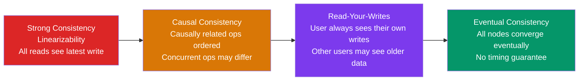
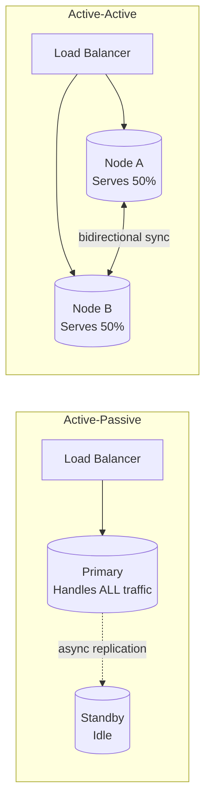
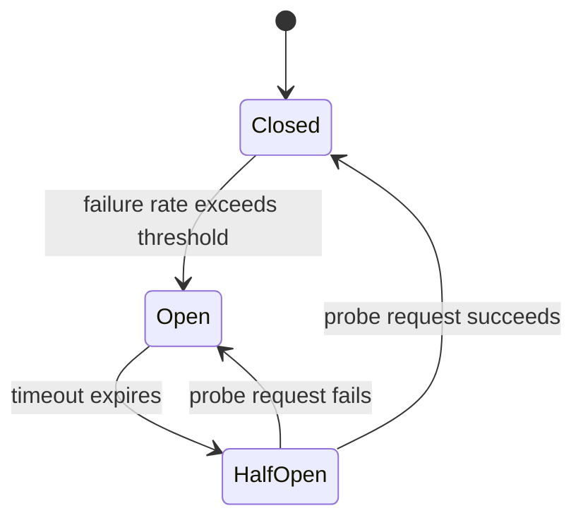
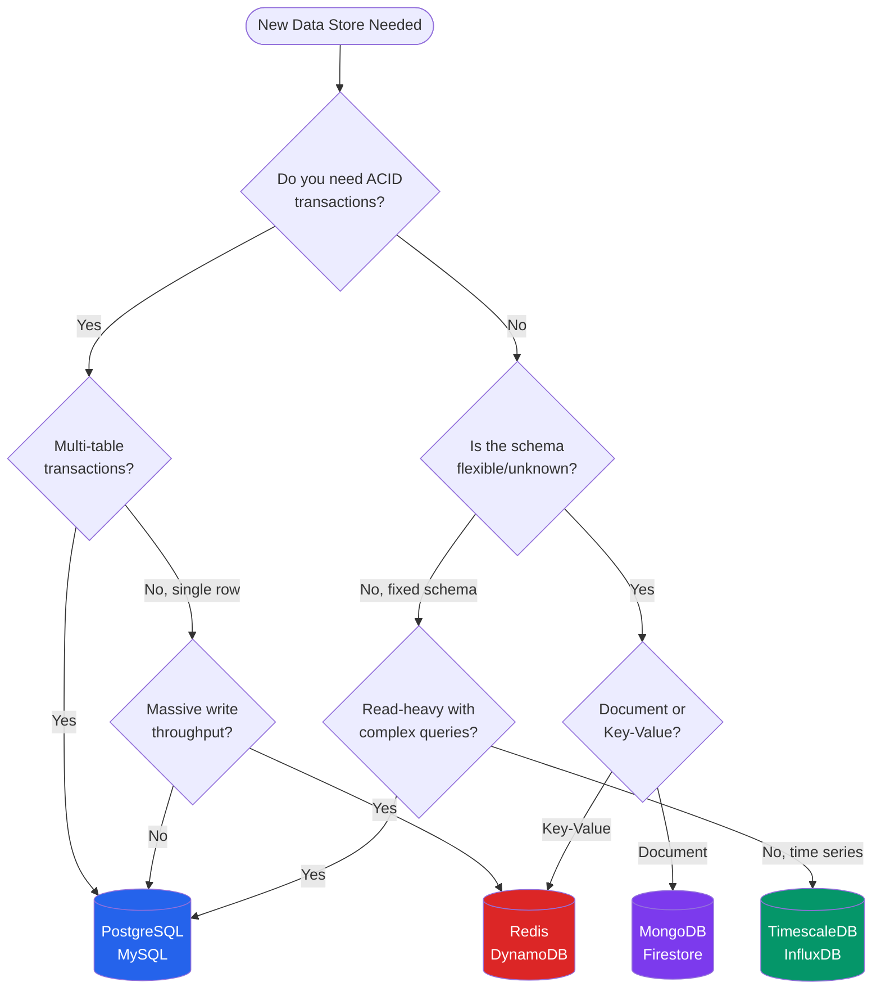
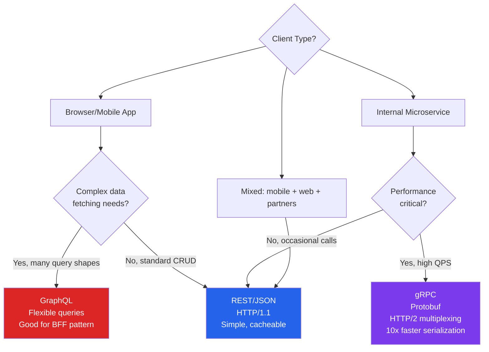

# System Design Fundamentals for Go Developers

## Why System Design Matters More in Go

**Why this topic exists:** System design is the skill of planning how a piece of software will work when many machines, many users, and many failures are involved at the same time. Writing a Go program that works on your laptop is programming; making that program survive 100,000 users hitting it per second, a database catching fire, and a network cable being cut — all without losing data — is system design. If you are a complete beginner, think of it as the difference between cooking dinner for your family and running the kitchen of a 500-seat restaurant: the recipes are the same, but everything about coordination, capacity, and failure handling changes.

Go was designed by Google engineers to solve Google-scale problems: high concurrency, distributed coordination, low-latency microservices. This origin story shapes who hires Go developers and what those roles demand. When a company chooses Go over Python or Node.js, they are not looking for someone to write glue scripts or build CRUD APIs — they are solving problems at scale where individual machines are no longer sufficient. That context means Go engineers are expected to reason about distributed systems, network partitions, data consistency trade-offs, and service topology from day one. At companies like Razorpay, Dream11, Zepto, Swiggy, and Ola, Go developers work on payment pipelines, real-time logistics engines, and inventory systems where a wrong sharding decision or missing cache layer costs millions of rupees per minute of downtime. Unlike Java or Python roles where a junior can hide behind frameworks and ORMs for a year, Go roles expose you to the system level immediately.

The second reason is structural: Go's ecosystem encourages writing services rather than monoliths. A Python Django developer can spend two years never thinking about inter-service communication. A Go developer in their first quarter will likely touch gRPC, write a Redis client, and debug a goroutine leak under load. The language attracts companies building the infrastructure layer — not the application layer — of their stack. System design is therefore not an interview filter you clear once; it is the daily vocabulary of the job. Salary bands reflect this: Go roles in India start system design conversations at 8 LPA, and roles above 18 LPA treat it as the dominant interview signal. This guide gives you the vocabulary, the code patterns, and the interview scripts to participate confidently in those conversations.

### What Is High-Level Design (HLD) in Plain Words

**High-Level Design (HLD)** is a drawing of your system as boxes and arrows. Each box is a component (a server, a database, a cache), and each arrow shows data flowing between them. HLD deliberately ignores the small stuff — function names, class structures, exact SQL — and answers the big questions first: What pieces does the system need? How do they talk to each other? What happens when one of them breaks? Its counterpart, Low-Level Design (LLD), zooms into a single box and works out the classes, methods, and data structures inside it. An HLD is like a city map showing neighborhoods and highways; an LLD is the floor plan of one building.

### Where System Design Is Used: Industry and Interviews

In industry, every new feature at a backend-heavy company starts with a design document containing an HLD diagram, capacity numbers, and trade-off discussions. Engineers review it before anyone writes a line of Go. In interviews, almost every backend role above entry level includes a 45-60 minute "design round" where you are given an open-ended prompt ("Design a URL shortener", "Design Uber's location tracking") and must produce an HLD live, narrating your reasoning. This file teaches both: the real engineering concepts and the interview choreography around them.

---

## Key Terms in Plain English

Read this table first. Every term below appears repeatedly in this file. Come back to it whenever a word feels unfamiliar.

| Term | Plain-English Meaning |
|------|----------------------|
| Latency | How long one request takes from start to finish. Like the wait time for one customer's coffee order. Measured in milliseconds (ms), microseconds (μs), or nanoseconds (ns). |
| Throughput | How many requests the system handles per second. Like how many coffees the whole cafe serves per hour. Often written as RPS (requests per second). |
| QPS / RPS | Queries (or Requests) Per Second — the standard unit of traffic. 1,000 QPS means 1,000 requests arrive every second. |
| DAU | Daily Active Users — how many distinct people use the system each day. Used to estimate traffic. |
| P99 latency | The latency that 99% of requests beat. "P99 < 10ms" means only the slowest 1% of requests take longer than 10 milliseconds. |
| SLA | Service Level Agreement — a promise about reliability, e.g., "99.99% availability" means the system may be down at most ~52 minutes per year. |
| Load balancer | A traffic director that spreads incoming requests across multiple servers — like a restaurant host seating guests evenly across waiters' sections. |
| Cache | A small, very fast storage layer (usually in memory, e.g., Redis) holding copies of frequently-read data so you do not ask the slow database every time. Like keeping snacks on your desk instead of walking to the store. |
| Database replica / Replication | A live copy of a database kept in sync with the original (the "primary"). Replicas can serve reads and take over if the primary dies. |
| Shard / Sharding | Splitting one big database into several smaller databases, each holding a slice of the data — like a library splitting books across branch locations by author surname. |
| Hotspot | One server or shard receiving far more traffic than the others, so it overloads while the rest sit idle. |
| Consistency | Whether every reader sees the same, latest data at the same moment. |
| Availability | Whether the system answers every request, even during failures (possibly with slightly stale data). |
| Network partition | A network failure that splits servers into groups that cannot talk to each other, even though each group is still running. |
| Horizontal scaling | Adding more machines to handle more load (more trucks). |
| Vertical scaling | Making one machine bigger — more CPU, RAM, disk (a bigger truck). |
| Stateless service | A server that remembers nothing between requests; all state lives in a database or cache. Any copy of the server can answer any request. |
| Message queue | A buffer that holds tasks/messages until a worker is ready to process them — like a ticket spike in a kitchen where orders wait for cooks. Examples: Kafka, NATS. |
| TTL | Time To Live — an expiry timer on a piece of cached data; when it elapses, the data is deleted automatically. |
| Goroutine | Go's lightweight unit of concurrent work. Thousands can run inside one process; each starts with only 2KB of memory. |
| Idempotency | The property that running the same operation twice has the same effect as running it once — crucial for safe retries (charging a card twice is bad). |
| Circuit breaker | A safety switch that stops calling a failing service for a while so the failure does not spread — like an electrical fuse. |
| Cache stampede / Thundering herd | Thousands of requests missing the cache at the same instant and all slamming the database together. |
| CDN | Content Delivery Network — servers placed around the world that cache static files close to users. |
| Failover | Automatically switching to a backup server when the main one dies. |

---

## The 5-Step Framework

Every system design interview — regardless of the company, the question, or the time limit — follows the same underlying shape. The five steps below are a consistent skeleton. Your job is to move through them with the right balance of speed and depth, signaling that you have done this before.

The diagram below shows the five steps of a design interview as a loop: you clarify what to build, estimate how big it is, draw the design, zoom into details, find weaknesses — and the weaknesses often send you back to refine requirements.



How to read this diagram:

- Start at the blue box on the left and follow the arrows left to right.
- Step 1: ask questions until you know exactly what to build and how big it must be.
- Step 2: turn those answers into numbers (requests per second, storage size).
- Step 3: draw the boxes-and-arrows picture (the HLD).
- Step 4: the interviewer picks one or two boxes and you explain their internals.
- Step 5: hunt for the weakest box under heavy load; the arrow looping back to Step 1 means fixing a bottleneck can change the requirements or the design, so the process is iterative, not one-way.

---

### Step 1: Clarify Requirements (3-5 minutes)

Before any drawing, you must understand the problem. **Functional requirements** describe what the system does (e.g., "shorten a URL", "redirect visitors"). **Non-functional requirements** describe how well it must do it — speed, scale, and reliability targets.

**What to say:** Open with functional requirements (what the system does), then non-functional requirements (how well it does it). Do not start drawing until you have asked at least three clarifying questions.

**What to draw:** Nothing yet. Write a bullet list on the whiteboard or paper.

**Common mistakes:**
- Jumping straight to architecture before understanding scale
- Asking too many questions (more than 6 signals indecision)
- Forgetting to ask about SLA, consistency vs availability trade-off

**2-minute script:**

> "Before I jump in — let me clarify requirements so I design the right thing. Functionally: users should be able to [restate the problem]. Is that correct? Now non-functionally: what scale are we targeting — DAU, QPS, data volume? What's the acceptable latency for reads? Writes? Is this more read-heavy or write-heavy? Any regulatory constraints on data residency? And finally — do we need strong consistency, or is eventual consistency acceptable?"

Then write on the board:

```
Functional:
  - POST /url    → create short URL
  - GET /:code   → redirect to original

Non-Functional:
  - 100M DAU, 10:1 read:write
  - Read P99 < 10ms
  - 99.99% availability
  - Strong consistency on writes, eventual on reads OK
```

Decoding that board for a beginner: "100M DAU" means 100 million people use it daily. "10:1 read:write" means for every URL created, ten people click an existing short link — the system is **read-heavy**. "Read P99 < 10ms" means 99 out of 100 redirects must complete within 10 milliseconds. "99.99% availability" allows roughly 52 minutes of total downtime per year. "Strong consistency on writes" means once a short URL is created, it must immediately exist everywhere; "eventual on reads OK" means a freshly-created link taking a second to become clickable worldwide is acceptable.

---

### Step 2: Capacity Estimation (3-5 minutes)

**Capacity estimation** means converting "100 million users" into engineering numbers: how many requests per second, how much disk, how much network. The point is not precision — it is showing you can reason about scale. Round everything aggressively (a day has ~100,000 seconds for mental math; use 86,400 if you prefer exact).

**What to say:** Estimate write QPS, read QPS, storage per day, bandwidth. Round aggressively — the interviewer wants to see your math, not a precise answer.

**What to draw:** A simple arithmetic table.

**Common mistakes:**
- Getting paralyzed by uncertainty — just state your assumptions
- Skipping bandwidth and storage — these drive infrastructure decisions
- Not connecting estimates back to design choices ("so we need 3 DB replicas because...")

**2-minute script:**

> "Let me estimate capacity. 100M DAU, assume 1 write per user per day = 100M writes/day = roughly 1,200 writes/second. Reads at 10:1 ratio = 12,000 reads/second. For storage: each URL record is about 500 bytes, 100M records/day = 50GB/day = ~18TB/year — so we need a database that handles multi-TB with fast key lookups. Bandwidth: 12,000 reads/second at 1KB average response = ~12MB/s. These numbers tell me we need a read cache — hitting the DB at 12K RPS is expensive."

Following the math step by step: 100M writes spread over a day's ~86,400 seconds is 100,000,000 / 86,400 ≈ 1,157, rounded to 1,200 writes/second. Multiply by the 10:1 read ratio to get 12,000 reads/second. Storage: 100M records × 500 bytes = 50 billion bytes = 50GB per day; times 365 days ≈ 18TB per year. The final sentence is the most important interview habit: every number must lead to a design decision ("therefore we need a cache").

---

### Step 3: High-Level Design (10-15 minutes)

This is the heart of the interview: producing the boxes-and-arrows picture. If you have never drawn an HLD before, use the walkthrough below — it works for almost any system.

#### How to Draw an HLD From Scratch (Beginner Walkthrough)

Build the diagram in this order, adding one layer at a time:

1. **Start with the client.** Draw a box on the left labeled "Client" (browser, mobile app, or another service). Every design starts with whoever sends requests.
2. **Add the entry point.** Draw a **load balancer** to the client's right. All traffic enters here, and it spreads requests across your servers. (Real systems also have DNS and maybe an API gateway in front; mention them verbally.)
3. **Add the services.** Draw two or more identical "API Server" boxes behind the load balancer. Drawing more than one signals that your service is stateless and horizontally scalable. These are your Go processes.
4. **Add storage.** Draw the database the services read and write. Mark the primary (accepts writes) and any read replicas (serve reads, stay in sync via replication).
5. **Add the cache.** Place a cache (Redis) between the services and the database so repeated reads skip the database.
6. **Add async pieces last.** If anything can happen "later" instead of "right now" (sending emails, resizing images, analytics), add a message queue and worker boxes. The API writes a task to the queue and responds immediately; workers process tasks at their own pace.

Then label every arrow with its protocol (HTTP, gRPC, TCP) and narrate the two critical paths: the **write path** (how data gets created) and the **read path** (how data gets served).

**What to say:** Draw the boxes and arrows. Name every component. Explain data flow for the two most critical paths (usually a write path and a read path).

**What to draw:**

The diagram below is the classic minimal HLD for a read-heavy web service: a client's requests enter through a load balancer, are handled by interchangeable API servers, and data is served from a fast cache when possible and from the database otherwise.



How to read this diagram:

- Follow arrows top to bottom: the Client sends a request, which always hits the Load Balancer first.
- The Load Balancer forwards each request to API Server 1 or API Server 2 — either can handle any request because they are stateless and identical.
- For a read, the API server first asks the Redis Cache (red); if the data is there (a "cache hit"), it returns in well under a millisecond.
- If the cache does not have the data (a "cache miss"), the API server queries the database; the arrow from Cache to Read Replica shows misses being refilled from a replica rather than burdening the primary.
- For a write, the API server goes to the Primary DB (green), the single source of truth for new data.
- The Primary DB continuously copies its data to the Read Replica (replication), so reads can scale separately from writes.

**Common mistakes:**
- Drawing one big box labeled "Backend"
- Forgetting the cache layer
- Not labeling protocols (HTTP/gRPC/TCP)

---

### Step 4: Deep Dive Components (10-15 minutes)

After the HLD, the interviewer zooms into one or two boxes and expects detail: what the data looks like (schema), how clients talk to it (API contract), what happens when it breaks (failure modes), and how it grows (scaling strategy).

**What to say:** The interviewer will pick one or two components. Go deep on those. For each: data schema, API contract, failure modes, scaling strategy.

**Common mistakes:**
- Staying at the surface level when asked to "go deeper"
- Not knowing the internals of your chosen database (e.g., how Redis handles expiry)
- Ignoring failure modes — always ask "what happens when X fails?"

**2-minute script for database deep dive:**

> "For the URL store, I'd use a key-value model. The short code is the primary key — 6 alphanumeric characters = 62^6 = 56 billion possible codes, more than enough. I'd shard by the first two characters of the code — gives 3,844 buckets, distributes evenly. Each shard is a Postgres instance with one sync replica. For expiry, I'd store a TTL column and run a background Go goroutine to batch-delete expired rows every 5 minutes, avoiding hot-deletion patterns."

Translation of the jargon: "key-value model" means data is stored as simple pairs (short code → long URL), like a dictionary. "62^6" comes from 26 lowercase + 26 uppercase + 10 digits = 62 possible characters in each of 6 positions. "Shard by the first two characters" means URLs starting with "aa" live on one database, "ab" on another, and so on. "Sync replica" is a backup copy that confirms every write before it counts as saved. "Batch-delete" means deleting expired rows in periodic groups rather than one at a time, which is gentler on the database.

---

### Step 5: Identify Bottlenecks (5 minutes)

A **bottleneck** is the component that fails first as traffic grows — like the narrowest point of a funnel. The standard technique: imagine traffic suddenly multiplied by 10 and walk through every box asking which one breaks.

**What to say:** Walk through each component and ask: "where does this break under 10x load?" Then propose mitigations.

**Common mistakes:**
- Only mentioning the database — interviewers want to hear about network, DNS, cache stampede, etc.
- Proposing solutions without admitting trade-offs

**2-minute script:**

> "Main bottlenecks I see: First, the cache. At 10x load that's 120K reads/second — Redis single node tops out around 100K ops/second, so I'd shard Redis or use Redis Cluster. Second, the DB write path — 12K writes/second is fine for Postgres with connection pooling via PgBouncer. Third, the redirect service itself — stateless Go servers scale horizontally behind the load balancer, so that's not the bottleneck. The real risk is a cache stampede on cold start — I'd add a probabilistic early expiry or a Singleflight pattern in Go to prevent thundering herd."

New terms in that script: "connection pooling" (reusing a fixed set of database connections instead of opening a new one per request — PgBouncer is a popular tool for this), "cold start" (the moment a freshly restarted cache is empty, so everything misses), and "Singleflight" (a Go library pattern, shown later in this file, that lets only one goroutine fetch a missing value while thousands of identical requests wait for its result).

---

## Scalability Fundamentals

**Scalability** is a system's ability to handle growing load by adding resources. This section covers the four core tools: scaling machines, balancing load, caching, and sharding.

### Horizontal vs Vertical Scaling

A simple analogy: if your delivery truck is overloaded, you can buy a bigger truck (vertical scaling) or buy more trucks (horizontal scaling). Bigger trucks eventually do not exist; more trucks scale forever but need coordination.

**Vertical scaling** means giving one machine more CPU, RAM, or disk. It is simple — no code changes needed — but has a hard ceiling and creates a single point of failure. Use it for: databases that are hard to shard (legacy PostgreSQL), stateful services where partitioning is complex, and when you need a quick win before a traffic spike.

**Horizontal scaling** means adding more machines and distributing load. This is Go's natural habitat. Go HTTP servers are stateless by design — the standard `net/http` server handles each request in its own goroutine and shares no mutable state between requests (if written correctly). This makes horizontal scaling as simple as spinning up another container.

**Go-specific goroutine capacity math:**

A Java thread typically uses 512KB–1MB of stack memory. A Go goroutine starts at 2KB and grows dynamically up to 1GB. On an 8GB RAM machine:

```
Java threads:   8GB / 512KB  =  16,384 threads max
Go goroutines:  8GB / 2KB    = 4,194,304 goroutines theoretical max
```

In practice, goroutines are I/O-bound and yield the OS thread while waiting. The Go scheduler multiplexes M goroutines onto N OS threads (N = GOMAXPROCS = number of CPU cores). This means a Go service can handle 50,000 concurrent connections on hardware that would buckle a Java service at 5,000.

In plain terms: "I/O-bound" means most of a request's time is spent waiting (for the database, for the network), not computing. While one goroutine waits, Go parks it for free and runs another on the same CPU core. "Multiplexing M goroutines onto N OS threads" means millions of cheap goroutines share a handful of expensive operating-system threads, like thousands of passengers sharing a few airport shuttle buses.

**Scaling a Go HTTP server horizontally:**

```go
package main

import (
    "fmt"
    "log"
    "net/http"
    "os"
    "runtime"
)

func healthHandler(w http.ResponseWriter, r *http.Request) {
    hostname, _ := os.Hostname()
    fmt.Fprintf(w, `{"status":"ok","host":"%s","goroutines":%d}`,
        hostname, runtime.NumGoroutine())
}

func main() {
    port := os.Getenv("PORT")
    if port == "" {
        port = "8080"
    }

    mux := http.NewServeMux()
    mux.HandleFunc("/health", healthHandler)
    mux.HandleFunc("/", func(w http.ResponseWriter, r *http.Request) {
        w.Write([]byte("Hello from " + os.Getenv("INSTANCE_ID")))
    })

    srv := &http.Server{
        Addr:    ":" + port,
        Handler: mux,
        // Production tuning: explicit timeouts prevent goroutine leaks
        ReadTimeout:  5 * time.Second,
        WriteTimeout: 10 * time.Second,
        IdleTimeout:  120 * time.Second,
    }

    log.Printf("Starting server on :%s (GOMAXPROCS=%d)", port, runtime.GOMAXPROCS(0))
    if err := srv.ListenAndServe(); err != nil {
        log.Fatal(err)
    }
}
```

What makes this code "horizontally scalable": it keeps no state in memory between requests, reads its port from the environment (so any container can run it anywhere), and exposes a `/health` endpoint that load balancers poll to decide whether the instance is alive. The explicit timeouts ensure a slow or malicious client cannot hold a goroutine hostage forever.

Deploy 10 identical containers behind a load balancer. Each handles 10K req/s. Total: 100K req/s. Adding capacity requires no code changes — only a new container.

---

### Load Balancing

A **load balancer** distributes incoming requests across multiple backend servers — like a restaurant host who looks at every arriving party and seats them in whichever waiter's section can take them. Without the host, everyone piles into the nearest section while other waiters stand idle. Three algorithms matter most:

**Round Robin** — requests go to servers in rotation: 1, 2, 3, 1, 2, 3. Simple and fair when all servers are identical and requests take similar time. Breaks down when requests have variable cost (one server gets all the slow database queries).

**Least Connections** — routes to the server with the fewest active connections. Better for variable-cost workloads. Requires the load balancer to track connection state. Used in nginx (with `least_conn` directive) and HAProxy.

**Consistent Hashing** — maps requests to servers using a hash of a stable key (user ID, session ID, URL). The same key always routes to the same server unless servers are added or removed. Minimizes cache invalidation when scaling. Critical for stateful services and distributed caches.

To picture consistent hashing: imagine a clock face. Each server is pinned at a few positions around the dial, and each request's key is hashed to a position on the dial too; the request walks clockwise to the first server it meets. When you add or remove a server, only the keys in its small arc of the dial move — everything else stays put. With naive `hash(key) % numServers`, removing one server would reshuffle almost every key, destroying every cache at once.

**When to use each:**
- Stateless read APIs → Round Robin
- Long-lived WebSocket connections → Least Connections
- Distributed cache or session affinity → Consistent Hashing

**Go implementation of consistent hashing (with virtual nodes):**

```go
package consistenthash

import (
    "crypto/sha256"
    "encoding/binary"
    "fmt"
    "sort"
    "sync"
)

// Ring is a consistent hash ring.
type Ring struct {
    mu       sync.RWMutex
    replicas int            // virtual nodes per real node
    ring     map[uint32]string
    sorted   []uint32
}

func New(replicas int) *Ring {
    return &Ring{
        replicas: replicas,
        ring:     make(map[uint32]string),
    }
}

func (r *Ring) hash(key string) uint32 {
    h := sha256.Sum256([]byte(key))
    return binary.BigEndian.Uint32(h[:4])
}

// Add adds servers to the ring.
func (r *Ring) Add(servers ...string) {
    r.mu.Lock()
    defer r.mu.Unlock()
    for _, server := range servers {
        for i := 0; i < r.replicas; i++ {
            vnode := fmt.Sprintf("%s#%d", server, i)
            h := r.hash(vnode)
            r.ring[h] = server
            r.sorted = append(r.sorted, h)
        }
    }
    sort.Slice(r.sorted, func(i, j int) bool {
        return r.sorted[i] < r.sorted[j]
    })
}

// Remove removes a server from the ring.
func (r *Ring) Remove(server string) {
    r.mu.Lock()
    defer r.mu.Unlock()
    for i := 0; i < r.replicas; i++ {
        vnode := fmt.Sprintf("%s#%d", server, i)
        h := r.hash(vnode)
        delete(r.ring, h)
    }
    // Rebuild sorted slice without removed hashes
    newSorted := r.sorted[:0]
    for _, h := range r.sorted {
        if _, ok := r.ring[h]; ok {
            newSorted = append(newSorted, h)
        }
    }
    r.sorted = newSorted
}

// Get returns the server responsible for the given key.
func (r *Ring) Get(key string) string {
    if len(r.ring) == 0 {
        return ""
    }
    r.mu.RLock()
    defer r.mu.RUnlock()
    h := r.hash(key)
    // Binary search for the first virtual node >= h (wrap around)
    idx := sort.Search(len(r.sorted), func(i int) bool {
        return r.sorted[i] >= h
    })
    if idx == len(r.sorted) {
        idx = 0 // wrap around
    }
    return r.ring[r.sorted[idx]]
}
```

Reading the code as a beginner: the "ring" is a sorted list of numbers (hash positions on the clock face). `Add` pins each server at `replicas` positions by hashing names like `cache-1:6379#0`, `cache-1:6379#1`, and so on — these are the **virtual nodes**. `Get` hashes the key and uses binary search (`sort.Search`) to find the next pin clockwise; if it runs off the end of the list, it wraps to position 0, completing the circle. The `sync.RWMutex` allows many simultaneous readers but exclusive access for writers, since lookups vastly outnumber server changes.

**Usage:**
```go
ring := consistenthash.New(150) // 150 virtual nodes per server
ring.Add("cache-1:6379", "cache-2:6379", "cache-3:6379")

server := ring.Get("user:42") // always same server for user 42
```

Virtual nodes (150 per server) solve the hot spot problem. Without them, adding server 4 would only redistribute 25% of keys. With 150 vnodes, the redistribution is approximately even.

---

### Caching Strategies

Caching sits between your application and your database. A **cache** holds copies of frequently-read data in memory so that repeated reads never touch the slower database — the same way a chef keeps today's most-used ingredients on the counter instead of walking to the pantry each time. The hard part of caching is not reading; it is keeping the copy fresh when the original changes, and deciding who is responsible for filling it. Four patterns cover most production scenarios.

#### Cache-Aside (Lazy Loading)

The application is responsible for loading data into cache. On a miss, the app reads from DB and writes to cache. Most common in Go services. The flow in words: check the cache; if found, return it; if not, fetch from the database, return it, and quietly save a copy in the cache for next time.

```go
package cache

import (
    "context"
    "encoding/json"
    "errors"
    "time"

    "github.com/redis/go-redis/v9"
)

type UserService struct {
    redis *redis.Client
    db    UserRepository
}

func (s *UserService) GetUser(ctx context.Context, id string) (*User, error) {
    // 1. Try cache first
    cached, err := s.redis.Get(ctx, "user:"+id).Bytes()
    if err == nil {
        var user User
        if jsonErr := json.Unmarshal(cached, &user); jsonErr == nil {
            return &user, nil // cache hit
        }
    }
    if !errors.Is(err, redis.Nil) {
        // Redis error — log but don't fail; fall through to DB
        // In prod: record metric, alert if sustained
    }

    // 2. Cache miss — load from DB
    user, err := s.db.FindByID(ctx, id)
    if err != nil {
        return nil, err
    }

    // 3. Write to cache asynchronously (don't block the response)
    go func() {
        data, _ := json.Marshal(user)
        s.redis.Set(context.Background(), "user:"+id, data, 10*time.Minute)
    }()

    return user, nil
}
```

Two beginner-relevant details in this code: `redis.Nil` is the special "key not found" answer, which is normal and expected — any other error means Redis itself is unhealthy, in which case we deliberately ignore it and serve from the database (a cache should never take your service down). The `go func()` writes the cache copy in a separate goroutine so the user's response is not delayed by the cache write.

**When it breaks:** Cache stampede. If 10,000 requests arrive simultaneously for an expired key, all miss the cache and hit the DB. Fix with the Singleflight pattern (covered in Circuit Breaker section).

#### Write-Through

Every write goes to cache AND database synchronously. Cache is always warm. Writes are slower. Good for write-light, read-heavy data. Analogy: every time you update your address with the bank, the teller updates both the central record and the branch's local card file before saying "done" — slower at the counter, but the local file is never out of date.

```go
func (s *UserService) UpdateUser(ctx context.Context, user *User) error {
    // Write to DB first
    if err := s.db.Update(ctx, user); err != nil {
        return fmt.Errorf("db update: %w", err)
    }

    // Write to cache synchronously — if this fails, invalidate
    data, _ := json.Marshal(user)
    if err := s.redis.Set(ctx, "user:"+user.ID, data, 10*time.Minute).Err(); err != nil {
        // Cache write failed — delete stale entry so next read misses to DB
        s.redis.Del(ctx, "user:"+user.ID)
        // Don't return error — DB write succeeded, cache is eventually consistent
    }
    return nil
}
```

Note the failure handling: if the cache update fails after the database succeeded, the code deletes the cache entry rather than leaving an old value in place. A missing cache entry causes a harmless extra database read; a stale cache entry causes users to see wrong data.

**When it breaks:** Writes pollute cache with data that is rarely read. Use a TTL to evict cold entries.

#### Write-Behind (Write-Back)

Writes go to cache immediately; a background worker flushes to the database asynchronously. Fastest writes. Risk: data loss if cache crashes before flush. Analogy: a waiter scribbles orders on a notepad and enters them into the till in batches between rushes — fast service, but if the notepad is lost before a batch is entered, those orders are gone.

```go
type WriteBehindCache struct {
    redis     *redis.Client
    db        UserRepository
    flushCh   chan string // keys to flush
}

func NewWriteBehindCache(redis *redis.Client, db UserRepository) *WriteBehindCache {
    c := &WriteBehindCache{
        redis:   redis,
        db:      db,
        flushCh: make(chan string, 10000),
    }
    go c.flushWorker()
    return c
}

func (c *WriteBehindCache) Set(ctx context.Context, user *User) error {
    data, _ := json.Marshal(user)
    if err := c.redis.Set(ctx, "user:"+user.ID, data, 30*time.Minute).Err(); err != nil {
        return err
    }
    // Queue for async DB flush
    select {
    case c.flushCh <- user.ID:
    default:
        // Channel full — flush synchronously as fallback
        return c.db.Update(ctx, user)
    }
    return nil
}

func (c *WriteBehindCache) flushWorker() {
    ticker := time.NewTicker(500 * time.Millisecond)
    batch := make([]string, 0, 100)
    for {
        select {
        case key := <-c.flushCh:
            batch = append(batch, key)
            if len(batch) >= 100 {
                c.flushBatch(batch)
                batch = batch[:0]
            }
        case <-ticker.C:
            if len(batch) > 0 {
                c.flushBatch(batch)
                batch = batch[:0]
            }
        }
    }
}
```

The Go idioms here are worth understanding: the buffered channel `flushCh` acts as an in-process queue of keys waiting to be saved. The `select` with a `default` branch is a non-blocking send — if the queue is full, the code falls back to writing the database directly rather than blocking the caller. The background `flushWorker` saves in batches of 100, or every 500ms, whichever comes first, so the database receives a few large writes instead of thousands of tiny ones.

**When it breaks:** Cache node failure before flush = data loss. Use Redis persistence (AOF) or accept the loss (analytics data, view counts).

#### Read-Through

Cache sits in front of DB; the cache layer itself fetches from DB on a miss. Application talks only to the cache. Useful when using a smart cache proxy (like GroupCache or Memcached with a loader). The difference from cache-aside is who does the fetching: in cache-aside, your application code fetches from the database; in read-through, the cache layer does it for you.

```go
// Read-through using golang.org/x/sync/singleflight to prevent stampede
import "golang.org/x/sync/singleflight"

type ReadThroughCache struct {
    redis *redis.Client
    db    UserRepository
    group singleflight.Group // coalesces concurrent identical requests
}

func (c *ReadThroughCache) Get(ctx context.Context, id string) (*User, error) {
    key := "user:" + id

    // singleflight ensures only ONE goroutine fetches from DB
    // even if 1000 goroutines call Get(id) simultaneously on a miss
    val, err, _ := c.group.Do(key, func() (interface{}, error) {
        cached, err := c.redis.Get(ctx, key).Bytes()
        if err == nil {
            var u User
            json.Unmarshal(cached, &u)
            return &u, nil
        }
        // DB load
        user, err := c.db.FindByID(ctx, id)
        if err != nil {
            return nil, err
        }
        data, _ := json.Marshal(user)
        c.redis.Set(ctx, key, data, 10*time.Minute)
        return user, nil
    })
    if err != nil {
        return nil, err
    }
    return val.(*User), nil
}
```

The star of this snippet is `singleflight.Group`: when 1,000 goroutines ask for the same missing key at the same instant, only the first one actually runs the function; the other 999 wait and receive the same result. This is the standard Go defense against the cache stampede described earlier.

---

### Database Sharding

Sharding distributes data across multiple database instances. Each shard holds a subset of rows. This solves the problem of a single database bottlenecking writes at high scale. The analogy: when one library building cannot hold every book, the city opens branches and splits the collection — authors A-F downtown, G-M uptown, and so on. To find a book, you first need a rule telling you which branch holds it; in software that rule lives in a **shard router**.

The diagram below shows an application that no longer talks to one database; instead a shard router inspects each query's key and forwards it to the one shard holding that user's data.



How to read this diagram:

- The Application at the top sends every database query to the Shard Router (purple) instead of directly to a database.
- The Router looks at the query's key (here, the user's name) and picks exactly one shard.
- A query for user "Bob" follows the "shard 0" arrow because B falls in the A-F range; a query for "Tina" follows "shard 3" (T-Z).
- Each shard is a full, independent database holding only its slice of users — so four shards each carry roughly a quarter of the total read and write load.

**Range-based sharding:** Partition by range of a key (A-F → shard 0, G-M → shard 1). Simple to understand. Hotspot risk: if all new users have usernames starting with A, shard 0 overloads.

**Hash-based sharding:** `shard = hash(key) % numShards`. Distributes evenly. Resharding when adding shards requires moving data — use consistent hashing to minimize this. (A **hash function** turns any input into a scrambled but deterministic number, so "user-42" always lands on the same shard, while different users spread out evenly.)

**Go shard router implementation:**

```go
package sharding

import (
    "database/sql"
    "fmt"
    "hash/fnv"
)

type ShardRouter struct {
    shards    []*sql.DB
    numShards int
}

func NewShardRouter(dsns []string) (*ShardRouter, error) {
    shards := make([]*sql.DB, len(dsns))
    for i, dsn := range dsns {
        db, err := sql.Open("postgres", dsn)
        if err != nil {
            return nil, fmt.Errorf("shard %d: %w", i, err)
        }
        db.SetMaxOpenConns(25)
        db.SetMaxIdleConns(5)
        shards[i] = db
    }
    return &ShardRouter{shards: shards, numShards: len(shards)}, nil
}

// ShardFor returns the DB shard for a given user ID.
func (r *ShardRouter) ShardFor(userID string) *sql.DB {
    h := fnv.New32a()
    h.Write([]byte(userID))
    idx := int(h.Sum32()) % r.numShards
    return r.shards[idx]
}

// ShardIndex returns just the index (useful for logging/debugging).
func (r *ShardRouter) ShardIndex(userID string) int {
    h := fnv.New32a()
    h.Write([]byte(userID))
    return int(h.Sum32()) % r.numShards
}

func (r *ShardRouter) GetUser(userID string) (*User, error) {
    db := r.ShardFor(userID)
    row := db.QueryRow("SELECT id, name, email FROM users WHERE id = $1", userID)
    var u User
    if err := row.Scan(&u.ID, &u.Name, &u.Email); err != nil {
        return nil, err
    }
    return &u, nil
}
```

Reading the code: the router holds one `*sql.DB` connection pool per shard. `ShardFor` hashes the user ID with FNV (a fast, non-cryptographic hash) and takes the remainder modulo the shard count to pick an index — the hash-based sharding formula from above, in eight lines. `GetUser` then runs an ordinary SQL query, just against the chosen shard.

**Hotspot problem:** If one user (a celebrity) generates 10% of all reads, their shard overloads. Solutions:

1. **Read replicas per shard** — 1 write + 3 read replicas per shard
2. **Application-level caching** — cache the hot user's data in Redis; shard never sees those reads
3. **Virtual shards** — assign 3 virtual shards to the hot user; reads are distributed across 3 physical shards

---

## CAP Theorem

The CAP theorem is the most-quoted rule in distributed systems, and it answers one question: when the network breaks and your servers cannot all talk to each other, what should they do — keep answering with possibly-stale data, or refuse to answer until they can agree? It states that a distributed system can guarantee at most **two** of three properties simultaneously:

- **C**onsistency: Every read receives the most recent write (or an error)
- **A**vailability: Every request receives a (non-error) response — no guarantee it's the latest data
- **P**artition tolerance: The system continues operating even if network partitions split nodes

In practice, network partitions are inevitable (networks fail). So the real trade-off is **CP vs AP**: since you must tolerate partitions, the only real choice is whether to sacrifice consistency or availability during one.

The diagram below lays out the three CAP properties and shows which well-known databases fall into each pairing, along with the kinds of products that pick each side.



How to read this diagram:

- The top node is just a label; the three nodes below it are the properties C, A, and P defined above.
- The colored boxes at the bottom are the possible pairings: each system family picks two of the three letters.
- CP systems (blue) keep data consistent during a partition by refusing some requests — right for money and inventory, where a wrong answer is worse than no answer.
- AP systems (green) keep answering during a partition, accepting that some answers may be stale — right for social feeds and analytics, where a slightly old answer is fine.
- CA (gray) is shown for completeness: a single-node traditional database is consistent and available, but only because it is not distributed — the moment you spread it across machines, partitions become possible and you must pick CP or AP.

**Real examples in Go ecosystem:**

| System | Choice | Reason |
|--------|--------|--------|
| etcd | CP | Kubernetes cluster state — must be consistent; a stale view of node status causes split-brain |
| Cassandra | AP | Social timelines — a user seeing a post 2 seconds late is acceptable; never losing availability isn't |
| Consul | CP | Service discovery — stale routing data sends traffic to dead nodes |
| CockroachDB | CP | Financial transactions — two nodes must agree before a transfer commits |
| Redis Cluster | AP (by default) | Cache — stale data is tolerable; availability matters more |

(Two terms from the table: "split-brain" is when a partitioned cluster ends up with two halves that each believe they are in charge, making conflicting decisions. "Service discovery" is the phone book that tells services where to find each other on the network.)

**Practice question:** "Which consistency model would you choose for an inventory system during a flash sale, and why?"

**Answer sketch:** CP. During a sale, two customers must not both see "1 item in stock" and both be allowed to purchase. An incorrect availability response (telling a customer an item is available when it's not) is worse than a brief outage. I'd use etcd or Postgres with serializable isolation for the final deduction step, accepting that a 200ms write lock is preferable to overselling. For the read path (browsing the catalog), AP is fine — stale stock counts for display purposes don't cause harm.

---

## Consistency Models

Distributed systems offer a spectrum of consistency guarantees — "how fresh and how ordered is the data each reader sees?" — and stronger guarantees always cost more speed and availability. From strongest to weakest:

The diagram below arranges the four common consistency models from strictest (left, red) to loosest (right, green); each step right is cheaper and faster but promises less.



How to read this diagram:

- Each box is one consistency model; the arrows point from stronger guarantees to weaker ones.
- Strong (red): everyone, everywhere, always sees the latest write — like a single shared whiteboard. Most expensive to provide.
- Causal (orange): if action B was a reaction to action A (a reply to a message), everyone sees A before B; unrelated actions may appear in any order.
- Read-your-writes (purple): you always see your own updates immediately; other people might briefly see your old data.
- Eventual (green): all copies agree eventually, with no promise about when — like gossip spreading through a town. Cheapest and fastest.
- Design tip: choose the weakest model your feature can tolerate; never pay for strong consistency where eventual is harmless.

### Strong Consistency

Every read returns the most recent write. Achieved with distributed locking (etcd), two-phase commit, or Raft consensus. Expensive: every write must be acknowledged by a quorum before returning. (A **quorum** is a majority of nodes — e.g., 2 of 3 — that must confirm a write before it counts; **Raft** is a popular algorithm for getting machines to agree on an ordered log of changes; a **distributed lock** is a lock shared across machines so only one process in the whole cluster can hold it at a time.)

**Go code showing strong consistency via distributed lock with etcd:**

```go
import (
    clientv3 "go.etcd.io/etcd/client/v3"
    "go.etcd.io/etcd/client/v3/concurrency"
)

func transferFunds(client *clientv3.Client, fromID, toID string, amount int64) error {
    session, _ := concurrency.NewSession(client)
    defer session.Close()

    // Distributed mutex — only one node can execute this at a time
    mu := concurrency.NewMutex(session, "/transfer/"+fromID)
    ctx := context.Background()

    if err := mu.Lock(ctx); err != nil {
        return fmt.Errorf("acquire lock: %w", err)
    }
    defer mu.Unlock(ctx)

    // Now safe to read-modify-write
    return executeTransfer(fromID, toID, amount)
}
```

What this buys you: no matter how many servers run `transferFunds` simultaneously for the same account, etcd guarantees only one holds the lock at a time, so two transfers can never read the same balance and both spend it.

### Eventual Consistency with Conflict Resolution

In AP systems, two nodes may accept conflicting writes. When they reconcile, you need a conflict resolution strategy. The two classic strategies below are Last-Write-Wins (keep whichever write has the later timestamp) and CRDTs (data structures mathematically designed so that merging two copies always produces the same correct result, no matter the order).

```go
// Last-Write-Wins using vector clocks (simplified)
type VersionedValue struct {
    Data      []byte
    Timestamp int64  // Unix nanoseconds
    NodeID    string // which node wrote this
}

func resolveConflict(a, b VersionedValue) VersionedValue {
    // LWW: higher timestamp wins
    if a.Timestamp > b.Timestamp {
        return a
    }
    if b.Timestamp > a.Timestamp {
        return b
    }
    // Tie-break deterministically by node ID (alphabetic)
    if a.NodeID > b.NodeID {
        return a
    }
    return b
}

// CRDT-style counter: merge by taking max of each node's contribution
type GCounter struct {
    mu     sync.RWMutex
    counts map[string]int64 // nodeID → count
}

func (c *GCounter) Increment(nodeID string) {
    c.mu.Lock()
    c.counts[nodeID]++
    c.mu.Unlock()
}

func (c *GCounter) Value() int64 {
    c.mu.RLock()
    defer c.mu.RUnlock()
    var total int64
    for _, v := range c.counts {
        total += v
    }
    return total
}

// Merge two GCounters: always safe, always convergent
func (c *GCounter) Merge(other *GCounter) {
    c.mu.Lock()
    other.mu.RLock()
    defer c.mu.Unlock()
    defer other.mu.RUnlock()
    for nodeID, count := range other.counts {
        if count > c.counts[nodeID] {
            c.counts[nodeID] = count
        }
    }
}
```

The GCounter trick, in plain words: instead of one shared number, each node counts only its own increments in its own slot of the map. The total is the sum of all slots. Merging two copies just takes the maximum of each slot — an operation that is safe to repeat, safe in any order, and always converges to the right answer. That is what makes it a CRDT (Conflict-free Replicated Data Type).

### Interview Q&A — Consistency Models

**Q1: What is the difference between strong consistency and linearizability?**

A: They are effectively the same thing. Linearizability (Herlihy & Wing, 1990) is the formal definition: every operation appears to take effect instantaneously at some point between its start and end, and all operations appear in a total global order. Strong consistency is the informal term for the same guarantee. When interviewers say "strong consistency," they mean linearizability.

**Q2: Why does read-your-writes matter for user experience?**

A: If a user updates their profile photo and immediately reloads the page, they should see the new photo — not the old one. In a system with multiple replicas, the write may have gone to replica A but the subsequent read goes to replica B (which hasn't synced yet). Fix: route a user's reads to the same replica that received their writes (sticky sessions), or add a version token to the response and pass it on reads to verify freshness.

**Q3: When is eventual consistency acceptable?**

A: When stale data causes no business harm. Examples: like counts on a post (showing 4,521 vs 4,523 is fine), product view counts, recommendation scores, DNS records (converge in minutes), shopping cart in a browse session (conflicts resolved at checkout).

**Q4: What is causal consistency and when does it matter?**

A: Causal consistency ensures that causally related operations are seen in order. If user A posts a message and user B replies to it, all users should see A's message before B's reply. Without causal consistency, B's reply can appear before A's original message — confusing. MongoDB's sessions provide causal consistency within a session.

**Q5: How do you implement read-your-writes without sticky sessions?**

A: Pass a "read-at-least-version" token. When a write completes, return the replication log sequence number (LSN) to the client. On the next read, the client sends that LSN in a header. The read replica checks if it has applied at least that LSN; if not, it either waits or redirects to the primary. PostgreSQL logical replication and CockroachDB both support this pattern.

---

## Availability Patterns

**Availability** is the fraction of time your system successfully answers requests. The patterns in this section all answer the same question: when a machine dies (and it will), how does the system keep serving?

### Failover

**Failover** means automatically promoting a backup when the main server fails — like an understudy stepping in when the lead actor falls ill. The two arrangements differ in whether the backup sits idle or also works.

**Active-Passive (Hot Standby):** One node handles all traffic. A standby node receives replication but serves no traffic. On failure, the standby is promoted. Downtime during promotion (typically 30-60 seconds). Used by most Postgres deployments.

**Active-Active:** Multiple nodes serve traffic simultaneously. On failure of one node, the load balancer routes its traffic to surviving nodes — zero downtime. Requires all nodes to accept writes, which means conflict resolution (more complex). Used by DynamoDB, Cassandra, and multi-region databases.

The diagram below puts both arrangements side by side: on the left, one primary works while a standby waits; on the right, two nodes share the work and keep each other in sync.



How to read this diagram:

- The left group is Active-Passive: the load balancer sends 100% of traffic to the Primary; the Standby just receives copies of the data (the dotted arrow means asynchronous replication — copying happens in the background) and serves nothing.
- If the Primary dies, the Standby is promoted to Primary; users wait roughly 30-60 seconds during the switch.
- The right group is Active-Active: the load balancer splits traffic between Node A and Node B, both serving 50%.
- The double-headed arrow means the two nodes continuously sync each other's writes in both directions — which is why they must handle write conflicts.
- If Node A dies, the load balancer simply sends everything to Node B with no promotion step — zero downtime, but more complexity while healthy.

### Replication

Replication is the act of keeping live copies of data on multiple machines. The key design choice is when the copy happens relative to acknowledging the write:

**Synchronous replication:** Write is acknowledged only after all replicas confirm. Zero data loss. Higher write latency. Use for financial data.

**Asynchronous replication:** Write is acknowledged after the primary writes. Replicas catch up later. Lower write latency. RPO (recovery point objective) > 0 — some data may be lost if primary fails. Use for read scaling where stale data is acceptable.

(**RPO**, recovery point objective, is how many seconds or minutes of recent data you are willing to lose in a disaster. Synchronous replication gives RPO = 0; asynchronous gives RPO equal to the replication lag.)

---

### Circuit Breaker Pattern (Full Implementation)

The circuit breaker prevents cascading failures. When a downstream service is failing, the circuit "opens" and subsequent calls fail fast instead of queuing up and consuming goroutines. The name comes from the electrical fuse in your home: when something shorts, the fuse trips and cuts power instantly, protecting the whole house — rather than letting the fault burn everything down. A **cascading failure** is the domino effect where one slow service makes its callers slow, which makes their callers slow, until the whole platform is down.

The state diagram below shows the three states a circuit breaker moves through: working normally (Closed), blocking calls after too many failures (Open), and cautiously testing recovery (Half-Open).



How to read this diagram:

- The breaker starts in Closed (counterintuitively, "closed" means traffic flows — like a closed electrical circuit conducting electricity).
- While Closed, every call passes through; the breaker just counts failures.
- Too many consecutive failures trips it to Open: now every call is rejected instantly with an error, without even attempting the downstream service. This protects your goroutines and gives the failing service room to recover.
- After a cooldown timeout, the breaker moves to Half-Open: it lets a small number of trial ("probe") requests through.
- If the probes succeed, the service has recovered — back to Closed (normal). If they fail, back to Open for another cooldown.

```go
package circuitbreaker

import (
    "errors"
    "sync"
    "time"
)

// State represents the circuit breaker state.
type State int

const (
    StateClosed   State = iota // normal operation
    StateOpen                  // failing fast
    StateHalfOpen              // testing if service recovered
)

var ErrCircuitOpen = errors.New("circuit breaker is open")

// Config holds circuit breaker thresholds.
type Config struct {
    MaxFailures  int           // failures to open the circuit
    Timeout      time.Duration // how long to wait in Open before trying HalfOpen
    MaxRequests  int           // max requests allowed in HalfOpen state
}

// Counts tracks successes and failures.
type Counts struct {
    Requests             int
    TotalSuccesses       int
    TotalFailures        int
    ConsecutiveSuccesses int
    ConsecutiveFailures  int
}

// CircuitBreaker is a thread-safe circuit breaker.
type CircuitBreaker struct {
    mu           sync.Mutex
    config       Config
    state        State
    counts       Counts
    openedAt     time.Time
    halfOpenReqs int
}

func New(cfg Config) *CircuitBreaker {
    return &CircuitBreaker{config: cfg, state: StateClosed}
}

func (cb *CircuitBreaker) State() State {
    cb.mu.Lock()
    defer cb.mu.Unlock()
    return cb.currentState()
}

// currentState evaluates whether the circuit should transition.
// Must be called with cb.mu held.
func (cb *CircuitBreaker) currentState() State {
    switch cb.state {
    case StateOpen:
        if time.Since(cb.openedAt) > cb.config.Timeout {
            cb.state = StateHalfOpen
            cb.halfOpenReqs = 0
            cb.counts = Counts{}
        }
    }
    return cb.state
}

// Execute runs fn through the circuit breaker.
func (cb *CircuitBreaker) Execute(fn func() error) error {
    cb.mu.Lock()
    state := cb.currentState()

    if state == StateOpen {
        cb.mu.Unlock()
        return ErrCircuitOpen
    }

    if state == StateHalfOpen {
        if cb.halfOpenReqs >= cb.config.MaxRequests {
            cb.mu.Unlock()
            return ErrCircuitOpen
        }
        cb.halfOpenReqs++
    }
    cb.counts.Requests++
    cb.mu.Unlock()

    err := fn() // execute outside the lock

    cb.mu.Lock()
    defer cb.mu.Unlock()
    cb.recordResult(err)
    return err
}

// recordResult updates counters and transitions state.
// Must be called with cb.mu held.
func (cb *CircuitBreaker) recordResult(err error) {
    if err == nil {
        cb.counts.TotalSuccesses++
        cb.counts.ConsecutiveSuccesses++
        cb.counts.ConsecutiveFailures = 0

        if cb.state == StateHalfOpen && cb.counts.ConsecutiveSuccesses >= cb.config.MaxRequests {
            cb.state = StateClosed
            cb.counts = Counts{}
        }
        return
    }

    cb.counts.TotalFailures++
    cb.counts.ConsecutiveFailures++
    cb.counts.ConsecutiveSuccesses = 0

    if cb.counts.ConsecutiveFailures >= cb.config.MaxFailures {
        cb.state = StateOpen
        cb.openedAt = time.Now()
    }
}
```

Two implementation details worth noticing as a Go learner: the actual call `fn()` runs **outside** the mutex, so one slow downstream request never blocks every other goroutine going through the breaker; and all state transitions live in two small functions (`currentState` and `recordResult`) that are only called while holding the lock, which keeps the concurrency reasoning contained.

**Usage in a Go service:**

```go
cb := circuitbreaker.New(circuitbreaker.Config{
    MaxFailures: 5,
    Timeout:     10 * time.Second,
    MaxRequests: 3,
})

func callPaymentService(order Order) error {
    return cb.Execute(func() error {
        return paymentClient.Charge(order)
    })
}
```

Reading the config: after 5 consecutive failures the breaker opens; it stays open for 10 seconds; then it allows 3 probe requests, and only if all succeed does normal traffic resume.

---

## Latency and Throughput

These two words anchor every performance conversation. **Latency** is how long one request takes (the customer's wait). **Throughput** is how many requests complete per second (the kitchen's output). They are related but not the same: adding servers raises throughput without making any single request faster.

A quick guide to the time units below: 1 second = 1,000 milliseconds (ms) = 1,000,000 microseconds (μs) = 1,000,000,000 nanoseconds (ns). Computers live at the nanosecond scale; networks live at the millisecond scale — a million times slower.

### Latency Numbers Every Engineer Should Know

These numbers (approximate, circa 2024 hardware) are the foundation of capacity estimation. Memorize the orders of magnitude.

| Operation | Latency | Notes |
|-----------|---------|-------|
| L1 cache reference | 1 ns | 4 cycles on 4GHz CPU |
| L2 cache reference | 4 ns | |
| L3 cache reference | 40 ns | |
| Main memory (RAM) read | 100 ns | 25x slower than L1 |
| Compress 1KB with Snappy | 3 μs | |
| Read 4KB from SSD | 150 μs | 1,500x slower than RAM |
| Redis GET (same datacenter) | 200-500 μs | Network + parsing |
| Read 1MB sequentially from SSD | 1 ms | |
| DB query (indexed, same DC) | 1-5 ms | |
| Network round trip (same region) | 0.5-2 ms | Same AZ < 1ms |
| Send 1MB over 1Gbps network | 10 ms | |
| DB query (no index, 1M rows) | 100-500 ms | Full table scan |
| Network round trip (cross-region) | 30-100 ms | India to US: ~150ms |
| Read 1GB from SSD | 1 s | |
| HDD seek | 10 ms | 20x slower than SSD |

To make the scale intuitive: if an L1 cache read (1 ns) took 1 second, a RAM read would take almost 2 minutes, an SSD read over 40 hours, and a cross-region network round trip more than 3 years. This is why "where does the data live?" is the first performance question.

**Key takeaways for interviews:**
- Memory is 1,000x faster than SSD. Always cache hot data in memory.
- Redis (in-memory) is 10-100x faster than a DB query.
- Cross-region calls add 100ms+ — avoid them in the hot path.
- An indexed DB query and a Redis GET are in the same order of magnitude (1-5ms). Redis wins mainly on higher throughput under load.

---

### Throughput Calculation for Go Services

Throughput is requests per second (RPS) the system can sustain. For a Go HTTP service:

```
Throughput = (Number of goroutines processing requests) / (Average request latency)
```

The intuition: if each worker takes 50ms per job, one worker finishes 20 jobs per second; 500 workers finish 10,000 per second.

If your handler takes 50ms on average and you have 500 concurrent goroutines:

```
Throughput = 500 / 0.05s = 10,000 RPS
```

If you add 5 more servers (6 total), each with 500 goroutines:

```
Throughput = 6 × 10,000 = 60,000 RPS
```

Go code to measure handler latency and goroutine count:

```go
import (
    "expvar"
    "time"
)

var (
    requestDuration = expvar.NewFloat("request_duration_avg_ms")
    activeRequests  = expvar.NewInt("active_requests")
)

func instrumentedHandler(next http.Handler) http.Handler {
    return http.HandlerFunc(func(w http.ResponseWriter, r *http.Request) {
        activeRequests.Add(1)
        defer activeRequests.Add(-1)

        start := time.Now()
        next.ServeHTTP(w, r)
        elapsed := float64(time.Since(start).Milliseconds())

        // Exponential moving average
        prev := requestDuration.Value()
        requestDuration.Set(prev*0.9 + elapsed*0.1)
    })
}
```

This is **middleware**: a wrapper around your real handler that runs before and after it. It counts requests currently in flight and keeps a smoothed average latency (the exponential moving average gives 90% weight to history and 10% to the newest sample, so one slow request does not whipsaw the metric). `expvar` exposes these numbers at `/debug/vars` over HTTP for free.

---

### Little's Law Applied to Go Goroutine Pools

Little's Law: **L = λ × W**

- L = average number of items in the system (goroutines in flight)
- λ = average arrival rate (requests/second)
- W = average time an item spends in the system (request latency)

A supermarket makes this intuitive: if 5 customers arrive per minute (λ) and each spends 10 minutes inside (W), then on average 50 customers are in the store (L). The law is universal — it works for stores, queues, and goroutines alike — and for a Go service it predicts exactly how many goroutines will be alive at any moment.

**Example:** Your Go service receives 5,000 req/s. Average handler time is 20ms.

```
L = 5,000 req/s × 0.020s = 100 goroutines in flight
```

On a machine with 4 CPU cores and a goroutine pool of 1,000, you have headroom for 10x traffic spikes before goroutine exhaustion.

If you add a slow external API call that increases W from 20ms to 200ms:

```
L = 5,000 × 0.200 = 1,000 goroutines in flight
```

Now a sudden 2x traffic spike = 2,000 goroutines. You're near your pool limit. This is why timeouts on outbound calls matter enormously.

Notice the punchline: nothing about your traffic changed — one slow dependency multiplied your in-flight goroutines by 10, because requests now linger 10x longer. Slow downstream calls quietly consume your capacity, and a timeout is the tool that caps how long a request may linger.

```go
// Always set timeouts on outbound HTTP clients
client := &http.Client{
    Timeout: 500 * time.Millisecond, // fail fast; preserve goroutines
}

// Or per-request context timeout
ctx, cancel := context.WithTimeout(r.Context(), 200*time.Millisecond)
defer cancel()
req, _ := http.NewRequestWithContext(ctx, "GET", upstreamURL, nil)
resp, err := client.Do(req)
```

---

### How to Estimate Throughput in an Interview

Script:
> "To estimate throughput I'll use Little's Law. We have N servers, each handling M concurrent requests, with average latency L. So throughput = N × M / L. Let me plug in numbers: 10 servers, 500 concurrent goroutines each, 50ms average latency = 10 × 500 / 0.05 = 100,000 RPS. That's more than our estimated 12,000 RPS, so compute is not the bottleneck — the bottleneck is probably the database."

---

## Data Modeling Decisions

**Data modeling** is deciding how your data is shaped and which database stores it. Two definitions you need first: **ACID transactions** are a guarantee from relational (SQL) databases that a group of changes is all-or-nothing, consistent, isolated from concurrent changes, and durable once committed — exactly what money movement needs. **NoSQL** is the umbrella term for non-relational databases (key-value stores, document stores, time-series databases) that relax some of those guarantees in exchange for flexibility or scale.

### SQL vs NoSQL Decision Flowchart

The flowchart below turns the database choice into a sequence of yes/no questions about your data: do you need transactions, is the shape of the data fixed, and how heavy are the writes?



How to read this diagram:

- Start at the rounded box at the top and answer each diamond-shaped question, following the arrow that matches your answer.
- First question: do you need ACID transactions (all-or-nothing groups of changes, e.g., debit one account and credit another together)? If yes and the changes span multiple tables, go straight to a SQL database (blue).
- If you need transactions but only ever touch one row at a time, the deciding factor becomes write volume: massive write throughput points to a key-value store (red), otherwise SQL is still simplest.
- If you do not need transactions, ask whether the data's shape is fixed: flexible or unknown schemas lead to document stores (purple) for nested JSON-like records, or key-value stores for simple lookups.
- Fixed schema without transactions splits on query style: complex queries favor SQL; append-heavy timestamped measurements (metrics, sensor data) favor a time-series database (green).
- Real systems often use several of these at once — e.g., PostgreSQL for orders, Redis for sessions, InfluxDB for metrics.

### When to Denormalize

Normalization (3NF) eliminates data duplication. Denormalization intentionally reintroduces duplication to speed up reads. In plain terms: normalized data stores each fact exactly once (a user's name lives only in the `users` table), and queries **join** tables together to assemble full pictures. Joins cost time. Denormalizing copies a fact into the rows that need it, so reads skip the join — at the price of having to update every copy when the fact changes.

**Denormalize when:**
- A read query joins 4+ tables and runs > 1,000 times/second
- You are building a read-heavy analytics view (OLAP pattern)
- The joins are across shards (cross-shard joins are extremely expensive)
- You need a consistent snapshot of related data at a point in time (event sourcing projections)

**Denormalization example in Go:**

```go
// Normalized: join users + orders + products at read time
// Denormalized: store order summary with user info embedded

type OrderSummary struct {
    OrderID     string    `json:"order_id"`
    UserID      string    `json:"user_id"`
    UserName    string    `json:"user_name"`    // denormalized from users table
    UserEmail   string    `json:"user_email"`   // denormalized
    ProductName string    `json:"product_name"` // denormalized from products
    Amount      int64     `json:"amount_paise"`
    CreatedAt   time.Time `json:"created_at"`
}

// On user name change: update users table AND backfill order_summaries
// Trade-off: write complexity for read speed
func updateUserName(ctx context.Context, db *sql.DB, userID, newName string) error {
    tx, err := db.BeginTx(ctx, nil)
    if err != nil {
        return err
    }
    defer tx.Rollback()

    if _, err := tx.ExecContext(ctx,
        "UPDATE users SET name = $1 WHERE id = $2", newName, userID); err != nil {
        return err
    }
    // Backfill denormalized column
    if _, err := tx.ExecContext(ctx,
        "UPDATE order_summaries SET user_name = $1 WHERE user_id = $2", newName, userID); err != nil {
        return err
    }
    return tx.Commit()
}
```

The code shows the price of denormalization concretely: renaming a user now requires updating two tables inside one transaction (`BeginTx` ... `Commit`), so both copies change together or not at all. The `defer tx.Rollback()` is a Go safety idiom — if anything fails before `Commit`, the transaction is automatically undone.

### Indexing Strategy for Common Go Service Patterns

An **index** is a sorted lookup structure the database maintains alongside a table so it can find rows without scanning everything — like the index at the back of a textbook versus reading every page.

| Pattern | Index Type | Example |
|---------|-----------|---------|
| Lookup by primary key | B-tree primary | `WHERE id = $1` |
| Range query on timestamp | B-tree on created_at | `WHERE created_at > $1` |
| Full-text search | GIN index (Postgres) | `WHERE description @@ to_tsquery($1)` |
| Case-insensitive lookup | B-tree on `LOWER(email)` | `WHERE LOWER(email) = $1` |
| Composite: user + status | Composite B-tree | `WHERE user_id = $1 AND status = $2` |
| JSON field lookup | GIN on jsonb column | `WHERE metadata @> '{"country":"IN"}'` |
| Geospatial | GiST (PostGIS) | `WHERE ST_DWithin(location, $1, $2)` |

(B-tree is the default sorted-tree index good for equality and ranges; GIN and GiST are specialized Postgres index types for searching inside documents, JSON, and geometric data.)

**Go: always check your indexes are being used:**

```go
// Log slow queries in development
db.SetConnMaxLifetime(time.Hour)

// Use EXPLAIN ANALYZE to verify index use
rows, err := db.QueryContext(ctx,
    "EXPLAIN ANALYZE SELECT * FROM orders WHERE user_id = $1 AND status = $2",
    userID, "pending")
// Parse and log the query plan — if you see "Seq Scan" on a large table, add an index
```

"Seq Scan" in a query plan means the database is reading the entire table row by row — the signal that your query is not using an index and will get slower as the table grows.

---

## API Design

An **API** (Application Programming Interface) is the contract through which clients talk to your service: which URLs or methods exist, what they accept, and what they return. The three dominant styles are **REST** (plain HTTP requests with JSON bodies — simple and universal), **gRPC** (a binary protocol from Google using Protobuf schemas over HTTP/2 — fast and strongly typed, ideal between internal services), and **GraphQL** (clients send a query describing exactly which fields they want — flexible for apps with many screens and data shapes).

### REST vs gRPC vs GraphQL

The flowchart below picks an API style by asking two questions: who is the client, and what do they need most — flexibility, simplicity, or raw speed?



How to read this diagram:

- Start at the top diamond and classify your caller: a browser/mobile app, one of your own internal services, or a mix including external partners.
- Browser or mobile clients with many different data shapes per screen point to GraphQL (red) — "BFF pattern" means Backend-For-Frontend, a server tailored to one specific UI.
- Browser clients doing standard CRUD (Create, Read, Update, Delete) are best served by plain REST (blue), which browsers and HTTP caches understand natively.
- Internal service-to-service calls at high volume point to gRPC (purple): its binary Protobuf encoding serializes roughly 10x faster than JSON, and HTTP/2 multiplexing lets many calls share one connection.
- A mixed audience defaults to REST because it is the lowest common denominator every client can speak.

**Go developers choose gRPC for:**
- Internal service-to-service communication (10,000+ calls/second between services)
- Streaming data (server-sent events, bidirectional streams)
- Strong typing enforced by Protobuf schema
- Generated client/server code eliminates boilerplate

**Go developers choose REST for:**
- Public APIs consumed by third-party developers
- Simple CRUD services where HTTP caching matters
- Services that need to be callable from browsers without a special client

---

### Rate Limiting with Token Bucket (Full Go Implementation)

**Rate limiting** caps how many requests a single user (or IP) may make per second, protecting the service from abuse and overload. The **token bucket** algorithm pictures a bucket that drips tokens in at a steady rate and holds at most `capacity` tokens; each request must take one token to proceed. The bucket's stored tokens allow short bursts (a user can spend 100 saved tokens at once), while the drip rate enforces the sustained average.

```go
package ratelimit

import (
    "context"
    "sync"
    "time"
)

// TokenBucket implements the token bucket algorithm.
// Tokens refill at a steady rate; each request consumes one token.
type TokenBucket struct {
    mu          sync.Mutex
    capacity    float64   // max tokens
    tokens      float64   // current tokens
    refillRate  float64   // tokens per second
    lastRefill  time.Time
}

func NewTokenBucket(capacity int, refillPerSecond float64) *TokenBucket {
    return &TokenBucket{
        capacity:   float64(capacity),
        tokens:     float64(capacity),
        refillRate: refillPerSecond,
        lastRefill: time.Now(),
    }
}

// Allow returns true if the request is permitted.
func (tb *TokenBucket) Allow() bool {
    tb.mu.Lock()
    defer tb.mu.Unlock()

    now := time.Now()
    elapsed := now.Sub(tb.lastRefill).Seconds()
    tb.lastRefill = now

    // Refill tokens based on elapsed time
    tb.tokens += elapsed * tb.refillRate
    if tb.tokens > tb.capacity {
        tb.tokens = tb.capacity
    }

    if tb.tokens < 1.0 {
        return false // not enough tokens
    }
    tb.tokens--
    return true
}

// AllowN returns true if n tokens are available (for burst requests).
func (tb *TokenBucket) AllowN(n float64) bool {
    tb.mu.Lock()
    defer tb.mu.Unlock()

    now := time.Now()
    elapsed := now.Sub(tb.lastRefill).Seconds()
    tb.lastRefill = now

    tb.tokens += elapsed * tb.refillRate
    if tb.tokens > tb.capacity {
        tb.tokens = tb.capacity
    }

    if tb.tokens < n {
        return false
    }
    tb.tokens -= n
    return true
}

// RateLimitMiddleware creates an HTTP middleware using per-user token buckets.
type RateLimiter struct {
    mu      sync.Mutex
    buckets map[string]*TokenBucket
    cap     int
    rate    float64
}

func NewRateLimiter(capacity int, ratePerSecond float64) *RateLimiter {
    return &RateLimiter{
        buckets: make(map[string]*TokenBucket),
        cap:     capacity,
        rate:    ratePerSecond,
    }
}

func (rl *RateLimiter) getBucket(key string) *TokenBucket {
    rl.mu.Lock()
    defer rl.mu.Unlock()
    if b, ok := rl.buckets[key]; ok {
        return b
    }
    b := NewTokenBucket(rl.cap, rl.rate)
    rl.buckets[key] = b
    return b
}

func (rl *RateLimiter) Middleware(next http.Handler) http.Handler {
    return http.HandlerFunc(func(w http.ResponseWriter, r *http.Request) {
        userID := r.Header.Get("X-User-ID")
        if userID == "" {
            userID = r.RemoteAddr // fallback: IP-based limiting
        }

        bucket := rl.getBucket(userID)
        if !bucket.Allow() {
            w.Header().Set("Retry-After", "1")
            http.Error(w, `{"error":"rate limit exceeded"}`, http.StatusTooManyRequests)
            return
        }
        next.ServeHTTP(w, r)
    })
}
```

A subtle elegance to notice: there is no background goroutine refilling tokens. Instead, `Allow` computes how much time passed since the last call and adds the tokens that "would have" dripped in during that gap — a lazy-refill trick that makes each bucket cost nothing while idle. The `RateLimiter` wrapper keeps one bucket per user in a map, so each user gets an independent allowance, and rejected requests receive HTTP 429 ("Too Many Requests") with a `Retry-After` hint.

**Usage:**

```go
limiter := ratelimit.NewRateLimiter(
    100,  // 100 burst capacity
    10.0, // 10 requests/second sustained
)

mux.Handle("/api/", limiter.Middleware(apiHandler))
```

---

### API Versioning Strategies

Once an API has external users, you cannot change its responses without breaking them. **Versioning** lets old clients keep using v1 while new clients adopt v2.

| Strategy | Example | Pros | Cons |
|----------|---------|------|------|
| URL path versioning | `/api/v1/users` | Clear, cacheable, easy routing | URL proliferation |
| Header versioning | `Accept: application/vnd.api+json;version=2` | Clean URLs | Harder to test in browser |
| Query param | `/api/users?version=2` | Easy to test | Often treated as a code smell |
| Content negotiation | `Accept: application/json;version=2` | Standards-compliant | Complex to implement |

**Go URL versioning with routing:**

```go
v1 := mux.NewServeMux()
v1.HandleFunc("/users", v1UserHandler)

v2 := mux.NewServeMux()
v2.HandleFunc("/users", v2UserHandler) // breaking change: response shape changed

mux := http.NewServeMux()
mux.Handle("/api/v1/", http.StripPrefix("/api/v1", v1))
mux.Handle("/api/v2/", http.StripPrefix("/api/v2", v2))
```

---

## Interview Practice

20 system design questions at beginner-intermediate level. For each: read the question, sketch your own answer (5 minutes), then compare with the answer sketch below.

How to use this section as a beginner: do not expect to produce these answers on day one. First read each sketch and make sure you can define every term in it (use the glossary at the top of this file). Then, on a second pass, cover the answer, set a 5-minute timer, and draw your own HLD using the six-step walkthrough from the High-Level Design section: client, entry point, services, cache, storage, async pieces. Compare against the sketch and note which component you forgot — beginners most often forget the cache, the queue, or the failure handling.

---

**Q1: Design a URL shortener (bit.ly)**

- Generate a 6-char base62 code per URL: `hash(longURL) → code` or auto-increment ID encoded in base62
- Store `code → longURL` in Redis (hot) + PostgreSQL (durable)
- Read path: Redis GET (cache hit) → return 301 redirect; cache miss → DB lookup → populate cache
- Write path: generate code → write to DB → write to Redis
- Scale: read-heavy (1000:1), so Redis handles 99% of reads; DB only for cache misses and writes

---

**Q2: Design a rate limiter service**

- Token bucket per user, stored in Redis with INCR + TTL (sliding window alternative)
- Go middleware intercepts every request, calls Redis INCR on key `ratelimit:{userID}:{windowSecond}`
- Return 429 if count exceeds threshold
- Distributed: all API servers share the same Redis, so limits are globally enforced
- Edge case: Redis down → fail open (allow traffic) or fail closed (deny traffic) — document the choice

---

**Q3: Design a notification service (push, email, SMS)**

- API: `POST /notify` with payload `{userID, channel, template, data}`
- Write to a message queue (Kafka topic per channel: `email`, `sms`, `push`)
- Consumer workers per channel: Go goroutines reading from Kafka, calling SendGrid/Twilio/FCM
- Deduplication: store `{notificationID}` in Redis SET with 24h TTL; skip if already sent
- Retry: on transient failure, re-enqueue with exponential backoff (max 3 retries)
- Observability: emit Prometheus counter per channel + status (sent, failed, duplicate)

---

**Q4: Design a leaderboard for a gaming platform**

- Redis Sorted Set: `ZADD leaderboard:weekly {score} {userID}`, `ZREVRANK` for position
- Write: on every game completion, call `ZINCRBY leaderboard:weekly {delta} {userID}`
- Read: `ZREVRANGE leaderboard:weekly 0 99 WITHSCORES` for top 100 in O(log N + 100)
- User's own rank: `ZREVRANK leaderboard:weekly {userID}` in O(log N)
- Reset: use time-bucketed keys (`leaderboard:2026-W23`); expire old keys automatically
- Scale: one Redis node handles 100K ops/second; Redis Cluster for multi-region

---

**Q5: Design a file upload service (like S3)**

- Client uploads to API server via multipart form; API server streams to object store
- Use presigned URLs: API generates a presigned S3 URL, client uploads directly to S3 (bypasses your servers)
- Metadata (filename, size, owner, S3 key) stored in PostgreSQL
- File deduplication: content-addressed storage using SHA-256 hash of file content as S3 key
- CDN (CloudFront/Cloudflare) in front of S3 for cached reads
- Large files: multipart upload in 5MB chunks; track progress in Redis

---

**Q6: Design a search autocomplete system**

- Prefix trie in memory (for a single server) or Redis Sorted Set (for distributed)
- Redis approach: for each prefix of a popular query, store top-10 results as JSON in a key
- Build the index offline from query logs (top-N queries per prefix by frequency)
- Refresh hourly via a Go background job that reads query logs, computes top-N, writes to Redis
- API: `GET /autocomplete?q=go+lang` → Redis GET on key `suggest:go lang` → return JSON array
- Fallback: if key missing, return empty array (never block on index build)

---

**Q7: Design a distributed job queue**

- Jobs stored in PostgreSQL with status (pending, processing, done, failed), claimed_by, claimed_at
- Workers poll: `UPDATE jobs SET status='processing', claimed_by=$1, claimed_at=now() WHERE id=(SELECT id FROM jobs WHERE status='pending' ORDER BY created_at FOR UPDATE SKIP LOCKED LIMIT 1) RETURNING *`
- `SKIP LOCKED` prevents multiple workers from claiming the same job
- Heartbeat: worker updates `heartbeat_at` every 10s; if heartbeat_at + 30s < now, requeue
- Dead letter queue: after 3 failures, move to jobs_dead table for manual inspection
- Scale: one DB can handle ~1,000 job completions/second; for higher throughput, use Kafka or NATS

---

**Q8: Design Instagram's feed**

- Write path (fanout on write): when user A posts, push to followers' feed tables in DB
- Feed table: `{userID, postID, createdAt, authorID}` — pre-computed per user
- Read path: SELECT top 20 from feed table for logged-in user — single query, no joins
- Celebrity problem (fanout on read for high-follower accounts): Beyoncé's 200M followers → don't push; when a follower loads their feed, merge pre-computed feed with recent celebrity posts
- Hybrid: fanout on write for users with < 10K followers; fanout on read for verified users with > 1M followers
- Cache: top 20 posts per user in Redis, invalidated when new post arrives

---

**Q9: Design a real-time collaborative document editor (Google Docs)**

- Operational Transform (OT) or CRDTs for conflict-free concurrent edits
- WebSocket connection per client to an editor server
- Each edit = operation (insert char at position X, delete chars Y-Z)
- Operations sent to server, server applies OT to resolve conflicts against concurrent ops
- Transformed operation broadcast to all other clients on the document
- Persistence: operations stored in append-only log in PostgreSQL; document state = replay of log
- Scale: partition documents across servers; all clients for document D connect to the same server (consistent hashing on docID)

---

**Q10: Design a payment processing system**

- Idempotency key: client generates UUID per payment attempt; server deduplicates on this key
- State machine: `created → processing → success/failed/refunded`
- Two-phase: (1) reserve funds (hold), (2) confirm transfer (capture) — allows reversal if step 2 fails
- Use Postgres with serializable transactions for the ledger; no NoSQL
- Outbox pattern: write payment event to `outbox` table in the same transaction; separate worker publishes to Kafka
- Reconciliation: nightly job compares your ledger against payment gateway records; flag discrepancies

---

**Q11: Design a log aggregation system (Splunk/ELK)**

- Log shippers (Filebeat/Fluentd) on each server tail log files and publish to Kafka
- Kafka topics partitioned by service name; high throughput, buffering, replay
- Consumer workers (Go, 1 per Kafka partition) parse and index logs into Elasticsearch
- Query layer: Kibana or custom Go service queries Elasticsearch
- Retention: Elasticsearch ILM policy — keep hot data 7 days on SSD, roll to warm tier (HDD) for 30 days, delete after 90 days
- Scale: Kafka handles millions of events/second; Elasticsearch scales horizontally with sharding

---

**Q12: Design a distributed counter (like YouTube view count)**

- Don't update a single DB row per view — that's a write hotspot
- Approach 1 (approximate, fast): each API server keeps an in-memory counter, flushes to Redis every 1 second using INCR
- Redis INCR is atomic; multiple servers can safely increment the same key
- Persist to PostgreSQL asynchronously: background job reads Redis counter every 5 minutes, adds delta to DB
- Approach 2 (exact, for billing): write each view event to Kafka; stream processor (Flink or Go consumer) counts and materializes
- Display: serve from Redis (sub-millisecond); DB is source of truth for billing

---

**Q13: Design an e-commerce cart service**

- Cart = ephemeral, session-scoped → Redis hash: `HSET cart:{sessionID} {productID} {quantity}`
- TTL 30 days on the cart key (abandoned carts expire automatically)
- Authenticated users: persist cart to PostgreSQL on login; merge guest cart with stored cart
- Checkout: move cart items to order in a single PostgreSQL transaction; decrement inventory atomically
- Edge case: item goes out of stock between "add to cart" and "checkout" — check inventory at checkout, not at add-to-cart; show "no longer available" error at checkout

---

**Q14: Design a feature flag system**

- Data model: `{flagID, name, enabled, rollout_percentage, user_segments, created_at}`
- Flag evaluation: SDK (Go library) loaded in every service; evaluates flags locally using a local cache
- Cache refresh: SDK polls config service every 30 seconds; serves from local map for speed
- Rollout: `hash(userID + flagName) % 100 < rollout_percentage` → enabled for this user (deterministic, no DB per request)
- Admin UI writes to PostgreSQL; SSE or WebSocket pushes changes to SDK cache (sub-second propagation for urgent rollbacks)
- Kill switch: operator sets `enabled=false`; within 30 seconds all instances serve the old code path

---

**Q15: Design Twitter's trending topics**

- Count hashtag occurrences in a 1-hour sliding window
- Approach: Kafka stream of tweets → Go consumer counts hashtags with a count-min sketch (probabilistic, O(1) space per hashtag)
- Every 5 minutes, top-K hashtags extracted and written to Redis sorted set `trending:global`
- API: `GET /trending` → Redis ZREVRANGE → return top 20
- Personalization: trending per country using geo-tagged tweets; separate sorted set per country code
- Refresh on client: push trending list via WebSocket when the sorted set changes

---

**Q16: Design a hotel booking system**

- Availability check: `SELECT rooms WHERE hotel_id=$1 AND NOT EXISTS (bookings WHERE checkin < $2 AND checkout > $3)` — indexed by hotel_id + dates
- Booking: use SELECT FOR UPDATE to lock the room row; verify still available; insert booking in same transaction
- Overbooking prevention: unique constraint on (room_id, date) in a room_availability table; booking decrements availability; if availability = 0, reject
- Payment: idempotent, two-phase (hold on card, capture on check-in)
- Search: ElasticSearch for geo + amenity search; PostgreSQL for transactional operations (availability, booking)
- Scale: read-heavy (browsing); write contention on popular hotels during peak (use optimistic locking + retry)

---

**Q17: Design a content delivery network (CDN)**

- Edge nodes distributed globally (PoPs — Points of Presence)
- On miss at edge: pull from origin server, cache response by URL + Vary headers
- Cache key: `{scheme}://{host}{path}?{sorted_query_params}` (normalize to avoid cache fragmentation)
- TTL: set via `Cache-Control: max-age=3600` from origin; CDN respects it
- Invalidation: origin sends purge request to CDN API when content changes
- Dynamic content (user-specific): bypass CDN (no-cache or private header); only static assets benefit
- Anycast routing: CDN advertises same IP globally; BGP routes each user to the nearest PoP

---

**Q18: Design a message queue from scratch**

- Producer writes message to append-only log file (segment) on disk; returns offset
- Consumer reads from offset, processes, commits offset to a separate offset store
- Multiple consumer groups: each has its own committed offset; same log is read independently
- Replication: leader receives writes, replicates to N-1 followers synchronously; ACK after majority confirm
- Partition: split the log by key hash; each partition is an independent append-only log; consumers are assigned partitions
- Retention: delete segments older than 7 days OR when total size > 1TB (whichever comes first)

---

**Q19: Design an authentication service (OAuth2 + JWT)**

- Login: validate credentials → generate short-lived access token (JWT, 15 min) + refresh token (opaque, 7 days stored in DB)
- JWT payload: `{sub: userID, exp: timestamp, roles: [...]}` — signed with RS256 (private key on auth service, public key distributed to all services)
- Authorization: each service validates JWT signature using the public key; no network call required on each request
- Refresh: client sends refresh token → auth service validates against DB → issues new access token
- Revocation: blacklist compromised refresh tokens in Redis (since JWTs are stateless, access tokens can't be revoked until expiry — keep them short)
- Security: rotate signing keys every 90 days; distribute new public key 24 hours before rotating

---

**Q20: Design a ride-sharing location tracking system (Uber)**

- Driver publishes location every 3 seconds via WebSocket to location service
- Location service writes to Redis GeoAdd: `GEOADD drivers:active {lon} {lat} {driverID}`
- Rider requests ride → `GEORADIUS drivers:active {lon} {lat} 5 km` → nearest 10 drivers
- Dispatch: send ride request to nearest driver; driver accepts/rejects
- Trip tracking: once trip starts, persist location history to Cassandra (time-series, write-heavy)
- Scale: 1M active drivers × 1 location update/3s = 333K writes/second → Redis Cluster with 10 nodes; each handles 33K/s (within Redis limits)
- Driver offline detection: if no location update for 30s, remove from active set with TTL

---

## Summary: Key Principles to Internalize

| Principle | Rule of Thumb |
|-----------|---------------|
| Start with requirements | Never draw an architecture until you know the scale and consistency needs |
| Cache everything hot | If a piece of data is read > 100x per write, it belongs in Redis |
| Fail fast | Set timeouts on every outbound call; use circuit breakers for downstream dependencies |
| Stateless services | Store session/user state in Redis, not in your Go process — enables horizontal scaling |
| Idempotency | Every mutation endpoint should accept an idempotency key; re-running it twice = same result |
| Async by default | High-throughput writes should go to a queue first; process synchronously only when necessary |
| Observe everything | Latency histogram, error rate, and saturation metric for every service boundary |
| Design for failure | Every component will fail. Ask "what happens when X is down?" for every box in your diagram |

---

*This document covers the foundational layer of system design. Next: `02-distributed-patterns.md` — Consensus, Leader Election, Distributed Transactions, and Saga Pattern.*
