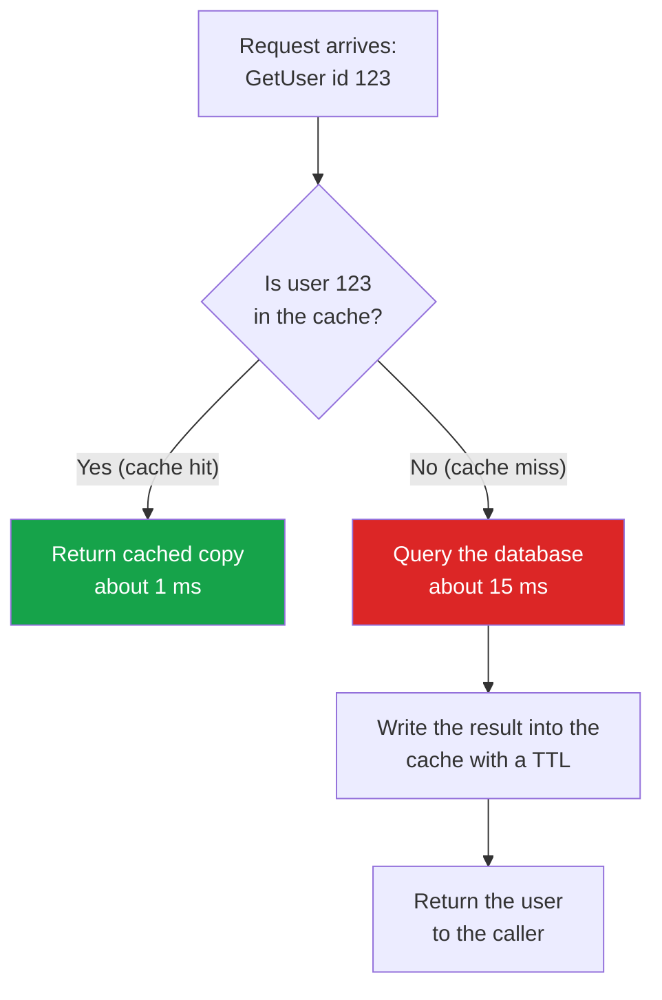
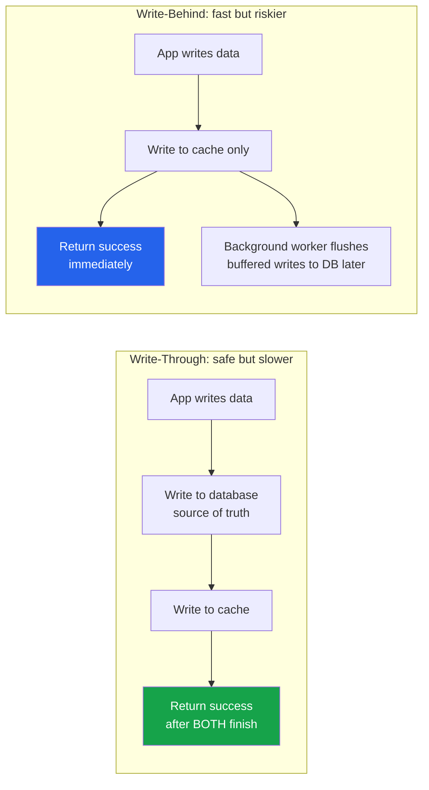
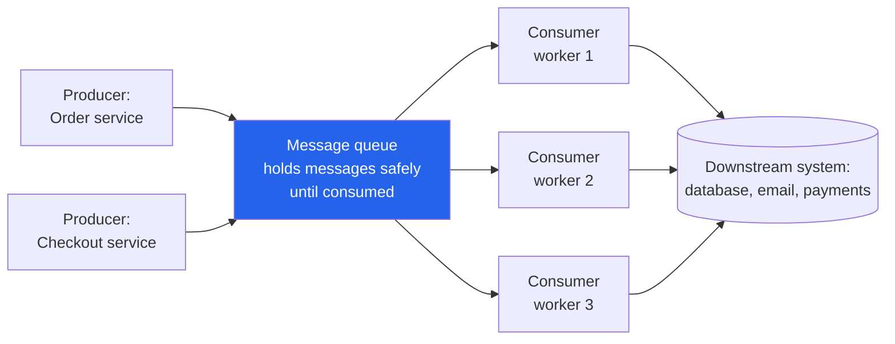
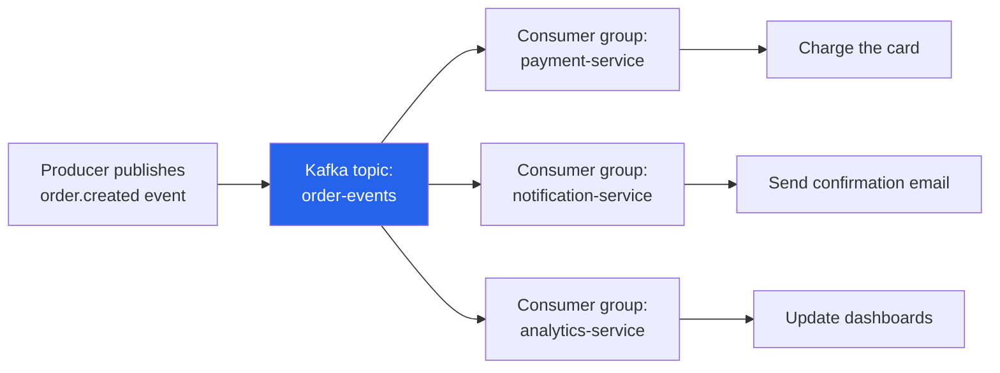
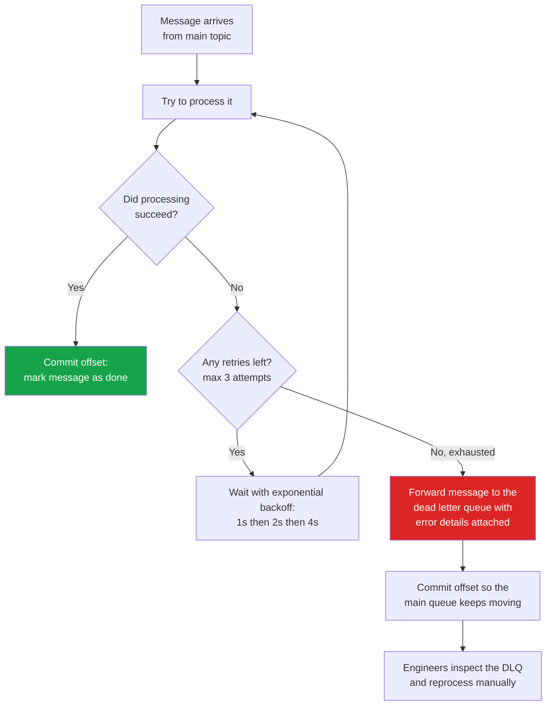
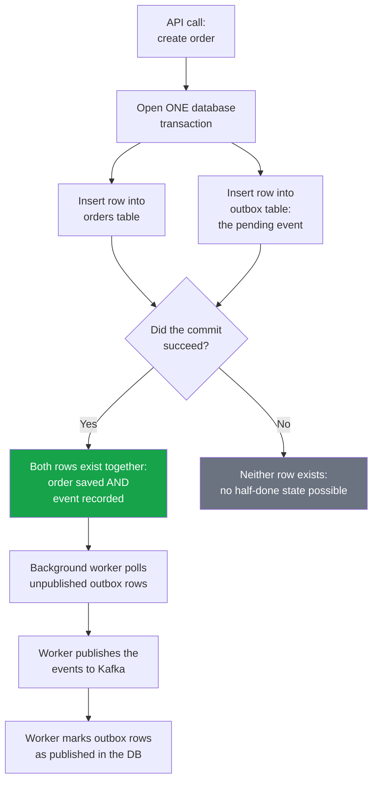

# Caching and Message Queue Design for Go Developers

## Why, What, and Industry Context

### Why this topic matters

Almost every slow website or overloaded backend you have ever used was missing one of two things: a good cache or a good queue.

- **Caching** is about making reads fast. A cache is a small, very fast storage layer that keeps copies of data you use often, so you do not have to fetch it from the slow original source every time. Real-world analogy: keeping snacks in your desk drawer instead of walking to the kitchen every time you are hungry. The kitchen (the database) still has everything, but the drawer (the cache) handles 95% of your trips in seconds instead of minutes.
- **Message queues** are about making work reliable and decoupled. A queue is a holding area where one service drops off work ("messages") and another service picks it up when it is ready. Real-world analogy: a restaurant order rail. Waiters (producers) clip order tickets to the rail and immediately go back to serving tables; cooks (consumers) pull tickets off the rail at their own pace. Nobody stands around waiting for anybody else, and no order is lost if a cook steps away.

### What this file covers, in plain words

This file walks from absolute basics to production-grade patterns, all with runnable Go code:

1. **Why caching works** — the latency numbers that justify it, with real production math.
2. **The four classic caching patterns** — cache-aside, write-through, write-behind, and read-through — what each means, when to pick which, and the trade-offs.
3. **Cache stampede and Go's `singleflight`** — what happens when thousands of requests miss the cache at once, and Go's unique standard-library fix.
4. **In-memory caching in Go** — `map+RWMutex`, `sync.Map`, `groupcache`, `bigcache`, `freecache`, and when each wins.
5. **Cache invalidation** — how the cache finds out when the database changes (TTL, events, tags).
6. **Message queues** — why they exist, Go channels as in-process queues, full Kafka producer/consumer code, retries, dead letter queues, and the outbox pattern.
7. **20 interview questions with model answers.**

Every term is defined in plain language the first time it appears, and there is a glossary right below this section you can refer back to at any time.

### Where this shows up in industry and interviews

- **Industry:** Caching and messaging are the two most common infrastructure layers in backend systems. E-commerce catalogs, social feeds, session storage, and API rate limiting all rely on Redis-style caches. Order processing, email sending, payment events, and analytics pipelines all flow through Kafka-style queues. Companies like Shopify, Uber, and Netflix publish engineering blogs about exactly the patterns in this file.
- **Go specifically:** Go services are often chosen for high-throughput APIs and event consumers, so Go engineers are expected to know `go-redis`, `segmentio/kafka-go`, `singleflight`, and channel-based worker pools cold.
- **Interviews:** "Design a caching layer", "How do you prevent cache stampede?", "Explain at-least-once vs exactly-once delivery", and "How do you avoid the dual-write problem?" are standard mid-to-senior backend interview questions. The Go-specific answers (singleflight, channels with backpressure, bigcache GC behavior) are differentiators that signal real production experience.

---

## Key Terms in Plain English

Refer back to this table whenever a term feels unfamiliar. Every one of these is also explained in context later in the file.

| Term | Plain-English Meaning |
|------|----------------------|
| **Cache** | A small, fast storage layer holding copies of frequently used data, so you avoid the slow original source. Like snacks in your desk drawer instead of the kitchen. |
| **Cache hit** | The data you wanted WAS in the cache. Fast path — you skip the database entirely. |
| **Cache miss** | The data was NOT in the cache. Slow path — you must fetch it from the database, then usually store a copy in the cache for next time. |
| **Hit rate** | The percentage of requests that are cache hits. A 95% hit rate means only 5 in 100 requests touch the database. |
| **TTL (Time To Live)** | An expiry timer on a cached entry. "Cache this for 10 minutes" means after 10 minutes the entry is automatically deleted, forcing a fresh fetch. |
| **Stale data** | Cached data that no longer matches the database because the database changed after the copy was made. |
| **Eviction** | The cache deleting entries to free space (because memory is full) or because the TTL expired. |
| **Cache invalidation** | Deliberately removing or updating a cache entry because the underlying data changed. The hard part: making sure the cache finds out. |
| **Cache stampede / thundering herd** | A popular cache entry expires and thousands of waiting requests all miss at once, all hitting the database simultaneously — often crashing it. |
| **Latency** | How long one operation takes (e.g., 15 ms per database query). Lower is better. |
| **Throughput** | How many operations a system can handle per second (e.g., 5,000 queries/sec). Higher is better. |
| **p99 latency** | The latency that 99% of requests beat. "p99 of 45 ms" means the slowest 1% of requests take longer than 45 ms. Used to measure worst-case user experience. |
| **Message** | A small piece of data describing something that happened or work to do, e.g., "order 123 was created". |
| **Message queue** | A holding area where producers drop messages and consumers pick them up later. Like a restaurant order rail. |
| **Message broker** | The server software that runs the queue (Kafka, RabbitMQ, NATS). It stores, routes, and delivers messages. |
| **Producer** | The code that sends (publishes) messages into a queue or topic. |
| **Consumer** | The code that reads messages from a queue or topic and processes them. |
| **Topic** | A named stream of messages in Kafka, like a labeled mailbox. Producers write to a topic; consumers read from it. |
| **Partition** | A topic split into ordered slices so multiple consumers can work in parallel. Messages within one partition stay in order. |
| **Offset** | A consumer's bookmark: "I have processed everything up to message number N in this partition." |
| **Consumer group** | A team of consumer instances that share the work of one topic. Each message goes to exactly one member of the group. |
| **Pub/Sub (publish/subscribe)** | A pattern where one published message is delivered to MANY independent subscribers, each getting their own copy. |
| **At-least-once delivery** | The broker guarantees a message is delivered one or more times. Duplicates are possible; losses are not. |
| **At-most-once delivery** | A message is delivered zero or one times. Losses are possible; duplicates are not. |
| **Exactly-once delivery** | Each message is processed exactly one time. Very hard and expensive in practice; usually approximated with at-least-once plus idempotency. |
| **Idempotency** | Designing an operation so doing it twice has the same effect as doing it once (e.g., "set balance to 100" is idempotent; "add 10 to balance" is not). Essential for handling duplicate messages safely. |
| **Dead letter queue (DLQ)** | A separate "quarantine" queue where messages go after failing too many times, so one bad message cannot block all the others. |
| **Backpressure** | A slow consumer signaling a fast producer to slow down, preventing the queue from growing without limit. |
| **Durability** | Messages or data surviving a crash or restart because they are written to disk. |
| **Outbox pattern** | Writing the database change and the "message to send" in one atomic database transaction, then publishing the message afterward — so the two can never disagree. |

---

## Table of Contents

1. [Why, What, and Industry Context](#why-what-and-industry-context)
2. [Key Terms in Plain English](#key-terms-in-plain-english)
3. [Why Caching is Critical in Go Services](#why-caching-is-critical)
4. [Cache-Aside (Lazy Loading)](#cache-aside-lazy-loading)
5. [Write-Through Cache](#write-through-cache)
6. [Write-Behind (Write-Back) Cache](#write-behind-write-back-cache)
7. [Read-Through Cache](#read-through-cache)
8. [singleflight: The Go Cache Stampede Solution](#singleflight-the-go-cache-stampede-solution)
9. [In-Memory Caching in Go](#in-memory-caching-in-go)
10. [Cache Invalidation Strategies](#cache-invalidation-strategies)
11. [Why Message Queues in Go Services](#why-message-queues-in-go-services)
12. [Kafka with Go](#kafka-with-go)
13. [Go Channels as Queues](#go-channels-as-queues)
14. [Dead Letter Queue Pattern](#dead-letter-queue-pattern)
15. [Outbox Pattern (Transactional Messaging)](#outbox-pattern-transactional-messaging)
16. [Message Queue Comparison](#message-queue-comparison)
17. [Interview Questions](#interview-questions)

---

## Why Caching is Critical

**Beginner framing:** A database is like a warehouse — it holds everything, but every trip there is slow. A cache is like a shelf next to your workstation — tiny compared to the warehouse, but reachable in one second. The whole art of caching is deciding what to keep on the shelf, how long to trust it, and what to do when the shelf is empty.

### The Performance Math

Without understanding the numbers, caching decisions are guesswork. These are the access latencies every Go engineer must internalize. (Reminder: *latency* is how long one operation takes; *throughput* is how many operations per second a layer can serve. Note the units below — a nanosecond (ns) is a billionth of a second, a millisecond (ms) is a thousandth. RAM is roughly 10,000x faster than a database query.)

| Storage Layer        | Latency      | Throughput (typical) |
|---------------------|-------------|----------------------|
| L1 CPU Cache         | 1 ns        | —                    |
| L2 CPU Cache         | 4 ns        | —                    |
| RAM (in-process)     | 100 ns      | ~10 GB/s             |
| Redis (local)        | 0.5–1 ms    | ~100k ops/sec        |
| Redis (remote)       | 1–3 ms      | ~50k ops/sec         |
| PostgreSQL (indexed) | 5–20 ms     | ~5k QPS              |
| PostgreSQL (no index)| 50–500 ms   | ~500 QPS             |
| S3 / Blob storage    | 50–200 ms   | ~1k ops/sec          |

**Throughput math — production scenario:**

Imagine a Go user-profile endpoint that hits PostgreSQL on every request:
- DB latency: 15 ms per query
- With 100 concurrent goroutines: ~6,600 req/sec ceiling
- p99 latency: ~45 ms (queueing under load)

With Redis cache (95% hit rate — meaning 95 out of 100 requests find the data already in the cache):
- Cache hit latency: 1 ms
- Cache miss falls to DB: 15 ms (5% of requests)
- Effective latency: `0.95 * 1ms + 0.05 * 15ms = 1.7ms`
- With 100 goroutines: ~58,000 req/sec ceiling (nearly 9x improvement)
- p99 latency: ~5 ms

**Real production example — an e-commerce product catalog:**

A product catalog service serving 2 million SKUs was hitting PostgreSQL with 200-300ms response times under load. After adding Redis with a 10-minute TTL on product reads (TTL = the expiry timer; after 10 minutes the cached copy is discarded and refreshed):
- p50: 240ms → 1.2ms
- p99: 820ms → 8ms
- DB CPU: 90% → 12%
- Infrastructure cost: reduced 60% (fewer DB replicas needed)

The cache hit rate was 94% because 80% of traffic hits 10% of products (Pareto distribution). This is why caching works — real traffic is not uniformly distributed. A small shelf really can serve most of the warehouse's visitors.

### Cache Miss Penalty Model

The code below shows the same lookup twice: once going straight to the database every time, and once checking the cache first. The pattern of "check cache, fall back to DB on miss, then store the result in the cache" is the foundation of everything in this file.

```go
// Before: every request pays DB cost
func GetUserNaive(db *sql.DB, userID string) (*User, error) {
    // Always costs 10-20ms
    row := db.QueryRow("SELECT * FROM users WHERE id = $1", userID)
    var u User
    return &u, row.Scan(&u.ID, &u.Name, &u.Email)
}

// After: 95% of requests pay 1ms (cache hit)
func GetUserCached(cache *redis.Client, db *sql.DB, userID string) (*User, error) {
    // Check cache first — 1ms
    cached, err := cache.Get(ctx, "user:"+userID).Bytes()
    if err == nil {
        var u User
        json.Unmarshal(cached, &u)
        return &u, nil  // 1ms path — 95% of calls
    }

    // Cache miss — pay DB cost (15ms), but only 5% of the time
    row := db.QueryRow("SELECT * FROM users WHERE id = $1", userID)
    var u User
    if err := row.Scan(&u.ID, &u.Name, &u.Email); err != nil {
        return nil, err
    }

    // Populate cache for next time
    data, _ := json.Marshal(u)
    cache.Set(ctx, "user:"+userID, data, 10*time.Minute)
    return &u, nil
}
```

---

## Caching Patterns (All with Go Code)

There are four classic caching patterns. They differ in one simple question: **who is responsible for keeping the cache filled and current — the application, or the cache itself? And do writes go through the cache or around it?** Read them in order; each one builds on the previous.

### Cache-Aside (Lazy Loading)

**What it is:** The application is responsible for loading data into the cache. On cache miss, the application fetches from the DB and populates the cache. The cache does not interact with the DB directly.

**Beginner analogy:** You (the application) check your desk drawer for a snack. If it is empty, YOU walk to the kitchen, get the snack, eat some, and put the rest in the drawer for next time. The drawer never restocks itself — that is why it is called "lazy loading": nothing is cached until someone actually asks for it.

This diagram shows the full read path of cache-aside: what happens on a hit versus a miss.



How to read this diagram:
- Start at the top: every read request first asks the cache, never the database.
- The green box is the fast path (cache hit) — most requests take this route once the cache is warm.
- The red box is the slow path (cache miss) — only the first request for a given user pays the database cost.
- After a miss, the result is written into the cache with a TTL, so the NEXT request for the same user takes the green path.
- The database is only contacted on misses, which is what protects it from load.

**When to use:**
- Read-heavy workloads
- Tolerance for stale data during the TTL window
- When you want the cache to hold only requested data (not the whole dataset)

**Trade-offs:**
- Cache miss = 3 operations (check cache, read DB, write cache) — slower for cold caches
- Data can be stale until TTL expires
- Cache stampede risk on popular keys (solved below with singleflight)

```go
package cache

import (
    "context"
    "encoding/json"
    "errors"
    "time"

    "github.com/redis/go-redis/v9"
)

type User struct {
    ID    string
    Name  string
    Email string
}

type UserRepo interface {
    FindByID(ctx context.Context, id string) (*User, error)
}

type CacheAsideService struct {
    redis  *redis.Client
    repo   UserRepo
    ttl    time.Duration
}

func NewCacheAsideService(r *redis.Client, repo UserRepo) *CacheAsideService {
    return &CacheAsideService{redis: r, repo: repo, ttl: 10 * time.Minute}
}

// GetUser implements cache-aside (lazy loading).
// Flow: check cache → on miss → load from DB → populate cache → return
func (s *CacheAsideService) GetUser(ctx context.Context, id string) (*User, error) {
    key := "user:" + id

    // Step 1: Check cache
    data, err := s.redis.Get(ctx, key).Bytes()
    if err == nil {
        // Cache HIT — deserialize and return
        var u User
        if jsonErr := json.Unmarshal(data, &u); jsonErr == nil {
            return &u, nil
        }
    }

    if !errors.Is(err, redis.Nil) {
        // Redis error (not just a miss) — log and fall through to DB
        // In production: emit a metric here
    }

    // Step 2: Cache MISS — load from the source of truth
    user, err := s.repo.FindByID(ctx, id)
    if err != nil {
        return nil, err
    }

    // Step 3: Populate the cache for subsequent requests
    payload, err := json.Marshal(user)
    if err == nil {
        // Use SET with EX (expire). Ignore Redis errors here — cache is best-effort.
        _ = s.redis.Set(ctx, key, payload, s.ttl).Err()
    }

    return user, nil
}

// InvalidateUser removes a user from the cache (call on writes/deletes).
func (s *CacheAsideService) InvalidateUser(ctx context.Context, id string) error {
    return s.redis.Del(ctx, "user:"+id).Err()
}
```

**Cache stampede prevention with singleflight** (covered in depth later — shown inline here). In one sentence: a cache stampede is when many requests miss the cache for the same key at the same moment and all hammer the database together; `singleflight` collapses them into a single database query.

```go
import "golang.org/x/sync/singleflight"

type CacheAsideWithSF struct {
    redis  *redis.Client
    repo   UserRepo
    ttl    time.Duration
    group  singleflight.Group
}

func (s *CacheAsideWithSF) GetUser(ctx context.Context, id string) (*User, error) {
    key := "user:" + id

    data, err := s.redis.Get(ctx, key).Bytes()
    if err == nil {
        var u User
        json.Unmarshal(data, &u)
        return &u, nil
    }

    // singleflight: if 100 goroutines miss simultaneously on the same key,
    // only ONE issues the DB query. All 100 get the same result.
    result, err, _ := s.group.Do(key, func() (interface{}, error) {
        user, err := s.repo.FindByID(ctx, id)
        if err != nil {
            return nil, err
        }
        payload, _ := json.Marshal(user)
        s.redis.Set(ctx, key, payload, s.ttl)
        return user, nil
    })

    if err != nil {
        return nil, err
    }
    return result.(*User), nil
}
```

---

### Write-Through Cache

**What it is:** Every write goes to the cache AND the database synchronously. The cache always reflects the current state of the DB.

**Beginner analogy:** Whenever you buy snacks, you put some in BOTH the kitchen (database) and your desk drawer (cache) before you sit back down. Your drawer is never out of date, but every shopping trip takes a little longer because you stock two places.

The key trade-off in one line: cache-aside makes *reads* responsible for filling the cache; write-through makes *writes* responsible. Write-through buys you "read your own writes" consistency — update your profile, refresh the page, see the change instantly — at the cost of slower writes.

**When to use over cache-aside:**
- When read-after-write consistency matters (e.g., a user updates their profile and immediately sees the change)
- When you can afford slightly slower writes (2 hops: cache + DB)
- Financial records, user sessions, inventory counts

**Trade-offs:**
- Writes are slower (must wait for both cache and DB)
- Cache may fill with data that is never read (write-heavy workloads waste cache space)
- If the DB write fails, you must rollback the cache write

```go
package cache

import (
    "context"
    "encoding/json"
    "fmt"
    "time"

    "github.com/redis/go-redis/v9"
)

type WriteThroughService struct {
    redis  *redis.Client
    repo   UserRepo
    ttl    time.Duration
}

// UpdateUser writes to cache AND database atomically (best-effort).
// The DB is the source of truth; cache write failure is logged but not fatal.
func (s *WriteThroughService) UpdateUser(ctx context.Context, u *User) error {
    // Step 1: Write to the database first (source of truth)
    if err := s.repo.Update(ctx, u); err != nil {
        return fmt.Errorf("db update: %w", err)
    }

    // Step 2: Write to the cache (keep cache current)
    key := "user:" + u.ID
    payload, err := json.Marshal(u)
    if err != nil {
        return nil // DB succeeded; cache marshal failure is not fatal
    }

    if err := s.redis.Set(ctx, key, payload, s.ttl).Err(); err != nil {
        // Cache write failed — invalidate the stale entry rather than serving wrong data
        _ = s.redis.Del(ctx, key).Err()
        // In production: log this and emit a metric
    }

    return nil
}

// GetUser is simple — if it's in cache, it's always current (write-through guarantee).
func (s *WriteThroughService) GetUser(ctx context.Context, id string) (*User, error) {
    key := "user:" + id
    data, err := s.redis.Get(ctx, key).Bytes()
    if err == nil {
        var u User
        json.Unmarshal(data, &u)
        return &u, nil
    }

    // Cache miss (cold start or eviction) — load and warm the cache
    user, err := s.repo.FindByID(ctx, id)
    if err != nil {
        return nil, err
    }

    payload, _ := json.Marshal(user)
    s.redis.Set(ctx, key, payload, s.ttl)
    return user, nil
}
```

**Write-through vs cache-aside decision matrix:**

| Criteria                       | Cache-Aside | Write-Through |
|-------------------------------|-------------|---------------|
| Read-after-write consistency   | No          | Yes           |
| Write performance              | Faster      | Slower        |
| Cache utilization              | High        | May be wasteful|
| Cold start behavior            | Slow        | Slow          |
| Complexity                     | Low         | Medium        |

---

### Write-Behind (Write-Back) Cache

**What it is:** Writes go to the cache immediately and return success. The DB write happens asynchronously in the background. The cache absorbs write bursts and flushes to the DB at intervals.

**Beginner analogy:** You jot expenses on a sticky note (cache) the moment they happen, then copy the whole note into your official ledger (database) once an hour. Recording is instant — but if you lose the sticky note before copying it, that hour of records is gone forever. That is the exact risk of write-behind.

This diagram compares write-through and write-behind side by side, because the difference between them is the single most-asked caching trade-off in interviews.



How to read this diagram:
- Top half (write-through): the caller waits for BOTH the database and the cache before getting "success". Slower, but nothing can be lost.
- Bottom half (write-behind): the caller gets "success" the instant the cache is updated. Very fast writes.
- In write-behind, the database is updated later by a background worker — note that the flush happens on a separate path the caller never waits for.
- The danger window in write-behind is between "return success" and "flush to DB": a crash there loses the write.
- Rule of thumb: write-through for data you cannot lose (orders, money), write-behind for data you can re-derive or tolerate losing (view counts, likes).

**When to use:**
- Write-heavy workloads with high burst traffic (analytics counters, view counts, like counts)
- When eventual consistency with the DB is acceptable
- To protect the DB from write spikes

**Durability considerations:**
- If the application crashes before the buffer flushes, writes are lost
- Use write-behind only for data where losing a few seconds of writes is acceptable
- Not appropriate for financial transactions, orders, or any data requiring strict durability

```go
package cache

import (
    "context"
    "encoding/json"
    "sync"
    "time"

    "github.com/redis/go-redis/v9"
)

// WriteBehindBuffer holds dirty writes that have not yet been flushed to DB.
type WriteBehindBuffer struct {
    mu       sync.Mutex
    dirty    map[string]*User // key -> latest value
    redis    *redis.Client
    repo     UserRepo
    ttl      time.Duration
    stopCh   chan struct{}
    flushInterval time.Duration
}

func NewWriteBehindBuffer(r *redis.Client, repo UserRepo) *WriteBehindBuffer {
    wb := &WriteBehindBuffer{
        dirty:         make(map[string]*User),
        redis:         r,
        repo:          repo,
        ttl:           10 * time.Minute,
        stopCh:        make(chan struct{}),
        flushInterval: 5 * time.Second,
    }
    go wb.flushLoop()
    return wb
}

// UpdateUser writes immediately to cache and buffers the DB write.
func (wb *WriteBehindBuffer) UpdateUser(ctx context.Context, u *User) error {
    key := "user:" + u.ID

    // Write to cache immediately — callers see the update at once
    payload, _ := json.Marshal(u)
    if err := wb.redis.Set(ctx, key, payload, wb.ttl).Err(); err != nil {
        return err
    }

    // Buffer the DB write — will be flushed asynchronously
    wb.mu.Lock()
    wb.dirty[u.ID] = u // latest write wins (coalescing)
    wb.mu.Unlock()

    return nil
}

// flushLoop periodically drains the dirty buffer to the database.
func (wb *WriteBehindBuffer) flushLoop() {
    ticker := time.NewTicker(wb.flushInterval)
    defer ticker.Stop()

    for {
        select {
        case <-ticker.C:
            wb.flush()
        case <-wb.stopCh:
            wb.flush() // drain on shutdown
            return
        }
    }
}

func (wb *WriteBehindBuffer) flush() {
    wb.mu.Lock()
    if len(wb.dirty) == 0 {
        wb.mu.Unlock()
        return
    }
    // Snapshot and clear the buffer atomically
    batch := wb.dirty
    wb.dirty = make(map[string]*User)
    wb.mu.Unlock()

    ctx, cancel := context.WithTimeout(context.Background(), 10*time.Second)
    defer cancel()

    for _, u := range batch {
        if err := wb.repo.Update(ctx, u); err != nil {
            // In production: log error, re-queue the write, emit metric
            // For simplicity here we just drop it (acceptable for counters/view counts)
            _ = err
        }
    }
}

// Stop gracefully shuts down the buffer, flushing remaining writes.
func (wb *WriteBehindBuffer) Stop() {
    close(wb.stopCh)
}
```

---

### Read-Through Cache

**What it is:** The cache sits in front of the database and is responsible for loading data on a miss. The application only talks to the cache — never directly to the DB for reads. The cache delegates to the DB when needed.

**Beginner analogy:** Instead of walking to the kitchen yourself when the drawer is empty, you have an assistant: you only ever ask the drawer, and if it is empty, the drawer's assistant quietly fetches from the kitchen and restocks before handing you the snack. From your point of view, the drawer is never empty.

**Difference from cache-aside:** In cache-aside the APPLICATION loads from DB and populates cache. In read-through, the CACHE itself fetches from the DB (via a loader function).

**When to use:**
- When you want to abstract DB access behind a cache interface
- Cleaner application code — callers just call `Get(key)` and never worry about DB loading
- Libraries like `groupcache` implement read-through natively

```go
package cache

import (
    "context"
    "encoding/json"
    "time"

    "github.com/redis/go-redis/v9"
)

// Loader is the function the cache calls on a miss to populate itself.
type Loader[T any] func(ctx context.Context, key string) (T, error)

// ReadThroughCache is a generic read-through cache backed by Redis.
type ReadThroughCache[T any] struct {
    redis  *redis.Client
    ttl    time.Duration
    loader Loader[T]
}

func NewReadThroughCache[T any](r *redis.Client, ttl time.Duration, loader Loader[T]) *ReadThroughCache[T] {
    return &ReadThroughCache[T]{redis: r, ttl: ttl, loader: loader}
}

// Get returns the value for key. On miss, calls loader to populate the cache.
// The caller never needs to know whether the data came from cache or DB.
func (c *ReadThroughCache[T]) Get(ctx context.Context, key string) (T, error) {
    var zero T

    // Attempt cache read
    data, err := c.redis.Get(ctx, key).Bytes()
    if err == nil {
        var val T
        if jsonErr := json.Unmarshal(data, &val); jsonErr == nil {
            return val, nil
        }
    }

    // Cache miss — delegate to loader (reads from DB)
    val, err := c.loader(ctx, key)
    if err != nil {
        return zero, err
    }

    // Populate cache so next read is fast
    payload, _ := json.Marshal(val)
    _ = c.redis.Set(ctx, key, payload, c.ttl).Err()

    return val, nil
}

// Example usage of the generic read-through cache
func ExampleReadThrough() {
    rdb := redis.NewClient(&redis.Options{Addr: "localhost:6379"})

    // Define the loader — this is the only place DB access happens
    userLoader := func(ctx context.Context, key string) (*User, error) {
        // In real code: db.QueryRow(...)
        return &User{ID: key, Name: "Alice", Email: "alice@example.com"}, nil
    }

    cache := NewReadThroughCache(rdb, 10*time.Minute, userLoader)

    user, err := cache.Get(context.Background(), "user:123")
    if err != nil {
        panic(err)
    }
    _ = user // always a *User, regardless of cache hit/miss
}
```

---

## singleflight: The Go Cache Stampede Solution

### The Problem: Thundering Herd / Cache Stampede

**Plain-language setup:** Imagine a viral product page. Its cache entry expires at exactly noon. At 12:00:00, ten thousand requests for that page all check the cache, all find nothing, and ALL ten thousand decide to query the database for the same row at the same instant. The database — which had been resting comfortably behind the cache — suddenly gets a tidal wave it was never sized for. That is a cache stampede (also called a thundering herd).

When a popular cache key expires, all requests waiting for that key simultaneously find a miss and all issue a DB query at the same time. For a key serving 10,000 req/sec, that's 10,000 simultaneous DB queries on a cold cache — enough to take down a database.

```
Timeline of a cache stampede:
T=0: key expires
T=1: 1000 concurrent requests all see cache miss
T=2: 1000 DB queries fire simultaneously
T=3: DB CPU spikes to 100%, queries timeout
T=4: All 1000 requests return errors
T=5: Cache is still empty — cycle repeats
```

This diagram contrasts what happens without protection (left) versus with `singleflight` (right) when a popular key expires.

```mermaid
flowchart TD
    subgraph SG1["Without protection: cache stampede"]
        K1[Popular key expires] --> M1[1000 requests<br/>all see a cache miss]
        M1 --> Q1[1000 identical DB queries<br/>fire at the same instant]
        Q1 --> X1[Database overloads<br/>and queries time out]
    end
    subgraph SG2["With singleflight protection"]
        K2[Popular key expires] --> M2[1000 requests<br/>all see a cache miss]
        M2 --> S2[singleflight groups callers<br/>by cache key]
        S2 --> Q2[Only ONE DB query fires]
        Q2 --> R2[All 1000 requests share<br/>the same single result]
    end
    style X1 fill:#dc2626,color:#fff
    style Q2 fill:#16a34a,color:#fff
```



How to read this diagram:
- Both sides start identically: a hot key expires and 1000 concurrent requests miss the cache together.
- Left side (red ending): every request independently queries the database, multiplying load 1000x — the database falls over.
- Right side: `singleflight` notices that all 1000 calls use the same key, lets exactly one through to the database, and parks the other 999.
- When that one query finishes (green box path), its result is handed to all 1000 waiting callers at once.
- The database sees 1 query instead of 1000 — same answers for everyone, no overload.

### singleflight: One Query to Rule Them All

`golang.org/x/sync/singleflight` is Go's built-in solution. When multiple goroutines call `group.Do(key, fn)` with the same key simultaneously, only ONE executes `fn`. All others block and receive the same result when that single call completes.

This is a **Go-specific differentiator** in interviews. Most other languages do not have this in their standard library ecosystem. When an interviewer asks "how do you prevent cache stampede in Go?", this is the answer.

```go
package singleflight_demo

import (
    "context"
    "encoding/json"
    "fmt"
    "sync"
    "time"

    "github.com/redis/go-redis/v9"
    "golang.org/x/sync/singleflight"
)

type ProductService struct {
    redis  *redis.Client
    db     ProductDB
    group  singleflight.Group
    ttl    time.Duration
}

type Product struct {
    ID    string
    Name  string
    Price float64
}

type ProductDB interface {
    Find(ctx context.Context, id string) (*Product, error)
}

// GetProduct demonstrates singleflight preventing thundering herd.
// Even if 10,000 goroutines call GetProduct("prod-001") simultaneously
// during a cache miss, only ONE database query executes.
func (s *ProductService) GetProduct(ctx context.Context, id string) (*Product, error) {
    cacheKey := "product:" + id

    // Fast path: cache hit (no singleflight needed)
    if data, err := s.redis.Get(ctx, cacheKey).Bytes(); err == nil {
        var p Product
        if err := json.Unmarshal(data, &p); err == nil {
            return &p, nil
        }
    }

    // Slow path: cache miss — use singleflight to deduplicate DB queries.
    // group.Do returns: (shared value, shared error, whether this goroutine was the caller)
    // The third return value (shared bool) tells you if the result was shared — useful for metrics.
    v, err, shared := s.group.Do(cacheKey, func() (interface{}, error) {
        fmt.Printf("DB query fired for %s (shared=%v)\n", id, shared)

        product, err := s.db.Find(ctx, id)
        if err != nil {
            return nil, err
        }

        // Populate cache — only executed once even if 10,000 goroutines are waiting
        payload, _ := json.Marshal(product)
        _ = s.redis.Set(ctx, cacheKey, payload, s.ttl).Err()

        return product, nil
    })

    if err != nil {
        return nil, err
    }

    return v.(*Product), nil
}

// DemoStampedePrevention shows singleflight in action.
// Without singleflight: 100 goroutines = 100 DB queries.
// With singleflight: 100 goroutines = 1 DB query.
func DemoStampedePrevention() {
    // Simulate 100 concurrent requests during a cache miss
    var wg sync.WaitGroup
    queryCount := 0
    var mu sync.Mutex

    var group singleflight.Group

    // Simulate expensive DB operation
    expensiveDBQuery := func() (*Product, error) {
        mu.Lock()
        queryCount++
        mu.Unlock()
        time.Sleep(50 * time.Millisecond) // simulate DB latency
        return &Product{ID: "1", Name: "Widget", Price: 9.99}, nil
    }

    start := time.Now()
    for i := 0; i < 100; i++ {
        wg.Add(1)
        go func() {
            defer wg.Done()
            v, err, _ := group.Do("product:1", func() (interface{}, error) {
                return expensiveDBQuery()
            })
            if err != nil {
                return
            }
            _ = v.(*Product)
        }()
    }

    wg.Wait()
    fmt.Printf("100 goroutines, %d DB queries, took %v\n", queryCount, time.Since(start))
    // Output: 100 goroutines, 1 DB queries, took 51ms
    // Without singleflight it would be: 100 DB queries, took 50ms * 100 / parallelism
}

// DoChan: non-blocking variant — returns a channel you can select on.
func (s *ProductService) GetProductAsync(ctx context.Context, id string) <-chan *Product {
    resultCh := make(chan *Product, 1)
    cacheKey := "product:" + id

    ch := s.group.DoChan(cacheKey, func() (interface{}, error) {
        return s.db.Find(ctx, id)
    })

    go func() {
        select {
        case result := <-ch:
            if result.Err == nil {
                resultCh <- result.Val.(*Product)
            }
        case <-ctx.Done():
        }
    }()

    return resultCh
}

// Forget: manually invalidate singleflight — use when you want a fresh DB call
// even if a previous one is in-flight (e.g., after a write).
func (s *ProductService) InvalidateProduct(ctx context.Context, id string) {
    cacheKey := "product:" + id
    s.group.Forget(cacheKey)    // Allow next call to issue a fresh DB query
    s.redis.Del(ctx, cacheKey)  // Remove from Redis
}
```

**Key singleflight interview points:**
1. `group.Do(key, fn)` — deduplicates in-flight calls by key
2. `group.DoChan(key, fn)` — returns a channel (non-blocking caller)
3. `group.Forget(key)` — removes the in-flight entry so the next call fires fresh
4. The third return value `shared bool` — true when this result was shared (useful for metrics)
5. **Limitation:** If the DB query fails, ALL waiting goroutines get that error. Use `group.Forget(key)` on error to allow retry.

---

## In-Memory Caching in Go

**Beginner framing:** Everything so far used Redis — a cache that lives in its own server process, reached over the network. An *in-memory* (in-process) cache lives inside YOUR Go program's own RAM. It is roughly 10,000x faster than Redis (100 nanoseconds vs 1 millisecond) because there is no network hop at all — but it is private to one process, disappears on restart, and competes with your program for memory and garbage-collector attention. This section covers the Go-native options.

### sync.Map vs map+RWMutex

(Quick definitions: a *mutex* is a lock that lets only one goroutine touch shared data at a time. An `RWMutex` is a smarter lock that allows many simultaneous readers but only one writer — perfect for caches, which are read far more often than written.)

**When to use each — the practical answer:**

- **`map` + `sync.RWMutex`**: Use this in 90% of cases. Simple, predictable, efficient when reads heavily outnumber writes.
- **`sync.Map`**: Designed for two specific patterns:
  1. Keys are written once and read many times (stable key set)
  2. Keys are accessed by disjoint goroutines (no contention on the same key)
  In practice: rarely outperforms `map+RWMutex` in a service cache.

```go
package inmemory

import (
    "fmt"
    "sync"
    "time"
)

// --- Approach 1: map + RWMutex ---
// Fastest for general-purpose caching in Go services.
// RLock allows many concurrent readers; Lock is exclusive for writes.

type RWMutexCache struct {
    mu    sync.RWMutex
    items map[string]cacheEntry
}

type cacheEntry struct {
    value     interface{}
    expiresAt time.Time
}

func NewRWMutexCache() *RWMutexCache {
    c := &RWMutexCache{items: make(map[string]cacheEntry)}
    go c.janitor()
    return c
}

func (c *RWMutexCache) Set(key string, value interface{}, ttl time.Duration) {
    c.mu.Lock()
    defer c.mu.Unlock()
    c.items[key] = cacheEntry{
        value:     value,
        expiresAt: time.Now().Add(ttl),
    }
}

func (c *RWMutexCache) Get(key string) (interface{}, bool) {
    c.mu.RLock()
    defer c.mu.RUnlock()
    entry, ok := c.items[key]
    if !ok || time.Now().After(entry.expiresAt) {
        return nil, false
    }
    return entry.value, true
}

func (c *RWMutexCache) Delete(key string) {
    c.mu.Lock()
    defer c.mu.Unlock()
    delete(c.items, key)
}

// janitor runs in the background and removes expired entries.
func (c *RWMutexCache) janitor() {
    ticker := time.NewTicker(5 * time.Minute)
    defer ticker.Stop()
    for range ticker.C {
        c.mu.Lock()
        now := time.Now()
        for key, entry := range c.items {
            if now.After(entry.expiresAt) {
                delete(c.items, key)
            }
        }
        c.mu.Unlock()
    }
}

// --- Approach 2: sync.Map ---
// Note: No TTL support built-in — you need to wrap values.
// Best for: long-lived keys, disjoint goroutine access patterns.

type SyncMapCache struct {
    m sync.Map
}

type syncEntry struct {
    value     interface{}
    expiresAt time.Time
}

func (c *SyncMapCache) Set(key string, value interface{}, ttl time.Duration) {
    c.m.Store(key, syncEntry{value: value, expiresAt: time.Now().Add(ttl)})
}

func (c *SyncMapCache) Get(key string) (interface{}, bool) {
    val, ok := c.m.Load(key)
    if !ok {
        return nil, false
    }
    entry := val.(syncEntry)
    if time.Now().After(entry.expiresAt) {
        c.m.Delete(key) // lazy expiration
        return nil, false
    }
    return entry.value, true
}

// --- Benchmark comparison results (go test -bench) ---
// BenchmarkRWMutex/read-8    	 5000000	       280 ns/op
// BenchmarkSyncMap/read-8    	 3000000	       450 ns/op
// Winner for most cache patterns: map+RWMutex
//
// BenchmarkRWMutex/write-8   	  500000	      3200 ns/op  (lock contention)
// BenchmarkSyncMap/write-8   	  800000	      1800 ns/op  (atomic store)
// When write-heavy with many keys: sync.Map can win
```

### groupcache (Google's Go Cache)

`groupcache` is the caching library that powers dl.golang.org and other Google Go services. It combines:
- **In-process LRU cache** (hot data lives in RAM; LRU = "Least Recently Used", an eviction policy that throws out whatever has gone unused the longest when space runs out)
- **Consistent hashing** (a technique that deterministically assigns each key to one server, so every node in the cluster agrees on who "owns" which key — routes cache misses to the correct peer)
- **Automatic deduplication** (built-in singleflight behavior)
- **No central cache server** (peers ARE the cache)

**How it works:**
1. You define a group with a `GetterFunc` (the DB loader)
2. On a cache miss, groupcache hashes the key to find the "owner" peer
3. If this node is the owner: load from DB, cache locally, return
4. If another node is the owner: HTTP call to that peer (they load and cache it)
5. The singleflight property means only ONE load happens cluster-wide per key

```go
package groupcache_demo

import (
    "context"
    "fmt"
    "net/http"
    "time"

    "github.com/golang/groupcache"
)

var (
    // Peers in the cluster
    pool *groupcache.HTTPPool
    // The named cache group
    userGroup *groupcache.Group
)

func InitGroupcache(selfAddr string, peers []string) {
    // Register this node and its peers
    pool = groupcache.NewHTTPPool("http://" + selfAddr)
    pool.Set(peers...)

    // Create a named group — "users" — with 64MB memory limit
    userGroup = groupcache.NewGroup("users", 64<<20, groupcache.GetterFunc(
        func(ctx context.Context, key string, dest groupcache.Sink) error {
            // This only executes when the data is NOT in any peer's cache.
            // groupcache guarantees this runs at most once per key at a time.
            user, err := loadUserFromDB(ctx, key)
            if err != nil {
                return err
            }

            // Store as JSON bytes in the sink
            data, _ := json.Marshal(user)
            dest.SetBytes(data, time.Now().Add(10*time.Minute))
            return nil
        },
    ))

    // Start serving groupcache HTTP protocol
    http.ListenAndServe(":8080", pool)
}

func GetUser(ctx context.Context, userID string) (*User, error) {
    var data []byte
    // groupcache.Get handles: local cache check, peer routing, DB load, deduplication
    if err := userGroup.Get(ctx, userID, groupcache.AllocatingByteSliceSink(&data)); err != nil {
        return nil, err
    }
    var u User
    json.Unmarshal(data, &u)
    return &u, nil
}

func loadUserFromDB(ctx context.Context, id string) (*User, error) {
    fmt.Printf("DB load for user %s\n", id)
    return &User{ID: id, Name: "Alice"}, nil
}
```

**When to choose groupcache over Redis:**
- All services are Go (no polyglot environment)
- You want zero external dependencies (no Redis server to maintain)
- Data fits in RAM across cluster nodes
- You need automatic load distribution (consistent hashing)
- Cost-sensitive — groupcache is free, Redis Cluster has operational overhead

### bigcache and freecache

Both solve a specific Go caching problem: **GC pressure from map[string]interface{}**.

(Beginner note: GC is Go's *garbage collector* — a background process that periodically pauses parts of your program to find and free memory that is no longer used. To do that, it must walk every pointer your program holds. A cache holding millions of objects means millions of extra pointers to walk, which makes those pauses longer.)

When you store millions of objects in a `map`, the GC must scan every pointer on every GC cycle. This causes GC pause times that grow linearly with the number of cached objects.

**bigcache** and **freecache** store data as raw bytes (no Go pointers inside the hash map), making the GC treat the cache as opaque memory — GC pauses stay near zero regardless of cache size.

```go
package bigcache_demo

import (
    "context"
    "encoding/json"
    "time"

    "github.com/allegro/bigcache/v3"
    "github.com/coocood/freecache"
)

// bigcache: automatic sharding, good default for services
func BigCacheExample() {
    config := bigcache.Config{
        Shards:             1024,           // number of shards (power of 2)
        LifeWindow:         10 * time.Minute, // TTL for all entries
        CleanWindow:        5 * time.Minute,  // cleanup interval
        MaxEntriesInWindow: 1000 * 10 * 60,  // expected entries per LifeWindow
        MaxEntrySize:       500,             // max entry size in bytes
        HardMaxCacheSize:   512,             // max total MB; 0 = unlimited
    }

    cache, _ := bigcache.New(context.Background(), config)

    // Store
    user := User{ID: "123", Name: "Bob"}
    data, _ := json.Marshal(user)
    cache.Set("user:123", data)

    // Retrieve
    entry, err := cache.Get("user:123")
    if err == nil {
        var u User
        json.Unmarshal(entry, &u)
        _ = u
    }
}

// freecache: manual memory allocation, most predictable GC behavior
func FreecacheExample() {
    // Allocate 256MB cache — Go GC ignores entries inside this block
    cache := freecache.NewCache(256 * 1024 * 1024)

    user := User{ID: "456", Name: "Carol"}
    data, _ := json.Marshal(user)

    ttlSeconds := 600 // 10 minutes
    cache.Set([]byte("user:456"), data, ttlSeconds)

    entry, err := cache.Get([]byte("user:456"))
    if err == nil {
        var u User
        json.Unmarshal(entry, &u)
        _ = u
    }

    // Memory stats — useful for tuning
    _ = cache.HitCount()
    _ = cache.MissCount()
    _ = cache.EntryCount()
}
```

**When to choose bigcache/freecache over standard `map+RWMutex`:**

| Scenario                              | Choice              |
|--------------------------------------|---------------------|
| < 100k cached items                  | map + RWMutex       |
| > 1M cached items, GC pauses noticed | bigcache / freecache|
| Need per-key TTL                      | bigcache            |
| Need predictable memory ceiling       | freecache           |
| Need pointer types as values         | map + RWMutex       |
| High-throughput, latency-sensitive   | freecache           |

---

## Cache Invalidation Strategies

> "There are only two hard things in Computer Science: cache invalidation and naming things." — Phil Karlton

**Beginner framing:** Invalidation means deleting (or refreshing) a cached copy because the original changed. Picture a price tag photocopied onto a flyer: if the store changes the price, every flyer in circulation is now wrong. Do you print flyers with an expiry date (TTL)? Send a runner to collect old flyers the moment a price changes (event-based)? Or stamp each flyer with which products it mentions, so you can recall exactly the affected ones (tag-based)? Those three options are exactly the three strategies below.

Cache invalidation is hard because you need to answer: **when the DB changes, how does the cache find out?**

### TTL-Based Invalidation (Simple)

The cache entry expires after a fixed duration. The next request after expiry fetches fresh data.

**Best for:** Data with natural freshness windows (product prices updated daily, user preferences).
**Risk:** Stale data during the TTL window.

```go
package invalidation

import (
    "context"
    "encoding/json"
    "time"

    "github.com/redis/go-redis/v9"
)

// TTLCache wraps Redis with sensible TTL-based invalidation.
type TTLCache struct {
    redis *redis.Client
}

// SetWithTTL stores a value with an explicit TTL.
// After ttl elapses, Redis automatically removes the key.
func (c *TTLCache) SetWithTTL(ctx context.Context, key string, val interface{}, ttl time.Duration) error {
    data, err := json.Marshal(val)
    if err != nil {
        return err
    }
    return c.redis.Set(ctx, key, data, ttl).Err()
}

// SetWithAbsoluteExpiry is useful when you know the exact stale time
// (e.g., "this product price is valid until midnight").
func (c *TTLCache) SetWithAbsoluteExpiry(ctx context.Context, key string, val interface{}, expiresAt time.Time) error {
    data, _ := json.Marshal(val)
    ttl := time.Until(expiresAt)
    if ttl <= 0 {
        return nil // already expired, don't cache
    }
    return c.redis.Set(ctx, key, data, ttl).Err()
}

// RefreshOnRead — extend TTL every time the key is read (sliding window).
// Useful for sessions: extend TTL as long as the user is active.
func (c *TTLCache) GetAndRefresh(ctx context.Context, key string, slidingTTL time.Duration) ([]byte, error) {
    pipe := c.redis.Pipeline()
    getCmd := pipe.Get(ctx, key)
    pipe.Expire(ctx, key, slidingTTL) // reset TTL on every read
    pipe.Exec(ctx)
    return getCmd.Bytes()
}
```

### Event-Based Cache Invalidation

The most accurate pattern: when data changes in the DB, publish an event. Cache consumers listen and invalidate immediately. (This is your first taste of *pub/sub* — publish/subscribe — where one published message is delivered to every subscriber. It is covered in depth in the messaging half of this file.)

**Using Redis Pub/Sub for cache invalidation:**

```go
package invalidation

import (
    "context"
    "encoding/json"
    "fmt"
    "log"

    "github.com/redis/go-redis/v9"
)

type InvalidationEvent struct {
    Entity string // "user", "product", "order"
    ID     string
    Action string // "updated", "deleted"
}

// CacheInvalidator listens to an invalidation channel and removes stale keys.
type CacheInvalidator struct {
    redis  *redis.Client
    cache  *RWMutexCache // local in-process cache
    pubsub *redis.PubSub
}

func NewCacheInvalidator(r *redis.Client, localCache *RWMutexCache) *CacheInvalidator {
    ci := &CacheInvalidator{redis: r, cache: localCache}
    ci.pubsub = r.Subscribe(context.Background(), "cache:invalidation")
    go ci.listenForInvalidations()
    return ci
}

func (ci *CacheInvalidator) listenForInvalidations() {
    ch := ci.pubsub.Channel()
    for msg := range ch {
        var event InvalidationEvent
        if err := json.Unmarshal([]byte(msg.Payload), &event); err != nil {
            log.Printf("invalid invalidation event: %v", err)
            continue
        }

        cacheKey := fmt.Sprintf("%s:%s", event.Entity, event.ID)

        // Invalidate in local in-process cache
        ci.cache.Delete(cacheKey)

        // Also remove from Redis (if using a two-tier cache)
        ci.redis.Del(context.Background(), cacheKey)

        log.Printf("invalidated cache key: %s (action: %s)", cacheKey, event.Action)
    }
}

// PublishInvalidation is called by write handlers after DB updates.
func PublishInvalidation(ctx context.Context, r *redis.Client, entity, id, action string) error {
    event := InvalidationEvent{Entity: entity, ID: id, Action: action}
    payload, _ := json.Marshal(event)
    return r.Publish(ctx, "cache:invalidation", payload).Err()
}

// Example: after updating a user in the DB, publish an invalidation
func UpdateUserHandler(ctx context.Context, r *redis.Client, db UserRepo, user *User) error {
    if err := db.Update(ctx, user); err != nil {
        return err
    }
    // All subscribers (other service instances) will invalidate their caches
    return PublishInvalidation(ctx, r, "user", user.ID, "updated")
}
```

### Tag-Based Invalidation

Group related cache entries under tags. When an entity changes, invalidate all keys tagged with that entity. This solves the problem of cache entries that depend on multiple entities — for example, a cached product page that shows a product, its category, AND live inventory: a change to any of the three should refresh that page.

```go
package invalidation

import (
    "context"
    "fmt"

    "github.com/redis/go-redis/v9"
)

// TaggedCache allows grouping keys by tags for bulk invalidation.
type TaggedCache struct {
    redis *redis.Client
}

// SetWithTags stores a value and registers it under multiple tags.
// Example: a product listing page might be tagged with ["category:electronics", "brand:apple"]
func (tc *TaggedCache) SetWithTags(ctx context.Context, key string, value []byte, ttl int, tags ...string) error {
    pipe := tc.redis.Pipeline()

    // Store the actual value
    pipe.Set(ctx, key, value, 0)
    pipe.Expire(ctx, key, 0)

    // Register this key under each tag (using Redis Sets)
    for _, tag := range tags {
        tagKey := "tag:" + tag
        pipe.SAdd(ctx, tagKey, key)
        pipe.Expire(ctx, tagKey, 0)
    }

    _, err := pipe.Exec(ctx)
    return err
}

// InvalidateByTag deletes all cache keys associated with a tag.
// Example: when a product changes, invalidate all pages tagged with that product.
func (tc *TaggedCache) InvalidateByTag(ctx context.Context, tag string) error {
    tagKey := "tag:" + tag

    // Get all keys under this tag
    keys, err := tc.redis.SMembers(ctx, tagKey).Result()
    if err != nil {
        return err
    }

    if len(keys) == 0 {
        return nil
    }

    // Delete all tagged keys and the tag set itself
    pipe := tc.redis.Pipeline()
    for _, k := range keys {
        pipe.Del(ctx, k)
    }
    pipe.Del(ctx, tagKey)
    _, err = pipe.Exec(ctx)
    return err
}

// Example: product page cache with multiple dependencies
func CacheProductPage(ctx context.Context, tc *TaggedCache, productID, categoryID string, pageData []byte) error {
    key := fmt.Sprintf("page:product:%s", productID)
    return tc.SetWithTags(ctx, key, pageData, 3600,
        "product:"+productID,
        "category:"+categoryID,
        "inventory",        // if inventory changes, page needs refresh
    )
}

// When product is updated: invalidate all pages showing that product
func OnProductUpdated(ctx context.Context, tc *TaggedCache, productID string) error {
    return tc.InvalidateByTag(ctx, "product:"+productID)
}
```

---

## Why Message Queues in Go Services

**Beginner framing:** So far we made reads fast. Now we make work reliable. Without a queue, when Service A needs Service B to do something, A calls B directly and waits — if B is slow, down, or overwhelmed, A suffers too. A *message queue* breaks that dependency: A drops a message ("order 123 created") into the queue and moves on; B picks it up whenever it is ready. The *message broker* is the server that runs this holding area (Kafka, RabbitMQ, NATS are all brokers).

This diagram shows the basic shape of every queue-based system: producers on the left, the queue in the middle absorbing bursts, and a pool of consumer workers on the right draining it at their own pace.



How to read this diagram:
- Producers (left) send messages and immediately move on — they never wait for the work to be done.
- The queue (blue, center) is the buffer: if 10,000 orders arrive in one second, they pile up safely here instead of crushing the consumers.
- Each message is handed to exactly ONE of the consumer workers — the three workers share the load, they do not duplicate it.
- If a consumer crashes, its unfinished messages stay in (or return to) the queue for another worker to pick up — nothing is lost.
- You scale by adding more consumer workers on the right; the producers never need to know.

### Core Problems Message Queues Solve

**1. Decoupling:** Service A does not need to know where Service B is or if it's running. A publishes to a queue; B consumes when ready.

**2. Backpressure:** When a downstream service is slow, the queue absorbs the burst. Without a queue, the slow consumer causes the fast producer to block or fail. (Backpressure = the mechanism by which a slow consumer makes a fast producer slow down instead of letting work pile up forever.)

**3. Retry logic:** If B fails to process a message, the queue retains it for retry. Without a queue, failed processing requires complex client-side retry or data loss.

**4. Durability:** Messages survive restarts (they are written to disk by the broker). Without a queue, in-flight work is lost on crash.

### Go Channels as In-Process Queues

Before reaching for Kafka, ask: is this work within a single process? Go channels handle many "queue" use cases with zero infrastructure. (A Go channel is a built-in, typed pipe between goroutines — a miniature in-memory queue that lives and dies with your program.)

```go
package channels_queue

import (
    "context"
    "fmt"
    "sync"
    "time"
)

// BoundedChannel demonstrates backpressure using a buffered channel.
// When the buffer is full, producers block — natural backpressure.
func BoundedChannelExample() {
    const bufferSize = 100
    jobCh := make(chan string, bufferSize) // bounded queue

    // Producer — blocks when queue is full (backpressure)
    go func() {
        for i := 0; i < 1000; i++ {
            jobCh <- fmt.Sprintf("job-%d", i)
            // If 100 jobs are already queued and unprocessed,
            // this line blocks until a consumer drains one.
        }
        close(jobCh)
    }()

    // Consumer pool — 5 workers drain the queue
    var wg sync.WaitGroup
    for w := 0; w < 5; w++ {
        wg.Add(1)
        go func(workerID int) {
            defer wg.Done()
            for job := range jobCh {
                fmt.Printf("worker %d processing %s\n", workerID, job)
                time.Sleep(10 * time.Millisecond) // simulate work
            }
        }(w)
    }

    wg.Wait()
}

// FanOut distributes work across multiple consumers from a single channel.
func FanOut(input <-chan string, workerCount int) []<-chan string {
    outputs := make([]<-chan string, workerCount)
    for i := 0; i < workerCount; i++ {
        out := make(chan string, 10)
        outputs[i] = out
        go func(out chan<- string) {
            defer close(out)
            for v := range input {
                out <- v
            }
        }(out)
    }
    return outputs
}

// PriorityQueue using a heap + channel.
// Go channels alone are FIFO — for priority, use heap.Interface.
type Job struct {
    Priority int
    Payload  string
}

type PriorityQueue []Job

func (pq PriorityQueue) Len() int           { return len(pq) }
func (pq PriorityQueue) Less(i, j int) bool { return pq[i].Priority > pq[j].Priority } // max-heap
func (pq PriorityQueue) Swap(i, j int)      { pq[i], pq[j] = pq[j], pq[i] }
func (pq *PriorityQueue) Push(x interface{}) {
    *pq = append(*pq, x.(Job))
}
func (pq *PriorityQueue) Pop() interface{} {
    old := *pq
    n := len(old)
    item := old[n-1]
    *pq = old[0 : n-1]
    return item
}
```

**When channels are sufficient:**
- Work stays within one process
- Message loss on restart is acceptable
- No consumer group semantics needed
- Volume is bounded (no need for persistent storage)

**When you need Kafka:**
- Multiple services consume the same events
- Messages must survive restarts (durability)
- Replay of historical messages needed
- Consumer lag monitoring required
- Volume exceeds what a single process can handle

---

## Kafka with Go

**Beginner orientation — four Kafka words you must know before reading the code:**

- A **topic** is a named stream of messages, like a labeled mailbox ("order-events"). Producers write to it; consumers read from it.
- A **partition** is one ordered slice of a topic. A topic with 6 partitions is like 6 parallel conveyor belts — Kafka guarantees order WITHIN a belt, not across belts. The message *key* (e.g., the order ID) decides which belt a message lands on, so all events for the same order stay in order.
- An **offset** is a consumer's bookmark: "I have processed up to message N on partition P." Committing an offset means saving that bookmark so you resume there after a restart.
- A **consumer group** is a team of consumer instances sharing one topic's work. Kafka gives each partition to exactly one member of the team, which is how you scale horizontally.

One more big idea: Kafka is also a **pub/sub** (publish/subscribe) system. Multiple DIFFERENT consumer groups can read the same topic independently — each group gets its own full copy of every message. This is called fan-out.

This diagram shows pub/sub fan-out: one published event is independently consumed by three separate services, each with its own consumer group and its own bookmark.



How to read this diagram:
- One event enters the topic (blue) exactly once — the producer does not know or care who reads it.
- Each consumer GROUP receives its own complete copy of every message; groups do not compete with each other.
- WITHIN a group, instances share the work (each message handled by one instance) — that is the load-sharing from the earlier queue diagram.
- Adding a new use case (say, a fraud-detection service) means adding a new consumer group — zero changes to the producer or other consumers.
- Each group tracks its own offsets, so a slow analytics service never delays payments.

### Full Producer + Consumer Example

Using `github.com/segmentio/kafka-go` (simpler API than sarama, well-maintained):

```go
package kafka_demo

import (
    "context"
    "encoding/json"
    "fmt"
    "log"
    "time"

    "github.com/segmentio/kafka-go"
)

// --- Producer ---

type OrderEvent struct {
    OrderID   string    `json:"order_id"`
    UserID    string    `json:"user_id"`
    Amount    float64   `json:"amount"`
    CreatedAt time.Time `json:"created_at"`
}

type KafkaProducer struct {
    writer *kafka.Writer
}

func NewKafkaProducer(brokers []string, topic string) *KafkaProducer {
    w := &kafka.Writer{
        Addr:  kafka.TCP(brokers...),
        Topic: topic,

        // Balancer determines which partition each message goes to.
        // Hash balancer: same key always goes to same partition (ordering per key).
        Balancer: &kafka.Hash{},

        // Batching for throughput — flush every 10ms or 100 messages
        BatchTimeout: 10 * time.Millisecond,
        BatchSize:    100,

        // RequiredAcks: wait for all in-sync replicas before confirming write
        RequiredAcks: kafka.RequireAll,

        // Automatic retry on transient failures
        MaxAttempts: 3,
    }
    return &KafkaProducer{writer: w}
}

func (p *KafkaProducer) PublishOrderEvent(ctx context.Context, event OrderEvent) error {
    payload, err := json.Marshal(event)
    if err != nil {
        return fmt.Errorf("marshal order event: %w", err)
    }

    return p.writer.WriteMessages(ctx, kafka.Message{
        // Key determines partition. Same OrderID always lands in the same partition,
        // guaranteeing ordering of events for the same order.
        Key:   []byte(event.OrderID),
        Value: payload,

        // Optional headers for tracing/metadata
        Headers: []kafka.Header{
            {Key: "event-type", Value: []byte("order.created")},
            {Key: "content-type", Value: []byte("application/json")},
        },
        Time: event.CreatedAt,
    })
}

// PublishBatch sends multiple messages in a single network round trip.
func (p *KafkaProducer) PublishBatch(ctx context.Context, events []OrderEvent) error {
    messages := make([]kafka.Message, len(events))
    for i, event := range events {
        payload, _ := json.Marshal(event)
        messages[i] = kafka.Message{
            Key:   []byte(event.OrderID),
            Value: payload,
        }
    }
    return p.writer.WriteMessages(ctx, messages...)
}

func (p *KafkaProducer) Close() error { return p.writer.Close() }

// --- Consumer ---

type KafkaConsumer struct {
    reader *kafka.Reader
}

func NewKafkaConsumer(brokers []string, topic, groupID string) *KafkaConsumer {
    r := kafka.NewReader(kafka.ReaderConfig{
        Brokers: brokers,
        Topic:   topic,
        GroupID: groupID, // Consumer group: each message delivered to ONE instance in the group

        // MinBytes/MaxBytes: tune for latency vs throughput trade-off
        MinBytes: 1,           // fetch as soon as any data is available
        MaxBytes: 10e6,        // 10MB max per fetch
        MaxWait:  time.Second, // wait up to 1s for MinBytes

        // StartOffset: where to begin if no committed offset exists
        StartOffset: kafka.FirstOffset, // replay from beginning (use LastOffset for new consumers)

        // CommitInterval: 0 = manual commit (recommended for exactly-once semantics)
        CommitInterval: 0,
    })
    return &KafkaConsumer{reader: r}
}

// Consume processes messages with manual offset commit.
// Manual commit means: we only acknowledge a message AFTER successfully processing it.
// This gives at-least-once delivery semantics.
func (c *KafkaConsumer) Consume(ctx context.Context, handler func(OrderEvent) error) error {
    for {
        // FetchMessage fetches without committing the offset
        msg, err := c.reader.FetchMessage(ctx)
        if err != nil {
            if ctx.Err() != nil {
                return nil // graceful shutdown
            }
            return fmt.Errorf("fetch message: %w", err)
        }

        var event OrderEvent
        if err := json.Unmarshal(msg.Value, &event); err != nil {
            log.Printf("malformed message at offset %d: %v", msg.Offset, err)
            // Commit and move on — malformed messages go to DLQ in production
            c.reader.CommitMessages(ctx, msg)
            continue
        }

        // Process the message
        if err := handler(event); err != nil {
            log.Printf("handler error for order %s: %v", event.OrderID, err)
            // Do NOT commit — message will be redelivered
            // In production: after max retries, forward to DLQ
            continue
        }

        // Commit AFTER successful processing — confirms "I have handled this message"
        if err := c.reader.CommitMessages(ctx, msg); err != nil {
            log.Printf("commit failed (message may be reprocessed): %v", err)
        }
    }
}

func (c *KafkaConsumer) Close() error { return c.reader.Close() }

// --- Offset Management Explained ---
//
// Kafka offsets are per-partition, per-consumer-group integers.
// CommitMessages(msg) tells Kafka: "group X has processed up to offset N on partition P"
// On restart, the consumer resumes from the last committed offset.
//
// Delivery semantics:
// - At-most-once:  commit BEFORE processing (message may be lost on crash)
// - At-least-once: commit AFTER processing (message may be reprocessed on crash) ← recommended
// - Exactly-once:  requires transactions (Kafka transactions + idempotent consumers)
```

**Delivery semantics in plain English** (these terms appear constantly in interviews):

- **At-most-once:** save your bookmark BEFORE doing the work. If you crash mid-work, the message is skipped forever. No duplicates, possible losses.
- **At-least-once:** save your bookmark AFTER finishing the work. If you crash between finishing and saving, the message is replayed and processed again. No losses, possible duplicates — which is why consumers must be *idempotent* (processing the same message twice has the same effect as once, e.g., by checking "have I already seen this message ID?" before acting).
- **Exactly-once:** every message processed precisely one time. Requires Kafka transactions and significant complexity; in practice nearly everyone ships at-least-once plus idempotent consumers instead.

---

## Dead Letter Queue Pattern

**Beginner framing:** Sometimes a message simply cannot be processed — malformed data, a bug, a permanently failing downstream call. Such a message is called a *poison pill*: if the consumer keeps retrying it forever, every message behind it waits forever. A **dead letter queue (DLQ)** is the quarantine area: after N failed retries, the bad message is moved to a separate topic where humans can inspect it, while the main queue keeps flowing.

When a message cannot be processed after N retries, it is moved to a Dead Letter Queue (DLQ) instead of blocking the main queue indefinitely. The DLQ allows investigation and manual reprocessing.

This diagram shows the full lifecycle of one message through retry logic and, if all retries fail, into the DLQ.



How to read this diagram:
- The happy path is the short loop at the top: process, succeed, commit (green) — done.
- On failure, the consumer does not give up immediately: it retries with *exponential backoff*, meaning each wait doubles (1s, 2s, 4s) to give a struggling downstream system time to recover.
- Only after ALL retries fail does the message go to the DLQ (red) — along with metadata about what went wrong and where it came from.
- Crucially, the offset is committed even for DLQ-bound messages: the main queue is never blocked by one bad message.
- The DLQ is monitored by humans, who fix the root cause and replay the quarantined messages later.

```go
package dlq

import (
    "context"
    "encoding/json"
    "fmt"
    "log"
    "math"
    "time"

    "github.com/segmentio/kafka-go"
)

type Message struct {
    ID      string          `json:"id"`
    Payload json.RawMessage `json:"payload"`
    Retries int             `json:"retries"`
    LastErr string          `json:"last_error,omitempty"`
    NextRetry time.Time     `json:"next_retry,omitempty"`
}

type DLQProcessor struct {
    mainReader *kafka.Reader
    dlqWriter  *kafka.Writer
    maxRetries int
}

func NewDLQProcessor(brokers []string, mainTopic, dlqTopic, groupID string) *DLQProcessor {
    return &DLQProcessor{
        mainReader: kafka.NewReader(kafka.ReaderConfig{
            Brokers:        brokers,
            Topic:          mainTopic,
            GroupID:        groupID,
            CommitInterval: 0,
        }),
        dlqWriter: &kafka.Writer{
            Addr:    kafka.TCP(brokers...),
            Topic:   dlqTopic,
            Balancer: &kafka.LeastBytes{},
        },
        maxRetries: 3,
    }
}

// exponentialBackoff returns the wait time for a given retry attempt.
// attempt 0 = 1s, attempt 1 = 2s, attempt 2 = 4s, attempt 3 = 8s
func exponentialBackoff(attempt int) time.Duration {
    base := time.Second
    multiplier := math.Pow(2, float64(attempt))
    jitter := time.Duration(float64(base) * 0.1 * (0.5 - float64(time.Now().Nanosecond()%100)/100))
    return time.Duration(float64(base)*multiplier) + jitter
}

// ProcessWithRetry handles a message with retry logic and DLQ forwarding.
func (p *DLQProcessor) ProcessWithRetry(
    ctx context.Context,
    handler func(ctx context.Context, msg Message) error,
) error {
    for {
        rawMsg, err := p.mainReader.FetchMessage(ctx)
        if err != nil {
            if ctx.Err() != nil {
                return nil
            }
            return fmt.Errorf("fetch: %w", err)
        }

        var msg Message
        if err := json.Unmarshal(rawMsg.Value, &msg); err != nil {
            log.Printf("malformed message, forwarding to DLQ: %v", err)
            p.forwardToDLQ(ctx, rawMsg, msg, err)
            p.mainReader.CommitMessages(ctx, rawMsg)
            continue
        }

        var processingErr error
        for attempt := 0; attempt <= p.maxRetries; attempt++ {
            if attempt > 0 {
                backoff := exponentialBackoff(attempt - 1)
                log.Printf("retry %d/%d for msg %s in %v", attempt, p.maxRetries, msg.ID, backoff)

                select {
                case <-time.After(backoff):
                case <-ctx.Done():
                    return ctx.Err()
                }
            }

            processCtx, cancel := context.WithTimeout(ctx, 30*time.Second)
            processingErr = handler(processCtx, msg)
            cancel()

            if processingErr == nil {
                break // success
            }

            log.Printf("attempt %d failed for msg %s: %v", attempt+1, msg.ID, processingErr)
        }

        if processingErr != nil {
            // All retries exhausted — forward to DLQ
            msg.Retries = p.maxRetries
            msg.LastErr = processingErr.Error()
            p.forwardToDLQ(ctx, rawMsg, msg, processingErr)
        }

        // Commit regardless (success or DLQ forwarded) — do not reblock the main queue
        if err := p.mainReader.CommitMessages(ctx, rawMsg); err != nil {
            log.Printf("commit failed: %v", err)
        }
    }
}

func (p *DLQProcessor) forwardToDLQ(ctx context.Context, raw kafka.Message, msg Message, reason error) {
    msg.LastErr = reason.Error()
    payload, _ := json.Marshal(msg)

    err := p.dlqWriter.WriteMessages(ctx, kafka.Message{
        Key:   raw.Key,
        Value: payload,
        Headers: []kafka.Header{
            {Key: "dlq-reason", Value: []byte(reason.Error())},
            {Key: "original-topic", Value: []byte(raw.Topic)},
            {Key: "original-offset", Value: []byte(fmt.Sprintf("%d", raw.Offset))},
            {Key: "forwarded-at", Value: []byte(time.Now().UTC().Format(time.RFC3339))},
        },
    })
    if err != nil {
        // DLQ write failure is serious — log and alert
        log.Printf("CRITICAL: failed to forward msg %s to DLQ: %v", msg.ID, err)
    }
}
```

---

## Outbox Pattern (Transactional Messaging)

### The Problem the Outbox Pattern Solves

**Beginner framing:** This is the famous "dual write" problem. You need two things to happen together: save the order in your database AND announce it on Kafka. But those are two separate systems with no shared transaction — there is always a moment where one has succeeded and the other has not yet. If you crash in that moment, the two systems permanently disagree. The outbox pattern's trick: do BOTH writes inside the database (which CAN make two writes atomic), and let a background worker do the Kafka announcement afterward.

The "dual write" problem: you need to write to the DB AND publish to Kafka. These are two separate systems. What happens if:
- DB write succeeds, Kafka publish fails → DB has the record, queue does not → inconsistency
- Kafka publish succeeds, DB write fails → queue has the event, DB does not → phantom events

The Outbox Pattern solves this with a single atomic transaction.

This diagram shows the outbox flow end to end: one atomic database transaction up front, then asynchronous publishing behind it.



How to read this diagram:
- The top half is the atomic part: the order row and the outbox row are written in the SAME database transaction, so they live or die together.
- The green outcome means both exist; the gray outcome means neither does — the dreaded "DB has it but Kafka does not" state is structurally impossible.
- The bottom half is asynchronous: a background worker repeatedly asks the outbox table "any events not yet published?" and pushes them to Kafka.
- If the worker crashes after publishing but before marking rows as published, it will publish those events AGAIN on restart — that is at-least-once delivery, and it is why consumers must be idempotent.
- Note that Kafka is driven from committed database state, never directly from the request handler.

**How it works:**
1. DB write and outbox record happen in ONE database transaction (atomic)
2. A background worker polls the outbox table and publishes events to Kafka
3. After successful Kafka publish, the outbox record is marked as published
4. At-least-once delivery: if the worker crashes mid-publish, it re-publishes on restart (idempotent consumers handle duplicates)

```go
package outbox

import (
    "context"
    "database/sql"
    "encoding/json"
    "fmt"
    "log"
    "time"

    "github.com/segmentio/kafka-go"
)

type OutboxRecord struct {
    ID          int64
    AggregateID string
    EventType   string
    Payload     json.RawMessage
    CreatedAt   time.Time
    PublishedAt *time.Time
}

type Order struct {
    ID     string
    UserID string
    Amount float64
}

// CreateOrderWithOutbox writes the order AND an outbox record in ONE transaction.
// If the transaction commits, BOTH are guaranteed to exist.
// If it rolls back, NEITHER exists. No dual-write inconsistency.
func CreateOrderWithOutbox(ctx context.Context, db *sql.DB, order Order) error {
    tx, err := db.BeginTx(ctx, nil)
    if err != nil {
        return fmt.Errorf("begin tx: %w", err)
    }
    defer tx.Rollback() // no-op if already committed

    // Step 1: Write the business entity
    _, err = tx.ExecContext(ctx,
        "INSERT INTO orders (id, user_id, amount, created_at) VALUES ($1, $2, $3, NOW())",
        order.ID, order.UserID, order.Amount,
    )
    if err != nil {
        return fmt.Errorf("insert order: %w", err)
    }

    // Step 2: Write the outbox record — same transaction
    payload, _ := json.Marshal(map[string]interface{}{
        "order_id": order.ID,
        "user_id":  order.UserID,
        "amount":   order.Amount,
    })

    _, err = tx.ExecContext(ctx,
        `INSERT INTO outbox (aggregate_id, event_type, payload, created_at)
         VALUES ($1, $2, $3, NOW())`,
        order.ID, "order.created", payload,
    )
    if err != nil {
        return fmt.Errorf("insert outbox: %w", err)
    }

    // Single atomic commit — either both succeed or both fail
    return tx.Commit()
}

// OutboxWorker polls the outbox table and publishes unpublished events to Kafka.
// This worker can be a separate goroutine or a separate service.
type OutboxWorker struct {
    db       *sql.DB
    producer *kafka.Writer
    topic    string
    interval time.Duration
}

func NewOutboxWorker(db *sql.DB, kafkaBrokers []string, topic string) *OutboxWorker {
    return &OutboxWorker{
        db: db,
        producer: &kafka.Writer{
            Addr:         kafka.TCP(kafkaBrokers...),
            Topic:        topic,
            RequiredAcks: kafka.RequireAll,
            MaxAttempts:  5,
        },
        topic:    topic,
        interval: 1 * time.Second,
    }
}

func (w *OutboxWorker) Run(ctx context.Context) {
    ticker := time.NewTicker(w.interval)
    defer ticker.Stop()

    for {
        select {
        case <-ticker.C:
            if err := w.publishBatch(ctx); err != nil {
                log.Printf("outbox publish error: %v", err)
            }
        case <-ctx.Done():
            return
        }
    }
}

func (w *OutboxWorker) publishBatch(ctx context.Context) error {
    // Fetch unpublished records — lock them to prevent duplicate publish from concurrent workers
    rows, err := w.db.QueryContext(ctx, `
        SELECT id, aggregate_id, event_type, payload
        FROM outbox
        WHERE published_at IS NULL
        ORDER BY created_at ASC
        LIMIT 100
        FOR UPDATE SKIP LOCKED  -- prevents two workers from picking the same row
    `)
    if err != nil {
        return err
    }
    defer rows.Close()

    var records []OutboxRecord
    for rows.Next() {
        var r OutboxRecord
        if err := rows.Scan(&r.ID, &r.AggregateID, &r.EventType, &r.Payload); err != nil {
            return err
        }
        records = append(records, r)
    }

    if len(records) == 0 {
        return nil
    }

    // Build Kafka messages
    messages := make([]kafka.Message, len(records))
    for i, r := range records {
        messages[i] = kafka.Message{
            Key:   []byte(r.AggregateID), // partition by aggregate for ordering
            Value: r.Payload,
            Headers: []kafka.Header{
                {Key: "event-type", Value: []byte(r.EventType)},
            },
        }
    }

    // Publish to Kafka — at-least-once (may re-publish if crash occurs before DB update)
    if err := w.producer.WriteMessages(ctx, messages...); err != nil {
        return fmt.Errorf("kafka publish: %w", err)
    }

    // Mark as published in the DB
    ids := make([]int64, len(records))
    for i, r := range records {
        ids[i] = r.ID
    }

    _, err = w.db.ExecContext(ctx, `
        UPDATE outbox SET published_at = NOW()
        WHERE id = ANY($1)
    `, pq_Array(ids))

    return err
}

// pq_Array is a placeholder — in production use lib/pq's pq.Array()
func pq_Array(ids []int64) interface{} { return ids }
```

**Outbox pattern guarantees:**
- **Atomicity:** Order + outbox record always created together
- **At-least-once delivery:** Worker may re-publish after crash; consumers must be idempotent
- **No dual-write problem:** Kafka is driven from DB state, not from application code
- **Ordering:** Using aggregate_id as Kafka key ensures events for the same entity are ordered

---

## Message Queue Comparison

How to use this table as a beginner: do not memorize it. Notice instead that every column trades operational simplicity against power. Go channels cost nothing but offer no durability; Kafka offers everything but is the heaviest to run. Pick the lightest tool that meets your durability, replay, and throughput needs.

| Feature               | Kafka                   | RabbitMQ              | Redis Streams         | NATS                  | Go channels           |
|----------------------|-------------------------|-----------------------|-----------------------|-----------------------|-----------------------|
| **Throughput**        | Very High (1M+ msg/s)   | High (100k msg/s)     | High (500k msg/s)     | Very High (multi-M)   | Extreme (in-process)  |
| **Ordering**          | Per-partition           | Per-queue             | Per-stream            | Per-subject (JetStream)| FIFO (single channel)|
| **Message retention** | Configurable (days/TB)  | Until consumed        | Configurable          | Configurable (JS)     | None (in-memory)      |
| **Consumer groups**   | Yes (native)            | Yes (competing consumers)| Yes (native)       | Yes (JetStream)       | Manual fan-out        |
| **Replay**            | Yes (seek to offset)    | No                    | Yes (ID-based)        | Yes (JetStream)       | No                    |
| **Durability**        | Durable (replication)   | Durable (disk)        | AOF/RDB persistence   | Durable (JetStream)   | None                  |
| **Go client quality** | kafka-go (excellent)    | amqp091-go (good)     | redis/go-redis (excellent)| nats.go (excellent)| stdlib               |
| **Operational cost**  | High (ZooKeeper/KRaft)  | Medium                | Low (if Redis already)| Low                   | Zero                  |
| **When to choose**    | High-volume event streaming, audit logs, event sourcing | Task queues, routing, complex topologies | Already using Redis, moderate volume | Low-latency pub/sub, IoT | Intra-process only |

**Decision guide:**
- **Kafka:** You need replay, high throughput, event sourcing, or consumer group lag monitoring
- **RabbitMQ:** Complex routing rules, priority queues, task distribution, mixed language teams
- **Redis Streams:** You already run Redis, moderate throughput, want simple ops
- **NATS:** Microservice pub/sub, request-reply, very low latency, simple ops
- **Go channels:** Everything fits in one process, no durability needed

---

## Interview Questions

How to use this section: each answer below is written the way a strong candidate would actually say it. If any answer uses a term you cannot define, go back to the [glossary](#key-terms-in-plain-english) — every term in these answers appears there.

### Caching Questions

**Q1: What is the difference between cache-aside and read-through?**

In cache-aside, the APPLICATION is responsible for the cache: it checks the cache, on miss it reads the DB, and it writes to the cache. In read-through, the CACHE is responsible: the application only calls the cache, and the cache fetches from DB on a miss via a registered loader function. Cache-aside gives the application more control; read-through gives cleaner application code. Libraries like groupcache implement read-through.

**Q2: How does singleflight prevent cache stampede in Go?**

`golang.org/x/sync/singleflight.Group.Do(key, fn)` deduplicates concurrent calls with the same key. If 1,000 goroutines simultaneously call `group.Do("user:123", dbQuery)`, only ONE executes `dbQuery`. The other 999 block and receive the same result when it completes. This ensures at most one DB query fires per unique key per in-flight window, regardless of concurrency. It is a Go standard library idiom with no direct equivalent in most other languages.

**Q3: When would you use write-behind caching and what are the risks?**

Write-behind (write-back) is appropriate for write-heavy workloads where eventual DB consistency is acceptable: view counters, analytics events, like counts. Writes return immediately after hitting the cache, and the DB is updated asynchronously in a background batch. The primary risk is data loss: if the process crashes between the cache write and the DB flush, those writes are gone. Never use write-behind for financial data, orders, or anything requiring strong durability. Mitigate with persistent queues (Redis AOF) or write-behind to a durable log.

**Q4: What is cache invalidation and why is it hard?**

Cache invalidation is ensuring that when data changes in the source of truth (DB), stale cache entries are removed or updated. It is hard because: (1) distributed systems have race conditions — you can invalidate a cache entry while a newer read is about to populate it with stale data; (2) tag-based or dependency invalidation requires tracking which cache entries depend on which data; (3) distributed caches across multiple service instances all need to be notified. Common strategies: TTL-based (simple, tolerates some staleness), event-driven pub/sub invalidation, write-through (cache is always current), and tag-based bulk invalidation.

**Q5: When would you use bigcache instead of a map+RWMutex?**

When you have more than ~500k cached items and GC pause time becomes noticeable. A Go `map[string]interface{}` causes the GC to scan every pointer on every GC cycle — with 5M items, this adds tens of milliseconds to GC pauses. bigcache and freecache store values as raw `[]byte` with no Go pointers inside the hash structure, so the GC treats the cache as opaque memory. GC pauses stay near zero regardless of cache size. The trade-off: you must serialize/deserialize values, and you lose per-key TTL flexibility in freecache.

**Q6: Explain two-tier caching. When would you use it?**

Two-tier caching uses an in-process (L1) cache in front of Redis (L2). L1 is a local `map+RWMutex` or bigcache with a very short TTL (1–5 seconds). L2 is Redis with a longer TTL (10 minutes). On a read: check L1 → hit returns immediately (~100ns). On L1 miss: check Redis → hit populates L1. On Redis miss: load from DB → populate both. Use two-tier when your Redis RTT is 1–3ms but you need sub-millisecond latency for the hottest keys, and you can tolerate 1–5 seconds of staleness for those keys.

**Q7: What happens if Redis goes down and you have a cache-aside pattern?**

All cache reads return errors/misses, falling through to the DB. Your DB suddenly receives the full traffic load that was previously absorbed by Redis. If your DB was not sized for this load, it becomes the bottleneck. Mitigations: (1) Circuit breaker — after N Redis failures, bypass cache and DB but reject new requests; (2) Local fallback cache (bigcache/freecache) for the hottest keys; (3) DB connection pooling with limits to prevent overload; (4) Redis Sentinel or Redis Cluster for HA.

**Q8: What is a cache warming strategy?**

Cache warming pre-populates the cache before traffic hits. Without warming, a freshly deployed service has a cold cache and all requests miss, causing a load spike on the DB at the exact moment when you need reliability most. Strategies: (1) Load popular items at startup from a pre-computed list; (2) Mirror/shadow traffic to the new instance before it receives production traffic; (3) Use groupcache's consistent hashing — when a new node joins, the cluster gradually moves ownership; (4) Slowly roll out traffic via a load balancer while the cache warms organically.

### Message Queue Questions

**Q9: Explain the difference between at-least-once and exactly-once delivery.**

- **At-most-once:** Commit offset before processing. If the process crashes after commit but before processing, the message is lost. Fast, no duplicates, but messages can be dropped.
- **At-least-once:** Commit offset after successful processing. If crash between processing and commit, message is redelivered and processed again. Duplicates possible; requires idempotent consumers.
- **Exactly-once:** Kafka transactions + idempotent producers + transactional consumers. Very complex, significant performance cost. In practice: use at-least-once + idempotent consumers (checking a processed-IDs table in the DB before processing).

**Q10: What is a consumer group in Kafka and how does it enable horizontal scaling?**

A consumer group is a set of consumers that jointly consume a Kafka topic. Kafka assigns each partition to exactly one consumer in the group. If you have 6 partitions and 3 consumers, each consumer handles 2 partitions. Adding a 4th consumer causes Kafka to rebalance — one consumer gets 0 partitions until you exceed the partition count. Scaling horizontally with Kafka means: (1) add partitions to the topic, (2) add consumer instances to the group. The partition count determines your maximum parallelism — you cannot have more active consumers than partitions.

**Q11: When would you use Go channels instead of Kafka?**

Go channels are sufficient when: (1) all producers and consumers are in the same process; (2) message loss on restart is acceptable; (3) you do not need consumer group semantics across multiple services; (4) the message rate fits in memory. Go channels provide excellent backpressure via bounded buffers: a full channel blocks the producer naturally. The moment you need durability, replay, cross-service messaging, or consumer lag monitoring — reach for Kafka or a message broker.

**Q12: What is the outbox pattern and why does it solve the dual-write problem?**

The outbox pattern writes both the business entity and a "pending message" record to the same database in a single transaction. A separate background worker reads the outbox table and publishes to Kafka. Since the DB write and the outbox record are atomic (same transaction), they either both exist or neither does — eliminating the consistency window where DB has data but Kafka does not (or vice versa). The worker provides at-least-once delivery: on crash, it re-publishes. Consumers must be idempotent to handle duplicates.

**Q13: How does partitioning affect message ordering in Kafka?**

Kafka guarantees ordering only within a partition. Messages with the same key always go to the same partition (via consistent hashing of the key), so all events for `OrderID=123` are always in partition 3, always in order. Events for different orders may be in different partitions and have no ordering guarantee relative to each other. Design implication: choose partition keys to be the entity whose events must be ordered. Never use random partition keys when ordering matters.

**Q14: What is the dead letter queue pattern and when should you implement it?**

A DLQ is a separate queue/topic where messages are forwarded after exceeding the maximum retry count. Without a DLQ, a message that consistently fails processing blocks the consumer — no subsequent messages are processed (poison pill). With a DLQ: after 3 retries with exponential backoff, forward the message to a `topic.dlq` topic with metadata (original topic, offset, error reason). The main consumer continues. The DLQ is monitored by ops/engineering for investigation and manual reprocessing. Implement DLQ for any queue where individual message failures should not block downstream processing.

**Q15: What is backpressure and how do Go channels implement it?**

Backpressure is a mechanism for a slow consumer to signal a fast producer to slow down, preventing unbounded queue growth and eventual OOM. In Go, a buffered channel `ch := make(chan Work, 100)` implements backpressure automatically: when the channel is full (100 items buffered), `ch <- work` blocks the producer goroutine until a consumer reads. The producer naturally slows to the consumer's processing rate. In Kafka, backpressure is handled differently — the producer never blocks (Kafka absorbs bursts), but consumer lag metrics signal that consumers need to scale out.

**Q16: How do you handle message deduplication in an at-least-once Kafka consumer?**

The idempotency key pattern: every message carries a unique ID. Before processing, check a Redis SET or DB table: `SETNX processed:msg-id 1 EX 86400`. If `SETNX` returns 0 (already set), the message was already processed — skip it and commit. This makes the consumer idempotent: processing the same message twice has the same effect as processing it once. For DB-backed deduplication, use a unique constraint: `INSERT INTO processed_messages (id) VALUES ($1) ON CONFLICT DO NOTHING`. If the insert fails (conflict), skip processing.

**Q17: Explain Redis Streams vs Kafka — when would you choose Redis Streams?**

Redis Streams (XADD/XREAD) provide Kafka-like semantics (consumer groups, offsets, replay) within Redis. Choose Redis Streams when: (1) you already operate Redis and want to avoid adding Kafka as a new infrastructure dependency; (2) message volume is moderate (< 500k msg/s); (3) you do not need long-term retention (days/weeks); (4) you need simplicity. Choose Kafka when: throughput exceeds Redis capabilities, you need multi-day/week retention, cross-datacenter replication (MirrorMaker), or rich ecosystem tooling (Kafka Streams, Schema Registry, Flink integration).

**Q18: How would you implement a rate-limited message consumer in Go?**

Use `golang.org/x/time/rate.Limiter` combined with the consumer loop:

```go
limiter := rate.NewLimiter(rate.Every(time.Second/100), 10) // 100 msg/s, burst 10
for {
    msg, _ := reader.FetchMessage(ctx)
    limiter.Wait(ctx) // blocks until a token is available
    processMessage(msg)
    reader.CommitMessages(ctx, msg)
}
```

For Kafka consumer groups, rate limiting should be applied at the consumer level, not at the Kafka level (Kafka has no consumer-side rate limiting). Use this when downstream systems (third-party APIs, legacy DBs) have strict rate limits.

**Q19: What is the fan-out pattern and how do you implement it with Kafka?**

Fan-out means one event triggers multiple independent processing flows. In Kafka, fan-out is native: create multiple consumer groups on the same topic. `order-events` topic can have consumers: `payment-service`, `notification-service`, `analytics-service`. Each group receives a copy of every message independently, processes at their own pace, and manages their own offsets. No coordination needed. This is one of Kafka's strongest architectural advantages over point-to-point queues.

**Q20: How would you design a caching layer for a Go microservice with 50k RPS?**

Tiered approach:
1. **L1 in-process cache** (bigcache, 64MB): 1-second TTL, absorbs hottest 1% of keys, ~100ns latency
2. **L2 Redis cluster** (read replicas): 5-minute TTL, absorbs next 98% of misses, ~1ms latency
3. **singleflight** at the Redis read layer: prevents stampede when L1 TTL expires simultaneously across multiple instances
4. **Write-through** for user-facing writes: ensures read-after-write consistency
5. **Event-driven invalidation** via Redis Pub/Sub: when an entity changes, publish to `cache:invalidation` — all service instances clear their L1 entry
6. **Cache warming** at startup: load top-1000 products/users from Redis during startup to fill L1

With 95% L1 hit rate + 4% L2 hit rate: effective latency = `0.95*0.1ms + 0.04*1ms + 0.01*15ms = 0.285ms`. DB sees only 500 RPS (1% of 50k). Redis sees ~2,500 RPS (after L1 absorbs 95%).

---

## Summary: Key Go-Specific Differentiators

| Topic                    | What Makes Go Different                          |
|--------------------------|--------------------------------------------------|
| Cache stampede prevention | `singleflight` in stdlib — most languages lack this |
| In-memory cache           | `sync.Map` built-in; bigcache avoids GC scan overhead |
| Concurrency + caching     | `RWMutex` + `map` is idiomatic and fast           |
| Message queues            | Go channels provide in-process queuing with native backpressure |
| Kafka client              | `kafka-go` is idiomatic, `sarama` is comprehensive |
| Graceful shutdown         | `context.Context` propagation through all layers  |
| Connection pooling        | `database/sql` and `redis.Client` pool automatically |

These patterns are what senior Go engineers reach for automatically. Master them, and system design interviews become a demonstration of real experience rather than theoretical knowledge.

If you are reading this file for the first time: re-read the four caching patterns until you can explain the difference between cache-aside and write-through to a friend without looking, then re-read the delivery semantics (at-most-once, at-least-once, exactly-once) the same way. Those two clusters of ideas carry the majority of real interviews on this topic.
