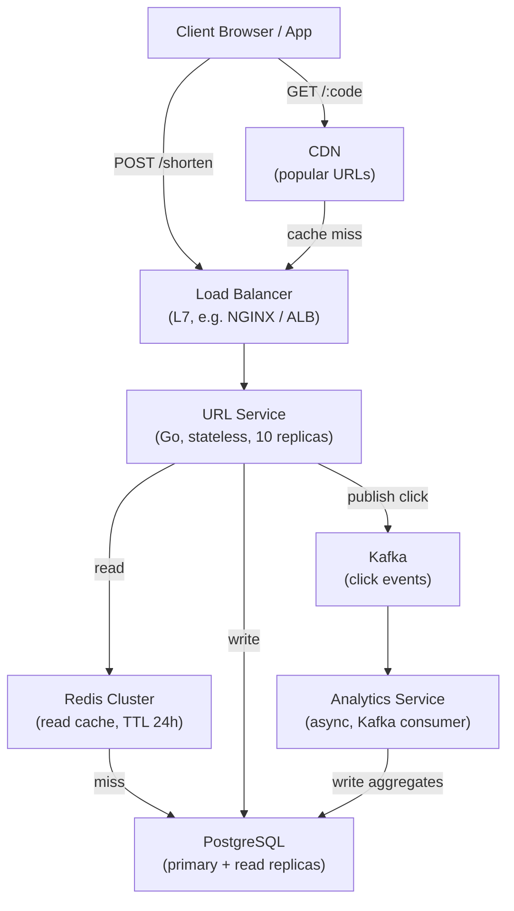
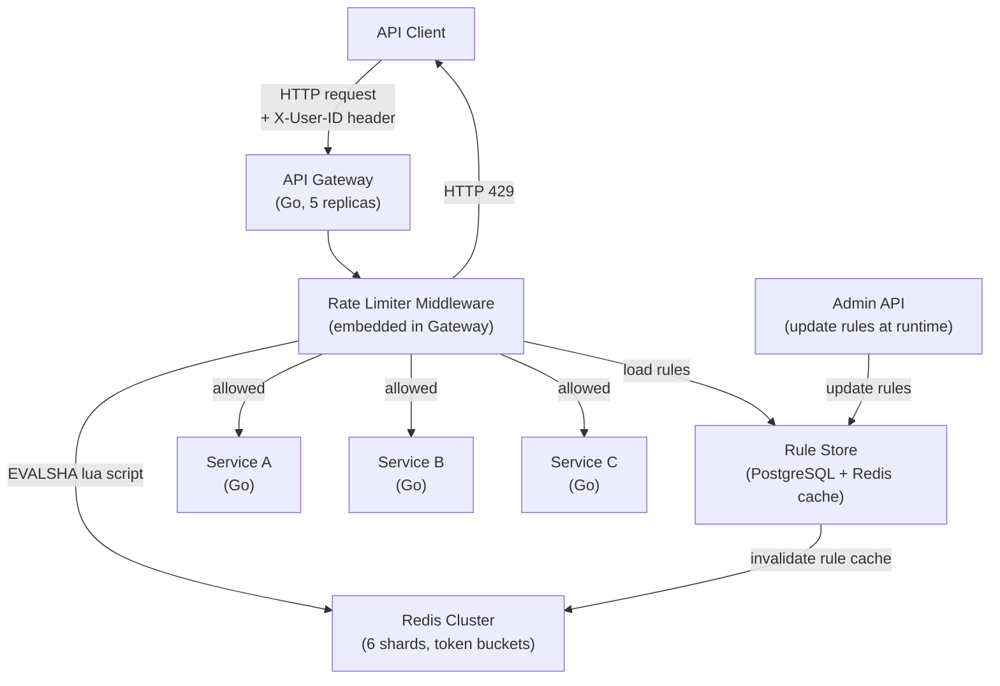
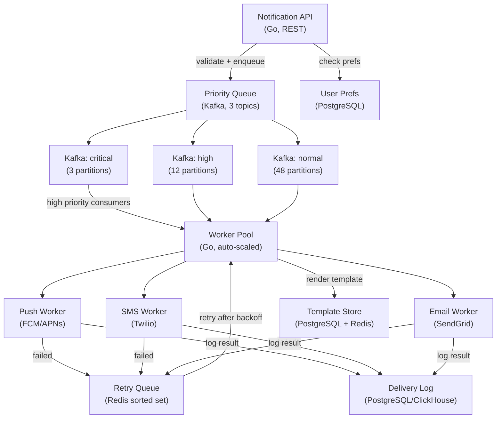
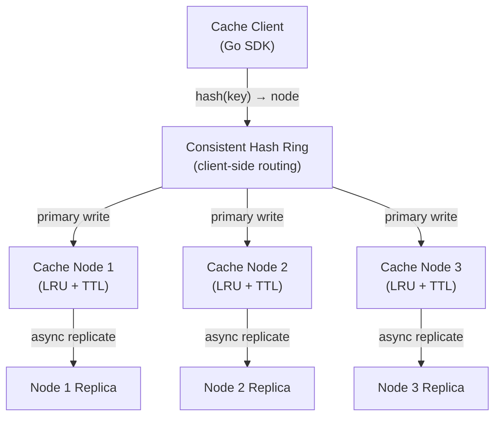
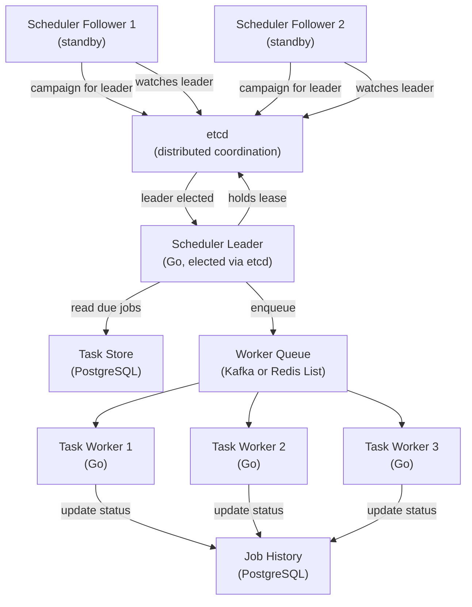

# Full System Design Case Studies for Go Developers

Every case study follows the complete 5-step interview framework used at Google, Meta, Uber, and Stripe. Each section contains production-grade Go code, capacity math, Mermaid architecture diagrams, and the follow-up questions interviewers actually ask.

---

## Why Case Studies Are the Best Way to Learn System Design

**Why:** Reading definitions of "load balancer" or "message queue" in isolation rarely sticks. System design knowledge becomes real when you watch a complete system get built end to end: a vague business requirement turns into capacity numbers, the numbers force architecture decisions, and the architecture exposes failure modes you then have to fix. Case studies compress years of production experience into a few hours of reading, because each one shows not just *what* the final design looks like, but *why* every box in the diagram exists.

**What:** This file contains five complete, interview-grade system designs — a URL shortener, a rate limiter, a notification service, a distributed cache, and a distributed task scheduler. Each one walks the full path: requirements, back-of-envelope math, a high-level architecture diagram, deep dives with real Go code, and an honest analysis of what breaks at scale. Nothing is hand-waved: you get SQL schemas, Redis Lua scripts, Kafka partition counts, and runnable Go implementations.

**Industry context:** These five problems are the most frequently asked system design questions at Google, Meta, Amazon, Uber, Stripe, and virtually every backend-heavy startup. They are popular precisely because each one tests several fundamentals at once — caching, sharding, queues, consistency, fault tolerance — in a single 45-minute conversation. If you can confidently design these five systems, you can recombine their building blocks to handle almost any system design question, because most real-world systems (feeds, payments, chat, search) are made from the same parts.

### How to Read This File for Maximum Benefit

1. **Read the requirements section first, then stop.** Cover the rest of the case study and ask yourself: "How would I design this?" Sketch your own boxes and arrows on paper.
2. **Attempt your own capacity math.** Even rough numbers (requests per second, storage per year) change which design is correct.
3. **Only then read the provided design and compare.** The gaps between your design and this one are exactly what you need to study.
4. **Trace every diagram with your finger.** Each diagram in this file comes with a step-by-step reading guide that follows one real request through the system. Do not skip these — being able to narrate a request's journey out loud is precisely what interviewers grade you on.
5. **Type out the Go code.** Reading code teaches recognition; typing it teaches recall.

### A Few Terms Before You Start (Beginner Glossary)

- **RPS (requests per second):** how many requests hit the system every second. The single most important scaling number.
- **p99 latency:** the response time that 99% of requests beat. "p99 under 100ms" means only the slowest 1% of requests take longer than 100ms.
- **Cache:** a small, very fast store (usually in memory, like Redis) that keeps copies of frequently read data so you do not hit the slower database every time.
- **Load balancer:** a traffic cop that spreads incoming requests across many identical servers so no single server is overwhelmed.
- **Read replica:** a read-only copy of the database. Writes go to one primary; reads can be spread across many replicas.
- **Message queue (Kafka):** a durable buffer between services. A producer drops a message in; a consumer picks it up later, at its own pace. This decouples fast work from slow work.
- **TTL (time to live):** an expiry timer on cached data; after the TTL, the entry is deleted automatically.
- **Idempotent:** an operation that is safe to run twice with the same effect as running it once. Critical whenever retries exist.

### How These Map to Real Interviews

A typical 45-minute system design interview follows the same 5 steps used in every case study below. Interviewers expect you to drive the conversation through them in order, spending roughly 5 minutes on requirements, 5 on estimation, 15 on high-level design, 15 on deep dives, and 5 on bottlenecks. The "Interviewer Follow-up Questions" at the end of each case study are real follow-ups — practice answering them out loud.

---

## How to Use This File

The framework used in every case study below:

1. **Requirements Clarification** — What you ask the interviewer, what you confirm
2. **Capacity Estimation** — Back-of-envelope math (never skip this)
3. **High-Level Design** — Architecture diagram + component list
4. **Component Deep Dive** — Code, schemas, algorithms
5. **Bottlenecks and Scale** — What breaks, how to fix it

---

## Case Study 1: Design a URL Shortener (bit.ly Clone)

### Why This Problem Appears in Interviews

A URL shortener is a canonical system design problem because it touches: ID generation at scale, read-heavy caching, database indexing, CDN usage, and analytics pipelines — all in a single system.

### The Problem in Plain Words

You paste a long, ugly link like `https://example.com/products/2026/summer-sale?ref=email&id=8842` into a website, and it gives you back a tiny one like `https://short.ly/aZ3kB91`. When anyone clicks the tiny link, the service looks up the original long URL and instantly forwards (redirects) the browser to it. That is the entire product. The challenge is doing this lookup billions of times per day, in under 100 milliseconds, without ever losing a mapping. Creating short links is rare; clicking them is constant — so this is an extremely **read-heavy** system, and that single fact drives almost every design decision below.

---

### Step 1: Requirements Clarification

**Questions you ask the interviewer:**

| Question | Why You Ask |
|---|---|
| "What is the expected URL length after shortening?" | Determines ID space and encoding scheme |
| "Do shortened URLs expire?" | Affects storage estimates and TTL strategy |
| "Do we need custom aliases (e.g. bit.ly/my-brand)?" | Adds write complexity and conflict resolution |
| "Do we need analytics (click counts, geo, device)?" | Changes the write path significantly |
| "What is the read/write ratio?" | Determines caching strategy |
| "Global or single region?" | Changes replication and CDN requirements |

**Confirmed Non-Functional Requirements:**

- 100M URLs stored total
- 10B redirects per day
- p99 redirect latency under 100ms
- 99.99% uptime (52 minutes downtime/year)
- URLs do not expire by default (configurable)

---

### Step 2: Capacity Estimation

**Write path (URL creation):**

```
Assume 100M total URLs created over 5 years
= 100,000,000 / (5 × 365 × 86,400)
= 100,000,000 / 157,680,000
≈ 0.63 writes/sec
Peak: 10× = ~6 writes/sec
```

**Read path (redirects):**

```
10B redirects/day
= 10,000,000,000 / 86,400
≈ 115,741 redirects/sec
Peak: 3× = ~350,000 redirects/sec
```

**Storage:**

```
Per URL record: 500 bytes (original URL 400 + short code 10 + metadata 90)
100M records × 500 bytes = 50 GB
Analytics: ~200 bytes/click × 10B/day × 365 = ~730 TB/year (store aggregated, not raw)
```

**Bandwidth:**

```
Read: 350,000 req/sec × 500 bytes = 175 MB/s outbound
Write: 6 req/sec × 500 bytes = negligible
```

**Summary Table:**

| Metric | Value |
|---|---|
| Write RPS (peak) | 6/sec |
| Read RPS (peak) | 350,000/sec |
| Storage (URLs) | 50 GB |
| Bandwidth (read) | 175 MB/s |
| Cache hit target | 99%+ |

---

### Step 3: High-Level Design

#### How We Get to This Design (Step by Step)

Do not memorize the final diagram — build it. Here is how each component earns its place:

1. **Start with one server and one database table.** A single Go server with a `urls` table (`short_code → long_url`) handles the whole product. This works perfectly at small scale.
2. **The math kills the single server.** Step 2 showed ~350,000 redirects/sec at peak. One database cannot serve 350K `SELECT`s per second. But 99% of those lookups are for the same popular URLs — a textbook caching opportunity. **Add Redis** in front of the database so most lookups never touch PostgreSQL.
3. **One Go server is still a bottleneck and a single point of failure.** The service holds no state (every request is independent), so we run 10 identical replicas and put a **load balancer** in front to spread traffic.
4. **The database is read-heavy too.** Even at a 99% cache hit rate, 1% of 350K/sec is 3,500 queries/sec. **Add read replicas** so redirects read from copies while the rare writes go to the primary.
5. **The hottest URLs do not even need to reach us.** A viral link gets millions of identical clicks. A **CDN** can cache the redirect response at edge servers around the world and answer in under 5ms.
6. **Counting clicks must not slow down redirects.** Writing analytics to the database on every click would melt it. Instead the service drops a tiny event into **Kafka** and responds immediately; a separate **Analytics Service** consumes the events later and writes hourly aggregates.

The diagram below shows the finished system with all six of those decisions in place. Solid arrows show the direction requests and data flow.



**How to read this diagram:**

1. A user clicks a short link (`GET /:code`). The request first hits the CDN; if the CDN already has the redirect cached, the user is forwarded immediately and nothing else in the diagram is touched.
2. On a CDN miss, the request goes to the Load Balancer, which picks one of the 10 stateless URL Service replicas.
3. The URL Service asks Redis for the long URL. About 99% of the time Redis has it (cache hit) and the user is redirected in a few milliseconds.
4. On a Redis miss, the service queries a PostgreSQL read replica, stores the result back into Redis with a 24-hour TTL, then redirects the user.
5. In parallel (asynchronously, so the user never waits), the service publishes a "click" event to Kafka.
6. The Analytics Service consumes Kafka events at its own pace and writes hourly aggregate counts back to PostgreSQL.
7. The rare write path — someone creating a new short URL (`POST /shorten`) — skips the CDN, goes through the Load Balancer to the URL Service, and inserts directly into the PostgreSQL primary.

**Component Responsibilities:**

| Component | Role | Tech Choice |
|---|---|---|
| Load Balancer | L7 routing, SSL termination | NGINX or AWS ALB |
| URL Service | Shorten + redirect logic | Go (stateless) |
| Redis | Short-code → long-URL cache | Redis Cluster (6 shards) |
| PostgreSQL | Source of truth for URL mappings | Primary + 3 read replicas |
| Kafka | Async click event stream | 12 partitions |
| Analytics Service | Aggregation, dashboards | Go consumer |
| CDN | Edge cache for popular URLs | CloudFront / Fastly |

---

### Step 4: Component Deep Dive

#### URL Encoding: Base62

Base62 uses `[0-9A-Za-z]` — 62 characters. A 7-character code gives 62^7 = 3.5 trillion combinations, more than enough.

```go
package shortener

const base62Chars = "0123456789ABCDEFGHIJKLMNOPQRSTUVWXYZabcdefghijklmnopqrstuvwxyz"

// Encode converts a numeric ID to a base62 string.
// Example: 125 → "CB"
func Encode(id uint64) string {
    if id == 0 {
        return string(base62Chars[0])
    }
    result := make([]byte, 0, 8)
    for id > 0 {
        result = append(result, base62Chars[id%62])
        id /= 62
    }
    // reverse
    for i, j := 0, len(result)-1; i < j; i, j = i+1, j-1 {
        result[i], result[j] = result[j], result[i]
    }
    return string(result)
}

// Decode converts a base62 string back to a numeric ID.
func Decode(code string) uint64 {
    var id uint64
    for _, c := range code {
        id = id*62 + uint64(charIndex(byte(c)))
    }
    return id
}

func charIndex(c byte) int {
    switch {
    case c >= '0' && c <= '9':
        return int(c - '0')
    case c >= 'A' && c <= 'Z':
        return int(c-'A') + 10
    case c >= 'a' && c <= 'z':
        return int(c-'a') + 36
    default:
        return -1
    }
}
```

#### Redirect HTTP Handler with Redis Cache

```go
package handlers

import (
    "context"
    "net/http"
    "time"

    "github.com/go-redis/redis/v8"
)

type RedirectHandler struct {
    redis *redis.Client
    store URLStore // interface over PostgreSQL
}

// ServeHTTP handles GET /:code and redirects to the original URL.
// Cache-aside: check Redis first, fall back to DB on miss.
func (h *RedirectHandler) ServeHTTP(w http.ResponseWriter, r *http.Request) {
    code := r.URL.Path[1:] // strip leading "/"
    if code == "" || len(code) > 10 {
        http.NotFound(w, r)
        return
    }

    ctx, cancel := context.WithTimeout(r.Context(), 80*time.Millisecond)
    defer cancel()

    // 1. Check Redis cache
    longURL, err := h.redis.Get(ctx, "url:"+code).Result()
    if err == nil {
        // cache hit — respond immediately
        http.Redirect(w, r, longURL, http.StatusMovedPermanently)
        go h.publishClick(code, r) // async analytics
        return
    }

    // 2. Cache miss — query database
    longURL, err = h.store.GetByCode(ctx, code)
    if err != nil {
        http.NotFound(w, r)
        return
    }

    // 3. Populate cache with 24h TTL
    h.redis.SetEX(ctx, "url:"+code, longURL, 24*time.Hour)

    http.Redirect(w, r, longURL, http.StatusMovedPermanently)
    go h.publishClick(code, r)
}

func (h *RedirectHandler) publishClick(code string, r *http.Request) {
    // publish to Kafka for async analytics processing
}
```

#### Database Schema

```sql
CREATE TABLE urls (
    id          BIGSERIAL PRIMARY KEY,
    short_code  VARCHAR(10)  NOT NULL UNIQUE,
    long_url    TEXT         NOT NULL,
    user_id     BIGINT,
    created_at  TIMESTAMPTZ  NOT NULL DEFAULT NOW(),
    expires_at  TIMESTAMPTZ,
    click_count BIGINT       NOT NULL DEFAULT 0
);

-- Primary lookup: short_code → long_url (used on every redirect)
CREATE UNIQUE INDEX idx_urls_short_code ON urls(short_code);

-- For user dashboards listing their URLs
CREATE INDEX idx_urls_user_id ON urls(user_id) WHERE user_id IS NOT NULL;

-- For expiry cleanup job
CREATE INDEX idx_urls_expires_at ON urls(expires_at) WHERE expires_at IS NOT NULL;

CREATE TABLE analytics_hourly (
    short_code  VARCHAR(10)  NOT NULL,
    hour        TIMESTAMPTZ  NOT NULL,
    click_count BIGINT       NOT NULL DEFAULT 0,
    PRIMARY KEY (short_code, hour)
);
```

#### Cache Strategy: Cache-Aside with SETEX

```
On redirect request:
  1. GET url:{code} from Redis
  2. If HIT → redirect, publish click event async
  3. If MISS → SELECT from PostgreSQL read replica
  4. SETEX url:{code} 86400 {long_url}   ← 24h TTL
  5. Redirect, publish click event async

On URL creation:
  - Write to PostgreSQL primary
  - Do NOT pre-warm cache (lazy loading is fine here)

On URL update/deletion:
  - Write to PostgreSQL primary
  - DEL url:{code} from Redis (invalidate)
```

---

### Step 5: Bottlenecks and Scale

**What breaks at 1B redirects/day:**

| Bottleneck | Symptoms | Fix |
|---|---|---|
| Single Redis node | OOM, single point of failure | Redis Cluster (6 shards) |
| Single PostgreSQL | Read replica lag, connection pool exhaustion | 3 read replicas + PgBouncer |
| URL Service pods | CPU saturation | Horizontal autoscaling (HPA in K8s) |
| Analytics writes | Slows redirect path | Decouple to Kafka → async consumer |
| Hot URLs | 80% traffic to 20% URLs, thundering herd on cache miss | CDN caching + cache warming |

**Database read replica for redirects:**

Redirect queries are `SELECT long_url FROM urls WHERE short_code = $1` — read-only, perfectly suited for read replicas. The URL service connects to a replica pool (via PgBouncer) for all GET operations. Writes (shorten) go to primary only.

**CDN for popular URLs:**

Top 0.1% of URLs generate ~50% of traffic. These can be cached at CDN edge nodes:

```
Response headers on redirect:
  Cache-Control: public, max-age=3600
  Vary: Accept-Encoding

CDN caches the 301/302 response. Edge nodes serve redirects with <5ms latency globally.
```

**Geographic distribution:**

```
US-East  ──┐
US-West  ──┼── Global LB (GeoDNS) ── Route to nearest region
EU-West  ──┤
AP-SE    ──┘

Each region: 2 URL Service pods + 1 Redis + 1 PG read replica
Single global primary PostgreSQL (US-East) for writes
```

---

### Full Go Implementation: URL Shortener Service

```go
package main

import (
    "context"
    "database/sql"
    "fmt"
    "log"
    "net/http"
    "sync/atomic"
    "time"

    "github.com/go-redis/redis/v8"
    _ "github.com/lib/pq"
)

// --- ID Generation (Snowflake-like) ---
// Format: [41 bits timestamp | 10 bits machine ID | 12 bits sequence]

type IDGenerator struct {
    machineID  uint64
    sequence   uint64
    lastMillis uint64
}

func NewIDGenerator(machineID uint64) *IDGenerator {
    return &IDGenerator{machineID: machineID & 0x3FF} // 10 bits
}

func (g *IDGenerator) NextID() uint64 {
    now := uint64(time.Now().UnixMilli())
    seq := atomic.AddUint64(&g.sequence, 1) & 0xFFF // 12 bits
    return (now << 22) | (g.machineID << 12) | seq
}

// --- Base62 Encoding ---

const base62 = "0123456789ABCDEFGHIJKLMNOPQRSTUVWXYZabcdefghijklmnopqrstuvwxyz"

func encode(id uint64) string {
    buf := make([]byte, 0, 8)
    for id > 0 {
        buf = append(buf, base62[id%62])
        id /= 62
    }
    for i, j := 0, len(buf)-1; i < j; i, j = i+1, j-1 {
        buf[i], buf[j] = buf[j], buf[i]
    }
    return string(buf)
}

// --- Service ---

type URLService struct {
    db    *sql.DB
    rdb   *redis.Client
    idGen *IDGenerator
}

func (s *URLService) Shorten(ctx context.Context, longURL string) (string, error) {
    id := s.idGen.NextID()
    code := encode(id)

    _, err := s.db.ExecContext(ctx,
        `INSERT INTO urls (id, short_code, long_url) VALUES ($1, $2, $3)`,
        id, code, longURL,
    )
    if err != nil {
        return "", fmt.Errorf("insert url: %w", err)
    }
    return code, nil
}

func (s *URLService) Resolve(ctx context.Context, code string) (string, error) {
    // Cache-aside
    val, err := s.rdb.Get(ctx, "url:"+code).Result()
    if err == nil {
        return val, nil
    }

    var longURL string
    err = s.db.QueryRowContext(ctx,
        `SELECT long_url FROM urls WHERE short_code = $1`, code,
    ).Scan(&longURL)
    if err != nil {
        return "", fmt.Errorf("url not found: %w", err)
    }

    s.rdb.SetEX(ctx, "url:"+code, longURL, 24*time.Hour)
    return longURL, nil
}

// --- HTTP Handlers ---

func (s *URLService) handleShorten(w http.ResponseWriter, r *http.Request) {
    if r.Method != http.MethodPost {
        http.Error(w, "method not allowed", http.StatusMethodNotAllowed)
        return
    }
    longURL := r.FormValue("url")
    if longURL == "" {
        http.Error(w, "url is required", http.StatusBadRequest)
        return
    }
    ctx, cancel := context.WithTimeout(r.Context(), 500*time.Millisecond)
    defer cancel()

    code, err := s.Shorten(ctx, longURL)
    if err != nil {
        http.Error(w, "internal error", http.StatusInternalServerError)
        return
    }
    fmt.Fprintf(w, "https://short.ly/%s\n", code)
}

func (s *URLService) handleRedirect(w http.ResponseWriter, r *http.Request) {
    code := r.URL.Path[1:]
    ctx, cancel := context.WithTimeout(r.Context(), 80*time.Millisecond)
    defer cancel()

    longURL, err := s.Resolve(ctx, code)
    if err != nil {
        http.NotFound(w, r)
        return
    }
    http.Redirect(w, r, longURL, http.StatusMovedPermanently)
}

func main() {
    db, _ := sql.Open("postgres", "postgres://localhost/shortener?sslmode=disable")
    rdb := redis.NewClient(&redis.Options{Addr: "localhost:6379"})
    svc := &URLService{db: db, rdb: rdb, idGen: NewIDGenerator(1)}

    http.HandleFunc("/shorten", svc.handleShorten)
    http.HandleFunc("/", svc.handleRedirect)

    log.Println("URL shortener listening on :8080")
    log.Fatal(http.ListenAndServe(":8080", nil))
}
```

---

### Interviewer Follow-up Questions (URL Shortener)

**Q1: How do you prevent duplicate long URLs from getting multiple short codes?**

Add a `UNIQUE INDEX` on `long_url` (or a hash of it for long URLs). On insert, use `ON CONFLICT (long_url) DO NOTHING RETURNING short_code` to return the existing code. For very long URLs, store a SHA-256 hash as the lookup key.

**Q2: How do you handle custom aliases (e.g. bit.ly/black-friday)?**

Add an `alias` column to the `urls` table. On creation, if an alias is provided, use it as `short_code` directly and insert — the `UNIQUE` constraint prevents collisions. Aliases bypass the ID generator.

**Q3: What happens if two service instances generate the same short code simultaneously?**

The Snowflake ID generator is machine-ID-specific, so two different pods with different machine IDs will never produce the same ID. The `UNIQUE` constraint on `short_code` is a safety net that causes one insert to fail, which the service retries with a new ID.

**Q4: How do you implement URL expiry?**

Store `expires_at TIMESTAMPTZ` in the `urls` table. On redirect, check `WHERE short_code = $1 AND (expires_at IS NULL OR expires_at > NOW())`. A background job runs every hour to delete expired rows. Redis TTL should match `expires_at`.

**Q5: How would you rate-limit URL creation per user?**

Use Redis with a sliding window counter: `INCR user:ratelimit:{user_id}:{minute}` with a 60-second TTL. Reject if count exceeds threshold. This is exactly Case Study 2 below.

**Q6: How do you count clicks accurately at 10B/day without slowing redirects?**

Never update `click_count` synchronously on redirect. Instead, publish a click event to Kafka. A consumer reads Kafka, batches events, and writes aggregates to `analytics_hourly`. The `click_count` column in `urls` is refreshed hourly from aggregates.

**Q7: What if Redis goes down?**

With proper circuit breakers, the service falls back directly to PostgreSQL read replicas. Latency increases but the service stays available. Once Redis recovers, the cache self-populates via cache-aside.

**Q8: How do you prevent abuse (someone shortening malicious URLs)?**

Maintain a blocklist of known-malicious domains in Redis (a `SET`). Before inserting, check `SISMEMBER blocklist {domain}`. Integrate with Safe Browsing API asynchronously. Flag URLs for review if they match patterns.

**Q9: How would you design an analytics dashboard showing clicks per country?**

Include IP-to-country lookup (MaxMind GeoIP) in the click event. Kafka consumer writes to `analytics_geo (short_code, country, hour, count)`. Dashboard queries this table. For real-time, use Redis sorted sets: `ZINCRBY clicks:geo:{code} 1 {country}`.

**Q10: How do you handle the thundering herd problem when a viral URL causes a cache miss storm?**

Use a distributed lock (Redis `SET url:lock:{code} 1 NX EX 5`). Only one goroutine fetches from DB; others wait. Alternatively, use probabilistic early expiration: slightly before TTL expires, one request refreshes the cache while others still use the cached value.

---

---

## Case Study 2: Design a Rate Limiter

### Why This Problem Appears in Interviews

A rate limiter is an infrastructure primitive found in every API gateway, microservice mesh, and payment processor. It tests your understanding of distributed consistency, atomic operations, and algorithm trade-offs.

### The Problem in Plain Words

Imagine your API is a club with a bouncer. Without one, a single misbehaving user (or a bot, or a buggy script stuck in a loop) can flood you with thousands of requests per second and slow everyone else down — or run up a huge cloud bill. A rate limiter is that bouncer: it counts how many requests each user has made recently and, once they exceed their allowance (say, 100 requests per minute), it politely turns away further requests with an HTTP `429 Too Many Requests` response telling them when to come back. The two hard parts are: (1) the counting must add almost zero delay (under 1 millisecond) to every single request, and (2) when your API runs on many servers at once, they all need to agree on the count — a user should not get 10x the limit just because there are 10 servers.

---

### Requirements and Scale

**Functional:**
- Limit requests per user, per service, per endpoint
- Support multiple limit types: per-second, per-minute, per-hour
- Return HTTP 429 with `Retry-After` header when limited
- Allow burst traffic up to a configurable multiplier

**Non-Functional:**
- 10K services behind the rate limiter
- 1B requests/day total
- Less than 1ms overhead added to each request
- Distributed (multiple rate limiter instances must agree)
- Rules changeable at runtime without restart

**Capacity:**
```
1B requests/day = 11,574 req/sec average
Peak (10×): ~115,740 req/sec
Redis operations per request: 2 (GET + SET or EVALSHA)
Peak Redis ops/sec: ~230,000 — well within Redis capacity (1M ops/sec)
```

---

### Algorithms Comparison

| Algorithm | Allows Burst | Memory/User | Distributed | Accuracy | Best For |
|---|---|---|---|---|---|
| Fixed Window | Yes (edge burst) | O(1) | Easy | Low | Simple APIs |
| Sliding Window Log | No | O(requests) | Medium | High | Audit logs |
| Sliding Window Counter | Partial | O(1) | Easy | Medium | General APIs |
| Token Bucket | Yes (controlled) | O(1) | Medium | High | APIs with bursts |
| Leaky Bucket | No (smooths) | O(queue) | Hard | High | Smooth output rate |

**Winner for most cases: Token Bucket** — allows legitimate bursts, O(1) memory, and maps naturally to Redis with atomic Lua scripts.

---

### Full Go Implementation: Token Bucket (In-Process)

```go
package ratelimit

import (
    "sync"
    "time"
)

// TokenBucket implements a per-key token bucket rate limiter.
// Thread-safe for concurrent use.
type TokenBucket struct {
    mu       sync.Mutex
    buckets  map[string]*bucket
    rate     float64 // tokens added per second
    capacity float64 // maximum tokens
}

type bucket struct {
    tokens    float64
    lastRefil time.Time
}

func NewTokenBucket(ratePerSec, capacity float64) *TokenBucket {
    return &TokenBucket{
        buckets:  make(map[string]*bucket),
        rate:     ratePerSec,
        capacity: capacity,
    }
}

// Allow returns true if the request for the given key is permitted.
func (tb *TokenBucket) Allow(key string) bool {
    tb.mu.Lock()
    defer tb.mu.Unlock()

    now := time.Now()
    b, ok := tb.buckets[key]
    if !ok {
        // New key: start with full bucket
        tb.buckets[key] = &bucket{tokens: tb.capacity, lastRefil: now}
        return true
    }

    // Refill tokens based on elapsed time
    elapsed := now.Sub(b.lastRefil).Seconds()
    b.tokens = min(tb.capacity, b.tokens+elapsed*tb.rate)
    b.lastRefil = now

    if b.tokens < 1 {
        return false // rate limited
    }
    b.tokens--
    return true
}

// AllowN returns true if n tokens are available.
func (tb *TokenBucket) AllowN(key string, n float64) bool {
    tb.mu.Lock()
    defer tb.mu.Unlock()

    now := time.Now()
    b, ok := tb.buckets[key]
    if !ok {
        if n <= tb.capacity {
            tb.buckets[key] = &bucket{tokens: tb.capacity - n, lastRefil: now}
            return true
        }
        return false
    }

    elapsed := now.Sub(b.lastRefil).Seconds()
    b.tokens = min(tb.capacity, b.tokens+elapsed*tb.rate)
    b.lastRefil = now

    if b.tokens < n {
        return false
    }
    b.tokens -= n
    return true
}

func min(a, b float64) float64 {
    if a < b {
        return a
    }
    return b
}
```

---

### Distributed Rate Limiter with Redis and Lua

The problem with in-process rate limiters: each service pod has its own state. With 10 pods, each pod allows 100 req/min → users can make 1000 req/min.

**Solution: centralized Redis with atomic Lua scripts.**

```go
package ratelimit

import (
    "context"
    "fmt"
    "time"

    "github.com/go-redis/redis/v8"
)

// luaTokenBucket is an atomic Lua script that runs on Redis.
// It implements token bucket refill + consume atomically.
// KEYS[1] = bucket key
// ARGV[1] = max tokens (capacity)
// ARGV[2] = refill rate (tokens/sec)
// ARGV[3] = requested tokens
// ARGV[4] = current Unix timestamp (microseconds)
// Returns: 1 if allowed, 0 if limited; and remaining tokens
var luaTokenBucket = redis.NewScript(`
local key        = KEYS[1]
local capacity   = tonumber(ARGV[1])
local rate       = tonumber(ARGV[2])
local requested  = tonumber(ARGV[3])
local now        = tonumber(ARGV[4])

local data = redis.call("HMGET", key, "tokens", "last_refill")
local tokens     = tonumber(data[1]) or capacity
local last_refill = tonumber(data[2]) or now

-- Refill tokens based on elapsed time
local elapsed = math.max(0, (now - last_refill) / 1000000)
tokens = math.min(capacity, tokens + elapsed * rate)

if tokens >= requested then
    tokens = tokens - requested
    redis.call("HMSET", key, "tokens", tokens, "last_refill", now)
    redis.call("PEXPIRE", key, math.ceil(capacity / rate) * 1000 + 1000)
    return {1, math.floor(tokens)}
else
    redis.call("HMSET", key, "tokens", tokens, "last_refill", now)
    redis.call("PEXPIRE", key, math.ceil(capacity / rate) * 1000 + 1000)
    return {0, math.floor(tokens)}
end
`)

type DistributedRateLimiter struct {
    rdb      *redis.Client
    capacity int64
    rate     float64 // tokens/sec
}

func NewDistributed(rdb *redis.Client, capacity int64, ratePerSec float64) *DistributedRateLimiter {
    return &DistributedRateLimiter{
        rdb:      rdb,
        capacity: capacity,
        rate:     ratePerSec,
    }
}

type LimitResult struct {
    Allowed   bool
    Remaining int64
    RetryAfter time.Duration
}

// Check evaluates whether the given key (e.g. "user:42:api:v1") is within limits.
func (d *DistributedRateLimiter) Check(ctx context.Context, key string, requested int64) (LimitResult, error) {
    now := time.Now().UnixMicro()
    redisKey := fmt.Sprintf("rl:%s", key)

    result, err := luaTokenBucket.Run(ctx, d.rdb,
        []string{redisKey},
        d.capacity, d.rate, requested, now,
    ).Int64Slice()

    if err != nil {
        // Fail open: allow request if Redis is unavailable
        return LimitResult{Allowed: true}, fmt.Errorf("redis error: %w", err)
    }

    allowed := result[0] == 1
    remaining := result[1]

    var retryAfter time.Duration
    if !allowed {
        // Time until 1 token refills
        retryAfter = time.Duration(float64(time.Second) / d.rate)
    }

    return LimitResult{
        Allowed:    allowed,
        Remaining:  remaining,
        RetryAfter: retryAfter,
    }, nil
}

// Middleware wraps an HTTP handler with rate limiting.
func (d *DistributedRateLimiter) Middleware(next http.Handler) http.Handler {
    return http.HandlerFunc(func(w http.ResponseWriter, r *http.Request) {
        userID := r.Header.Get("X-User-ID")
        key := fmt.Sprintf("user:%s:endpoint:%s", userID, r.URL.Path)

        res, err := d.Check(r.Context(), key, 1)
        if err != nil {
            // Fail open on Redis errors
            next.ServeHTTP(w, r)
            return
        }

        w.Header().Set("X-RateLimit-Remaining", fmt.Sprintf("%d", res.Remaining))
        w.Header().Set("X-RateLimit-Limit", fmt.Sprintf("%d", d.capacity))

        if !res.Allowed {
            w.Header().Set("Retry-After", fmt.Sprintf("%.0f", res.RetryAfter.Seconds()))
            http.Error(w, "rate limit exceeded", http.StatusTooManyRequests)
            return
        }
        next.ServeHTTP(w, r)
    })
}
```

---

### Architecture: Rate Limiter in Microservices

#### How We Get to This Design (Step by Step)

1. **Start with the in-process `TokenBucket` above inside a single Go server.** A mutex-protected map of buckets works perfectly — until you run more than one server.
2. **Multiple servers break the count.** With 10 gateway pods each keeping its own local buckets, a user limited to 100 req/min can actually make 1000 req/min by spreading requests across pods. The counts must live in **one shared place: Redis**.
3. **Shared state creates a race condition.** "Read the token count, then write it back" as two separate Redis commands lets two pods both see 1 token and both allow a request. The fix is the **Lua script**: Redis runs the entire read-refill-consume sequence atomically, so no other command can interleave.
4. **Limits must be changeable without redeploying.** Hardcoded limits mean a 3 a.m. incident requires a code release. So rules (capacity, refill rate, key patterns) live in a **Rule Store** (PostgreSQL, cached in Redis) that an **Admin API** can update at runtime.
5. **The limiter must not become the outage.** If Redis goes down, we "fail open" — let traffic through and alert — because rejecting all traffic over a broken counter is worse than briefly not counting.

The diagram below shows the result: the rate limiter lives as middleware inside the API gateway, with Redis as the shared, atomic counter store.



**How to read this diagram:**

1. A client sends an API request (with its user ID in a header) to the API Gateway, just like any normal request.
2. Before the request reaches any backend service, it passes through the Rate Limiter Middleware embedded in the gateway.
3. The middleware looks up which rule applies to this user and endpoint (rules come from the Rule Store, cached in Redis with a 30-second TTL).
4. The middleware fires one atomic Lua script call to Redis, which refills the user's token bucket based on elapsed time and tries to consume one token — all in a single uninterruptible operation.
5. If a token was available, the request is forwarded to the target backend service (A, B, or C), with `X-RateLimit-Remaining` headers attached.
6. If the bucket was empty, the gateway immediately returns HTTP 429 with a `Retry-After` header — the backend services never see the request.
7. Separately, an operator can change limits through the Admin API at any time; the Rule Store invalidates the cached rules in Redis so the new limits apply within seconds, with no restart.

**Rule Store structure:**

```sql
CREATE TABLE rate_limit_rules (
    id          SERIAL PRIMARY KEY,
    key_pattern VARCHAR(200) NOT NULL,  -- e.g. "user:*:endpoint:/api/v1/orders"
    capacity    INT NOT NULL,
    rate        FLOAT NOT NULL,         -- tokens/sec
    enabled     BOOLEAN NOT NULL DEFAULT true,
    updated_at  TIMESTAMPTZ NOT NULL DEFAULT NOW()
);
```

Rules are cached in Redis with a 30-second TTL and reloaded on change via pub/sub notification from the Admin API.

---

### Interviewer Follow-up Questions (Rate Limiter)

**Q1: What is the difference between token bucket and leaky bucket?**

Token bucket allows bursts up to the bucket capacity. If a user makes no requests for 10 seconds, they accumulate 10 seconds of tokens and can spend them all at once. Leaky bucket enforces a constant output rate — requests queue and drain at a fixed rate, smoothing traffic. Token bucket is better for APIs that want to allow legitimate bursts; leaky bucket is better for output rate control (e.g., email sending).

**Q2: How do you handle the case where Redis is down?**

Two philosophies: "fail open" (allow all requests) or "fail closed" (reject all). For most APIs, fail open is correct — you'd rather serve extra traffic than take an outage. Implement with a circuit breaker: if Redis error rate exceeds a threshold, bypass rate limiting entirely and alert.

**Q3: How do you rate limit across multiple dimensions simultaneously?**

Run multiple checks: per-user, per-IP, per-endpoint, per-service. The request is allowed only if ALL checks pass. Use goroutines with `errgroup` to run Redis checks in parallel to stay under the 1ms budget.

**Q4: What is the fixed window edge burst problem?**

With a fixed window (e.g., 100 requests per minute), a user can make 100 requests at 11:59:59 and 100 more at 12:00:01 — 200 requests in 2 seconds. Sliding window counters fix this by weighting the previous window's count based on overlap with the current window.

**Q5: How do you implement per-plan rate limits (free: 100/min, paid: 1000/min)?**

Look up the user's plan from a Redis hash (`HGET user:plan:{user_id} tier`) on first request, cache it locally with a 5-minute TTL. Use the plan tier to select the appropriate capacity and rate from a configuration map.

**Q6: How would you rate limit at the network layer instead of application layer?**

Use iptables/nftables for IP-level limiting, or deploy Envoy/Istio with ext_authz calling a rate limit service (Lyft's ratelimit or Envoy's built-in). This moves limiting before the application processes the request.

**Q7: How do you test a distributed rate limiter for correctness?**

Run N goroutines simultaneously hitting the same key. The total allowed count must equal exactly `capacity` (for a one-shot burst test). Use `sync.WaitGroup` + atomic counters. Also test: correct `Retry-After` header, correct remaining count, behavior on Redis failure.

**Q8: How do you implement different limits for authenticated vs anonymous users?**

Use different key namespaces: `anon:{ip}` vs `user:{user_id}`. Unauthenticated traffic uses IP-based keys with stricter limits (e.g., 10 req/min). Authenticated traffic uses user ID keys with plan-based limits.

**Q9: How would you implement a "global rate limit" across all users for a shared resource?**

Use a single Redis key for the global limit, separate from per-user keys. Both per-user and global checks must pass. The global key uses a higher capacity (e.g., 100K req/min total) to protect the downstream service.

**Q10: How do you handle time drift between distributed nodes affecting the rate limiter?**

The Lua script uses the timestamp passed as an argument (ARGV[4]), not Redis's own clock. This means the clock is the calling application server's clock. For correctness in a distributed system, use NTP-synchronized clocks (drift under 1ms is acceptable for second-level rate limiting). For millisecond precision, use Redis's `TIME` command inside the Lua script to get Redis's own clock.

---

---

## Case Study 3: Design a Notification Service

### Why This Problem Appears in Interviews

A notification service spans multiple systems (push, SMS, email), requires priority queuing, retry logic, template rendering, and delivery guarantees — exactly the properties that expose system design skill.

### The Problem in Plain Words

Every app you use sends you messages: a push notification when your order ships, an SMS with a login code (OTP), an email with a receipt. Behind the scenes, one central "notification service" usually handles all of it for the whole company. Other teams call it with "send user 42 the order-shipped message" and it figures out the rest: which channel to use, whether the user opted out, what the message text should say, and how to actually deliver it through outside providers like Apple/Google (push), Twilio (SMS), or SendGrid (email). The hard parts: some messages are urgent (an OTP is useless after 5 minutes) while others can wait (a promotion), the outside providers each cap how fast you may send, and providers fail randomly — so you need priorities, per-provider speed limits, and automatic retries that never let a critical message silently disappear.

---

### Requirements

**Functional:**
- Send push notifications (APNs/FCM), SMS (Twilio), and email (SendGrid)
- Priority levels: critical (OTP, alerts) > high (order updates) > normal (promotions)
- Template engine: parameterized messages per channel
- Delivery guarantees: at-least-once for critical, best-effort for promotional
- Per-user notification preferences (opt-out per channel/category)

**Non-Functional:**
- 10M active users
- Peak: 5M notifications in 1 hour (e.g., flash sale launch)
- Critical notifications delivered in under 5 seconds
- Email delivery under 30 seconds
- Provider rate limits: FCM 600K/min, Twilio 100/sec, SendGrid 600/min

---

### Architecture

#### How We Get to This Design (Step by Step)

1. **Start naive: an API that calls Twilio/SendGrid directly.** A single Go endpoint that synchronously calls the provider works for 10 notifications a minute. But the caller now waits seconds for slow providers, and a flash sale sending 5M notifications in an hour would require sustained provider throughput we simply do not control.
2. **Decouple accepting from sending: add a queue.** The API's only job becomes "validate, check user preferences, drop the message into Kafka, return 202 Accepted." Sending happens later, at whatever pace the providers allow. Kafka also survives restarts, so accepted messages are never lost.
3. **One queue is not enough: priorities.** If 5M promotional messages are queued ahead of an OTP, the OTP arrives an hour late. So we use **three Kafka topics — critical, high, normal** — and dedicate always-available consumers to the critical topic.
4. **Workers do the actual sending.** A pool of Go goroutines pulls from the topics, renders the message text from stored templates, and hands it to a channel-specific sender (push, SMS, email). Each sender is wrapped in a per-provider rate limiter so we never exceed FCM/Twilio/SendGrid caps.
5. **Failures are normal: add a retry queue.** Providers time out and bounce. Failed sends go into a Redis sorted set scored by "retry me at this time," with exponential backoff (1s, 2s, 4s...). After max retries, the message is dead-lettered and logged.
6. **Everything is recorded.** Every attempt writes to a Delivery Log so support can answer "did user 42 get their OTP?" and dashboards can track provider health.

The diagram below shows the full pipeline, left to right: accept, prioritize, send, retry, log.



**How to read this diagram:**

1. Another service (say, the orders service) calls the Notification API: "send user 42 the order-shipped push notification."
2. The API checks the User Prefs database — if user 42 opted out of this category, the request stops here.
3. The API publishes the message to the Kafka topic matching its priority (an OTP goes to `critical`, a promotion to `normal`) and immediately returns 202 Accepted to the caller.
4. A worker in the auto-scaled Worker Pool consumes the message, fetches the template ("Your order {{.id}} has shipped"), and fills in the parameters.
5. The worker hands the rendered message to the channel-specific sender — here the Push Worker — which calls FCM/APNs, respecting that provider's rate limit.
6. If the provider call succeeds, the result is written to the Delivery Log and we are done.
7. If it fails, the message goes to the Retry Queue (a Redis sorted set scored by next-retry time); a poller re-injects it after the backoff delay, and after 5 failed attempts it is dead-lettered and logged as failed.

---

### Component Design

#### Priority Queue with Go Heap

```go
package notification

import "container/heap"

type Priority int

const (
    PriorityNormal   Priority = 0
    PriorityHigh     Priority = 1
    PriorityCritical Priority = 2
)

type Notification struct {
    ID        string
    UserID    string
    Channel   string // "push", "sms", "email"
    Template  string
    Params    map[string]string
    Priority  Priority
    CreatedAt int64 // Unix nanoseconds for ordering within priority
}

// notifHeap implements heap.Interface for min-heap by priority (higher = first).
type notifHeap []*Notification

func (h notifHeap) Len() int { return len(h) }

func (h notifHeap) Less(i, j int) bool {
    if h[i].Priority != h[j].Priority {
        return h[i].Priority > h[j].Priority // higher priority first
    }
    return h[i].CreatedAt < h[j].CreatedAt // FIFO within same priority
}

func (h notifHeap) Swap(i, j int) { h[i], h[j] = h[j], h[i] }

func (h *notifHeap) Push(x any) {
    *h = append(*h, x.(*Notification))
}

func (h *notifHeap) Pop() any {
    old := *h
    n := len(old)
    item := old[n-1]
    old[n-1] = nil
    *h = old[:n-1]
    return item
}

// PriorityQueue wraps the heap with a mutex for concurrent access.
type PriorityQueue struct {
    mu   sync.Mutex
    heap notifHeap
    cond *sync.Cond
}

func NewPriorityQueue() *PriorityQueue {
    pq := &PriorityQueue{}
    pq.cond = sync.NewCond(&pq.mu)
    heap.Init(&pq.heap)
    return pq
}

func (pq *PriorityQueue) Push(n *Notification) {
    pq.mu.Lock()
    heap.Push(&pq.heap, n)
    pq.cond.Signal()
    pq.mu.Unlock()
}

func (pq *PriorityQueue) Pop() *Notification {
    pq.mu.Lock()
    defer pq.mu.Unlock()
    for pq.heap.Len() == 0 {
        pq.cond.Wait()
    }
    return heap.Pop(&pq.heap).(*Notification)
}
```

#### Worker Pool with Bounded Concurrency

```go
package notification

import (
    "context"
    "log"
    "sync"
)

// WorkerPool dispatches notifications to channel-specific senders.
type WorkerPool struct {
    workers   int
    queue     *PriorityQueue
    senders   map[string]Sender // "push", "sms", "email"
    wg        sync.WaitGroup
    retryQ    *RetryQueue
}

type Sender interface {
    Send(ctx context.Context, n *Notification) error
}

func NewWorkerPool(workers int, queue *PriorityQueue, senders map[string]Sender, retryQ *RetryQueue) *WorkerPool {
    return &WorkerPool{
        workers:  workers,
        queue:    queue,
        senders:  senders,
        retryQ:   retryQ,
    }
}

func (wp *WorkerPool) Start(ctx context.Context) {
    for i := 0; i < wp.workers; i++ {
        wp.wg.Add(1)
        go wp.runWorker(ctx, i)
    }
}

func (wp *WorkerPool) Wait() {
    wp.wg.Wait()
}

func (wp *WorkerPool) runWorker(ctx context.Context, id int) {
    defer wp.wg.Done()
    for {
        select {
        case <-ctx.Done():
            return
        default:
        }

        notif := wp.queue.Pop()
        sender, ok := wp.senders[notif.Channel]
        if !ok {
            log.Printf("worker %d: unknown channel %s", id, notif.Channel)
            continue
        }

        if err := sender.Send(ctx, notif); err != nil {
            log.Printf("worker %d: send failed for %s: %v", id, notif.ID, err)
            wp.retryQ.Enqueue(notif)
            continue
        }
        log.Printf("worker %d: delivered %s via %s", id, notif.ID, notif.Channel)
    }
}
```

#### Template Engine

```go
package notification

import (
    "bytes"
    "fmt"
    "text/template"
)

// TemplateEngine renders notification messages from stored templates.
type TemplateEngine struct {
    cache map[string]*template.Template
    mu    sync.RWMutex
    store TemplateStore
}

func (te *TemplateEngine) Render(templateID string, params map[string]string) (string, error) {
    te.mu.RLock()
    tmpl, ok := te.cache[templateID]
    te.mu.RUnlock()

    if !ok {
        raw, err := te.store.Get(templateID)
        if err != nil {
            return "", fmt.Errorf("template not found: %s", templateID)
        }
        tmpl, err = template.New(templateID).Parse(raw)
        if err != nil {
            return "", fmt.Errorf("template parse error: %w", err)
        }
        te.mu.Lock()
        te.cache[templateID] = tmpl
        te.mu.Unlock()
    }

    var buf bytes.Buffer
    if err := tmpl.Execute(&buf, params); err != nil {
        return "", fmt.Errorf("template execute: %w", err)
    }
    return buf.String(), nil
}

// Example template stored in DB:
// "Your OTP is {{.otp}}. Valid for {{.ttl}} minutes. Do not share."
```

#### Exponential Backoff Retry Logic

```go
package notification

import (
    "context"
    "math"
    "time"

    "github.com/go-redis/redis/v8"
)

// RetryQueue uses a Redis sorted set where the score is the next retry timestamp.
type RetryQueue struct {
    rdb        *redis.Client
    maxRetries int
}

func (rq *RetryQueue) Enqueue(n *Notification) {
    attempt := getAttemptCount(n)
    if attempt >= rq.maxRetries {
        logDeliveryFailure(n) // dead letter
        return
    }

    // Exponential backoff: 1s, 2s, 4s, 8s, 16s ...
    delay := time.Duration(math.Pow(2, float64(attempt))) * time.Second
    nextRetry := time.Now().Add(delay).Unix()

    rq.rdb.ZAdd(context.Background(), "retry:queue", &redis.Z{
        Score:  float64(nextRetry),
        Member: serializeNotif(n),
    })
}

// Poll runs in a goroutine, checking for due retries every second.
func (rq *RetryQueue) Poll(ctx context.Context, queue *PriorityQueue) {
    ticker := time.NewTicker(time.Second)
    defer ticker.Stop()
    for {
        select {
        case <-ctx.Done():
            return
        case <-ticker.C:
            now := float64(time.Now().Unix())
            results, _ := rq.rdb.ZRangeByScore(ctx, "retry:queue",
                &redis.ZRangeBy{Min: "-inf", Max: fmt.Sprintf("%f", now), Count: 100},
            ).Result()

            for _, raw := range results {
                n := deserializeNotif(raw)
                incrementAttemptCount(n)
                queue.Push(n)
                rq.rdb.ZRem(ctx, "retry:queue", raw)
            }
        }
    }
}
```

---

### Database Design

```sql
-- Notification records (source of truth)
CREATE TABLE notifications (
    id           UUID PRIMARY KEY DEFAULT gen_random_uuid(),
    user_id      BIGINT NOT NULL,
    channel      VARCHAR(10) NOT NULL CHECK (channel IN ('push', 'sms', 'email')),
    template_id  VARCHAR(100) NOT NULL,
    params       JSONB NOT NULL DEFAULT '{}',
    priority     SMALLINT NOT NULL DEFAULT 0,
    status       VARCHAR(20) NOT NULL DEFAULT 'pending',
    created_at   TIMESTAMPTZ NOT NULL DEFAULT NOW(),
    sent_at      TIMESTAMPTZ,
    attempts     SMALLINT NOT NULL DEFAULT 0
);

CREATE INDEX idx_notif_user_status ON notifications(user_id, status);
CREATE INDEX idx_notif_created ON notifications(created_at DESC);

-- Templates
CREATE TABLE templates (
    id           VARCHAR(100) PRIMARY KEY,
    channel      VARCHAR(10) NOT NULL,
    subject      TEXT,              -- for email
    body         TEXT NOT NULL,     -- Go text/template syntax
    version      INT NOT NULL DEFAULT 1,
    updated_at   TIMESTAMPTZ NOT NULL DEFAULT NOW()
);

-- User notification preferences
CREATE TABLE user_preferences (
    user_id         BIGINT NOT NULL,
    channel         VARCHAR(10) NOT NULL,
    category        VARCHAR(50) NOT NULL,  -- 'marketing', 'transactional', 'alerts'
    opted_in        BOOLEAN NOT NULL DEFAULT true,
    updated_at      TIMESTAMPTZ NOT NULL DEFAULT NOW(),
    PRIMARY KEY (user_id, channel, category)
);

-- Delivery log (append-only, high-volume: consider ClickHouse/TimescaleDB)
CREATE TABLE delivery_log (
    id              UUID PRIMARY KEY DEFAULT gen_random_uuid(),
    notification_id UUID NOT NULL REFERENCES notifications(id),
    attempt         SMALLINT NOT NULL,
    provider        VARCHAR(50),   -- 'fcm', 'apns', 'twilio', 'sendgrid'
    status          VARCHAR(20),   -- 'delivered', 'failed', 'bounced'
    error_message   TEXT,
    provider_id     TEXT,          -- provider's message ID for receipt tracking
    logged_at       TIMESTAMPTZ NOT NULL DEFAULT NOW()
);

CREATE INDEX idx_delivery_notif ON delivery_log(notification_id);
```

---

### Scale to 10M Users

**Kafka partition sizing:**

```
Target: process 5M notifications in 1 hour = 1388 notif/sec
Per partition throughput: ~100 notif/sec (with DB writes, template rendering)
Partitions needed: 1388 / 100 = ~14 partitions

With priority separation:
  critical: 3 partitions  (always over-provisioned)
  high:     12 partitions
  normal:   48 partitions
Total: 63 partitions
```

**Worker pool sizing:**

```
FCM limit: 600K/min = 10K/sec → 10K goroutines (lightweight) or 100 workers × 100 async sends
Twilio limit: 100/sec → 100 workers, 1 send/worker/sec
SendGrid limit: 600/min = 10/sec → 10 workers

Worker pool sizing: 100 push + 100 SMS + 20 email = 220 workers per pod
Scale: 5 pods = 1100 workers total
```

**Provider rate limiting per provider:**

```go
// Use a per-provider rate limiter wrapping the Sender interface
type RateLimitedSender struct {
    inner   Sender
    limiter *rate.Limiter // golang.org/x/time/rate
}

func (s *RateLimitedSender) Send(ctx context.Context, n *Notification) error {
    if err := s.limiter.Wait(ctx); err != nil {
        return err
    }
    return s.inner.Send(ctx, n)
}

// FCM: rate.NewLimiter(rate.Limit(10000), 1000) // 10K/sec, burst 1000
// Twilio: rate.NewLimiter(rate.Limit(100), 10)  // 100/sec, burst 10
// SendGrid: rate.NewLimiter(rate.Limit(10), 5)  // 10/sec, burst 5
```

---

### Full Go Notification Service Sketch

```go
package main

import (
    "context"
    "log"
    "net/http"
    "os/signal"
    "syscall"

    "github.com/go-redis/redis/v8"
    "golang.org/x/time/rate"
)

type NotificationService struct {
    pool     *WorkerPool
    queue    *PriorityQueue
    retryQ   *RetryQueue
    tmplEng  *TemplateEngine
    prefStore PreferenceStore
}

func (s *NotificationService) Submit(ctx context.Context, req NotificationRequest) error {
    // 1. Check user preferences
    optedIn, err := s.prefStore.IsOptedIn(ctx, req.UserID, req.Channel, req.Category)
    if err != nil || !optedIn {
        return nil // silently drop if opted out
    }

    // 2. Render template
    body, err := s.tmplEng.Render(req.TemplateID, req.Params)
    if err != nil {
        return fmt.Errorf("render: %w", err)
    }

    // 3. Enqueue
    s.queue.Push(&Notification{
        ID:       uuid.New().String(),
        UserID:   req.UserID,
        Channel:  req.Channel,
        Priority: req.Priority,
        Body:     body,
    })
    return nil
}

func (s *NotificationService) HandleSubmit(w http.ResponseWriter, r *http.Request) {
    var req NotificationRequest
    if err := json.NewDecoder(r.Body).Decode(&req); err != nil {
        http.Error(w, "bad request", http.StatusBadRequest)
        return
    }
    if err := s.Submit(r.Context(), req); err != nil {
        http.Error(w, "internal error", http.StatusInternalServerError)
        return
    }
    w.WriteHeader(http.StatusAccepted)
}

func main() {
    rdb := redis.NewClient(&redis.Options{Addr: "localhost:6379"})

    queue := NewPriorityQueue()
    retryQ := &RetryQueue{rdb: rdb, maxRetries: 5}
    tmplEng := &TemplateEngine{cache: make(map[string]*template.Template)}

    senders := map[string]Sender{
        "push":  &RateLimitedSender{inner: &FCMSender{}, limiter: rate.NewLimiter(10000, 1000)},
        "sms":   &RateLimitedSender{inner: &TwilioSender{}, limiter: rate.NewLimiter(100, 10)},
        "email": &RateLimitedSender{inner: &SendGridSender{}, limiter: rate.NewLimiter(10, 5)},
    }

    pool := NewWorkerPool(220, queue, senders, retryQ)
    svc := &NotificationService{pool: pool, queue: queue, retryQ: retryQ, tmplEng: tmplEng}

    ctx, stop := signal.NotifyContext(context.Background(), syscall.SIGTERM, syscall.SIGINT)
    defer stop()

    pool.Start(ctx)
    go retryQ.Poll(ctx, queue)

    http.HandleFunc("/notify", svc.HandleSubmit)
    log.Println("notification service listening on :8081")
    log.Fatal(http.ListenAndServe(":8081", nil))
}
```

---

---

## Case Study 4: Design a Distributed Cache (Redis-like)

### Why This Problem Appears in Interviews

Building a cache from scratch tests your understanding of consistent hashing, LRU eviction, concurrent access patterns, and distributed systems consistency — topics that appear in senior and staff engineer interviews.

### The Problem in Plain Words

Earlier case studies *used* Redis as a magic fast box. This one asks: how would you *build* that box yourself? A cache is just a giant in-memory dictionary — `GET key`, `SET key value`, `DEL key` — that answers in microseconds. Three problems make it interesting. First, memory is finite, so when the cache fills up you must throw something out; the standard answer is to evict the **Least Recently Used** (LRU) item, on the theory that data nobody touched recently is least likely to be needed next. Second, one machine's RAM is not enough for big datasets, so keys must be spread across many machines — and you need a scheme (**consistent hashing**) where adding or removing a machine does not force you to reshuffle every key. Third, machines die, so each key must also live on a second machine (**replication**) to avoid losing the data when one node disappears.

### How We Get to This Design (Step by Step)

1. **Start with a Go map and a mutex on one machine.** That already gives you GET/SET/DEL. But the map grows forever — out of memory eventually.
2. **Add LRU eviction.** Pair the map with a doubly-linked list ordered by recency: every access moves the item to the front; when full, evict from the back. Both operations stay O(1). Add a TTL field so entries can also expire by time.
3. **Outgrow one machine: shard the keys.** The naive scheme `node = hash(key) % N` is a trap: changing N from 3 to 4 remaps nearly every key, causing a total cache wipe. **Consistent hashing** places nodes on a ring instead, so adding a node only moves about 1/N of the keys. **Virtual nodes** (each physical node appears many times on the ring) keep the load evenly spread.
4. **Survive node failures: replicate.** Each key is written to its primary node and asynchronously copied to the next distinct node on the ring. If the primary dies, the replica serves reads.
5. **Keep the routing in the client.** Rather than a central router (an extra hop and a single point of failure), the Go client SDK holds the ring and computes which node owns each key locally.

---

### Requirements

- In-memory key-value store (GET/SET/DEL)
- Consistent hashing for horizontal sharding
- LRU eviction when memory is full
- Replication: each key on 2 nodes (for fault tolerance)
- TTL support
- Single-node throughput: 500K ops/sec

---

### Consistent Hashing with Virtual Nodes

```go
package cache

import (
    "crypto/sha256"
    "fmt"
    "sort"
    "sync"
)

// ConsistentHashRing distributes keys across nodes using virtual nodes.
// Each physical node gets `replicas` positions on the ring.
type ConsistentHashRing struct {
    mu       sync.RWMutex
    replicas int
    ring     []uint32          // sorted hash positions
    nodes    map[uint32]string // hash → node address
}

func NewRing(replicas int) *ConsistentHashRing {
    return &ConsistentHashRing{
        replicas: replicas,
        nodes:    make(map[uint32]string),
    }
}

func hashKey(key string) uint32 {
    h := sha256.Sum256([]byte(key))
    return uint32(h[0])<<24 | uint32(h[1])<<16 | uint32(h[2])<<8 | uint32(h[3])
}

func (r *ConsistentHashRing) AddNode(node string) {
    r.mu.Lock()
    defer r.mu.Unlock()
    for i := 0; i < r.replicas; i++ {
        vkey := fmt.Sprintf("%s#%d", node, i)
        h := hashKey(vkey)
        r.ring = append(r.ring, h)
        r.nodes[h] = node
    }
    sort.Slice(r.ring, func(i, j int) bool { return r.ring[i] < r.ring[j] })
}

func (r *ConsistentHashRing) RemoveNode(node string) {
    r.mu.Lock()
    defer r.mu.Unlock()
    for i := 0; i < r.replicas; i++ {
        vkey := fmt.Sprintf("%s#%d", node, i)
        h := hashKey(vkey)
        delete(r.nodes, h)
    }
    // Rebuild ring slice
    newRing := r.ring[:0]
    for _, h := range r.ring {
        if _, ok := r.nodes[h]; ok {
            newRing = append(newRing, h)
        }
    }
    r.ring = newRing
}

// GetNodes returns the N nodes responsible for a key (for replication).
func (r *ConsistentHashRing) GetNodes(key string, n int) []string {
    r.mu.RLock()
    defer r.mu.RUnlock()
    if len(r.ring) == 0 {
        return nil
    }
    h := hashKey(key)
    idx := sort.Search(len(r.ring), func(i int) bool { return r.ring[i] >= h })
    if idx == len(r.ring) {
        idx = 0 // wrap around
    }

    seen := make(map[string]bool)
    result := make([]string, 0, n)
    for len(result) < n && len(result) < len(r.nodes)/r.replicas {
        node := r.nodes[r.ring[idx%len(r.ring)]]
        if !seen[node] {
            seen[node] = true
            result = append(result, node)
        }
        idx++
    }
    return result
}
```

---

### LRU Eviction Implementation

```go
package cache

import (
    "container/list"
    "sync"
    "time"
)

type entry struct {
    key       string
    value     []byte
    expiresAt time.Time // zero = no expiry
}

// LRUCache is a thread-safe LRU cache with TTL support.
type LRUCache struct {
    mu       sync.Mutex
    capacity int
    ll       *list.List
    items    map[string]*list.Element
}

func NewLRUCache(capacity int) *LRUCache {
    return &LRUCache{
        capacity: capacity,
        ll:       list.New(),
        items:    make(map[string]*list.Element, capacity),
    }
}

func (c *LRUCache) Set(key string, value []byte, ttl time.Duration) {
    c.mu.Lock()
    defer c.mu.Unlock()

    var exp time.Time
    if ttl > 0 {
        exp = time.Now().Add(ttl)
    }

    if el, ok := c.items[key]; ok {
        c.ll.MoveToFront(el)
        el.Value.(*entry).value = value
        el.Value.(*entry).expiresAt = exp
        return
    }

    if c.ll.Len() >= c.capacity {
        c.evict()
    }

    el := c.ll.PushFront(&entry{key: key, value: value, expiresAt: exp})
    c.items[key] = el
}

func (c *LRUCache) Get(key string) ([]byte, bool) {
    c.mu.Lock()
    defer c.mu.Unlock()

    el, ok := c.items[key]
    if !ok {
        return nil, false
    }

    e := el.Value.(*entry)
    if !e.expiresAt.IsZero() && time.Now().After(e.expiresAt) {
        c.removeElement(el)
        return nil, false
    }

    c.ll.MoveToFront(el)
    return e.value, true
}

func (c *LRUCache) Del(key string) {
    c.mu.Lock()
    defer c.mu.Unlock()
    if el, ok := c.items[key]; ok {
        c.removeElement(el)
    }
}

func (c *LRUCache) evict() {
    el := c.ll.Back()
    if el != nil {
        c.removeElement(el)
    }
}

func (c *LRUCache) removeElement(el *list.Element) {
    c.ll.Remove(el)
    delete(c.items, el.Value.(*entry).key)
}

// Len returns current number of items (including possibly expired ones).
func (c *LRUCache) Len() int {
    c.mu.Lock()
    defer c.mu.Unlock()
    return c.ll.Len()
}
```

---

### Architecture Diagram: Distributed Cache Cluster

This diagram shows the assembled cluster: an application uses the Go client SDK, which routes each key via the consistent hash ring to one of three cache nodes, and each node asynchronously copies its data to a replica for fault tolerance.



**How to read this diagram:**

1. The application calls `cache.Set("user:42", data)` through the Go client SDK.
2. The SDK hashes the key and looks it up on the consistent hash ring it holds locally — no network hop is needed to decide which node owns `user:42`. Say it lands on Cache Node 2.
3. The SDK sends the SET directly to Cache Node 2, which stores the value in its in-memory LRU structure (evicting the least recently used entry if it is full) and applies any TTL.
4. Cache Node 2 asynchronously copies the new value to its replica, so the write returns fast but the data soon exists in two places.
5. A later `cache.Get("user:42")` hashes to the same ring position and reads straight from Node 2 — a microsecond-level memory lookup.
6. If Node 2 dies, the ring routes requests for its keys to the replica (or the next node on the ring), so the cluster keeps answering while a replacement node is added.

---

### Interviewer Follow-up Questions (Distributed Cache)

**Q1: What happens when a cache node fails?**

The consistent hash ring routes requests to the next node on the ring. With replication factor 2, the replica node serves reads immediately. A replacement node is added to the ring; it receives new writes but must be warmed with keys rehashed to it. Avoid full re-hashing by limiting key migration to only the affected arc of the ring.

**Q2: What is the difference between cache eviction and cache expiry?**

Eviction removes items due to capacity pressure (LRU, LFU, random). Expiry removes items whose TTL has elapsed. Both result in cache misses but for different reasons. A well-designed cache handles both: lazy expiry checks on read, plus background sweep for memory reclamation.

**Q3: How do you handle hot keys (a single key getting 90% of traffic)?**

Hot keys create uneven load on one node. Solutions: (1) read-through replication — hot keys are additionally cached on multiple nodes with a suffix (`key#0`, `key#1`, ...) and the client randomly picks one on read. (2) client-side local cache for the hottest N keys with a short TTL.

**Q4: How does consistent hashing minimize data movement when a node is added?**

With N nodes and a new node added, only keys in the arc between the new node and its predecessor on the ring need to move. This is approximately 1/N of total keys, versus N/(N+1) with naive modulo hashing. Virtual nodes ensure even distribution.

**Q5: How do you implement cache write-through vs write-back?**

Write-through: write to cache AND database synchronously before responding. Consistent, no data loss, but higher latency. Write-back: write to cache first, respond, then asynchronously flush to database. Lower latency but risk of data loss on node failure. URL shortener uses cache-aside (lazy loading) — a common third pattern.

**Q6: What does it mean for a cache to be "eventually consistent"?**

After a write, replicas may serve stale data for a short window (replication lag). This is acceptable for non-critical reads like product descriptions or analytics. For financial data, use synchronous replication (higher latency) or read from primary only.

**Q7: How do you handle a cache stampede (many requests miss simultaneously)?**

Use a distributed mutex: the first request to miss acquires a lock and fetches from DB. Other requests wait or serve stale data. Alternatively, use probabilistic early expiration: before TTL expires, a subset of requests proactively refresh the cache.

**Q8: How does Redis handle persistence differently from your in-memory cache?**

Redis offers RDB snapshots (point-in-time dump) and AOF (append-only log of every write command). Your in-memory cache above has no persistence — a node restart loses all data. For production, implement WAL-based persistence or accept cache cold-start behavior.

**Q9: How would you implement a cache with both LRU and LFU eviction?**

Redis 4.0+ implemented LFU. Combine: track both access recency (LRU doubly-linked list) and frequency (counter with decay). On eviction, choose between the least recently used and the least frequently used based on a configurable policy. "Tiny LFU" approximates LFU with minimal memory overhead.

**Q10: What is cache coherence and why does it matter in distributed systems?**

Cache coherence ensures that all nodes see consistent values for a key. In a distributed cache with replication, a write to Node A must propagate to Node A's replica before any reader sees the old value. Strategies: synchronous replication (strong consistency, higher latency), async replication (eventual consistency, lower latency), or versioning (clients resolve conflicts via vector clocks).

---

---

## Case Study 5: Design a Distributed Task Scheduler

### Why This Problem Appears in Interviews

A task scheduler combines cron parsing, distributed locking, leader election, fault tolerance, and at-least-once delivery — topics that surface at companies running large job pipelines (Airbnb, Netflix, Shopify).

### The Problem in Plain Words

Think of Linux `cron`, but for a whole company: "run the daily report at midnight," "ping this URL every 5 minutes," "retry the payout job if it fails." One machine running cron is easy — but if that machine dies at 23:59, the midnight report never runs. So we run several scheduler machines for safety. That creates the opposite problem: if three schedulers all see "midnight report is due," the report runs three times. The core puzzle of this design is therefore: **many machines for fault tolerance, but exactly one of them in charge at any moment.** The standard solution is *leader election* — the machines hold a continuously renewed lock in a coordination service (etcd), the holder is "the leader" and does all scheduling, and the others stand by, ready to take over within seconds if the leader dies.

---

### Requirements

**Functional:**
- Cron-like scheduling (`*/5 * * * *` syntax)
- HTTP and Go function job types
- At-least-once execution guarantee
- Job history and status tracking
- Job retries with configurable backoff

**Non-Functional:**
- Distributed: multiple scheduler nodes, only one fires each job
- Fault-tolerant: if a scheduler node dies, another takes over within 30 seconds
- 10K registered jobs
- 1 second scheduling precision
- All job state persisted in PostgreSQL

---

### Architecture with Leader Election

#### How We Get to This Design (Step by Step)

1. **Start with one Go process and a ticker.** Every second it queries PostgreSQL: "which jobs have `next_run <= now`?" — fires them, and advances `next_run` using the cron expression. Simple and correct, but if this process dies, all scheduling stops.
2. **Run three copies for fault tolerance — and immediately hit duplicate firing.** All three see the same due jobs. We need exactly one active scheduler at a time.
3. **Add leader election via etcd.** All nodes campaign for a lock; the winner becomes the leader and runs the scheduling loop. The leader keeps a 15-second lease alive in etcd. If it crashes, the lease expires and a standby wins the next election within seconds.
4. **Separate deciding from doing.** The leader should only *decide* what runs, not execute potentially slow jobs itself (a 10-minute job would block scheduling). So the leader pushes due job IDs onto a **worker queue** (Redis list), and a separate pool of **workers** pops jobs and makes the actual HTTP calls, with retries and timeouts.
5. **Persist everything.** Job definitions and every run's outcome live in PostgreSQL, so a restart loses nothing and there is a full audit trail. The `FOR UPDATE SKIP LOCKED` query pattern guarantees a job is claimed by only one reader even during leader handover.

The diagram below shows three scheduler nodes (one elected leader, two standbys), etcd coordinating the election, and the worker pool that executes jobs.



**How to read this diagram:**

1. Three identical scheduler nodes start up. Each campaigns for the leader lock in etcd; exactly one wins and becomes the Leader, while the other two become standby Followers that watch etcd for a leadership change.
2. Every second, the Leader (and only the Leader) queries the Task Store: "which enabled jobs have `next_run <= now`?"
3. For each due job, the Leader pushes the job ID onto the Worker Queue and immediately advances the job's `next_run` in PostgreSQL so it is not picked up twice.
4. Any free Task Worker pops a job ID from the queue, loads the job's details, and executes it — typically an HTTP POST to the job's URL — with a timeout and up to `max_retries` attempts using backoff.
5. The worker records the outcome (done or failed, duration, error message) in the Job History table.
6. If the Leader crashes, its etcd lease expires within 15 seconds; a Follower wins the new election and resumes the loop. Jobs enqueued but not yet advanced are re-fetched, which is why job execution must be idempotent (at-least-once delivery).

---

### Leader Election with etcd

```go
package scheduler

import (
    "context"
    "log"
    "time"

    clientv3 "go.etcd.io/etcd/client/v3"
    "go.etcd.io/etcd/client/v3/concurrency"
)

type SchedulerNode struct {
    id      string
    etcd    *clientv3.Client
    onLead  func(ctx context.Context) // called when this node becomes leader
    onResign func()                   // called when leadership is lost
}

// Run starts the election campaign and blocks until the context is cancelled.
// When this node wins the election, onLead is called with a context that is
// cancelled if leadership is lost.
func (n *SchedulerNode) Run(ctx context.Context) error {
    session, err := concurrency.NewSession(n.etcd, concurrency.WithTTL(15))
    if err != nil {
        return fmt.Errorf("create etcd session: %w", err)
    }
    defer session.Close()

    election := concurrency.NewElection(session, "/scheduler/leader")

    for {
        select {
        case <-ctx.Done():
            return ctx.Err()
        default:
        }

        log.Printf("node %s: campaigning for leadership", n.id)

        // Campaign blocks until this node wins or context is cancelled.
        if err := election.Campaign(ctx, n.id); err != nil {
            log.Printf("node %s: campaign failed: %v", n.id, err)
            time.Sleep(time.Second)
            continue
        }

        log.Printf("node %s: became leader", n.id)

        // leadCtx is cancelled if the etcd session expires (node loses leadership).
        leadCtx, cancel := context.WithCancel(ctx)
        go func() {
            select {
            case <-session.Done():
                log.Printf("node %s: session expired, resigning", n.id)
                cancel()
            case <-leadCtx.Done():
            }
        }()

        n.onLead(leadCtx)
        cancel()

        if n.onResign != nil {
            n.onResign()
        }

        // Resign and re-campaign (handles context cancellation gracefully)
        _ = election.Resign(ctx)
    }
}
```

---

### Full Go Implementation: Task Store, Scheduler Loop, Worker Dispatch

```go
package scheduler

import (
    "context"
    "database/sql"
    "fmt"
    "log"
    "time"

    "github.com/go-redis/redis/v8"
    "github.com/robfig/cron/v3"
)

// --- Data Model ---

type JobStatus string

const (
    JobStatusPending  JobStatus = "pending"
    JobStatusRunning  JobStatus = "running"
    JobStatusDone     JobStatus = "done"
    JobStatusFailed   JobStatus = "failed"
)

type Job struct {
    ID          int64
    Name        string
    Schedule    string    // cron expression e.g. "*/5 * * * *"
    URL         string    // HTTP URL to POST to
    MaxRetries  int
    Timeout     time.Duration
    NextRun     time.Time
    LastRun     time.Time
    Enabled     bool
}

type JobRun struct {
    ID        int64
    JobID     int64
    Status    JobStatus
    StartedAt time.Time
    EndedAt   time.Time
    Error     string
    Attempt   int
}

// --- Task Store (PostgreSQL) ---

type TaskStore struct {
    db *sql.DB
}

// DueJobs returns jobs that should run now (next_run <= now AND enabled).
func (ts *TaskStore) DueJobs(ctx context.Context) ([]*Job, error) {
    rows, err := ts.db.QueryContext(ctx, `
        SELECT id, name, schedule, url, max_retries, timeout_seconds, next_run
        FROM jobs
        WHERE enabled = true AND next_run <= $1
        FOR UPDATE SKIP LOCKED
        LIMIT 500
    `, time.Now())
    if err != nil {
        return nil, err
    }
    defer rows.Close()

    var jobs []*Job
    for rows.Next() {
        j := &Job{}
        var timeoutSecs int
        err := rows.Scan(&j.ID, &j.Name, &j.Schedule, &j.URL,
            &j.MaxRetries, &timeoutSecs, &j.NextRun)
        if err != nil {
            return nil, err
        }
        j.Timeout = time.Duration(timeoutSecs) * time.Second
        jobs = append(jobs, j)
    }
    return jobs, rows.Err()
}

// AdvanceNextRun updates next_run based on the cron expression.
func (ts *TaskStore) AdvanceNextRun(ctx context.Context, job *Job) error {
    parser := cron.NewParser(cron.Minute | cron.Hour | cron.Dom | cron.Month | cron.Dow)
    sched, err := parser.Parse(job.Schedule)
    if err != nil {
        return fmt.Errorf("parse cron %q: %w", job.Schedule, err)
    }
    next := sched.Next(time.Now())

    _, err = ts.db.ExecContext(ctx,
        `UPDATE jobs SET next_run = $1, last_run = $2 WHERE id = $3`,
        next, time.Now(), job.ID,
    )
    return err
}

// RecordRun inserts a job run record.
func (ts *TaskStore) RecordRun(ctx context.Context, run *JobRun) error {
    _, err := ts.db.ExecContext(ctx, `
        INSERT INTO job_runs (job_id, status, started_at, ended_at, error, attempt)
        VALUES ($1, $2, $3, $4, $5, $6)
    `, run.JobID, run.Status, run.StartedAt, run.EndedAt, run.Error, run.Attempt)
    return err
}

// --- Scheduler Loop (runs only on the leader) ---

type Scheduler struct {
    store    *TaskStore
    queue    *redis.Client // Redis list as work queue
    interval time.Duration
}

func NewScheduler(store *TaskStore, rdb *redis.Client) *Scheduler {
    return &Scheduler{store: store, queue: rdb, interval: time.Second}
}

// Run is the main scheduler loop. It runs only when this node is the leader.
// ctx is cancelled when leadership is lost.
func (s *Scheduler) Run(ctx context.Context) {
    ticker := time.NewTicker(s.interval)
    defer ticker.Stop()
    log.Println("scheduler: started as leader")

    for {
        select {
        case <-ctx.Done():
            log.Println("scheduler: stepping down as leader")
            return
        case <-ticker.C:
            if err := s.tick(ctx); err != nil {
                log.Printf("scheduler: tick error: %v", err)
            }
        }
    }
}

func (s *Scheduler) tick(ctx context.Context) error {
    jobs, err := s.store.DueJobs(ctx)
    if err != nil {
        return fmt.Errorf("fetch due jobs: %w", err)
    }

    for _, job := range jobs {
        // Enqueue job ID to Redis list for workers to pick up
        s.queue.LPush(ctx, "scheduler:queue", job.ID)

        // Advance next_run immediately to prevent double-scheduling
        if err := s.store.AdvanceNextRun(ctx, job); err != nil {
            log.Printf("scheduler: advance next_run for job %d: %v", job.ID, err)
        }
    }

    if len(jobs) > 0 {
        log.Printf("scheduler: enqueued %d jobs", len(jobs))
    }
    return nil
}

// --- Worker Pool ---

type Worker struct {
    id     int
    store  *TaskStore
    queue  *redis.Client
    client *http.Client
}

func (w *Worker) Run(ctx context.Context) {
    log.Printf("worker %d: started", w.id)
    for {
        // Blocking pop from Redis list, 5 second timeout
        result, err := w.queue.BRPop(ctx, 5*time.Second, "scheduler:queue").Result()
        if err != nil {
            if ctx.Err() != nil {
                return // context cancelled
            }
            continue // timeout, loop again
        }

        jobIDStr := result[1]
        var jobID int64
        fmt.Sscan(jobIDStr, &jobID)

        w.executeJob(ctx, jobID)
    }
}

func (w *Worker) executeJob(ctx context.Context, jobID int64) {
    run := &JobRun{
        JobID:     jobID,
        Status:    JobStatusRunning,
        StartedAt: time.Now(),
        Attempt:   1,
    }

    // Fetch job details
    var job Job
    err := w.store.db.QueryRowContext(ctx,
        `SELECT url, timeout_seconds, max_retries FROM jobs WHERE id = $1`, jobID,
    ).Scan(&job.URL, &job.Timeout, &job.MaxRetries)
    if err != nil {
        log.Printf("worker %d: fetch job %d: %v", w.id, jobID, err)
        return
    }

    // Execute with retry
    var execErr error
    for attempt := 1; attempt <= job.MaxRetries; attempt++ {
        run.Attempt = attempt
        jobCtx, cancel := context.WithTimeout(ctx, job.Timeout)
        resp, err := w.client.PostContext(jobCtx, job.URL, "application/json", nil)
        cancel()

        if err == nil && resp.StatusCode < 500 {
            execErr = nil
            break
        }
        execErr = fmt.Errorf("attempt %d: %v", attempt, err)

        if attempt < job.MaxRetries {
            backoff := time.Duration(attempt*attempt) * time.Second
            time.Sleep(backoff)
        }
    }

    run.EndedAt = time.Now()
    if execErr != nil {
        run.Status = JobStatusFailed
        run.Error = execErr.Error()
    } else {
        run.Status = JobStatusDone
    }

    w.store.RecordRun(ctx, run)
    log.Printf("worker %d: job %d → %s", w.id, jobID, run.Status)
}
```

---

### Database Schema for Scheduler

```sql
CREATE TABLE jobs (
    id              BIGSERIAL PRIMARY KEY,
    name            VARCHAR(200) NOT NULL UNIQUE,
    schedule        VARCHAR(100) NOT NULL,       -- cron expression
    url             TEXT NOT NULL,               -- HTTP endpoint to invoke
    max_retries     INT NOT NULL DEFAULT 3,
    timeout_seconds INT NOT NULL DEFAULT 30,
    next_run        TIMESTAMPTZ NOT NULL,
    last_run        TIMESTAMPTZ,
    enabled         BOOLEAN NOT NULL DEFAULT true,
    created_at      TIMESTAMPTZ NOT NULL DEFAULT NOW(),
    updated_at      TIMESTAMPTZ NOT NULL DEFAULT NOW()
);

-- Critical index: scheduler tick does a range scan on this
CREATE INDEX idx_jobs_next_run ON jobs(next_run) WHERE enabled = true;

CREATE TABLE job_runs (
    id          BIGSERIAL PRIMARY KEY,
    job_id      BIGINT NOT NULL REFERENCES jobs(id),
    status      VARCHAR(20) NOT NULL,
    started_at  TIMESTAMPTZ NOT NULL,
    ended_at    TIMESTAMPTZ,
    error       TEXT,
    attempt     SMALLINT NOT NULL DEFAULT 1
);

CREATE INDEX idx_job_runs_job_id ON job_runs(job_id, started_at DESC);
```

---

### Fault Tolerance Analysis

**What happens when the leader dies mid-tick?**

The `DueJobs` query uses `FOR UPDATE SKIP LOCKED`. Jobs that were fetched and enqueued to Redis but not yet `AdvanceNextRun`-ed will be re-fetched by the new leader on its first tick (their `next_run` is still in the past). This creates at-least-once execution — workers must be idempotent.

**What happens if a worker crashes mid-execution?**

The Redis list entry is consumed (RPOPed). The job run record has status `running` permanently. A background "reaper" job runs every 5 minutes and restarts any `running` job older than `timeout + 60s`:

```sql
UPDATE job_runs SET status = 'failed', error = 'worker crash detected'
WHERE status = 'running' AND started_at < NOW() - INTERVAL '5 minutes';
-- Then re-enqueue affected job IDs to Redis
```

**What happens if etcd itself is unavailable?**

The leader's etcd session TTL expires (15s). All nodes lose leadership simultaneously. A "safe mode" flag pauses scheduling to prevent split-brain execution. Once etcd recovers, a new election completes within seconds.

---

### Interviewer Follow-up Questions (Task Scheduler)

**Q1: How do you guarantee exactly-once execution?**

Exactly-once is very hard in distributed systems. At-least-once is achievable: use the `FOR UPDATE SKIP LOCKED` pattern so only one scheduler instance claims a job, and advance `next_run` immediately. For true exactly-once, workers need idempotency keys and the job endpoint must implement idempotent handling (database upsert keyed on the job run ID).

**Q2: What is the leader election TTL and why does it matter?**

The etcd session TTL (15s in our code) determines how long a dead leader's lock persists before the new leader can take over. A shorter TTL means faster failover but risks false expiry on network hiccups. A longer TTL means slower failover. 15s is a common production value.

**Q3: How do you handle jobs that take longer than their schedule interval?**

Option 1: Concurrent — the scheduler fires the next instance even if the previous is still running. Option 2: Singleton — skip firing if a previous instance is still running (check `job_runs` for a `running` entry). The right choice depends on the job's semantics. Add a `concurrency_policy` column: `allow`, `forbid`, or `replace`.

**Q4: How would you implement job dependencies (Job B runs after Job A)?**

Add a `depends_on BIGINT REFERENCES jobs(id)` column. The scheduler tick checks: `WHERE enabled = true AND next_run <= NOW() AND (depends_on IS NULL OR (SELECT status FROM job_runs WHERE job_id = depends_on ORDER BY started_at DESC LIMIT 1) = 'done')`. A DAG-aware scheduler (like Airflow's DAG model) is more complex but necessary for multi-step pipelines.

**Q5: How do you handle time zone changes and daylight saving time with cron?**

Store all `next_run` timestamps in UTC. When a job is created or rescheduled, parse the cron expression in the job's configured timezone using Go's `time.LoadLocation`, then convert the next fire time to UTC for storage. Re-evaluate `next_run` on DST transitions using a background job.

**Q6: How do you scale to 1M jobs?**

The scheduler tick fetches `LIMIT 500` due jobs per second. With 1M jobs and most in `next_run > now`, the index scan is fast. For horizontal scaling: shard jobs across multiple schedulers by job ID range or by hash (each scheduler owns a shard), with each shard having its own leader election.

**Q7: How do you implement job cancellation?**

Set `enabled = false` in the database. Workers check a context tied to a per-job cancellation signal. For long-running jobs, workers poll a `cancelled` Redis key every few seconds: `GET job:cancel:{run_id}`. If set, the worker calls the job URL with `DELETE` or cancels its context.

**Q8: How do you handle a burst of jobs at midnight (many "0 0 * * *" jobs)?**

Stagger execution using jitter: when computing `next_run`, add a random offset of 0-60 seconds. This distributes the midnight burst across a minute. For explicit ordering, use a priority field on jobs.

**Q9: How do you make the job execution HTTP handler idempotent?**

The worker sends a unique `X-Job-Run-Id` header with each request. The handler stores a record in `idempotency_keys (run_id, result)` with a unique constraint. On a duplicate request (retry), it returns the stored result without re-executing. This is the standard idempotency key pattern.

**Q10: How do you monitor scheduler health?**

Metrics to track: jobs fired per second (Prometheus counter), job execution latency (histogram), job failure rate (counter by job name), scheduler election count (detect flapping), queue depth (jobs in Redis list). Alert if: any job has not fired within 2x its schedule interval, or leader re-election happens more than twice per hour.

---

## Summary: Interview Cheatsheet

| Case Study | Core Algorithm | Key Go Patterns | Scale Technique |
|---|---|---|---|
| URL Shortener | Base62 encoding | Cache-aside, Snowflake ID | CDN, read replicas |
| Rate Limiter | Token bucket (Lua) | Redis atomic scripts, middleware | Fail open, per-plan rules |
| Notification Service | Priority queue (heap) | Worker pool, exponential backoff | Kafka partitions, provider rate limits |
| Distributed Cache | Consistent hashing + LRU | Doubly-linked list, virtual nodes | Replication factor, hot key sharding |
| Task Scheduler | Cron + leader election | etcd election, FOR UPDATE SKIP LOCKED | Job sharding, idempotency keys |

### The 5-Step Framework Applied Consistently

1. **Requirements** — Always confirm functional AND non-functional. Ask about scale numbers, latency budgets, consistency requirements.
2. **Estimation** — Show your math. Write/sec, read/sec, storage/year, bandwidth. Get to order-of-magnitude quickly.
3. **High-Level Design** — Draw the Mermaid diagram first. Name every component. Confirm with interviewer before diving deep.
4. **Deep Dive** — Pick 2-3 components to code. Show the Go implementation. Discuss trade-offs (why Redis vs Kafka, why LRU vs LFU).
5. **Bottlenecks** — Proactively identify what breaks. Show you've thought about failure modes before the interviewer asks.
